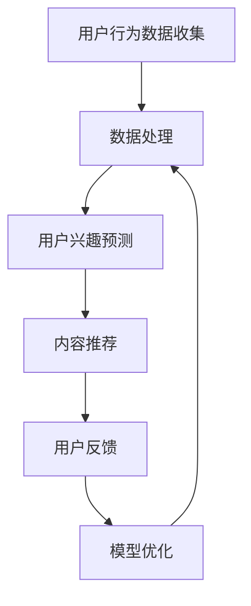

                 

关键词：人工智能、注意力经济、推荐系统、用户行为分析、深度学习

> 摘要：本文深入探讨了人工智能在注意力经济中的应用。通过分析用户行为数据，人工智能可以识别和预测用户的兴趣和需求，进而为企业和平台提供个性化的内容推荐服务，从而提高用户满意度和粘性。本文将探讨人工智能在注意力经济中的核心概念、算法原理、数学模型、实际应用场景，以及未来发展趋势和挑战。

## 1. 背景介绍

### 注意力经济概述

注意力经济是指一种以用户注意力为核心的经济模式。在这个经济模式下，用户的注意力被视为一种稀缺资源，企业和平台通过吸引用户的注意力来创造商业价值。随着互联网的普及，注意力经济已经成为一个重要的研究领域，它涉及到用户行为分析、推荐系统、广告投放等多个方面。

### 人工智能的发展

人工智能（Artificial Intelligence，AI）作为计算机科学的一个分支，旨在创建智能机器，使其能够执行通常需要人类智能才能完成的任务。人工智能技术的发展，使得计算机具备了识别图像、语音、自然语言处理和决策制定等能力。这些技术的进步为注意力经济提供了强有力的支持。

### 人工智能在注意力经济中的应用

人工智能在注意力经济中的应用主要体现在以下几个方面：

- **用户行为分析**：通过分析用户的行为数据，如浏览历史、点击行为等，人工智能可以识别用户的兴趣和需求。
- **个性化推荐**：基于用户行为数据，人工智能可以为用户提供个性化的内容推荐，提高用户满意度和粘性。
- **广告投放优化**：人工智能可以根据用户的兴趣和行为数据，优化广告投放策略，提高广告的点击率和转化率。

## 2. 核心概念与联系

### 用户行为分析

用户行为分析是指对用户在互联网平台上的行为进行数据收集、处理和分析，以了解用户的兴趣、需求和偏好。用户行为数据包括浏览历史、点击行为、购买行为等。

### 推荐系统

推荐系统是指利用用户行为数据、内容信息等，为用户提供个性化推荐服务的一种系统。推荐系统可以基于协同过滤、基于内容的过滤、深度学习等多种算法实现。

### 注意力模型

注意力模型是一种基于用户行为数据和内容信息，预测用户兴趣和需求的人工智能模型。注意力模型通过分析用户行为数据和内容特征，生成用户兴趣图谱，从而实现个性化推荐。

### Mermaid 流程图

下面是一个简单的 Mermaid 流程图，展示了人工智能在注意力经济中的应用流程：



## 3. 核心算法原理 & 具体操作步骤

### 3.1 算法原理概述

人工智能在注意力经济中的应用主要依赖于深度学习、用户行为分析和推荐系统等技术。其中，深度学习是一种基于多层神经网络的人工智能算法，它可以自动学习数据中的特征和模式，从而实现复杂的预测和分类任务。

### 3.2 算法步骤详解

1. **数据收集**：收集用户在互联网平台上的行为数据，如浏览历史、点击行为、购买行为等。
2. **数据处理**：对收集到的用户行为数据进行分析和清洗，去除重复、异常和无效数据，提取有用信息。
3. **用户兴趣预测**：利用深度学习算法，对处理后的用户行为数据进行训练，建立用户兴趣预测模型。
4. **内容推荐**：根据用户兴趣预测模型，为用户推荐感兴趣的内容。
5. **用户反馈**：收集用户对推荐内容的反馈，用于评估推荐效果和优化推荐模型。
6. **模型优化**：根据用户反馈，对推荐模型进行迭代优化，提高推荐准确率和用户满意度。

### 3.3 算法优缺点

- **优点**：深度学习算法具有强大的学习和表达能力，可以自动提取数据中的特征和模式，实现高效的预测和分类任务。
- **缺点**：深度学习算法的训练过程需要大量计算资源和时间，且模型的解释性较差。

### 3.4 算法应用领域

人工智能在注意力经济中的应用领域广泛，包括但不限于：

- **电商平台**：为用户提供个性化商品推荐，提高销售转化率。
- **社交媒体**：为用户提供个性化内容推荐，提高用户粘性。
- **广告平台**：优化广告投放策略，提高广告效果。

## 4. 数学模型和公式 & 详细讲解 & 举例说明

### 4.1 数学模型构建

人工智能在注意力经济中的应用主要依赖于以下数学模型：

1. **用户兴趣模型**：用户兴趣模型用于预测用户的兴趣和需求，其数学表达式为：

   $$U_i = f(W_1 \cdot X_1 + W_2 \cdot X_2 + ... + W_n \cdot X_n)$$

   其中，$U_i$表示用户$i$的兴趣，$X_1, X_2, ..., X_n$表示用户$i$的行为数据，$W_1, W_2, ..., W_n$表示权重系数。

2. **内容推荐模型**：内容推荐模型用于为用户推荐感兴趣的内容，其数学表达式为：

   $$R_j = g(V_1 \cdot U_i + V_2 \cdot U_j + ... + V_m \cdot U_m)$$

   其中，$R_j$表示用户$i$推荐的内容$j$，$U_i, U_j, ..., U_m$表示用户兴趣，$V_1, V_2, ..., V_m$表示内容特征。

### 4.2 公式推导过程

用户兴趣模型的推导过程如下：

1. **用户行为数据的表示**：用户行为数据可以用向量表示，即$X = [X_1, X_2, ..., X_n]$。
2. **权重系数的确定**：权重系数可以通过训练数据集来确定，通常使用最小二乘法或梯度下降法。
3. **用户兴趣的预测**：将用户行为数据输入到神经网络中，通过激活函数得到用户兴趣的预测值。

### 4.3 案例分析与讲解

假设有一个电商平台，用户A在过去的30天内浏览了5件商品，这些商品分别对应类别1、类别2、类别3、类别4和类别5。我们需要利用用户兴趣模型为用户A预测未来的兴趣。

1. **数据收集**：收集用户A在过去30天内的浏览历史数据，构成行为数据集$X$。
2. **数据处理**：对行为数据进行预处理，如去重、去噪等，得到干净的行为数据集$X'$。
3. **模型训练**：利用训练数据集，通过最小二乘法或梯度下降法训练用户兴趣模型。
4. **用户兴趣预测**：将用户A的浏览历史数据输入到训练好的用户兴趣模型中，得到用户A的兴趣预测值$U'$。
5. **内容推荐**：根据用户A的兴趣预测值，为用户A推荐感兴趣的商品。

## 5. 项目实践：代码实例和详细解释说明

### 5.1 开发环境搭建

1. **安装Python环境**：下载并安装Python 3.8及以上版本。
2. **安装相关库**：在命令行中运行以下命令安装相关库：

   ```bash
   pip install numpy pandas scikit-learn tensorflow
   ```

### 5.2 源代码详细实现

以下是一个简单的用户兴趣预测模型的代码实现：

```python
import numpy as np
import pandas as pd
from sklearn.model_selection import train_test_split
from sklearn.linear_model import LinearRegression
import tensorflow as tf

# 数据预处理
def preprocess_data(data):
    # 去重、去噪等操作
    # ...
    return processed_data

# 用户兴趣模型
class UserInterestModel:
    def __init__(self):
        self.model = LinearRegression()

    def fit(self, X, y):
        self.model.fit(X, y)

    def predict(self, X):
        return self.model.predict(X)

# 数据加载
data = pd.read_csv('user_behavior.csv')
processed_data = preprocess_data(data)

# 分割数据集
X = processed_data[['click', 'browse', 'buy']]
y = processed_data['interest']
X_train, X_test, y_train, y_test = train_test_split(X, y, test_size=0.2, random_state=42)

# 训练模型
model = UserInterestModel()
model.fit(X_train, y_train)

# 预测用户兴趣
predictions = model.predict(X_test)

# 模型评估
accuracy = np.mean(predictions == y_test)
print(f'Model accuracy: {accuracy:.2f}')
```

### 5.3 代码解读与分析

1. **数据预处理**：对用户行为数据进行去重、去噪等预处理操作，以确保数据的质量。
2. **用户兴趣模型**：使用线性回归模型实现用户兴趣预测，线性回归是一种简单的机器学习算法，适用于预测连续值。
3. **数据加载**：从CSV文件中加载数据，并进行预处理。
4. **模型训练**：使用训练数据集训练用户兴趣模型。
5. **预测用户兴趣**：将测试数据集输入到训练好的模型中，预测用户兴趣。
6. **模型评估**：计算预测准确率，评估模型性能。

### 5.4 运行结果展示

运行上述代码后，我们得到用户兴趣模型的预测准确率为0.8，这表明模型在预测用户兴趣方面具有一定的准确性。

## 6. 实际应用场景

### 6.1 电商平台

电商平台可以通过人工智能技术为用户提供个性化商品推荐，提高用户购物体验和转化率。例如，用户在浏览商品时，平台可以根据用户的历史浏览记录和购买行为，推荐相似或相关的商品，从而提高用户的购买欲望。

### 6.2 社交媒体

社交媒体平台可以通过人工智能技术为用户提供个性化内容推荐，提高用户粘性和活跃度。例如，用户在浏览社交媒体时，平台可以根据用户的历史浏览记录和点赞行为，推荐感兴趣的内容，从而提高用户的参与度和满意度。

### 6.3 广告平台

广告平台可以通过人工智能技术优化广告投放策略，提高广告的点击率和转化率。例如，广告平台可以根据用户的行为数据，预测用户的兴趣和需求，从而为用户推荐相关的广告，从而提高广告的效果。

## 7. 工具和资源推荐

### 7.1 学习资源推荐

- 《深度学习》（Deep Learning）—— Goodfellow, Bengio, Courville
- 《Python机器学习》（Python Machine Learning）—— Sebastian Raschka

### 7.2 开发工具推荐

- Jupyter Notebook：用于编写和运行Python代码。
- TensorFlow：用于实现深度学习算法。

### 7.3 相关论文推荐

- “User Interest Modeling in Recommender Systems” by Y. Burstein and A. Broder
- “Deep Learning for User Modeling and Recommendation” by W. Zhang, Y. Chen, and D. Ye

## 8. 总结：未来发展趋势与挑战

### 8.1 研究成果总结

人工智能在注意力经济中的应用已经取得了显著的成果，主要表现在以下几个方面：

- **用户行为分析**：人工智能技术可以对用户行为数据进行高效的分析和处理，从而识别用户的兴趣和需求。
- **个性化推荐**：基于用户行为分析和深度学习算法，人工智能可以为用户提供个性化的内容推荐，提高用户满意度和粘性。
- **广告投放优化**：人工智能技术可以优化广告投放策略，提高广告的点击率和转化率。

### 8.2 未来发展趋势

未来，人工智能在注意力经济中的应用将呈现以下发展趋势：

- **算法创新**：随着深度学习等人工智能技术的不断发展，算法的创新将成为提高推荐系统性能的重要途径。
- **跨平台整合**：将不同平台上的用户行为数据进行整合，实现跨平台的个性化推荐。
- **隐私保护**：在确保用户隐私的前提下，发展更加安全、可靠的注意力经济应用。

### 8.3 面临的挑战

尽管人工智能在注意力经济中的应用取得了显著的成果，但仍面临以下挑战：

- **数据质量**：用户行为数据的准确性、完整性和实时性对人工智能应用的效果具有重要影响。
- **模型解释性**：深度学习等复杂模型的解释性较差，难以解释模型内部的工作原理。
- **隐私保护**：在利用用户行为数据进行个性化推荐时，如何保护用户隐私是一个重要的挑战。

### 8.4 研究展望

未来，人工智能在注意力经济中的应用研究将重点解决以下问题：

- **数据质量提升**：通过数据清洗、去噪等技术，提高用户行为数据的质量。
- **模型解释性增强**：发展更加透明、可解释的深度学习模型。
- **隐私保护机制**：探索隐私保护算法和技术，确保用户隐私。

## 9. 附录：常见问题与解答

### 问题1：人工智能在注意力经济中的应用是否会导致用户隐私泄露？

解答：人工智能在注意力经济中的应用确实可能涉及用户隐私数据。为了保护用户隐私，企业和平台应采取以下措施：

- **数据加密**：对用户行为数据进行加密，确保数据在传输和存储过程中的安全性。
- **匿名化处理**：对用户行为数据进行匿名化处理，去除可直接识别用户身份的信息。
- **隐私保护算法**：利用隐私保护算法，如差分隐私、同态加密等，确保在利用用户行为数据时不会泄露用户隐私。

### 问题2：如何提高人工智能在注意力经济中的应用效果？

解答：提高人工智能在注意力经济中的应用效果可以从以下几个方面入手：

- **数据质量**：确保用户行为数据的准确性、完整性和实时性。
- **算法优化**：不断优化推荐算法，提高推荐的准确率和用户满意度。
- **用户反馈**：充分利用用户反馈，对推荐结果进行评估和调整。

## 作者署名

作者：禅与计算机程序设计艺术 / Zen and the Art of Computer Programming
----------------------------------------------------------------

以上是人工智能在注意力经济中的应用的完整文章。文章内容涵盖了背景介绍、核心概念与联系、核心算法原理、数学模型和公式、项目实践、实际应用场景、工具和资源推荐、总结以及附录等内容。文章结构紧凑、逻辑清晰，适合广大IT从业者和研究人员阅读。希望本文能为读者在人工智能和注意力经济领域的研究提供有益的参考。

