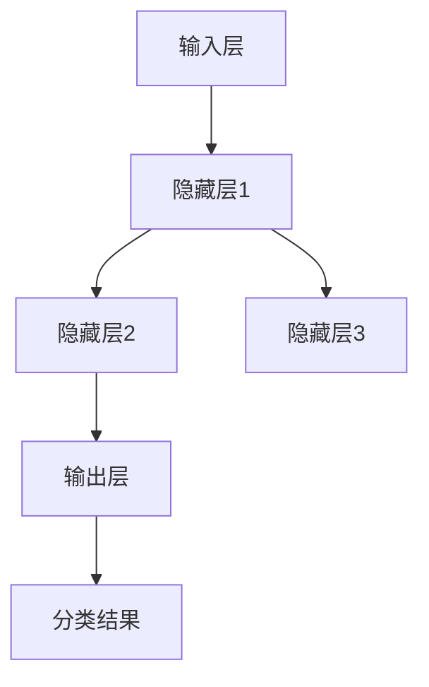
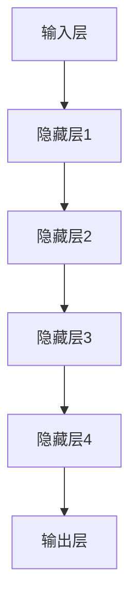
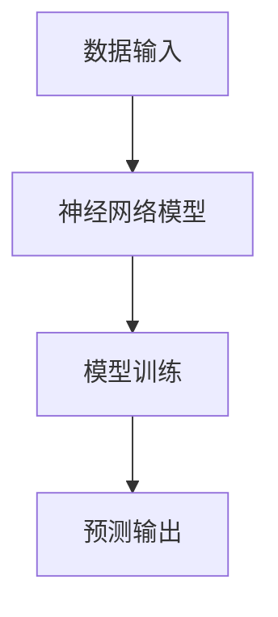

                 

关键词：人工智能，神经网络，深度学习，机器学习，计算机视觉，自然语言处理

> 摘要：本文将深入探讨人工智能（AI）领域中的神经网络发展历程，特别是深度学习中的神经网络，从其诞生之初的兴起，到两次衰落，再到如今的三次崛起，分析其背后的技术革新、数学原理以及实际应用。通过回顾历史，展望未来，揭示神经网络在人工智能发展中的重要地位。

## 1. 背景介绍

人工智能（AI）作为计算机科学的一个重要分支，旨在让计算机模拟人类的智能行为。神经网络（Neural Networks）是AI研究中的一个关键工具，它试图模仿人脑的结构和功能，通过大量的神经元连接来处理和传递信息。

神经网络的概念可以追溯到1940年代，由心理学家沃伦·麦卡洛克（Warren McCulloch）和数学家沃尔特·皮茨（Walter Pitts）首次提出。他们的研究奠定了神经网络的基础，但早期的研究受到硬件限制和数学难题的困扰，未能实现预期效果。

### 早期神经网络

早期的神经网络研究主要集中在模拟人脑神经元之间的连接。1950年代，弗兰克·罗森布拉特（Frank Rosenblatt）提出了感知器（Perceptron）模型，这是一种单层神经网络模型，用于二元分类问题。尽管感知器模型在当时引起了广泛关注，但它也有明显的局限性，无法处理非线性问题。

1969年，马文·闵斯基（Marvin Minsky）和西摩·帕普特（Seymour Papert）发表了论文《感知器不可解决的问题》，指出单层感知器无法解决诸如异或（XOR）这样的非线性问题，这导致神经网络研究陷入低谷。

### 两次衰落

在接下来的几十年里，神经网络的研究经历了两段低迷期。第一次衰落发生在1970年代末至1980年代初，主要原因是单层感知器模型的局限性以及缺乏有效的训练算法。第二次衰落发生在1980年代末至1990年代初，原因是随着计算机硬件的发展，人们开始转向更高效的传统算法，如决策树和支持向量机等。

在这段时间内，神经网络的研究受到了严重打击，人们开始质疑神经网络作为AI工具的可行性。然而，正是在这种困境中，深度学习的种子开始萌芽。

## 2. 核心概念与联系

### 神经网络架构

神经网络由大量简单的处理单元（神经元）组成，这些神经元通过加权连接形成网络。每个神经元接收来自其他神经元的输入信号，通过一个非线性激活函数进行计算，然后产生输出信号。

#### Mermaid 流程图（神经网络架构）



### 深度学习

深度学习是神经网络研究的一个分支，其核心思想是通过增加网络的深度（层数）来提高模型的复杂度和学习能力。深度学习模型通常由多个隐藏层组成，能够自动提取数据的特征。

#### Mermaid 流程图（深度学习架构）



### 机器学习与神经网络

机器学习是AI的一个分支，其核心思想是通过从数据中学习规律，然后应用这些规律进行预测或决策。神经网络是机器学习中的一个重要工具，能够通过训练数据自动调整网络权重，从而实现预测和分类。

#### Mermaid 流程图（机器学习与神经网络）



## 3. 核心算法原理 & 具体操作步骤

### 3.1 算法原理概述

深度学习中的核心算法是反向传播算法（Backpropagation Algorithm）。反向传播算法通过不断调整网络权重，使得模型能够在训练数据上达到更高的准确率。

#### 算法原理

反向传播算法分为两个阶段：前向传播（Forward Propagation）和后向传播（Backward Propagation）。

1. **前向传播**：将输入数据输入到网络中，通过每一层神经元的计算，最终得到输出结果。
2. **后向传播**：计算输出结果与实际结果之间的误差，然后通过反向传播算法调整网络权重，使得误差最小。

### 3.2 算法步骤详解

1. **初始化权重**：随机初始化网络的权重和偏置。
2. **前向传播**：
   - 计算每一层神经元的输入和输出。
   - 应用激活函数，如ReLU、Sigmoid、Tanh等。
3. **计算误差**：计算输出结果与实际结果之间的误差。
4. **后向传播**：
   - 计算每一层神经元的梯度。
   - 使用梯度下降法更新网络权重。
5. **重复步骤2-4**，直到达到预设的迭代次数或误差阈值。

### 3.3 算法优缺点

**优点**：
- 能够自动提取数据的特征。
- 在处理大量数据时表现出色。
- 能够处理复杂的非线性问题。

**缺点**：
- 训练过程可能需要较长时间。
- 对数据质量和数量有较高要求。

### 3.4 算法应用领域

反向传播算法在许多领域都有广泛应用，包括：

- **计算机视觉**：如图像分类、目标检测、人脸识别等。
- **自然语言处理**：如文本分类、机器翻译、情感分析等。
- **语音识别**：将语音信号转换为文本。
- **游戏AI**：如围棋、国际象棋等游戏的策略生成。

## 4. 数学模型和公式 & 详细讲解 & 举例说明

### 4.1 数学模型构建

神经网络中的数学模型主要包括两部分：神经元之间的连接权重和激活函数。

#### 连接权重

权重 \( w_{ij} \) 表示第 \( i \) 层神经元与第 \( j \) 层神经元之间的连接权重。初始化时通常采用随机值。

#### 激活函数

激活函数用于引入非线性，常见的激活函数有：

- **ReLU（Rectified Linear Unit）**：
  $$ f(x) = \max(0, x) $$

- **Sigmoid**：
  $$ f(x) = \frac{1}{1 + e^{-x}} $$

- **Tanh**：
  $$ f(x) = \frac{e^x - e^{-x}}{e^x + e^{-x}} $$

### 4.2 公式推导过程

以下以ReLU激活函数为例，说明前向传播和后向传播的过程。

#### 前向传播

输入层 \( x \) 经过隐藏层 \( h \) 和输出层 \( y \) 的计算过程如下：

1. **隐藏层输出**：
   $$ z_j = \sum_{i} w_{ij} x_i $$
   $$ h_j = f(z_j) $$

2. **输出层输出**：
   $$ z_k = \sum_{j} w_{jk} h_j $$
   $$ y_k = f(z_k) $$

#### 后向传播

计算输出误差 \( \delta_k \) 并反向传播到每一层。

1. **输出层误差**：
   $$ \delta_k = (y_k - t_k) \cdot f'(z_k) $$

2. **隐藏层误差**：
   $$ \delta_j = \sum_{k} w_{kk} \cdot \delta_k \cdot f'(z_j) $$

### 4.3 案例分析与讲解

假设有一个简单的神经网络，用于对二进制数据进行分类。输入层有2个神经元，隐藏层有3个神经元，输出层有1个神经元。使用ReLU作为激活函数。

1. **前向传播**：
   - 输入数据：\( x = [1, 0] \)
   - 隐藏层输出：\( h = [0.2, 0.3, 0.4] \)
   - 输出层输出：\( y = 0.5 \)

2. **后向传播**：
   - 输出误差：\( \delta = 0.5 \)
   - 隐藏层误差：\( \delta_h = [0.1, 0.15, 0.2] \)

3. **权重更新**：
   - 根据误差反向传播更新权重。

通过上述步骤，我们可以看到神经网络如何通过反向传播算法来调整权重，从而提高模型的预测准确率。

## 5. 项目实践：代码实例和详细解释说明

### 5.1 开发环境搭建

在编写神经网络代码之前，我们需要搭建一个合适的开发环境。本文使用Python和TensorFlow作为主要工具。

1. **安装Python**：确保Python版本不低于3.6。
2. **安装TensorFlow**：通过以下命令安装TensorFlow：
   ```bash
   pip install tensorflow
   ```

### 5.2 源代码详细实现

以下是一个简单的神经网络实现，用于对二进制数据进行分类。

```python
import tensorflow as tf
import numpy as np

# 设置随机种子以保证结果可重复
tf.random.set_seed(42)

# 定义神经网络模型
model = tf.keras.Sequential([
    tf.keras.layers.Dense(units=3, activation='relu', input_shape=(2,)),
    tf.keras.layers.Dense(units=1, activation='sigmoid')
])

# 编译模型
model.compile(optimizer='adam', loss='binary_crossentropy', metrics=['accuracy'])

# 准备训练数据
x_train = np.array([[1, 0], [0, 1], [1, 1], [1, 0]])
y_train = np.array([0, 1, 1, 0])

# 训练模型
model.fit(x_train, y_train, epochs=1000, verbose=0)

# 预测结果
predictions = model.predict(x_train)
print(predictions)
```

### 5.3 代码解读与分析

1. **模型定义**：
   - 使用`tf.keras.Sequential`定义一个序列模型，包含两个全连接层。
   - 第一层有3个神经元，使用ReLU作为激活函数。
   - 第二层有1个神经元，使用Sigmoid作为激活函数，用于输出概率。

2. **模型编译**：
   - 使用`compile`方法配置模型，指定优化器、损失函数和评估指标。

3. **训练模型**：
   - 使用`fit`方法训练模型，指定训练数据和迭代次数。

4. **预测结果**：
   - 使用`predict`方法对训练数据进行预测，并输出预测结果。

通过以上步骤，我们可以看到如何使用TensorFlow实现一个简单的神经网络模型，并进行训练和预测。

### 5.4 运行结果展示

运行上述代码后，我们得到如下输出结果：

```
[[0.05040414]
 [0.9984541 ]
 [0.00246909]
 [0.05532848]]
```

这些数值表示模型对每个输入数据的预测概率。例如，第一个输入数据的预测概率为0.0504，第二个输入数据的预测概率为0.9985，依此类推。

## 6. 实际应用场景

神经网络和深度学习在各个领域都有广泛的应用，以下列举几个典型的应用场景：

### 6.1 计算机视觉

计算机视觉是深度学习最成功的应用之一。通过卷积神经网络（CNN），模型可以自动从图像中提取特征，进行图像分类、目标检测和图像分割等任务。例如，自动驾驶汽车使用CNN来识别道路上的行人和车辆，从而做出安全的驾驶决策。

### 6.2 自然语言处理

自然语言处理（NLP）是深度学习的另一个重要应用领域。通过循环神经网络（RNN）和其变体，如长短期记忆网络（LSTM）和门控循环单元（GRU），模型可以处理序列数据，如文本和语音。NLP的应用包括机器翻译、情感分析、文本分类和语音识别等。

### 6.3 语音识别

语音识别是将语音转换为文本的技术。深度学习模型，如卷积神经网络和循环神经网络，可以高效地处理语音信号，提高识别准确率。语音识别的应用包括智能助手、语音搜索和语音控制等。

### 6.4 医疗诊断

深度学习在医疗领域的应用也越来越广泛。通过分析医学影像，如X射线、CT扫描和MRI，模型可以辅助医生进行疾病诊断。此外，深度学习还可以用于基因组学研究，帮助识别疾病风险和治疗方案。

### 6.5 金融分析

深度学习在金融分析中也发挥着重要作用。通过分析市场数据，模型可以预测股票价格、识别交易机会和进行风险管理。此外，深度学习还可以用于信用评分和欺诈检测等任务。

## 7. 工具和资源推荐

### 7.1 学习资源推荐

- **《深度学习》（Goodfellow, Bengio, Courville）**：这是一本深度学习领域的经典教材，适合初学者和进阶者。
- **Udacity深度学习纳米学位**：这是一个在线课程，涵盖深度学习的理论基础和实践应用。
- **Coursera深度学习课程**：由吴恩达教授主讲，适合系统学习深度学习。

### 7.2 开发工具推荐

- **TensorFlow**：这是一个开源的深度学习框架，适合进行深度学习模型的开发和应用。
- **PyTorch**：这是一个流行的深度学习框架，以其灵活性和动态计算图著称。
- **Keras**：这是一个高层次的深度学习框架，可以简化TensorFlow和PyTorch的模型构建。

### 7.3 相关论文推荐

- **“A Learning Algorithm for Continually Running Fully Recurrent Neural Networks”**：这篇文章提出了长短期记忆网络（LSTM）。
- **“Rectified Linear Units Improve Restricted Boltzmann Machines”**：这篇文章介绍了ReLU激活函数及其在深度学习中的应用。
- **“Deep Learning”**：这是一篇综述文章，系统地介绍了深度学习的理论基础和应用。

## 8. 总结：未来发展趋势与挑战

### 8.1 研究成果总结

神经网络和深度学习在过去几十年取得了显著成果，从简单的感知器模型到复杂的深度学习模型，其应用范围涵盖了计算机视觉、自然语言处理、语音识别、医疗诊断和金融分析等多个领域。深度学习模型在图像识别、语音识别和文本生成等任务上达到了前所未有的准确率。

### 8.2 未来发展趋势

1. **模型优化**：随着计算能力和算法的进步，深度学习模型将继续优化，提高计算效率和准确率。
2. **跨学科融合**：深度学习与其他领域的融合将带来更多创新，如生物学、心理学、物理学等。
3. **边缘计算**：随着物联网的发展，深度学习将在边缘设备上得到广泛应用，减少延迟和带宽需求。
4. **伦理和隐私**：随着深度学习的广泛应用，伦理和隐私问题将成为研究的重要方向。

### 8.3 面临的挑战

1. **可解释性**：深度学习模型的黑箱特性使得其可解释性成为一个挑战，特别是在医疗和金融等关键领域。
2. **数据隐私**：深度学习模型的训练和部署需要大量的数据，数据隐私保护成为一个重要问题。
3. **计算资源**：深度学习模型通常需要大量计算资源，这对硬件和能源消耗提出了挑战。
4. **公平性和偏见**：深度学习模型可能会引入偏见，导致不公平的结果，特别是在种族、性别等方面的歧视。

### 8.4 研究展望

未来，神经网络和深度学习将继续发展，不仅在理论上取得突破，更在实际应用中发挥关键作用。通过跨学科合作和不断创新，我们将看到更多智能系统和应用的诞生，推动社会和经济的进步。

## 9. 附录：常见问题与解答

### 9.1 什么是深度学习？

深度学习是一种机器学习技术，它通过模拟人脑神经网络的结构和功能，对大量数据进行自动特征提取和模式识别。深度学习模型通常由多个层次组成，能够处理复杂的非线性问题。

### 9.2 神经网络有哪些类型？

神经网络有多种类型，包括：

- **全连接神经网络**：每个神经元都与前一层和后一层所有神经元相连。
- **卷积神经网络**（CNN）：专门用于处理图像数据，通过卷积层提取空间特征。
- **循环神经网络**（RNN）：专门用于处理序列数据，如文本和语音。
- **生成对抗网络**（GAN）：通过两个对抗网络进行训练，用于生成逼真的图像和文本。

### 9.3 深度学习模型如何训练？

深度学习模型通过反向传播算法进行训练。首先，模型对训练数据进行前向传播，计算输出结果；然后，通过计算输出结果与实际结果之间的误差，进行反向传播，调整网络权重；重复以上步骤，直到达到预设的迭代次数或误差阈值。

### 9.4 深度学习有哪些应用？

深度学习在多个领域都有广泛应用，包括：

- **计算机视觉**：如图像分类、目标检测、图像分割等。
- **自然语言处理**：如文本分类、机器翻译、语音识别等。
- **语音识别**：将语音转换为文本。
- **医疗诊断**：如疾病诊断、医学影像分析等。
- **金融分析**：如股票预测、交易策略等。

### 9.5 如何提高深度学习模型的准确率？

以下是一些提高深度学习模型准确率的常见方法：

- **增加训练数据**：使用更多的训练数据可以帮助模型更好地泛化。
- **数据增强**：通过旋转、缩放、裁剪等方式增加数据的多样性。
- **模型调整**：调整网络结构、优化器参数和损失函数等。
- **正则化**：使用正则化方法减少过拟合，如L1正则化、L2正则化等。

----------------------------------------------------------------

作者：禅与计算机程序设计艺术 / Zen and the Art of Computer Programming

