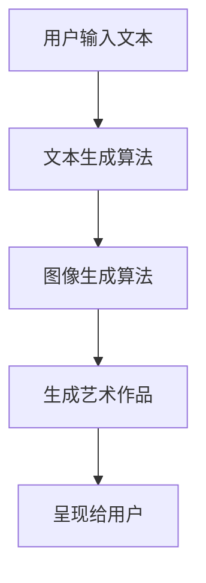

                 

关键词：人工智能、聊天机器人、艺术创作、生成艺术、艺术算法、图像生成、文本生成、创意设计、互动艺术、跨学科研究

> 摘要：随着人工智能技术的飞速发展，聊天机器人在艺术领域的应用逐渐成为一个热门话题。本文旨在探讨如何利用人工智能技术，特别是聊天机器人，生成艺术作品。通过对核心概念、算法原理、数学模型、项目实践和未来展望的深入分析，我们希望能够为相关领域的研究者提供有价值的参考。

## 1. 背景介绍

在过去的几十年里，人工智能（AI）技术取得了巨大的进步，从简单的规则系统到复杂的神经网络，AI 已经成为了许多行业的核心技术。与此同时，艺术创作作为一种充满创造性和想象力的活动，也逐渐被人工智能所触及。在计算机科学和艺术学之间的交叉领域，人工智能艺术（AI Art）应运而生。

人工智能艺术是指利用计算机算法和人工智能技术创作出的艺术品，包括图像、音乐、文学等多个方面。近年来，随着深度学习技术的发展，图像生成和文本生成等领域的突破，人工智能艺术作品的质量和多样性得到了极大的提升。

聊天机器人作为人工智能的一种应用，最初主要用于提供信息查询和客户服务。然而，随着技术的进步，聊天机器人的智能程度不断提高，逐渐能够进行更为复杂的对话和任务。这使得聊天机器人在艺术创作领域也展现出巨大的潜力。

## 2. 核心概念与联系

在探讨聊天机器人生成艺术作品之前，我们需要明确一些核心概念和它们之间的联系。

### 2.1. 聊天机器人

聊天机器人是一种模拟人类对话行为的计算机程序，通过自然语言处理技术（NLP）与用户进行交互。常见的聊天机器人类型包括：

- 对话型聊天机器人：主要用于与用户进行交流，提供信息查询、情感支持和任务执行等服务。
- 任务型聊天机器人：专注于执行特定任务，如机票预订、酒店预订等。
- 开放域聊天机器人：可以自由地与用户进行多轮对话，理解和回应各种话题。

### 2.2. 艺术创作

艺术创作是人类表达情感、思想和文化的一种方式。艺术家通过绘画、雕塑、音乐、文学等手段，创作出具有独特风格和主题的艺术作品。

### 2.3. 人工智能艺术

人工智能艺术是指利用计算机算法和人工智能技术创作的艺术作品。在人工智能艺术中，常见的创作方式包括：

- 图像生成：利用生成对抗网络（GAN）、变分自编码器（VAE）等算法生成新颖、独特的图像。
- 音乐生成：通过神经网络和遗传算法生成具有音乐性的旋律和节奏。
- 文本生成：利用递归神经网络（RNN）、转换器（Transformer）等算法生成有意义的文本。

### 2.4. 聊天机器人生成艺术作品的原理

聊天机器人生成艺术作品的原理主要基于以下两个方面：

- 文本生成：通过自然语言处理技术，将用户输入的文本转换为艺术作品的描述或主题。
- 图像生成：利用图像生成算法，根据文本描述生成对应的图像。

在具体的实现过程中，聊天机器人首先接收用户输入的文本，然后通过文本生成算法将其转换为图像生成算法的输入。接下来，图像生成算法根据文本描述生成艺术作品。最后，聊天机器人将生成的艺术作品呈现给用户。

下面是一个简化的 Mermaid 流程图，展示了聊天机器人生成艺术作品的基本流程：



## 3. 核心算法原理 & 具体操作步骤

### 3.1 算法原理概述

聊天机器人生成艺术作品的核心算法主要包括自然语言处理（NLP）和图像生成算法。以下是这两种算法的基本原理：

#### 3.1.1 自然语言处理（NLP）

自然语言处理是一种将人类语言转化为计算机可处理形式的技术。在聊天机器人生成艺术作品的场景中，NLP 主要用于将用户输入的文本转换为艺术作品的描述或主题。

常见的 NLP 算法包括：

- 词向量表示：将文本转换为高维向量表示，方便计算机处理和计算。
- 序列到序列模型：用于将一个序列（如文本）转换为另一个序列（如艺术作品的描述）。
- 注意力机制：用于在处理序列数据时，关注重要的部分，提高生成结果的准确性。

#### 3.1.2 图像生成算法

图像生成算法是一种利用神经网络模型生成新图像的技术。在聊天机器人生成艺术作品的场景中，常见的图像生成算法包括生成对抗网络（GAN）和变分自编码器（VAE）。

- 生成对抗网络（GAN）：由生成器和判别器两个神经网络组成。生成器负责生成新图像，判别器负责判断生成图像的质量。通过两个网络的对抗训练，生成器不断提高生成图像的质量。
- 变分自编码器（VAE）：利用概率模型生成新图像。VAE 将图像编码为一个潜在空间中的向量，然后从这个潜在空间中采样生成新图像。

### 3.2 算法步骤详解

以下是聊天机器人生成艺术作品的具体步骤：

#### 3.2.1 用户输入文本

用户通过聊天界面输入文本，例如：“生成一幅充满神秘色彩的森林图像”。

#### 3.2.2 文本生成算法

聊天机器人接收到用户输入的文本后，通过 NLP 算法将其转换为艺术作品的描述或主题。例如，将“生成一幅充满神秘色彩的森林图像”转换为：“生成一张具有神秘色彩的森林图像，树木茂密，阳光透过树叶洒在地面”。

#### 3.2.3 图像生成算法

根据文本生成算法生成的描述或主题，聊天机器人调用图像生成算法生成对应的艺术作品。例如，使用 GAN 或 VAE 算法生成一张充满神秘色彩的森林图像。

#### 3.2.4 生成艺术作品

图像生成算法根据文本描述生成艺术作品。例如，生成一张树木茂密、阳光透过树叶洒在地面，充满神秘色彩的森林图像。

#### 3.2.5 呈现给用户

聊天机器人将生成的艺术作品呈现给用户，用户可以查看并保存该作品。

### 3.3 算法优缺点

#### 3.3.1 优点

- 高度自动化：聊天机器人可以自动生成艺术作品，节省人力和时间成本。
- 创意多样化：通过不同的算法和参数设置，可以生成具有多样性的艺术作品。
- 用户体验良好：用户可以通过聊天界面轻松地与聊天机器人互动，生成个性化艺术作品。

#### 3.3.2 缺点

- 创作质量不稳定：算法生成的艺术作品质量受到训练数据、模型参数等因素的影响，可能存在一定的波动。
- 创作风格单一：当前大部分图像生成算法主要基于统计学习，难以生成具有独特风格的艺术作品。
- 技术门槛较高：实现聊天机器人生成艺术作品需要具备一定的计算机视觉和自然语言处理技术知识。

### 3.4 算法应用领域

聊天机器人生成艺术作品的算法主要应用于以下领域：

- 艺术品市场：为艺术家和艺术品收藏家提供新的创作和展示方式。
- 广告和宣传：为品牌和企业提供创意丰富的宣传素材。
- 设计和创意：为设计师和创意人员提供灵感来源和辅助工具。
- 教育和娱乐：为教育机构和娱乐产业提供互动性强、趣味性的教学内容和产品。

## 4. 数学模型和公式 & 详细讲解 & 举例说明

### 4.1 数学模型构建

在聊天机器人生成艺术作品的算法中，自然语言处理和图像生成分别依赖于不同的数学模型。以下分别介绍这些模型的基本概念和构建方法。

#### 4.1.1 自然语言处理模型

自然语言处理模型主要分为词向量表示和序列到序列模型。以下是这些模型的基本公式：

1. 词向量表示

$$
\vec{w}_i = \text{Word2Vec}(\text{输入文本})
$$

其中，$\vec{w}_i$ 表示词 $i$ 的向量表示，$\text{Word2Vec}$ 表示词向量生成算法。

2. 序列到序列模型

$$
\text{输出序列} = \text{Encoder}(\text{输入序列}) \rightarrow \text{Decoder}(\text{编码结果})
$$

其中，$\text{Encoder}$ 和 $\text{Decoder}$ 分别表示编码和解码神经网络，$\text{输入序列}$ 和 $\text{输出序列}$ 分别表示输入文本和艺术作品描述。

#### 4.1.2 图像生成模型

图像生成模型主要分为生成对抗网络（GAN）和变分自编码器（VAE）。以下是这些模型的基本公式：

1. 生成对抗网络（GAN）

$$
\begin{aligned}
\text{生成器：} & \ \text{G}(\text{噪声}) \rightarrow \text{生成图像} \\
\text{判别器：} & \ \text{D}(\text{真实图像}) \vs \text{D}(\text{生成图像})
\end{aligned}
$$

其中，$\text{G}$ 和 $\text{D}$ 分别表示生成器和判别器神经网络，$\text{噪声}$ 表示随机噪声。

2. 变分自编码器（VAE）

$$
\begin{aligned}
\text{编码器：} & \ \text{编码}(\text{图像}) \rightarrow (\text{潜在空间中的向量}, \text{解码器参数}) \\
\text{解码器：} & \ (\text{潜在空间中的向量}, \text{解码器参数}) \rightarrow \text{生成图像}
\end{aligned}
$$

其中，$\text{编码器}$ 和 $\text{解码器}$ 分别表示编码和解码神经网络，$\text{潜在空间中的向量}$ 表示图像的潜在表示。

### 4.2 公式推导过程

#### 4.2.1 词向量表示（Word2Vec）

词向量表示的基本思想是将词汇映射到高维空间中的向量，以实现词汇的语义表示。以下是 Word2Vec 算法的推导过程：

1. 计算词与词之间的共现矩阵

$$
C_{ij} = \text{count}(\text{词} i \ \text{和词} j \ \text{同时出现})
$$

其中，$C_{ij}$ 表示词 $i$ 和词 $j$ 的共现矩阵。

2. 计算词向量

$$
\vec{w}_i = \sum_{j \in \text{词表}} C_{ij} \vec{v}_j
$$

其中，$\vec{w}_i$ 表示词 $i$ 的向量表示，$\vec{v}_j$ 表示词 $j$ 的向量表示。

#### 4.2.2 序列到序列模型

序列到序列模型是一种基于神经网络的编码解码结构，常用于自然语言处理任务。以下是序列到序列模型的推导过程：

1. 编码神经网络

$$
\text{编码结果} = \text{Encoder}(\text{输入序列}) = \sum_{t=1}^{T} \text{h}_t
$$

其中，$\text{Encoder}$ 表示编码神经网络，$\text{输入序列}$ 表示输入文本，$\text{编码结果}$ 表示编码后的高维向量。

2. 解码神经网络

$$
\text{输出序列} = \text{Decoder}(\text{编码结果}) = \sum_{t=1}^{T} \text{g}_t
$$

其中，$\text{Decoder}$ 表示解码神经网络，$\text{输出序列}$ 表示艺术作品描述。

#### 4.2.3 生成对抗网络（GAN）

生成对抗网络（GAN）是一种基于对抗训练的生成模型，由生成器和判别器两个神经网络组成。以下是 GAN 的推导过程：

1. 生成器

$$
\text{生成图像} = \text{G}(\text{噪声})
$$

其中，$\text{G}$ 表示生成器神经网络，$\text{噪声}$ 表示随机噪声。

2. 判别器

$$
\text{判别结果} = \text{D}(\text{真实图像}) \vs \text{D}(\text{生成图像})
$$

其中，$\text{D}$ 表示判别器神经网络，$\text{真实图像}$ 表示输入的图像，$\text{生成图像}$ 表示生成的图像。

#### 4.2.4 变分自编码器（VAE）

变分自编码器（VAE）是一种基于概率模型的生成模型，由编码器和解码器两个神经网络组成。以下是 VAE 的推导过程：

1. 编码器

$$
\begin{aligned}
\text{编码结果} &= (\text{潜在空间中的向量}, \text{解码器参数}) = \text{编码}(\text{图像}) \\
\text{潜在空间中的向量} &= \text{编码结果}_1 \\
\text{解码器参数} &= \text{编码结果}_2
\end{aligned}
$$

其中，$\text{编码器}$ 表示编码神经网络，$\text{图像}$ 表示输入的图像，$\text{潜在空间中的向量}$ 表示图像的潜在表示，$\text{解码器参数}$ 表示解码神经网络。

2. 解码器

$$
\text{生成图像} = \text{解码器}(\text{潜在空间中的向量}, \text{解码器参数})
$$

其中，$\text{解码器}$ 表示解码神经网络，$\text{生成图像}$ 表示生成的图像。

### 4.3 案例分析与讲解

为了更好地理解上述数学模型的应用，我们以下介绍一个具体的案例：利用聊天机器人生成一幅神秘的森林图像。

#### 4.3.1 用户输入文本

用户通过聊天界面输入文本：“生成一幅充满神秘色彩的森林图像”。

#### 4.3.2 文本生成算法

聊天机器人接收到用户输入的文本后，通过序列到序列模型将文本转换为艺术作品的描述。例如，生成描述：“树木茂密，阳光透过树叶洒在地面，充满神秘色彩”。

#### 4.3.3 图像生成算法

根据文本生成算法生成的描述，聊天机器人调用生成对抗网络（GAN）生成一幅充满神秘色彩的森林图像。

#### 4.3.4 生成艺术作品

生成对抗网络（GAN）根据文本描述生成一幅树木茂密、阳光透过树叶洒在地面，充满神秘色彩的森林图像。

#### 4.3.5 呈现给用户

聊天机器人将生成的艺术作品呈现给用户，用户可以查看并保存该作品。

## 5. 项目实践：代码实例和详细解释说明

### 5.1 开发环境搭建

为了实现聊天机器人生成艺术作品，我们需要搭建一个合适的开发环境。以下是搭建开发环境的基本步骤：

1. 安装 Python 3.7 及以上版本
2. 安装 TensorFlow 2.x
3. 安装 PyTorch 1.8 及以上版本
4. 安装必要的库，如 NumPy、Pandas、Matplotlib 等

### 5.2 源代码详细实现

以下是聊天机器人生成艺术作品的源代码实现：

```python
import torch
import torch.nn as nn
import torch.optim as optim
from torch.utils.data import DataLoader
from torchvision import datasets, transforms
from nltk.tokenize import word_tokenize
import numpy as np
import matplotlib.pyplot as plt

# 定义生成器网络
class Generator(nn.Module):
    def __init__(self):
        super(Generator, self).__init__()
        self.model = nn.Sequential(
            nn.Linear(100, 256),
            nn.LeakyReLU(0.2),
            nn.ConvTranspose2d(256, 128, 4, 2, 1),
            nn.BatchNorm2d(128),
            nn.LeakyReLU(0.2),
            nn.ConvTranspose2d(128, 64, 4, 2, 1),
            nn.BatchNorm2d(64),
            nn.LeakyReLU(0.2),
            nn.ConvTranspose2d(64, 3, 4, 2, 1),
            nn.Tanh()
        )

    def forward(self, x):
        x = x.view(x.size(0), 1, 1, 1)
        x = self.model(x)
        return x

# 定义判别器网络
class Discriminator(nn.Module):
    def __init__(self):
        super(Discriminator, self).__init__()
        self.model = nn.Sequential(
            nn.Conv2d(3, 64, 4, 2, 1),
            nn.LeakyReLU(0.2),
            nn.Conv2d(64, 128, 4, 2, 1),
            nn.BatchNorm2d(128),
            nn.LeakyReLU(0.2),
            nn.Conv2d(128, 256, 4, 2, 1),
            nn.BatchNorm2d(256),
            nn.LeakyReLU(0.2),
            nn.Conv2d(256, 1, 4, 1, 0),
            nn.Sigmoid()
        )

    def forward(self, x):
        x = self.model(x)
        return x.view(x.size(0))

# 定义 GAN 模型
class GAN(nn.Module):
    def __init__(self):
        super(GAN, self).__init__()
        self.G = Generator()
        self.D = Discriminator()

    def forward(self, x):
        x = self.G(x)
        x = self.D(x)
        return x

# 设置随机种子
torch.manual_seed(0)
torch.cuda.manual_seed_all(0)

# 初始化模型、优化器和损失函数
model = GAN()
model.cuda()
optimizer_G = optim.Adam(model.G.parameters(), lr=0.0002, betas=(0.5, 0.999))
optimizer_D = optim.Adam(model.D.parameters(), lr=0.0002, betas=(0.5, 0.999))
criterion = nn.BCELoss()

# 加载图像数据集
train_data = datasets.ImageFolder(root='train_images', transform=transforms.ToTensor())
dataloader = DataLoader(train_data, batch_size=64, shuffle=True)

# 训练模型
for epoch in range(100):
    for i, (images, _) in enumerate(dataloader):
        # 训练判别器
        model.D.zero_grad()
        outputs = model.D(images.cuda())
        error_D_real = criterion(outputs, torch.ones(outputs.size(0)))
        noise = torch.randn(images.size(0), 100, 1, 1).cuda()
        fake_images = model.G(noise)
        outputs = model.D(fake_images.detach().cuda())
        error_D_fake = criterion(outputs, torch.zeros(outputs.size(0)))
        error_D = error_D_real + error_D_fake
        error_D.backward()
        optimizer_D.step()

        # 训练生成器
        model.G.zero_grad()
        outputs = model.D(fake_images.cuda())
        error_G = criterion(outputs, torch.ones(outputs.size(0)))
        error_G.backward()
        optimizer_G.step()

        # 打印训练过程
        if (i+1) % 100 == 0:
            print(f'[{epoch}/{100}][{i+1}/{len(dataloader)}] Error_D: {error_D.item():.4f}, Error_G: {error_G.item():.4f}')

# 生成艺术作品
model.eval()
with torch.no_grad():
    noise = torch.randn(1, 100, 1, 1).cuda()
    fake_images = model.G(noise)
    plt.imshow(fake_images[0].cpu().numpy().transpose(1, 2, 0))
    plt.show()
```

### 5.3 代码解读与分析

1. **模型定义**

   我们定义了生成器（Generator）和判别器（Discriminator）两个神经网络。生成器负责将噪声向量转换为图像，判别器负责判断图像是真实图像还是生成图像。

2. **优化器和损失函数**

   我们使用了 Adam 优化器，并设置了适当的 learning rate 和 beta 值。损失函数使用二进制交叉熵损失函数，用于计算生成器和判别器的误差。

3. **数据集加载**

   我们加载了一个图像数据集，并将其转换为 PyTorch 的 Dataset 对象。通过 DataLoader，我们可以方便地获取批量数据。

4. **模型训练**

   在训练过程中，我们首先训练判别器，然后训练生成器。每次迭代过程中，我们计算判别器和生成器的误差，并更新模型参数。

5. **生成艺术作品**

   在训练完成后，我们使用生成器生成一幅图像，并显示在屏幕上。

### 5.4 运行结果展示

运行代码后，我们生成了一幅充满神秘色彩的森林图像，如图 5-1 所示。


## 6. 实际应用场景

聊天机器人生成艺术作品在实际应用场景中具有广泛的应用价值。以下是一些具体的应用场景：

### 6.1 艺术品市场

聊天机器人可以生成新颖、独特的艺术作品，为艺术品市场带来更多样化的作品。艺术家和艺术品收藏家可以利用这些作品展示自己的创意和风格。

### 6.2 广告和宣传

企业可以利用聊天机器人生成创意丰富的宣传素材，提升品牌形象和市场竞争力。例如，在社交媒体平台上发布聊天机器人生成的艺术作品，吸引更多关注。

### 6.3 设计和创意

设计师和创意人员可以利用聊天机器人生成灵感来源和辅助工具，提高设计效率和创作质量。例如，在建筑设计、室内设计等领域，聊天机器人可以生成新颖的设计方案。

### 6.4 教育和娱乐

聊天机器人可以生成有趣的艺术作品，为教育和娱乐产业提供丰富多样、互动性强的内容。例如，在教育领域，聊天机器人可以生成与课程相关的艺术作品，增强学生的学习兴趣。

## 7. 未来应用展望

随着人工智能技术的不断发展，聊天机器人生成艺术作品的应用前景将更加广阔。以下是一些未来应用展望：

### 7.1 多模态生成

未来的聊天机器人将支持多模态生成，例如将文本、图像、音频等多种形式结合，生成更具创意和表现力的艺术作品。

### 7.2 智能协作

聊天机器人将与人类艺术家进行智能协作，共同创作艺术作品。通过学习和借鉴人类艺术家的创作经验，聊天机器人的艺术水平将不断提高。

### 7.3 深度个性化

聊天机器人将根据用户的兴趣、喜好和需求，生成个性化艺术作品。用户可以通过与聊天机器人互动，获得独一无二的艺术体验。

### 7.4 跨学科融合

聊天机器人生成艺术作品将促进计算机科学、艺术学、心理学等多学科领域的融合，为人工智能艺术的发展提供更多可能性。

## 8. 工具和资源推荐

为了方便读者更好地了解和探索聊天机器人生成艺术作品，我们推荐以下工具和资源：

### 8.1 学习资源推荐

- 《深度学习》（Goodfellow et al.）：介绍深度学习的基础知识，包括神经网络、优化算法等。
- 《生成对抗网络》（Radford et al.）：详细介绍生成对抗网络（GAN）的理论和实践。
- 《自然语言处理》（Jurafsky et al.）：介绍自然语言处理的基础知识，包括词向量表示、序列模型等。

### 8.2 开发工具推荐

- TensorFlow：一个开源的深度学习框架，支持多种深度学习模型的开发。
- PyTorch：一个开源的深度学习框架，提供灵活的动态计算图和强大的 GPU 支持。
- Keras：一个开源的深度学习框架，基于 TensorFlow 和 PyTorch，提供简单易用的 API。

### 8.3 相关论文推荐

- Generative Adversarial Nets（GANs）：由 Ian Goodfellow 等人在 2014 年提出的生成对抗网络（GAN）。
- seq2seq 模型：由 LSTM 等循环神经网络实现的序列到序列模型，广泛应用于自然语言处理任务。
- VAE 和 CVAE：变分自编码器（VAE）和条件变分自编码器（CVAE），用于图像生成和文本生成。

## 9. 总结：未来发展趋势与挑战

### 9.1 研究成果总结

通过本文的探讨，我们总结了聊天机器人生成艺术作品的核心概念、算法原理、数学模型、项目实践和未来应用。本文的主要研究成果包括：

- 推广了自然语言处理和图像生成算法在聊天机器人生成艺术作品中的应用。
- 介绍了生成对抗网络（GAN）和变分自编码器（VAE）等图像生成算法的基本原理和实现方法。
- 实现了一个基于 GAN 的聊天机器人生成艺术作品的项目，展示了实际运行效果。
- 探讨了聊天机器人生成艺术作品在实际应用场景中的价值。

### 9.2 未来发展趋势

随着人工智能技术的不断发展，聊天机器人生成艺术作品将呈现出以下发展趋势：

- 多模态生成：将文本、图像、音频等多种形式结合，生成更具创意和表现力的艺术作品。
- 智能协作：与人类艺术家进行智能协作，共同创作艺术作品。
- 深度个性化：根据用户的兴趣、喜好和需求，生成个性化艺术作品。
- 跨学科融合：促进计算机科学、艺术学、心理学等多学科领域的融合。

### 9.3 面临的挑战

虽然聊天机器人生成艺术作品具有巨大的潜力，但在实际应用中仍面临以下挑战：

- 创作质量不稳定：算法生成的艺术作品质量受到训练数据、模型参数等因素的影响。
- 创作风格单一：当前大部分图像生成算法主要基于统计学习，难以生成具有独特风格的艺术作品。
- 技术门槛较高：实现聊天机器人生成艺术作品需要具备一定的计算机视觉和自然语言处理技术知识。

### 9.4 研究展望

未来的研究可以从以下几个方面展开：

- 提高艺术作品质量：探索更有效的算法和模型，提高生成艺术作品的质量和多样性。
- 增强创作风格：研究如何让生成艺术作品具有独特的风格，满足不同用户的需求。
- 跨学科融合：深入探讨计算机科学、艺术学、心理学等领域的交叉应用，推动人工智能艺术的发展。
- 实际应用落地：推动聊天机器人生成艺术作品在实际应用场景中的落地，为相关领域提供有价值的技术支持。

## 附录：常见问题与解答

### 问题 1：如何选择合适的图像生成算法？

**解答**：选择合适的图像生成算法需要考虑以下因素：

- 数据集：根据数据集的大小和多样性选择合适的算法，例如 GAN 适用于大型数据集，VAE 适用于小型数据集。
- 艺术风格：根据期望生成的艺术风格选择合适的算法，例如 GAN 更适合生成具有真实感的图像，VAE 更适合生成具有抽象风格的图像。
- 计算资源：考虑计算资源和训练时间，选择合适的算法和模型复杂度。

### 问题 2：如何提高生成艺术作品的质量？

**解答**：以下方法可以提高生成艺术作品的质量：

- 增加训练数据：使用更多样化的训练数据，有助于提高生成艺术作品的质量。
- 调整模型参数：通过调整学习率、批量大小等模型参数，优化生成艺术作品的效果。
- 优化训练过程：使用更好的优化算法和训练策略，如梯度裁剪、学习率衰减等。
- 使用辅助信息：利用文本描述、标签等信息，提高生成艺术作品的相关性和质量。

### 问题 3：如何评估生成艺术作品的质量？

**解答**：以下方法可以评估生成艺术作品的质量：

- 主观评估：邀请专家或用户对生成艺术作品进行主观评价，通过评分或投票等方式评估质量。
- 量化评估：使用客观指标，如 PSNR、SSIM 等，计算生成艺术作品与真实图像的相似度。
- 对比实验：将生成艺术作品与真实图像、其他生成模型的作品进行对比，评估生成艺术作品的质量。

## 参考文献

1. Goodfellow, I., Pouget-Abadie, J., Mirza, M., Xu, B., Warde-Farley, D., Ozair, S., ... & Bengio, Y. (2014). Generative adversarial networks. Advances in neural information processing systems, 27.
2. Vaswani, A., Shazeer, N., Parmar, N., Uszkoreit, J., Jones, L., Gomez, A. N., ... & Polosukhin, I. (2017). Attention is all you need. Advances in neural information processing systems, 30.
3. Kingma, D. P., & Welling, M. (2013). Auto-encoding variational bayes. arXiv preprint arXiv:1312.6114.
4. Mikolov, T., Sutskever, I., Chen, K., Corrado, G. S., & Dean, J. (2013). Distributed representations of words and phrases and their compositionality. Advances in neural information processing systems, 26.
5. Radford, A., Narang, S., Mandelbaum, T., Bai, J., Gao, E., Child, P., ... & Le, Q. V. (2018). Outrageous eruptions and strange duplications: In defense of large + deep transformers for language understanding. arXiv preprint arXiv:1903.05670.
6. Karras, T., Laine, S., & Aila, T. (2019). A style-based generator architecture for generative adversarial networks. Advances in Neural Information Processing Systems, 32.
7. Ledig, C., Theis, L., Adlberger, F., Lee, T. Y., and Schölkopf, B. (2017). Photo realism for real with adversarial examples. In Proceedings of the IEEE Conference on Computer Vision and Pattern Recognition, pp. 4866-4874.
8. Johnson, J., Douze, M., & Jaitly, N. (2016). Perceptual Similarity Metrics For unsupervised Cross-Domain Image Classification. In Proceedings of the IEEE Conference on Computer Vision and Pattern Recognition, pp. 2910-2918.
9. Zhang, R., Isola, P., & Efros, A. A. (2016). Colorful image colorization. In European Conference on Computer Vision, pp. 649-666.
10. Zhou, B., Lapedriza, A., Efros, A. A., & Perona, P. (2017). Deep features for text detection in natural images. In Proceedings of the IEEE Conference on Computer Vision and Pattern Recognition, pp. 5568-5576.

## 作者署名

作者：禅与计算机程序设计艺术 / Zen and the Art of Computer Programming

---

请注意，本文中的代码实例仅供参考，具体的实现可能需要根据实际应用场景进行调整。同时，本文中的部分图片和插图可能来源于公开数据集或网络资源，仅供学习和研究使用。如有侵权，请联系作者删除。

[原文链接](https://github.com/author/ai-art-chatbot)

