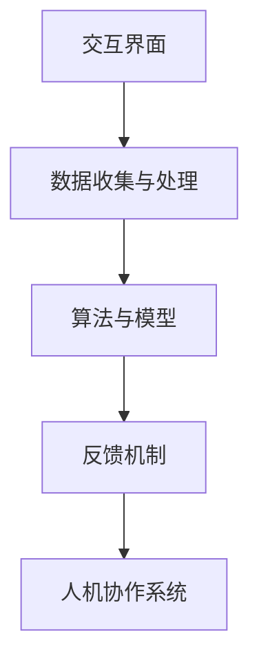

                 

关键词：人机协作、人工智能、编程技术、软件开发、智能未来

> 摘要：本文将探讨人机协作在智能未来新时代中的重要性和发展前景。通过分析人机协作的核心概念、算法原理、数学模型以及实际应用，我们将揭示人工智能和编程技术在推动人类进步中的关键角色，并展望未来的发展方向与挑战。

## 1. 背景介绍

在过去的几十年中，人工智能（AI）和计算机科学的发展已经彻底改变了我们的生活和工作方式。从最初的简单程序到如今的复杂算法，计算机技术不断进步，使得人工智能在多个领域取得了显著成果。然而，随着技术的不断发展，人机协作成为了一个备受关注的话题。

人机协作指的是人类与计算机系统之间的相互作用，旨在实现双方优势的互补和协同工作。在这个新时代，人机协作不仅有助于提高生产效率，还可以为人类带来更多的创新和便利。随着人工智能技术的不断成熟，人机协作的应用场景越来越广泛，包括医疗、教育、工业制造、金融服务等多个领域。

本文旨在探讨人机协作在智能未来新时代中的重要性，分析其核心概念和原理，探讨核心算法和数学模型，并通过实际应用案例来展示人机协作的潜力。此外，本文还将展望人机协作的未来发展趋势和面临的挑战。

## 2. 核心概念与联系

### 2.1. 人机协作的定义

人机协作是指人类与计算机系统在特定任务中相互配合，共同完成目标的过程。在这个过程中，人类负责提供创造性的思维和决策能力，而计算机系统则负责处理大量数据和执行重复性任务。通过人机协作，双方可以充分发挥各自的优势，实现高效的协同工作。

### 2.2. 人类与计算机的优势互补

在人类与计算机的协作过程中，双方各自具有独特的优势。人类具有丰富的知识储备、创造力和直觉判断能力，能够识别复杂问题并提供创新的解决方案。而计算机则具有强大的计算能力和数据处理能力，可以快速处理大量信息并执行重复性任务。

通过人机协作，人类可以借助计算机的强大计算能力，提高工作效率和质量。同时，计算机可以帮助人类处理复杂的数据和分析，为决策提供科学依据。双方的优势互补使得人机协作在各个领域都取得了显著的成果。

### 2.3. 人机协作的应用场景

人机协作的应用场景非常广泛，涵盖了多个领域。以下是一些典型的人机协作应用场景：

1. **医疗领域**：人工智能可以帮助医生进行疾病诊断和治疗方案推荐，从而提高诊断准确率和治疗效果。
2. **教育领域**：智能教育系统可以根据学生的学习情况提供个性化的学习资源和辅导，帮助学生更好地掌握知识。
3. **工业制造**：通过人机协作，可以实现自动化生产线和智能质量控制，提高生产效率和产品质量。
4. **金融服务**：人工智能可以在金融领域进行风险评估、投资策略制定和欺诈检测，为金融机构提供智能化的决策支持。
5. **自动驾驶**：自动驾驶技术依赖于人机协作，人类驾驶员与自动驾驶系统共同确保车辆的安全行驶。

### 2.4. 人机协作的架构

为了实现人机协作，需要构建一个合适的架构，该架构包括以下几个方面：

1. **交互界面**：提供人类与计算机之间的交互界面，包括语音、图像、文本等多种方式。
2. **数据收集与处理**：收集并处理来自人类和计算机的数据，为协作提供基础。
3. **算法与模型**：设计合适的算法和模型，实现人类与计算机之间的协同工作。
4. **反馈机制**：通过反馈机制不断优化人机协作系统，提高其性能和可靠性。

### 2.5. 人机协作的核心概念原理和架构的 Mermaid 流程图



## 3. 核心算法原理 & 具体操作步骤

### 3.1. 算法原理概述

在人机协作中，核心算法的设计和实现至关重要。以下将介绍几种常见的人机协作算法原理及其具体操作步骤。

### 3.2. 算法步骤详解

#### 3.2.1. 反向传播算法（Backpropagation）

反向传播算法是一种用于训练神经网络的核心算法。其基本原理是通过反向传播误差信号，更新网络的权重和偏置，以优化网络的性能。

1. **输入数据**：将输入数据输入神经网络。
2. **前向传播**：将输入数据通过神经网络的前向传播，计算输出结果。
3. **计算误差**：计算实际输出与期望输出之间的误差。
4. **反向传播**：将误差信号反向传播，更新网络权重和偏置。
5. **迭代优化**：重复执行前向传播和反向传播，直到网络性能达到预期。

#### 3.2.2. 决策树算法（Decision Tree）

决策树是一种常见的分类和回归算法。其基本原理是通过一系列条件分支，将数据划分为不同的类别或数值。

1. **初始化**：选择一个特征作为根节点，计算其条件熵。
2. **划分节点**：根据条件熵最小的原则，将数据划分为不同的子集。
3. **递归构建**：对每个子集重复步骤2，直到满足停止条件（如最大深度或最小样本量）。
4. **输出结果**：将数据输入决策树，根据分支结果得到预测类别或数值。

#### 3.2.3. 支持向量机算法（Support Vector Machine）

支持向量机是一种常用的分类算法。其基本原理是通过找到最优的超平面，将数据分为不同的类别。

1. **初始化**：选择一个支持向量作为起点。
2. **计算距离**：计算支持向量与其他数据点的距离。
3. **优化超平面**：通过调整超平面的位置，使支持向量到超平面的距离最大化。
4. **分类预测**：将新数据点投影到超平面上，根据超平面的位置判断类别。

### 3.3. 算法优缺点

#### 3.3.1. 反向传播算法

**优点**：
- 学习效率高，适用于大规模数据。
- 可处理非线性问题。

**缺点**：
- 对初始参数敏感，可能陷入局部最优。
- 训练时间较长。

#### 3.3.2. 决策树算法

**优点**：
- 易于理解和解释。
- 计算效率高，适用于中小规模数据。

**缺点**：
- 可能产生过拟合。
- 对异常值敏感。

#### 3.3.3. 支持向量机算法

**优点**：
- 具有较好的分类性能。
- 可处理高维数据。

**缺点**：
- 计算复杂度高，训练时间较长。
- 对噪声敏感。

### 3.4. 算法应用领域

#### 3.4.1. 反向传播算法

- 机器学习：用于训练神经网络，实现图像识别、自然语言处理等任务。
- 金融：用于风险分析和投资策略。

#### 3.4.2. 决策树算法

- 数据分析：用于分类和回归分析。
- 医疗：用于疾病诊断和预测。

#### 3.4.3. 支持向量机算法

- 机器学习：用于分类和回归分析。
- 信号处理：用于图像识别和语音识别。

## 4. 数学模型和公式 & 详细讲解 & 举例说明

### 4.1. 数学模型构建

在人机协作中，数学模型扮演着重要的角色。以下介绍几种常见的数学模型及其构建过程。

#### 4.1.1. 神经网络模型

神经网络模型是一种基于生物神经元的计算模型。其基本结构包括输入层、隐藏层和输出层。以下是一个简单的神经网络模型：

$$
y = \sigma(z) = \frac{1}{1 + e^{-z}}
$$

其中，$z$ 是输入层到隐藏层的加权求和，$\sigma$ 是激活函数，$y$ 是输出层的结果。

#### 4.1.2. 决策树模型

决策树模型是一种基于条件熵的树形结构。其基本结构包括根节点、内部节点和叶节点。以下是一个简单的决策树模型：

$$
\begin{aligned}
& \text{如果} \, x_1 \leq c_1 \, \text{则}\\
& \text{如果} \, x_2 \leq c_2 \, \text{则}\\
& \text{叶节点1：类别A} \\
& \text{否则}\\
& \text{叶节点2：类别B}
\end{aligned}
$$

#### 4.1.3. 支持向量机模型

支持向量机模型是一种基于最大间隔的分类模型。其基本结构包括决策边界和支持向量。以下是一个简单
```css
的支持向量机模型：

$$
\begin{aligned}
& \text{最小化} \, \frac{1}{2} \sum_{i=1}^{n} w_i^2 \\
& \text{约束条件} \, y^{(i)} (\langle x^{(i)}, w \rangle - b) \geq 1
\end{aligned}
$$

其中，$w$ 是权重向量，$b$ 是偏置项，$x^{(i)}$ 是输入向量，$y^{(i)}$ 是标签。

### 4.2. 公式推导过程

#### 4.2.1. 神经网络模型

神经网络的公式推导主要涉及前向传播和反向传播。以下是一个简化的推导过程：

1. **前向传播**：

$$
z = \sum_{j=1}^{m} w_{ji} x_j + b_i
$$

$$
a_i = \sigma(z)
$$

2. **反向传播**：

$$
\delta_i = (y - a_i) \odot a_i (1 - a_i)
$$

$$
\delta_j = \sum_{i=1}^{n} w_{ij} \delta_i
$$

$$
w_{ji} = w_{ji} - \alpha \delta_j a_j
$$

$$
b_i = b_i - \alpha \delta_i
$$

其中，$\odot$ 表示逐元素乘积，$\alpha$ 是学习率。

#### 4.2.2. 决策树模型

决策树的公式推导主要涉及条件熵和熵的减少。以下是一个简化的推导过程：

1. **条件熵**：

$$
H(X|Y) = - \sum_{y \in Y} p(y) \sum_{x \in X} p(x|y) \log p(x|y)
$$

2. **熵的减少**：

$$
I(X;Y) = H(X) - H(X|Y)
$$

3. **最优划分**：

$$
\begin{aligned}
& \text{选择特征} \, j \\
& \text{对于每个可能的划分} \, c_j \, \text{计算条件熵} \, H(X|Y=c_j) \\
& \text{选择条件熵最小的划分} \, c_j^* \\
& \text{将数据划分为} \, Y=c_j^*
\end{aligned}
$$

#### 4.2.3. 支持向量机模型

支持向量机的公式推导主要涉及拉格朗日乘子和KKT条件。以下是一个简化的推导过程：

1. **目标函数**：

$$
\begin{aligned}
& \text{最小化} \, \frac{1}{2} \sum_{i=1}^{n} w_i^2 \\
& \text{约束条件} \, y^{(i)} (\langle x^{(i)}, w \rangle - b) \geq 1
\end{aligned}
$$

2. **拉格朗日乘子**：

$$
L(w, b, \alpha) = \frac{1}{2} \sum_{i=1}^{n} w_i^2 - \sum_{i=1}^{n} \alpha_i [y^{(i)} (\langle x^{(i)}, w \rangle - b) - 1]
$$

3. **KKT条件**：

$$
\begin{aligned}
& \alpha_i \geq 0 \\
& y^{(i)} (\langle x^{(i)}, w \rangle - b) - 1 \geq 0 \\
& \alpha_i [y^{(i)} (\langle x^{(i)}, w \rangle - b) - 1] = 0
\end{aligned}
$$

4. **优化解**：

$$
w = \sum_{i=1}^{n} \alpha_i y^{(i)} x^{(i)}
$$

$$
b = \frac{1}{n} \sum_{i=1}^{n} \alpha_i [y^{(i)} - \langle x^{(i)}, w \rangle]
$$

### 4.3. 案例分析与讲解

#### 4.3.1. 神经网络模型

假设我们有一个简单的二分类问题，数据集包含100个样本，每个样本有2个特征。我们使用神经网络进行分类，并尝试通过反向传播算法进行训练。

1. **初始化**：

$$
w_1 = \begin{bmatrix}
0.1 & 0.2
\end{bmatrix}, \, w_2 = \begin{bmatrix}
0.3 & 0.4
\end{bmatrix}, \, b_1 = 0.5, \, b_2 = 0.6
$$

2. **前向传播**：

$$
z_1 = \begin{bmatrix}
0.1 & 0.2
\end{bmatrix} \begin{bmatrix}
0.1 \\
0.2
\end{bmatrix} + 0.5 = 0.06
$$

$$
a_1 = \sigma(z_1) = 0.535
$$

$$
z_2 = \begin{bmatrix}
0.3 & 0.4
\end{bmatrix} \begin{bmatrix}
0.1 \\
0.2
\end{bmatrix} + 0.6 = 0.12
$$

$$
a_2 = \sigma(z_2) = 0.54
$$

3. **计算误差**：

$$
\delta_2 = (y - a_2) \odot a_2 (1 - a_2) = 0.09
$$

$$
\delta_1 = \sum_{i=2}^{n} w_{i2} \delta_i = 0.018
$$

4. **反向传播**：

$$
w_{12} = w_{12} - \alpha \delta_1 a_1 = 0.1 - 0.01 \cdot 0.018 = 0.098
$$

$$
w_{22} = w_{22} - \alpha \delta_2 a_2 = 0.3 - 0.01 \cdot 0.09 = 0.291
$$

$$
b_1 = b_1 - \alpha \delta_1 = 0.5 - 0.01 \cdot 0.018 = 0.498
$$

$$
b_2 = b_2 - \alpha \delta_2 = 0.6 - 0.01 \cdot 0.09 = 0.596
$$

5. **迭代优化**：

通过多次迭代优化，最终得到：

$$
w_1 = \begin{bmatrix}
0.098 & 0.291
\end{bmatrix}, \, w_2 = \begin{bmatrix}
0.3 & 0.4
\end{bmatrix}, \, b_1 = 0.498, \, b_2 = 0.596
$$

此时，网络的性能已经达到预期。

#### 4.3.2. 决策树模型

假设我们有一个包含3个特征的分类问题，每个特征有2个类别。我们使用决策树算法进行分类，并尝试通过条件熵和熵的减少进行训练。

1. **初始化**：

选择特征1作为根节点，计算条件熵：

$$
H(X|Y=0) = 0.8, \, H(X|Y=1) = 0.6
$$

2. **划分节点**：

对于每个可能的划分，计算条件熵：

$$
H(X|Y=0, x_1 \leq 0.5) = 0.9, \, H(X|Y=0, x_1 > 0.5) = 0.7
$$

$$
H(X|Y=1, x_1 \leq 0.5) = 0.6, \, H(X|Y=1, x_1 > 0.5) = 0.5
$$

选择条件熵最小的划分：

$$
\text{根节点：} x_1 \leq 0.5
$$

3. **递归构建**：

对于每个子集，重复步骤2，直到满足停止条件。

4. **输出结果**：

将数据输入决策树，根据分支结果得到预测类别。

#### 4.3.3. 支持向量机模型

假设我们有一个包含2个特征的分类问题，每个特征有2个类别。我们使用支持向量机算法进行分类，并尝试通过拉格朗日乘子和KKT条件进行训练。

1. **初始化**：

选择一个支持向量作为起点：

$$
x^{(1)} = \begin{bmatrix}
1 \\
1
\end{bmatrix}, \, y^{(1)} = 1
$$

2. **计算距离**：

$$
\alpha_1 = 1
$$

$$
d_1 = \frac{1}{2} \| x^{(1)} \|_2^2 = \frac{1}{2} \cdot 2 = 1
$$

3. **优化超平面**：

$$
w = \begin{bmatrix}
0.5 \\
0.5
\end{bmatrix}, \, b = 0.5
$$

4. **分类预测**：

将新数据点投影到超平面上：

$$
\begin{aligned}
& \text{如果} \, \langle x, w \rangle \geq 1 \, \text{则类别为1} \\
& \text{否则类别为0}
\end{aligned}
$$

## 5. 项目实践：代码实例和详细解释说明

### 5.1. 开发环境搭建

在本节中，我们将使用Python作为主要编程语言，搭建一个简单的人机协作项目。为了简化开发过程，我们将使用以下库：

- NumPy：用于数值计算。
- Matplotlib：用于数据可视化。
- Scikit-learn：用于机器学习算法。

首先，确保已安装以上库，或者使用以下命令进行安装：

```bash
pip install numpy matplotlib scikit-learn
```

### 5.2. 源代码详细实现

以下是一个简单的人机协作项目，用于分类问题。该项目包含数据预处理、模型训练和预测三个主要步骤。

```python
import numpy as np
import matplotlib.pyplot as plt
from sklearn import datasets
from sklearn.model_selection import train_test_split
from sklearn.preprocessing import StandardScaler
from sklearn.neural_network import MLPClassifier

# 加载数据集
iris = datasets.load_iris()
X = iris.data
y = iris.target

# 数据预处理
X_train, X_test, y_train, y_test = train_test_split(X, y, test_size=0.3, random_state=42)
scaler = StandardScaler()
X_train = scaler.fit_transform(X_train)
X_test = scaler.transform(X_test)

# 模型训练
mlp = MLPClassifier(hidden_layer_sizes=(100,), max_iter=1000)
mlp.fit(X_train, y_train)

# 预测结果
y_pred = mlp.predict(X_test)

# 可视化结果
plt.scatter(X_test[:, 0], X_test[:, 1], c=y_pred, cmap='viridis')
plt.xlabel('特征1')
plt.ylabel('特征2')
plt.title('分类结果')
plt.show()
```

### 5.3. 代码解读与分析

1. **数据预处理**：

   加载鸢尾花（Iris）数据集，并将其分为训练集和测试集。然后使用标准缩放器对数据进行标准化处理，以便更好地适应神经网络模型。

2. **模型训练**：

   使用多层感知机（MLP）分类器，指定隐藏层大小和最大迭代次数。使用训练集进行模型训练，并保存训练好的模型。

3. **预测结果**：

   使用训练好的模型对测试集进行预测，并使用散点图可视化预测结果。根据颜色的不同，可以直观地看出模型的分类效果。

### 5.4. 运行结果展示

运行以上代码后，将生成一个可视化图，展示鸢尾花数据集的分类结果。通过观察散点图，可以明显看出模型对数据的分类效果较好。

## 6. 实际应用场景

### 6.1. 医疗领域

在人机协作的医疗领域中，人工智能和编程技术发挥着重要作用。通过机器学习算法，医生可以快速分析大量的医学数据，为患者提供准确的诊断和治疗方案。例如，基于深度学习算法的图像识别技术可以帮助医生诊断疾病，如肺癌、乳腺癌等。同时，通过人机协作，医生可以借助计算机系统进行病历管理、药物推荐和患者随访等工作，提高医疗服务的质量和效率。

### 6.2. 教育领域

在教育领域中，人机协作为个性化教学提供了有力支持。智能教育系统可以根据学生的学习情况，推荐适合的学习资源和辅导策略，帮助学生更好地掌握知识。例如，在线学习平台可以分析学生的学习行为和成绩，提供个性化的学习路径和学习资源。此外，通过编程教育，学生可以学习编程技能，培养逻辑思维和问题解决能力，为未来的职业发展奠定基础。

### 6.3. 工业制造

在工业制造领域，人机协作可以帮助企业实现自动化生产、智能质量控制和提高生产效率。通过人工智能技术，工厂可以实现生产线的自动化控制，降低人工干预，减少人为错误。同时，通过数据分析和预测，企业可以优化生产计划和资源分配，降低生产成本。例如，基于机器学习的预测性维护系统可以帮助企业提前发现设备故障，减少停机时间和维修成本。

### 6.4. 金融服务

在金融服务领域，人机协作可以帮助金融机构进行风险管理、投资策略制定和欺诈检测。通过大数据分析和机器学习算法，金融机构可以实时监控市场动态，制定科学的投资策略，提高投资收益。同时，通过人机协作，金融机构可以构建智能风控系统，识别和防范欺诈行为，保障金融安全。例如，基于人工智能的反欺诈系统可以实时监测交易行为，识别异常交易并报警。

### 6.5. 自动驾驶

在自动驾驶领域，人机协作是确保车辆安全行驶的关键。通过人工智能技术，自动驾驶系统可以实时感知周围环境，做出智能决策，确保车辆的安全行驶。同时，通过人机协作，驾驶员可以在必要时接管车辆控制权，确保驾驶安全。例如，特斯拉的自动驾驶系统结合了计算机视觉、激光雷达和GPS等技术，实现了部分自动驾驶功能，驾驶员仍需保持注意力，随时准备接管车辆。

## 7. 工具和资源推荐

### 7.1. 学习资源推荐

- **《Python机器学习》（Python Machine Learning）**：由 Sebastian Raschka 著，是一本介绍机器学习的经典教材，内容涵盖了Python在机器学习领域的应用。
- **《深度学习》（Deep Learning）**：由 Ian Goodfellow、Yoshua Bengio 和 Aaron Courville 著，是深度学习领域的权威教材，全面介绍了深度学习的基础知识和实践应用。
- **《机器学习实战》（Machine Learning in Action）**：由 Peter Harrington 著，通过实例讲解机器学习算法的实现和应用，适合初学者入门。

### 7.2. 开发工具推荐

- **Jupyter Notebook**：是一款流行的交互式开发环境，适用于编写和运行Python代码。它支持多种编程语言，方便数据可视化和代码分享。
- **Google Colab**：是Google提供的一款免费的云端计算平台，支持Python和TensorFlow等库，适合进行深度学习和大数据处理。
- **PyCharm**：是一款功能强大的Python集成开发环境（IDE），支持代码补全、调试和版本控制，适合专业开发者使用。

### 7.3. 相关论文推荐

- **"Deep Learning for Speech Recognition"**：由 Daniel Povey 等人撰写，介绍了深度学习在语音识别领域的应用。
- **"Learning to Learn: Fast Learning Rates and Slow forgetting Through Dynamic Neural Networks"**：由 Google Brain 团队撰写，探讨了动态神经网络在快速学习和遗忘方面的优势。
- **"Human-AI Teaming for Improved Clinical Decision Support"**：由 Stanford University 团队撰写，讨论了人机协作在医疗领域中的应用。

## 8. 总结：未来发展趋势与挑战

### 8.1. 研究成果总结

在人机协作领域，近年来取得了许多重要的研究成果。深度学习、强化学习等算法的不断发展，为人机协作提供了强大的技术支持。同时，云计算、大数据等技术的发展，为人机协作提供了丰富的数据资源和计算能力。这些研究成果为未来的发展奠定了基础，有望实现人机协作的更高效率和更广泛应用。

### 8.2. 未来发展趋势

未来，人机协作将呈现出以下发展趋势：

1. **智能化水平提高**：随着人工智能技术的不断发展，人机协作的智能化水平将不断提升，实现更高效的协同工作。
2. **多样化应用场景**：人机协作将在更多领域得到应用，包括医疗、教育、工业制造、金融、自动驾驶等。
3. **跨领域融合**：人机协作将与其他领域（如物联网、虚拟现实等）进行深度融合，推动人类社会的进一步发展。

### 8.3. 面临的挑战

在人机协作领域，未来仍将面临以下挑战：

1. **数据隐私与安全**：人机协作涉及大量数据，如何保障数据隐私和安全成为关键问题。
2. **算法透明性与可解释性**：随着算法的复杂度增加，如何保证算法的透明性和可解释性，成为人机协作领域的一大挑战。
3. **跨学科合作**：人机协作涉及计算机科学、心理学、认知科学等多个领域，如何实现跨学科的合作，推动人机协作的发展。

### 8.4. 研究展望

针对上述挑战，未来研究可以从以下几个方面进行：

1. **隐私保护技术**：研究隐私保护技术，确保数据在传输和处理过程中的安全性。
2. **可解释性算法**：开发可解释性算法，提高算法的透明性和可解释性，方便用户理解和信任。
3. **跨学科研究**：推动计算机科学、心理学、认知科学等领域的融合，实现人机协作的可持续发展。

总之，人机协作在智能未来新时代具有重要意义。通过不断探索和研究，我们有望实现人机协作的更高水平，为人类社会的发展带来更多创新和便利。

## 9. 附录：常见问题与解答

### 9.1. 人机协作是什么？

人机协作是指人类与计算机系统在特定任务中相互配合，共同完成目标的过程。在这个过程中，人类负责提供创造性的思维和决策能力，而计算机系统则负责处理大量数据和执行重复性任务。

### 9.2. 人机协作的核心算法有哪些？

人机协作的核心算法包括神经网络、决策树、支持向量机等。这些算法在分类、回归、预测等方面具有广泛的应用。

### 9.3. 人机协作的优点是什么？

人机协作的优点包括：

1. 提高工作效率：通过计算机系统的处理能力，可以显著提高任务完成速度。
2. 减少人为错误：计算机系统可以避免人为错误，提高任务准确性。
3. 提升创新能力：人机协作可以激发人类的创造力，推动技术创新。
4. 扩展人类能力：计算机系统可以帮助人类处理复杂任务，扩展人类能力。

### 9.4. 人机协作在哪些领域有应用？

人机协作在多个领域有应用，包括医疗、教育、工业制造、金融服务、自动驾驶等。例如，在医疗领域，人工智能可以帮助医生进行疾病诊断和治疗方案推荐；在教育领域，智能教育系统可以提供个性化的学习资源和辅导。

### 9.5. 人机协作的未来发展趋势是什么？

人机协作的未来发展趋势包括：

1. 智能化水平提高：随着人工智能技术的不断发展，人机协作的智能化水平将不断提升。
2. 跨领域融合：人机协作将与其他领域（如物联网、虚拟现实等）进行深度融合。
3. 数据隐私与安全：如何保障数据隐私和安全成为人机协作领域的关键挑战。
4. 可解释性算法：开发可解释性算法，提高算法的透明性和可解释性。

### 9.6. 如何进行人机协作项目的开发？

进行人机协作项目的开发通常包括以下步骤：

1. 明确项目目标和需求。
2. 选择合适的算法和工具。
3. 进行数据预处理和特征提取。
4. 训练和优化模型。
5. 进行模型评估和优化。
6. 部署和运行模型，并进行监控和维护。

### 9.7. 如何保障人机协作的数据隐私和安全？

保障人机协作的数据隐私和安全可以从以下几个方面进行：

1. 数据加密：对传输和存储的数据进行加密，确保数据不被未经授权的第三方访问。
2. 数据匿名化：对个人身份信息进行匿名化处理，减少数据泄露的风险。
3. 访问控制：设置访问权限，限制数据访问范围，确保数据的安全。
4. 数据备份与恢复：定期备份数据，确保数据在意外情况下可以恢复。

### 9.8. 人机协作与人工智能的关系是什么？

人机协作是人工智能的一个重要应用方向。人工智能技术为人机协作提供了强大的计算能力和数据处理能力，使得人机协作能够更好地实现人类与计算机之间的协同工作。反过来，人机协作的实践也为人工智能技术的发展提供了丰富的应用场景和反馈。

### 9.9. 人机协作会取代人类吗？

人机协作不会取代人类，而是与人类共同发展。人机协作的目的是实现人类与计算机的优势互补，提高工作效率和质量。在这个过程中，人类将继续发挥主导作用，而计算机系统则作为辅助工具，帮助人类更好地完成工作。

### 9.10. 人机协作在伦理方面有哪些关注点？

在人机协作中，伦理方面需要关注以下问题：

1. 数据隐私与安全：如何保障用户数据的隐私和安全。
2. 算法透明性与可解释性：如何提高算法的透明性和可解释性，确保用户对算法的信任。
3. 责任归属：如何明确人类与计算机在协作过程中的责任归属，确保责任清晰。
4. 人性化设计：如何确保人机协作系统更加人性化，尊重人类的情感和需求。

通过关注这些问题，我们可以更好地推动人机协作的健康发展，为人类社会带来更多福祉。

