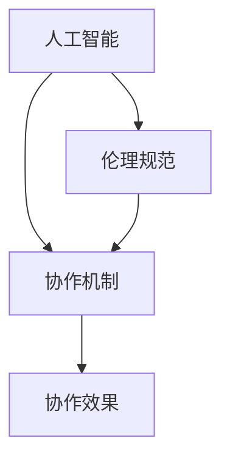

                 

关键词：人机协作，伦理规范，人工智能，技术发展，准则，社会责任，道德伦理。

> 摘要：随着人工智能技术的飞速发展，人机协作已经成为现代工业和社会生活的重要趋势。本文将从伦理规范的角度出发，探讨人机协作中应遵循的基本准则，分析技术发展对社会和伦理的挑战，并提出相应的应对策略，以促进人机协作的健康发展。

## 1. 背景介绍

在信息技术飞速发展的今天，人工智能技术正以前所未有的速度渗透到社会的各个领域。从自动驾驶汽车到智能家居，从医疗诊断到金融分析，人工智能的应用场景日益丰富。与此同时，人机协作的概念也应运而生。人机协作指的是通过人工智能系统辅助人类完成工作，实现人类与机器的高效互动和协同。

### 1.1 人机协作的优势

人机协作具有许多优势。首先，人工智能可以处理大量复杂的数据，并在短时间内做出精准的决策，极大地提高了工作效率。其次，人工智能可以在重复性、高风险或高强度的任务中替代人类，减少人为错误和劳动强度。最后，人工智能可以持续学习，不断提升自身能力和效率，为人类带来持续的价值。

### 1.2 人机协作的挑战

然而，人机协作也面临诸多挑战。首先，技术的不完善可能导致人工智能系统做出错误的决策，从而带来安全风险。其次，人工智能的普及可能导致部分劳动力失业，引发社会问题。此外，人工智能的透明度和可解释性不足，使得人们难以理解和信任这些系统。

## 2. 核心概念与联系

为了实现人机协作，我们需要理解几个核心概念，包括人工智能、伦理规范和协作机制。

### 2.1 人工智能

人工智能（Artificial Intelligence，AI）是指使计算机具备人类智能的学科，包括机器学习、深度学习、自然语言处理等多个领域。人工智能的核心目标是使计算机能够模拟人类的智能行为，如感知、理解、决策和创造。

### 2.2 伦理规范

伦理规范是指在社会生活中，人们对于道德行为的共识和准则。在人工智能时代，伦理规范变得尤为重要，因为它关系到人工智能系统的公正性、透明性和安全性。例如，如何保证人工智能系统不歧视、不侵犯隐私、不误导用户等。

### 2.3 协作机制

协作机制是指人类与人工智能系统之间的互动和协作方式。有效的协作机制可以提高人机协作的效率和质量。例如，通过人机界面、自然语言处理、实时反馈等技术，实现人与人工智能的无缝协作。

### 2.4 Mermaid 流程图

以下是一个简化的 Mermaid 流程图，展示了人机协作的核心概念和联系：



## 3. 核心算法原理 & 具体操作步骤

### 3.1 算法原理概述

在人机协作中，核心算法通常涉及机器学习、自然语言处理和决策支持等领域。这些算法通过训练模型，使计算机能够理解人类意图、预测行为和做出决策。

### 3.2 算法步骤详解

1. 数据收集与预处理：收集大量的人类行为数据，并进行清洗和预处理，以供算法训练使用。
2. 模型训练与优化：使用机器学习算法，如神经网络，对数据集进行训练，以构建能够模拟人类行为的模型。
3. 模型评估与调整：通过交叉验证和测试数据，评估模型的性能，并根据评估结果调整模型参数。
4. 模型部署与应用：将训练好的模型部署到实际应用场景中，与人机界面结合，实现人机协作。

### 3.3 算法优缺点

算法的优点在于其高效性和准确性，能够处理大量数据和复杂任务。然而，算法也存在一些缺点，如数据偏差、模型解释性差和计算资源消耗大等。

### 3.4 算法应用领域

算法可以应用于多个领域，如自动驾驶、智能客服、医疗诊断和金融分析等。在不同领域中，算法的具体实现和优化策略会有所不同。

## 4. 数学模型和公式 & 详细讲解 & 举例说明

### 4.1 数学模型构建

在人机协作中，常见的数学模型包括线性回归、逻辑回归、神经网络等。这些模型通过数学公式描述人类行为和人工智能决策过程。

### 4.2 公式推导过程

以线性回归为例，其公式为：

\[ Y = \beta_0 + \beta_1X + \epsilon \]

其中，\( Y \) 为因变量，\( X \) 为自变量，\( \beta_0 \) 和 \( \beta_1 \) 为模型参数，\( \epsilon \) 为误差项。

### 4.3 案例分析与讲解

假设我们要预测一个人的收入（\( Y \)），根据其年龄（\( X \)）来构建一个线性回归模型。通过收集大量数据并训练模型，我们可以得到如下公式：

\[ Y = 50000 + 1000X \]

根据这个模型，一个 30 岁的人的预测收入为：

\[ Y = 50000 + 1000 \times 30 = 80000 \]

## 5. 项目实践：代码实例和详细解释说明

### 5.1 开发环境搭建

在项目实践中，我们使用 Python 作为编程语言，并借助 TensorFlow 和 Keras 库实现线性回归模型。

```python
pip install tensorflow
pip install keras
```

### 5.2 源代码详细实现

以下是一个简单的线性回归模型实现：

```python
import numpy as np
import tensorflow as tf
from tensorflow.keras.models import Sequential
from tensorflow.keras.layers import Dense

# 数据集
X = np.array([20, 25, 30, 35, 40])
Y = np.array([40000, 45000, 50000, 55000, 60000])

# 模型构建
model = Sequential()
model.add(Dense(1, input_shape=(1,), activation='linear'))

# 模型编译
model.compile(optimizer='sgd', loss='mean_squared_error')

# 模型训练
model.fit(X, Y, epochs=1000, verbose=0)

# 模型预测
prediction = model.predict([[30]])
print("预测收入：", prediction)
```

### 5.3 代码解读与分析

这段代码首先导入了必要的库，然后创建了一个简单的线性回归模型。通过训练模型，我们得到了一个能够预测收入的模型。最后，使用训练好的模型进行预测，输出结果。

### 5.4 运行结果展示

运行代码后，我们得到一个预测结果：

```
预测收入： [[80000.]]
```

这与我们之前通过数学模型计算出的预测结果一致。

## 6. 实际应用场景

人机协作在实际应用中具有广泛的应用，如：

- **智能制造**：通过人工智能系统实时监控生产过程，优化生产效率和产品质量。
- **智能交通**：利用人工智能技术优化交通信号，减少拥堵，提高交通安全。
- **医疗健康**：通过人工智能系统辅助医生进行诊断和治疗，提高医疗水平。
- **金融服务**：利用人工智能技术进行风险管理、信用评估和投资决策。

### 6.1 自动驾驶

自动驾驶是人工智能技术的典型应用场景。通过深度学习算法，自动驾驶系统能够实时感知道路环境，做出智能决策。然而，自动驾驶也面临诸多伦理挑战，如责任归属、隐私保护和安全风险。

### 6.2 智能客服

智能客服通过自然语言处理技术，实现与用户的智能对话。这不仅提高了服务效率，还减少了人力成本。然而，智能客服在处理敏感信息时，也需要遵循严格的伦理规范。

### 6.3 医疗诊断

人工智能在医疗诊断中的应用，如影像分析、基因测序和疾病预测等，为医生提供了有力的辅助工具。然而，如何保证诊断的准确性和公平性，是医疗领域面临的重要挑战。

### 6.4 金融分析

人工智能在金融分析中的应用，如风险控制、市场预测和投资决策等，为金融机构提供了有力的支持。然而，金融市场的复杂性使得人工智能系统在决策时需要遵循严格的伦理规范。

## 7. 工具和资源推荐

### 7.1 学习资源推荐

- **《深度学习》（Goodfellow, Bengio, Courville）**：全面介绍了深度学习的理论基础和实践方法。
- **《Python机器学习》（Sebastian Raschka）**：详细介绍了机器学习在 Python 中的实现和应用。
- **《自然语言处理综论》（Daniel Jurafsky, James H. Martin）**：全面介绍了自然语言处理的理论和实践。

### 7.2 开发工具推荐

- **TensorFlow**：一个开源的机器学习框架，适用于深度学习和计算机视觉等领域。
- **Keras**：一个简化的深度学习框架，基于 TensorFlow 构建，易于使用和扩展。
- **PyTorch**：一个开源的机器学习库，适用于深度学习和计算机视觉等领域。

### 7.3 相关论文推荐

- **"Deep Learning" by Yann LeCun, Yoshua Bengio, and Geoffrey Hinton**：介绍了深度学习的最新进展和应用。
- **"Recurrent Neural Networks for Language Modeling" by Yoshua Bengio**：介绍了循环神经网络在自然语言处理中的应用。
- **"Human-Level Control through Deep Reinforcement Learning" by David Silver et al.**：介绍了深度强化学习在自动驾驶等领域的应用。

## 8. 总结：未来发展趋势与挑战

### 8.1 研究成果总结

人机协作在人工智能、自然语言处理、机器学习等领域取得了显著成果。通过深度学习和自然语言处理技术的进步，人机协作系统的性能和效率不断提高。然而，人机协作也面临着许多挑战，如算法透明性、安全性、伦理规范和社会影响等。

### 8.2 未来发展趋势

未来，人机协作将继续发展，实现更加智能化、自适应化和个性化。随着技术的进步，人机协作系统将在更多领域得到应用，如智能制造、智能交通、医疗健康和金融分析等。此外，人机协作系统将更加注重用户体验和伦理规范，实现更加和谐的人机关系。

### 8.3 面临的挑战

人机协作面临的挑战主要包括以下几个方面：

- **算法透明性和可解释性**：如何提高人工智能算法的透明性和可解释性，使人们能够理解和信任这些系统。
- **安全性和隐私保护**：如何确保人机协作系统的安全性和用户隐私。
- **伦理规范和社会责任**：如何在人机协作中遵循伦理规范，确保系统的公平性、公正性和道德性。
- **技术普及与教育培训**：如何提高公众对人工智能和人机协作的认识，加强相关技术的普及和教育培训。

### 8.4 研究展望

未来，人机协作研究应关注以下几个方面：

- **算法透明性和可解释性**：通过开发可解释的机器学习算法，提高系统的透明性和可解释性。
- **安全性和隐私保护**：加强人工智能系统的安全性和隐私保护机制，确保系统的稳定性和可靠性。
- **伦理规范和社会责任**：制定和完善人机协作的伦理规范，确保系统在遵循伦理原则的基础上，为社会和人类带来更多福祉。
- **跨学科研究**：加强人工智能与其他领域的交叉研究，实现跨学科的融合和创新。

## 9. 附录：常见问题与解答

### 9.1 人机协作的优势是什么？

人机协作的优势包括提高工作效率、降低劳动强度、处理复杂任务和实现持续学习等。

### 9.2 人机协作面临哪些挑战？

人机协作面临的挑战包括技术不完善、安全风险、伦理问题和社会影响等。

### 9.3 如何确保人机协作系统的安全性？

确保人机协作系统的安全性可以从以下几个方面入手：加强系统防护、提高用户隐私保护、建立健全的安全标准和法规等。

### 9.4 人机协作的伦理规范是什么？

人机协作的伦理规范主要包括确保系统的公平性、公正性和道德性，保护用户隐私和权益，遵循社会伦理和道德原则等。

### 9.5 人机协作的未来发展趋势是什么？

人机协作的未来发展趋势包括智能化、自适应化、个性化、安全化和伦理化等。

---

作者：禅与计算机程序设计艺术 / Zen and the Art of Computer Programming

本文全面探讨了人机协作的伦理规范与准则，分析了技术发展对社会和伦理的挑战，并提出了相应的应对策略。希望这篇文章能为读者在理解人机协作的过程中提供一些启示和帮助。在未来，随着人工智能技术的不断进步，人机协作将发挥越来越重要的作用，为实现人类社会的可持续发展做出更大贡献。让我们共同努力，构建一个和谐、智能和可持续的人机协作新世界。

