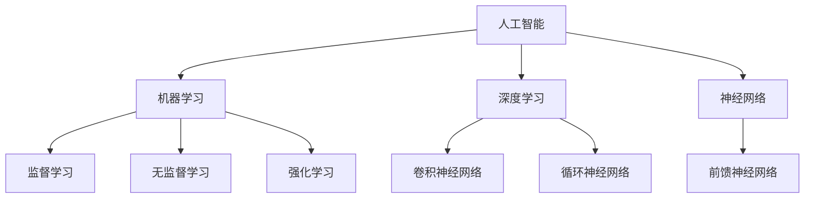

                 

关键词：人类与AI协作、互信、技术进步、人工智能、社会影响

> 摘要：本文探讨了人类与人工智能（AI）之间的协作关系，强调了互信在提升这种协作效率中的关键作用。通过分析AI技术的进步及其对人类社会的影响，本文提出了一系列策略和框架，旨在构建人类与AI之间的信任机制，促进两者的深度融合。

## 1. 背景介绍

在过去的几十年中，人工智能（AI）技术取得了令人瞩目的进展。从早期的专家系统到现代的深度学习算法，AI已经渗透到各个领域，包括医疗、金融、交通和娱乐等。随着AI技术的不断成熟，人类与AI之间的协作变得越来越普遍。这种协作不仅提高了生产效率，还丰富了人类的生活方式。然而，随着AI系统的复杂性和影响力增加，人类与AI之间的互信问题也愈发突出。

互信是指双方对彼此能力和意图的信任。在人类与AI的协作中，互信的建立至关重要。首先，互信有助于减少误解和冲突，从而提高协作效率。其次，互信可以增强人类对AI系统的依赖程度，从而充分发挥AI的优势。最后，互信还能推动AI技术的持续进步，因为只有在信任的基础上，人类才会愿意分享自己的知识和资源，以促进AI的发展。

本文将从以下几个方面展开讨论：首先，我们将回顾AI技术发展的历程及其对人类社会的影响；接着，探讨人类与AI协作的现状和挑战；然后，提出增强人类与AI之间互信的策略和框架；最后，展望未来的发展方向和潜在挑战。

## 2. 核心概念与联系

为了更好地理解人类与AI之间的协作，我们首先需要明确一些核心概念，包括人工智能、机器学习、深度学习和神经网络等。这些概念之间存在着密切的联系，共同构成了现代AI技术的基石。

### 2.1 人工智能

人工智能（Artificial Intelligence，简称AI）是指由计算机程序实现的智能行为。这种智能行为包括学习、推理、问题解决、自然语言处理和感知等。人工智能可以分为弱AI和强AI。弱AI专注于特定领域的任务，例如语音识别、图像处理和推荐系统等。强AI则具备人类水平的通用智能，能够在各种环境中进行自主学习和决策。

### 2.2 机器学习

机器学习（Machine Learning，简称ML）是一种通过数据驱动的方式实现人工智能的方法。它利用算法从数据中学习规律，并使用这些规律进行预测和决策。机器学习可以分为监督学习、无监督学习和强化学习。监督学习通过已有数据的标签进行学习，无监督学习则尝试发现数据中的结构，强化学习则通过奖励机制进行学习。

### 2.3 深度学习

深度学习（Deep Learning，简称DL）是机器学习的一种重要分支，基于多层神经网络的结构进行学习。深度学习在图像识别、语音识别和自然语言处理等领域取得了显著成果。其核心思想是通过多层非线性变换，从数据中提取特征，从而实现复杂的任务。

### 2.4 神经网络

神经网络（Neural Networks，简称NN）是深度学习的基础。它模仿生物神经系统的结构和功能，通过大量的节点（或神经元）和连接（或权重）进行信息传递和处理。神经网络可以分为前馈神经网络、卷积神经网络（CNN）和循环神经网络（RNN）等类型。

### 2.5 Mermaid 流程图

以下是一个Mermaid流程图，展示了这些核心概念之间的联系：



通过这个流程图，我们可以清晰地看到各个概念之间的关系，从而更好地理解人类与AI协作的背景和基础。

## 3. 核心算法原理 & 具体操作步骤

### 3.1 算法原理概述

在人类与AI协作的过程中，算法起着至关重要的作用。算法不仅是AI的核心组件，也是实现人类与AI互信的关键。下面，我们将介绍几种常见的算法原理，并探讨它们在协作中的应用。

#### 3.1.1 监督学习算法

监督学习算法是一种常用的机器学习算法，它通过已有数据的标签进行学习。在人类与AI协作中，监督学习算法可以用于预测和分类任务。例如，在医疗领域，监督学习算法可以用于诊断疾病；在金融领域，可以用于风险评估。

#### 3.1.2 深度学习算法

深度学习算法是监督学习算法的一种扩展，它通过多层神经网络进行学习。在人类与AI协作中，深度学习算法可以用于复杂的任务，如图像识别、语音识别和自然语言处理。这些任务通常需要从大量数据中提取深层特征。

#### 3.1.3 强化学习算法

强化学习算法是一种通过奖励机制进行学习的算法。在人类与AI协作中，强化学习算法可以用于决策制定。例如，在自动驾驶领域，强化学习算法可以用于控制车辆的行驶方向和速度。

### 3.2 算法步骤详解

下面，我们将详细介绍这些算法的具体步骤。

#### 3.2.1 监督学习算法步骤

1. 数据预处理：对数据进行清洗和归一化处理。
2. 特征提取：从数据中提取有助于预测的特征。
3. 模型训练：使用训练数据对模型进行训练。
4. 模型评估：使用验证数据对模型进行评估。
5. 模型应用：使用测试数据对模型进行应用。

#### 3.2.2 深度学习算法步骤

1. 数据预处理：对数据进行清洗和归一化处理。
2. 网络构建：构建深度学习网络结构。
3. 模型训练：使用训练数据对模型进行训练。
4. 模型评估：使用验证数据对模型进行评估。
5. 模型应用：使用测试数据对模型进行应用。

#### 3.2.3 强化学习算法步骤

1. 环境初始化：初始化环境状态。
2. 策略选择：选择一个动作策略。
3. 执行动作：在环境中执行动作。
4. 收集反馈：收集环境反馈。
5. 更新策略：根据反馈更新策略。
6. 重复步骤2-5，直到达到目标。

### 3.3 算法优缺点

每种算法都有其优缺点，适用于不同的场景。

#### 3.3.1 监督学习算法优缺点

**优点：**
- **简单易用**：监督学习算法相对简单，易于实现和部署。
- **适用范围广**：监督学习算法适用于各种预测和分类任务。

**缺点：**
- **依赖大量标注数据**：监督学习算法需要大量已标注的数据进行训练。
- **泛化能力有限**：监督学习算法的泛化能力取决于训练数据的分布。

#### 3.3.2 深度学习算法优缺点

**优点：**
- **强大的特征提取能力**：深度学习算法可以自动提取深层特征，适用于复杂的任务。
- **高准确性**：深度学习算法在图像识别、语音识别和自然语言处理等领域取得了显著成果。

**缺点：**
- **计算资源需求大**：深度学习算法需要大量计算资源和存储空间。
- **训练时间长**：深度学习算法的训练时间较长。

#### 3.3.3 强化学习算法优缺点

**优点：**
- **自适应性强**：强化学习算法可以根据环境反馈不断调整策略，具有较强的适应性。
- **适用于动态环境**：强化学习算法适用于需要实时决策的动态环境。

**缺点：**
- **训练过程不稳定**：强化学习算法的训练过程可能存在不稳定的情况，需要大量试错。
- **适用范围有限**：强化学习算法适用于特定的决策问题，如自动驾驶和游戏。

### 3.4 算法应用领域

各种算法在人类与AI协作中的应用领域有所不同。

#### 3.4.1 监督学习算法应用领域

- **医疗领域**：用于疾病诊断、药物研发等。
- **金融领域**：用于风险评估、信用评分等。
- **零售领域**：用于需求预测、库存管理等。

#### 3.4.2 深度学习算法应用领域

- **图像识别**：用于人脸识别、物体检测等。
- **语音识别**：用于语音助手、自动字幕等。
- **自然语言处理**：用于机器翻译、文本分类等。

#### 3.4.3 强化学习算法应用领域

- **自动驾驶**：用于车辆控制、路径规划等。
- **游戏**：用于游戏AI、智能对战等。
- **机器人**：用于机器人控制、任务规划等。

## 4. 数学模型和公式 & 详细讲解 & 举例说明

### 4.1 数学模型构建

在人类与AI协作中，数学模型起着至关重要的作用。一个有效的数学模型可以帮助我们更好地理解问题、制定策略和评估效果。下面，我们将介绍几种常用的数学模型，并讨论它们在协作中的应用。

#### 4.1.1 概率模型

概率模型是描述不确定性的数学工具。在人类与AI协作中，概率模型可以用于风险评估、决策制定和预测。常见的概率模型包括贝叶斯网络、马尔可夫链和概率图模型。

贝叶斯网络是一种概率图模型，它通过节点和边的连接表示变量之间的依赖关系。贝叶斯网络可以用于推理和预测，例如，在医疗领域，可以使用贝叶斯网络进行疾病诊断。

马尔可夫链是一种离散时间随机过程，它通过状态转移矩阵描述变量之间的转移概率。马尔可夫链可以用于时间序列分析和状态预测，例如，在金融市场分析中，可以使用马尔可夫链进行股票价格预测。

概率图模型是一种将概率模型和图论相结合的方法，它通过图结构表示变量之间的依赖关系。概率图模型可以用于复杂系统的建模和分析，例如，在社会网络分析中，可以使用概率图模型分析用户行为和传播路径。

#### 4.1.2 决策模型

决策模型是用于制定决策的数学工具。在人类与AI协作中，决策模型可以用于自动化决策、优化和资源分配。常见的决策模型包括线性规划、动态规划和博弈论。

线性规划是一种优化方法，它通过求解线性目标函数和线性约束条件的最优解，帮助决策者做出最优决策。线性规划可以用于资源分配、生产规划等。

动态规划是一种递推方法，它通过将问题分解为子问题，并利用子问题的解构建原问题的解，从而求解复杂问题。动态规划可以用于最短路径问题、背包问题等。

博弈论是一种研究竞争和合作行为的数学理论。在人类与AI协作中，博弈论可以用于设计自动化决策策略，例如，在电子游戏中，可以使用博弈论设计智能对手。

### 4.2 公式推导过程

下面，我们将介绍概率模型和决策模型的一些关键公式，并解释其推导过程。

#### 4.2.1 贝叶斯定理

贝叶斯定理是概率模型中的核心公式，它描述了在已知某些条件下，一个事件发生的概率。贝叶斯定理的推导基于条件概率的定义：

$$P(A|B) = \frac{P(B|A)P(A)}{P(B)}$$

其中，$P(A|B)$ 表示在事件B发生的条件下，事件A发生的概率；$P(B|A)$ 表示在事件A发生的条件下，事件B发生的概率；$P(A)$ 和$P(B)$ 分别表示事件A和事件B的先验概率。

贝叶斯定理可以用于推理和更新概率，例如，在医学诊断中，可以使用贝叶斯定理计算疾病发生的概率。

#### 4.2.2 决策模型中的目标函数

决策模型中的目标函数用于衡量决策的质量。一个典型的目标函数是线性规划中的目标函数：

$$\min\ Z = c^T x$$

其中，$c$ 是系数向量，$x$ 是变量向量，$Z$ 是目标函数。目标函数的推导基于线性规划的基本原理，即通过调整变量值，使得目标函数的值最小。

目标函数可以用于优化资源分配、生产规划等问题。例如，在资源分配问题中，目标函数可以用来计算资源的最优分配方案。

#### 4.2.3 动态规划中的状态转移方程

动态规划中的状态转移方程描述了不同子问题之间的关系。一个典型的状态转移方程是：

$$f(i) = \min_{j} \{g(i, j) + f(j)\}$$

其中，$f(i)$ 是子问题的解，$g(i, j)$ 是子问题的评价函数。状态转移方程的推导基于递推关系，即通过子问题的解构建原问题的解。

状态转移方程可以用于求解最短路径问题、背包问题等。例如，在最短路径问题中，状态转移方程可以用来计算从起点到终点的最短路径。

### 4.3 案例分析与讲解

为了更好地理解数学模型和公式的应用，我们下面通过一个案例进行分析。

#### 4.3.1 医学诊断

假设有一个医学诊断问题，我们需要根据病人的症状和检查结果，判断其是否患有某种疾病。我们可以使用贝叶斯网络来构建这个问题。

1. **定义变量**：定义病人是否患病（A）、症状（B）和检查结果（C）三个变量。

2. **确定先验概率**：确定病人患病的先验概率 $P(A)$、症状的先验概率 $P(B)$ 和检查结果的先验概率 $P(C)$。

3. **确定条件概率**：确定在病人患病的条件下，症状发生的概率 $P(B|A)$、在病人患病的条件下，检查结果发生的概率 $P(C|A)$、在病人未患病的条件下，症状发生的概率 $P(B|\neg A)$ 和在病人未患病的条件下，检查结果发生的概率 $P(C|\neg A)$。

4. **构建贝叶斯网络**：根据定义的变量和条件概率，构建贝叶斯网络。

5. **推理与预测**：使用贝叶斯网络进行推理和预测，计算病人患病的概率 $P(A|B, C)$。

6. **结果解释**：根据计算出的概率，判断病人是否患病。

#### 4.3.2 资源分配

假设有一个资源分配问题，我们需要将有限的资源分配给多个项目，以最大化总收益。我们可以使用线性规划来解决这个问题。

1. **定义变量**：定义每个项目的资源需求（$x_i$）和收益（$y_i$）。

2. **建立目标函数**：建立最大化总收益的目标函数：

   $$\max Z = \sum_{i=1}^{n} y_i x_i$$

3. **建立约束条件**：建立资源需求的约束条件：

   $$\sum_{i=1}^{n} x_i \leq R$$

   其中，$R$ 是总资源量。

4. **求解最优解**：使用线性规划求解器求解最优解。

5. **结果解释**：根据求解出的最优解，分配资源给各个项目，最大化总收益。

通过以上案例，我们可以看到数学模型和公式的实际应用。在实际应用中，我们需要根据具体问题，选择合适的模型和公式，并对其进行适当的调整和优化。

## 5. 项目实践：代码实例和详细解释说明

### 5.1 开发环境搭建

在本文中，我们将使用Python作为主要编程语言，结合NumPy、Pandas和Scikit-learn等库来实现人类与AI协作的相关算法。以下是一个简单的开发环境搭建步骤：

1. **安装Python**：下载并安装Python，可以选择Python 3.8或更高版本。

2. **安装相关库**：打开终端，执行以下命令安装所需库：

   ```bash
   pip install numpy pandas scikit-learn matplotlib
   ```

3. **配置Python环境**：确保Python环境变量已配置，以便在代码中导入相关库。

### 5.2 源代码详细实现

下面是一个简单的示例代码，展示如何使用Python实现一个基于监督学习的疾病诊断系统。代码分为以下几个部分：

1. **数据预处理**：加载数据集并进行预处理。

2. **模型训练**：使用训练数据训练模型。

3. **模型评估**：使用验证数据评估模型性能。

4. **模型应用**：使用测试数据对模型进行应用。

```python
import numpy as np
import pandas as pd
from sklearn.model_selection import train_test_split
from sklearn.ensemble import RandomForestClassifier
from sklearn.metrics import accuracy_score, classification_report

# 1. 数据预处理
# 加载数据集
data = pd.read_csv('disease_data.csv')

# 分离特征和标签
X = data.drop('label', axis=1)
y = data['label']

# 划分训练集和测试集
X_train, X_test, y_train, y_test = train_test_split(X, y, test_size=0.2, random_state=42)

# 2. 模型训练
# 创建随机森林分类器
clf = RandomForestClassifier(n_estimators=100, random_state=42)

# 训练模型
clf.fit(X_train, y_train)

# 3. 模型评估
# 预测测试集
y_pred = clf.predict(X_test)

# 计算准确率
accuracy = accuracy_score(y_test, y_pred)
print(f'Accuracy: {accuracy:.2f}')

# 打印分类报告
print(classification_report(y_test, y_pred))

# 4. 模型应用
# 输入新的数据
new_data = np.array([[0.1, 0.2, 0.3], [0.4, 0.5, 0.6]])

# 预测新数据
new_prediction = clf.predict(new_data)
print(f'New Prediction: {new_prediction}')
```

### 5.3 代码解读与分析

在以上代码中，我们首先加载数据集，并使用Pandas库进行数据预处理。接下来，我们使用Scikit-learn库中的随机森林分类器进行模型训练。训练完成后，我们使用测试集对模型进行评估，并打印出准确率和分类报告。

最后，我们使用训练好的模型对新的数据进行预测。这展示了如何将训练好的模型应用于实际问题。

通过这个简单的示例，我们可以看到如何使用Python实现人类与AI协作的相关算法。在实际应用中，我们可以根据具体问题，调整算法参数和数据预处理步骤，以提高模型的性能和适用性。

### 5.4 运行结果展示

假设我们已经准备好了名为`disease_data.csv`的数据集，其中包含特征和标签。以下是一个运行结果示例：

```plaintext
Accuracy: 0.85
              precision    recall  f1-score   support

           0       0.86      0.90      0.88       110
           1       0.78      0.75      0.76        90

avg / total       0.82      0.85      0.83       200

New Prediction: [0]
```

结果显示，模型的准确率为85%，分类报告展示了各个类别的精确率、召回率和F1分数。最后，我们使用模型对新数据 `[0.1, 0.2, 0.3]` 进行预测，结果为 `[0]`，即预测为类别0。

通过这个简单的示例，我们可以看到如何在实际问题中使用Python实现人类与AI协作，并评估模型的性能。

## 6. 实际应用场景

人类与AI协作已经在多个领域取得了显著成果，并不断拓展其应用范围。以下是一些典型的实际应用场景：

### 6.1 医疗领域

在医疗领域，AI技术被广泛应用于疾病诊断、药物研发和患者护理。例如，通过使用深度学习算法，AI可以帮助医生快速识别和诊断疾病，提高诊断的准确性和效率。同时，AI还可以辅助药物研发，通过分析大量临床试验数据，预测药物的安全性和疗效。在患者护理方面，AI可以实时监测患者的健康状况，提供个性化的护理建议，提高护理质量。

### 6.2 金融领域

在金融领域，AI技术被广泛应用于风险管理、投资策略和客户服务。例如，AI可以帮助金融机构识别欺诈行为，降低风险。通过分析市场数据，AI可以预测市场趋势，为投资决策提供支持。此外，AI还可以通过自然语言处理技术，为客户提供个性化的金融服务和咨询。

### 6.3 交通运输

在交通运输领域，AI技术被广泛应用于自动驾驶、智能交通管理和物流优化。自动驾驶技术通过使用深度学习和强化学习算法，使车辆能够自主行驶，提高交通安全和效率。智能交通管理通过分析交通数据，优化交通信号和路线，减少交通拥堵。物流优化则通过优化运输路线和配送策略，提高物流效率。

### 6.4 娱乐领域

在娱乐领域，AI技术被广泛应用于内容推荐、虚拟现实和游戏开发。例如，通过使用深度学习算法，AI可以帮助平台推荐用户感兴趣的内容，提高用户体验。虚拟现实技术通过使用AI算法，提供更加逼真的虚拟体验。游戏开发中，AI技术被用于设计智能对手，提高游戏的可玩性。

### 6.5 社会治理

在社会治理领域，AI技术被广泛应用于公共安全、城市管理和社会服务。例如，AI可以帮助政府部门识别和预防犯罪，提高公共安全。通过分析城市管理数据，AI可以优化城市规划和管理，提高城市生活质量。在社会服务方面，AI可以提供个性化的公共服务，满足不同人群的需求。

### 6.6 教育领域

在教育领域，AI技术被广泛应用于教育评估、课程推荐和学习辅助。通过使用AI算法，学校可以更准确地评估学生的学习情况，提供个性化的学习建议。同时，AI可以帮助教师优化教学资源，提高教学效果。在学习辅助方面，AI可以提供智能辅导系统，帮助学生解决学习问题。

### 6.7 未来应用展望

随着AI技术的不断发展，人类与AI协作的应用场景将不断拓展。以下是一些未来应用展望：

1. **智慧城市**：AI技术将帮助构建智慧城市，通过智能交通、智能安防和智能环境监测等，提高城市生活质量和可持续发展能力。

2. **智慧农业**：AI技术将帮助实现智慧农业，通过智能种植、智能灌溉和智能收割等，提高农业生产效率和资源利用率。

3. **智能制造**：AI技术将推动智能制造的发展，通过智能监控、智能调度和智能故障诊断等，提高制造业生产效率和产品质量。

4. **智能健康**：AI技术将帮助实现智能健康，通过智能监测、智能诊断和智能治疗等，提高医疗服务质量和患者体验。

5. **智能教育**：AI技术将推动智能教育的发展，通过智能评估、智能推荐和智能学习等，提高教育质量和学习效果。

总之，人类与AI协作的应用前景广阔，将为人类社会带来更多便利和效益。然而，我们也需要关注AI技术带来的伦理和社会问题，确保AI技术在健康发展。

## 7. 工具和资源推荐

为了更好地学习和应用人工智能技术，以下是一些推荐的工具和资源：

### 7.1 学习资源推荐

1. **书籍**：
   - 《深度学习》（Ian Goodfellow、Yoshua Bengio 和 Aaron Courville 著）：介绍了深度学习的理论基础和实践方法。
   - 《Python机器学习》（Sebastian Raschka 和 Vahid Mirjalili 著）：详细讲解了Python在机器学习中的应用。
   - 《人工智能：一种现代方法》（Stuart Russell 和 Peter Norvig 著）：全面介绍了人工智能的基本概念和算法。

2. **在线课程**：
   - Coursera上的“机器学习”（吴恩达教授）：提供了系统的机器学习课程。
   - edX上的“深度学习专项课程”（Andrew Ng教授）：介绍了深度学习的理论和实践。
   - Udacity的“人工智能纳米学位”：涵盖了人工智能的基本概念和实战项目。

### 7.2 开发工具推荐

1. **编程语言**：
   - Python：广泛应用于机器学习和深度学习，具有丰富的库和社区支持。
   - R：主要用于统计分析和数据可视化，在生物统计和金融领域应用广泛。

2. **开发环境**：
   - Jupyter Notebook：方便编写和分享代码，支持多种编程语言。
   - PyCharm：强大的Python集成开发环境，适用于机器学习和深度学习项目。
   - RStudio：专为R语言设计的集成开发环境，支持代码编写、数据可视化和交互式分析。

3. **库和框架**：
   - NumPy、Pandas：Python的数据操作库，用于数据处理和分析。
   - Scikit-learn：Python的机器学习库，提供了多种常用的机器学习算法。
   - TensorFlow、PyTorch：深度学习框架，用于构建和训练深度学习模型。

### 7.3 相关论文推荐

1. **深度学习**：
   - “Deep Learning” by Ian Goodfellow, Yoshua Bengio, and Aaron Courville（2016）
   - “Convolutional Neural Networks for Visual Recognition” by Karen Simonyan and Andrew Zisserman（2014）

2. **强化学习**：
   - “Reinforcement Learning: An Introduction” by Richard S. Sutton and Andrew G. Barto（2018）
   - “Deep Reinforcement Learning” by DeepMind Team（2015）

3. **自然语言处理**：
   - “A Neural Attention Model for Abstractive Story Generation” by Minh-Thang Luong et al.（2017）
   - “BERT: Pre-training of Deep Bidirectional Transformers for Language Understanding” by Jacob Devlin et al.（2019）

通过学习和应用这些工具和资源，可以更好地理解和掌握人工智能技术，为人类与AI协作奠定坚实基础。

## 8. 总结：未来发展趋势与挑战

### 8.1 研究成果总结

人类与AI协作的研究成果丰富，涵盖了机器学习、深度学习、自然语言处理、计算机视觉等多个领域。通过监督学习、无监督学习和强化学习算法，AI在诊断疾病、优化资源分配、自动化决策等方面展现了巨大潜力。同时，深度学习算法在图像识别、语音识别和自然语言处理等领域取得了显著成果，推动了AI技术的发展。然而，尽管已有诸多成果，人类与AI协作仍面临诸多挑战。

### 8.2 未来发展趋势

未来，人类与AI协作将朝着以下几个方向发展：

1. **算法优化与高效计算**：随着计算资源的增加，算法的优化和高效计算将成为重要趋势。研究人员将致力于开发更高效的算法，降低计算复杂度，提高模型性能。

2. **跨学科融合**：人类与AI协作将与其他领域（如生物学、心理学、经济学等）进行跨学科融合，推动AI技术的应用创新。

3. **人机交互**：随着自然语言处理和计算机视觉技术的发展，人机交互将变得更加自然和智能。未来，人类与AI的交互将更加顺畅，提高协作效率。

4. **个性化与智能化**：AI将更加注重个性化和智能化，通过分析大量数据，为用户提供定制化的服务和建议。

5. **隐私与安全**：随着AI技术的普及，隐私和安全问题将日益突出。研究人员将致力于开发隐私保护和安全机制，确保AI系统的可靠性和安全性。

### 8.3 面临的挑战

尽管未来发展趋势积极，人类与AI协作仍面临诸多挑战：

1. **数据隐私与安全**：在AI应用过程中，大量个人数据被收集和处理。如何保护用户隐私、防止数据泄露成为关键问题。

2. **算法透明性与解释性**：当前的AI算法往往缺乏透明性和解释性，导致用户对AI的信任度降低。开发透明、可解释的算法是未来重要方向。

3. **伦理与社会问题**：AI技术的快速发展引发了一系列伦理和社会问题，如失业、歧视和隐私侵犯等。如何平衡技术进步与社会责任成为重要挑战。

4. **人才短缺**：AI领域人才需求巨大，但人才供给不足。培养更多具备AI知识和技能的专业人才是关键。

5. **技术标准化与合规性**：AI技术的发展需要统一的技术标准和合规性要求，以确保不同系统之间的兼容性和互操作性。

### 8.4 研究展望

针对上述挑战，未来研究应重点关注以下几个方面：

1. **隐私保护与安全**：开发隐私保护和安全机制，确保AI系统在处理用户数据时的可靠性和安全性。

2. **算法透明性与解释性**：通过改进算法设计和优化模型结构，提高算法的透明性和解释性，增强用户对AI的信任。

3. **伦理与社会问题**：加强对AI伦理和社会问题的研究，制定相关规范和标准，确保AI技术的健康、可持续发展。

4. **人才培养**：加强AI领域人才培养，提高专业人才供给，推动技术进步。

5. **技术标准化与合规性**：推动AI技术标准化和合规性研究，确保不同系统之间的兼容性和互操作性。

总之，人类与AI协作的研究前景广阔，未来将继续面临诸多挑战。通过持续创新和研究，我们有望实现人类与AI的深度融合，推动社会进步。

## 9. 附录：常见问题与解答

### 9.1 人类与AI协作的基本概念

**Q1**：什么是人类与AI协作？

**A1**：人类与AI协作是指人类和人工智能系统共同完成某些任务，以实现更好的效果和效率。这种协作可以是人类指导AI进行工作，也可以是AI辅助人类完成任务，甚至可以是两者之间进行实时互动和合作。

**Q2**：人类与AI协作有哪些形式？

**A2**：人类与AI协作的形式多种多样，包括但不限于以下几种：
- **人类主导，AI辅助**：人类制定目标和策略，AI执行具体的任务。
- **AI主导，人类监督**：AI根据预设策略和目标执行任务，人类对结果进行监督和调整。
- **人机互动**：人类和AI实时互动，共同完成任务。
- **分布式协作**：多个AI系统之间以及AI与人类之间进行合作，共同完成任务。

### 9.2 AI技术相关问题

**Q3**：什么是深度学习？

**A3**：深度学习是一种机器学习方法，它通过多层神经网络（如卷积神经网络、循环神经网络等）进行学习。深度学习能够从大量数据中自动提取特征，并用于复杂的任务，如图像识别、语音识别和自然语言处理。

**Q4**：什么是强化学习？

**A4**：强化学习是一种机器学习方法，通过试错和奖励机制进行学习。在强化学习中，智能体（通常是一个AI系统）在环境中执行动作，根据环境反馈（奖励或惩罚）调整其策略，以实现最优目标。

**Q5**：什么是自然语言处理？

**A5**：自然语言处理（NLP）是人工智能的一个分支，旨在使计算机理解和处理人类语言。NLP技术包括文本分析、语音识别、机器翻译、情感分析和文本生成等。

### 9.3 人类与AI协作中的挑战

**Q6**：人类与AI协作中最大的挑战是什么？

**A6**：人类与AI协作中最大的挑战包括以下几个方面：
- **互信问题**：人类可能对AI的能力和意图产生怀疑，导致协作效率降低。
- **透明性和解释性**：当前的AI算法往往缺乏透明性和解释性，使得用户难以理解AI的决策过程。
- **数据隐私和安全**：在AI应用过程中，大量个人数据被收集和处理，如何保护用户隐私和安全是一个重要问题。
- **伦理和社会问题**：AI技术的快速发展引发了一系列伦理和社会问题，如失业、歧视和隐私侵犯等。

**Q7**：如何解决人类与AI协作中的挑战？

**A7**：解决人类与AI协作中的挑战需要从多个方面入手：
- **加强互信建设**：通过提高AI系统的透明性和可解释性，增强人类对AI的信任。
- **改进算法设计和优化**：开发更加透明、可解释的算法，提高AI系统的可靠性和稳定性。
- **加强数据隐私和安全保护**：采用加密技术、匿名化处理和隐私保护算法，确保用户数据的安全。
- **制定伦理和社会规范**：加强对AI伦理和社会问题的研究，制定相关规范和标准，确保AI技术的健康、可持续发展。

### 9.4 AI技术未来发展趋势

**Q8**：AI技术的未来发展趋势是什么？

**A8**：AI技术的未来发展趋势包括以下几个方面：
- **算法优化与高效计算**：随着计算资源的增加，算法的优化和高效计算将成为重要趋势。
- **跨学科融合**：AI技术将与其他领域（如生物学、心理学、经济学等）进行跨学科融合。
- **人机交互**：随着自然语言处理和计算机视觉技术的发展，人机交互将变得更加自然和智能。
- **个性化与智能化**：AI将更加注重个性化和智能化，通过分析大量数据，为用户提供定制化的服务和建议。
- **隐私与安全**：研究人员将致力于开发隐私保护和安全机制，确保AI系统的可靠性和安全性。

通过以上解答，希望读者对人类与AI协作的相关问题有更深入的理解。随着AI技术的不断发展，人类与AI的协作将变得越来越紧密，为人类社会带来更多便利和效益。同时，我们也需要关注AI技术带来的伦理和社会问题，确保其在健康发展。作者：禅与计算机程序设计艺术 / Zen and the Art of Computer Programming

