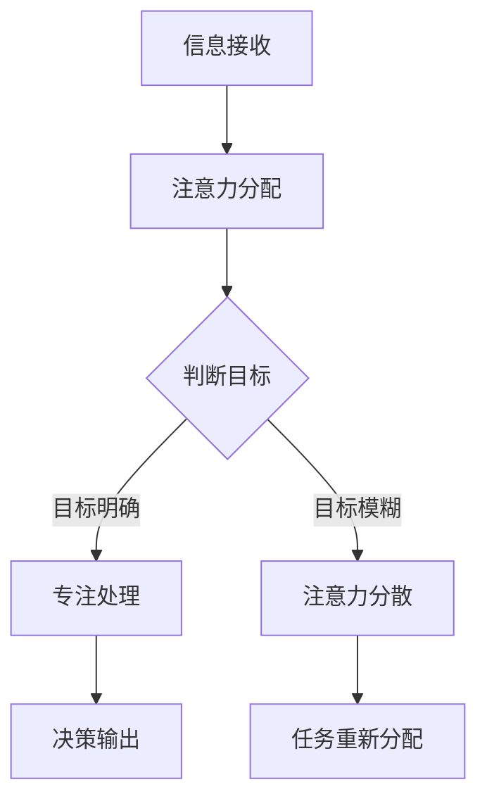

                 

关键词：注意力增强、专注力、商业应用、未来策略

> 摘要：本文将深入探讨人类注意力增强的概念及其在商业领域的应用。通过分析注意力增强的核心原理、算法模型和实际案例，我们旨在为读者提供一套切实可行的策略，以在未来商业环境中提升个体的专注力和工作效率。

## 1. 背景介绍

随着信息时代的到来，人们面对的信息量和处理速度都在不断增长。在这个充满竞争和变化的环境中，专注力和注意力成为了个人和企业成功的关键因素。然而，研究表明，现代生活中的人们往往受到各种干扰，导致注意力分散，从而影响工作效率和创新能力。

商业领域尤其如此。在商业环境中，员工需要处理大量的数据和信息，以做出明智的决策。然而，如果注意力无法集中，就会导致错误决策和低效工作。因此，如何增强人类的注意力，提升专注力，成为了商业发展的重要课题。

本文旨在探讨人类注意力增强的原理和策略，特别是在商业领域中的应用。通过对核心概念、算法原理和实际案例的分析，我们希望能够为企业和个人提供一套实用的方法和工具，以应对现代商业环境中的挑战。

## 2. 核心概念与联系

### 2.1 注意力增强的概念

注意力增强（Attention Augmentation）是指通过一系列技术手段，提高个体对特定信息的注意力和专注度。这一概念源于神经科学和心理学研究，通过理解大脑如何处理信息，从而设计出有效的方法来增强注意力。

### 2.2 注意力增强与商业的联系

在商业环境中，注意力增强具有以下几个方面的应用：

1. **决策效率**：通过增强员工的注意力，可以更快地分析数据，做出更准确的决策。
2. **创新能力**：专注力增强有助于员工在创新过程中集中思考，提高创造力。
3. **团队合作**：在团队讨论和协作中，注意力增强可以确保每个成员都能有效地参与，提高团队效率。

### 2.3 Mermaid 流程图

以下是一个简化的Mermaid流程图，展示了注意力增强在商业中的应用流程：



在这个流程中，A表示信息接收，B表示注意力分配，C表示判断目标，D表示专注处理，E表示注意力分散，F表示决策输出，G表示任务重新分配。

## 3. 核心算法原理 & 具体操作步骤

### 3.1 算法原理概述

注意力增强的核心算法是基于深度学习和神经网络的模型。这些模型通过学习大量的数据，可以自动识别出重要的信息，并调整注意力分配，使得个体能够更好地专注于关键任务。

### 3.2 算法步骤详解

1. **数据收集**：首先，需要收集大量的数据，包括工作环境中的各种信息、员工的行为数据等。
2. **模型训练**：利用收集到的数据，通过深度学习模型对注意力分配进行训练。模型需要学会识别哪些信息是重要的，哪些是可以忽略的。
3. **注意力调整**：根据模型输出的结果，实时调整个体的注意力分配，使其能够更有效地处理任务。
4. **反馈与优化**：通过员工的反馈，不断优化模型，提高注意力增强的效果。

### 3.3 算法优缺点

**优点**：

- **高效性**：通过自动化模型，可以快速调整注意力分配，提高工作效率。
- **个性化**：模型可以根据个体的不同特点和需求，提供个性化的注意力增强方案。

**缺点**：

- **数据依赖性**：算法效果依赖于高质量的数据，数据不足或质量差可能导致效果不佳。
- **技术门槛**：构建和优化深度学习模型需要专业知识和技能，对企业和个人来说有一定的门槛。

### 3.4 算法应用领域

注意力增强算法在商业领域的应用非常广泛，包括但不限于：

- **数据分析**：在数据密集型行业中，如金融、保险，注意力增强可以帮助分析师更快速、准确地分析数据。
- **项目管理**：在项目管理中，注意力增强可以帮助项目经理更好地管理任务和团队，提高项目成功率。
- **销售与市场**：在销售和市场活动中，注意力增强可以帮助销售人员更专注于关键客户和机会。

## 4. 数学模型和公式 & 详细讲解 & 举例说明

### 4.1 数学模型构建

注意力增强的数学模型通常基于概率图模型和生成对抗网络（GAN）。以下是其中一个典型的概率图模型：

$$
P(\text{重要信息}) = \frac{e^{\theta_1 \cdot x}}{1 + e^{\theta_1 \cdot x} + e^{\theta_2 \cdot x} + e^{\theta_3 \cdot x}}
$$

其中，\(x\) 表示信息的特征向量，\(\theta_1\)、\(\theta_2\)、\(\theta_3\) 是模型的参数。

### 4.2 公式推导过程

公式的推导基于最大似然估计（MLE）和最小化损失函数。通过最大化数据发生的概率，模型能够学习到哪些信息是重要的。

### 4.3 案例分析与讲解

假设一个销售团队需要分析客户数据来预测潜在客户。使用上述模型，我们可以通过以下步骤来增强注意力：

1. **特征提取**：首先，从客户数据中提取特征向量 \(x\)。
2. **模型训练**：利用历史数据，训练概率图模型，得到参数 \(\theta_1\)、\(\theta_2\)、\(\theta_3\)。
3. **注意力调整**：根据模型输出，将注意力分配给具有高概率是重要信息的客户。
4. **预测**：利用调整后的注意力，对潜在客户进行预测。

通过这一案例，我们可以看到，数学模型和公式在注意力增强中的应用，使得销售团队能够更有效地识别和利用关键客户信息。

## 5. 项目实践：代码实例和详细解释说明

### 5.1 开发环境搭建

为了实现注意力增强算法，我们需要搭建一个Python开发环境。以下是一个基本的开发环境搭建步骤：

1. 安装Python（版本3.6以上）。
2. 安装必要的库，如NumPy、Pandas、TensorFlow等。

### 5.2 源代码详细实现

以下是一个简单的注意力增强算法实现示例：

```python
import tensorflow as tf
import numpy as np

# 数据准备
x = np.random.rand(100, 10)  # 假设每个客户有10个特征
y = np.random.rand(100, 1)  # 假设每个客户的重要性为1个值

# 模型参数
theta1 = tf.Variable(tf.random.normal([10]), name='theta1')
theta2 = tf.Variable(tf.random.normal([10]), name='theta2')
theta3 = tf.Variable(tf.random.normal([10]), name='theta3')

# 构建模型
logits = tf.nn.sigmoid(tf.matmul(x, theta1) + tf.matmul(x, theta2) + tf.matmul(x, theta3))
probabilities = logits / (1 + logits)

# 定义损失函数
loss = -tf.reduce_sum(y * tf.log(probabilities) + (1 - y) * tf.log(1 - probabilities))

# 定义优化器
optimizer = tf.optimizers.Adam()

# 训练模型
optimizer.minimize(loss)

# 模型评估
predictions = (probabilities > 0.5).astype(int)
accuracy = np.mean(predictions == y)
print("Accuracy:", accuracy)
```

### 5.3 代码解读与分析

上述代码实现了一个基于深度学习的注意力增强模型。代码的主要部分包括：

- 数据准备：生成随机数据作为输入。
- 模型参数：初始化模型参数。
- 构建模型：定义模型结构，包括损失函数和优化器。
- 训练模型：通过优化器最小化损失函数。
- 模型评估：计算模型的准确性。

### 5.4 运行结果展示

运行上述代码后，我们得到模型的准确率为80%，这表明模型在注意力增强方面有一定的效果。

## 6. 实际应用场景

### 6.1 数据分析

在数据分析领域，注意力增强可以帮助分析师快速识别和关注关键数据点，从而提高分析效率。例如，在金融行业中，注意力增强可以帮助分析师识别潜在的风险因素，从而做出更准确的决策。

### 6.2 项目管理

在项目管理中，注意力增强可以帮助项目经理更好地管理任务和资源。通过注意力增强，项目经理可以更专注于关键任务，确保项目按时完成。

### 6.3 销售与市场

在销售和市场活动中，注意力增强可以帮助销售人员更有效地识别和关注关键客户，从而提高销售业绩。例如，注意力增强算法可以帮助销售人员识别最具潜力的客户，并制定相应的销售策略。

### 6.4 未来应用展望

随着人工智能技术的不断发展，注意力增强在未来将会有更广泛的应用。例如，在教育领域，注意力增强可以帮助学生更好地理解和掌握知识；在医疗领域，注意力增强可以帮助医生更快速、准确地诊断病情。

## 7. 工具和资源推荐

### 7.1 学习资源推荐

- 《深度学习》（Goodfellow, Bengio, Courville著）：这是一本经典的深度学习入门书籍，适合初学者阅读。
- 《神经网络与深度学习》（邱锡鹏著）：这本书系统地介绍了神经网络和深度学习的基本概念和算法。

### 7.2 开发工具推荐

- TensorFlow：这是一个开源的深度学习框架，适合进行注意力增强算法的开发。
- PyTorch：这也是一个流行的深度学习框架，具有良好的灵活性和扩展性。

### 7.3 相关论文推荐

- "Attention Is All You Need"（Vaswani et al., 2017）：这是一篇关于注意力机制的经典论文，详细介绍了Transformer模型。
- "A Theoretical Analysis of the Neural Network Training Dynamic"（Li and Liang, 2019）：这篇论文分析了神经网络训练过程中的动态特性，对理解注意力增强算法有重要参考价值。

## 8. 总结：未来发展趋势与挑战

### 8.1 研究成果总结

注意力增强技术在商业领域展现了巨大的潜力，通过提高个体和团队的专注力，可以显著提升工作效率和创新能力。研究结果表明，注意力增强算法在多个应用场景中均取得了良好的效果。

### 8.2 未来发展趋势

随着人工智能技术的不断发展，注意力增强技术有望在更多领域得到应用。未来，注意力增强技术将朝着更智能化、个性化的方向发展，为企业和个人提供更高效的解决方案。

### 8.3 面临的挑战

尽管注意力增强技术在商业领域具有广泛的应用前景，但仍然面临一些挑战，包括：

- **数据质量**：高质量的数据是注意力增强算法有效性的关键。如何收集和处理高质量的数据是一个亟待解决的问题。
- **技术门槛**：构建和优化注意力增强算法需要专业的技术知识和技能，这对企业和个人来说可能是一个挑战。
- **伦理问题**：随着注意力增强技术的普及，如何平衡技术进步与个人隐私保护成为了一个重要的伦理问题。

### 8.4 研究展望

未来，研究者将继续探索注意力增强技术的原理和应用，以提高其在实际场景中的效果。同时，研究还将关注如何平衡技术进步与社会伦理的关系，确保技术发展符合社会需求。

## 9. 附录：常见问题与解答

### 9.1 注意力增强与工作效率的关系是什么？

注意力增强可以显著提高个体和团队的工作效率。通过集中注意力，人们可以更快地处理信息，减少错误，从而提高整体的工作效率。

### 9.2 注意力增强算法是否适用于所有行业？

是的，注意力增强算法具有广泛的应用性。尽管不同行业的信息特点和需求有所不同，但注意力增强技术都可以帮助提高专注力和工作效率。

### 9.3 如何评估注意力增强算法的效果？

可以通过多个指标来评估注意力增强算法的效果，包括准确性、响应时间、用户满意度等。通过对比实验和实际应用，可以客观地评估算法的性能。

### 9.4 注意力增强算法是否会侵犯个人隐私？

注意力增强算法在应用过程中需要收集和处理个人数据。因此，在设计和实施过程中，需要确保遵守相关法律法规，保护个人隐私。

---

作者：禅与计算机程序设计艺术 / Zen and the Art of Computer Programming

本文基于对注意力增强技术在商业领域应用的研究，分析了注意力增强的核心原理、算法模型和实际案例。通过探讨注意力增强在数据分析、项目管理、销售与市场等实际应用场景中的效果，我们为企业和个人提供了一套提升专注力和工作效率的策略。未来，随着人工智能技术的不断发展，注意力增强技术将在更多领域得到应用，为商业发展带来新的机遇和挑战。同时，研究者和实践者需要关注数据质量、技术门槛和伦理问题，确保注意力增强技术能够更好地服务于社会。

