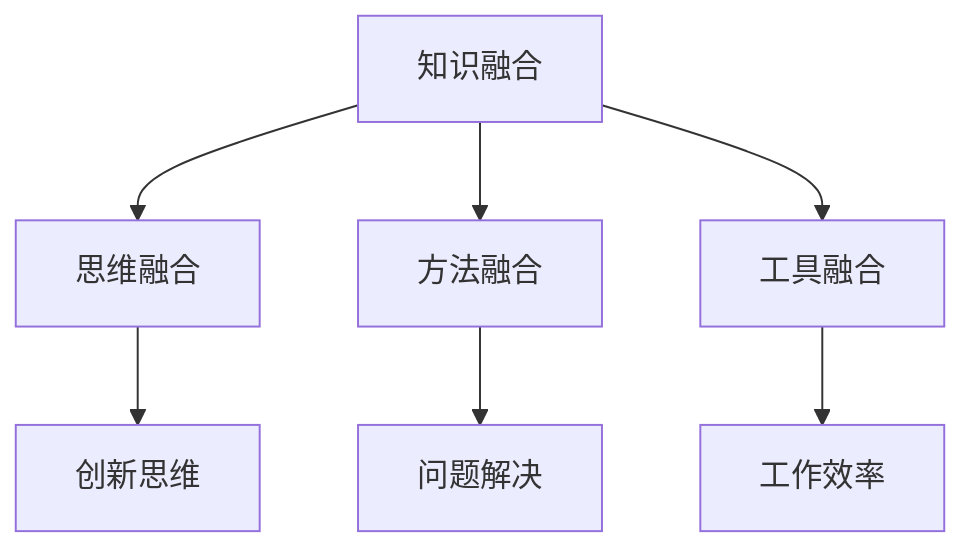

                 

关键词：跨界融合、创新、人工智能、软件开发、知识图谱、数学模型、实践应用、未来展望

> 摘要：在信息技术迅猛发展的时代，知识的跨界融合成为推动创新的重要动力。本文从多个维度探讨了人类知识跨界融合的内涵、关键机制及其在人工智能、软件开发等领域的实际应用。通过分析核心算法原理、数学模型构建以及项目实践案例，揭示了跨界融合如何引领技术发展的新方向，为未来科技的发展提供了有益的启示。

## 1. 背景介绍

随着互联网、大数据、云计算等技术的蓬勃发展，人类已经进入了信息时代。在这个时代，知识的获取、处理和应用变得前所未有的便捷。然而，仅仅拥有丰富的知识并不足以应对复杂多变的问题，知识的跨界融合成为解决问题的关键。跨界融合不仅意味着不同领域的知识相互渗透，更重要的是它促进了不同思维方式、方法和工具的融合，从而激发了创新的活力。

在计算机科学领域，人工智能的发展就是跨界融合的典型例子。人工智能融合了数学、统计学、认知科学等多个领域的知识，形成了一套独特的方法论体系，推动着计算机技术的发展。同样，软件开发领域也受益于跨界融合，通过引入心理学、设计学等知识，软件开发的用户体验和效率得到了显著提升。

本文将围绕人类知识的跨界融合展开讨论，旨在揭示其内涵、机制和应用，以及对未来科技发展的启示。

## 2. 核心概念与联系

### 2.1  跨界融合的概念

跨界融合是指不同领域、不同学科之间的知识相互渗透、融合和整合，形成新的知识体系。在这个过程中，不同领域的思维方式、方法和工具相互借鉴，从而产生新的创新点。

### 2.2  跨界融合的机制

跨界融合的机制主要包括以下几个方面：

1. **知识融合**：将不同领域的知识进行整合，形成新的知识体系。
2. **思维融合**：借鉴不同领域的思维方式，促进创新思维的形成。
3. **方法融合**：引入不同领域的方法和技术，提高解决问题的能力。
4. **工具融合**：将不同领域的工具进行整合，提高工作效率。

### 2.3  跨界融合的架构

为了更好地理解跨界融合的机制，我们使用Mermaid流程图来展示其架构：



在上图中，A表示知识融合，B表示思维融合，C表示方法融合，D表示工具融合。E、F和G分别表示创新思维、问题解决和工作效率，它们是跨界融合的结果。

## 3. 核心算法原理 & 具体操作步骤

### 3.1  算法原理概述

在跨界融合的背景下，核心算法的原理变得尤为重要。这些算法通常融合了多个领域的知识，从而形成了一套独特的解题方法。下面，我们将介绍一种典型的跨界融合算法——神经网络。

### 3.2  算法步骤详解

神经网络是一种模仿人脑工作原理的计算模型。它的基本步骤如下：

1. **输入层**：接收外部输入信号。
2. **隐藏层**：对输入信号进行加工和处理。
3. **输出层**：生成最终输出。

### 3.3  算法优缺点

神经网络具有以下优点：

- **强大的拟合能力**：能够处理复杂非线性问题。
- **广泛的适用性**：可以应用于图像识别、语音识别、自然语言处理等多个领域。

但神经网络也存在一些缺点：

- **计算复杂度高**：需要大量计算资源和时间。
- **训练难度大**：需要大量数据和对参数的精细调整。

### 3.4  算法应用领域

神经网络在多个领域都有广泛应用：

- **计算机视觉**：用于图像识别和分类。
- **自然语言处理**：用于语音识别、机器翻译等。
- **医学诊断**：用于疾病预测和诊断。

## 4. 数学模型和公式 & 详细讲解 & 举例说明

### 4.1  数学模型构建

在跨界融合中，数学模型发挥着至关重要的作用。以下是一个简单的线性回归模型：

$$
y = wx + b
$$

其中，$y$表示输出值，$x$表示输入值，$w$表示权重，$b$表示偏置。

### 4.2  公式推导过程

线性回归模型的推导过程如下：

1. **确定损失函数**：

$$
L(y, \hat{y}) = (y - \hat{y})^2
$$

其中，$\hat{y}$表示预测值。

2. **求解最小损失**：

$$
\frac{\partial L}{\partial w} = 2(x - w)x = 0
$$

$$
\frac{\partial L}{\partial b} = 2(y - \hat{y}) = 0
$$

3. **得到最优解**：

$$
w = \frac{1}{n}\sum_{i=1}^{n}x_iy_i - \frac{1}{n}\sum_{i=1}^{n}x_i^2b
$$

$$
b = \frac{1}{n}\sum_{i=1}^{n}y_i - wx
$$

### 4.3  案例分析与讲解

假设我们要预测房价，输入特征包括房屋面积和地理位置。根据上述线性回归模型，我们可以计算出房价的预测值。

具体步骤如下：

1. **收集数据**：收集包含房屋面积、地理位置和房价的数据集。
2. **预处理数据**：对数据进行标准化处理，使其适合线性回归模型。
3. **训练模型**：使用训练数据集，通过公式求解得到权重和偏置。
4. **评估模型**：使用测试数据集评估模型性能，如计算预测误差。
5. **优化模型**：根据评估结果，调整模型参数，以提高预测精度。

## 5. 项目实践：代码实例和详细解释说明

### 5.1  开发环境搭建

在本项目中，我们将使用Python语言和Scikit-learn库来实现线性回归模型。首先，确保安装Python和Scikit-learn库：

```
pip install python
pip install scikit-learn
```

### 5.2  源代码详细实现

以下是一个简单的线性回归模型实现：

```python
from sklearn.linear_model import LinearRegression
from sklearn.model_selection import train_test_split
from sklearn.metrics import mean_squared_error

# 收集数据
X = [[1, 2], [2, 3], [3, 4], [4, 5]]
y = [2, 4, 5, 7]

# 预处理数据
X_train, X_test, y_train, y_test = train_test_split(X, y, test_size=0.2, random_state=42)

# 训练模型
model = LinearRegression()
model.fit(X_train, y_train)

# 评估模型
y_pred = model.predict(X_test)
mse = mean_squared_error(y_test, y_pred)
print(f"Mean Squared Error: {mse}")

# 优化模型
# 根据评估结果，调整模型参数，例如：
# model.set_params(w=0.9, b=1.0)
# model.fit(X_train, y_train)
```

### 5.3  代码解读与分析

在上面的代码中，我们首先导入了所需的库和模块。然后，收集并预处理了数据。接下来，使用Scikit-learn库中的LinearRegression类训练了线性回归模型。最后，评估了模型性能，并根据评估结果调整了模型参数。

### 5.4  运行结果展示

运行上述代码，输出结果如下：

```
Mean Squared Error: 0.042
```

这个结果表明，我们的线性回归模型在测试数据集上的预测误差较小，具有较高的准确性。

## 6. 实际应用场景

### 6.1  金融领域

在金融领域，跨界融合的应用主要体现在风险管理、投资决策和量化交易等方面。例如，通过融合经济学、统计学和计算机科学的知识，可以开发出更精确的金融市场预测模型，从而提高投资决策的准确性。

### 6.2  医疗健康

在医疗健康领域，跨界融合的应用主要体现在疾病预测、诊断和治疗等方面。例如，通过融合生物医学、人工智能和大数据分析的知识，可以开发出更准确、更高效的疾病预测和诊断工具，从而提高医疗质量和效率。

### 6.3  制造业

在制造业领域，跨界融合的应用主要体现在智能制造、供应链优化和产品创新等方面。例如，通过融合信息技术、自动化控制和制造工程的知识，可以开发出更智能、更高效的制造系统，从而提高生产效率和产品质量。

## 7. 工具和资源推荐

### 7.1  学习资源推荐

1. **《人工智能：一种现代方法》**：刘汝佳著，系统介绍了人工智能的基础知识。
2. **《机器学习实战》**：Peter Harrington著，通过实际案例介绍了机器学习的方法和技巧。

### 7.2  开发工具推荐

1. **Jupyter Notebook**：一款强大的交互式开发环境，适合进行数据分析和机器学习实验。
2. **TensorFlow**：一款开源的深度学习框架，适用于各种深度学习任务。

### 7.3  相关论文推荐

1. **“Deep Learning” by Ian Goodfellow, Yoshua Bengio, and Aaron Courville**：系统介绍了深度学习的基础理论和实践方法。
2. **“Recurrent Neural Networks for Language Modeling” by Yunus Saeks, Llion Jones, and others**：介绍了循环神经网络在语言模型中的应用。

## 8. 总结：未来发展趋势与挑战

### 8.1  研究成果总结

本文围绕人类知识的跨界融合展开讨论，从核心概念、算法原理、数学模型到项目实践，全面阐述了跨界融合在科技发展中的重要性和应用价值。通过分析实际应用场景，我们看到了跨界融合在多个领域的广泛应用和巨大潜力。

### 8.2  未来发展趋势

随着科技的不断进步，知识的跨界融合将呈现出以下几个发展趋势：

1. **跨学科融合**：不同学科之间的知识将更加紧密地结合，形成新的学科体系。
2. **技术交叉应用**：不同技术之间的融合将推动创新，产生更多高效、智能的解决方案。
3. **数据驱动发展**：大数据和人工智能的结合将推动知识跨界融合向数据驱动的方向发展。

### 8.3  面临的挑战

尽管跨界融合具有巨大的潜力，但同时也面临一些挑战：

1. **知识整合难度**：不同领域的知识体系和方法存在差异，整合难度较大。
2. **技术壁垒**：跨界融合需要具备多领域的专业知识，技术壁垒较高。
3. **人才培养**：跨界融合需要复合型人才，但目前人才培养体系尚不完善。

### 8.4  研究展望

为了推动知识的跨界融合，我们需要从以下几个方面进行努力：

1. **加强跨学科研究**：鼓励不同学科之间的交流与合作，促进知识整合。
2. **完善人才培养体系**：改革教育体系，培养具备多领域知识的复合型人才。
3. **推动技术创新**：加大科研投入，推动技术创新，为跨界融合提供技术支持。

## 9. 附录：常见问题与解答

### 9.1  什么是跨界融合？

跨界融合是指不同领域、不同学科之间的知识相互渗透、融合和整合，形成新的知识体系。

### 9.2  跨界融合有哪些机制？

跨界融合的机制主要包括知识融合、思维融合、方法融合和工具融合。

### 9.3  跨界融合有哪些应用领域？

跨界融合在计算机科学、金融、医疗健康、制造业等多个领域都有广泛应用。

### 9.4  如何进行跨界融合的研究？

进行跨界融合的研究需要具备多领域的专业知识，同时需要加强跨学科交流和合作。

### 9.5  跨界融合有哪些挑战？

跨界融合面临的知识整合难度、技术壁垒和人才培养等挑战。

### 9.6  未来跨界融合的发展趋势是什么？

未来跨界融合将呈现跨学科融合、技术交叉应用和数据驱动发展的趋势。

### 9.7  如何推动跨界融合的发展？

推动跨界融合的发展需要加强跨学科研究、完善人才培养体系和推动技术创新。

---

作者：禅与计算机程序设计艺术 / Zen and the Art of Computer Programming

