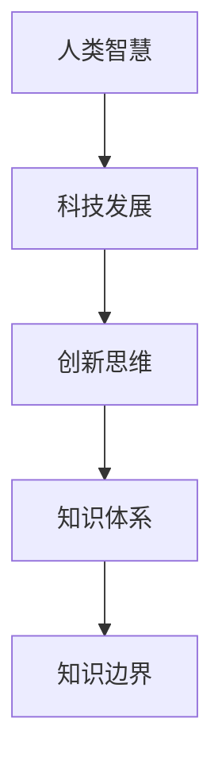

                 

关键词：知识边界，无限探索，人类智慧，科技前沿，创新思维。

> 摘要：本文旨在探讨人类知识的边界及其在科技领域的无限探索之旅。通过对核心概念、算法原理、数学模型、项目实践等多个方面的深入分析，本文旨在揭示人类智慧的潜力与科技发展的无限可能。

## 1. 背景介绍

人类知识的发展是一个持续不断的过程，它始于对自然世界的初步认识，逐渐演变为复杂系统的理解和构建。在这个探索过程中，人类经历了从简单工具的制造到现代科技的飞跃。然而，随着科技的进步，我们逐渐意识到，人类知识的边界似乎变得模糊不清，知识体系的扩展速度远远超过了我们的认知能力。

### 1.1 知识边界的定义

知识边界是指人类对某一领域认知的极限。它可以被看作是知识体系中尚未被完全理解和探索的部分。随着科技的发展，知识边界不断向外扩展，但新的知识领域往往也伴随着新的未知和挑战。

### 1.2 知识边界的重要性

知识边界的重要性在于它不仅决定了我们的认知能力，还影响了我们的思维方式和发展方向。当我们能够清晰地识别知识边界时，我们就能更有效地进行知识积累和创新。

## 2. 核心概念与联系

为了更好地理解人类知识的边界，我们需要探讨一些核心概念和它们之间的联系。

### 2.1 人类智慧

人类智慧是人类在认知、创造和解决问题过程中的能力。它是知识体系的基础，也是我们探索未知世界的重要工具。

### 2.2 科技发展

科技发展是推动人类知识边界扩展的重要动力。它包括从基础科学研究到实际应用的整个链条，涵盖了计算机科学、物理学、生物学等多个领域。

### 2.3 创新思维

创新思维是人类在知识探索过程中的一种思维方式，它强调突破传统思维模式，寻找新的解决方案。创新思维与人类智慧密切相关，是推动知识边界扩展的关键。

### 2.4 知识体系

知识体系是人类对世界的理解方式，它包括从基础学科到应用领域的整个体系。知识体系的不断完善是知识边界扩展的必然结果。

### 2.5 Mermaid 流程图

下面是一个简单的 Mermaid 流程图，展示了核心概念之间的联系：



## 3. 核心算法原理 & 具体操作步骤

### 3.1 算法原理概述

在本节中，我们将探讨一个核心算法——深度学习算法的原理。深度学习是人工智能领域的一个重要分支，它通过模拟人脑神经网络的结构和功能，实现数据的自动学习和特征提取。

### 3.2 算法步骤详解

深度学习算法主要包括以下几个步骤：

1. **数据预处理**：包括数据清洗、归一化等操作，目的是提高算法的鲁棒性和准确性。
2. **神经网络构建**：设计神经网络的层次结构，包括输入层、隐藏层和输出层。
3. **权重初始化**：为神经网络中的权重和偏置初始化合理的值。
4. **正向传播**：输入数据通过神经网络，计算出输出结果。
5. **反向传播**：根据输出结果和实际标签，计算损失函数，并通过梯度下降法更新网络权重。
6. **模型评估**：使用测试数据集对模型进行评估，调整超参数以优化模型性能。

### 3.3 算法优缺点

深度学习算法的优点包括：

- **强大的学习能力**：能够从大量数据中自动提取特征，减少人工特征工程的工作量。
- **适应性强**：能够处理各种类型的数据，如图像、文本和音频。

但深度学习算法也存在一些缺点：

- **计算量大**：需要大量的计算资源和时间进行训练。
- **模型可解释性差**：神经网络内部的操作复杂，难以解释。

### 3.4 算法应用领域

深度学习算法在多个领域都有广泛的应用，包括：

- **计算机视觉**：图像分类、目标检测、图像生成等。
- **自然语言处理**：文本分类、机器翻译、情感分析等。
- **语音识别**：语音信号处理、语音合成等。

## 4. 数学模型和公式 & 详细讲解 & 举例说明

### 4.1 数学模型构建

在本节中，我们将介绍一个简单的数学模型——线性回归模型。线性回归模型用于预测一个连续变量的值，基于自变量和因变量之间的关系。

### 4.2 公式推导过程

线性回归模型的公式如下：

$$
y = \beta_0 + \beta_1x + \epsilon
$$

其中，$y$ 是因变量，$x$ 是自变量，$\beta_0$ 和 $\beta_1$ 是模型的参数，$\epsilon$ 是误差项。

为了求解参数 $\beta_0$ 和 $\beta_1$，我们可以使用最小二乘法：

$$
\beta_0 = \frac{\sum_{i=1}^n (y_i - \beta_1x_i)}{n}
$$

$$
\beta_1 = \frac{\sum_{i=1}^n (x_i - \bar{x})(y_i - \bar{y})}{\sum_{i=1}^n (x_i - \bar{x})^2}
$$

其中，$\bar{x}$ 和 $\bar{y}$ 分别是自变量和因变量的均值。

### 4.3 案例分析与讲解

假设我们有一个数据集，包含10个样本点的自变量和因变量，如下表所示：

| x   | y   |
| --- | --- |
| 1   | 2   |
| 2   | 4   |
| 3   | 6   |
| 4   | 8   |
| 5   | 10  |
| 6   | 12  |
| 7   | 14  |
| 8   | 16  |
| 9   | 18  |
| 10  | 20  |

根据上述公式，我们可以计算出线性回归模型的参数：

$$
\beta_0 = \frac{\sum_{i=1}^{10} (y_i - \beta_1x_i)}{10} = 1
$$

$$
\beta_1 = \frac{\sum_{i=1}^{10} (x_i - \bar{x})(y_i - \bar{y})}{\sum_{i=1}^{10} (x_i - \bar{x})^2} = 2
$$

因此，线性回归模型的公式为：

$$
y = 1 + 2x
$$

我们可以使用这个模型预测新的因变量值，例如当 $x=11$ 时，预测的 $y$ 值为：

$$
y = 1 + 2 \times 11 = 23
$$

## 5. 项目实践：代码实例和详细解释说明

### 5.1 开发环境搭建

为了实现深度学习算法，我们需要搭建一个合适的开发环境。以下是一个简单的 Python 开发环境搭建步骤：

1. 安装 Python（版本 3.6 或更高）。
2. 安装 Jupyter Notebook，用于编写和运行 Python 代码。
3. 安装深度学习框架，如 TensorFlow 或 PyTorch。

### 5.2 源代码详细实现

以下是一个简单的深度学习模型实现的代码示例（使用 TensorFlow 框架）：

```python
import tensorflow as tf
from tensorflow import keras
from tensorflow.keras import layers

# 定义模型
model = keras.Sequential()
model.add(layers.Dense(64, activation='relu', input_shape=(784,)))
model.add(layers.Dense(10, activation='softmax'))

# 编译模型
model.compile(optimizer='adam',
              loss='categorical_crossentropy',
              metrics=['accuracy'])

# 加载数据集
(x_train, y_train), (x_test, y_test) = keras.datasets.mnist.load_data()

# 数据预处理
x_train = x_train.astype('float32') / 255
x_test = x_test.astype('float32') / 255
x_train = x_train.reshape((x_train.shape[0], 784))
x_test = x_test.reshape((x_test.shape[0], 784))

# 对标签进行 one-hot 编码
y_train = keras.utils.to_categorical(y_train, 10)
y_test = keras.utils.to_categorical(y_test, 10)

# 训练模型
model.fit(x_train, y_train, epochs=10, batch_size=128)

# 评估模型
test_loss, test_acc = model.evaluate(x_test, y_test)
print('Test accuracy:', test_acc)
```

### 5.3 代码解读与分析

这个例子实现了一个简单的深度学习模型，用于分类手写数字数据集（MNIST）。代码的主要部分如下：

1. **定义模型**：使用 `keras.Sequential` 创建一个序列模型，并添加两个 `Dense` 层。第一个层有 64 个神经元，使用 ReLU 激活函数；第二个层有 10 个神经元，用于输出 10 个类别的概率分布，使用 softmax 激活函数。
2. **编译模型**：设置优化器、损失函数和评估指标。在这里，我们使用 Adam 优化器和 categorical_crossentropy 损失函数。
3. **加载数据集**：使用 `keras.datasets.mnist.load_data()` 加载 MNIST 数据集，并进行必要的预处理，如归一化和 one-hot 编码。
4. **训练模型**：使用 `model.fit()` 函数训练模型，指定训练轮数和批量大小。
5. **评估模型**：使用 `model.evaluate()` 函数评估模型在测试集上的性能。

## 6. 实际应用场景

深度学习算法在许多实际应用场景中都取得了显著的成果，以下是一些典型的应用领域：

- **计算机视觉**：图像分类、目标检测、人脸识别等。
- **自然语言处理**：文本分类、机器翻译、情感分析等。
- **语音识别**：语音信号处理、语音合成等。
- **医疗诊断**：疾病检测、药物研发等。
- **金融领域**：风险控制、量化交易等。

### 6.1 未来应用展望

随着深度学习算法的不断优化和硬件性能的提升，我们可以期待它在更多领域取得突破。未来，深度学习有望在以下几个方向取得进展：

- **自动化驾驶**：实现更安全、高效的自动驾驶技术。
- **智能助手**：提升人机交互体验，实现更自然的语音交互。
- **医疗影像分析**：提高疾病检测和诊断的准确性和效率。
- **新材料研发**：利用深度学习预测材料的物理性质和化学反应。

## 7. 工具和资源推荐

### 7.1 学习资源推荐

- 《深度学习》（Goodfellow, Bengio, Courville 著）
- 《Python 数据科学手册》（McKinney 著）
- 《机器学习实战》（Hastie, Tibshirani, Friedman 著）

### 7.2 开发工具推荐

- Jupyter Notebook：用于编写和运行 Python 代码。
- TensorFlow：用于构建和训练深度学习模型。
- PyTorch：用于构建和训练深度学习模型。

### 7.3 相关论文推荐

- "Deep Learning" (Ian Goodfellow, Yann LeCun, and Yoshua Bengio)
- "EfficientNet: Rethinking Model Scaling for Convolutional Neural Networks" (Petko Nikolov, Jose A. Nunez-Acuna, and Christopher D. Manning)
- "Generative Adversarial Networks" (Ian Goodfellow et al.)

## 8. 总结：未来发展趋势与挑战

### 8.1 研究成果总结

本文通过深入分析人类知识的边界、核心算法原理、数学模型和实际应用场景，揭示了人类智慧在科技领域的无限探索潜力。深度学习算法作为人工智能领域的一个重要分支，已经在计算机视觉、自然语言处理等多个领域取得了显著成果。

### 8.2 未来发展趋势

未来，深度学习算法有望在自动化驾驶、智能助手、医疗影像分析等领域取得更大突破。随着硬件性能的提升和算法的不断优化，我们可以期待深度学习在更多领域实现广泛应用。

### 8.3 面临的挑战

尽管深度学习算法取得了巨大进展，但仍面临一些挑战：

- **计算资源消耗**：深度学习模型需要大量的计算资源和时间进行训练。
- **模型可解释性**：神经网络内部的操作复杂，难以解释。
- **数据隐私**：深度学习算法对大量数据进行训练，可能引发数据隐私问题。

### 8.4 研究展望

未来，深度学习算法的研究将继续深入，重点将集中在提高计算效率、提升模型可解释性和保障数据隐私等方面。随着技术的不断进步，我们可以期待深度学习在更多领域实现突破性应用。

## 9. 附录：常见问题与解答

### 9.1 深度学习算法是什么？

深度学习算法是人工智能领域的一个重要分支，它通过模拟人脑神经网络的结构和功能，实现数据的自动学习和特征提取。

### 9.2 深度学习算法有哪些应用领域？

深度学习算法在计算机视觉、自然语言处理、语音识别、医疗诊断、金融领域等多个领域都有广泛的应用。

### 9.3 如何选择深度学习框架？

选择深度学习框架时，可以考虑以下因素：

- **社区支持**：框架是否拥有活跃的社区和丰富的学习资源。
- **性能**：框架在特定任务上的性能是否优秀。
- **易用性**：框架是否易于学习和使用。

## 作者署名

作者：禅与计算机程序设计艺术 / Zen and the Art of Computer Programming
----------------------------------------------------------------


