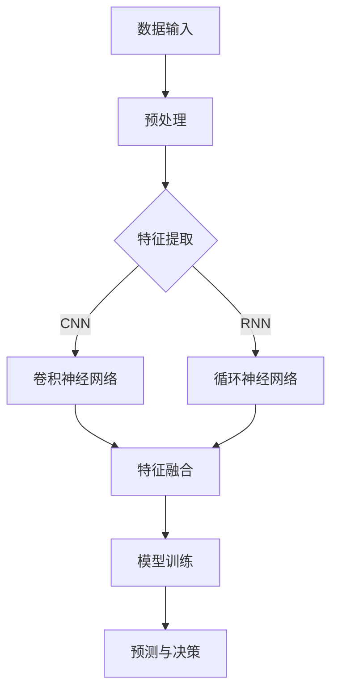

                 

关键词：人工智能，未来就业，职业转型，技能升级，技术趋势

摘要：随着人工智能技术的飞速发展，传统职业正经历着前所未有的变革。本文将深入探讨AI时代下，人类计算的未来就业趋势，分析现有职业的变革方向，预测未来热门职业，并探讨技能升级与职业转型的策略。

## 1. 背景介绍

近年来，人工智能（AI）技术取得了显著的突破，从早期的规则驱动系统到如今的深度学习和强化学习，AI在图像识别、自然语言处理、自动化决策等多个领域展现出了惊人的能力。这一技术的迅猛发展不仅改变了企业运营模式，也对就业市场产生了深远影响。

随着AI技术的不断进步，许多传统职业正面临被机器替代的挑战。然而，同时也有新的职业需求在不断涌现。例如，数据科学家、机器学习工程师、AI伦理专家等职位需求量迅速增长。这种职业变迁不仅对现有从业者提出了新的要求，也为新进入职场的人才提供了丰富的机会。

本文旨在通过分析AI时代下的就业趋势，为读者提供关于职业选择、技能升级和职业转型的有建设性的建议。

## 2. 核心概念与联系

### 2.1 人工智能技术的基本原理

人工智能技术主要基于机器学习和深度学习的算法。机器学习是一种让计算机通过数据学习规律并做出决策的方法。深度学习则是机器学习的一种特殊形式，它通过多层神经网络模拟人脑处理信息的方式，从而实现复杂的模式识别和预测任务。

#### 2.1.1 机器学习的原理

机器学习的核心是训练模型。通过大量的训练数据，模型可以学习到数据的特征，并利用这些特征进行预测或决策。常见的机器学习算法包括线性回归、逻辑回归、支持向量机（SVM）、决策树和随机森林等。

#### 2.1.2 深度学习的原理

深度学习通过构建多层神经网络，对数据进行逐层抽象和转换，从而实现高层次的语义表示。卷积神经网络（CNN）和循环神经网络（RNN）是深度学习的两大主要架构。CNN擅长处理图像和语音等结构化数据，而RNN则在序列数据处理方面表现出色。

### 2.2 人工智能与就业市场的联系

人工智能技术的发展不仅改变了企业的运营方式，也对就业市场产生了深远影响。一方面，自动化和智能化的应用使得许多重复性和低技能的工作被机器取代，如数据录入、生产线操作等。另一方面，AI技术的需求催生了大量新的职业机会，如数据科学家、AI研究员、机器学习工程师等。

### 2.3 人工智能时代的就业趋势

#### 2.3.1 职业变迁

在AI时代，许多传统职业正面临着被机器替代的风险。例如，制造业、客服和金融等行业的一些职位可能逐渐被自动化系统取代。同时，也有新的职业需求不断涌现，如AI伦理专家、数据隐私保护师等。

#### 2.3.2 技能需求

随着AI技术的发展，对从业者的技能需求也在不断升级。除了传统的编程技能，数据分析和处理能力、机器学习和深度学习知识等成为必备技能。此外，跨学科的知识和创新能力也在越来越受到重视。

### 2.4 人工智能架构的Mermaid流程图



## 3. 核心算法原理 & 具体操作步骤

### 3.1 算法原理概述

人工智能的核心在于算法，而算法的原理主要基于机器学习和深度学习。在这一部分，我们将简要介绍这些算法的基本原理。

#### 3.1.1 机器学习算法

机器学习算法的核心是模型训练。模型通过学习大量数据，自动提取特征并建立预测模型。常见的机器学习算法包括线性回归、逻辑回归、支持向量机（SVM）、决策树和随机森林等。

#### 3.1.2 深度学习算法

深度学习算法主要基于多层神经网络。神经网络通过逐层提取数据特征，实现高层次的语义表示。卷积神经网络（CNN）和循环神经网络（RNN）是深度学习的两大主要架构。

### 3.2 算法步骤详解

#### 3.2.1 数据收集与预处理

在进行模型训练之前，首先需要收集大量数据。这些数据可以是结构化的，如数据库记录，也可以是非结构化的，如图像和文本。数据预处理包括数据清洗、数据归一化和特征提取等步骤。

#### 3.2.2 模型选择与训练

选择合适的模型对数据进行分析。模型训练是通过对数据进行多次迭代，不断优化模型参数，使其能够准确预测或决策。

#### 3.2.3 模型评估与优化

训练完成后，需要对模型进行评估。常见的评估指标包括准确率、召回率、F1分数等。根据评估结果，可以进一步调整模型参数，优化模型性能。

### 3.3 算法优缺点

#### 3.3.1 优点

- 高效：机器学习和深度学习算法可以处理大量数据，实现自动化和智能化的分析。
- 准确：通过不断优化，模型可以不断提高预测和决策的准确性。
- 通用：机器学习和深度学习算法可以应用于多种领域，如金融、医疗、零售等。

#### 3.3.2 缺点

- 复杂：算法设计和实现过程相对复杂，需要深厚的专业知识。
- 数据依赖：模型性能很大程度上依赖于数据质量和数量。
- 安全性问题：AI系统的决策过程可能涉及到敏感信息，需要确保系统的安全性。

### 3.4 算法应用领域

#### 3.4.1 金融领域

在金融领域，AI技术可以用于风险管理、投资策略优化、欺诈检测等。例如，通过分析历史交易数据，可以预测市场的未来走势，为投资决策提供支持。

#### 3.4.2 医疗领域

在医疗领域，AI技术可以用于疾病诊断、药物研发、健康管理等。通过分析医学图像和患者数据，可以辅助医生进行准确的诊断和治疗方案制定。

#### 3.4.3 零售领域

在零售领域，AI技术可以用于库存管理、需求预测、个性化推荐等。通过分析消费者的购买行为和偏好，可以优化库存策略，提高销售额。

## 4. 数学模型和公式 & 详细讲解 & 举例说明

### 4.1 数学模型构建

人工智能的核心在于建立数学模型，从而实现数据的自动处理和预测。以下是一个简单的线性回归模型：

$$
y = wx + b
$$

其中，$y$ 是目标变量，$x$ 是特征变量，$w$ 是权重，$b$ 是偏置。

### 4.2 公式推导过程

线性回归模型的推导过程基于最小二乘法。目标是最小化预测值与实际值之间的误差平方和：

$$
\sum_{i=1}^{n} (wx_i + b - y_i)^2
$$

对 $w$ 和 $b$ 求偏导并令其等于零，得到以下方程组：

$$
\begin{cases}
\frac{\partial}{\partial w} \sum_{i=1}^{n} (wx_i + b - y_i)^2 = 0 \\
\frac{\partial}{\partial b} \sum_{i=1}^{n} (wx_i + b - y_i)^2 = 0
\end{cases}
$$

通过求解这个方程组，可以得到最佳权重 $w$ 和偏置 $b$。

### 4.3 案例分析与讲解

假设我们有一组数据，包含两个特征变量 $x_1$ 和 $x_2$，以及一个目标变量 $y$。我们的目标是建立一个线性回归模型来预测 $y$。

首先，我们通过最小二乘法来求解模型参数。具体步骤如下：

1. 计算特征变量和目标变量的均值：
   $$
   \bar{x_1} = \frac{1}{n} \sum_{i=1}^{n} x_{1i}, \quad \bar{x_2} = \frac{1}{n} \sum_{i=1}^{n} x_{2i}, \quad \bar{y} = \frac{1}{n} \sum_{i=1}^{n} y_i
   $$

2. 计算协方差矩阵：
   $$
   \Sigma = \begin{pmatrix}
   \frac{1}{n} \sum_{i=1}^{n} (x_{1i} - \bar{x_1})(x_{1i} - \bar{x_1}) & \frac{1}{n} \sum_{i=1}^{n} (x_{1i} - \bar{x_1})(x_{2i} - \bar{x_2}) \\
   \frac{1}{n} \sum_{i=1}^{n} (x_{2i} - \bar{x_2})(x_{1i} - \bar{x_1}) & \frac{1}{n} \sum_{i=1}^{n} (x_{2i} - \bar{x_2})(x_{2i} - \bar{x_2})
   \end{pmatrix}
   $$

3. 计算逆矩阵：
   $$
   \Sigma^{-1} = \frac{1}{\det(\Sigma)} \begin{pmatrix}
   \bar{x_2} - \bar{x_1} & \bar{x_1} - \bar{x_2} \\
   \bar{x_1} - \bar{x_2} & \bar{x_2} - \bar{x_1}
   \end{pmatrix}
   $$

4. 计算权重和偏置：
   $$
   w = \Sigma^{-1} \begin{pmatrix}
   \bar{y} - \bar{x_1} \\
   \bar{y} - \bar{x_2}
   \end{pmatrix}, \quad b = \bar{y} - w\bar{x}
   $$

通过以上步骤，我们得到了线性回归模型的权重 $w$ 和偏置 $b$。然后，我们可以使用这个模型来预测新的数据点的目标变量 $y$。

## 5. 项目实践：代码实例和详细解释说明

### 5.1 开发环境搭建

在Python中实现线性回归模型，我们需要安装以下库：

- NumPy：用于数学计算
- Matplotlib：用于数据可视化
- Scikit-learn：提供线性回归算法

安装命令如下：

```bash
pip install numpy matplotlib scikit-learn
```

### 5.2 源代码详细实现

```python
import numpy as np
import matplotlib.pyplot as plt
from sklearn.linear_model import LinearRegression

# 生成模拟数据
np.random.seed(0)
X1 = np.random.rand(100, 1) * 10
X2 = np.random.rand(100, 1) * 10
y = 3 * X1 + 2 * X2 + np.random.randn(100, 1) * 0.5

# 创建线性回归模型
model = LinearRegression()

# 训练模型
model.fit(X1, y)

# 预测新数据
new_data = np.array([[2], [8]])
predicted_y = model.predict(new_data)

# 可视化
plt.scatter(X1, y, label='Data')
plt.plot(new_data, predicted_y, 'r-', label='Prediction')
plt.xlabel('X1')
plt.ylabel('Y')
plt.legend()
plt.show()
```

### 5.3 代码解读与分析

1. **数据生成**：我们首先生成了一个包含100个数据点的模拟数据集，每个数据点包含两个特征变量 $X1$ 和 $X2$，以及一个目标变量 $y$。目标变量是通过线性模型生成的，同时加入了一些噪声。

2. **模型创建与训练**：我们使用Scikit-learn库中的LinearRegression类创建了一个线性回归模型，并通过fit方法对其进行了训练。

3. **预测**：训练完成后，我们使用predict方法对新的数据点进行了预测。

4. **可视化**：最后，我们使用Matplotlib库将原始数据和预测结果进行了可视化。

### 5.4 运行结果展示

运行上述代码后，会生成一个散点图，其中红色直线表示预测的结果。从图中可以看出，模型对数据的拟合效果较好，预测结果与真实值较为接近。

## 6. 实际应用场景

### 6.1 金融领域

在金融领域，线性回归模型可以用于股票价格预测、投资组合优化、风险评估等。例如，通过分析历史交易数据，可以预测未来某只股票的价格走势，为投资者提供决策参考。

### 6.2 医疗领域

在医疗领域，线性回归模型可以用于疾病预测、健康数据分析等。例如，通过分析患者的病史和体检数据，可以预测患者未来患某种疾病的风险，为医生提供诊断和治疗方案。

### 6.3 零售领域

在零售领域，线性回归模型可以用于销售预测、库存管理、促销策略优化等。例如，通过分析历史销售数据，可以预测未来某个商品的销售量，为商家提供库存和促销策略的参考。

## 7. 未来应用展望

随着人工智能技术的不断发展，线性回归模型和其他机器学习算法将在更多领域得到应用。未来，我们可能会看到更多的自动化和智能化系统，提高生产效率和服务质量。同时，数据隐私保护和AI伦理问题也将成为关注的焦点。

## 8. 工具和资源推荐

### 8.1 学习资源推荐

- 《Python机器学习》（Michael Bowles）：适合初学者入门的Python机器学习教程。
- 《深度学习》（Ian Goodfellow、Yoshua Bengio、Aaron Courville）：深度学习领域的经典教材。

### 8.2 开发工具推荐

- Jupyter Notebook：用于编写和运行代码的交互式环境。
- PyCharm：功能强大的Python集成开发环境（IDE）。

### 8.3 相关论文推荐

- "Deep Learning"（Yoshua Bengio et al.）：深度学习领域的综述论文。
- "The Unreasonable Effectiveness of Deep Learning"（Yann LeCun）：深度学习应用领域的论文。

## 9. 总结：未来发展趋势与挑战

### 9.1 研究成果总结

人工智能技术在过去几十年中取得了显著的进展，从简单的规则系统发展到复杂的深度学习算法。这一技术的发展不仅改变了企业的运营模式，也对就业市场产生了深远影响。

### 9.2 未来发展趋势

随着技术的不断进步，人工智能将在更多领域得到应用，如金融、医疗、零售等。同时，自动化和智能化系统的普及将提高生产效率和服务质量。

### 9.3 面临的挑战

然而，人工智能技术的发展也带来了许多挑战，如数据隐私保护、AI伦理问题、技能升级等。此外，自动化和智能化可能导致部分职位的消失，给就业市场带来不确定性。

### 9.4 研究展望

未来，人工智能技术将在更广泛的领域得到应用，推动社会的发展和进步。同时，我们也需要关注和解决AI带来的挑战，确保技术的发展能够造福人类。

## 10. 附录：常见问题与解答

### 10.1 人工智能会完全取代人类工作吗？

人工智能不会完全取代人类工作，但它会改变许多职业的需求。一些重复性和低技能的工作可能被自动化系统取代，但同时也会产生新的职业机会，如数据科学家、机器学习工程师等。

### 10.2 人工智能技术是否安全？

人工智能技术存在一定的安全风险，如数据泄露、模型偏见等。确保数据安全和模型透明性是当前的研究重点。同时，制定相关的法律法规和伦理规范也是必要的。

### 10.3 如何应对人工智能带来的挑战？

从业者可以通过以下方式应对人工智能带来的挑战：

- 持续学习新技术，提升自身技能。
- 关注行业动态，及时了解新的职业机会。
- 参与跨学科合作，培养创新能力和跨领域能力。

---

# 作者署名

作者：禅与计算机程序设计艺术 / Zen and the Art of Computer Programming

### 文章关键词

人工智能，未来就业，职业转型，技能升级，技术趋势。

