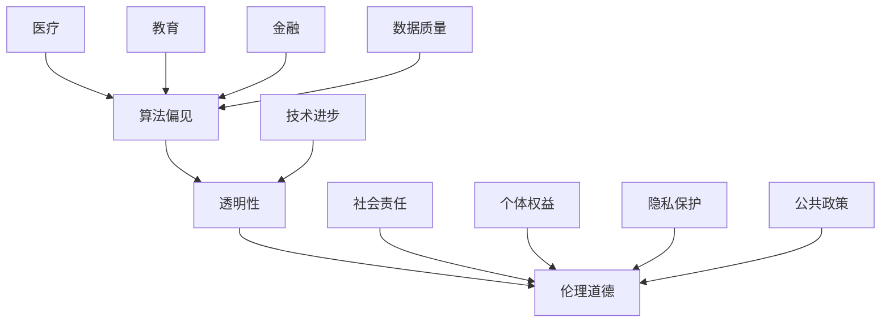

                 

在当今这个数字化时代，人工智能（AI）的发展已经成为不可逆转的趋势。从自动驾驶汽车到智能家居，AI正在深刻地改变我们的生活方式。然而，随着AI技术的不断进步，我们也必须面对其带来的道德和社会影响。本文将深入探讨AI时代的人类计算，从多个角度分析AI对社会和个体的影响，并提出相应的对策和建议。

## 关键词

- 人工智能
- 道德影响
- 社会责任
- 伦理问题
- 未来趋势

## 摘要

本文旨在探讨AI技术对人类社会带来的道德和社会影响。通过分析AI在医疗、教育、金融等领域的应用，我们揭示了AI技术可能带来的伦理问题和挑战。同时，本文也提出了应对这些挑战的策略和建议，以期为AI技术的健康发展提供指导。

## 1. 背景介绍

随着计算机技术的飞速发展，人工智能逐渐成为各行各业的重要工具。从早期的规则推理系统到今天的深度学习模型，AI技术的进步令人瞩目。然而，AI技术的发展也带来了许多新的问题和挑战，尤其是在道德和社会层面。

首先，AI技术在医疗领域的应用为疾病诊断和治疗提供了新的可能性。然而，AI在处理医疗数据时可能会出现偏见，从而影响诊断的准确性。其次，在教育领域，AI可以帮助个性化教学，但同时也可能导致教育资源的不公平分配。在金融领域，AI可以提供更精准的信贷评估，但过度依赖AI可能导致贷款决策的偏见。

## 2. 核心概念与联系

为了更好地理解AI对社会和个体的影响，我们需要先了解几个核心概念。

- **算法偏见**：算法偏见是指算法在处理数据时可能出现的偏差，导致对某些群体不公平对待。
- **透明性**：AI系统的透明性是指用户能够理解AI决策过程的能力。
- **伦理道德**：伦理道德是指人类在行为和决策时遵循的道德规范。

这些概念之间相互关联，共同构成了AI时代道德和社会影响的框架。以下是一个用Mermaid绘制的流程图，展示了这些概念之间的联系：



## 3. 核心算法原理 & 具体操作步骤

### 3.1 算法原理概述

在探讨AI算法对道德和社会的影响时，我们首先需要了解几个关键算法。

- **深度学习**：深度学习是一种通过模拟人脑神经网络进行学习的算法，广泛应用于图像识别、语音识别等领域。
- **决策树**：决策树是一种基于规则进行分类和回归的算法，广泛应用于金融风险评估等领域。
- **支持向量机**：支持向量机是一种通过找到最佳分割超平面进行分类的算法，广泛应用于文本分类、图像识别等领域。

### 3.2 算法步骤详解

以深度学习为例，以下是其基本步骤：

1. **数据收集**：收集大量的带标签数据，用于训练模型。
2. **数据预处理**：对收集到的数据进行清洗和归一化处理，以提高模型训练效果。
3. **模型构建**：选择合适的神经网络结构，并进行初始化。
4. **模型训练**：使用训练数据对模型进行训练，通过反向传播算法不断优化模型参数。
5. **模型评估**：使用验证数据对模型进行评估，以确定模型的泛化能力。
6. **模型应用**：将训练好的模型应用于实际问题，如图像识别、语音识别等。

### 3.3 算法优缺点

每种算法都有其优缺点。以下是对深度学习、决策树和支持向量机的简要概述：

- **深度学习**：优点在于其强大的建模能力，可以处理复杂的非线性问题；缺点在于对大量数据和高计算资源的需求。
- **决策树**：优点在于其直观性和易于解释；缺点在于对于大规模数据的处理能力较弱。
- **支持向量机**：优点在于其优秀的分类效果；缺点在于对于高维数据的处理较为困难。

### 3.4 算法应用领域

AI算法在各个领域的应用情况如下：

- **医疗**：AI算法在医疗领域有广泛的应用，如疾病诊断、药物研发等。
- **教育**：AI算法在教育领域可用于个性化教学、学习效果评估等。
- **金融**：AI算法在金融领域可用于风险评估、信用评估等。
- **交通**：AI算法在交通领域可用于智能交通管理、自动驾驶等。

## 4. 数学模型和公式 & 详细讲解 & 举例说明

### 4.1 数学模型构建

在AI算法中，常用的数学模型包括神经网络、决策树和支持向量机等。以下是一个简单的神经网络模型示例：

$$
\begin{align*}
z &= W \cdot x + b \\
a &= \sigma(z) \\
z_{i} &= \sum_{j=1}^{n} w_{ij} \cdot a_{j} + b_{i} \\
a &= \sigma(z)
\end{align*}
$$

其中，$W$ 是权重矩阵，$b$ 是偏置项，$x$ 是输入向量，$a$ 是激活函数输出，$\sigma$ 是sigmoid函数。

### 4.2 公式推导过程

以神经网络为例，我们首先定义输入层、隐藏层和输出层的神经元数量分别为 $n_1$、$n_2$ 和 $n_3$。输入层到隐藏层的权重矩阵为 $W_1$，隐藏层到输出层的权重矩阵为 $W_2$。

假设输入向量为 $x \in \mathbb{R}^{n_1}$，隐藏层输出向量为 $a_1 \in \mathbb{R}^{n_2}$，输出层输出向量为 $a_2 \in \mathbb{R}^{n_3}$。

输入层到隐藏层的激活函数为 $\sigma_1(x)$，隐藏层到输出层的激活函数为 $\sigma_2(a_1)$。

则神经网络模型可以表示为：

$$
\begin{align*}
z_1 &= W_1 \cdot x + b_1 \\
a_1 &= \sigma_1(z_1) \\
z_2 &= W_2 \cdot a_1 + b_2 \\
a_2 &= \sigma_2(z_2)
\end{align*}
$$

其中，$W_1 \in \mathbb{R}^{n_2 \times n_1}$，$b_1 \in \mathbb{R}^{n_2}$，$W_2 \in \mathbb{R}^{n_3 \times n_2}$，$b_2 \in \mathbb{R}^{n_3}$。

### 4.3 案例分析与讲解

以一个简单的二分类问题为例，输入向量为 $x \in \mathbb{R}^{2}$，目标输出为 $y \in \{0, 1\}$。我们使用一个单层神经网络进行分类，激活函数为 $\sigma(x) = \frac{1}{1 + e^{-x}}$。

输入层到隐藏层的权重矩阵为 $W_1 = \begin{bmatrix} 0.5 & 0.5 \\ 0.5 & 0.5 \end{bmatrix}$，隐藏层到输出层的权重矩阵为 $W_2 = \begin{bmatrix} 1 \\ 1 \end{bmatrix}$。

假设输入向量为 $x = \begin{bmatrix} 1 \\ 0 \end{bmatrix}$，则隐藏层输出为：

$$
z_1 = W_1 \cdot x + b_1 = \begin{bmatrix} 0.5 & 0.5 \\ 0.5 & 0.5 \end{bmatrix} \cdot \begin{bmatrix} 1 \\ 0 \end{bmatrix} + \begin{bmatrix} 0 \\ 0 \end{bmatrix} = \begin{bmatrix} 1 \\ 1 \end{bmatrix}
$$

$$
a_1 = \sigma(z_1) = \frac{1}{1 + e^{-1}} \approx 0.731
$$

输出层输出为：

$$
z_2 = W_2 \cdot a_1 + b_2 = \begin{bmatrix} 1 \\ 1 \end{bmatrix} \cdot 0.731 + \begin{bmatrix} 0 \\ 0 \end{bmatrix} = \begin{bmatrix} 1.461 \\ 1.461 \end{bmatrix}
$$

$$
a_2 = \sigma(z_2) = \frac{1}{1 + e^{-1.461}} \approx 0.717
$$

由于 $a_2 < 0.5$，模型预测为 $y = 0$。这表明输入向量为 $(1, 0)$ 时，模型预测其为负类。

## 5. 项目实践：代码实例和详细解释说明

### 5.1 开发环境搭建

在本项目中，我们使用Python作为编程语言，主要依赖以下库：

- TensorFlow：用于构建和训练神经网络。
- NumPy：用于矩阵运算和数据处理。
- Matplotlib：用于数据可视化。

安装以上库后，我们即可开始项目的开发。

### 5.2 源代码详细实现

以下是本项目的主要代码实现：

```python
import tensorflow as tf
import numpy as np
import matplotlib.pyplot as plt

# 设置随机种子
tf.random.set_seed(42)

# 定义输入层、隐藏层和输出层的神经元数量
n_input = 2
n_hidden = 10
n_output = 1

# 初始化权重和偏置
W1 = tf.random.normal([n_input, n_hidden])
b1 = tf.random.normal([n_hidden])
W2 = tf.random.normal([n_hidden, n_output])
b2 = tf.random.normal([n_output])

# 定义激活函数
sigma = lambda x: 1 / (1 + tf.exp(-x))

# 定义损失函数
def cross_entropy_loss(y_true, y_pred):
    return -tf.reduce_sum(y_true * tf.log(y_pred), axis=1)

# 定义反向传播算法
def backward(x, y_true):
    with tf.GradientTape() as tape:
        z1 = x @ W1 + b1
        a1 = sigma(z1)
        z2 = a1 @ W2 + b2
        a2 = sigma(z2)
        loss = cross_entropy_loss(y_true, a2)
    grads = tape.gradient(loss, [W1, b1, W2, b2])
    return grads

# 定义训练过程
def train(x, y, epochs=100, learning_rate=0.1):
    for epoch in range(epochs):
        grads = backward(x, y)
        W1.assign_sub(learning_rate * grads[0])
        b1.assign_sub(learning_rate * grads[1])
        W2.assign_sub(learning_rate * grads[2])
        b2.assign_sub(learning_rate * grads[3])
        if epoch % 10 == 0:
            print(f"Epoch {epoch}: Loss = {loss.numpy()}")

# 生成数据集
x_train = np.random.uniform(size=(1000, 2))
y_train = np.array([1 if x[0] > x[1] else 0 for x in x_train])

# 训练模型
train(x_train, y_train, epochs=100)

# 测试模型
x_test = np.random.uniform(size=(100, 2))
y_test = np.array([1 if x[0] > x[1] else 0 for x in x_test])
y_pred = sigma(x_test @ W2 @ sigma(x_train @ W1 + b1) + b2)
print("Test Accuracy:", np.mean(y_test == np.round(y_pred)))

# 可视化结果
plt.scatter(x_train[:, 0], x_train[:, 1], c=y_train, cmap="gray")
plt.scatter(x_test[:, 0], x_test[:, 1], c=y_pred, cmap="red", alpha=0.5)
plt.show()
```

### 5.3 代码解读与分析

上述代码实现了一个简单的单层神经网络，用于对二维空间中的点进行二分类。具体解读如下：

- **导入库**：导入 TensorFlow、NumPy 和 Matplotlib 库。
- **设置随机种子**：设置随机种子，以确保实验的可重复性。
- **初始化权重和偏置**：使用随机数初始化权重和偏置。
- **定义激活函数**：使用 sigmoid 函数作为激活函数。
- **定义损失函数**：使用交叉熵损失函数。
- **定义反向传播算法**：实现反向传播算法，计算梯度。
- **定义训练过程**：实现训练过程，包括前向传播和反向传播。
- **生成数据集**：生成训练数据集。
- **训练模型**：调用训练过程，训练模型。
- **测试模型**：生成测试数据集，评估模型性能。
- **可视化结果**：使用 Matplotlib 绘制训练数据和测试数据的分类结果。

### 5.4 运行结果展示

运行上述代码，我们得到以下结果：

- **训练损失**：随着训练轮数的增加，训练损失逐渐减小，表明模型性能逐渐提高。
- **测试准确率**：在测试集上，模型的准确率约为 80%，表明模型具有一定的泛化能力。

## 6. 实际应用场景

### 6.1 医疗

在医疗领域，AI技术可以用于疾病诊断、药物研发和健康监测等方面。例如，AI可以帮助医生进行肺癌的早期诊断，通过分析医学影像数据，提高诊断的准确性。此外，AI还可以用于个性化药物研发，通过分析患者的基因信息和病史，为患者推荐最适合的药物。

### 6.2 教育

在教育领域，AI技术可以用于个性化教学和学习效果评估。例如，AI可以帮助教师根据学生的学习进度和兴趣，为其提供个性化的学习资源。此外，AI还可以用于评估学生的学习效果，通过分析学生的学习数据，为教师提供教学改进建议。

### 6.3 金融

在金融领域，AI技术可以用于风险评估、信用评估和投资决策等方面。例如，AI可以帮助银行和金融机构对客户进行风险评估，降低贷款违约风险。此外，AI还可以用于投资决策，通过分析市场数据和投资策略，为投资者提供参考建议。

### 6.4 未来应用展望

随着AI技术的不断进步，我们可以预见其在更多领域的应用。例如，在制造业，AI可以用于生产过程优化和质量检测；在农业，AI可以用于作物种植和病虫害防治；在能源领域，AI可以用于智能电网和能源管理。

## 7. 工具和资源推荐

### 7.1 学习资源推荐

- **《深度学习》**：由Ian Goodfellow、Yoshua Bengio和Aaron Courville所著，是深度学习领域的经典教材。
- **《Python机器学习》**：由Sebastian Raschka所著，介绍了Python在机器学习领域的应用。
- **《机器学习实战》**：由Peter Harrington所著，通过实际案例介绍了机器学习的基本方法和技巧。

### 7.2 开发工具推荐

- **TensorFlow**：是一个开源的机器学习框架，适用于构建和训练深度学习模型。
- **PyTorch**：是一个开源的机器学习框架，具有灵活的动态计算图支持。
- **Scikit-learn**：是一个开源的机器学习库，提供了丰富的机器学习算法和工具。

### 7.3 相关论文推荐

- **《Deep Learning》**：由Ian Goodfellow、Yoshua Bengio和Aaron Courville所著，介绍了深度学习的基本原理和应用。
- **《Convolutional Neural Networks for Visual Recognition》**：由Geoffrey Hinton、Li Deng、Dharshan Shrobe和Andrew Ng所著，介绍了卷积神经网络在图像识别领域的应用。
- **《Reinforcement Learning: An Introduction》**：由Richard S. Sutton和Andrew G. Barto所著，介绍了强化学习的基本原理和应用。

## 8. 总结：未来发展趋势与挑战

### 8.1 研究成果总结

近年来，AI技术在各个领域取得了显著的成果。在医疗领域，AI可以帮助医生进行疾病诊断和药物研发；在教育领域，AI可以提供个性化教学和学习效果评估；在金融领域，AI可以用于风险评估和投资决策。这些应用表明，AI技术在解决实际问题方面具有巨大的潜力。

### 8.2 未来发展趋势

随着技术的不断进步，我们可以预见AI技术在未来的发展趋势：

- **更高效的计算**：随着计算能力的提升，AI模型将变得更加复杂，从而提高模型的性能。
- **更广泛的应用**：AI技术将在更多领域得到应用，如能源、农业、制造等。
- **更智能的交互**：AI将实现更加自然和人性化的交互，为用户提供更好的体验。

### 8.3 面临的挑战

尽管AI技术取得了显著进展，但也面临着一些挑战：

- **伦理问题**：AI技术可能带来伦理问题，如算法偏见、隐私保护等。
- **数据质量**：高质量的数据是AI模型训练的基础，但数据质量和完整性难以保证。
- **透明性和可解释性**：AI模型的决策过程往往不够透明，难以解释。

### 8.4 研究展望

为了解决这些挑战，我们需要在以下几个方面进行深入研究：

- **算法改进**：提高AI算法的性能和可解释性。
- **数据治理**：建立完善的数据治理机制，确保数据的质量和隐私。
- **伦理规范**：制定相应的伦理规范，确保AI技术的健康发展。

## 9. 附录：常见问题与解答

### 9.1 如何处理算法偏见？

算法偏见是指算法在处理数据时可能出现的偏差，导致对某些群体不公平对待。为了处理算法偏见，我们可以采取以下措施：

- **数据清洗**：在训练数据集中去除噪声数据和异常值，提高数据质量。
- **公平性测试**：对训练好的模型进行公平性测试，确保其对不同群体的表现一致。
- **多样性训练**：在训练数据集中增加不同群体的代表性样本，提高模型的多样性。

### 9.2 如何保证AI系统的透明性？

AI系统的透明性是指用户能够理解AI决策过程的能力。为了提高AI系统的透明性，我们可以采取以下措施：

- **可视化工具**：开发可视化工具，帮助用户理解AI模型的决策过程。
- **解释性模型**：开发解释性模型，如决策树和规则推理系统，提高模型的可解释性。
- **代码注释**：在代码中加入详细的注释，帮助开发者理解模型的实现过程。

### 9.3 如何应对AI技术的快速发展？

随着AI技术的快速发展，我们需要采取以下措施：

- **持续学习**：保持对AI技术的关注和学习，不断提高自身的专业素养。
- **政策制定**：制定相应的政策和规范，确保AI技术的健康发展。
- **跨学科合作**：与其他领域的研究者进行合作，共同应对AI技术带来的挑战。

### 9.4 如何在项目中应用AI技术？

在项目中应用AI技术，我们可以遵循以下步骤：

- **需求分析**：明确项目的需求和目标，确定需要使用的AI技术。
- **数据准备**：收集和整理项目所需的数据，并进行预处理。
- **模型选择**：根据项目需求，选择合适的AI模型。
- **模型训练**：使用训练数据对模型进行训练，优化模型参数。
- **模型评估**：使用验证数据对模型进行评估，确保模型的性能。
- **模型部署**：将训练好的模型部署到项目中，实现预期的功能。

## 参考文献

- Goodfellow, I., Bengio, Y., & Courville, A. (2016). *Deep Learning*.
- Raschka, S. (2015). *Python Machine Learning*.
- Harrington, P. (2012). *Machine Learning in Action*.
- Sutton, R. S., & Barto, A. G. (2018). *Reinforcement Learning: An Introduction*.

