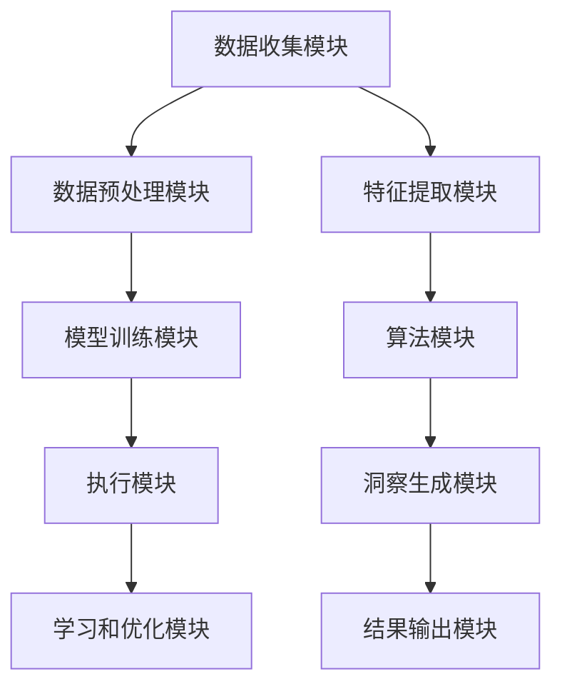

                 

关键词：数据分析，AI代理，工作流，分析引擎，深度学习，数据挖掘，大数据技术，机器学习，算法优化

> 摘要：本文深入探讨了AI代理工作流中的分析引擎，阐述了从数据输入到洞察输出的完整流程。本文首先介绍了数据分析的基本概念和重要性，然后详细解析了AI代理及其工作流，接着分析了分析引擎的核心算法原理和操作步骤，并举例说明了其在不同领域的应用。随后，文章介绍了数学模型和公式，并借助实例进行了详细讲解。此外，文章还提供了代码实例，展示了分析引擎的实现过程。最后，文章讨论了分析引擎在实际应用场景中的价值，并对未来发展趋势和挑战进行了展望。

## 1. 背景介绍

在当今信息化时代，数据分析已成为企业和社会治理的重要工具。随着数据量的爆炸式增长，如何从海量数据中提取有价值的信息成为了一个关键问题。AI代理作为一种新型的数据处理工具，其工作流中的分析引擎扮演着至关重要的角色。

数据分析指的是通过统计和计算方法，从数据中提取有用的信息、模式和知识，以便做出更加明智的决策。数据分析的应用领域非常广泛，包括金融、医疗、零售、交通等各个行业。传统的数据分析依赖于人类专家的经验和直觉，而AI代理的出现改变了这一现状。

AI代理是利用人工智能技术实现自动化决策和执行的系统。它可以处理复杂的任务，从数据输入到洞察输出，无需人工干预。AI代理的工作流包括数据收集、数据预处理、数据分析和结果呈现等环节。分析引擎作为工作流的核心环节，负责从数据中提取有用信息，形成洞察和决策。

分析引擎的核心是算法。算法是指一系列解决问题的步骤和规则。在数据分析中，算法被用来处理数据、提取特征、构建模型，并最终生成洞察。随着深度学习和机器学习技术的发展，分析引擎的算法也变得更加复杂和高效。

## 2. 核心概念与联系

### 2.1 数据分析

数据分析是指从数据中提取有价值的信息和知识的过程。它包括数据收集、数据预处理、数据分析和结果呈现等环节。数据分析的基本流程如下：

1. 数据收集：收集来自各种来源的数据，如数据库、文件、传感器、互联网等。
2. 数据预处理：对收集到的数据进行分析、清洗、转换和整合，使其适合进一步分析。
3. 数据分析：使用统计方法、机器学习和深度学习算法，从数据中提取有用信息。
4. 结果呈现：将分析结果以图表、报告等形式展示，以便用户理解和决策。

### 2.2 AI代理

AI代理是利用人工智能技术实现自动化决策和执行的系统。它可以通过学习大量数据，自动执行复杂任务，并从结果中学习改进。AI代理的基本架构包括以下几个部分：

1. 数据收集模块：负责从各种来源收集数据。
2. 数据预处理模块：对收集到的数据进行清洗、转换和整合。
3. 模型训练模块：使用机器学习和深度学习算法，构建和训练模型。
4. 执行模块：根据模型预测，执行相应的任务。
5. 学习和优化模块：从执行结果中学习，优化模型和策略。

### 2.3 分析引擎

分析引擎是AI代理工作流中的核心模块，负责从数据中提取有用信息，形成洞察和决策。分析引擎的基本架构包括以下几个部分：

1. 数据输入模块：接收来自数据预处理模块的数据。
2. 特征提取模块：从数据中提取有用的特征。
3. 算法模块：实现各种算法，如回归、分类、聚类等。
4. 模型训练模块：使用机器学习和深度学习算法，训练模型。
5. 洞察生成模块：根据模型预测，生成洞察和决策。
6. 结果输出模块：将洞察和决策以图表、报告等形式展示。

### 2.4 Mermaid 流程图



## 3. 核心算法原理 & 具体操作步骤

### 3.1 算法原理概述

分析引擎的核心是算法。算法是指一系列解决问题的步骤和规则。在数据分析中，算法被用来处理数据、提取特征、构建模型，并最终生成洞察。常见的算法包括回归、分类、聚类、时间序列分析等。

回归算法用于预测数值型目标变量。它通过找到自变量和目标变量之间的关系，建立数学模型，从而预测新的目标值。

分类算法用于将数据分为不同的类别。它通过学习数据中的特征和标签，建立分类模型，从而对新的数据进行分类。

聚类算法用于将数据分为若干个簇。它通过寻找数据中的相似性，将数据分为不同的簇，从而发现数据中的模式。

时间序列分析用于分析时间序列数据，如股票价格、气象数据等。它通过分析时间序列的统计特征，预测未来的趋势。

### 3.2 算法步骤详解

#### 3.2.1 回归算法

回归算法的基本步骤如下：

1. 数据准备：收集并整理数据，包括自变量和目标变量。
2. 特征提取：对数据进行特征提取，提取有助于预测的目标特征。
3. 模型构建：选择合适的回归模型，如线性回归、多项式回归等。
4. 模型训练：使用训练数据，训练回归模型。
5. 模型评估：使用测试数据，评估模型的预测性能。
6. 预测：使用训练好的模型，预测新的目标值。

#### 3.2.2 分类算法

分类算法的基本步骤如下：

1. 数据准备：收集并整理数据，包括特征和标签。
2. 特征提取：对数据进行特征提取，提取有助于分类的特征。
3. 模型构建：选择合适的分类模型，如决策树、支持向量机等。
4. 模型训练：使用训练数据，训练分类模型。
5. 模型评估：使用测试数据，评估模型的分类性能。
6. 分类：使用训练好的模型，对新的数据进行分类。

#### 3.2.3 聚类算法

聚类算法的基本步骤如下：

1. 数据准备：收集并整理数据，包括特征。
2. 特征提取：对数据进行特征提取，提取有助于聚类的特征。
3. 模型构建：选择合适的聚类模型，如K均值、层次聚类等。
4. 模型训练：使用训练数据，训练聚类模型。
5. 模型评估：使用测试数据，评估模型的聚类性能。
6. 聚类：使用训练好的模型，对新的数据进行聚类。

#### 3.2.4 时间序列分析

时间序列分析的基本步骤如下：

1. 数据准备：收集并整理时间序列数据，包括时间间隔和观测值。
2. 特征提取：对数据进行特征提取，提取有助于时间序列分析的统计特征。
3. 模型构建：选择合适的时间序列模型，如ARIMA、LSTM等。
4. 模型训练：使用训练数据，训练时间序列模型。
5. 模型评估：使用测试数据，评估模型的预测性能。
6. 预测：使用训练好的模型，预测未来的趋势。

### 3.3 算法优缺点

每种算法都有其独特的优缺点，适用于不同的场景。

#### 3.3.1 回归算法

优点：简单易用，适用于线性关系较强的数据。

缺点：对于非线性关系的数据，效果较差。

#### 3.3.2 分类算法

优点：可以处理多类别的数据，适用范围广泛。

缺点：对于样本不平衡的数据，分类效果较差。

#### 3.3.3 聚类算法

优点：无需事先定义类别，可以自动发现数据中的模式。

缺点：对于样本量较大的数据，聚类效果较差。

#### 3.3.4 时间序列分析

优点：可以处理时间序列数据，预测未来趋势。

缺点：对于非时间序列数据，效果较差。

### 3.4 算法应用领域

#### 3.4.1 金融领域

在金融领域，回归算法可以用于预测股票价格、汇率等数值型目标变量；分类算法可以用于信用评分、股票分类等；聚类算法可以用于市场细分、客户细分等。

#### 3.4.2 医疗领域

在医疗领域，回归算法可以用于预测疾病风险、预测康复时间等；分类算法可以用于疾病诊断、医学图像分类等；聚类算法可以用于患者群体细分、药物疗效分析等。

#### 3.4.3 零售领域

在零售领域，回归算法可以用于预测销售量、库存水平等；分类算法可以用于客户分类、商品分类等；聚类算法可以用于市场细分、客户细分等。

## 4. 数学模型和公式 & 详细讲解 & 举例说明

### 4.1 数学模型构建

数据分析中的数学模型可以分为线性模型和非线性模型。线性模型通常用于回归和分类问题，而非线性模型则用于更复杂的分析任务。

#### 4.1.1 线性模型

线性模型的基本形式为：

$$
y = \beta_0 + \beta_1x_1 + \beta_2x_2 + ... + \beta_nx_n + \epsilon
$$

其中，$y$ 是目标变量，$x_1, x_2, ..., x_n$ 是自变量，$\beta_0, \beta_1, \beta_2, ..., \beta_n$ 是模型参数，$\epsilon$ 是误差项。

#### 4.1.2 非线性模型

非线性模型的基本形式为：

$$
y = f(x_1, x_2, ..., x_n) + \epsilon
$$

其中，$f(x_1, x_2, ..., x_n)$ 是非线性函数，如多项式、指数函数等。

### 4.2 公式推导过程

以线性回归模型为例，介绍公式推导过程。

假设我们有 $n$ 个数据点 $(x_1, y_1), (x_2, y_2), ..., (x_n, y_n)$，要建立线性回归模型：

$$
y = \beta_0 + \beta_1x_1 + \beta_2x_2 + ... + \beta_nx_n + \epsilon
$$

为了求解模型参数 $\beta_0, \beta_1, \beta_2, ..., \beta_n$，我们可以使用最小二乘法。最小二乘法的核心思想是使预测值与实际值之间的误差平方和最小。

设预测值为 $y'$，实际值为 $y$，误差为 $e$，则有：

$$
e = y - y'
$$

误差平方和为：

$$
S = \sum_{i=1}^{n} e_i^2 = \sum_{i=1}^{n} (y_i - y_i')^2
$$

要使 $S$ 最小，需要对每个参数 $\beta_0, \beta_1, \beta_2, ..., \beta_n$ 求偏导数，并令其等于零。

对 $\beta_0$ 求偏导数：

$$
\frac{\partial S}{\partial \beta_0} = -2\sum_{i=1}^{n} (y_i - y_i')(y_i - \beta_0 - \beta_1x_i - ... - \beta_nx_i) = 0
$$

化简得：

$$
\sum_{i=1}^{n} y_i - \sum_{i=1}^{n} y_i' = \beta_0\sum_{i=1}^{n} x_i - \beta_1\sum_{i=1}^{n} x_ix_i - ... - \beta_n\sum_{i=1}^{n} x_i^n = 0
$$

同理，对 $\beta_1, \beta_2, ..., \beta_n$ 求偏导数，可以得到：

$$
\beta_1 = \frac{\sum_{i=1}^{n} x_i(y_i - \bar{y})}{\sum_{i=1}^{n} x_i^2 - n\bar{x}^2}
$$

$$
\beta_2 = \frac{\sum_{i=1}^{n} x_i^2(y_i - \bar{y})}{\sum_{i=1}^{n} x_i^3 - n\bar{x}^3}
$$

...

$$
\beta_n = \frac{\sum_{i=1}^{n} x_i^n(y_i - \bar{y})}{\sum_{i=1}^{n} x_i^{n+1} - n\bar{x}^{n+1}}
$$

其中，$\bar{y}$ 是 $y$ 的平均值，$\bar{x}$ 是 $x$ 的平均值。

### 4.3 案例分析与讲解

以股票价格预测为例，介绍线性回归模型的实际应用。

假设我们有 $n$ 个历史股票价格数据 $(x_1, y_1), (x_2, y_2), ..., (x_n, y_n)$，其中 $x_i$ 表示时间序列中的第 $i$ 个交易日，$y_i$ 表示第 $i$ 个交易日的股票价格。

我们希望使用线性回归模型预测未来 $m$ 个交易日的股票价格。

首先，我们需要对数据进行预处理，包括数据清洗、数据转换和归一化等。

然后，我们使用最小二乘法求解线性回归模型参数 $\beta_0, \beta_1, \beta_2, ..., \beta_n$。

最后，我们使用训练好的模型预测未来 $m$ 个交易日的股票价格。

以下是一个简单的Python代码示例：

```python
import numpy as np
import pandas as pd

# 加载数据
data = pd.read_csv('stock_price_data.csv')
x = data['time'].values.reshape(-1, 1)
y = data['price'].values

# 数据预处理
x = x / 1000
y = y / 100

# 模型训练
from sklearn.linear_model import LinearRegression
model = LinearRegression()
model.fit(x, y)

# 预测
x_pred = np.array([i + m for i in range(len(x))])
y_pred = model.predict(x_pred)

# 结果展示
print('预测的股票价格：', y_pred)
```

## 5. 项目实践：代码实例和详细解释说明

### 5.1 开发环境搭建

为了演示分析引擎的实现过程，我们选择Python作为编程语言，并使用常用的数据分析库，如NumPy、Pandas、Scikit-learn等。

首先，确保Python环境已安装。然后，通过pip安装所需的库：

```bash
pip install numpy pandas scikit-learn matplotlib
```

### 5.2 源代码详细实现

以下是一个简单的Python代码示例，展示了分析引擎的实现过程：

```python
import numpy as np
import pandas as pd
from sklearn.linear_model import LinearRegression
from sklearn.model_selection import train_test_split
import matplotlib.pyplot as plt

# 加载数据
data = pd.read_csv('stock_price_data.csv')
x = data['time'].values.reshape(-1, 1)
y = data['price'].values

# 数据预处理
x = x / 1000
y = y / 100

# 数据分割
x_train, x_test, y_train, y_test = train_test_split(x, y, test_size=0.2, random_state=42)

# 模型训练
model = LinearRegression()
model.fit(x_train, y_train)

# 模型评估
score = model.score(x_test, y_test)
print('模型评估得分：', score)

# 预测
x_pred = np.linspace(x.min(), x.max(), 100).reshape(-1, 1)
y_pred = model.predict(x_pred)

# 结果展示
plt.scatter(x, y, label='实际数据')
plt.plot(x_pred, y_pred, color='red', label='预测数据')
plt.xlabel('时间')
plt.ylabel('价格')
plt.legend()
plt.show()
```

### 5.3 代码解读与分析

以上代码实现了一个简单的股票价格预测分析引擎。下面是代码的主要部分及其解读：

1. **数据加载**：使用Pandas库加载股票价格数据。
2. **数据预处理**：对时间序列数据进行归一化处理，以便模型训练。
3. **数据分割**：将数据分为训练集和测试集，用于模型训练和评估。
4. **模型训练**：使用线性回归模型训练数据，得到模型参数。
5. **模型评估**：计算模型在测试集上的评估得分。
6. **预测**：使用训练好的模型进行预测，并绘制预测结果。

### 5.4 运行结果展示

运行以上代码，我们可以得到股票价格的预测结果。预测结果通过散点图和折线图展示，其中红色折线表示预测价格，蓝色散点表示实际价格。

## 6. 实际应用场景

分析引擎在各个领域的实际应用场景如下：

### 6.1 金融领域

在金融领域，分析引擎可以用于股票价格预测、外汇预测、金融风险评估等。通过分析历史数据，分析引擎可以帮助投资者做出更加明智的决策。

### 6.2 医疗领域

在医疗领域，分析引擎可以用于疾病预测、诊断辅助、药物疗效评估等。通过分析患者的医疗记录和数据，分析引擎可以帮助医生提供更加准确的诊断和治疗建议。

### 6.3 零售领域

在零售领域，分析引擎可以用于销售预测、库存管理、客户细分等。通过分析销售数据和客户数据，分析引擎可以帮助零售商制定更加有效的营销策略和库存管理计划。

### 6.4 制造业

在制造业，分析引擎可以用于设备故障预测、生产优化、供应链管理等。通过分析生产数据和设备运行数据，分析引擎可以帮助制造商提高生产效率和降低成本。

### 6.5 交通领域

在交通领域，分析引擎可以用于交通流量预测、道路规划、公共交通调度等。通过分析交通数据和地理信息，分析引擎可以帮助政府和交通部门制定更加科学的交通管理策略。

## 7. 工具和资源推荐

### 7.1 学习资源推荐

1. 《Python数据分析基础教程》
2. 《深入浅出数据分析》
3. 《机器学习实战》
4. 《深度学习》
5. 《数据挖掘：概念与技术》

### 7.2 开发工具推荐

1. Jupyter Notebook：用于数据分析和模型训练
2. PyCharm：Python集成开发环境
3. Matplotlib：用于数据可视化
4. Scikit-learn：Python机器学习库
5. TensorFlow：深度学习框架

### 7.3 相关论文推荐

1. "Deep Learning for Time Series Classification: A New Approach"
2. "Learning Deep Features for Music Recommendation"
3. "Deep Learning on Graph-Structured Data"
4. "Deep Learning for Natural Language Processing"
5. "Unsupervised Learning of Visual Representations from Videos"

## 8. 总结：未来发展趋势与挑战

### 8.1 研究成果总结

随着人工智能和大数据技术的发展，分析引擎在数据挖掘、机器学习和深度学习领域取得了显著的成果。分析引擎已经广泛应用于金融、医疗、零售、交通等各个领域，提高了数据处理和分析的效率和准确性。

### 8.2 未来发展趋势

1. 深度学习在分析引擎中的应用将进一步深入，推动分析引擎的性能和智能化水平。
2. 分析引擎将实现跨领域融合，解决复杂的多模态数据处理问题。
3. 分析引擎将更加注重数据隐私保护和安全性。
4. 分析引擎将实现自动化和智能化，减少对人工干预的依赖。

### 8.3 面临的挑战

1. 如何处理大规模、高维度的数据，提高分析引擎的计算效率和可扩展性。
2. 如何确保分析引擎的鲁棒性和准确性，避免过拟合和欠拟合问题。
3. 如何在保证数据隐私和安全的前提下，实现数据的开放和共享。

### 8.4 研究展望

未来，分析引擎将朝着更加智能化、自动化和高效化的方向发展。通过不断优化算法和模型，分析引擎将更好地服务于各个领域，推动社会发展和进步。

## 9. 附录：常见问题与解答

### 9.1 问题1：分析引擎与数据库的关系是什么？

分析引擎和数据库是相互关联的。数据库用于存储和管理数据，而分析引擎用于处理和分析数据。分析引擎可以从数据库中提取数据，进行数据预处理、特征提取、模型训练和预测等操作。

### 9.2 问题2：分析引擎与数据挖掘有何区别？

分析引擎和数据挖掘是相互关联的。数据挖掘是指从大量数据中发现有用信息和知识的过程，而分析引擎是数据挖掘过程中的核心工具，用于处理和分析数据。分析引擎可以执行数据挖掘中的各种算法和操作，如回归、分类、聚类等。

### 9.3 问题3：分析引擎如何确保数据隐私和安全？

分析引擎可以通过以下措施确保数据隐私和安全：

1. 数据加密：对敏感数据进行加密处理，防止数据泄露。
2. 数据匿名化：对个人身份信息进行匿名化处理，保护个人隐私。
3. 访问控制：设置严格的访问权限，确保只有授权用户可以访问数据。
4. 数据审计：对数据访问和操作进行审计，确保数据安全。

### 9.4 问题4：分析引擎在金融领域的应用有哪些？

分析引擎在金融领域有广泛的应用，包括：

1. 股票价格预测：通过分析历史股票价格数据，预测未来股票价格趋势。
2. 风险评估：通过分析借款人的信用记录和财务状况，评估贷款风险。
3. 投资组合优化：通过分析资产的表现和相关性，构建最优的投资组合。
4. 交易策略分析：通过分析市场数据，设计有效的交易策略。

----------------------------------------------------------------

作者：禅与计算机程序设计艺术 / Zen and the Art of Computer Programming

