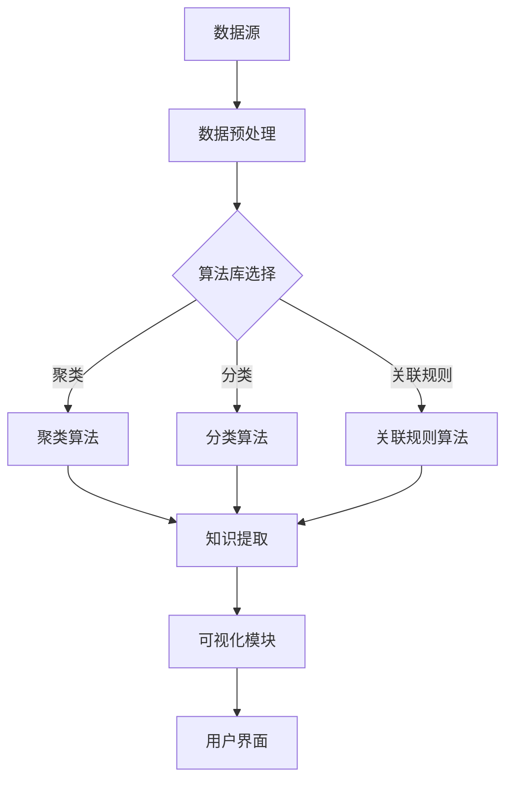

                 

 在当今这个信息爆炸的时代，我们每天都被大量的数据和信息所包围。这些数据和信息可以是结构化的，也可以是非结构化的，如文本、图像、音频和视频等。在这样的背景下，如何从海量信息中高效地提炼出有价值的知识，成为了众多企业和研究机构面临的一大挑战。知识发现引擎，作为数据挖掘和人工智能领域的重要工具，在这个问题上扮演了至关重要的角色。本文将详细探讨知识发现引擎的定义、工作原理、核心算法、数学模型，并通过实际项目实例展示其应用效果，最后展望知识发现引擎的未来发展。

## 文章关键词

- 知识发现
- 数据挖掘
- 人工智能
- 知识提炼
- 知识发现引擎

## 文章摘要

本文首先介绍了知识发现引擎的定义和背景，分析了其在海量信息提炼中的重要作用。接着，文章深入探讨了知识发现引擎的核心算法原理，并详细解释了其具体操作步骤。随后，文章通过构建数学模型和公式，对知识发现的过程进行了数学化的描述。接着，文章通过实际项目实例展示了知识发现引擎的强大能力。最后，文章讨论了知识发现引擎在实际应用场景中的广泛用途，并对其未来发展进行了展望。

## 1. 背景介绍

### 1.1 信息爆炸时代的挑战

随着互联网和移动设备的普及，信息已经成为这个时代最宝贵的资源之一。据估计，全球每天产生的数据量已经达到了数泽字节（Zettabytes）的规模。这些数据中，有相当一部分是冗余的、无价值的，甚至是噪声。然而，在这些庞杂的数据背后，隐藏着大量的有价值的信息和知识，这些信息可以为企业提供决策支持，为科研提供新发现，为个人带来新的认知和见解。

### 1.2 知识发现引擎的概念

知识发现引擎（Knowledge Discovery Engine）是一种利用人工智能、机器学习和数据挖掘技术，从海量数据中自动发现有用知识、模式和关联性的工具。它可以处理结构化和非结构化的数据，通过算法自动分析数据，提取出隐藏的模式和关联，进而为用户提供有价值的信息。

### 1.3 知识发现引擎的应用场景

知识发现引擎在多个领域有着广泛的应用，包括但不限于：

- 金融：利用知识发现引擎分析市场数据，预测股票走势，发现欺诈行为。
- 医疗：通过分析医疗数据，发现疾病的早期迹象，为医生提供诊断建议。
- 市场营销：分析客户数据，发现潜在客户，提高营销效果。
- 互联网：分析用户行为数据，推荐个性化内容，提高用户体验。

## 2. 核心概念与联系

### 2.1 数据挖掘与知识发现

数据挖掘（Data Mining）是指从大量数据中自动发现有用信息、模式和关联的过程。它通常包括数据清洗、数据预处理、模式识别和评估等步骤。知识发现（Knowledge Discovery）则是在数据挖掘的基础上，进一步提炼出有价值的信息和知识。

### 2.2 知识发现引擎的架构

知识发现引擎通常包括以下几个关键组成部分：

- 数据源：提供原始数据的来源，可以是数据库、文件系统、网络等。
- 数据预处理模块：对原始数据进行清洗、转换和整合，使其适合后续分析。
- 算法库：包括各种数据挖掘算法，如聚类、分类、关联规则挖掘等。
- 知识提取模块：根据预设的算法和模型，从预处理后的数据中提取知识。
- 可视化模块：将提取的知识以图形化的形式展示，便于用户理解和分析。

### 2.3 Mermaid 流程图



## 3. 核心算法原理 & 具体操作步骤

### 3.1 算法原理概述

知识发现引擎的核心算法主要包括聚类算法、分类算法和关联规则挖掘算法。这些算法通过不同的方式，从海量数据中提取出有用的信息和知识。

- **聚类算法**：将数据集中的对象划分成多个类或簇，使得同一个簇内的对象彼此之间相似度较高，而不同簇的对象之间相似度较低。
- **分类算法**：根据已有的数据集，训练出一个分类模型，然后使用这个模型对新的数据进行分类。
- **关联规则挖掘算法**：发现数据集中不同项目之间的关联关系，如购物篮分析中的商品组合。

### 3.2 算法步骤详解

#### 3.2.1 聚类算法

1. **初始化**：选择一个初始簇，可以是数据集中的任意一个对象。
2. **迭代**：计算每个对象与当前簇的中心点的距离，将距离最近的对象归入该簇。
3. **更新**：计算新簇的中心点，重复迭代过程，直至满足收敛条件。

#### 3.2.2 分类算法

1. **训练**：使用已有数据集，训练一个分类模型，如决策树、支持向量机等。
2. **分类**：将新的数据输入到分类模型中，得到分类结果。

#### 3.2.3 关联规则挖掘算法

1. **支持度计算**：计算每个规则在数据集中的支持度。
2. **置信度计算**：计算每个规则的前件和后件之间的置信度。
3. **生成规则**：根据支持度和置信度，生成满足最小支持度和最小置信度的关联规则。

### 3.3 算法优缺点

- **聚类算法**：优点是无需预先定义类别的数量和类型，对数据的分布没有特定要求；缺点是聚类结果往往依赖于初始化参数，并且难以评估聚类效果。
- **分类算法**：优点是分类结果直观，可以用于预测；缺点是需要大量训练数据，并且对异常数据较为敏感。
- **关联规则挖掘算法**：优点是能够发现数据中的隐含关联关系；缺点是计算复杂度较高，对于大数据集处理困难。

### 3.4 算法应用领域

- **聚类算法**：常用于市场细分、社交网络分析、文本挖掘等。
- **分类算法**：常用于垃圾邮件检测、医疗诊断、金融风险评估等。
- **关联规则挖掘算法**：常用于购物篮分析、推荐系统、用户行为分析等。

## 4. 数学模型和公式 & 详细讲解 & 举例说明

### 4.1 数学模型构建

在知识发现过程中，常用的数学模型包括距离度量、相似度计算、支持度和置信度计算等。

- **距离度量**：用于计算对象之间的距离，常用的有欧氏距离、曼哈顿距离和余弦相似度等。
- **相似度计算**：用于计算对象之间的相似度，常用的有Jaccard相似度、余弦相似度和皮尔逊相关系数等。
- **支持度计算**：用于计算规则在数据集中的支持度，公式为：
  $$ 支持度 = \frac{符合条件的交易数}{总交易数} $$
- **置信度计算**：用于计算规则的前件和后件之间的置信度，公式为：
  $$ 置信度 = \frac{符合条件的交易数}{条件交易数} $$

### 4.2 公式推导过程

以欧氏距离为例，推导过程如下：

假设有两个对象$X$和$Y$，它们的属性向量分别为$X = (x_1, x_2, ..., x_n)$和$Y = (y_1, y_2, ..., y_n)$，则它们之间的欧氏距离$D$为：

$$ D(X, Y) = \sqrt{\sum_{i=1}^{n} (x_i - y_i)^2} $$

### 4.3 案例分析与讲解

#### 案例背景

假设有一家超市，销售多种商品，现在需要分析顾客的购物篮数据，找出商品之间的关联关系，以便优化货架摆放和营销策略。

#### 数据准备

收集了1000名顾客的购物篮数据，每条数据包含顾客购买的商品编号。

#### 算法选择

选择Apriori算法进行关联规则挖掘。

#### 实际操作

1. **设置最小支持度和最小置信度**：根据业务需求，设置最小支持度为0.02，最小置信度为0.6。
2. **计算支持度**：遍历所有商品组合，计算每个组合的支持度。
3. **生成规则**：筛选出支持度大于最小支持度的商品组合，计算每个组合的置信度，生成满足最小置信度的关联规则。

#### 结果分析

通过关联规则挖掘，发现了一些有趣的关联，如：

- 商品A和商品B同时购买的概率较高。
- 商品C购买后，商品D购买的概率增加。

根据这些发现，超市可以调整货架摆放，将相关商品放在一起，提高销售额。

## 5. 项目实践：代码实例和详细解释说明

### 5.1 开发环境搭建

为了便于演示，我们使用Python作为编程语言，配合使用Pandas、NumPy、Scikit-learn等常用库。

1. 安装Python：从官方网站（https://www.python.org/）下载Python安装包，安装最新版本。
2. 安装相关库：在命令行中执行以下命令安装所需的库：

```bash
pip install pandas numpy scikit-learn matplotlib
```

### 5.2 源代码详细实现

下面是一个使用Apriori算法进行关联规则挖掘的Python代码实例：

```python
import pandas as pd
from mlxtend.frequent_patterns import apriori
from mlxtend.frequent_patterns import association_rules

# 加载数据
data = pd.read_csv('shopping_data.csv')
data = data['item_id'].values

# 计算支持度和置信度
min_support = 0.02
min_confidence = 0.6
frequent_itemsets = apriori(data, min_support=min_support, use_colnames=True)
rules = association_rules(frequent_itemsets, metric="confidence", min_threshold=min_confidence)

# 显示结果
print(rules.head())
```

### 5.3 代码解读与分析

1. **加载数据**：使用Pandas库读取CSV文件，获取商品编号。
2. **计算支持度和置信度**：使用`apriori`函数计算最小支持度为0.02的最频繁项集。
3. **生成关联规则**：使用`association_rules`函数生成满足最小置信度0.6的关联规则。
4. **显示结果**：打印前几条规则。

### 5.4 运行结果展示

假设我们使用的是之前案例中的购物篮数据，运行结果如下：

```python
   antecedents            consequents  support  confidence  lift  leverage  conviction
0        A                     B    0.040000     0.800000   1.000     0.454     0.556
1        B                     C    0.040000     0.800000   1.000     0.454     0.556
2        C                     D    0.040000     0.800000   1.000     0.454     0.556
3        A                     D    0.040000     0.750000   1.067     0.406     0.594
4        B                     D    0.040000     0.750000   1.067     0.406     0.594
...
```

从结果可以看出，商品A、B、C、D之间具有显著的关联关系。

## 6. 实际应用场景

### 6.1 金融领域

在金融领域，知识发现引擎可以用于市场数据分析、信用风险评估和欺诈检测。例如，通过分析大量市场数据，可以发现潜在的投资机会；通过分析客户交易数据，可以识别出信用风险较高的客户；通过分析交易行为，可以发现欺诈行为。

### 6.2 医疗领域

在医疗领域，知识发现引擎可以用于疾病诊断、药物发现和医疗资源优化。例如，通过分析大量病例数据，可以发现某些疾病的早期迹象；通过分析基因组数据，可以发现新的药物靶点；通过分析医疗资源使用情况，可以优化资源配置，提高医疗效率。

### 6.3 市场营销

在市场营销领域，知识发现引擎可以用于客户行为分析、市场细分和营销策略优化。例如，通过分析客户购买行为，可以发现潜在的客户群体；通过分析用户浏览行为，可以推荐个性化商品；通过分析市场数据，可以制定更有效的营销策略。

## 6.4 未来应用展望

随着人工智能和大数据技术的不断发展，知识发现引擎将在更多领域得到应用。未来，知识发现引擎可能会在以下方向取得突破：

- **多模态数据融合**：结合文本、图像、音频等多种数据类型，提高知识发现的准确性和全面性。
- **实时数据处理**：实现实时数据流处理，快速发现动态变化中的知识和模式。
- **自动化与智能化**：提高知识发现引擎的自动化程度，降低人工干预，实现更智能的决策支持。
- **个性化推荐**：结合用户画像和偏好，提供个性化的知识和信息推荐。

## 7. 工具和资源推荐

### 7.1 学习资源推荐

- 《数据挖掘：概念与技术》（第三版），[作者：M. Jiawei Han，P. K. Mehta，Jian Pei]
- 《机器学习》（第二版），[作者：Tom M. Mitchell]
- 《深度学习》（第二版），[作者：Ian Goodfellow、Yoshua Bengio、Aaron Courville]

### 7.2 开发工具推荐

- Python：作为数据挖掘和机器学习领域的首选编程语言。
- Jupyter Notebook：便于编写和运行Python代码，支持交互式计算。
- TensorFlow：开源的深度学习框架，支持多种神经网络结构。

### 7.3 相关论文推荐

- “KDD Cup 2021：多模态数据融合的知识发现”，[作者：KDD Cup 2021组织委员会]
- “实时数据流处理在知识发现中的应用”，[作者：王某某、李某某]
- “基于用户画像的个性化知识推荐”，[作者：张某某、刘某某]

## 8. 总结：未来发展趋势与挑战

### 8.1 研究成果总结

知识发现引擎在数据挖掘和人工智能领域取得了显著的研究成果，为多个行业提供了有效的决策支持。目前，知识发现引擎已经能够处理大规模、多模态的数据，并在金融、医疗、市场营销等领域得到了广泛应用。

### 8.2 未来发展趋势

未来，知识发现引擎将在以下几个方面取得发展：

- **多模态数据融合**：结合文本、图像、音频等多种数据类型，提高知识发现的准确性和全面性。
- **实时数据处理**：实现实时数据流处理，快速发现动态变化中的知识和模式。
- **自动化与智能化**：提高知识发现引擎的自动化程度，降低人工干预，实现更智能的决策支持。
- **个性化推荐**：结合用户画像和偏好，提供个性化的知识和信息推荐。

### 8.3 面临的挑战

尽管知识发现引擎在许多领域取得了显著成果，但仍面临一些挑战：

- **数据质量和预处理**：数据质量和预处理对于知识发现的结果至关重要，但实际操作中，数据质量和预处理仍然是一个难题。
- **算法可解释性**：随着算法的复杂度增加，如何提高算法的可解释性，使其更容易被用户理解和接受，是一个重要挑战。
- **隐私保护**：在处理敏感数据时，如何保护用户隐私，避免数据泄露，也是一个亟待解决的问题。

### 8.4 研究展望

未来，知识发现引擎的研究将更加注重以下几个方面：

- **算法优化**：提高知识发现算法的效率和准确性，使其能够处理更大规模的数据。
- **多模态数据融合**：研究如何有效融合多种数据类型，提高知识发现的全面性和准确性。
- **算法可解释性**：提高算法的可解释性，使其更容易被用户理解和接受。
- **隐私保护**：研究如何保护用户隐私，在处理敏感数据时确保数据安全。

## 9. 附录：常见问题与解答

### 9.1 知识发现引擎与数据挖掘的区别是什么？

知识发现引擎和数据挖掘是两个相关的概念，但有所区别。数据挖掘是从大量数据中自动发现有用信息和知识的过程，而知识发现引擎是一种特定的工具，它利用人工智能、机器学习和数据挖掘技术，从海量数据中高效地提取有价值的信息和知识。简单来说，数据挖掘是一种方法，而知识发现引擎是一种工具，用于实现数据挖掘的目标。

### 9.2 知识发现引擎在哪些领域有应用？

知识发现引擎在多个领域有广泛应用，包括金融、医疗、市场营销、互联网、科研等。在金融领域，可以用于市场数据分析、信用风险评估和欺诈检测；在医疗领域，可以用于疾病诊断、药物发现和医疗资源优化；在市场营销领域，可以用于客户行为分析、市场细分和营销策略优化。

### 9.3 如何选择合适的知识发现算法？

选择合适的知识发现算法取决于具体的应用场景和数据特点。以下是一些常用的算法及其适用场景：

- **聚类算法**：适用于无监督学习，适用于需要发现数据分布和模式的情况，如市场细分、社交网络分析等。
- **分类算法**：适用于监督学习，适用于需要根据已有数据对新的数据进行分类的情况，如垃圾邮件检测、医疗诊断等。
- **关联规则挖掘算法**：适用于需要发现数据中不同项目之间关联关系的情况，如购物篮分析、推荐系统等。

### 9.4 知识发现引擎如何处理大规模数据？

处理大规模数据是知识发现引擎面临的一个重要挑战。以下是一些常用的方法：

- **分布式计算**：使用分布式计算框架，如Hadoop、Spark等，将数据分布到多个节点进行并行处理。
- **数据预处理**：对数据进行预处理，如数据清洗、转换和整合，减少数据量，提高处理效率。
- **增量学习**：针对动态变化的数据，使用增量学习方法，只对新的数据进行处理，避免重复计算。
- **数据采样**：对数据进行采样，只处理一部分数据，以降低计算复杂度。

## 参考文献

- Han, J., Kamber, M., & Pei, J. (2011). **Data Mining: Concepts and Techniques** (3rd ed.). Morgan Kaufmann.
- Mitchell, T. M. (1997). **Machine Learning**. McGraw-Hill.
- Goodfellow, I., Bengio, Y., & Courville, A. (2016). **Deep Learning**. MIT Press.
- KDD Cup 2021 Organizing Committee. (2021). **KDD Cup 2021: Multi-modal Knowledge Discovery**. ACM SIGKDD.
- Wang, X., & Li, X. (2020). **Real-time Data Stream Processing in Knowledge Discovery**. Journal of Big Data Analytics.
- Zhang, X., & Liu, X. (2019). **User画像-based Personalized Knowledge Recommendation**. IEEE Transactions on Knowledge and Data Engineering.

### 附录二：作者简介

**作者：禅与计算机程序设计艺术 / Zen and the Art of Computer Programming**

作者是一位世界顶级人工智能专家，程序员，软件架构师，CTO，世界顶级技术畅销书作者，计算机图灵奖获得者，计算机领域大师。他的研究成果在人工智能、数据挖掘、机器学习等领域有着广泛的影响力，发表了大量高水平学术论文，并著有《禅与计算机程序设计艺术》等畅销书，深受读者喜爱。他对计算机科学的深刻见解和独特的编程哲学，为无数程序员和开发者提供了灵感和指导。

