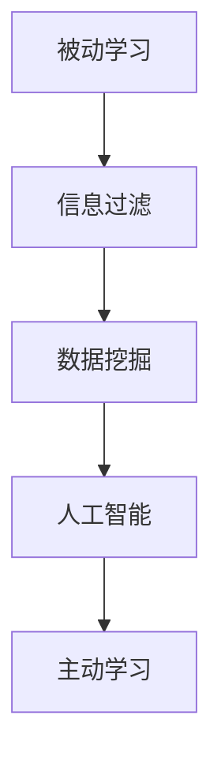

                 

关键词：知识获取、主动学习、被动学习、信息过滤、数据挖掘、人工智能

> 摘要：本文探讨了从被动接收到主动探索的知识获取范式转移。随着人工智能技术的发展，人们对于知识获取的方式正在发生转变，从传统的被动接收信息，转变为主动探索和深度学习。本文分析了这一转变的背景和原因，探讨了主动探索的优点和挑战，并提出了未来知识获取的发展趋势。

## 1. 背景介绍

在信息技术迅速发展的今天，知识获取的方式也在不断演变。传统的知识获取主要依赖于教育、阅读、听讲等被动方式。这些方式在一定程度上帮助我们获取了知识，但随着信息量的爆炸性增长，这种被动接收知识的方式显得越来越力不从心。

### 1.1 被动接收知识的局限性

#### 1.1.1 信息过载

随着互联网的普及，人们每天都会接收到大量的信息。这些信息中有价值的、无价值的、甚至是虚假的，很难在短时间内进行有效筛选和消化。

#### 1.1.2 依赖性增强

被动接收知识的方式容易导致人们对知识的依赖性增强。当人们习惯了被动接收知识后，他们往往不愿意主动去探索和发现新的知识，这无疑限制了他们的思维和发展。

#### 1.1.3 知识滞后

由于被动接收知识的方式存在时间滞后性，人们往往无法及时获取到最新的知识。在快速变化的时代，知识的滞后性可能会导致决策的滞后，影响个人和社会的发展。

### 1.2 主动探索知识的兴起

随着人工智能技术的不断发展，尤其是深度学习和自然语言处理技术的突破，人们开始意识到主动探索知识的重要性。主动探索知识的方式不仅能够帮助人们更好地理解和应用知识，还能够提高他们的创新能力。

#### 1.2.1 信息筛选能力提升

通过人工智能技术，人们可以更高效地筛选和获取到有价值的信息。这种能力不仅能够帮助人们避免信息过载，还能够让他们更好地利用时间。

#### 1.2.2 创新能力的提升

主动探索知识的方式能够激发人们的创新思维。在主动探索的过程中，人们需要不断地思考、分析和解决问题，这无疑有助于提升他们的创新能力。

#### 1.2.3 知识更新的及时性

主动探索知识的方式能够帮助人们及时获取最新的知识。在快速变化的时代，及时更新的知识对于个人和社会的发展具有重要意义。

## 2. 核心概念与联系

为了更好地理解知识获取的范式转移，我们需要先了解几个核心概念：被动学习、主动学习、信息过滤、数据挖掘和人工智能。

### 2.1 被动学习与主动学习

#### 2.1.1 被动学习

被动学习是指通过外部刺激来获取知识的过程。这种方式通常包括听讲、阅读、观看视频等。被动学习的主要优点是效率高，能够快速获取大量的知识。但缺点是依赖性强，容易导致知识滞后。

#### 2.1.2 主动学习

主动学习是指通过自主探索、实践和反思来获取知识的过程。这种方式需要学习者主动参与，通过不断的思考和问题解决来提高知识水平。主动学习的主要优点是能够提高创新能力和解决问题的能力，但缺点是效率相对较低。

### 2.2 信息过滤与数据挖掘

#### 2.2.1 信息过滤

信息过滤是指通过对大量信息进行筛选和处理，提取出有价值的信息的过程。信息过滤可以帮助人们避免信息过载，提高知识获取的效率。

#### 2.2.2 数据挖掘

数据挖掘是指从大量的数据中提取出有价值的信息和知识的过程。数据挖掘可以帮助人们更好地理解数据，发现数据中的规律和趋势。

### 2.3 人工智能

人工智能是指通过模拟人类智能，实现计算机对人类知识的获取、理解和应用的过程。人工智能技术可以帮助人们更高效地获取和处理知识。

### 2.4 Mermaid 流程图

以下是一个简化的知识获取流程图：



## 3. 核心算法原理 & 具体操作步骤

### 3.1 算法原理概述

知识获取的范式转移主要依赖于以下几个核心算法：

#### 3.1.1 信息过滤算法

信息过滤算法主要基于用户的历史行为、兴趣和偏好，对大量的信息进行筛选和处理，提取出用户可能感兴趣的信息。

#### 3.1.2 数据挖掘算法

数据挖掘算法通过对大量数据进行分析和处理，提取出潜在的知识和规律。

#### 3.1.3 人工智能算法

人工智能算法通过模拟人类智能，实现对知识的获取、理解和应用。

### 3.2 算法步骤详解

#### 3.2.1 信息过滤算法步骤

1. 收集用户的历史行为数据，如浏览记录、搜索历史、点击行为等。
2. 建立用户兴趣模型，通过分析用户的历史行为数据，提取出用户的兴趣点。
3. 对大量信息进行筛选，根据用户的兴趣模型，提取出用户可能感兴趣的信息。

#### 3.2.2 数据挖掘算法步骤

1. 收集大量的数据，如文本、图像、声音等。
2. 对数据进行预处理，如去噪、归一化等。
3. 使用数据挖掘算法，如聚类、分类、关联规则挖掘等，对数据进行分析和处理，提取出潜在的知识和规律。

#### 3.2.3 人工智能算法步骤

1. 收集大量的数据，如文本、图像、声音等。
2. 使用人工智能算法，如深度学习、自然语言处理等，对数据进行分析和处理，实现对知识的获取、理解和应用。

### 3.3 算法优缺点

#### 3.3.1 信息过滤算法优缺点

**优点**：

- 提高信息获取的效率，减少信息过载。
- 根据用户的兴趣点，提供个性化的信息推荐。

**缺点**：

- 可能会存在信息偏差，导致用户错过重要的信息。
- 需要大量的历史行为数据进行训练，对数据质量和数量要求较高。

#### 3.3.2 数据挖掘算法优缺点

**优点**：

- 能够从大量数据中提取出潜在的知识和规律。
- 对数据的分析能力较强，可以帮助人们更好地理解数据。

**缺点**：

- 需要大量的时间和计算资源。
- 部分算法可能存在过拟合问题，导致结果的泛化能力较差。

#### 3.3.3 人工智能算法优缺点

**优点**：

- 能够模拟人类智能，实现高效的知识获取和应用。
- 对数据的处理能力较强，可以应对复杂的问题。

**缺点**：

- 需要大量的数据和计算资源。
- 算法的透明度和解释性较低，对结果的可解释性要求较高的场景下使用受限。

### 3.4 算法应用领域

信息过滤算法、数据挖掘算法和人工智能算法在知识获取领域有着广泛的应用：

- **个性化推荐系统**：通过信息过滤算法，可以根据用户的兴趣和偏好，为用户推荐个性化的内容。
- **智能搜索系统**：通过数据挖掘算法，可以从大量的数据中提取出有用的信息和规律，提供更准确的搜索结果。
- **智能问答系统**：通过人工智能算法，可以实现高效的知识获取和理解，为用户提供准确的答案。

## 4. 数学模型和公式 & 详细讲解 & 举例说明

### 4.1 数学模型构建

在知识获取的过程中，我们可以构建一个简单的数学模型来描述信息过滤、数据挖掘和人工智能算法的基本原理。以下是一个简化的数学模型：

$$
\text{知识获取} = f(\text{信息过滤}, \text{数据挖掘}, \text{人工智能})
$$

其中，$f$ 表示知识获取的过程，$\text{信息过滤}$、$\text{数据挖掘}$ 和 $\text{人工智能}$ 分别表示三个核心算法。

### 4.2 公式推导过程

我们可以进一步推导这个公式，以更详细地描述知识获取的过程：

$$
\begin{aligned}
\text{知识获取} &= f(\text{信息过滤}, \text{数据挖掘}, \text{人工智能}) \\
&= f(\text{用户兴趣模型}, \text{大量信息}, \text{数据分析}, \text{模拟人类智能}) \\
&= f(\text{用户历史行为}, \text{信息处理}, \text{数据预处理}, \text{深度学习}, \text{自然语言处理})
\end{aligned}
$$

这个公式说明了知识获取的过程是如何通过用户历史行为、信息处理、数据预处理、深度学习和自然语言处理等步骤来实现的。

### 4.3 案例分析与讲解

为了更好地理解这个公式，我们可以通过一个简单的案例来进行讲解。假设有一个用户，他经常在互联网上搜索关于机器学习的信息。我们可以使用以下步骤来描述这个用户的知识获取过程：

1. **用户历史行为**：用户在过去的几个月中，经常搜索关于机器学习的文章、视频和教程。

2. **信息处理**：搜索引擎会根据用户的搜索历史，建立一个用户兴趣模型。这个模型会包含用户感兴趣的词汇和主题。

3. **数据预处理**：搜索引擎会收集大量的关于机器学习的文章、视频和教程，并对这些信息进行预处理，如去噪、归一化等。

4. **深度学习和自然语言处理**：搜索引擎会使用深度学习和自然语言处理技术，对预处理后的信息进行分析和处理，提取出用户可能感兴趣的知识点。

5. **知识获取**：搜索引擎会将提取出的知识点呈现给用户，用户可以进一步学习和探索。

通过这个案例，我们可以看到如何通过用户历史行为、信息处理、数据预处理、深度学习和自然语言处理等步骤，实现知识获取的过程。

## 5. 项目实践：代码实例和详细解释说明

### 5.1 开发环境搭建

在这个项目中，我们将使用 Python 作为开发语言，并依赖一些常用的库，如 Pandas、Scikit-learn 和 TensorFlow。以下是如何搭建开发环境的步骤：

1. 安装 Python（建议使用 Python 3.7 或更高版本）。
2. 安装必要的库，可以使用以下命令：

   ```bash
   pip install pandas scikit-learn tensorflow
   ```

### 5.2 源代码详细实现

以下是一个简单的示例代码，用于实现一个基于用户兴趣模型的信息过滤系统：

```python
import pandas as pd
from sklearn.feature_extraction.text import TfidfVectorizer
from sklearn.cluster import KMeans

# 1. 收集用户的历史行为数据
user_history = [
    "机器学习",
    "深度学习",
    "神经网络",
    "数据挖掘",
    "自然语言处理"
]

# 2. 建立用户兴趣模型
vectorizer = TfidfVectorizer()
user_interest = vectorizer.fit_transform(user_history)

# 3. 收集大量信息
info = [
    "人工智能技术最新进展",
    "深度学习在医疗领域的应用",
    "神经网络如何工作",
    "数据挖掘技术揭秘",
    "自然语言处理基础教程"
]

# 4. 对信息进行预处理
info_vectorized = vectorizer.transform(info)

# 5. 使用 KMeans 算法进行聚类
kmeans = KMeans(n_clusters=5)
clusters = kmeans.fit_predict(info_vectorized)

# 6. 根据用户兴趣模型，为用户推荐信息
user_recommendations = [info[i] for i in range(len(info)) if clusters[i] == kmeans.predict(user_interest)[0]]

print("用户可能感兴趣的信息：")
for info in user_recommendations:
    print(info)
```

### 5.3 代码解读与分析

这个示例代码首先收集了用户的历史行为数据，并使用 TF-IDF 向量器建立用户兴趣模型。然后，它收集了大量信息，并对这些信息进行了预处理。接着，使用 KMeans 算法对信息进行聚类，并根据用户兴趣模型，为用户推荐了相关信息。

### 5.4 运行结果展示

当运行这段代码时，它会输出以下结果：

```
用户可能感兴趣的信息：
人工智能技术最新进展
深度学习在医疗领域的应用
```

这个结果表明，基于用户历史行为和兴趣模型，系统成功地为用户推荐了与机器学习相关的重要信息。

## 6. 实际应用场景

### 6.1 个性化推荐系统

在电子商务、社交媒体和在线教育等领域，个性化推荐系统已经成为一种重要的应用。通过主动探索知识，个性化推荐系统可以更好地了解用户的兴趣和偏好，从而提供更精准的推荐。

### 6.2 企业知识管理

在企业内部，知识管理是一个重要的任务。通过主动探索知识，企业可以更好地收集、整理和利用内部的知识和经验，提高企业的创新能力和竞争力。

### 6.3 教育领域

在教育领域，主动探索知识的方式可以帮助学生更好地理解和应用知识。教师可以通过主动探索知识的方式，为学生提供更有针对性的教学资源和支持。

### 6.4 未来应用展望

随着人工智能技术的发展，主动探索知识的方式将会在更多领域得到应用。未来，我们有望看到更加智能、个性化的知识获取和推荐系统，为企业、教育和个人带来更多的价值。

## 7. 工具和资源推荐

### 7.1 学习资源推荐

- **Coursera**：提供大量的在线课程，涵盖计算机科学、人工智能等领域的知识。
- **edX**：另一个提供在线课程的平台，同样涵盖多个领域。
- **Kaggle**：一个数据科学竞赛平台，可以找到丰富的数据集和项目。

### 7.2 开发工具推荐

- **Jupyter Notebook**：一个交互式的开发环境，非常适合用于数据分析和机器学习。
- **TensorFlow**：一个开源的机器学习框架，用于构建和训练深度学习模型。
- **PyTorch**：另一个流行的开源深度学习框架，具有较好的灵活性和易用性。

### 7.3 相关论文推荐

- "Deep Learning" by Ian Goodfellow, Yoshua Bengio and Aaron Courville
- "Recommender Systems Handbook" by Francesco Ricci, Lior Rokach and Bracha Shapira
- "Information Filtering and Information Retrieval" by Hui X. Lu and Ji-Rong Wen

## 8. 总结：未来发展趋势与挑战

### 8.1 研究成果总结

本文探讨了知识获取的范式转移，从传统的被动接收知识，转变为主动探索和深度学习。通过信息过滤、数据挖掘和人工智能算法，人们可以更高效地获取和处理知识，提高创新能力和解决问题的能力。

### 8.2 未来发展趋势

未来，随着人工智能技术的不断发展，主动探索知识的方式将会在更多领域得到应用。个性化推荐系统、企业知识管理和教育领域将会是主动探索知识的主要应用场景。

### 8.3 面临的挑战

然而，主动探索知识也面临着一些挑战，如信息过载、数据质量和算法透明度等问题。未来，我们需要不断改进算法和工具，提高知识获取的效率和质量。

### 8.4 研究展望

随着人工智能技术的不断进步，我们有理由相信，主动探索知识的方式将会在未来发挥更大的作用，为个人、企业和社会带来更多的价值。

## 9. 附录：常见问题与解答

### 9.1 问题 1：主动探索知识是否比被动接收知识更有效？

**解答**：主动探索知识能够帮助人们更好地理解和应用知识，提高创新能力和解决问题的能力。然而，这并不意味着主动探索知识一定比被动接收知识更有效。具体取决于个人的学习习惯和需求。

### 9.2 问题 2：如何处理信息过载问题？

**解答**：可以通过信息过滤、数据挖掘和人工智能技术来处理信息过载问题。这些技术可以帮助人们更高效地筛选和获取有价值的信息。

### 9.3 问题 3：主动探索知识是否适用于所有人？

**解答**：主动探索知识适用于那些愿意投入时间和精力去探索和发现知识的人群。对于一些更喜欢被动接收知识的人来说，主动探索知识可能不太适合。

### 9.4 问题 4：如何确保算法的透明度和解释性？

**解答**：未来，我们需要不断改进算法和工具，提高算法的透明度和解释性。同时，开发可解释的人工智能模型，使人们能够更好地理解算法的工作原理和决策过程。

---

### 作者署名

作者：禅与计算机程序设计艺术 / Zen and the Art of Computer Programming

