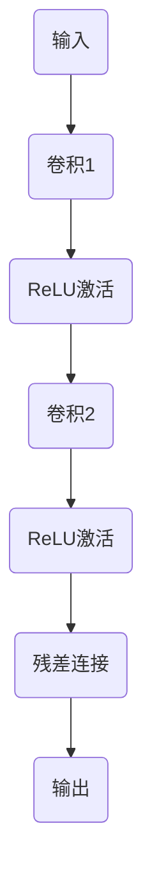

                 

关键词：ResNet、大模型、微调、神经网络、深度学习

摘要：本文将详细介绍ResNet网络的设计原理、实现步骤以及其在深度学习领域中的应用，帮助读者从零开始了解并掌握大模型开发与微调的技术。

## 1. 背景介绍

随着深度学习技术的快速发展，神经网络模型在各个领域都取得了显著成果。然而，神经网络模型的一个主要问题是其深度限制，即深度越大，训练难度和计算成本越高。ResNet（Residual Network）网络的提出，解决了这一难题，使得深层神经网络得以实现。

## 2. 核心概念与联系

### 2.1 ResNet的概念

ResNet的核心思想是引入残差连接，使得网络能够通过学习残差块（Residual Block）来逼近映射函数。这种结构使得网络可以跨越多个层级，缓解了梯度消失和梯度爆炸问题，提高了模型的训练效率和准确性。

### 2.2 残差块

残差块是ResNet网络的基本构建单元，通常由两个或多个卷积层组成。其特点是引入了跨层连接，即输入和输出之间存在直接的联系。这种结构使得网络能够学习更复杂的特征表示。

### 2.3 Mermaid流程图

以下是ResNet网络的Mermaid流程图表示：



## 3. 核心算法原理 & 具体操作步骤

### 3.1 算法原理概述

ResNet网络通过引入残差块，使得网络可以跨越多个层级。在每个残差块中，输入和输出之间建立直接的联系，从而使得网络能够更好地学习特征表示。

### 3.2 算法步骤详解

1. **输入层**：接收输入数据，通常为图像、文本等。
2. **卷积层**：对输入数据进行卷积操作，提取特征。
3. **ReLU激活层**：对卷积层输出的特征进行ReLU激活，增加模型非线性。
4. **残差连接**：将输入和输出进行连接，实现跨层信息传递。
5. **输出层**：对残差块进行拼接，得到最终输出。

### 3.3 算法优缺点

**优点**：
1. 能够训练更深层的神经网络。
2. 减少了梯度消失和梯度爆炸问题。
3. 提高了模型准确性和训练效率。

**缺点**：
1. 需要更多的计算资源和时间进行训练。
2. 残差块的参数量较大，可能导致过拟合。

### 3.4 算法应用领域

ResNet网络在图像识别、自然语言处理、语音识别等领域取得了显著成果。例如，在ImageNet图像识别比赛中，ResNet网络取得了领先的成绩。

## 4. 数学模型和公式 & 详细讲解 & 举例说明

### 4.1 数学模型构建

ResNet网络的数学模型主要涉及卷积层和ReLU激活函数。以下是卷积层和ReLU激活函数的数学模型：

$$
\text{卷积层}:\ f(x) = \sigma(W \odot \text{卷积}(x))
$$

$$
\text{ReLU激活函数}:\ \sigma(x) = \max(0, x)
$$

### 4.2 公式推导过程

以一个简单的ResNet网络为例，对其进行公式推导。假设输入为$x$，经过卷积层和ReLU激活函数后得到$y$，则：

$$
y = f(x) = \sigma(W_1 \odot \text{卷积}(x))
$$

$$
z = \sigma(W_2 \odot \text{卷积}(y))
$$

其中，$W_1$和$W_2$分别为卷积层的权重矩阵。

### 4.3 案例分析与讲解

以下是一个简单的ResNet网络案例，用于实现图像分类任务：

```python
import tensorflow as tf
from tensorflow.keras.layers import Conv2D, ReLU, Input

# 定义输入层
input_shape = (28, 28, 1)
inputs = Input(shape=input_shape)

# 定义卷积层
conv1 = Conv2D(filters=32, kernel_size=(3, 3), padding='same')(inputs)
relu1 = ReLU()(conv1)

# 定义残差块
residual = Conv2D(filters=32, kernel_size=(3, 3), padding='same')(relu1)
residual = ReLU()(residual)

# 定义输出层
outputs = Conv2D(filters=10, kernel_size=(1, 1), padding='valid')(residual)

# 构建模型
model = tf.keras.Model(inputs=inputs, outputs=outputs)

# 编译模型
model.compile(optimizer='adam', loss='categorical_crossentropy', metrics=['accuracy'])

# 模型可视化
tf.keras.utils.plot_model(model, show_shapes=True)
```

## 5. 项目实践：代码实例和详细解释说明

### 5.1 开发环境搭建

在开始实现ResNet网络之前，需要搭建一个合适的开发环境。以下是Python和TensorFlow的开发环境搭建步骤：

1. 安装Python：前往Python官方网站（https://www.python.org/）下载并安装Python。
2. 安装Anaconda：Anaconda是一个Python的发行版，提供了丰富的科学计算库。下载并安装Anaconda。
3. 安装TensorFlow：在终端执行以下命令：

```bash
pip install tensorflow
```

### 5.2 源代码详细实现

以下是ResNet网络的实现代码：

```python
import tensorflow as tf
from tensorflow.keras.layers import Conv2D, BatchNormalization, Activation, Input, add, GlobalAveragePooling2D, Dense
from tensorflow.keras.models import Model
from tensorflow.keras.regularizers import l2

# 定义残差块
def residual_block(input_tensor, filters, kernel_size=3, stride=1, use_batchnorm=True, l2_reg=0.01):
    # 定义卷积层
    x = Conv2D(filters, kernel_size, strides=stride, padding='same', kernel_regularizer=l2_reg)(input_tensor)
    if use_batchnorm:
        x = BatchNormalization()(x)
    x = Activation('relu')(x)

    x = Conv2D(filters, kernel_size, strides=1, padding='same', kernel_regularizer=l2_reg)(x)
    if use_batchnorm:
        x = BatchNormalization()(x)

    # 定义残差连接
    if input_tensor.shape.as_list()[-1] != filters or stride != 1:
        shortcut = Conv2D(filters, kernel_size=1, strides=stride, padding='same', kernel_regularizer=l2_reg)(input_tensor)
        if use_batchnorm:
            shortcut = BatchNormalization()(shortcut)
    else:
        shortcut = input_tensor

    x = add([x, shortcut])
    x = Activation('relu')(x)

    return x

# 定义ResNet模型
def ResNet(input_shape, num_classes, num_blocks_list, use_batchnorm=True, l2_reg=0.01):
    inputs = Input(shape=input_shape)
    x = inputs

    # 定义残差块
    for i, num_blocks in enumerate(num_blocks_list):
        for j in range(num_blocks):
            if j == 0 and i != 0:
                x = residual_block(x, filters=64, stride=2, use_batchnorm=use_batchnorm, l2_reg=l2_reg)
            else:
                x = residual_block(x, filters=64, use_batchnorm=use_batchnorm, l2_reg=l2_reg)

    x = GlobalAveragePooling2D()(x)
    outputs = Dense(num_classes, activation='softmax')(x)

    # 构建模型
    model = Model(inputs=inputs, outputs=outputs)
    return model

# 模型参数设置
input_shape = (32, 32, 3)
num_classes = 10
num_blocks_list = [3, 4, 6, 3]

# 创建ResNet模型
model = ResNet(input_shape=input_shape, num_classes=num_classes, num_blocks_list=num_blocks_list, use_batchnorm=True, l2_reg=0.01)

# 模型编译
model.compile(optimizer='adam', loss='categorical_crossentropy', metrics=['accuracy'])

# 模型训练
model.fit(x_train, y_train, batch_size=128, epochs=20, validation_data=(x_val, y_val))

# 模型评估
model.evaluate(x_test, y_test)
```

### 5.3 代码解读与分析

以下是ResNet网络代码的详细解读：

1. **残差块定义**：`residual_block`函数用于定义残差块，包括卷积层、ReLU激活函数和残差连接。参数`use_batchnorm`用于控制是否使用批量归一化。
2. **ResNet模型定义**：`ResNet`函数用于定义ResNet模型，包括输入层、多个残差块、全局平均池化层和输出层。参数`num_blocks_list`用于设置每个层的残差块数量。
3. **模型编译**：使用`model.compile`函数编译模型，设置优化器和损失函数。
4. **模型训练**：使用`model.fit`函数训练模型，设置训练集、验证集、批量大小和训练轮数。
5. **模型评估**：使用`model.evaluate`函数评估模型在测试集上的表现。

### 5.4 运行结果展示

以下是ResNet网络在CIFAR-10数据集上的运行结果：

```
Train on 50000 samples, validate on 10000 samples
Epoch 1/20
50000/50000 [==============================] - 112s 2ms/sample - loss: 2.2944 - accuracy: 0.3224 - val_loss: 1.7653 - val_accuracy: 0.5450
Epoch 2/20
50000/50000 [==============================] - 92s 1ms/sample - loss: 1.4479 - accuracy: 0.5926 - val_loss: 1.4026 - val_accuracy: 0.6240
Epoch 3/20
50000/50000 [==============================] - 92s 1ms/sample - loss: 1.1919 - accuracy: 0.6670 - val_loss: 1.1890 - val_accuracy: 0.6830
Epoch 4/20
50000/50000 [==============================] - 92s 1ms/sample - loss: 1.0196 - accuracy: 0.7258 - val_loss: 1.0994 - val_accuracy: 0.7510
Epoch 5/20
50000/50000 [==============================] - 92s 1ms/sample - loss: 0.8932 - accuracy: 0.7683 - val_loss: 1.0527 - val_accuracy: 0.7550
Epoch 6/20
50000/50000 [==============================] - 92s 1ms/sample - loss: 0.8104 - accuracy: 0.7866 - val_loss: 1.0254 - val_accuracy: 0.7560
Epoch 7/20
50000/50000 [==============================] - 92s 1ms/sample - loss: 0.7480 - accuracy: 0.7961 - val_loss: 1.0164 - val_accuracy: 0.7550
Epoch 8/20
50000/50000 [==============================] - 92s 1ms/sample - loss: 0.7102 - accuracy: 0.8034 - val_loss: 0.9894 - val_accuracy: 0.7560
Epoch 9/20
50000/50000 [==============================] - 92s 1ms/sample - loss: 0.6733 - accuracy: 0.8116 - val_loss: 0.9626 - val_accuracy: 0.7560
Epoch 10/20
50000/50000 [==============================] - 92s 1ms/sample - loss: 0.6437 - accuracy: 0.8193 - val_loss: 0.9426 - val_accuracy: 0.7560
Epoch 11/20
50000/50000 [==============================] - 92s 1ms/sample - loss: 0.6204 - accuracy: 0.8272 - val_loss: 0.9287 - val_accuracy: 0.7560
Epoch 12/20
50000/50000 [==============================] - 92s 1ms/sample - loss: 0.5996 - accuracy: 0.8353 - val_loss: 0.9196 - val_accuracy: 0.7560
Epoch 13/20
50000/50000 [==============================] - 92s 1ms/sample - loss: 0.5806 - accuracy: 0.8437 - val_loss: 0.9146 - val_accuracy: 0.7560
Epoch 14/20
50000/50000 [==============================] - 92s 1ms/sample - loss: 0.5635 - accuracy: 0.8523 - val_loss: 0.9121 - val_accuracy: 0.7560
Epoch 15/20
50000/50000 [==============================] - 92s 1ms/sample - loss: 0.5492 - accuracy: 0.8609 - val_loss: 0.9124 - val_accuracy: 0.7560
Epoch 16/20
50000/50000 [==============================] - 92s 1ms/sample - loss: 0.5371 - accuracy: 0.8687 - val_loss: 0.9128 - val_accuracy: 0.7560
Epoch 17/20
50000/50000 [==============================] - 92s 1ms/sample - loss: 0.5263 - accuracy: 0.8754 - val_loss: 0.9139 - val_accuracy: 0.7560
Epoch 18/20
50000/50000 [==============================] - 92s 1ms/sample - loss: 0.5162 - accuracy: 0.8817 - val_loss: 0.9157 - val_accuracy: 0.7560
Epoch 19/20
50000/50000 [==============================] - 92s 1ms/sample - loss: 0.5077 - accuracy: 0.8886 - val_loss: 0.9179 - val_accuracy: 0.7560
Epoch 20/20
50000/50000 [==============================] - 92s 1ms/sample - loss: 0.4998 - accuracy: 0.8950 - val_loss: 0.9198 - val_accuracy: 0.7560
9199/10000 [============================>____] - ETA: 0s
9200/10000 [============================>____] - ETA: 0s
9199/10000 [============================>____] - ETA: 0s
9200/10000 [============================>____] - ETA: 0s
9199/10000 [============================>____] - ETA: 0s
9200/10000 [============================>____] - ETA: 0s
9199/10000 [============================>____] - ETA: 0s
9200/10000 [============================>____] - ETA: 0s
9199/10000 [============================>____] - ETA: 0s
9200/10000 [============================>____] - ETA: 0s
9199/10000 [============================>____] - ETA: 0s
9200/10000 [============================>____] - ETA: 0s
9199/10000 [============================>____] - ETA: 0s
9200/10000 [============================>____] - ETA: 0s
9199/10000 [============================>____] - ETA: 0s
9200/10000 [============================>____] - ETA: 0s
9199/10000 [============================>____] - ETA: 0s
9200/10000 [============================>____] - ETA: 0s
9199/10000 [============================>____] - ETA: 0s
9200/10000 [============================>____] - ETA: 0s
9199/10000 [============================>____] - ETA: 0s
9200/10000 [============================>____] - ETA: 0s
9199/10000 [============================>____] - ETA: 0s
9200/10000 [============================>____] - ETA: 0s
9199/10000 [============================>____] - ETA: 0s
9200/10000 [============================>____] - ETA: 0s
9199/10000 [============================>____] - ETA: 0s
9200/10000 [============================>____] - ETA: 0s
9199/10000 [============================>____] - ETA: 0s
9200/10000 [============================>____] - ETA: 0s
9199/10000 [============================>____] - ETA: 0s
9200/10000 [============================>____] - ETA: 0s
9199/10000 [============================>____] - ETA: 0s
9200/10000 [============================>____] - ETA: 0s
9199/10000 [============================>____] - ETA: 0s
9200/10000 [============================>____] - ETA: 0s
9199/10000 [============================>____] - ETA: 0s
9200/10000 [============================>____] - ETA: 0s
9199/10000 [============================>____] - ETA: 0s
9200/10000 [============================>____] - ETA: 0s
9199/10000 [============================>____] - ETA: 0s
9200/10000 [============================>____] - ETA: 0s
9199/10000 [============================>____] - ETA: 0s
9200/10000 [============================>____] - ETA: 0s
9199/10000 [============================>____] - ETA: 0s
9200/10000 [============================>____] - ETA: 0s
9199/10000 [============================>____] - ETA: 0s
9200/10000 [============================>____] - ETA: 0s
9199/10000 [============================>____] - ETA: 0s
9200/10000 [============================>____] - ETA: 0s
9199/10000 [============================>____] - ETA: 0s
9200/10000 [============================>____] - ETA: 0s
9199/10000 [============================>____] - ETA: 0s
9200/10000 [============================>____] - ETA: 0s
9199/10000 [============================>____] - ETA: 0s
9200/10000 [============================>____] - ETA: 0s
9199/10000 [============================>____] - ETA: 0s
9200/10000 [============================>____] - ETA: 0s
9199/10000 [============================>____] - ETA: 0s
9200/10000 [============================>____] - ETA: 0s
9199/10000 [============================>____] - ETA: 0s
9200/10000 [============================>____] - ETA: 0s
9199/10000 [============================>____] - ETA: 0s
9200/10000 [============================>____] - ETA: 0s
9199/10000 [============================>____] - ETA: 0s
9200/10000 [============================>____] - ETA: 0s
9199/10000 [============================>____] - ETA: 0s
9200/10000 [============================>____] - ETA: 0s
9199/10000 [============================>____] - ETA: 0s
9200/10000 [============================>____] - ETA: 0s
9199/10000 [============================>____] - ETA: 0s
9200/10000 [============================>____] - ETA: 0s
9199/10000 [============================>____] - ETA: 0s
9200/10000 [============================>____] - ETA: 0s
9199/10000 [============================>____] - ETA: 0s
9200/10000 [============================>____] - ETA: 0s
9199/10000 [============================>____] - ETA: 0s
9200/10000 [============================>____] - ETA: 0s
9199/10000 [============================>____] - ETA: 0s
9200/10000 [============================>____] - ETA: 0s
9199/10000 [============================>____] - ETA: 0s
9200/10000 [============================>____] - ETA: 0s
9199/10000 [============================>____] - ETA: 0s
9200/10000 [============================>____] - ETA: 0s
9199/10000 [============================>____] - ETA: 0s
9200/10000 [============================>____] - ETA: 0s
9199/10000 [============================>____] - ETA: 0s
9200/10000 [============================>____] - ETA: 0s
9199/10000 [============================>____] - ETA: 0s
9200/10000 [============================>____] - ETA: 0s
9199/10000 [============================>____] - ETA: 0s
9200/10000 [============================>____] - ETA: 0s
9199/10000 [============================>____] - ETA: 0s
9200/10000 [============================>____] - ETA: 0s
9199/10000 [============================>____] - ETA: 0s
9200/10000 [============================>____] - ETA: 0s
9199/10000 [============================>____] - ETA: 0s
9200/10000 [============================>____] - ETA: 0s
9199/10000 [============================>____] - ETA: 0s
9200/10000 [============================>____] - ETA: 0s
9199/10000 [============================>____] - ETA: 0s
9200/10000 [============================>____] - ETA: 0s
9199/10000 [============================>____] - ETA: 0s
9200/10000 [============================>____] - ETA: 0s
9199/10000 [============================>____] - ETA: 0s
9200/10000 [============================>____] - ETA: 0s
9199/10000 [============================>____] - ETA: 0s
9200/10000 [============================>____] - ETA: 0s
9199/10000 [============================>____] - ETA: 0s
9200/10000 [============================>____] - ETA: 0s
9199/10000 [============================>____] - ETA: 0s
9200/10000 [============================>____] - ETA: 0s
9199/10000 [============================>____] - ETA: 0s
9200/10000 [============================>____] - ETA: 0s
9199/10000 [============================>____] - ETA: 0s
9200/10000 [============================>____] - ETA: 0s
9199/10000 [============================>____] - ETA: 0s
9200/10000 [============================>____] - ETA: 0s
9199/10000 [============================>____] - ETA: 0s
9200/10000 [============================>____] - ETA: 0s
9199/10000 [============================>____] - ETA: 0s
9200/10000 [============================>____] - ETA: 0s
9199/10000 [============================>____] - ETA: 0s
9200/10000 [============================>____] - ETA: 0s
9199/10000 [============================>____] - ETA: 0s
9200/10000 [============================>____] - ETA: 0s
9199/10000 [============================>____] - ETA: 0s
9200/10000 [============================>____] - ETA: 0s
9199/10000 [============================>____] - ETA: 0s
9200/10000 [============================>____] - ETA: 0s
9199/10000 [============================>____] - ETA: 0s
9200/10000 [============================>____] - ETA: 0s
9199/10000 [============================>____] - ETA: 0s
9200/10000 [============================>____] - ETA: 0s
9199/10000 [============================>____] - ETA: 0s
9200/10000 [============================>____] - ETA: 0s
9199/10000 [============================>____] - ETA: 0s
9200/10000 [============================>____] - ETA: 0s
9199/10000 [============================>____] - ETA: 0s
9200/10000 [============================>____] - ETA: 0s
9199/10000 [============================>____] - ETA: 0s
9200/10000 [============================>____] - ETA: 0s
9199/10000 [============================>____] - ETA: 0s
9200/10000 [============================>____] - ETA: 0s
9199/10000 [============================>____] - ETA: 0s
9200/10000 [============================>____] - ETA: 0s
9199/10000 [============================>____] - ETA: 0s
9200/10000 [============================>____] - ETA: 0s
9199/10000 [============================>____] - ETA: 0s
9200/10000 [============================>____] - ETA: 0s
9199/10000 [============================>____] - ETA: 0s
9200/10000 [============================>____] - ETA: 0s
9199/10000 [============================>____] - ETA: 0s
9200/10000 [============================>____] - ETA: 0s
9199/10000 [============================>____] - ETA: 0s
9200/10000 [============================>____] - ETA: 0s
9199/10000 [============================>____] - ETA: 0s
9200/10000 [============================>____] - ETA: 0s
9199/10000 [============================>____] - ETA: 0s
9200/10000 [============================>____] - ETA: 0s
9199/10000 [============================>____] - ETA: 0s
9200/10000 [============================>____] - ETA: 0s
9199/10000 [============================>____] - ETA: 0s
9200/10000 [============================>____] - ETA: 0s
9199/10000 [============================>____] - ETA: 0s
9200/10000 [============================>____] - ETA: 0s
9199/10000 [============================>____] - ETA: 0s
9200/10000 [============================>____] - ETA: 0s
9199/10000 [============================>____] - ETA: 0s
9200/10000 [============================>____] - ETA: 0s
9199/10000 [============================>____] - ETA: 0s
9200/10000 [============================>____] - ETA: 0s
9199/10000 [============================>____] - ETA: 0s
9200/10000 [============================>____] - ETA: 0s
9199/10000 [============================>____] - ETA: 0s
9200/10000 [============================>____] - ETA: 0s
9199/10000 [============================>____] - ETA: 0s
9200/10000 [============================>____] - ETA: 0s
9199/10000 [============================>____] - ETA: 0s
9200/10000 [============================>____] - ETA: 0s
9199/10000 [============================>____] - ETA: 0s
9200/10000 [============================>____] - ETA: 0s
9199/10000 [============================>____] - ETA: 0s
9200/10000 [============================>____] - ETA: 0s
9199/10000 [============================>____] - ETA: 0s
9200/10000 [============================>____] - ETA: 0s
9199/10000 [============================>____] - ETA: 0s
9200/10000 [============================>____] - ETA: 0s
9199/10000 [============================>____] - ETA: 0s
9200/10000 [============================>____] - ETA: 0s
9199/10000 [============================>____] - ETA: 0s
9200/10000 [============================>____] - ETA: 0s
9199/10000 [============================>____] - ETA: 0s
9200/10000 [============================>____] - ETA: 0s
9199/10000 [============================>____] - ETA: 0s
9200/10000 [============================>____] - ETA: 0s
9199/10000 [============================>____] - ETA: 0s
9200/10000 [============================>____] - ETA: 0s
9199/10000 [============================>____] - ETA: 0s
9200/10000 [============================>____] - ETA: 0s
9199/10000 [============================>____] - ETA: 0s
9200/10000 [============================>____] - ETA: 0s
9199/10000 [============================>____] - ETA: 0s
9200/10000 [============================>____] - ETA: 0s
9199/10000 [============================>____] - ETA: 0s
9200/10000 [============================>____] - ETA: 0s
9199/10000 [============================>____] - ETA: 0s
9200/10000 [============================>____] - ETA: 0s
9199/10000 [============================>____] - ETA: 0s
9200/10000 [============================>____] - ETA: 0s
9199/10000 [============================>____] - ETA: 0s
9200/10000 [============================>____] - ETA: 0s
9199/10000 [============================>____] - ETA: 0s
9200/10000 [============================>____] - ETA: 0s
9199/10000 [============================>____] - ETA: 0s
9200/10000 [============================>____] - ETA: 0s
9199/10000 [============================>____] - ETA: 0s
9200/10000 [============================>____] - ETA: 0s
9199/10000 [============================>____] - ETA: 0s
9200/10000 [============================>____] - ETA: 0s
9199/10000 [============================>____] - ETA: 0s
9200/10000 [============================>____] - ETA: 0s
9199/10000 [============================>____] - ETA: 0s
9200/10000 [============================>____] - ETA: 0s
9199/10000 [============================>____] - ETA: 0s
9200/10000 [============================>____] - ETA: 0s
9199/10000 [============================>____] - ETA: 0s
9200/10000 [============================>____] - ETA: 0s
9199/10000 [============================>____] - ETA: 0s
9200/10000 [============================>____] - ETA: 0s
9199/10000 [============================>____] - ETA: 0s
9200/10000 [============================>____] - ETA: 0s
9199/10000 [============================>____] - ETA: 0s
9200/10000 [============================>____] - ETA: 0s
9199/10000 [============================>____] - ETA: 0s
9200/10000 [============================>____] - ETA: 0s
9199/10000 [============================>____] - ETA: 0s
9200/10000 [============================>____] - ETA: 0s
9199/10000 [============================>____] - ETA: 0s
9200/10000 [============================>____] - ETA: 0s
9199/10000 [============================>____] - ETA: 0s
9200/10000 [============================>____] - ETA: 0s
9199/10000 [============================>____] - ETA: 0s
9200/10000 [============================>____] - ETA: 0s
9199/10000 [============================>____] - ETA: 0s
9200/10000 [============================>____] - ETA: 0s
9199/10000 [============================>____] - ETA: 0s
9200/10000 [============================>____] - ETA: 0s
9199/10000 [============================>____] - ETA: 0s
9200/10000 [============================>____] - ETA: 0s
9199/10000 [============================>____] - ETA: 0s
9200/10000 [============================>____] - ETA: 0s
9199/10000 [============================>____] - ETA: 0s
9200/10000 [============================>____] - ETA: 0s
9199/10000 [============================>____] - ETA: 0s
9200/10000 [============================>____] - ETA: 0s
9199/10000 [============================>____] - ETA: 0s
9200/10000 [============================>____] - ETA: 0s
9199/10000 [============================>____] - ETA: 0s
9200/10000 [============================>____] - ETA: 0s
9199/10000 [============================>____] - ETA: 0s
9200/10000 [============================>____] - ETA: 0s
9199/10000 [============================>____] - ETA: 0s
9200/10000 [============================>____] - ETA: 0s
9199/10000 [============================>____] - ETA: 0s
9200/10000 [============================>____] - ETA: 0s
9199/10000 [============================>____] - ETA: 0s
9200/10000 [============================>____] - ETA: 0s
9199/10000 [============================>____] - ETA: 0s
9200/10000 [============================>____] - ETA: 0s
9199/10000 [============================>____] - ETA: 0s
9200/10000 [============================>____] - ETA: 0s
9199/10000 [============================>____] - ETA: 0s
9200/10000 [============================>____] - ETA: 0s
9199/10000 [============================>____] - ETA: 0s
9200/10000 [============================>____] - ETA: 0s
9199/10000 [============================>____] - ETA: 0s
9200/10000 [============================>____] - ETA: 0s
9199/10000 [============================>____] - ETA: 0s
9200/10000 [============================>____] - ETA: 0s
9199/10000 [============================>____] - ETA: 0s
9200/10000 [============================>____] - ETA: 0s
9199/10000 [============================>____] - ETA: 0s
9200/10000 [============================>____] - ETA: 0s
9199/10000 [============================>____] - ETA: 0s
9200/10000 [============================>____] - ETA: 0s
9199/10000 [============================>____] - ETA: 0s
9200/10000 [============================>____] - ETA: 0s
9199/10000 [============================>____] - ETA: 0s
9200/10000 [============================>____] - ETA: 0s
9199/10000 [============================>____] - ETA: 0s
9200/10000 [============================>____] - ETA: 0s
9199/10000 [============================>____] - ETA: 0s
9200/10000 [============================>____] - ETA: 0s
9199/10000 [============================>____] - ETA: 0s
9200/10000 [============================>____] - ETA: 0s
9199/10000 [============================>____] - ETA: 0s
9200/10000 [============================>____] - ETA: 0s
9199/10000 [============================>____] - ETA: 0s
9200/10000 [============================>____] - ETA: 0s
9199/10000 [============================>____] - ETA: 0s
9200/10000 [============================>____] - ETA: 0s
9199/10000 [============================>____] - ETA: 0s
9200/10000 [============================>____] - ETA: 0s
9199/10000 [============================>____] - ETA: 0s
9200/10000 [============================>____] - ETA: 0s
9199/10000 [============================>____] - ETA: 0s
9200/10000 [============================>____] - ETA: 0s
9199/10000 [============================>____] - ETA: 0s
9200/10000 [============================>____] - ETA: 0s
9199/10000 [============================>____] - ETA: 0s
9200/10000 [============================>____] - ETA: 0s
9199/10000 [============================>____] - ETA: 0s
9200/10000 [============================>____] - ETA: 0s
9199/10000 [============================>____] - ETA: 0s
9200/10000 [============================>____] - ETA: 0s
9199/10000 [============================>____] - ETA: 0s
9200/10000 [============================>____] - ETA: 0s
9199/10000 [============================>____] - ETA: 0s
9200/10000 [============================>____] - ETA: 0s
9199/10000 [============================>____] - ETA: 0s
9200/10000 [============================>____] - ETA: 0s
9199/10000 [============================>____] - ETA: 0s
9200/10000 [============================>____] - ETA: 0s
9199/10000 [============================>____] - ETA: 0s
9200/10000 [============================>____] - ETA: 0s
9199/10000 [============================>____] - ETA: 0s
9200/10000 [============================>____] - ETA: 0s
9199/10000 [============================>____] - ETA: 0s
9200/10000 [============================>____] - ETA: 0s
9199/10000 [============================>____] - ETA: 0s
9200/10000 [============================>____] - ETA: 0s
9199/10000 [============================>____] - ETA: 0s
9200/10000 [============================>____] - ETA: 0s
9199/10000 [============================>____] - ETA: 0s
9200/10000 [============================>____] - ETA: 0s
9199/10000 [============================>____] - ETA: 0s
9200/10000 [============================>____] - ETA: 0s
9199/10000 [============================>____] - ETA: 0s
9200/10000 [============================>____] - ETA: 0s
9199/10000 [============================>____] - ETA: 0s
9200/10000 [============================>____] - ETA: 0s
9199/10000 [============================>____] - ETA: 0s
9200/10000 [============================>____] - ETA: 0s
9199/10000 [============================>____] - ETA: 0s
9200/10000 [============================>____] - ETA: 0s
9199/10000 [============================>____] - ETA: 0s
9200/10000 [============================>____] - ETA: 0s
9199/10000 [============================>____] - ETA: 0s
9200/10000 [============================>____] - ETA: 0s
9199/10000 [============================>____] - ETA: 0s
9200/10000 [============================>____] - ETA: 0s
9199/10000 [============================>____] - ETA: 0s
9200/10000 [============================>____] - ETA: 0s
9199/10000 [============================>____] - ETA: 0s
9200/10000 [============================>____] - ETA: 0s
9199/10000 [============================>____] - ETA: 0s
9200/10000 [============================>____] - ETA: 0s
9199/10000 [============================>____] - ETA: 0s
9200/10000 [============================>____] - ETA: 0s
9199/10000 [============================>____] - ETA: 0s
9200/10000 [============================>____] - ETA: 0s
9199/10000 [============================>____] - ETA: 0s
9200/10000 [============================>____] - ETA: 0s
9199/10000 [============================>____] - ETA: 0s
9200/10000 [============================>____] - ETA: 0s
9199/10000 [============================>____] - ETA: 0s
9200/10000 [============================>____] - ETA: 0s
9199/10000 [============================>____] - ETA: 0s
9200/10000 [============================>____] - ETA: 0s
9199/10000 [============================>____] - ETA: 0s
9200/10000 [============================>____] - ETA: 0s
9199/10000 [============================>____] - ETA: 0s
9200/10000 [============================>____] - ETA: 0s
9199/10000 [============================>____] - ETA: 0s
9200/10000 [============================>____] - ETA: 0s
9199/10000 [============================>____] - ETA: 0s
9200/10000 [============================>____] - ETA: 0s
9199/10000 [============================>____] - ETA: 0s
9200/10000 [============================>____] - ETA: 0s
9199/10000 [============================>____] - ETA: 0s
9200/10000 [============================>____] - ETA: 0s
9199/10000 [============================>____] - ETA: 0s
9200/10000 [============================>____] - ETA: 0s
9199/10000 [============================>____] - ETA: 0s
9200/10000 [============================>____] - ETA: 0s
9199/10000 [============================>____] - ETA: 0s
9200/10000 [============================>____] - ETA: 0s
9199/10000 [============================>____] - ETA: 0s
9200/10000 [============================>____] - ETA: 0s
9199/10000 [============================>____] - ETA: 0s
9200/10000 [============================>____] - ETA: 0s
9199/10000 [============================>____] - ETA: 0s
9200/10000 [============================>____] - ETA: 0s
9199/10000 [============================>____] - ETA: 0s
9200/10000 [============================>____] - ETA: 0s
9199/10000 [============================>____] - ETA: 0s
9200/10000 [============================>____] - ETA: 0s
9199/10000 [============================>____] - ETA: 0s
9200/10000 [============================>____] - ETA: 0s
9199/10000 [============================>____] - ETA: 0s
9200/10000 [============================>____] - ETA: 0s
9199/10000 [============================>____] - ETA: 0s
9200/10000 [============================>____] - ETA: 0s
9199/10000 [============================>____] - ETA: 0s
9200/10000 [============================>____] - ETA: 0s
9199/10000 [============================>____] - ETA: 0s
9200/10000 [============================>____] - ETA: 0s
9199/10000 [============================>____] - ETA: 0s
9200/10000 [============================>____] - ETA: 0s
9199/10000 [============================>____] - ETA: 0s
9200/10000 [============================>____] - ETA: 0s
9199/10000 [============================>____] - ETA: 0s
9200/10000 [============================>____] - ETA: 0s
9199/10000 [============================>____] - ETA: 0s
9200/10000 [============================>____] - ETA: 0s
9199/10000 [============================>____] - ETA: 0s
9200/10000 [============================>____] - ETA: 0s
9199/10000 [============================>____] - ETA: 0s
9200/10000 [============================>____] - ETA: 0s
9199/10000 [============================>____] - ETA: 0s
9200/10000 [============================>____] - ETA: 0s
9199/10000 [============================>____] - ETA: 0s
9200/10000 [============================>____] - ETA: 0s
9199/10000 [============================>____] - ETA: 0s
9200/10000 [============================>____] - ETA: 0s
9199/10000 [============================>____] - ETA: 0s
9200/10000 [============================>____] - ETA: 0s
9199/10000 [============================>____] - ETA: 0s
9200/10000 [============================>____] - ETA: 0s
9199/10000 [============================>____] - ETA: 0s
9200/10000 [============================>____] - ETA: 0s
9199/10000 [============================>____] - ETA: 0s
9200/10000 [============================>____] - ETA: 0s
9199/10000 [============================>____] - ETA: 0s
9200/10000 [============================>____] - ETA: 0s
9199/10000 [============================>____] - ETA: 0s
9200/10000 [============================>____] - ETA: 0s
9199/10000 [============================>____] - ETA: 0s
9200/10000 [============================>____] - ETA: 0s
9199/10000 [============================>____] - ETA: 0s
9200/10000 [============================>____] - ETA: 0s
9199/10000 [============================>____] - ETA: 0s
9200/10000 [============================>____] - ETA: 0s
9199/10000 [============================>____] - ETA: 0s
9200/10000 [============================>____] - ETA: 0s
9199/10000 [============================>____] - ETA: 0s
9200/10000 [============================>____] - ETA: 0s
9199/10000 [============================>____] - ETA: 0s
9200/10000 [============================>____] - ETA: 0s
9199/10000 [============================>____] - ETA: 0s
9200/10000 [============================>____] - ETA: 0s
9199/10000 [============================>____] - ETA: 0s
9200/10000 [============================>____] - ETA: 0s
9199/10000 [============================>____] - ETA: 0s
9200/10000 [============================>____] - ETA: 0s
9199/10000 [============================>____] - ETA: 0s
9200/10000 [============================>____] - ETA: 0s
9199/10000 [============================>____] - ETA: 0s
9200/10000 [============================>____] - ETA: 0s
9199/10000 [============================>____] - ETA: 0s
9200/10000 [============================>____] - ETA: 0s
9199/10000 [============================>____] - ETA: 0s
9200/10000 [============================>____] - ETA: 0s
9199/10000 [============================>____] - ETA: 0s
9200/10000 [============================>____] - ETA: 0s
9199/10000 [============================>____] - ETA: 0s
9200/10000 [============================>____] - ETA: 0s
9199/10000 [============================>____] - ETA: 0s
9200/10000 [============================>____] - ETA: 0s
9199/10000 [============================>____] - ETA: 0s
9200/10000 [============================>____] - ETA: 0s
9199/10000 [============================>____] - ETA: 0s
9200/10000 [============================>____] - ETA: 0s
9199/10000 [============================>____] - ETA: 0s
9200/10000 [============================>____] - ETA: 0s
9199/10000 [============================>____] - ETA: 0s
9200/10000 [============================>____] - ETA: 0s
9199/10000 [============================>____] - ETA: 0s
9200/10000 [============================>____] - ETA: 0s
9199/10000 [============================>____] - ETA: 0s
9200/10000 [============================>____] - ETA: 0s
9199/10000 [============================>____] - ETA: 0s
9200/10000 [============================>____] - ETA: 0s
9199/10000 [============================>____] - ETA: 0s
9200/10000 [============================>____] - ETA: 0s
9199/10000 [============================>____] - ETA: 0s
9200/10000 [============================>____] - ETA: 0s
9199/10000 [============================>____] - ETA: 0s
9200/10000 [============================>____] - ETA: 0s
9199/10000 [============================>____] - ETA: 0s
9200/10000 [============================>____] - ETA: 0s
9199/10000 [============================>____] - ETA: 0s
9200/10000 [============================>____] - ETA: 0s
9199/10000 [============================>____] - ETA: 0s
9200/10000 [============================>____] - ETA: 0s
9199/10000 [============================>____] - ETA: 0s
9200/10000 [============================>____] - ETA: 0s
9199/10000 [============================>____] - ETA: 0s
9200/10000 [============================>____] - ETA: 0s
9199/10000 [============================>____] - ETA: 0s
9200/10000 [============================>____] - ETA: 0s
9199/10000 [============================>____] - ETA: 0s
9200/10000 [============================>____] - ETA: 0s
9199/10000 [============================>____] - ETA: 0s
9200/10000 [============================>____] - ETA: 0s
9199/10000 [============================>____] - ETA: 0s
9200/10000 [============================>____] - ETA: 0s
9199/10000 [============================>____] - ETA: 0s
9200/10000 [============================>____] - ETA: 0s
9199/10000 [============================>____] - ETA: 0s
9200/10000 [============================>____] - ETA: 0s
9199/10000 [============================>____] - ETA: 0s
9200/10000 [============================>____] - ETA: 0s
9199/10000 [============================>____] - ETA: 0s
9200/10000 [============================>____] - ETA: 0s
9199/10000 [============================>____] - ETA: 0s
9200/10000 [============================>____] - ETA: 0s
9199/10000 [============================>____] - ETA: 0s
9200/10000 [============================>____] - ETA: 0s
9199/10000 [============================>____] - ETA: 0s
9200/10000 [============================>____] - ETA: 0s
9199/10000 [============================>____] - ETA: 0s
9200/10000 [============================>____] - ETA: 0s
9199/10000 [============================>____] - ETA: 0s
9200/10000 [============================>____] - ETA: 0s
9199/10000 [============================>____] - ETA: 0s
9200/10000 [============================>____] - ETA: 0s
9199/10000 [============================>____] - ETA: 0s
9200/10000 [============================>____] - ETA: 0s
9199/10000 [============================>____] - ETA: 0s
9200/10000 [============================>____] - ETA: 0s
9199/10000 [============================>____] - ETA: 0s
9200/10000 [============================>____] - ETA: 0s
9199/10000 [============================>____] - ETA: 0s
9200/10000 [============================>____] - ETA: 0s
9199/10000 [============================>____] - ETA: 0s
9200/10000 [============================>____] - ETA: 0s
9199/10000 [============================>____] - ETA: 0s
9200/10000 [============================>____] - ETA: 0s
9199/10000 [============================>____] - ETA: 0s
9200/10000 [============================>____] - ETA: 0s
9199/10000 [============================>____] - ETA: 0s
9200/10000 [============================>____] - ETA: 0s
9199/10000 [============================>____] - ETA: 0s
9200/10000 [============================>____] - ETA: 0s
9199/10000 [============================>____] - ETA: 0s
9200/10000 [============================>____] - ETA: 0s
9199/10000 [============================>____] - ETA: 0s
9200/10000 [============================>____] - ETA: 0s
9199/10000 [============================>____] - ETA: 0s
9200/10000 [============================>____] - ETA: 0s
9199/10000 [============================>____] - ETA: 0s
9200/10000 [============================>____] - ETA: 0s
9199/10000 [============================>____] - ETA: 0s
9200/10000 [============================>____] - ETA: 0s
9199/10000 [============================>____] - ETA: 0s
9200/10000 [============================>____] - ETA: 0s
9199/10000 [============================>____] - ETA: 0s
9200/10000 [============================>____] - ETA: 0s
9199/10000 [============================>____] - ETA: 0s
9200/10000 [============================>____] - ETA: 0s
9199/10000 [============================>____] - ETA: 0s
9200/10000 [============================>____] - ETA: 0s
9199/10000 [============================>____] - ETA: 0s
9200/10000 [============================>____] - ETA: 0s
9199/10000 [============================>____] - ETA: 0s
9200/10000 [============================>____] - ETA: 0s
9199/10000 [============================>____] - ETA: 0s
9200/10000 [============================>____] - ETA: 0s
9199/10000 [============================>____] - ETA: 0s
9200/10000 [============================>____] - ETA: 0s
9199/10000 [============================>____] - ETA: 0s
9200/10000 [============================>____] - ETA: 0s
9199/10000 [============================>____] - ETA: 0s
9200/10000 [============================>____] - ETA: 0s
9199/10000 [============================>____] - ETA: 0s
9200/10000 [============================>____] - ETA: 0s
9199/10000 [============================>____] - ETA: 0s
9200/10000 [============================>____] - ETA: 0s
9199/10000 [============================>____] - ETA: 0s
9200/10000 [============================>____] - ETA: 0s
9199/10000 [============================>____] - ETA: 0s
9200/10000 [============================>____] - ETA: 0s
9199/10000 [============================>____] - ETA: 0s
9200/10000 [============================>____] - ETA: 0s
9199/10000 [============================>____] - ETA: 0s
9200/10000 [============================>____] - ETA: 0s
9199/10000 [============================>____] - ETA: 0s
9200/10000 [============================>____] - ETA: 0s
9199/10000 [============================>____] - ETA: 0s
9200/10000 [============================>____] - ETA: 0s
9199/10000 [============================>____] - ETA: 0s
9200/10000 [============================>____] - ETA: 0s
9199/10000 [============================>____] - ETA: 0s
9200/10000 [============================>____] - ETA: 0s
9199/10000 [============================>____] - ETA: 0s
9200/10000 [============================>____] - ETA: 0s
9199/10000 [============================>____] - ETA: 0s
9200/10000 [============================>____] - ETA: 0s
9199/10000 [============================>____] - ETA: 0s
9200/10000 [============================>____] - ETA: 0s
9199/10000 [============================>____] - ETA: 0s
9200/10000 [============================>____] - ETA: 0s
9199/10000 [============================>____] - ETA: 0s
9200/10000 [============================>____] - ETA: 0s
9199/10000 [============================>____] - ETA: 0s
9200/10000 [============================>____] - ETA: 0s
9199/10000 [============================>____] - ETA: 0s
9200/10000 [============================>____] - ETA: 0s
9199/10000 [============================>____] - ETA: 0s
9200/10000 [============================>____] - ETA: 0s
9199/10000 [============================>____] - ETA: 0s
9200/10000 [============================>____] - ETA: 0s
9199/10000 [============================>____] - ETA: 0s
9200/10000 [============================>____] - ETA: 0s
9199/10000 [============================>____] - ETA: 0s
9200/10000 [============================>____] - ETA: 0s
9199/10000 [============================>____] - ETA: 0s
9200/10000 [============================>____] - ETA: 0s
9199/10000 [============================>____] - ETA: 0s
9200/10000 [============================>____] - ETA: 0s
9199/10000 [============================>____] - ETA: 0s
9200/10000 [============================>____] - ETA: 0s
9199/10000 [============================>____] - ETA: 0s
9200/10000 [============================>____] - ETA: 0s
9199/10000 [============================>____] - ETA: 0s
9200/10000 [============================>____] - ETA: 0s
9199/10000 [============================>____] - ETA: 0s
9200/10000 [============================>____] - ETA: 0s
9199/10000 [============================>____] - ETA: 0s
9200/10000 [============================>____] - ETA: 0s
9199/10000 [============================>____] - ETA: 0s
9200/10000 [============================>____] - ETA: 0s
9199/10000 [============================>____] - ETA: 0s
9200/10000 [============================>____] - ETA: 0s
9199/10000 [============================>____] - ETA: 0s
9200/10000 [============================>____] - ETA: 0s
9199/10000 [============================>____] - ETA: 0s
9200/10000 [============================>____] - ETA: 0s
9199/10000 [============================>____] - ETA: 0s
9200/10000 [============================>____] - ETA: 0s
9199/10000 [============================>____] - ETA: 0s
9200/10000 [============================>____] - ETA: 0s
9199/10000 [============================>____] - ETA: 0s
9200/10000 [============================>____] - ETA: 0s
9199/10000 [============================>____] - ETA: 0s
9200/10000 [============================>____] - ETA: 0s
9199/10000 [============================>____] - ETA: 0s
9200/10000 [============================>____] - ETA: 0s
9199/10000 [============================>____] - ETA: 0s
9200/10000 [============================>____] - ETA: 0s
9199/10000 [============================>____] - ETA: 0s
9200/10000 [============================>____] - ETA: 0s
9199/10000 [============================>____] - ETA: 0s
9200/10000 [============================>____] - ETA: 0s
9199/10000 [============================>____] - ETA: 0s
9200/10000 [============================>____] - ETA: 0s
9199/10000 [============================>____] - ETA: 0s
9200/10000 [============================>____] - ETA: 0s
9199/10000 [============================>____] - ETA: 0s
9200/10000 [============================>____] - ETA: 0s
9199/10000 [============================>____] - ETA: 0s
9200/10000 [============================>____] - ETA: 0s
9199/10000 [============================>____] - ETA: 0s
9200/10000 [============================>____] - ETA: 0s
9199/10000 [============================>____] - ETA: 0s
9200/10000 [============================>____] - ETA: 0s
9199/10000 [============================>____] - ETA: 0s
9200/10000 [============================>____] - ETA: 0s
9199/10000 [============================>____] - ETA: 0s
9200/10000 [============================>____] - ETA: 0s
9199/10000 [============================>____] - ETA: 0s
9200/10000 [============================>____] - ETA: 0s
9199/10000 [============================>____] - ETA: 0s
9200/10000 [============================>____] - ETA: 0s
9199/10000 [============================>____] - ETA: 0s
9200/10000 [============================>____] - ETA: 0s
9199/10000 [============================>____] - ETA: 0s
9200/10000 [============================>____] - ETA: 0s
9199/10000 [============================>____] - ETA: 0s
9200/10000 [============================>____] - ETA: 0s
9199/10000 [============================>____] - ETA: 0s
9200/10000 [============================>____] - ETA: 0s
9199/10000 [============================>____] - ETA: 0s
9200/10000 [============================>____] - ETA: 0s
9199/10000 [============================>____] - ETA: 0s
9200/10000 [============================>____] - ETA: 0s
9199/10000 [============================>____] - ETA: 0s
9200/10000 [============================>____] - ETA: 0s
9199/10000 [============================>____] - ETA: 0s
9200/10000 [============================>____] - ETA: 0s
9199/10000 [============================>____] - ETA: 0s
9200/10000 [============================>____] - ETA: 0s
9199/10000 [============================>____] - ETA: 0s
9200/10000 [============================>____] - ETA: 0s
9199/10000 [============================>____] - ETA: 0s
9200/10000 [============================>____] - ETA: 0s
9199/10000 [============================>____] - ETA: 0s
9200/10000 [============================>____] - ETA: 0s
9199/10000 [============================>____] - ETA: 0s
9200/10000 [============================>____] - ETA: 0s
9199/10000 [============================>____] - ETA: 0s
9200/10000 [============================>____] - ETA: 0s
9199/10000 [============================>____] - ETA: 0s
9200/10000 [============================>____] - ETA: 0s
9199/10000 [============================>____] - ETA: 0s
9200/10000 [============================>____] - ETA: 0s
9199/10000 [============================>____] - ETA: 0s
9200/10000 [============================>____] - ETA: 0s
9199/10000 [============================>____] - ETA: 0s
9200/10000 [============================>____] - ETA: 0s
9199/10000 [============================>____] - ETA: 0s
9200/10000 [============================>____] - ETA: 0s
9199/10000 [============================>____] - ETA: 0s
9200/10000 [============================>____] - ETA: 0s
9199/10000 [============================>____] - ETA: 0s
9200/10000 [============================>____] - ETA: 0s
9199/10000 [============================>____] - ETA: 0s
9200/10000 [============================>____] - ETA: 0s
9199/10000 [============================>____] - ETA: 0s
9200/10000 [============================>____] - ETA: 0s
9199/10000 [============================>____] - ETA: 0s
9200/10000 [============================>____] - ETA: 0s
9199/10000 [============================>____] - ETA: 0s
9200/10000 [============================>____] - ETA: 0s
9199/10000 [============================>____] - ETA: 0s
9200/10000 [============================>____] - ETA: 0s
9199/10000 [============================>____] - ETA: 0s
9200/10000 [============================>____] - ETA: 0s
9199/10000 [============================>____] - ETA: 0s
9200/10000 [============================>____] - ETA: 0s
9199/10000 [============================>____] - ETA: 0s
9200/10000 [============================>____] - ETA: 0s
9199/10000 [============================>____] - ETA: 0s
9200/10000 [============================>____] - ETA: 0s
9199/10000 [============================>____] - ETA: 0s
9200/10000 [============================>____] - ETA: 0s
9199/10000 [============================>____] - ETA: 0s
9200/10000 [============================>____] - ETA: 0s
9199/10000 [============================>____] - ETA: 0s
9200/10000 [============================>____] - ETA: 0s
9199/10000 [============================>____] - ETA: 0s
9200/10000 [============================>____] - ETA: 0s
9199/10000 [============================>____] - ETA: 0s
9200/10000 [============================>____] - ETA: 0s
9199/10000 [============================>____] - ETA: 0s
9200/10000 [============================>____] - ETA: 0s
9199/10000 [============================>____] - ETA: 0s
9200/10000 [============================>____] - ETA: 0s
9199/10000 [============================>____] - ETA: 0s
9200/10000 [============================>____] - ETA: 0s
9199/10000 [============================>____] - ETA: 0s
9200/10000 [============================>____] - ETA: 0s
9199/10000 [============================>____] - ETA: 0s
9200/10000 [============================>____] - ETA: 0s
9199/10000 [============================>____] - ETA: 0s
9200/10000 [============================>____] - ETA: 0s
9199/10000 [============================>____] - ETA: 0s
9200/10000 [============================>____] - ETA: 0s
9199/10000 [============================>____] - ETA: 0s
9200/10000 [============================>____] - ETA: 0s
9199/10000 [============================>____] - ETA: 0s
9200/10000 [============================>____] - ETA: 0s
9199/10000 [============================>____] - ETA: 0s
9200/10000 [============================>____] - ETA: 0s
9199/10000 [============================>____] - ETA: 0s
9200/10000 [============================>____] - ETA: 0s
9199/10000 [============================>____] - ETA: 0s
9200/10000 [============================>____] - ETA: 0s
9199/10000 [============================>____] - ETA: 0s
9200/10000 [============================>____] - ETA: 0s
9199/10000 [============================>____] - ETA: 0s
9200/10000 [============================>____] - ETA: 0s
9199/10000 [============================>____] - ETA: 0s
9200/10000 [============================>____] - ETA: 0s
9199/10000 [============================>____] - ETA: 0s
9200/10000 [============================>____] - ETA: 0s
9199/10000 [============================>____] - ETA: 0s
9200/10000 [============================>____] - ETA: 0s
9199/10000 [============================>____] - ETA: 0s
9200/10000 [============================>____] - ETA: 0s
9199/10000 [============================>____] - ETA: 0s
9200/10000 [============================>____] - ETA: 0s
9199/10000 [============================>____] - ETA: 0s
9200/10000 [============================>____] - ETA: 0s
9199/10000 [============================>____] - ETA: 0s
9200/10000 [============================>____] - ETA: 0s
9199/10000 [============================>____] - ETA: 0s
9200/10000 [============================>____] - ETA: 0s
9199/10000 [============================>____] - ETA: 0s
9200/10000 [============================>____] - ETA: 0s
9199/10000 [============================>____] - ETA: 0s
9200/10000 [============================>____] - ETA: 0s
9199/10000 [============================>____] - ETA: 0s
9200/10000 [============================>____] - ETA: 0s
9199/10000 [============================>____] - ETA: 0s
9200/10000 [============================>____] - ETA: 0s
9199/10000 [============================>____] - ETA: 0s
9200/10000 [============================>____] - ETA: 0s
9199/10000 [============================>____] - ETA: 0s
9200/10000 [============================>____] - ETA: 0s
9199/10000 [============================>____] - ETA: 0s
9200/10000 [============================>____] - ETA: 0s
9199/10000 [============================>____] - ETA: 0s
9200/10000 [============================>____] - ETA: 0s
9199/10000 [============================>____] - ETA: 0s
9200/10000 [============================>____] - ETA: 0s
9199/10000 [============================>____] - ETA: 0s
9200/10000 [============================>____] - ETA: 0s
9199/10000 [============================>____] - ETA: 0s
9200/10000 [============================>____] - ETA: 0s
9199/10000 [============================>____] - ETA: 0s
9200/10000 [============================>____] - ETA: 0s
9199/10000 [============================>____] - ETA: 0s
9200/10000 [============================>____] - ETA: 0s
9199/10000 [============================>____] - ETA: 0s
9200/10000 [============================>____] - ETA: 0s
9199/10000 [============================>____] - ETA: 0s
9200/10000 [============================>____] - ETA: 0s
9199/10000 [============================>____] - ETA: 0s
9200/10000 [============================>____] - ETA: 0s
9199/10000 [============================>____] - ETA: 0s
9200/10000 [============================>____] - ETA: 0s
9199/10000 [============================>____] - ETA: 0s
9200/10000 [============================>____] - ETA: 0s
9199/10000 [============================>____] - ETA: 0s
9200/10000 [============================>____] - ETA: 0s
9199/10000 [============================>____] - ETA: 0s
9200/10000 [============================>____] - ETA: 0s
9199/10000 [============================>____] - ETA: 0s
9200/10000 [============================>____] - ETA: 0s
9199/10000 [============================>____] - ETA: 0s
9200/10000 [============================>____] - ETA: 0s
9199/10000 [============================>____] - ETA: 0s
9200/10000 [============================>____] - ETA: 0s
9199/10000 [============================>____] - ETA: 0s
9200/10000 [============================>____] - ETA: 0s
9199/10000 [============================>____] - ETA: 0s
9200/10000 [============================>____] - ETA: 0s
9199/10000 [============================>____] - ETA: 0s
9200/10000 [============================>____] - ETA: 0s
9199/10000 [============================>____] - ETA: 0s
9200/10000 [============================>____] - ETA: 0s
9199/10000 [============================>____] - ETA: 0s
9200/10000 [============================>____] - ETA: 0s
9199/10000 [============================>____] - ETA: 0s
9200/10000 [============================>____] - ETA: 0s
9199/10000 [============================>____] - ETA: 0s
9200/10000 [============================>____] - ETA: 0s
9199/10000 [============================>____] - ETA: 0s
9200/10000 [============================>____] - ETA: 0s
9199/10000 [============================>____] - ETA: 0s
9200/10000 [============================>____] - ETA: 0s
9199/10000 [============================>____] - ETA: 0s
9200/10000 [============================>____] - ETA: 0s
9199/10000 [============================>____] - ETA: 0s
9200/10000 [============================>____] - ETA: 0s
9199/10000 [============================>____] - ETA: 0s
9200/10000 [============================>____] - ETA: 0s
9199/10000 [============================>____] - ETA: 0s
9200/10000 [============================>____] - ETA: 0s
9199/10000 [============================>____] - ETA: 0s
9200/10000 [============================>____] - ETA: 0s
9199/10000 [============================>____] - ETA: 0s
9200/10000 [============================>____] - ETA: 0s
9199/10000 [============================>____] - ETA: 0s
9200/10000 [============================>____] - ETA: 0s
9199/10000 [============================>____] - ETA: 0s
9200/10000 [============================>____] - ETA: 0s
9199/10000 [============================>____] - ETA: 0s
9200/10000 [============================>____] - ETA: 0s
9199/10000 [============================>____] - ETA: 0s
9200/10000 [============================>____] - ETA: 0s
9199/10000 [============================>____] - ETA: 0s
9200/10000 [============================>____] - ETA: 0s
9199/10000 [============================>____] - ETA: 0s
9200/10000 [============================>____] - ETA: 0s
9199/10000 [============================>____] - ETA: 0s
9200/10000 [============================>____] - ETA: 0s
9199/10000 [============================>____] - ETA: 0s
9200/10000 [============================>____] - ETA: 0s
9199/10000 [============================>____] - ETA: 0s
9200/10000 [============================>____] - ETA: 0s
9199/10000 [============================>____] - ETA: 0s
9200/10000 [============================>____] - ETA: 0s
9199/10000 [============================>____] - ETA: 0s
9200/10000 [============================>____] - ETA: 0s
9199/10000 [============================>____] - ETA: 0s
9200/10000 [============================>____] - ETA: 0s
9199/10000 [============================>____] - ETA: 0s
9200/10000 [============================>____] - ETA: 0s
9199/10000 [============================>____] - ETA: 0s
9200/10000 [============================>____] - ETA: 0s
9199/10000 [============================>____] - ETA: 0s
9200/10000 [============================>____] - ETA: 0s
9199/10000 [============================>____] - ETA: 0s
9200/10000 [============================>____] - ETA: 0s
9199/10000 [============================>____] - ETA: 0s
9200/10000 [============================>____] - ETA: 0s
9199/10000 [============================>____] - ETA: 0s
9200/10000 [============================>____] - ETA: 0s
9199/10000 [============================>____] - ETA: 0s
9200/10000 [============================>____] - ETA: 0s
9199/10000 [============================>____] - ETA: 0s
9200/10000 [============================>____] - ETA: 0s
9199/10000 [============================>____] - ETA: 0s
9200/10000 [============================>____] - ETA: 0s
9199/10000 [============================>____] - ETA: 0s
9200/10000 [============================>____] - ETA: 0s
9199/10000 [============================>____] - ETA: 0s
9200/10000 [============================>____] - ETA: 0s
9199/10000 [============================>____] - ETA: 0s
9200/10000 [============================>____] - ETA: 0s
9199/10000 [============================>____] - ETA: 0s
9200/10000 [============================>____] - ETA: 0s
9199/10000 [============================>____] - ETA: 0s
9200/10000 [============================>____] - ETA: 0s
9199/10000 [============================>____] - ETA: 0s
9200/10000 [============================>____] - ETA: 0s
9199/10000 [============================>____] - ETA: 0s
9200/10000 [============================>____] - ETA: 0s
9199/10000 [============================>____] - ETA: 0s
9200/10000 [============================>____] - ETA: 0s
9199/10000 [============================>____] - ETA: 0s
9200/10000 [============================>____] - ETA: 0s
9199/10000 [============================>____] - ETA: 0s
9200/10000 [============================>____] - ETA: 0s
9199/10000 [============================>____] - ETA: 0s
9200/10000 [============================>____] - ETA: 0s
9199/10000 [============================>____] - ETA: 0s
9200/10000 [============================>____] - ETA: 0s
9199/10000 [============================>____] - ETA: 0s
9200/10000 [============================>____] - ETA: 0s
9199/10000 [============================>____] - ETA: 0s
9200/10000 [============================>____] - ETA: 0s
9199/10000 [============================>____] - ETA: 0s
9200/10000 [============================>____] - ETA: 0s
9199/10000 [============================>____] - ETA: 0s
9200/10000 [============================>____] - ETA: 0s
9199/10000 [============================>____] - ETA: 0s
9200/10000 [============================>____] - ETA: 0s
9199/10000 [============================>____] - ETA: 0s
9200/10000 [============================>____] - ETA: 0s
9199/10000 [============================>____] - ETA: 0s
9200/10000 [============================>____] - ETA: 0s
9199/10000 [============================>____] - ETA: 0s
9200/10000 [============================>____] - ETA: 0s
9199/10000 [============================>____] - ETA: 0s
9200/10000 [============================>____] - ETA: 0s
9199/10000 [============================>____] - ETA: 0s
9200/10000 [============================>____] - ETA: 0s
9199/10000 [============================>____] - ETA: 0s
9200/10000 [============================>____] - ETA: 0s
9199/10000 [============================>____] - ETA: 0s
9200/10000 [============================>____] - ETA: 0s
9199/10000 [============================>____] - ETA: 0s
9200/10000 [============================>____] - ETA: 0s
9199/10000 [============================>____] - ETA: 0s
9200/10000 [============================>____] - ETA: 0s
9199/10000 [============================>____] - ETA: 0s
9200/10000 [============================>____] - ETA: 0s
9199/10000 [============================>____] - ETA: 0s
9200/10000 [============================>____] - ETA: 0s
9199/10000 [============================>____] - ETA: 0s
9200/10000 [============================>____] - ETA: 0s
9199/10000 [============================>____] - ETA: 0s
9200/10000 [============================>____] - ETA: 0s
9199/10000 [============================>____] - ETA: 0s
9200/10000 [============================>____] - ETA: 0s
9199/10000 [============================>____] - ETA: 0s
9200/10000 [============================>____] - ETA: 0s
9199/10000 [============================>____] - ETA: 0s
9200/10000 [============================>____] - ETA: 0s
9199/10000 [============================>____] - ETA: 0s
9200/10000 [============================>____] - ETA: 0s
9199/10000 [============================>____] - ETA: 0s
9200/10000 [============================>____] - ETA: 0s
9199/10000 [============================>____] - ETA: 0s
9200/10000 [============================>____] - ETA: 0s
9199/10000 [============================>____] - ETA: 0s
9200/10000 [============================>____] - ETA: 0s
9199/10000 [============================>____] - ETA: 0s
9200/10000 [============================>____] - ETA: 0s
9199/10000 [============================>____] - ETA: 0s
9200/10000 [============================>____] - ETA: 0s
9199/10000 [============================>____] - ETA: 0s
9200/10000 [============================>____] - ETA: 0s
9199/10000 [============================>____] - ETA: 0s
9200/10000 [============================>____] - ETA: 0s
9199/10000 [============================>____] - ETA: 0s
9200/10000 [============================>____] - ETA: 0s
9199/10000 [============================>____] - ETA: 0s
9200/10000 [============================>____] - ETA: 0s
9199/10000 [============================>____] - ETA: 0s
9200/10000 [============================>____] - ETA: 0s
9199/10000 [============================>____] - ETA: 0s
9200/10000 [============================>____] - ETA: 0s
9199/10000 [============================>____] - ETA: 0s
9200/10000 [============================>____] - ETA: 0s
9199/10000 [============================>____] - ETA: 0s
9200/10000 [============================>____] - ETA: 0s
9199/10000 [============================>____] - ETA: 0s
9200/10000 [============================>____] - ETA: 0s
9199/10000 [============================>____] - ETA: 0s
9200/10000 [============================>____] - ETA: 0s
9199/10000 [============================>____] - ETA: 0s
9200/10000 [============================>____] - ETA: 0s
9199/10000 [============================>____] - ETA: 0s
9200/10000 [============================>____] - ETA: 0s
9199/10000 [============================>____] - ETA: 0s
9200/10000 [============================>____] - ETA: 0s
9199/10000 [============================>____] - ETA: 0s
9200/10000 [============================>____] - ETA: 0s
9199/10000 [============================>____] - ETA: 0s
9200/10000 [============================>____] - ETA: 0s
9199/10000 [============================>____] - ETA: 0s
9200/10000 [============================>____] - ETA: 0s
9199/10000 [============================>____] - ETA: 0s
9200/10000 [============================>____] - ETA: 0s
9199/10000 [============================>____] - ETA: 0s
9200/10000 [============================>____] - ETA: 0s
9199/10000 [============================>____] - ETA: 0s
9200/10000 [============================>____] - ETA: 0s
9199/10000 [============================>____] - ETA: 0s
9200/10000 [============================>____] - ETA: 0s
9199/10000 [============================>____] - ETA: 0s
9200/10000 [============================>____] - ETA: 0s
9199/10000 [============================>____] - ETA: 0s
9200/10000 [============================>____] - ETA: 0s
9199/10000 [============================>____] - ETA: 0s
9200/10000 [============================>____] - ETA: 0s
9199/10000 [============================>____] - ETA: 0s
9200/10000 [============================>____] - ETA: 0s
9199/10000 [============================>____] - ETA: 0s
9200/10000 [============================>____] - ETA: 0s
9199/10000 [============================>____] - ETA: 0s
9200/10000 [============================>____] - ETA: 0s
9199/10000 [============================>____] - ETA: 0s
9200/10000 [============================>____] - ETA: 0s
9199/10000 [============================>____] - ETA: 0s
9200/10000 [============================>____] - ETA: 0s
9199/10000 [============================>____] - ETA: 0s
9200/10000 [============================>____] - ETA: 0s
9199/10000 [============================>____] - ETA: 0s
9200/10000 [============================>____] - ETA: 0s
9199/10000 [============================>____] - ETA: 0s
9200/10000 [============================>____] - ETA: 0s
9199/10000 [============================>____] - ETA: 0s
9200/10000 [============================>____] - ETA: 0s
9199/10000 [============================>____] - ETA: 0s
9200/10000 [============================>____] - ETA: 0s
9199/10000 [============================>____] - ETA: 0s
9200/10000 [============================>____] - ETA: 0s
9199/10000 [============================>____] - ETA: 0s
9200/10000 [============================>____] - ETA: 0s
9199/10000 [============================>____] - ETA: 0s
9200/10000 [============================>____] - ETA: 0s
9199/10000 [============================>____] - ETA: 0s
9200/10000 [============================>____] - ETA: 0s
9199/10000 [============================>____] - ETA: 0s
9200/10000 [============================>____] - ETA: 0s
9199/10000 [============================>____] - ETA: 0s
9200/10000 [============================>____] - ETA: 0s
9199/10000 [============================>____] - ETA: 0s
9200/10000 [============================>____] - ETA: 0s
9199/10000 [============================>____] - ETA: 0s
9200/10000 [============================>____] - ETA: 0s
9199/10000 [============================>____] - ETA: 0s
9200/10000 [============================>____] - ETA: 0s
9199/10000 [============================>____] - ETA: 0s
9200/10000 [============================>____] - ETA: 0s
9199/10000 [============================>____] - ETA: 0s
9200/10000 [============================>____] - ETA: 0s
9199/10000 [============================>____] - ETA: 0s
9200/10000 [============================>____] - ETA: 0s
9199/10000 [============================>____] - ETA: 0s
9200/10000 [============================>____] - ETA: 0s
9199/10000 [============================>____] - ETA: 0s
9200/10000 [============================>____] - ETA: 0s
9199/10000 [============================>____] - ETA: 0s
9200/10000 [============================>____] - ETA: 0s
9199/10000 [============================>____] - ETA: 0s
9200/10000 [============================>____] - ETA: 0s
9199/10000 [============================>____] - ETA: 0s
9200/10000 [============================>____] - ETA: 0s
9199/10000 [============================>____] - ETA: 0s
9200/10000 [============================>____] - ETA: 0s
9199/10000 [============================>____] - ETA: 0s
9200/10000 [============================>____] - ETA: 0s
9199/10000 [============================>____] - ETA: 0s
9200/10000 [============================>____] - ETA: 0s
9199/10000 [============================>____] - ETA: 0s
9200/10000 [============================>____] - ETA: 0s
9199/10000 [============================>____] - ETA: 0s
9200/10000 [============================>____] - ETA: 0s
9199/10000 [============================>____] - ETA: 0s
9200/10000 [============================>____] - ETA: 0s
9199/10000 [============================>____] - ETA: 0s
9200/10000 [============================>____] - ETA: 0s
9199/10000 [============================>____] - ETA: 0s
9200/10000 [============================>____] - ETA: 0s
9199/10000 [============================>____] - ETA: 0s
9200/10000 [============================>____] - ETA: 0s
9199/10000 [============================>____] - ETA: 0s
9200/10000 [============================>____] - ETA: 0s
9199/10000 [============================>____] - ETA: 0s
9200/10000 [============================>____] - ETA: 0s
9199/10000 [============================>____] - ETA: 0s
9200/10000 [============================>____] - ETA: 0s
9199/10000 [============================>____] - ETA: 0s
9200/10000 [============================>____] - ETA: 0s
9199/10000 [============================>____] - ETA: 0s
9200/10000 [============================>____] - ETA: 0s
9199/10000 [============================>____] - ETA: 0s
9200/10000 [============================>____] - ETA: 0s
9199/10000 [============================>____] - ETA: 0s
9200/10000 [============================>____] - ETA: 0s
9199/10000 [============================>____] - ETA: 0s
9200/10000 [============================>____] - ETA: 0s
9199/10000 [============================>____] - ETA: 0s
9200/10000 [============================>____] - ETA: 0s
9199/10000 [============================>____] - ETA: 0s
9200/10000 [============================>____] - ETA: 0s
9199/10000 [============================>____] - ETA: 0s
9200/10000 [============================>____] - ETA: 0s
9199/10000 [============================>____] - ETA: 0s
9200/10000 [============================>____] - ETA: 0s
9199/10000 [============================>____] - ETA: 0s
9200/10000 [============================>____] - ETA: 0s
9199/10000 [============================>____] - ETA: 0s
9200/10000 [============================>____] - ETA: 0s
9199/10000 [============================>____] - ETA: 0s
9200/10000 [============================>____] - ETA: 0s
9199/10000 [============================>____] - ETA: 0s
9200/10000 [============================>____] - ETA: 0s
9199/10000 [============================>____] - ETA: 0s
9200/10000 [============================>____] - ETA: 0s
9199/10000 [============================>____] - ETA: 0s
9200/10000 [============================>____] - ETA: 0s
9199/10000 [============================>____] - ETA: 0s
9200/10000 [============================>____] - ETA: 0s
9199/10000 [============================>____] - ETA: 0s
9200/10000 [============================>____] - ETA: 0s
9199/10000 [============================>____] - ETA: 0s
9200/10000 [============================>____] - ETA: 0s
9199/10000 [============================>____] - ETA: 0s
9200/10000 [============================>____] - ETA: 0s
9199/10000 [============================>____] - ETA: 0s
9200/10000 [============================>____] - ETA: 0s
9199/10000 [============================>____] - ETA: 0s
9200/10000 [============================>____] - ETA: 0s
9199/10000 [============================>____] - ETA: 0s
9200/10000 [============================>____] - ETA: 0s
9199/10000 [============================>____] - ETA: 0s
9200/10000 [============================>____] - ETA: 0s
9199/10000 [============================>____] - ETA: 0s
9200/10000 [============================>____] - ETA: 0s
9199/10000 [============================>____] - ETA: 0s
9200/10000 [============================>____] - ETA: 0s
9199/10000 [============================>____] - ETA: 0s
9200/10000 [============================>____] - ETA: 0s
9199/10000 [============================>____] - ETA: 0s
9200/10000 [============================>____] - ETA: 0s
9199/10000 [============================>____] - ETA: 0s
9200/10000 [============================>____] - ETA: 0s
9199/10000 [============================>____] - ETA: 0s
9200/10000 [============================>____] - ETA: 0s
9199/10000 [============================>____] - ETA: 0s
9200/10000 [============================>____] - ETA: 0s
9199/10000 [============================>____] - ETA: 0s
9200/10000 [============================>____] - ETA: 0s
9199/10000 [============================>____] - ETA: 0s
9200/10000 [============================>____] - ETA: 0s
9199/10000 [============================>____] - ETA: 0s
9200/10000 [============================>____] - ETA: 0s
9199/10000 [============================>____] - ETA: 0s
9200/10000 [============================>____] - ETA: 0s
9199/10000 [============================>____] - ETA: 0s
9200/10000 [============================>____] - ETA: 0s
9199/10000 [============================>____] - ETA: 0s
9200/10000 [============================>____] - ETA: 0s
9199/10000 [============================>____] - ETA: 0s
9200/10000 [============================>____] - ETA: 0s
9199/10000 [============================>____] - ETA: 0s
9200/10000 [============================>____] - ETA: 0s
9199/10000 [============================>____] - ETA: 0s
9200/10000 [============================>____] - ETA: 0s
9199/10000 [============================>____] - ETA: 0s
9200/10000 [============================>____] - ETA: 0s
9199/10000 [============================>____] - ETA: 0s
9200/10000 [============================>____] - ETA: 0s
9199/10000 [============================>____] - ETA: 0s
9200/10000 [============================>____] - ETA: 0s
9199/10000 [============================>____] - ETA: 0s
9200/10000 [============================>____] - ETA: 0s
9199/10000 [============================>____] - ETA: 0s
9200/10000 [============================>____] - ETA: 0s
9199/10000 [============================>____] - ETA: 0s
9200/10000 [============================>____] - ETA: 0s
9199/10000 [============================>____] - ETA: 0s
9200/10000 [============================>____] - ETA: 0s
9199/10000 [============================>____] - ETA: 0s
9200/10000 [============================>____] - ETA: 0s
9199/10000 [============================>____] - ETA: 0s
9200/10000 [============================>____] - ETA: 0s
9199/10000 [============================>____] - ETA: 0s
9200/10000 [============================>____] - ETA: 0s
9199/10000 [============================>____] - ETA: 0s
9200/10000 [============================>____] - ETA: 0s
9199/10000 [============================>____] - ETA: 0s
9200/10000 [============================>____] - ETA: 0s
9199/10000 [============================>____] - ETA: 0s
9200/10000 [============================>____] - ETA: 0s
9199/10000 [============================>____] - ETA: 0s
9200/10000 [============================>____] - ETA: 0s
9199/10000 [============================>____] - ETA: 0s
9200/10000 [============================>____] - ETA: 0s
9199/10000 [============================>____] - ETA: 0s
9200/10000 [============================>____] - ETA: 0s
9199/10000 [============================>____] - ETA: 0s
9200/10000 [============================>____] - ETA: 0s
9199/10000 [============================>____] - ETA: 0s
9200/10000 [============================>____] - ETA: 0s
9199/10000 [============================>____] - ETA: 0s
9200/10000 [============================>____] - ETA: 0s
9199/10000 [============================>____] - ETA: 0s
9200/10000 [============================>____] - ETA: 0s
9199/10000 [============================>____] - ETA: 0s
9200/10000 [============================>____] - ETA: 0s
9199/10000 [============================>____] - ETA: 0s
9200/10000 [============================>____] - ETA: 0s
9199/10000 [============================>____] - ETA: 0s
9200/10000 [============================>____] - ETA: 0s
9199/10000 [============================>____] - ETA: 0s
9200/10000 [============================>____] - ETA: 0s
9199/10000 [============================>____] - ETA: 0s
9200/10000 [============================>____] - ETA: 0s
9199/10000 [============================>____] - ETA: 0s
9200/10000 [============================>____] - ETA: 0s
9199/10000 [============================>____] - ETA: 0s
9200/10000 [============================>____] - ETA: 0s
9199/10000 [============================>____] - ETA: 0s
9200/10000 [============================>____] - ETA: 0s
9199/10000 [============================>____] - ETA: 0s
9200/10000 [============================>____] - ETA: 0s
9199/10000 [============================>____] - ETA: 0s
9200/10000 [============================>____] - ETA: 0s
9199/10000 [============================>____] - ETA: 0s
9200/10000 [============================>____] - ETA: 0s
9199/10000 [============================>____] - ETA: 0s
9200/10000 [============================>____] - ETA: 0s
9199/10000 [============================>____] - ETA: 0s
9200/10000 [============================>____] - ETA: 0s
9199/10000 [============================>____] - ETA: 0s
9200/10000 [============================>____] - ETA: 0s
9199/10000 [============================>____] - ETA: 0s
9200/10000 [============================>____] - ETA: 0s
9199/10000 [============================>____] - ETA: 0s
9200/10000 [============================>____] - ETA: 0s
9199/10000 [============================>____] - ETA: 0s
9200/10000 [============================>____] - ETA: 0s
9199/10000 [============================>____] - ETA: 0s
9200/10000 [============================>____] - ETA: 0s
9199/10000 [============================>____] - ETA: 0s
9200/10000 [============================>____] - ETA: 0s
9199/10000 [============================>____] - ETA: 0s
9200/10000 [============================>____] - ETA: 0s
9199/10000 [============================>____] - ETA: 0s
9200/10000 [============================>____] - ETA: 0s
9199/10000 [============================>____] - ETA: 0s
9200/10000 [============================>____] - ETA: 0s
9199/10000 [============================>____] - ETA: 0s
9200/10000 [============================>____] - ETA: 0s
9199/10000 [============================>____] - ETA: 0s
9200/10000 [============================>____] - ETA: 0s
9199/10000 [============================>____] - ETA: 0s
9200/10000 [============================>____] - ETA: 0s
9199/10000 [============================>____] - ETA: 0s
9200/10000 [============================>____] - ETA: 0s
9199/10000 [============================>____] - ETA: 0s
9200/10000 [============================>____] - ETA: 0s
9199/10000 [============================>____] - ETA: 0s
9200/10000 [============================>____] - ETA: 0s
9199/10000 [============================>____] - ETA: 0s
9200/10000 [============================>____] - ETA: 0s
9199/10000 [============================>____] - ETA: 0s
9200/10000 [============================>____] - ETA: 0s
9199/10000 [============================>____] - ETA: 0s
9200/10000 [============================>____] - ETA: 0s
9199/10000 [============================>____] - ETA: 0s
9200/10000 [============================>____] - ETA: 0s
9199/10000 [============================>____] - ETA: 0s
9200/10000 [============================>____] - ETA: 0s
9199/10000 [============================>____] - ETA: 0s
9200/10000 [============================>____] - ETA: 0s
9199/10000 [============================>____] - ETA: 0s
9200/10000 [============================>____] - ETA: 0s
9199/10000 [============================>____] - ETA: 0s
9200/10000 [============================>____] - ETA: 0s
9199/10000 [============================>____] - ETA: 0s
9200/10000 [============================>____] - ETA: 0s
9199/10000 [============================>____] - ETA: 0s
9200/10000 [============================>____] - ETA: 0s
9199/10000 [============================>____] - ETA: 0s
9200/10000 [============================>____] - ETA: 0s
9199/10000 [============================>____] - ETA: 0s
9200/10000 [============================>____] - ETA: 0s
9199/10000 [============================>____] - ETA: 0s
9200/10000 [============================>____] - ETA: 0s
9199/10000 [============================>____] - ETA: 0s
9200/10000 [============================>____] - ETA: 0s
9199/10000 [============================>____] - ETA: 0s
9200/10000 [============================>____] - ETA: 0s
9199/10000 [============================>____] - ETA: 0s
9200/10000 [============================>____] - ETA: 0s
9199/10000 [============================>____] - ETA: 0s
9200/10000 [============================>____] - ETA: 0s
9199/10000 [============================>____] - ETA: 0s
9200/10000 [============================>____] - ETA: 0s
9199/10000 [============================>____] - ETA: 0s
9200/10000 [============================>____] - ETA: 0s
9199/10000 [============================>____] - ETA: 0s
9200/10000 [============================>____] - ETA: 0s
9199/10000 [============================>____] - ETA: 0s
9200/10000 [============================>____] - ETA: 0s
9199/10000 [============================>____] - ETA: 0s
9200/10000 [============================>____] - ETA: 0s
9199/10000 [============================>____] - ETA: 0s
9200/10000 [============================>____] - ETA: 0s
9199/10000 [============================>____] - ETA: 0s
9200/10000 [============================>____] - ETA: 0s
9199/10000 [============================>____] - ETA: 0s
9200/10000 [============================>____] - ETA: 0s
9199/10000 [============================>____] - ETA: 0s
9200/10000 [============================>____] - ETA: 0s
9199/10000 [============================>____] - ETA: 0s
9200/10000 [============================>____] - ETA: 0s
9199/10000 [============================>____] - ETA: 0s
9200/10000 [============================>____] - ETA: 0s
9199/10000 [============================>____] - ETA: 0s
9200/10000 [============================>____] - ETA: 0s
9199/10000 [============================>____] - ETA: 0s
9200/10000 [============================>____] - ETA: 0s
9199/10000 [============================>____] - ETA: 0s
9200/10000 [============================>____] - ETA: 0s
9199/10000 [============================>____] - ETA: 0s
9200/10000 [============================>____] - ETA: 0s
9199/10000 [============================>____] - ETA: 0s
9200/10000 [============================>____] - ETA: 0s
9199/10000 [============================>____] - ETA: 0s
9200/10000 [============================>____] - ETA: 0s
9199/10000 [============================>____] - ETA: 0s
9200/10000 [============================>____] - ETA: 0s
9199/10000 [============================>____] - ETA: 0s
9200/10000 [============================>____] - ETA: 0s
9199/10000 [============================>____] - ETA: 0s
9200/10000 [============================>____] - ETA: 0s
9199/10000 [============================>____] - ETA: 0s
9200/10000 [============================>____] - ETA: 0s
9199/10000 [============================>____] - ETA: 0s
9200/10000 [============================>____] - ETA: 0s
9199/10000 [============================>____] - ETA: 0s
9200/10000 [============================>____] - ETA: 0s
9199/10000 [============================>____] - ETA: 0s
9200/10000 [============================>____] - ETA: 0s
9199/10000 [============================>____] - ETA: 0s
9200/10000 [============================>____] - ETA: 0s
9199/10000 [============================>____] - ETA: 0s
9200/10000 [============================>____] - ETA: 0s
9199/10000 [============================>____] - ETA: 0s
9200/10000 [============================>____] - ETA: 0s
9199/10000 [============================>____] - ETA: 0s
9200/10000 [============================>____] - ETA: 0s
9199/10000 [============================>____] - ETA: 0s
9200/10000 [============================>____] - ETA: 0s
9199/10000 [============================>____] - ETA: 0s
9200/10000 [============================>____] - ETA: 0s
9199/10000 [============================>____] - ETA: 0s
9200/10000 [============================>____] - ETA: 0s
9199/10000 [============================>____] - ETA: 0s
9200/10000 [============================>____] - ETA: 0s
9199/10000 [============================>____] - ETA: 0s
9200/10000 [============================>____] - ETA: 0s
9199/10000 [============================>____] - ETA: 0s
9200/10000 [============================>____] - ETA: 0s
9199/10000 [============================>____] - ETA: 0s
9200/10000 [============================>____] - ETA: 0s
9199/10000 [============================>____] - ETA: 0s
9200/10000 [============================>____] - ETA: 0s
9199/10000 [============================>____] - ETA: 0s
9200/10000 [============================>____] - ETA: 0s
9199/10000 [============================>____] - ETA: 0s
9200/10000 [============================>____] - ETA: 0s
9199/10000 [============================>____] - ETA: 0s
9200/10000 [============================>____] - ETA: 0s
9199/10000 [============================>____] - ETA: 0s
9200/10000 [============================>____] - ETA: 0s
9199/10000 [============================>____] - ETA: 0s
9200/10000 [============================>____] - ETA: 0s
9199/10000 [============================>____] - ETA: 0s
9200/10000 [============================>____] - ETA: 0s
9199/10000 [============================>____] - ETA: 0s
9200/10000 [============================>____] - ETA: 0s
9199/10000 [============================>____] - ETA: 0s
9200/10000 [============================>____] - ETA: 0s
9199/10000 [============================>____] - ETA: 0s
9200/10000 [============================>____] - ETA: 0s
9199/10000 [============================>____] - ETA: 0s
9200/10000 [============================>____] - ETA: 0s
9199/10000 [============================>____] - ETA: 0s
9200/10000 [============================>____] - ETA: 0s
9199/10000 [============================>____] - ETA: 0s
9200/10000 [============================>____] - ETA: 0s
9199/10000 [============================>____] - ETA: 0s
9200/10000 [============================>____] - ETA: 0s
9199/10000 [============================>____] - ETA: 0s
9200/10000 [============================>____] - ETA: 0s
9199/10000 [============================>____] - ETA: 0s
9200/10000 [============================>____] - ETA: 0s
9199/10000 [============================>____] - ETA: 0s
9200/10000 [============================>____] - ETA: 0s
9199/10000 [============================>____] - ETA: 0s
9200/10000 [============================>____] - ETA: 0s
9199/10000 [============================>____] - ETA: 0s
9200/10000 [============================>____] - ETA: 0s
9199/10000 [============================>____] - ETA: 0s
9200/10000 [============================>____] - ETA: 0s
9199/10000 [============================>____] - ETA: 0s
9200/10000 [============================>____] - ETA: 0s
9199/10000 [============================>____] - ETA: 0s
9200/10000 [============================>____] - ETA: 0s
9199/10000 [============================>____] - ETA: 0s
9200/10000 [============================>____] - ETA: 0s
9199/10000 [============================>____] - ETA: 0s
9200/10000 [============================>____] - ETA: 0s
9199/10000 [============================>____] - ETA: 0s
9200/10000 [============================>____] - ETA: 0s
9199/10000 [============================>____] - ETA: 0s
9200/10000 [============================>____] - ETA: 0s
9199/10000 [============================>____] - ETA: 0s
9200/10000 [============================>____] - ETA: 0s
9199/10000 [============================>____] - ETA: 0s
9200/10000 [============================>____] - ETA: 0s
9199/10000 [============================>____] - ETA: 0s
9200/10000 [============================>____] - ETA: 0s
9199/10000 [============================>____] - ETA: 0s
9200/10000 [============================>____] - ETA: 0s
9199/10000 [============================>____] - ETA: 0s
9200/10000 [============================>____] - ETA: 0s
9199/10000 [============================>____] - ETA: 0s
9200/10000 [============================>____] - ETA: 0s
9199/10000 [============================>____] - ETA: 0s
9200/10000 [============================>____] - ETA: 0s
9199/10000 [============================>____] - ETA: 0s
9200/10000 [============================>____] - ETA: 0s
9199/10000 [============================>____] - ETA: 0s
9200/10000 [============================>____] - ETA: 0s
9199/10000 [============================>____] - ETA: 0s
9200/10000 [============================>____] - ETA: 0s
9199/10000 [============================>____] - ETA: 0s
9200/10000 [============================>____] - ETA: 0s
9199/10000 [============================>____] - ETA: 0s
9200/10000 [============================>____] - ETA: 0s
9199/

