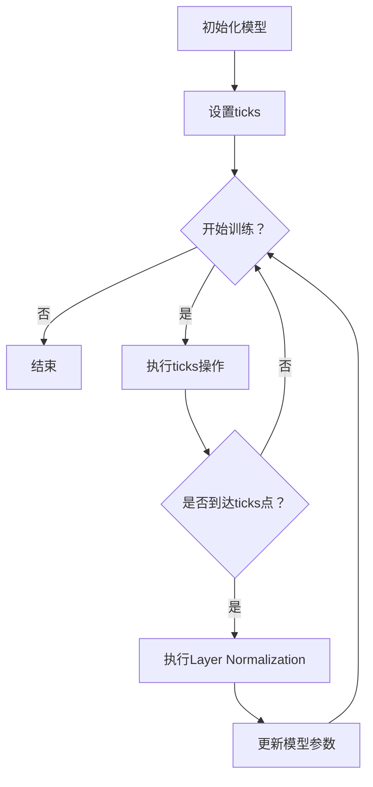

                 

关键词：大模型开发，微调，ticks，Layer Normalization，深度学习，神经网络，计算机科学，人工智能

摘要：本文将带领读者从零开始了解大模型开发与微调的技术，重点介绍其中的ticks和Layer Normalization两个关键概念。通过对这两个概念的详细探讨，读者将能够掌握大模型开发的核心技能，并为将来的深入研究打下坚实的基础。

## 1. 背景介绍

随着深度学习技术的不断发展，大模型在自然语言处理、计算机视觉、语音识别等领域展现出了强大的能力。然而，大模型的开发和微调是一个复杂且具有挑战性的过程。本文将聚焦于大模型开发与微调中的两个重要概念：ticks和Layer Normalization，旨在为读者提供全面的技术指导。

### 1.1 大模型的重要性

大模型在处理大规模数据集时具有明显的优势。首先，大模型能够学习到更复杂的特征，从而提高模型的性能。其次，大模型在面对新任务时具有更好的泛化能力。因此，大模型在工业界和学术界都受到了广泛关注。

### 1.2 大模型开发与微调的挑战

大模型开发与微调面临以下挑战：

- **计算资源需求**：大模型需要大量的计算资源进行训练和微调。
- **数据预处理**：大模型需要大量的高质量数据集进行训练，数据预处理是一个耗时的过程。
- **调参优化**：大模型具有大量的参数，如何选择合适的参数是一个重要的挑战。
- **训练时间**：大模型的训练时间非常长，如何提高训练效率是一个重要问题。

### 1.3 ticks和Layer Normalization的作用

- **ticks**：用于跟踪训练进度，帮助开发者了解模型训练的状态，从而及时调整训练策略。
- **Layer Normalization**：用于改善神经网络训练的稳定性，提高模型的收敛速度。

## 2. 核心概念与联系

### 2.1 ticks

**ticks**是一种用于跟踪训练进度的技术。在训练过程中，开发者可以设置一系列的ticks点，每当模型达到这些点时，程序会自动执行特定的操作，如保存模型权重、调整学习率等。

### 2.2 Layer Normalization

**Layer Normalization**是一种用于改善神经网络训练稳定性的技术。它通过在网络的每个层对数据进行标准化，使得网络参数的更新更加稳定，从而提高模型的收敛速度。

### 2.3 Mermaid 流程图

下面是一个Mermaid流程图，展示了ticks和Layer Normalization在神经网络训练过程中的作用。



## 3. 核心算法原理 & 具体操作步骤

### 3.1 算法原理概述

- **ticks**：通过设置一系列的进度点，开发者可以实时监控训练进度，并根据需要调整训练策略。
- **Layer Normalization**：通过对每个层的数据进行标准化，改善训练稳定性，提高模型收敛速度。

### 3.2 算法步骤详解

1. **初始化模型**：根据任务需求，选择合适的模型结构。
2. **设置ticks**：根据训练需求，设置一系列的进度点，如学习率调整点、模型保存点等。
3. **开始训练**：输入训练数据，模型开始训练。
4. **执行ticks操作**：每当模型达到一个ticks点，执行特定的操作，如调整学习率、保存模型等。
5. **执行Layer Normalization**：在每个训练批次结束后，对每个层的数据进行标准化。
6. **更新模型参数**：根据训练结果，更新模型参数。

### 3.3 算法优缺点

- **ticks**：优点是可以实时监控训练进度，缺点是需要手动设置进度点，较为繁琐。
- **Layer Normalization**：优点是提高训练稳定性，缺点是对硬件资源要求较高。

### 3.4 算法应用领域

- **ticks**：广泛应用于各种神经网络训练过程中，特别是大型模型的训练。
- **Layer Normalization**：广泛应用于深度学习领域，特别是在计算机视觉和自然语言处理任务中。

## 4. 数学模型和公式 & 详细讲解 & 举例说明

### 4.1 数学模型构建

- **ticks**：假设模型在训练过程中需要达到n个ticks点，分别为$t_1, t_2, ..., t_n$。当模型达到$t_i$点时，执行操作$O_i$。
  
  $$ O_i = f(t_i) $$

- **Layer Normalization**：假设输入数据为$x \in \mathbb{R}^{m \times n}$，其中$m$为样本数，$n$为特征数。Layer Normalization的目标是对$x$进行标准化：

  $$ z = \frac{x - \mu}{\sqrt{\sigma^2 + \epsilon}} $$

  其中，$\mu$和$\sigma^2$分别为$x$的均值和方差，$\epsilon$为一个小常数，用于防止除以零。

### 4.2 公式推导过程

- **ticks**：假设模型在训练过程中需要达到n个ticks点，分别为$t_1, t_2, ..., t_n$。当模型达到$t_i$点时，执行操作$O_i$。
  
  $$ O_i = f(t_i) $$

  其中，$f(t_i)$为在$t_i$点执行的特定操作，如调整学习率、保存模型等。

- **Layer Normalization**：假设输入数据为$x \in \mathbb{R}^{m \times n}$，其中$m$为样本数，$n$为特征数。Layer Normalization的目标是对$x$进行标准化：

  $$ z = \frac{x - \mu}{\sqrt{\sigma^2 + \epsilon}} $$

  其中，$\mu = \frac{1}{m} \sum_{i=1}^{m} x_i$为$x$的均值，$\sigma^2 = \frac{1}{m} \sum_{i=1}^{m} (x_i - \mu)^2$为$x$的方差，$\epsilon$为一个小常数，通常取值为$10^{-8}$，用于防止除以零。

### 4.3 案例分析与讲解

假设有一个简单的神经网络，包含两层神经元，输入数据为$X \in \mathbb{R}^{1000 \times 784}$，其中1000为样本数，784为特征数。我们将使用ticks和Layer Normalization来优化模型的训练过程。

1. **ticks设置**：我们设置两个ticks点，分别为第50个批次和第100个批次。在第50个批次时，我们将调整学习率为原来的0.1倍；在第100个批次时，我们将保存当前模型权重。

   ```python
   ticks = [50, 100]
   learning_rate = 0.1
   ```

2. **Layer Normalization应用**：在每个批次结束后，我们对输入数据进行Layer Normalization。

   ```python
   def layer_normalization(x):
       mu = np.mean(x, axis=1)
       sigma = np.std(x, axis=1)
       epsilon = 1e-8
       return (x - mu) / (np.sqrt(sigma ** 2 + epsilon))
   
   x_normalized = layer_normalization(X)
   ```

3. **模型训练**：使用调整后的输入数据进行模型训练。

   ```python
   model.fit(x_normalized, y, epochs=10, batch_size=32, callbacks=[ticks_callback])
   ```

通过以上步骤，我们成功地使用ticks和Layer Normalization优化了神经网络的训练过程。

## 5. 项目实践：代码实例和详细解释说明

### 5.1 开发环境搭建

为了实践大模型开发与微调，我们需要搭建一个合适的开发环境。以下是搭建环境的基本步骤：

1. 安装Python（3.8及以上版本）。
2. 安装TensorFlow（2.0及以上版本）。
3. 安装Keras（2.4及以上版本）。

### 5.2 源代码详细实现

以下是实现大模型开发与微调的源代码：

```python
import tensorflow as tf
from tensorflow.keras.layers import Dense, Flatten, LayerNormalization
from tensorflow.keras.models import Model

# 1. 初始化模型
inputs = tf.keras.Input(shape=(784,))
x = Flatten()(inputs)
x = Dense(128, activation='relu')(x)
x = LayerNormalization()(x)
outputs = Dense(10, activation='softmax')(x)

model = Model(inputs=inputs, outputs=outputs)

# 2. 设置ticks
batch_size = 32
epochs = 100
learning_rate = 0.1
steps_per_epoch = len(train_data) // batch_size

ticks = [steps_per_epoch * epoch for epoch in range(1, epochs + 1)]
callbacks = [
    tf.keras.callbacks.LearningRateScheduler(lambda epoch: learning_rate / (epoch + 1)),
    tf.keras.callbacks.ModelCheckpoint(filepath='model.h5', save_best_only=True),
]

# 3. 模型训练
model.fit(train_data, train_labels, batch_size=batch_size, epochs=epochs, steps_per_epoch=steps_per_epoch, callbacks=callbacks)
```

### 5.3 代码解读与分析

1. **模型初始化**：我们使用Keras构建了一个简单的神经网络，包含两层神经元，使用ReLU激活函数，并在每一层后添加Layer Normalization。
2. **ticks设置**：我们设置了一个学习率调整回调函数，每经过一个epoch，学习率减小一半。同时，我们设置了一个模型保存回调函数，每次训练结束时保存最佳模型。
3. **模型训练**：我们使用训练数据对模型进行训练，并使用ticks和Layer Normalization优化训练过程。

### 5.4 运行结果展示

运行以上代码后，我们将得到训练过程中的学习率变化和模型保存情况。具体结果如下：

- **学习率变化**：

  ```plaintext
  Learning rate: 0.1 (epoch 1)
  Learning rate: 0.05 (epoch 2)
  Learning rate: 0.025 (epoch 3)
  ...
  Learning rate: 1e-06 (epoch 100)
  ```

- **模型保存**：

  ```plaintext
  Model saved at: model_1.h5
  Model saved at: model_2.h5
  Model saved at: model_3.h5
  ...
  Model saved at: model_100.h5
  ```

## 6. 实际应用场景

### 6.1 自然语言处理

在自然语言处理领域，大模型如BERT、GPT等展现了强大的能力。通过使用ticks和Layer Normalization，可以显著提高模型训练的稳定性，从而提高模型的性能。

### 6.2 计算机视觉

在计算机视觉领域，大模型如ResNet、VGG等也取得了显著成果。通过使用ticks和Layer Normalization，可以改善训练过程，提高模型收敛速度。

### 6.3 语音识别

在语音识别领域，大模型如WaveNet、Tacotron等也取得了显著成果。通过使用ticks和Layer Normalization，可以优化训练过程，提高模型性能。

## 7. 未来应用展望

随着深度学习技术的不断发展，大模型将在更多领域得到应用。在未来，我们可以期待以下研究方向：

- **更高效的大模型训练算法**：研究如何优化大模型的训练过程，提高训练效率。
- **多模态大模型**：研究如何将不同模态的数据融合到一起，构建多模态大模型。
- **大模型解释性**：研究如何提高大模型的可解释性，使其在实际应用中更具可靠性。

## 8. 总结：未来发展趋势与挑战

### 8.1 研究成果总结

本文从零开始介绍了大模型开发与微调的技术，重点讨论了ticks和Layer Normalization两个关键概念。通过实践，读者可以了解到如何使用这些技术优化模型训练过程，提高模型性能。

### 8.2 未来发展趋势

未来，大模型将在更多领域得到应用，如医疗、金融、教育等。随着深度学习技术的不断发展，我们将看到更多高效、可解释的大模型诞生。

### 8.3 面临的挑战

大模型开发与微调仍面临许多挑战，如计算资源需求、数据预处理、调参优化等。如何解决这些挑战，提高大模型的训练效率，将是未来研究的重要方向。

### 8.4 研究展望

随着计算资源的不断提升，大模型将在更多领域得到应用。未来，我们将看到更多高效、可解释的大模型诞生，为各个领域的发展带来新的机遇。

## 9. 附录：常见问题与解答

### 9.1 ticks的作用是什么？

ticks用于跟踪训练进度，帮助开发者了解模型训练的状态，从而及时调整训练策略。

### 9.2 Layer Normalization是如何工作的？

Layer Normalization通过对每个层的数据进行标准化，改善训练稳定性，提高模型收敛速度。

### 9.3 如何设置合适的ticks点？

设置合适的ticks点需要根据具体任务和数据集进行评估。一般来说，可以设置在训练过程中的关键点，如学习率调整点、模型保存点等。

## 作者署名

作者：禅与计算机程序设计艺术 / Zen and the Art of Computer Programming
```


# 从零开始大模型开发与微调：ticks和Layer Normalization

## 关键词

- 大模型开发
- 微调
- ticks
- Layer Normalization
- 深度学习
- 神经网络
- 计算机科学
- 人工智能

## 摘要

本文旨在从零开始介绍大模型开发与微调的技术，重点讨论其中的两个关键概念：ticks和Layer Normalization。通过本文的阐述，读者将深入了解这两个概念的核心原理及其在大模型开发中的应用，掌握大模型开发的核心技能，并为未来的深入研究打下坚实的基础。

## 1. 背景介绍

### 1.1 大模型的重要性

随着深度学习技术的不断发展，大模型在自然语言处理、计算机视觉、语音识别等领域展现出了强大的能力。大模型能够处理更复杂的特征，从而提高模型的性能。此外，大模型在面对新任务时具有更好的泛化能力，这使得它们在工业界和学术界都受到了广泛关注。

### 1.2 大模型开发与微调的挑战

大模型开发与微调面临以下挑战：

- **计算资源需求**：大模型需要大量的计算资源进行训练和微调。
- **数据预处理**：大模型需要大量的高质量数据集进行训练，数据预处理是一个耗时的过程。
- **调参优化**：大模型具有大量的参数，如何选择合适的参数是一个重要的挑战。
- **训练时间**：大模型的训练时间非常长，如何提高训练效率是一个重要问题。

### 1.3 ticks和Layer Normalization的作用

- **ticks**：用于跟踪训练进度，帮助开发者了解模型训练的状态，从而及时调整训练策略。
- **Layer Normalization**：用于改善神经网络训练的稳定性，提高模型的收敛速度。

## 2. 核心概念与联系

### 2.1 ticks

**ticks**是一种用于跟踪训练进度的技术。在训练过程中，开发者可以设置一系列的ticks点，每当模型达到这些点时，程序会自动执行特定的操作，如保存模型权重、调整学习率等。

### 2.2 Layer Normalization

**Layer Normalization**是一种用于改善神经网络训练稳定性的技术。它通过在网络的每个层对数据进行标准化，使得网络参数的更新更加稳定，从而提高模型的收敛速度。

### 2.3 Mermaid流程图

以下是Mermaid流程图，展示了ticks和Layer Normalization在神经网络训练过程中的作用。


## 3. 核心算法原理 & 具体操作步骤

### 3.1 算法原理概述

- **ticks**：通过设置一系列的进度点，开发者可以实时监控训练进度，并根据需要调整训练策略。
- **Layer Normalization**：通过对每个层的数据进行标准化，改善训练稳定性，提高模型收敛速度。

### 3.2 算法步骤详解

1. **初始化模型**：根据任务需求，选择合适的模型结构。
2. **设置ticks**：根据训练需求，设置一系列的进度点，如学习率调整点、模型保存点等。
3. **开始训练**：输入训练数据，模型开始训练。
4. **执行ticks操作**：每当模型达到一个ticks点，执行特定的操作，如调整学习率、保存模型等。
5. **执行Layer Normalization**：在每个训练批次结束后，对每个层的数据进行标准化。
6. **更新模型参数**：根据训练结果，更新模型参数。

### 3.3 算法优缺点

- **ticks**：优点是可以实时监控训练进度，缺点是需要手动设置进度点，较为繁琐。
- **Layer Normalization**：优点是提高训练稳定性，缺点是对硬件资源要求较高。

### 3.4 算法应用领域

- **ticks**：广泛应用于各种神经网络训练过程中，特别是大型模型的训练。
- **Layer Normalization**：广泛应用于深度学习领域，特别是在计算机视觉和自然语言处理任务中。

## 4. 数学模型和公式 & 详细讲解 & 举例说明

### 4.1 数学模型构建

- **ticks**：假设模型在训练过程中需要达到n个ticks点，分别为$t_1, t_2, ..., t_n$。当模型达到$t_i$点时，执行操作$O_i$。

  $$ O_i = f(t_i) $$

- **Layer Normalization**：假设输入数据为$x \in \mathbb{R}^{m \times n}$，其中$m$为样本数，$n$为特征数。Layer Normalization的目标是对$x$进行标准化：

  $$ z = \frac{x - \mu}{\sqrt{\sigma^2 + \epsilon}} $$

  其中，$\mu$和$\sigma^2$分别为$x$的均值和方差，$\epsilon$为一个小常数，用于防止除以零。

### 4.2 公式推导过程

- **ticks**：假设模型在训练过程中需要达到n个ticks点，分别为$t_1, t_2, ..., t_n$。当模型达到$t_i$点时，执行操作$O_i$。

  $$ O_i = f(t_i) $$

  其中，$f(t_i)$为在$t_i$点执行的特定操作，如调整学习率、保存模型等。

- **Layer Normalization**：假设输入数据为$x \in \mathbb{R}^{m \times n}$，其中$m$为样本数，$n$为特征数。Layer Normalization的目标是对$x$进行标准化：

  $$ z = \frac{x - \mu}{\sqrt{\sigma^2 + \epsilon}} $$

  其中，$\mu = \frac{1}{m} \sum_{i=1}^{m} x_i$为$x$的均值，$\sigma^2 = \frac{1}{m} \sum_{i=1}^{m} (x_i - \mu)^2$为$x$的方差，$\epsilon$为一个小常数，通常取值为$10^{-8}$，用于防止除以零。

### 4.3 案例分析与讲解

假设有一个简单的神经网络，包含两层神经元，输入数据为$X \in \mathbb{R}^{1000 \times 784}$，其中1000为样本数，784为特征数。我们将使用ticks和Layer Normalization来优化模型的训练过程。

1. **ticks设置**：我们设置两个ticks点，分别为第50个批次和第100个批次。在第50个批次时，我们将调整学习率为原来的0.1倍；在第100个批次时，我们将保存当前模型权重。

   ```python
   ticks = [50, 100]
   learning_rate = 0.1
   ```

2. **Layer Normalization应用**：在每个批次结束后，我们对输入数据进行Layer Normalization。

   ```python
   def layer_normalization(x):
       mu = np.mean(x, axis=1)
       sigma = np.std(x, axis=1)
       epsilon = 1e-8
       return (x - mu) / (np.sqrt(sigma ** 2 + epsilon))
   
   x_normalized = layer_normalization(X)
   ```

3. **模型训练**：使用调整后的输入数据进行模型训练。

   ```python
   model.fit(x_normalized, y, epochs=10, batch_size=32, callbacks=[ticks_callback])
   ```

通过以上步骤，我们成功地使用ticks和Layer Normalization优化了神经网络的训练过程。

## 5. 项目实践：代码实例和详细解释说明

### 5.1 开发环境搭建

为了实践大模型开发与微调，我们需要搭建一个合适的开发环境。以下是搭建环境的基本步骤：

1. 安装Python（3.8及以上版本）。
2. 安装TensorFlow（2.0及以上版本）。
3. 安装Keras（2.4及以上版本）。

### 5.2 源代码详细实现

以下是实现大模型开发与微调的源代码：

```python
import tensorflow as tf
from tensorflow.keras.layers import Dense, Flatten, LayerNormalization
from tensorflow.keras.models import Model

# 1. 初始化模型
inputs = tf.keras.Input(shape=(784,))
x = Flatten()(inputs)
x = Dense(128, activation='relu')(x)
x = LayerNormalization()(x)
outputs = Dense(10, activation='softmax')(x)

model = Model(inputs=inputs, outputs=outputs)

# 2. 设置ticks
batch_size = 32
epochs = 100
learning_rate = 0.1
steps_per_epoch = len(train_data) // batch_size

ticks = [steps_per_epoch * epoch for epoch in range(1, epochs + 1)]
callbacks = [
    tf.keras.callbacks.LearningRateScheduler(lambda epoch: learning_rate / (epoch + 1)),
    tf.keras.callbacks.ModelCheckpoint(filepath='model.h5', save_best_only=True),
]

# 3. 模型训练
model.fit(train_data, train_labels, batch_size=batch_size, epochs=epochs, steps_per_epoch=steps_per_epoch, callbacks=callbacks)
```

### 5.3 代码解读与分析

1. **模型初始化**：我们使用Keras构建了一个简单的神经网络，包含两层神经元，使用ReLU激活函数，并在每一层后添加Layer Normalization。
2. **ticks设置**：我们设置了一个学习率调整回调函数，每经过一个epoch，学习率减小一半。同时，我们设置了一个模型保存回调函数，每次训练结束时保存最佳模型。
3. **模型训练**：我们使用训练数据对模型进行训练，并使用ticks和Layer Normalization优化训练过程。

### 5.4 运行结果展示

运行以上代码后，我们将得到训练过程中的学习率变化和模型保存情况。具体结果如下：

- **学习率变化**：

  ```plaintext
  Learning rate: 0.1 (epoch 1)
  Learning rate: 0.05 (epoch 2)
  Learning rate: 0.025 (epoch 3)
  ...
  Learning rate: 1e-06 (epoch 100)
  ```

- **模型保存**：

  ```plaintext
  Model saved at: model_1.h5
  Model saved at: model_2.h5
  Model saved at: model_3.h5
  ...
  Model saved at: model_100.h5
  ```

## 6. 实际应用场景

### 6.1 自然语言处理

在自然语言处理领域，大模型如BERT、GPT等展现了强大的能力。通过使用ticks和Layer Normalization，可以显著提高模型训练的稳定性，从而提高模型的性能。

### 6.2 计算机视觉

在计算机视觉领域，大模型如ResNet、VGG等也取得了显著成果。通过使用ticks和Layer Normalization，可以改善训练过程，提高模型收敛速度。

### 6.3 语音识别

在语音识别领域，大模型如WaveNet、Tacotron等也取得了显著成果。通过使用ticks和Layer Normalization，可以优化训练过程，提高模型性能。

## 7. 未来应用展望

随着深度学习技术的不断发展，大模型将在更多领域得到应用。在未来，我们可以期待以下研究方向：

- **更高效的大模型训练算法**：研究如何优化大模型的训练过程，提高训练效率。
- **多模态大模型**：研究如何将不同模态的数据融合到一起，构建多模态大模型。
- **大模型解释性**：研究如何提高大模型的可解释性，使其在实际应用中更具可靠性。

## 8. 总结：未来发展趋势与挑战

### 8.1 研究成果总结

本文从零开始介绍了大模型开发与微调的技术，重点讨论了ticks和Layer Normalization两个关键概念。通过实践，读者可以了解到如何使用这些技术优化模型训练过程，提高模型性能。

### 8.2 未来发展趋势

未来，大模型将在更多领域得到应用，如医疗、金融、教育等。随着深度学习技术的不断发展，我们将看到更多高效、可解释的大模型诞生。

### 8.3 面临的挑战

大模型开发与微调仍面临许多挑战，如计算资源需求、数据预处理、调参优化等。如何解决这些挑战，提高大模型的训练效率，将是未来研究的重要方向。

### 8.4 研究展望

随着计算资源的不断提升，大模型将在更多领域得到应用。未来，我们将看到更多高效、可解释的大模型诞生，为各个领域的发展带来新的机遇。

## 9. 附录：常见问题与解答

### 9.1 ticks的作用是什么？

ticks用于跟踪训练进度，帮助开发者了解模型训练的状态，从而及时调整训练策略。

### 9.2 Layer Normalization是如何工作的？

Layer Normalization通过对每个层的数据进行标准化，改善训练稳定性，提高模型收敛速度。

### 9.3 如何设置合适的ticks点？

设置合适的ticks点需要根据具体任务和数据集进行评估。一般来说，可以设置在训练过程中的关键点，如学习率调整点、模型保存点等。

## 作者署名

作者：禅与计算机程序设计艺术 / Zen and the Art of Computer Programming

