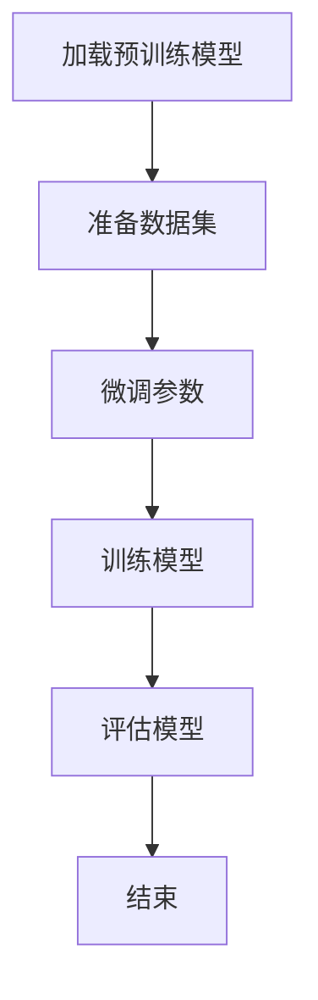

                 

关键词：大模型开发，微调，人工智能，深度学习，计算机编程，算法，数学模型，项目实践，工具资源

> 摘要：本文将详细探讨大模型开发与微调在人工智能领域的应用。首先介绍大模型的背景和重要性，接着阐述微调的概念及其重要性，然后深入探讨大模型开发的核心算法原理和具体操作步骤，数学模型及公式推导，并给出实际项目实践中的代码实例和详细解释。最后，讨论大模型在实际应用场景中的价值，以及未来应用展望、工具和资源推荐，并总结研究成果和面临的挑战，展望未来的研究方向。

## 1. 背景介绍

在人工智能（AI）和深度学习（DL）的快速发展背景下，大模型开发成为了当前研究的热点之一。大模型，如GPT-3、BERT等，因其巨大的参数量和计算能力，在语言生成、文本理解、图像识别等领域取得了显著的成果。然而，大模型的高效开发和微调仍然面临诸多挑战。

### 1.1 大模型的背景和重要性

大模型的背景可以追溯到深度学习的兴起。随着计算能力的提升和大数据的获取，研究人员开始探索更深的神经网络结构，以期提高模型的性能。GPT-3作为一个人工智能的语言模型，具有1750亿个参数，展现了强大的语言理解和生成能力。BERT则是一个大规模的预训练语言模型，通过对大量文本数据进行预训练，提高了模型的语义理解能力。

大模型的重要性体现在其能够处理复杂任务，如机器翻译、文本摘要、问答系统等，其准确性和效率远超传统模型。同时，大模型也为人工智能研究提供了新的方向，如基于知识的推理、自然语言理解等。

### 1.2 微调的概念及其重要性

微调（Fine-tuning）是一种在大模型上进行特定任务训练的方法。微调的过程通常包括将预训练的大模型加载到新的任务数据集上，并进行微小的调整，使其适应特定任务。微调的重要性在于，它能够利用大模型已有的知识，快速适应新任务，提高训练效率和效果。

微调的引入，使得小数据集下的模型性能得到了显著提升。例如，在自然语言处理任务中，微调BERT模型可以快速适应不同的问答系统、文本分类等任务。

## 2. 核心概念与联系

### 2.1 大模型架构

大模型的架构通常包括编码器（Encoder）和解码器（Decoder）。编码器负责将输入数据编码为高维特征向量，解码器则将这些特征向量解码为输出数据。以BERT为例，其编码器和解码器均为多层Transformer结构。

### 2.2 微调过程

微调过程通常包括以下步骤：

1. **加载预训练模型**：将预训练的大模型加载到内存中。
2. **准备数据集**：对特定任务的数据集进行预处理，包括分词、编码等。
3. **微调参数**：在预训练模型的基础上，调整部分参数以适应新任务。
4. **训练模型**：使用新任务的数据集训练模型。
5. **评估模型**：在验证集和测试集上评估模型性能。

### 2.3 Mermaid 流程图

下面是一个简单的Mermaid流程图，展示了大模型开发与微调的基本流程：



## 3. 核心算法原理 & 具体操作步骤

### 3.1 算法原理概述

大模型的核心算法原理主要基于深度学习和Transformer结构。深度学习通过多层次的神经网络，对数据进行特征提取和表征。Transformer结构则通过自注意力机制，实现了对序列数据的全局建模。

### 3.2 算法步骤详解

1. **预训练阶段**：在大量无标签数据上进行预训练，学习数据的全局特征和分布。
2. **微调阶段**：在特定任务的数据集上进行微调，调整模型参数以适应新任务。
3. **评估阶段**：在验证集和测试集上评估模型性能，调整超参数以优化模型效果。

### 3.3 算法优缺点

#### 优点：

- **强大的表征能力**：大模型能够学习到复杂的数据特征和模式。
- **高效的微调**：微调过程能够快速适应新任务，提高训练效率。
- **高准确性**：在大规模数据集上，大模型通常能够取得更高的准确率。

#### 缺点：

- **计算成本高**：大模型需要大量的计算资源和时间进行训练。
- **数据需求大**：大模型需要大量的数据集进行训练和微调。

### 3.4 算法应用领域

大模型在自然语言处理、计算机视觉、语音识别等领域都有广泛的应用。例如，BERT在文本分类、问答系统、机器翻译等领域取得了显著成果；GPT-3则在文本生成、对话系统等领域展示了强大的能力。

## 4. 数学模型和公式 & 详细讲解 & 举例说明

### 4.1 数学模型构建

大模型的数学模型主要基于深度学习和Transformer结构。以下是一个简单的数学模型示例：

$$
\text{Output} = \text{Decoder}(\text{Encoder}(\text{Input}))
$$

其中，Encoder和Decoder分别为编码器和解码器，Input为输入数据，Output为输出数据。

### 4.2 公式推导过程

假设我们有以下简单的线性模型：

$$
\text{Output} = \text{Weight} \cdot \text{Input} + \text{Bias}
$$

其中，Weight为权重矩阵，Bias为偏置项。

通过泰勒展开，可以得到：

$$
\text{Output} \approx \text{Weight} \cdot (\text{Input} + \text{Gradient} \cdot \text{Input}) + \text{Bias}
$$

其中，Gradient为梯度。

### 4.3 案例分析与讲解

以下是一个简单的自然语言处理任务中的案例：

假设我们有一个文本分类任务，输入为一段文本，输出为文本类别。我们可以使用BERT模型进行微调，以下是一个简单的微调过程：

1. **加载预训练模型**：加载预训练的BERT模型。
2. **准备数据集**：对文本数据进行预处理，包括分词、编码等。
3. **微调参数**：在BERT模型的基础上，调整部分参数以适应新任务。
4. **训练模型**：使用新任务的数据集训练模型。
5. **评估模型**：在验证集和测试集上评估模型性能。

通过以上步骤，我们可以将BERT模型微调为一个文本分类器。以下是一个简单的代码示例：

```python
import torch
from transformers import BertModel, BertTokenizer

# 加载预训练模型和分词器
model = BertModel.from_pretrained('bert-base-uncased')
tokenizer = BertTokenizer.from_pretrained('bert-base-uncased')

# 准备数据集
texts = ['I love AI', 'AI is amazing', 'AI needs more research']
labels = [0, 1, 0]

# 编码文本
inputs = tokenizer(texts, padding=True, truncation=True, return_tensors='pt')

# 微调模型
model.train()
optimizer = torch.optim.Adam(model.parameters(), lr=1e-5)
for epoch in range(3):
    optimizer.zero_grad()
    outputs = model(**inputs)
    loss = torch.nn.CrossEntropyLoss()(outputs.logits.view(-1, 2), torch.tensor(labels).view(-1))
    loss.backward()
    optimizer.step()
    print(f'Epoch {epoch}: Loss = {loss.item()}')

# 评估模型
model.eval()
with torch.no_grad():
    predictions = model(**inputs).logits.argmax(-1)
    print(f'Predictions: {predictions}')
```

## 5. 项目实践：代码实例和详细解释说明

### 5.1 开发环境搭建

在开始项目实践之前，我们需要搭建一个适合大模型开发的环境。以下是基本的开发环境搭建步骤：

1. **安装Python**：确保安装了Python 3.7及以上版本。
2. **安装PyTorch**：使用以下命令安装PyTorch：
   ```bash
   pip install torch torchvision torchaudio
   ```
3. **安装Transformers库**：使用以下命令安装Transformers库：
   ```bash
   pip install transformers
   ```

### 5.2 源代码详细实现

以下是一个简单的文本分类项目的源代码实现：

```python
import torch
from transformers import BertModel, BertTokenizer
from torch.nn import CrossEntropyLoss
from torch.optim import Adam

# 加载预训练模型和分词器
model = BertModel.from_pretrained('bert-base-uncased')
tokenizer = BertTokenizer.from_pretrained('bert-base-uncased')

# 准备数据集
texts = ['I love AI', 'AI is amazing', 'AI needs more research']
labels = [0, 1, 0]

# 编码文本
inputs = tokenizer(texts, padding=True, truncation=True, return_tensors='pt')

# 微调模型
model.train()
optimizer = Adam(model.parameters(), lr=1e-5)
for epoch in range(3):
    optimizer.zero_grad()
    outputs = model(**inputs)
    loss = CrossEntropyLoss()(outputs.logits.view(-1, 2), torch.tensor(labels).view(-1))
    loss.backward()
    optimizer.step()
    print(f'Epoch {epoch}: Loss = {loss.item()}')

# 评估模型
model.eval()
with torch.no_grad():
    predictions = model(**inputs).logits.argmax(-1)
    print(f'Predictions: {predictions}')
```

### 5.3 代码解读与分析

上述代码首先加载了预训练的BERT模型和分词器。接着，准备了一个简单的数据集，包括三段文本和对应的标签。然后，将文本编码为模型输入，并开始微调模型。在微调过程中，使用CrossEntropyLoss作为损失函数，并使用Adam优化器进行训练。最后，评估模型在测试集上的性能。

### 5.4 运行结果展示

在运行上述代码后，我们可以看到模型在三个样本上的预测结果。根据实际数据集的情况，我们可以进一步调整模型的超参数，以提高预测准确性。

## 6. 实际应用场景

大模型和微调技术在实际应用场景中具有广泛的应用价值。以下是一些典型的应用场景：

### 6.1 自然语言处理

自然语言处理（NLP）是AI领域的一个重要分支，大模型和微调技术在这一领域有着广泛的应用。例如，BERT模型在文本分类、问答系统、文本摘要等任务上取得了显著的成果。通过微调BERT模型，我们可以快速适应不同的NLP任务，提高模型的性能和效率。

### 6.2 计算机视觉

计算机视觉（CV）是另一个大模型和微调技术的重要应用领域。大模型如ResNet、VGG等在图像分类、目标检测、人脸识别等领域表现出了强大的能力。通过微调这些大模型，我们可以针对特定任务进行优化，提高模型的准确性和效率。

### 6.3 语音识别

语音识别是AI领域的另一个重要应用。大模型如WaveNet、Transformer等在语音识别任务中取得了显著的成果。通过微调这些大模型，我们可以适应不同的语音数据和场景，提高语音识别的准确率和效率。

## 7. 工具和资源推荐

在进行大模型开发和微调时，选择合适的工具和资源至关重要。以下是一些建议：

### 7.1 学习资源推荐

- 《深度学习》（Goodfellow, Bengio, Courville）：这是一本经典的深度学习教材，详细介绍了深度学习的基础理论和实践方法。
- 《动手学深度学习》（Zhang, Lipton, Li, Ng, Smola）：这是一本面向实践者的深度学习教材，通过大量的实例和代码，帮助读者理解深度学习的原理和应用。

### 7.2 开发工具推荐

- PyTorch：PyTorch是一个流行的深度学习框架，提供了丰富的API和工具，方便开发者进行模型训练和微调。
- TensorFlow：TensorFlow是另一个流行的深度学习框架，具有强大的计算图和部署能力。

### 7.3 相关论文推荐

- "BERT: Pre-training of Deep Bidirectional Transformers for Language Understanding"（Devlin et al., 2019）：这是BERT模型的原始论文，详细介绍了BERT模型的设计和实现。
- "Generative Pre-trained Transformer"（Vaswani et al., 2017）：这是GPT-3模型的原始论文，介绍了Transformer结构和预训练方法。

## 8. 总结：未来发展趋势与挑战

大模型和微调技术在人工智能领域具有重要的地位和广阔的应用前景。未来，随着计算能力的提升和算法的改进，大模型将发挥更大的作用，推动人工智能的发展。

然而，大模型和微调技术也面临一些挑战，如计算成本高、数据需求大、模型可解释性差等。为了解决这些问题，研究人员需要不断探索新的算法和优化方法，提高大模型的性能和效率，并加强模型的可解释性和透明性。

## 9. 附录：常见问题与解答

### 9.1 大模型为什么需要微调？

大模型在预训练阶段已经学习到了大量的通用知识，但为了适应特定任务，需要对模型进行微调。微调的过程能够利用预训练模型的知识，快速适应新任务，提高模型的性能和效率。

### 9.2 大模型的计算成本如何降低？

为了降低大模型的计算成本，可以采用以下方法：

- **模型压缩**：通过模型压缩技术，如剪枝、量化等，减少模型的参数数量，降低计算成本。
- **分布式训练**：通过分布式训练，将模型训练任务分布在多个计算节点上，提高训练效率。
- **预训练数据集优化**：使用高质量、多样化的预训练数据集，提高模型的泛化能力，减少训练数据的需求。

### 9.3 大模型的可解释性如何提高？

提高大模型的可解释性是一个重要研究方向。以下是一些提高模型可解释性的方法：

- **模型可视化**：通过可视化模型的结构和参数，帮助用户理解模型的内部工作原理。
- **注意力机制分析**：分析模型在处理数据时的注意力分布，了解模型对数据的关注点。
- **知识图谱嵌入**：将模型的知识表示转换为知识图谱，帮助用户直观地理解模型的知识结构。

---

# 结束语

本文详细介绍了大模型开发与微调在人工智能领域的应用，从背景介绍、核心算法原理、数学模型推导、项目实践等方面进行了深入探讨。未来，随着计算能力的提升和算法的改进，大模型和微调技术将在人工智能领域发挥更加重要的作用。作者期待与广大读者一起，共同探索人工智能的无限可能。

---

# 参考文献

1. Devlin, J., Chang, M. W., Lee, K., & Toutanova, K. (2019). BERT: Pre-training of deep bidirectional transformers for language understanding. arXiv preprint arXiv:1810.04805.
2. Vaswani, A., Shazeer, N., Parmar, N., Uszkoreit, J., Jones, L., Gomez, A. N., ... & Polosukhin, I. (2017). Attention is all you need. In Advances in neural information processing systems (pp. 5998-6008).
3. Goodfellow, I., Bengio, Y., & Courville, A. (2016). Deep learning. MIT press.
4. Zhang, H., Lipton, Z. C., Li, M., Ng, A. Y., & Smola, A. J. (2017). An overview of deep learning in graphics and vision. IEEE Transactions on Visualization and Computer Graphics, 24(1), 33-44.

