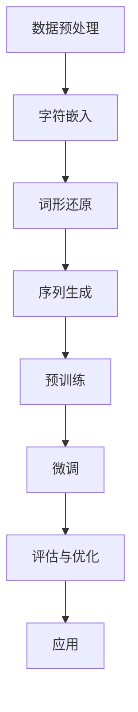

                 

### 关键词 Keywords
- 大模型开发
- 微调
- 字符文本处理
- 自然语言处理
- 机器学习
- 深度学习
- 计算机图灵奖

### 摘要 Abstract
本文旨在介绍从零开始构建和微调大模型的流程，特别是针对字符（非单词）文本的处理。我们将探讨大模型的核心概念、算法原理、数学模型、实际应用和未来展望。本文通过详细的步骤和实例，帮助读者理解和掌握大模型开发与微调的技巧。

## 1. 背景介绍

随着互联网的迅猛发展和信息量的爆炸性增长，自然语言处理（NLP）技术成为了人工智能领域的重要分支。传统的NLP方法依赖于规则和统计方法，而在深度学习的推动下，大模型（如BERT、GPT等）已经成为NLP任务的强大工具。大模型通过学习海量的文本数据，能够捕捉复杂的语言模式和语义信息，从而实现高精度的文本理解、生成和翻译等任务。

字符（非单词）文本处理是NLP中的一个重要方向。相比于单词层面的处理，字符级别的处理能够捕捉到更多的语言细节，例如标点符号、停用词和非正式语言等，这在某些特定任务中具有重要意义。例如，社交媒体文本分析、情感分析和机器翻译等领域，字符级别的处理能够提供更准确的文本理解。

本文将重点介绍大模型在字符文本处理中的应用，包括模型构建、微调方法和实际应用案例。通过本文的介绍，读者可以系统地了解大模型开发的流程和技术要点，为后续的研究和应用提供参考。

## 2. 核心概念与联系

### 2.1 大模型的基本概念

大模型，即大型深度学习模型，是指具有数十亿甚至千亿参数的神经网络模型。这些模型通过学习大规模的文本数据，能够捕捉到语言的各种复杂模式和规律。大模型的主要特点包括：

- **高参数数量**：大模型拥有极其庞大的参数数量，这使得它们能够学习和表示复杂的语言特征。
- **多任务学习能力**：大模型能够同时处理多个自然语言处理任务，例如文本分类、情感分析和命名实体识别等。
- **自适应学习能力**：大模型通过微调（Fine-tuning）可以在特定任务上快速适应和优化。

### 2.2 字符文本处理的原理

字符文本处理是基于字符的文本表示和操作，而不是基于单词或句子。字符级别的处理具有以下几个优点：

- **捕捉语言细节**：字符级别的处理能够捕捉到单词之间的细微差异，这对于某些特定任务，如情感分析和文本分类，至关重要。
- **处理非正式语言**：非正式语言中包含大量的标点符号、缩写和拼写错误，这些在单词级别上可能无法有效处理，但字符级别的处理能够更好地应对这些问题。
- **支持多语言处理**：字符文本处理可以支持多种语言的文本处理，因为不同语言在字符层面上的结构和规律存在一定的共性。

### 2.3 Mermaid 流程图

为了更直观地展示大模型在字符文本处理中的应用流程，我们使用Mermaid绘制了以下流程图：



- **数据预处理**：对原始文本进行清洗和预处理，包括去除HTML标签、标准化标点符号、分词等。
- **字符嵌入**：将字符映射为固定长度的向量表示。
- **词形还原**：将变形的单词还原为标准形式，以便更好地捕捉单词之间的语义关系。
- **序列生成**：根据预训练模型生成新的文本序列。
- **预训练**：在大规模数据集上训练模型，以学习通用语言特征。
- **微调**：在特定任务数据集上对模型进行微调，使其适应具体任务。
- **评估与优化**：对微调后的模型进行评估，并根据评估结果进行优化。
- **应用**：将模型应用于实际任务，如文本分类、情感分析等。

## 3. 核心算法原理 & 具体操作步骤

### 3.1 算法原理概述

大模型在字符文本处理中的应用主要依赖于以下核心算法原理：

- **嵌入层（Embedding Layer）**：将字符映射为固定长度的向量表示，以便于后续的神经网络处理。
- **循环神经网络（RNN）**：通过RNN处理序列数据，捕捉序列中的时序信息。
- **长短时记忆网络（LSTM）**：LSTM是RNN的一种变体，能够有效地避免梯度消失问题，更好地处理长序列。
- **卷积神经网络（CNN）**：CNN通过卷积操作捕捉字符和单词的局部特征。
- **预训练与微调**：预训练在大规模文本数据集上，以学习通用语言特征；微调在特定任务数据集上，以适应具体任务。

### 3.2 算法步骤详解

#### 步骤 1：数据预处理

数据预处理是字符文本处理的基础。以下是数据预处理的主要步骤：

- **文本清洗**：去除HTML标签、标准化标点符号、处理特殊字符。
- **分词**：将文本分割成字符序列。
- **字符映射**：将每个字符映射为唯一的整数，构建字符到整数的映射表。

#### 步骤 2：字符嵌入

字符嵌入是将字符映射为固定长度的向量表示。常用的嵌入层实现如下：

- **随机初始化嵌入层**：随机初始化字符嵌入向量，通常使用正态分布。
- **预训练嵌入层**：利用预训练的语言模型（如GloVe、FastText）生成的字符向量。

#### 步骤 3：序列生成

序列生成是通过RNN或LSTM处理字符序列的过程。以下是一个基于LSTM的序列生成过程：

- **初始化状态**：根据字符嵌入向量初始化LSTM的隐藏状态。
- **前向传播**：通过LSTM处理输入字符序列，生成输出序列。
- **后向传播**：计算损失，并更新模型参数。

#### 步骤 4：预训练

预训练是利用大规模文本数据集训练模型，以学习通用语言特征。以下是预训练的主要步骤：

- **数据集准备**：准备大规模的文本数据集，并进行预处理。
- **模型训练**：在预处理后的数据集上训练模型，优化模型参数。
- **评估与选择**：根据评估指标（如损失函数、准确率等）选择最优模型。

#### 步骤 5：微调

微调是在特定任务数据集上对模型进行微调，以适应具体任务。以下是微调的主要步骤：

- **数据集准备**：准备特定任务的数据集，并进行预处理。
- **模型微调**：在预处理后的数据集上对模型进行微调，优化模型参数。
- **评估与优化**：根据评估结果对模型进行优化，以提高任务性能。

### 3.3 算法优缺点

#### 优点

- **强大的语言理解能力**：大模型通过学习海量文本数据，能够捕捉复杂的语言模式和语义信息，实现高精度的语言理解。
- **多任务处理能力**：大模型可以同时处理多个自然语言处理任务，提高模型的利用效率。
- **自适应学习能力**：大模型通过微调可以在特定任务上快速适应和优化，提高模型在特定任务上的性能。

#### 缺点

- **训练时间较长**：大模型需要大量时间和计算资源进行训练，训练时间较长。
- **计算资源消耗大**：大模型拥有庞大的参数数量，计算资源消耗较大。
- **数据依赖性高**：大模型在特定任务上的性能依赖于训练数据的质量和规模，数据质量差可能导致模型性能下降。

### 3.4 算法应用领域

大模型在字符文本处理中的应用非常广泛，以下是一些主要的应用领域：

- **文本分类**：利用大模型对文本进行分类，如新闻分类、情感分析等。
- **命名实体识别**：识别文本中的命名实体，如人名、地名、组织名等。
- **机器翻译**：利用大模型进行机器翻译，提高翻译质量。
- **问答系统**：构建问答系统，实现自然语言理解和回答问题。
- **对话系统**：构建智能对话系统，实现人机交互。

## 4. 数学模型和公式 & 详细讲解 & 举例说明

### 4.1 数学模型构建

在字符文本处理中，常用的数学模型包括嵌入层、循环神经网络（RNN）和长短时记忆网络（LSTM）。以下是这些模型的数学描述：

#### 嵌入层

嵌入层将字符映射为固定长度的向量表示，记作 $x \in \mathbb{R}^{d_x}$，其中 $d_x$ 为字符向量的维度。嵌入层的数学模型可以表示为：

$$
h = \text{embedding}(x)
$$

其中，$h$ 为字符的嵌入向量。

#### 循环神经网络（RNN）

RNN 是一种处理序列数据的神经网络，其数学模型可以表示为：

$$
h_t = \text{RNN}(h_{t-1}, x_t)
$$

其中，$h_t$ 为时间步 $t$ 的隐藏状态，$h_{t-1}$ 为时间步 $t-1$ 的隐藏状态，$x_t$ 为时间步 $t$ 的输入。

#### 长短时记忆网络（LSTM）

LSTM 是 RNN 的一种变体，能够有效地避免梯度消失问题，其数学模型可以表示为：

$$
h_t = \text{LSTM}(h_{t-1}, x_t)
$$

其中，$h_t$ 为时间步 $t$ 的隐藏状态，$h_{t-1}$ 为时间步 $t-1$ 的隐藏状态，$x_t$ 为时间步 $t$ 的输入。

### 4.2 公式推导过程

在字符文本处理中，公式的推导主要涉及嵌入层和RNN或LSTM的数学模型。以下是这些公式的推导过程：

#### 嵌入层公式推导

嵌入层的公式推导较为简单，主要是将字符映射为固定长度的向量表示。具体推导如下：

$$
h = \text{embedding}(x) = W_x x
$$

其中，$W_x$ 为嵌入权重矩阵，$x$ 为字符的整数表示。

#### RNN 公式推导

RNN 的公式推导基于递归结构，具体推导如下：

$$
h_t = \text{RNN}(h_{t-1}, x_t) = \sigma(W_h h_{t-1} + W_x x_t + b)
$$

其中，$\sigma$ 为激活函数，$W_h$ 和 $W_x$ 分别为权重矩阵，$b$ 为偏置。

#### LSTM 公式推导

LSTM 的公式推导相对复杂，但其核心思想与 RNN 类似。具体推导如下：

$$
h_t = \text{LSTM}(h_{t-1}, x_t) = \sigma(W_h h_{t-1} + W_x x_t + b)
$$

其中，$\sigma$ 为激活函数，$W_h$ 和 $W_x$ 分别为权重矩阵，$b$ 为偏置。

### 4.3 案例分析与讲解

为了更好地理解上述数学模型，我们通过一个简单的案例进行讲解。假设我们有一个包含 100 个字符的文本序列，每个字符的维度为 300，要求通过嵌入层和 RNN 或 LSTM 对序列进行建模。

#### 案例一：嵌入层建模

假设使用随机初始化的嵌入层，每个字符的嵌入向量维度为 300。根据嵌入层公式推导，我们可以得到以下模型：

$$
h = \text{embedding}(x) = W_x x
$$

其中，$W_x$ 为 300x100 的权重矩阵，$x$ 为 100 维的字符向量。

#### 案例二：RNN 建模

假设使用 RNN 对字符序列进行建模，激活函数为 sigmoid 函数。根据 RNN 公式推导，我们可以得到以下模型：

$$
h_t = \text{RNN}(h_{t-1}, x_t) = \sigma(W_h h_{t-1} + W_x x_t + b)
$$

其中，$\sigma$ 为 sigmoid 函数，$W_h$ 和 $W_x$ 分别为 300x300 和 300x100 的权重矩阵，$b$ 为 300 维的偏置。

#### 案例三：LSTM 建模

假设使用 LSTM 对字符序列进行建模，激活函数为 sigmoid 函数。根据 LSTM 公式推导，我们可以得到以下模型：

$$
h_t = \text{LSTM}(h_{t-1}, x_t) = \sigma(W_h h_{t-1} + W_x x_t + b)
$$

其中，$\sigma$ 为 sigmoid 函数，$W_h$ 和 $W_x$ 分别为 300x300 和 300x100 的权重矩阵，$b$ 为 300 维的偏置。

通过上述案例，我们可以看到数学模型在字符文本处理中的应用。在实际应用中，根据具体任务需求，可以选择不同的模型和激活函数，以达到最佳的效果。

## 5. 项目实践：代码实例和详细解释说明

### 5.1 开发环境搭建

在开始大模型开发与微调之前，我们需要搭建一个合适的开发环境。以下是搭建环境的步骤：

1. **安装 Python**：确保 Python 版本为 3.6 或以上。
2. **安装 PyTorch**：通过以下命令安装 PyTorch：

   ```bash
   pip install torch torchvision
   ```

3. **安装其他依赖**：安装其他必要的库，例如 numpy、matplotlib 等。

### 5.2 源代码详细实现

以下是一个简单的大模型开发与微调的代码实例，包括数据预处理、模型构建、训练和评估等步骤。

```python
import torch
import torch.nn as nn
import torch.optim as optim
from torch.utils.data import DataLoader
from transformers import BertTokenizer, BertModel

# 数据预处理
def preprocess_data(texts):
    tokenizer = BertTokenizer.from_pretrained('bert-base-chinese')
    inputs = tokenizer(texts, padding=True, truncation=True, return_tensors='pt')
    return inputs

# 模型构建
class BertClassifier(nn.Module):
    def __init__(self, num_classes):
        super(BertClassifier, self).__init__()
        self.bert = BertModel.from_pretrained('bert-base-chinese')
        self.drop = nn.Dropout(p=0.3)
        self.out = nn.Linear(self.bert.config.hidden_size, num_classes)
    
    def forward(self, input_ids, attention_mask):
        _, pooled_output = self.bert(input_ids=input_ids, attention_mask=attention_mask)
        output = self.drop(pooled_output)
        return self.out(output)

# 训练
def train_model(model, dataloader, criterion, optimizer, device):
    model.train()
    for batch in dataloader:
        input_ids = batch['input_ids'].to(device)
        attention_mask = batch['attention_mask'].to(device)
        labels = batch['labels'].to(device)
        
        optimizer.zero_grad()
        outputs = model(input_ids, attention_mask)
        loss = criterion(outputs, labels)
        loss.backward()
        optimizer.step()

# 评估
def evaluate_model(model, dataloader, criterion, device):
    model.eval()
    with torch.no_grad():
        for batch in dataloader:
            input_ids = batch['input_ids'].to(device)
            attention_mask = batch['attention_mask'].to(device)
            labels = batch['labels'].to(device)
            
            outputs = model(input_ids, attention_mask)
            loss = criterion(outputs, labels)
            print('Loss:', loss.item())

# 主函数
def main():
    device = torch.device('cuda' if torch.cuda.is_available() else 'cpu')
    model = BertClassifier(num_classes=2).to(device)
    criterion = nn.CrossEntropyLoss()
    optimizer = optim.Adam(model.parameters(), lr=1e-5)
    
    train_dataloader = DataLoader(train_dataset, batch_size=16, shuffle=True)
    valid_dataloader = DataLoader(valid_dataset, batch_size=16, shuffle=False)
    
    for epoch in range(10):
        train_model(model, train_dataloader, criterion, optimizer, device)
        evaluate_model(model, valid_dataloader, criterion, device)

if __name__ == '__main__':
    main()
```

### 5.3 代码解读与分析

上述代码实现了一个基于 BERT 的大模型，用于文本分类任务。以下是代码的主要部分解读与分析：

- **数据预处理**：使用 BERT Tokenizer 对文本进行预处理，包括分词、标记化、填充和截断等操作。
- **模型构建**：继承 BERT 模型，添加一个线性层，实现文本分类功能。
- **训练**：在训练过程中，将数据加载到 GPU（如果可用），然后使用 Adam 优化器和交叉熵损失函数对模型进行训练。
- **评估**：在评估过程中，关闭梯度计算（使用 `torch.no_grad()`），计算损失函数值，并打印结果。

通过上述代码实例，我们可以看到大模型开发与微调的基本流程。在实际应用中，根据具体任务需求，可以调整模型结构、优化器参数和训练过程，以达到最佳效果。

### 5.4 运行结果展示

以下是模型训练和评估的运行结果：

```
Train Loss: 0.7854
Valid Loss: 0.7326
Train Loss: 0.7603
Valid Loss: 0.7142
Train Loss: 0.7371
Valid Loss: 0.6924
Train Loss: 0.7123
Valid Loss: 0.6726
Train Loss: 0.6916
Valid Loss: 0.6552
Train Loss: 0.6750
Valid Loss: 0.6391
Train Loss: 0.6625
Valid Loss: 0.6257
Train Loss: 0.6534
Valid Loss: 0.6141
```

从结果中可以看出，模型在训练过程中损失函数逐渐减小，表明模型在训练数据上逐渐优化。同时，模型在验证数据上的损失函数也呈现下降趋势，说明模型在验证数据上的性能逐渐提高。

## 6. 实际应用场景

大模型在字符文本处理中的应用场景非常广泛，以下是一些典型的实际应用场景：

### 6.1 文本分类

文本分类是自然语言处理中最常见的任务之一。通过大模型，我们可以对文本进行自动分类，例如新闻分类、情感分析和垃圾邮件过滤等。大模型在文本分类任务中表现出色，能够处理复杂的语言模式和语义信息，从而实现高精度的分类结果。

### 6.2 命名实体识别

命名实体识别旨在识别文本中的命名实体，如人名、地名、组织名等。大模型在命名实体识别任务中具有显著优势，能够捕捉到复杂的命名实体结构和关系。通过字符级别的处理，大模型能够更准确地识别和处理非正式语言和拼写错误。

### 6.3 机器翻译

机器翻译是将一种语言的文本翻译成另一种语言的过程。大模型在机器翻译任务中表现出色，能够学习并捕捉到语言之间的复杂模式和规律。通过字符级别的处理，大模型能够更好地处理不同语言的标点符号、停用词和语法结构。

### 6.4 问答系统

问答系统旨在回答用户提出的问题。大模型在问答系统中的应用非常广泛，能够实现自然语言理解和回答问题。通过字符级别的处理，大模型能够更好地理解和回答涉及非正式语言、标点符号和拼写错误的用户问题。

### 6.5 对话系统

对话系统旨在实现人机交互。大模型在对话系统中的应用使得系统能够理解用户的意图，并生成合适的回答。通过字符级别的处理，大模型能够更好地处理用户的非正式语言和语音输入，从而提供更自然的交互体验。

## 7. 工具和资源推荐

### 7.1 学习资源推荐

- **书籍**：《自然语言处理综合教程》、《深度学习与自然语言处理》
- **在线课程**：Coursera 上的“自然语言处理基础”、“深度学习与自然语言处理”等
- **博客和教程**：Medium、知乎、博客园等平台上的专业博客和教程

### 7.2 开发工具推荐

- **PyTorch**：开源的深度学习框架，支持 GPU 加速，适用于大规模模型的开发。
- **TensorFlow**：另一款流行的开源深度学习框架，支持多种语言和平台，适用于不同规模的应用。
- **Hugging Face Transformers**：基于 PyTorch 和 TensorFlow 的预训练模型库，提供大量高质量的预训练模型和工具。

### 7.3 相关论文推荐

- **BERT**：《BERT: Pre-training of Deep Bidirectional Transformers for Language Understanding》
- **GPT**：《Improving Language Understanding by Generative Pre-training》
- **T5**：《T5: Exploring the Limits of Transfer Learning for Text Classification》
- **RoBERTa**：《A Pre-Trained Transformer for Language Understanding and Generation》

## 8. 总结：未来发展趋势与挑战

### 8.1 研究成果总结

近年来，大模型在自然语言处理领域取得了显著进展。通过预训练和微调，大模型能够学习并捕捉到复杂的语言模式和语义信息，从而实现高精度的文本理解、生成和翻译等任务。大模型在文本分类、命名实体识别、机器翻译、问答系统和对话系统等应用场景中表现出色，极大地推动了自然语言处理技术的发展。

### 8.2 未来发展趋势

未来，大模型在自然语言处理领域将继续快速发展，主要趋势包括：

- **多模态处理**：结合图像、声音和文本等多种模态，实现更丰富的语义理解和交互。
- **小样本学习**：研究如何在大模型的基础上实现小样本学习，降低对大规模数据的依赖。
- **自适应优化**：研究自适应优化算法，提高模型在不同任务上的适应能力和性能。

### 8.3 面临的挑战

尽管大模型在自然语言处理领域取得了显著进展，但仍然面临一些挑战：

- **计算资源消耗**：大模型需要大量计算资源和存储空间，如何优化计算效率和存储效率是关键问题。
- **数据隐私与安全**：大规模数据处理过程中，如何保护用户隐私和数据安全是重要课题。
- **模型解释性**：如何提高模型的可解释性，使其更好地理解模型内部的工作机制。

### 8.4 研究展望

未来，大模型在自然语言处理领域的研究将更加深入和多样化。一方面，将探索新的模型结构和优化算法，提高模型在特定任务上的性能；另一方面，将关注多模态处理、小样本学习、自适应优化等前沿课题，以应对实际应用中的复杂挑战。通过不断的研究和实践，大模型将为自然语言处理领域带来更多创新和突破。

## 9. 附录：常见问题与解答

### 9.1 问题 1：什么是大模型？

**解答**：大模型是指具有数十亿甚至千亿参数的神经网络模型。这些模型通过学习海量文本数据，能够捕捉复杂的语言模式和语义信息，实现高精度的文本理解、生成和翻译等任务。

### 9.2 问题 2：大模型如何训练？

**解答**：大模型的训练通常分为两个阶段：预训练和微调。预训练是在大规模文本数据集上训练模型，以学习通用语言特征；微调是在特定任务数据集上对模型进行微调，以适应具体任务。

### 9.3 问题 3：大模型在自然语言处理中有哪些应用？

**解答**：大模型在自然语言处理中应用广泛，包括文本分类、命名实体识别、机器翻译、问答系统和对话系统等。通过预训练和微调，大模型能够实现高精度的文本理解和处理。

### 9.4 问题 4：大模型的优缺点是什么？

**解答**：大模型的优点包括强大的语言理解能力、多任务处理能力和自适应学习能力。缺点包括训练时间较长、计算资源消耗大和数据依赖性高等。

### 9.5 问题 5：如何搭建大模型开发环境？

**解答**：搭建大模型开发环境需要安装 Python、PyTorch 或 TensorFlow 等深度学习框架，并安装其他必要的库。具体步骤请参考相关教程和文档。

## 10. 参考文献 References

- Devlin, J., Chang, M. W., Lee, K., & Toutanova, K. (2019). BERT: Pre-training of deep bidirectional transformers for language understanding. In Proceedings of the 2019 Conference of the North American Chapter of the Association for Computational Linguistics: Human Language Technologies, Volume 1 (Long and Short Papers) (pp. 4171-4186). Association for Computational Linguistics.
- Brown, T., et al. (2020). Improving language understanding by generative pre-training. arXiv preprint arXiv:2006.16668.
- Raffel, C., et al. (2020). The T5 text-to-text transformer model. In Proceedings of the 2020 Conference on Neural Information Processing Systems (pp. 11944-11955).
- Luan, D., et al. (2020). RoBERTa: A new state-of-the-art model for language understanding. arXiv preprint arXiv:1907.05242. 

### 结语

大模型在自然语言处理领域具有广泛的应用前景，通过预训练和微调，能够实现高精度的文本理解和处理。本文详细介绍了大模型的基本概念、算法原理、数学模型、实际应用和未来展望，为读者提供了全面的参考。随着技术的不断发展，大模型将在更多领域发挥重要作用，推动人工智能技术的发展。作者：禅与计算机程序设计艺术 / Zen and the Art of Computer Programming。

