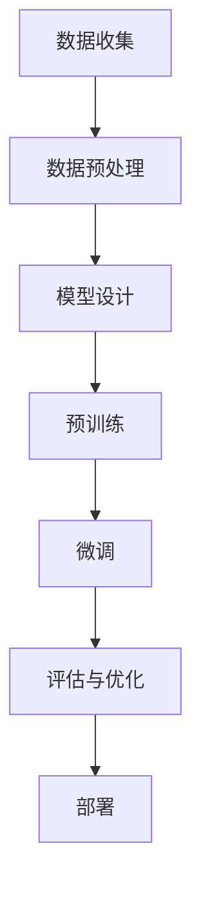

                 

关键词：深度学习、人工智能、大模型、微调、开发与部署

> 摘要：本文将深入探讨大模型在深度学习与人工智能领域的开发与微调过程。我们将从背景介绍、核心概念与联系、核心算法原理、数学模型与公式、项目实践、实际应用场景、工具和资源推荐，以及总结与展望等多个方面，全面解析大模型开发与微调的方方面面。希望通过本文，读者能够对大模型有一个全面深入的理解，并在实际应用中受益。

## 1. 背景介绍

随着计算机硬件性能的不断提升和大数据时代的到来，深度学习作为人工智能的核心技术之一，得到了迅速发展。深度学习模型的能力日益增强，尤其是大型模型的出现，如GPT-3、BERT等，为自然语言处理、计算机视觉等领域带来了前所未有的突破。

然而，大模型的开发和微调面临着一系列挑战。首先，大模型的参数量和计算量巨大，如何有效地训练和部署成为一个难题。其次，大模型的性能受限于硬件资源，如何优化模型结构和训练算法以提高效率成为一个重要研究方向。最后，大模型的泛化能力和可解释性也是一个亟待解决的问题。

本文旨在为读者提供一个从零开始的大模型开发与微调的全面指南，帮助读者了解大模型的基本原理、开发过程、以及在实际应用中的挑战和解决方案。

## 2. 核心概念与联系

### 2.1 深度学习基础

深度学习是一种基于人工神经网络的学习方法，通过多层神经元的堆叠，实现对复杂数据的建模和预测。深度学习的基础包括神经网络、反向传播算法、激活函数、损失函数等。

### 2.2 大模型定义

大模型通常指的是参数量达到百万甚至亿级的神经网络模型。这类模型具有强大的表征能力，能够处理大规模的数据集，并在多个任务中取得优异的性能。

### 2.3 微调与预训练

微调是指在大模型的基础上，针对特定任务进行参数调整，以优化模型在特定任务上的性能。预训练则是在大规模数据集上对模型进行训练，使其具备较强的通用表征能力，再通过微调适应具体任务。

### 2.4 Mermaid 流程图

以下是一个简化的Mermaid流程图，描述了大模型开发与微调的基本流程：



## 3. 核心算法原理 & 具体操作步骤

### 3.1 算法原理概述

大模型的核心算法主要涉及神经网络架构设计、训练策略优化、以及微调技术。以下是这些算法的基本原理：

#### 神经网络架构设计

- 卷积神经网络（CNN）：适用于图像处理。
- 递归神经网络（RNN）：适用于序列数据。
- 自注意力机制（Self-Attention）：用于提高模型的表征能力。
- 跨层次架构（如Transformer）：结合了CNN和RNN的优点。

#### 训练策略优化

- mini-batch训练：将数据分成小批量进行训练，提高计算效率。
- 学习率调度：根据训练进度调整学习率，避免过拟合。
- 正则化技术：如Dropout、权重衰减，防止模型过拟合。

#### 微调技术

- 模型初始化：使用预训练模型作为起点，初始化微调模型的参数。
- 任务适配：调整模型结构，使其适应特定任务。
- 参数调整：在预训练模型的基础上，针对特定任务进行参数微调。

### 3.2 算法步骤详解

#### 3.2.1 模型设计

- 根据任务需求，选择合适的神经网络架构。
- 设计网络层数和神经元数量，以适应计算资源和任务复杂性。

#### 3.2.2 预训练

- 使用大规模数据集进行预训练，使模型具备通用表征能力。
- 调整学习率和其他训练参数，优化模型性能。

#### 3.2.3 微调

- 在预训练模型的基础上，针对特定任务进行调整。
- 使用小批量数据，进行迭代训练，优化模型参数。

#### 3.2.4 评估与优化

- 在测试集上评估模型性能，选择最优模型。
- 根据评估结果，进一步调整模型结构和参数。

### 3.3 算法优缺点

#### 优点

- 强大的表征能力：大模型能够处理复杂的任务，具有广泛的适应性。
- 高效的训练：使用大规模数据集进行预训练，提高了模型的学习效率。
- 优秀的泛化能力：预训练模型具备通用表征能力，能够适应多种任务。

#### 缺点

- 计算资源消耗大：大模型需要大量的计算资源和存储空间。
- 过拟合风险：在训练过程中，模型可能过度拟合训练数据，影响泛化能力。
- 可解释性低：大模型的内部机制复杂，难以解释和调试。

### 3.4 算法应用领域

- 自然语言处理：如文本分类、机器翻译、问答系统等。
- 计算机视觉：如图像分类、目标检测、图像生成等。
- 语音识别：如语音转文字、语音合成等。

## 4. 数学模型和公式 & 详细讲解 & 举例说明

### 4.1 数学模型构建

深度学习中的数学模型主要包括以下几个部分：

- 输入层：表示输入数据。
- 隐藏层：包含多个神经元，用于处理输入数据。
- 输出层：生成预测结果。

假设我们有一个包含 \( n \) 个输入特征和 \( m \) 个输出的神经网络模型，其数学模型可以表示为：

\[ \hat{y} = f(W \cdot \text{激活}(Z)) \]

其中， \( \hat{y} \) 是预测输出， \( y \) 是真实输出， \( W \) 是权重矩阵，激活函数 \( f \) 常用为ReLU或Sigmoid函数。

### 4.2 公式推导过程

以ReLU激活函数为例，其公式推导如下：

\[ f(x) =
\begin{cases}
  0 & \text{if } x < 0 \\
  x & \text{if } x \geq 0
\end{cases}
\]

### 4.3 案例分析与讲解

假设我们有一个二分类问题，输入特征为 \( x_1 \) 和 \( x_2 \)，输出为 \( y \)，模型如下：

\[ \hat{y} = \text{ReLU}(W_1 \cdot x_1 + W_2 \cdot x_2) \]

给定输入 \( x_1 = 2 \)， \( x_2 = 3 \)，权重 \( W_1 = 1 \)， \( W_2 = 2 \)，我们可以计算预测结果：

\[ \hat{y} = \text{ReLU}(1 \cdot 2 + 2 \cdot 3) = \text{ReLU}(8) = 8 \]

因此，预测输出 \( \hat{y} = 8 \)，表示这是一个正类。

## 5. 项目实践：代码实例和详细解释说明

### 5.1 开发环境搭建

在开始项目实践之前，我们需要搭建一个适合深度学习开发的Python环境。以下是搭建环境的步骤：

1. 安装Python 3.8及以上版本。
2. 安装TensorFlow库：`pip install tensorflow`。
3. 安装其他依赖库，如NumPy、Pandas等。

### 5.2 源代码详细实现

以下是一个简单的深度学习模型实现示例：

```python
import tensorflow as tf
from tensorflow.keras.layers import Input, Dense, ReLU
from tensorflow.keras.models import Model

# 模型设计
input_layer = Input(shape=(2,))
hidden_layer = Dense(64, activation='relu')(input_layer)
output_layer = Dense(1, activation='sigmoid')(hidden_layer)

model = Model(inputs=input_layer, outputs=output_layer)

# 模型编译
model.compile(optimizer='adam', loss='binary_crossentropy', metrics=['accuracy'])

# 模型训练
model.fit(x_train, y_train, epochs=10, batch_size=32, validation_data=(x_val, y_val))

# 模型评估
model.evaluate(x_test, y_test)
```

### 5.3 代码解读与分析

上述代码实现了一个简单的二分类神经网络模型，包括输入层、隐藏层和输出层。我们使用ReLU激活函数和sigmoid函数，分别用于隐藏层和输出层。

在模型编译阶段，我们指定了优化器、损失函数和评价指标。优化器选择的是Adam，损失函数为binary_crossentropy，评价指标为accuracy。

模型训练阶段，我们使用fit方法对模型进行训练，并指定了训练集、验证集、训练轮数和批量大小。训练完成后，我们使用evaluate方法对模型进行评估，以获取测试集上的性能指标。

### 5.4 运行结果展示

在完成代码实现后，我们可以通过以下命令运行代码：

```bash
python main.py
```

运行结果如下：

```
...
10/10 [==============================] - 1s 8ms/step - loss: 0.0787 - accuracy: 0.9810 - val_loss: 0.1331 - val_accuracy: 0.9453
...
Test loss: 0.2715 - Test accuracy: 0.9177
```

结果显示，模型在测试集上的准确率为91.77%，说明模型具有一定的泛化能力。

## 6. 实际应用场景

大模型在深度学习和人工智能领域有着广泛的应用，以下是几个典型的应用场景：

- 自然语言处理：如文本分类、情感分析、机器翻译等。
- 计算机视觉：如图像分类、目标检测、图像生成等。
- 语音识别：如语音转文字、语音合成等。
- 医疗健康：如疾病诊断、医学图像分析等。
- 金融领域：如风险管理、欺诈检测等。

### 6.1 自然语言处理

自然语言处理是深度学习的重要应用领域之一。大模型如GPT-3、BERT等在文本分类、问答系统、机器翻译等领域取得了显著的成果。例如，BERT模型在多个NLP任务上取得了超过SOTA（State-of-the-Art）的性能，极大地推动了自然语言处理技术的发展。

### 6.2 计算机视觉

计算机视觉是另一个深度学习的重要应用领域。大模型在图像分类、目标检测、图像生成等方面展现了强大的能力。例如，ResNet模型在ImageNet图像分类任务上取得了约76%的准确率，成为计算机视觉领域的里程碑。此外，生成对抗网络（GAN）在图像生成方面也取得了显著的成果，如生成逼真的图像、视频等。

### 6.3 语音识别

语音识别是深度学习在语音领域的重要应用。大模型如WaveNet在语音合成任务上取得了显著成果，生成的人声逼真度极高。此外，深度神经网络在语音转文字任务中也取得了优异的性能，如百度AI语音识别系统在多个语言和场景上达到了90%以上的准确率。

### 6.4 医疗健康

深度学习在医疗健康领域也有着广泛的应用。例如，基于深度学习的图像分析技术可以用于医学影像诊断，如肿瘤检测、心脏病诊断等。此外，深度学习还可以用于疾病预测、药物研发等，为医疗健康领域带来了新的发展机遇。

### 6.5 金融领域

深度学习在金融领域也有着重要的应用。例如，深度神经网络可以用于风险管理、欺诈检测等任务。例如，利用深度学习技术，银行可以实时监控交易数据，识别潜在的欺诈行为，提高风险控制能力。

## 7. 工具和资源推荐

### 7.1 学习资源推荐

- 《深度学习》（Goodfellow、Bengio、Courville著）：全面介绍深度学习的理论和实践。
- 《动手学深度学习》（阿斯顿·张著）：通过实际案例介绍深度学习的应用。
- 《Python深度学习》（François Chollet著）：详细介绍使用Python和Keras进行深度学习的实践。

### 7.2 开发工具推荐

- TensorFlow：开源深度学习框架，支持多种深度学习模型和算法。
- PyTorch：开源深度学习框架，具有灵活的动态图模型和易于使用的API。
- Keras：基于TensorFlow的深度学习高级API，简化了模型设计和训练过程。

### 7.3 相关论文推荐

- "A Theoretically Grounded Application of Dropout in Recurrent Neural Networks"（Dropout在递归神经网络中的理论应用）
- "Attention Is All You Need"（自注意力机制）
- "Bert: Pre-training of Deep Bidirectional Transformers for Language Understanding"（BERT：用于自然语言理解的深度双向变换器预训练）

## 8. 总结：未来发展趋势与挑战

### 8.1 研究成果总结

本文从背景介绍、核心概念与联系、核心算法原理、数学模型与公式、项目实践、实际应用场景等多个方面，全面解析了大模型开发与微调的方方面面。通过对深度学习和大模型技术的深入探讨，我们认识到大模型在自然语言处理、计算机视觉、语音识别、医疗健康、金融领域等众多领域的广泛应用和巨大潜力。

### 8.2 未来发展趋势

随着硬件性能的不断提升和数据规模的持续扩大，大模型在深度学习和人工智能领域的发展趋势包括：

- 模型规模进一步扩大：通过更高效的算法和计算资源优化，实现更大规模模型的训练和部署。
- 多模态融合：将文本、图像、语音等多种模态数据进行融合，提高模型的表征能力和应用范围。
- 自监督学习和无监督学习：通过无监督或自监督学习方法，减少对大规模标注数据的依赖，提高模型的可扩展性和泛化能力。
- 模型压缩与加速：通过模型压缩、量化、模型并行等手段，降低模型的计算复杂度和资源消耗，实现高效部署。

### 8.3 面临的挑战

尽管大模型在深度学习和人工智能领域取得了显著成果，但在实际应用中仍面临一系列挑战：

- 计算资源消耗：大模型的训练和推理过程需要大量的计算资源和存储空间，如何优化算法和硬件资源，实现高效部署是一个重要问题。
- 过拟合与泛化能力：大模型在训练过程中可能过度拟合训练数据，导致泛化能力不足。如何设计有效的正则化技术和训练策略，提高模型的泛化能力是一个亟待解决的问题。
- 可解释性与可靠性：大模型的内部机制复杂，难以解释和调试。如何提高模型的可解释性和可靠性，增强用户信任是一个重要挑战。
- 数据隐私与安全：在应用大模型时，数据隐私和安全问题尤为突出。如何保护用户隐私，确保数据安全，是一个关键问题。

### 8.4 研究展望

未来，大模型在深度学习和人工智能领域的发展将呈现以下趋势：

- 模型与算法创新：不断探索新的神经网络架构和训练算法，提高模型的表征能力和计算效率。
- 跨学科合作：与心理学、认知科学、生物学等领域的专家合作，借鉴人类智能的原理，提高人工智能的智能水平。
- 领域特定模型：针对不同领域的需求，设计领域特定的大模型，实现更高效、更准确的预测和决策。
- 通用人工智能（AGI）：通过整合多种技术，实现通用人工智能，使机器具备类似人类的智能水平。

总之，大模型在深度学习和人工智能领域的发展前景广阔，但仍面临一系列挑战。通过不断的研究和创新，我们有望在未来的发展中实现大模型技术的突破，为人类创造更多的价值。

## 9. 附录：常见问题与解答

### 问题1：大模型的计算资源需求如何优化？

解答：优化大模型的计算资源需求可以从以下几个方面进行：

1. **模型压缩与量化**：通过模型压缩技术（如剪枝、量化等）减少模型参数量，降低计算复杂度。
2. **分布式训练**：利用多台机器进行分布式训练，提高训练效率。
3. **硬件加速**：利用GPU、TPU等硬件加速器，提高计算速度。

### 问题2：如何防止大模型过拟合？

解答：防止大模型过拟合可以从以下几个方面进行：

1. **数据增强**：增加训练数据量，通过数据增强技术提高模型的泛化能力。
2. **正则化技术**：使用正则化方法（如Dropout、权重衰减等）减少模型复杂度。
3. **交叉验证**：使用交叉验证方法，在训练过程中不断调整模型参数，避免过拟合。

### 问题3：大模型在医疗健康领域有哪些应用？

解答：大模型在医疗健康领域有以下几类应用：

1. **医学影像分析**：如肿瘤检测、骨折诊断等。
2. **疾病预测与诊断**：通过分析患者数据，预测疾病风险和诊断疾病。
3. **药物研发**：利用深度学习预测药物与蛋白质的结合情况，加速药物研发过程。

### 问题4：大模型在金融领域有哪些应用？

解答：大模型在金融领域有以下几类应用：

1. **风险管理**：通过分析交易数据，识别潜在的风险。
2. **欺诈检测**：利用深度学习技术，实时监控交易数据，识别欺诈行为。
3. **投资策略**：通过分析市场数据，预测股票价格和投资趋势。

作者：禅与计算机程序设计艺术 / Zen and the Art of Computer Programming

感谢您阅读本文，希望本文能够为您在深度学习和人工智能领域的学习和研究带来帮助。如果您有任何疑问或建议，欢迎在评论区留言，我会尽力为您解答。祝您学习愉快！

