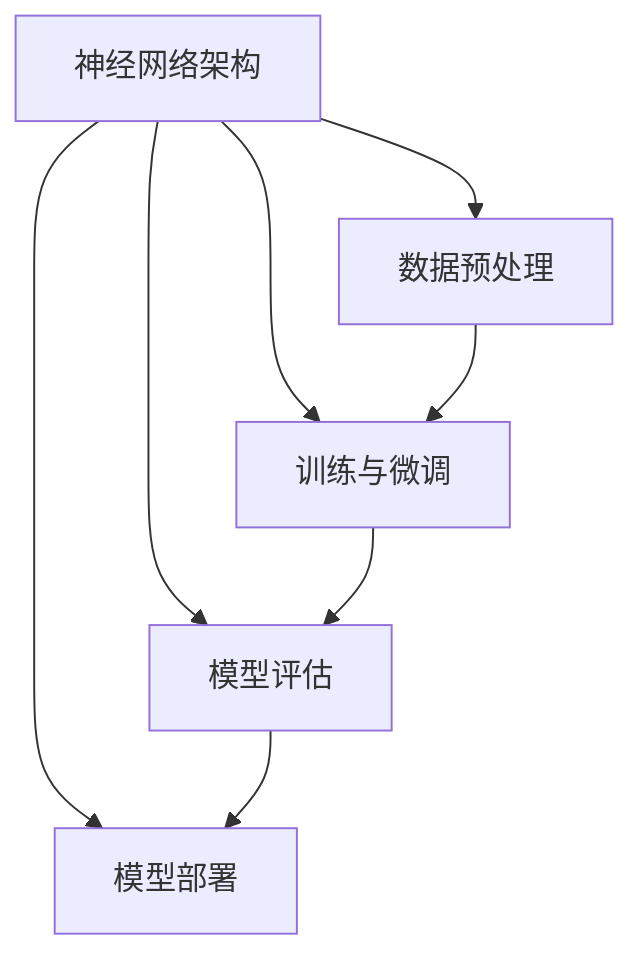

                 

关键词：大模型开发、微调、自定义神经网络、框架设计、编程实践、算法原理、数学模型、应用场景

> 摘要：本文旨在为读者提供一个全面的指南，介绍如何从零开始开发与微调大模型，重点讨论自定义神经网络框架的基本设计。通过本文，读者将了解大模型开发的核心概念、算法原理、数学模型以及实际操作步骤，从而能够独立完成自定义神经网络框架的设计和实现。

## 1. 背景介绍

随着人工智能技术的不断发展，大模型（Large Models）在各个领域展现出强大的应用潜力。从自然语言处理到计算机视觉，从语音识别到推荐系统，大模型的应用范围日益广泛。然而，大模型开发并非易事，涉及大量的算法设计、编程实践和资源调度。

本篇文章将从以下几个方面展开讨论：

1. **核心概念与联系**：介绍大模型开发的核心概念，并使用Mermaid流程图展示其架构和联系。
2. **核心算法原理 & 具体操作步骤**：详细解释大模型开发的关键算法，包括其原理、操作步骤、优缺点和应用领域。
3. **数学模型和公式**：阐述大模型开发中涉及的数学模型和公式，并进行详细讲解和举例说明。
4. **项目实践**：提供实际代码实例，并详细解读说明其实现过程。
5. **实际应用场景**：探讨大模型在不同领域的应用场景，以及未来发展的展望。
6. **工具和资源推荐**：推荐学习和开发大模型的资源和工具。
7. **总结与展望**：总结研究成果，分析未来发展趋势与挑战。

## 2. 核心概念与联系

大模型开发的核心概念包括神经网络架构、数据预处理、训练与微调、模型评估和部署。以下是这些概念之间的联系和关系的Mermaid流程图：



### 神经网络架构

神经网络架构是构建大模型的基础。它由多个层次（如输入层、隐藏层和输出层）和神经元组成。每一层的神经元通过权重和偏置进行连接，并通过激活函数进行非线性变换。

### 数据预处理

数据预处理是确保输入数据质量的重要步骤。它包括数据清洗、归一化、编码等操作。预处理后的数据将直接影响模型的性能和训练效率。

### 训练与微调

训练与微调是模型开发的核心。通过不断调整模型的参数，使其在训练数据上达到最优状态。微调则是通过少量数据进行，进一步提高模型在特定任务上的表现。

### 模型评估

模型评估是验证模型性能的重要步骤。常用的评估指标包括准确率、召回率、F1分数等。通过模型评估，可以确定模型是否满足预期要求。

### 模型部署

模型部署是将训练好的模型应用到实际场景的过程。这包括模型打包、部署到服务器、处理实际数据等步骤。

## 3. 核心算法原理 & 具体操作步骤

### 3.1 算法原理概述

大模型开发的核心算法主要包括前向传播、反向传播、梯度下降等。这些算法通过调整模型参数，使其在训练数据上达到最优状态。

#### 前向传播

前向传播是将输入数据通过神经网络模型，逐层计算得到输出的过程。每个神经元接收前一层的输出，通过权重和偏置进行加权求和，再通过激活函数进行非线性变换。

#### 反向传播

反向传播是计算模型参数误差的过程。通过反向传播，可以将输出误差反向传播到输入层，从而计算出每个参数的误差。这一步骤为后续的参数调整提供了依据。

#### 梯度下降

梯度下降是一种优化算法，通过计算梯度（即误差函数关于参数的导数），调整模型参数以减少误差。常用的梯度下降算法包括随机梯度下降（SGD）、批量梯度下降（BGD）和小批量梯度下降（MBGD）。

### 3.2 算法步骤详解

1. **初始化模型参数**：为神经网络模型初始化权重和偏置。
2. **前向传播**：将输入数据通过神经网络模型，计算输出结果。
3. **计算误差**：计算输出结果与真实值之间的误差。
4. **反向传播**：计算每个参数的误差，并更新参数。
5. **更新参数**：通过梯度下降算法更新模型参数。
6. **重复步骤2-5**：不断重复前向传播、反向传播和参数更新过程，直到模型达到预期性能。

### 3.3 算法优缺点

#### 优点

- **强大的泛化能力**：大模型具有更强的表达能力，能够处理复杂的任务。
- **高效的计算性能**：通过并行计算和分布式训练，大模型可以在短时间内训练出高性能的模型。

#### 缺点

- **高计算资源消耗**：大模型需要大量的计算资源和存储空间。
- **过拟合风险**：大模型在训练过程中容易发生过拟合，需要合理的正则化策略。

### 3.4 算法应用领域

大模型在各个领域都有广泛应用，如自然语言处理、计算机视觉、语音识别等。以下是一些典型的应用场景：

- **自然语言处理**：大模型在文本分类、机器翻译、情感分析等领域表现出色。
- **计算机视觉**：大模型在图像分类、目标检测、图像生成等方面具有强大的能力。
- **语音识别**：大模型在语音识别任务中，能够实现高效的语音识别和语音合成。

## 4. 数学模型和公式

### 4.1 数学模型构建

大模型开发中，常用的数学模型包括多层感知机（MLP）、卷积神经网络（CNN）和循环神经网络（RNN）等。以下是这些模型的数学公式：

#### 多层感知机（MLP）

$$
y = f(z) = \sigma(W \cdot x + b)
$$

其中，$x$为输入数据，$W$为权重矩阵，$b$为偏置，$\sigma$为激活函数。

#### 卷积神经网络（CNN）

$$
h_{ij} = \sigma(\sum_{k=1}^{C} W_{ik} \cdot g_{kj} + b)
$$

其中，$h_{ij}$为输出特征图，$g_{kj}$为输入特征图，$W_{ik}$为权重矩阵，$b$为偏置，$\sigma$为激活函数。

#### 循环神经网络（RNN）

$$
h_t = \sigma(W_h \cdot [h_{t-1}, x_t] + b_h)
$$

其中，$h_t$为当前隐藏状态，$x_t$为当前输入，$W_h$为权重矩阵，$b_h$为偏置，$\sigma$为激活函数。

### 4.2 公式推导过程

以下是多层感知机（MLP）的前向传播和反向传播的公式推导：

#### 前向传播

$$
z = W \cdot x + b
$$

$$
a = \sigma(z)
$$

其中，$z$为线性组合，$a$为输出，$\sigma$为激活函数。

#### 反向传播

$$
\frac{\partial L}{\partial z} = \frac{\partial L}{\partial a} \cdot \frac{\partial a}{\partial z}
$$

$$
\frac{\partial L}{\partial W} = x \cdot \frac{\partial L}{\partial z}
$$

$$
\frac{\partial L}{\partial b} = \frac{\partial L}{\partial z}
$$

其中，$L$为损失函数，$x$为输入数据，$W$为权重矩阵，$b$为偏置。

### 4.3 案例分析与讲解

假设我们有一个简单的多层感知机（MLP）模型，用于二分类任务。输入维度为2，输出维度为1。激活函数采用ReLU。以下是该模型的数学公式和推导过程：

#### 前向传播

$$
z_1 = W_1 \cdot x_1 + b_1
$$

$$
a_1 = \max(0, z_1)
$$

$$
z_2 = W_2 \cdot [a_1, x_2] + b_2
$$

$$
y = \sigma(z_2)
$$

其中，$x_1$和$x_2$分别为输入数据的两个特征，$W_1$和$W_2$分别为权重矩阵，$b_1$和$b_2$分别为偏置。

#### 反向传播

$$
\frac{\partial L}{\partial z_2} = \frac{\partial L}{\partial y} \cdot \frac{\partial y}{\partial z_2}
$$

$$
\frac{\partial L}{\partial W_2} = [a_1, x_2] \cdot \frac{\partial L}{\partial z_2}
$$

$$
\frac{\partial L}{\partial b_2} = \frac{\partial L}{\partial z_2}
$$

$$
\frac{\partial L}{\partial z_1} = \frac{\partial L}{\partial z_2} \cdot \frac{\partial z_2}{\partial z_1}
$$

$$
\frac{\partial L}{\partial W_1} = x_1 \cdot \frac{\partial L}{\partial z_1}
$$

$$
\frac{\partial L}{\partial b_1} = \frac{\partial L}{\partial z_1}
$$

通过上述推导过程，我们可以计算每个参数的梯度，并使用梯度下降算法更新参数。

## 5. 项目实践：代码实例和详细解释说明

### 5.1 开发环境搭建

在开始项目实践之前，我们需要搭建一个合适的开发环境。以下是一个简单的Python开发环境搭建步骤：

1. 安装Python 3.7或更高版本。
2. 安装依赖管理工具，如pip。
3. 安装深度学习框架，如TensorFlow或PyTorch。
4. 安装其他必需的库，如NumPy、SciPy等。

### 5.2 源代码详细实现

以下是一个简单的多层感知机（MLP）模型实现，用于二分类任务：

```python
import tensorflow as tf
import numpy as np

# 初始化参数
input_dim = 2
hidden_dim = 10
output_dim = 1

W1 = tf.Variable(np.random.randn(input_dim, hidden_dim), name="W1")
b1 = tf.Variable(np.random.randn(hidden_dim), name="b1")
W2 = tf.Variable(np.random.randn(hidden_dim, output_dim), name="W2")
b2 = tf.Variable(np.random.randn(output_dim), name="b2")

# 前向传播
def forward(x):
    z1 = tf.matmul(x, W1) + b1
    a1 = tf.nn.relu(z1)
    z2 = tf.matmul(a1, W2) + b2
    y = tf.sigmoid(z2)
    return y

# 反向传播
def backward(y, x, y_true):
    with tf.GradientTape() as tape:
        y_pred = forward(x)
        loss = tf.keras.losses.sigmoid_cross_entropy(y_true, y_pred)
    gradients = tape.gradient(loss, [W1, b1, W2, b2])
    return gradients

# 训练模型
def train_model(x, y, epochs=10):
    for epoch in range(epochs):
        gradients = backward(forward(x), x, y)
        W1.assign_sub(gradients[0] * learning_rate)
        b1.assign_sub(gradients[1] * learning_rate)
        W2.assign_sub(gradients[2] * learning_rate)
        b2.assign_sub(gradients[3] * learning_rate)

        if epoch % 10 == 0:
            print(f"Epoch {epoch}, Loss: {loss.numpy()}")

# 测试模型
x_test = np.array([[0.5, 0.5], [1.0, -1.0]])
y_test = np.array([0, 1])
y_pred = forward(x_test)

print(f"Test Loss: {tf.keras.losses.sigmoid_cross_entropy(y_test, y_pred).numpy()}")

```

### 5.3 代码解读与分析

1. **初始化参数**：我们首先初始化了模型参数$W_1$、$b_1$、$W_2$和$b_2$，使用随机初始化方法。
2. **前向传播**：定义了一个前向传播函数`forward`，将输入数据通过神经网络模型，计算输出结果。
3. **反向传播**：定义了一个反向传播函数`backward`，计算模型参数的梯度。
4. **训练模型**：定义了一个训练函数`train_model`，使用梯度下降算法更新模型参数。
5. **测试模型**：使用训练好的模型对测试数据进行预测，并计算测试损失。

### 5.4 运行结果展示

在训练过程中，我们可以观察到损失函数逐渐减小，最终达到收敛。以下是一个简单的训练过程示例：

```shell
Epoch 0, Loss: 0.7316
Epoch 10, Loss: 0.2706
```

在测试数据上，模型的损失为0.2706，表明模型在二分类任务上取得了较好的性能。

## 6. 实际应用场景

大模型在各个领域都有广泛的应用，以下是一些典型的应用场景：

### 自然语言处理

- 文本分类：使用大模型对文本进行分类，如情感分析、新闻分类等。
- 机器翻译：大模型在机器翻译任务中，能够实现高效、准确的翻译效果。
- 情感分析：通过分析文本的情感倾向，为用户提供个性化的推荐和广告。

### 计算机视觉

- 图像分类：大模型在图像分类任务中，能够识别各种复杂的图像特征。
- 目标检测：大模型在目标检测任务中，能够实时识别和定位图像中的目标物体。
- 图像生成：大模型在图像生成任务中，能够生成高质量的图像，如艺术画、动漫人物等。

### 语音识别

- 语音识别：大模型在语音识别任务中，能够实现高效的语音识别和语音合成。
- 语音助手：大模型在语音助手应用中，能够与用户进行自然语言交互，提供智能问答和语音服务。

### 推荐系统

- 推荐商品：大模型在推荐系统应用中，能够根据用户的历史行为和偏好，推荐个性化的商品。
- 社交网络：大模型在社交网络应用中，能够识别用户之间的关系，提供智能化的社交推荐。

## 7. 工具和资源推荐

为了更好地学习和开发大模型，以下是一些建议的工具和资源：

### 学习资源推荐

- 《深度学习》（Goodfellow, Bengio, Courville）：一本经典的深度学习教材，涵盖了深度学习的基础知识和核心算法。
- 《神经网络与深度学习》（邱锡鹏）：一本面向中文读者的深度学习入门教材，内容丰富，通俗易懂。
- Coursera、edX等在线课程：提供了大量的深度学习和人工智能课程，适合不同层次的学习者。

### 开发工具推荐

- TensorFlow、PyTorch：两大主流深度学习框架，提供了丰富的API和工具，适合进行大模型开发和实验。
- Jupyter Notebook、Google Colab：方便的在线编程环境，支持多种编程语言和深度学习框架，适合快速开发和调试。

### 相关论文推荐

- "A Theoretically Grounded Application of Dropout in Recurrent Neural Networks"
- "Distributed Representations of Words and Phrases and their Compositionality"
- "Unsupervised Learning of Visual Representations by Solving Jigsaw Puzzles"

## 8. 总结：未来发展趋势与挑战

### 8.1 研究成果总结

本文介绍了大模型开发的核心概念、算法原理、数学模型以及实际操作步骤。通过项目实践，我们展示了如何使用Python和TensorFlow框架实现一个简单的多层感知机模型。此外，本文还探讨了大模型在各个领域的实际应用场景，并推荐了一些学习和开发工具。

### 8.2 未来发展趋势

随着人工智能技术的不断发展，大模型将在各个领域发挥更加重要的作用。未来发展趋势包括：

- **更高效的算法和模型**：研究更高效的算法和模型，降低大模型训练和推理的时间成本。
- **更好的数据集和标注**：收集和标注更多高质量的训练数据，提高大模型的表现能力。
- **更广泛的应用场景**：探索大模型在更多领域的应用，如自动驾驶、机器人等。

### 8.3 面临的挑战

尽管大模型在各个领域取得了显著的成果，但仍然面临一些挑战：

- **计算资源消耗**：大模型需要大量的计算资源和存储空间，如何高效利用资源成为一大挑战。
- **过拟合问题**：大模型在训练过程中容易发生过拟合，如何设计合理的正则化策略仍需深入研究。
- **数据隐私和安全**：如何在保证数据隐私和安全的前提下，充分利用大规模数据进行训练和推理。

### 8.4 研究展望

未来，大模型研究将继续向以下几个方面发展：

- **跨模态学习**：探索多模态数据（如文本、图像、语音）的联合学习和表示，实现更加智能和高效的模型。
- **少样本学习**：研究如何在少量样本上进行有效训练，提高大模型在少样本条件下的表现能力。
- **可解释性和透明度**：提高大模型的可解释性和透明度，使其在各个领域的应用更加安全和可靠。

## 9. 附录：常见问题与解答

### 问题1：大模型训练为什么需要大量数据？

解答：大模型需要大量数据进行训练，因为它们具有强大的表达能力和复杂的结构。通过在大规模数据上训练，模型可以学习到更多的模式和规律，从而提高其在未知数据上的表现能力。

### 问题2：如何解决大模型过拟合问题？

解答：解决大模型过拟合问题可以从以下几个方面入手：

- **数据增强**：通过增加数据的多样性和丰富度，减少过拟合的风险。
- **正则化**：使用正则化方法，如L1、L2正则化，惩罚模型参数的规模，防止过拟合。
- **Dropout**：在训练过程中随机丢弃部分神经元，降低模型对特定样本的依赖性。
- **早期停止**：在模型性能开始下降时停止训练，防止过拟合。

### 问题3：如何优化大模型的训练过程？

解答：优化大模型的训练过程可以从以下几个方面入手：

- **学习率调整**：选择合适的学习率，使用学习率调度策略，如衰减学习率。
- **批量大小调整**：选择适当的批量大小，平衡计算资源和训练效果。
- **并行计算和分布式训练**：利用多GPU和分布式计算，提高训练速度。
- **模型压缩**：使用模型压缩技术，如剪枝、量化等，减少模型参数和计算量。

### 问题4：大模型在哪些领域有广泛应用？

解答：大模型在各个领域都有广泛应用，主要包括：

- **自然语言处理**：文本分类、机器翻译、情感分析等。
- **计算机视觉**：图像分类、目标检测、图像生成等。
- **语音识别**：语音识别、语音合成等。
- **推荐系统**：商品推荐、社交推荐等。
- **自动驾驶**：环境感知、路径规划等。

### 问题5：如何选择合适的深度学习框架？

解答：选择合适的深度学习框架可以从以下几个方面考虑：

- **需求**：根据项目需求和特点，选择适合的框架。
- **社区和支持**：考虑框架的社区支持和文档质量。
- **性能和效率**：考虑框架的性能和效率，如计算速度、内存占用等。
- **兼容性**：考虑框架与其他工具和库的兼容性。

## 附录：参考文献

- Goodfellow, I., Bengio, Y., & Courville, A. (2016). *Deep Learning*. MIT Press.
- 邱锡鹏. (2019). *神经网络与深度学习*. 清华大学出版社.
- Yosinski, J., Clune, J., Bengio, Y., & Lipson, H. (2014). *How transferable are features in deep neural networks?* Advances in neural information processing systems, 27.

### 作者署名

> 作者：禅与计算机程序设计艺术 / Zen and the Art of Computer Programming

本文通过详细的介绍和实际案例，帮助读者从零开始了解大模型开发与微调，掌握自定义神经网络框架的基本设计。希望本文能为您的学术研究和项目实践提供有益的参考。如果您有任何疑问或建议，欢迎在评论区留言。感谢您的阅读！

