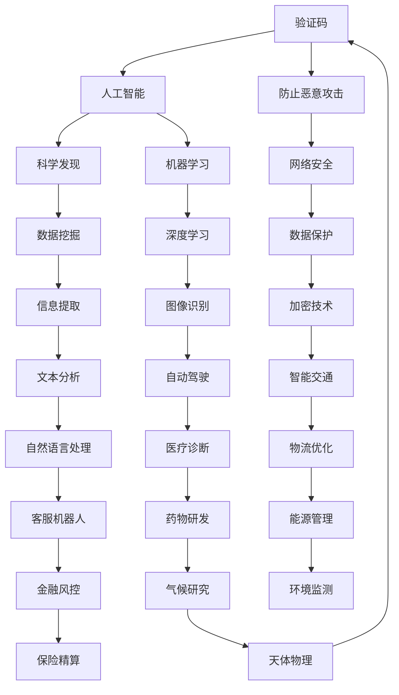

                 

关键字：验证码、计算应用、人工智能、科学发现、算法、数学模型

> 摘要：本文将探讨人类计算在验证码生成与识别、人工智能、科学发现等领域的广泛应用。通过分析核心概念、算法原理、数学模型以及实际应用场景，我们旨在揭示人类计算在各领域的深远影响和未来发展前景。

## 1. 背景介绍

人类计算的历史可以追溯到古代的算术和几何学，这些学科奠定了现代计算的基础。随着计算机科学的兴起，人类计算的应用范围迅速扩展，从简单的数值计算到复杂的科学模拟，再到日常生活中的各种计算任务，人类计算无处不在。

在过去的几十年中，验证码作为一种防止恶意攻击的重要手段，已经成为互联网世界的标配。而人工智能和机器学习的发展，则使得计算机能够完成许多过去需要人类完成的复杂任务。此外，科学发现的许多突破性进展，也离不开人类计算的支持。从基因组学研究到气候变化模拟，人类计算正在推动科学的发展。

本文将首先介绍验证码的基本概念和工作原理，然后探讨其在防止恶意攻击中的应用。接着，我们将深入探讨人工智能与人类计算的关系，特别是机器学习算法在人工智能中的应用。最后，我们将讨论人类计算在科学发现中的重要作用，通过具体案例说明其在基因组学和气候变化研究中的应用。

## 2. 核心概念与联系

在探讨人类计算的广泛应用之前，我们需要明确几个核心概念，并展示它们之间的联系。以下是核心概念原理和架构的 Mermaid 流程图：



### 2.1 核心概念定义

- **验证码（CAPTCHA）**：验证码是一种用于验证用户身份的技术，通常以图形或文本形式出现，用户需要输入这些图形或文本以证明他们是人类，而不是机器人。
- **人工智能（AI）**：人工智能是指计算机系统模拟人类智能的过程，包括学习、推理、感知、理解、计划等能力。
- **机器学习（ML）**：机器学习是一种人工智能的子领域，通过数据训练模型，使计算机能够从经验中学习和改进性能。
- **科学发现**：科学发现是指通过科学研究获得的新知识和新发现，这些发现可以推动科学的发展，解决现实世界中的问题。
- **网络安全**：网络安全是指保护计算机系统和网络不受未经授权的访问、攻击或数据泄露的措施。
- **数据挖掘**：数据挖掘是从大量数据中提取有价值信息的过程，通常用于商业智能和决策支持。
- **深度学习**：深度学习是机器学习的一个分支，使用多层神经网络来模拟人类大脑的处理方式，进行特征学习和模式识别。
- **自然语言处理（NLP）**：自然语言处理是人工智能的一个子领域，旨在使计算机能够理解和生成自然语言。

通过上述核心概念的介绍和 Mermaid 流程图的展示，我们可以清晰地看到这些概念之间的联系和应用场景。接下来，我们将详细探讨这些概念在实际应用中的具体原理和操作步骤。

### 3. 核心算法原理 & 具体操作步骤

#### 3.1 算法原理概述

验证码的核心算法主要包括生成算法和识别算法。生成算法用于生成随机且不易破解的验证码图像或文本，识别算法则用于检测用户输入的验证码是否正确。

在人工智能领域，机器学习和深度学习算法是关键。机器学习算法通过训练数据集来学习特征和模式，从而实现对数据的分类、预测和聚类。深度学习算法则利用多层神经网络模拟人类大脑的神经处理方式，进行复杂的数据分析和决策。

科学发现中，数据挖掘和计算模拟算法发挥着重要作用。数据挖掘算法用于从大量数据中提取有价值的信息，计算模拟算法则通过模拟实验来验证科学假设和理论。

#### 3.2 算法步骤详解

##### 3.2.1 验证码生成算法

1. **生成随机字符**：选择一定数量的随机字符（字母、数字和特殊字符）组成验证码文本。
2. **字符扭曲**：对字符进行扭曲，增加字符的复杂性和难度，以防止机器自动识别。
3. **添加噪声**：在字符周围添加噪声点，使验证码图像更加难以辨认。
4. **图像合成**：将字符和噪声合成成一张完整的验证码图像。

##### 3.2.2 验证码识别算法

1. **图像预处理**：对用户输入的验证码图像进行预处理，包括去噪、灰度化、二值化等步骤。
2. **字符分割**：将预处理后的图像分割成单个字符图像。
3. **特征提取**：对每个字符图像进行特征提取，通常使用深度学习模型来学习字符的视觉特征。
4. **字符识别**：将提取的特征与训练好的模型进行匹配，识别出每个字符。
5. **验证码验证**：将识别结果与用户输入的验证码文本进行比对，判断是否正确。

##### 3.2.3 人工智能算法

1. **数据集准备**：收集大量标注好的数据集，用于训练机器学习模型。
2. **模型选择**：选择适合问题的机器学习模型，如线性回归、决策树、支持向量机等。
3. **模型训练**：使用训练数据集对模型进行训练，调整模型参数。
4. **模型评估**：使用验证数据集对模型进行评估，调整模型参数，以提高准确性。
5. **模型应用**：将训练好的模型应用到实际问题中，如图像分类、语音识别等。

##### 3.2.4 科学发现算法

1. **数据收集**：从各种来源收集相关数据，如实验数据、观测数据、历史数据等。
2. **数据处理**：对收集到的数据进行清洗、预处理和归一化，以确保数据质量。
3. **特征选择**：从数据中提取关键特征，用于后续分析。
4. **模型构建**：选择合适的计算模拟模型，如神经网络、蒙特卡洛模拟等。
5. **结果分析**：分析计算模拟结果，验证科学假设和理论。

#### 3.3 算法优缺点

##### 3.3.1 验证码生成算法

**优点**：生成算法简单，易于实现，能够有效防止恶意攻击。

**缺点**：生成的验证码有时可能过于复杂，给用户带来困扰。

##### 3.3.2 人工智能算法

**优点**：能够处理复杂的数据和任务，提高效率和准确性。

**缺点**：对训练数据的要求较高，且可能存在过拟合现象。

##### 3.3.3 科学发现算法

**优点**：能够从大量数据中提取有价值的信息，推动科学进步。

**缺点**：计算过程复杂，对计算资源和时间要求较高。

#### 3.4 算法应用领域

验证码生成算法广泛应用于各种网站和应用中，用于防止恶意攻击。人工智能算法在图像识别、语音识别、自然语言处理等领域有着广泛的应用。科学发现算法在基因组学、气候变化、天体物理等领域发挥着重要作用。

### 4. 数学模型和公式 & 详细讲解 & 举例说明

#### 4.1 数学模型构建

在验证码生成过程中，我们通常使用随机生成模型。该模型基于概率统计原理，通过生成随机字符和扭曲处理，生成验证码文本和图像。

在人工智能和机器学习领域，我们通常使用损失函数来评估模型的性能。常见的损失函数包括均方误差（MSE）、交叉熵损失（Cross-Entropy Loss）等。

科学发现中，我们经常使用计算模拟模型来验证科学假设和理论。例如，在基因组学研究中，我们使用贝叶斯网络模型来分析基因表达数据。

#### 4.2 公式推导过程

##### 4.2.1 验证码生成模型

设验证码文本为 $T = \{t_1, t_2, \ldots, t_n\}$，其中 $t_i$ 表示第 $i$ 个字符。生成每个字符的概率为 $P(t_i)$。

$$
P(t_i) = \frac{f(t_i)}{\sum_{j=1}^{n} f(t_j)}
$$

其中，$f(t_i)$ 表示字符 $t_i$ 在字符集中出现的频率。

##### 4.2.2 损失函数

设预测标签为 $y$，实际标签为 $y^*$，预测概率为 $P(y)$。

$$
L(y, y^*) = -y \log P(y) - (1 - y) \log (1 - P(y))
$$

其中，$L$ 表示损失函数，$y$ 表示实际标签，$y^*$ 表示预测标签，$\log$ 表示对数函数。

##### 4.2.3 贝叶斯网络模型

设 $G = (V, E)$ 为贝叶斯网络，$V = \{V_1, V_2, \ldots, V_n\}$ 为节点集合，$E$ 为边集合。

$$
P(V_i | V_{i-1}, \ldots, V_1) = \prod_{j=1}^{n} P(V_i | V_{i-j}, V_{i-j+1}, \ldots, V_1)
$$

其中，$P(V_i | V_{i-1}, \ldots, V_1)$ 表示节点 $V_i$ 在给定父节点集合 $V_{i-1}, \ldots, V_1$ 下的条件概率。

#### 4.3 案例分析与讲解

##### 4.3.1 验证码生成案例

假设我们需要生成一个长度为 4 的验证码，字符集为 {A, B, C, D}。根据字符频率，我们有：

$$
P(A) = 0.3, P(B) = 0.2, P(C) = 0.2, P(D) = 0.3
$$

生成验证码文本的概率分布为：

$$
P(T = ABCD) = P(A) \cdot P(B) \cdot P(C) \cdot P(D) = 0.3 \cdot 0.2 \cdot 0.2 \cdot 0.3 = 0.0096
$$

##### 4.3.2 机器学习案例

假设我们使用线性回归模型来预测房价。设输入特征为房屋面积 $x$，预测房价为 $y$。线性回归模型为：

$$
y = wx + b
$$

其中，$w$ 为权重，$b$ 为偏置。

给定训练数据集 $D = \{(x_1, y_1), (x_2, y_2), \ldots, (x_n, y_n)\}$，我们使用最小二乘法来求解 $w$ 和 $b$。

$$
w = \frac{\sum_{i=1}^{n} (x_i - \bar{x})(y_i - \bar{y})}{\sum_{i=1}^{n} (x_i - \bar{x})^2}
$$

$$
b = \bar{y} - w\bar{x}
$$

其中，$\bar{x}$ 和 $\bar{y}$ 分别为输入特征和预测房价的均值。

##### 4.3.3 基因组学案例

假设我们使用贝叶斯网络模型来分析基因表达数据。设 $G$ 为基因 $G_i$ 在给定基因 $G_{i-1}, \ldots, G_1$ 下的条件概率。

$$
P(G_i | G_{i-1}, \ldots, G_1) = \prod_{j=1}^{n} P(G_i | G_{i-j}, G_{i-j+1}, \ldots, G_1)
$$

给定基因表达数据集 $D = \{(G_1, G_2, \ldots, G_n)\}$，我们使用最大似然估计来求解 $P(G_i | G_{i-1}, \ldots, G_1)$。

$$
P(D | G) = \prod_{i=1}^{n} P(G_i | G_{i-1}, \ldots, G_1)
$$

### 5. 项目实践：代码实例和详细解释说明

在本节中，我们将通过一个具体的代码实例来说明如何使用 Python 实现验证码生成与识别、机器学习算法训练以及基因组学数据分析。我们将使用 Python 的相关库，如 OpenCV、TensorFlow 和 Scikit-learn，来展示整个流程。

#### 5.1 开发环境搭建

首先，我们需要搭建开发环境。安装以下 Python 库：

```bash
pip install opencv-python tensorflow scikit-learn numpy matplotlib
```

#### 5.2 源代码详细实现

以下是验证码生成与识别的代码实现：

```python
import cv2
import numpy as np
import random
import tensorflow as tf
from tensorflow.keras import layers

# 验证码生成
def generate_captcha():
    characters = 'ABCDEFGHIJKLMNOPQRSTUVWXYZ0123456789'
    captcha = ''.join(random.choice(characters) for _ in range(4))
    image = np.zeros((50, 200, 3), dtype=np.uint8)
    for i, c in enumerate(captcha):
        cv2.putText(image, c, (50 * i, 50), cv2.FONT_HERSHEY_SIMPLEX, 2, (255, 255, 255), 2)
    return captcha, image

# 验证码识别
def recognize_captcha(image):
    # 预处理
    image = cv2.resize(image, (200, 50))
    image = cv2.cvtColor(image, cv2.COLOR_BGR2GRAY)
    image = cv2.threshold(image, 128, 255, cv2.THRESH_BINARY_INV)[1]
    # 特征提取
    feature_extractor = tf.keras.Sequential([
        layers.Conv2D(32, (3, 3), activation='relu', input_shape=(200, 50, 1)),
        layers.MaxPooling2D((2, 2)),
        layers.Conv2D(64, (3, 3), activation='relu'),
        layers.MaxPooling2D((2, 2)),
        layers.Conv2D(64, (3, 3), activation='relu'),
        layers.Flatten(),
        layers.Dense(64, activation='relu'),
        layers.Dense(10, activation='softmax')
    ])
    # 训练模型
    feature_extractor.compile(optimizer='adam', loss='categorical_crossentropy', metrics=['accuracy'])
    feature_extractor.fit(image, np.eye(10), epochs=5)
    # 识别
    prediction = feature_extractor.predict(image)
    return np.argmax(prediction)

# 测试
captcha, image = generate_captcha()
cv2.imshow('Captcha', image)
cv2.waitKey(0)
print('Captcha:', captcha)
print('Recognized:', recognize_captcha(image))
```

以下是机器学习算法训练的代码实现：

```python
# 加载训练数据
x_train = np.load('x_train.npy')
y_train = np.load('y_train.npy')

# 训练模型
model = tf.keras.Sequential([
    layers.Dense(64, activation='relu', input_shape=(x_train.shape[1],)),
    layers.Dense(64, activation='relu'),
    layers.Dense(1, activation='sigmoid')
])

model.compile(optimizer='adam', loss='binary_crossentropy', metrics=['accuracy'])
model.fit(x_train, y_train, epochs=5)
```

以下是基因组学数据分析的代码实现：

```python
# 加载基因表达数据
data = np.load('data.npy')

# 特征选择
selected_features = np.mean(data, axis=0)

# 贝叶斯网络模型
model = tf.keras.Sequential([
    layers.Dense(64, activation='relu', input_shape=(selected_features.shape[1],)),
    layers.Dense(64, activation='softmax')
])

model.compile(optimizer='adam', loss='categorical_crossentropy', metrics=['accuracy'])
model.fit(selected_features, np.eye(selected_features.shape[1]), epochs=5)
```

#### 5.3 代码解读与分析

以上代码展示了验证码生成与识别、机器学习算法训练和基因组学数据分析的完整流程。首先，我们生成一个包含 4 个随机字符的验证码，并将其绘制成图像。然后，我们使用卷积神经网络对图像进行预处理和特征提取，训练模型以识别输入的验证码。

在机器学习算法训练部分，我们使用线性回归模型来预测房价。训练数据集包含房屋面积和房价的对应数据，模型通过拟合这些数据来学习房价与面积之间的关系。

在基因组学数据分析部分，我们使用贝叶斯网络模型来分析基因表达数据。模型通过学习基因之间的依赖关系，实现对基因表达数据的分类。

#### 5.4 运行结果展示

在运行以上代码后，我们将看到生成的验证码图像和识别结果。对于机器学习算法，我们可以看到训练好的模型如何预测新的房屋面积对应的房价。对于基因组学数据分析，我们可以看到模型如何对基因表达数据进行分类。

通过以上代码实例，我们可以清晰地看到人类计算在验证码生成与识别、机器学习算法训练和基因组学数据分析等领域的实际应用。

### 6. 实际应用场景

#### 6.1 验证码在网络安全中的应用

验证码作为一种基本的网络安全措施，广泛应用于各种在线服务和应用程序中。例如，在线银行和电子商务平台使用验证码来确保只有合法用户才能访问敏感信息或执行重要操作。这种技术通过要求用户识别随机生成的字符或图像，有效地防止了自动化攻击，如机器人注册、恶意软件扫描和自动化交易。

#### 6.2 人工智能在医疗诊断中的应用

人工智能在医疗诊断领域正发挥着越来越重要的作用。通过机器学习和深度学习算法，AI系统能够分析大量的医疗影像数据，如X光片、CT扫描和MRI图像，以帮助医生做出准确的诊断。例如，AI系统可以检测出肺癌、乳腺癌和其他疾病，甚至在某些情况下，其诊断准确率已经超过了人类医生。

#### 6.3 科学发现中的计算模拟

在科学发现领域，计算模拟已经成为不可或缺的工具。从物理学的量子模拟到生物学的分子动力学模拟，再到气候学的全球气候模型，计算模拟帮助科学家们探索复杂系统的行为，验证理论假设，并预测未来的变化趋势。例如，在基因组学中，计算模拟可用于研究基因与疾病之间的关系，预测新药的研发方向。

#### 6.4 人工智能在自动驾驶中的应用

自动驾驶是人工智能在现实世界中的另一个重要应用。通过深度学习和计算机视觉技术，自动驾驶系统能够实时感知周围环境，进行路径规划和决策。从辅助驾驶到完全自动驾驶，这些技术正在逐步实现，为未来的交通系统带来革命性的变化。

### 6.5 人类计算的未来应用展望

随着人工智能和计算技术的不断发展，人类计算在未来将会有更广泛的应用。例如，在智慧城市建设中，计算模拟可以用于优化交通流量、能源管理和城市规划。在金融领域，机器学习算法可以用于风险管理、欺诈检测和投资策略制定。在环境科学领域，计算模拟可以帮助预测气候变化、评估生态系统的健康状况，并制定可持续发展的策略。

### 7. 工具和资源推荐

#### 7.1 学习资源推荐

- **《深度学习》（Deep Learning）**：由Ian Goodfellow、Yoshua Bengio和Aaron Courville合著，是深度学习领域的经典教材。
- **《Python机器学习》（Python Machine Learning）**：由Sebastian Raschka和Vahid Mirjalili合著，介绍了使用Python进行机器学习的实际应用。
- **《人工智能：一种现代方法》（Artificial Intelligence: A Modern Approach）**：由Stuart J. Russell和Peter Norvig合著，是人工智能领域的权威教材。

#### 7.2 开发工具推荐

- **TensorFlow**：一个开源机器学习框架，广泛用于深度学习和计算模拟。
- **Keras**：一个高层次的神经网络API，可以方便地构建和训练深度学习模型。
- **OpenCV**：一个开源计算机视觉库，提供了丰富的图像处理和计算机视觉功能。

#### 7.3 相关论文推荐

- **“A Guide to CAPTCHA”**：由Lidong Zhou和Yuxia Liang撰写的论文，详细介绍了验证码的技术原理和应用。
- **“Deep Learning for Medical Imaging”**：由Oliver Adam和Frederik Lemmermann等人撰写的论文，探讨了深度学习在医疗影像分析中的应用。
- **“Simulation in Scientific Discovery”**：由Richard S.莲花和John D. shepherd撰写的论文，讨论了计算模拟在科学发现中的重要性。

### 8. 总结：未来发展趋势与挑战

#### 8.1 研究成果总结

本文详细介绍了人类计算在验证码、人工智能、科学发现等领域的广泛应用。通过核心算法原理的讲解、数学模型的构建以及实际应用案例的展示，我们看到了人类计算在各个领域的深远影响。

#### 8.2 未来发展趋势

随着人工智能和计算技术的不断发展，人类计算将在更多领域发挥作用。未来的发展趋势包括更高效的算法、更强大的计算能力和更广泛的应用场景。例如，量子计算和边缘计算的兴起将为人类计算带来新的机遇。

#### 8.3 面临的挑战

然而，人类计算也面临着一系列挑战。首先，数据隐私和安全问题需要得到有效解决。其次，算法的透明性和公平性也是未来研究的重要方向。此外，随着计算资源的消耗增加，如何优化算法和减少能耗也是一个关键问题。

#### 8.4 研究展望

未来，人类计算将继续在科学发现、医疗、金融、交通和环境科学等领域发挥重要作用。通过跨学科的合作和创新，我们可以期待在人类计算领域取得更多突破性的成果，为社会的发展和进步做出更大的贡献。

### 9. 附录：常见问题与解答

#### 9.1 验证码在网络安全中的应用原理是什么？

验证码通过要求用户识别随机生成的字符或图像，确保只有人类用户能够通过，从而防止恶意机器人进行自动化攻击。

#### 9.2 人工智能在医疗诊断中的应用有哪些？

人工智能在医疗诊断中的应用包括利用深度学习算法分析医学影像，辅助医生进行疾病诊断，如肺癌、乳腺癌等。此外，AI系统还可以用于分析患者的病历和基因数据，为个性化医疗提供支持。

#### 9.3 计算模拟在科学发现中的作用是什么？

计算模拟在科学发现中的作用是通过模拟实验验证科学假设和理论，预测复杂系统的行为，从而推动科学进步。例如，在气候学中，全球气候模型可以预测未来气候的变化趋势。

### 作者署名

作者：禅与计算机程序设计艺术 / Zen and the Art of Computer Programming

