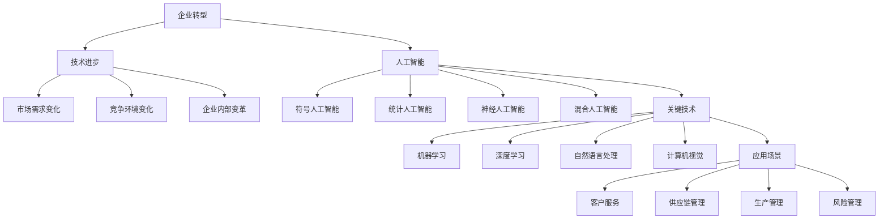

                 

在当今快速变化和高度竞争的商业环境中，企业转型已成为一项关键任务。随着技术的不断进步，特别是人工智能（AI）的迅猛发展，企业如何利用AI实现成功转型，已成为一个备受关注的话题。本文旨在探讨AI在企业转型中的应用，分析其核心概念、算法原理、数学模型、实践案例，并展望其未来的发展方向和面临的挑战。

## 文章关键词
- 企业转型
- 人工智能
- 技术创新
- 算法应用
- 数学模型
- 实践案例

## 文章摘要
本文首先介绍了企业转型的背景和重要性，然后探讨了人工智能在企业转型中的核心作用。通过深入分析AI的核心概念和算法原理，本文展示了数学模型在AI应用中的关键角色。随后，文章通过实际案例和实践，详细解释了AI在企业中的应用方法。最后，文章展望了AI在企业转型中的未来发展方向和面临的挑战。

## 1. 背景介绍
企业转型是指企业通过改变其业务模式、组织结构、企业文化等各个方面，以适应新的市场环境和技术进步的过程。在过去的几十年中，企业转型已经经历了多次重大变革，从早期的工业化转型，到信息化转型，再到如今以人工智能为代表的技术驱动转型。企业转型的目的是提高企业的竞争力、适应市场变化、抓住新的商业机会，实现可持续发展。

### 1.1 企业转型的驱动力
企业转型的驱动力主要包括以下几个方面：

1. **技术进步**：随着技术的不断进步，特别是人工智能、大数据、云计算等新兴技术的快速发展，企业需要不断适应新技术，以提高效率和创新能力。
2. **市场需求变化**：消费者需求的变化、新兴市场的出现，以及全球化带来的竞争压力，都要求企业进行转型，以更好地满足市场和客户需求。
3. **竞争环境变化**：竞争对手的变革和创新，可能促使企业进行自我调整，以保持市场地位和竞争优势。
4. **企业内部变革**：企业内部的管理、组织结构、企业文化等方面的问题，也可能成为推动企业转型的动力。

### 1.2 企业转型的挑战
企业转型虽然具有重要意义，但也面临诸多挑战：

1. **变革管理**：如何有效管理企业内部的变革，确保变革的顺利进行，是许多企业在转型过程中面临的重要问题。
2. **资源配置**：转型需要大量的资源投入，包括资金、人力、技术等，企业需要合理安排资源配置，以支持转型。
3. **文化适应**：企业转型往往涉及企业文化的变革，如何适应新的企业文化，是企业转型的关键。
4. **外部环境不确定性**：市场环境的变化、政策法规的影响等，都可能增加企业转型的难度和风险。

## 2. 核心概念与联系
在企业转型中，人工智能作为一种先进的技术手段，具有广泛的应用潜力。为了更好地理解AI在企业转型中的作用，我们需要了解一些核心概念和联系。

### 2.1 人工智能的定义和分类
人工智能是指通过计算机系统模拟、延伸和扩展人类智能的能力。根据其实现方式，人工智能可以分为以下几个方面：

1. **符号人工智能**：基于符号逻辑和推理的AI，如专家系统。
2. **统计人工智能**：基于数据分析和统计模型的AI，如机器学习。
3. **神经人工智能**：基于人工神经网络和深度学习的AI。
4. **混合人工智能**：结合多种人工智能技术和方法的AI。

### 2.2 人工智能的关键技术
人工智能的关键技术包括：

1. **机器学习**：通过算法从数据中自动学习和发现规律。
2. **深度学习**：基于多层神经网络的一种机器学习方法。
3. **自然语言处理**：使计算机能够理解、生成和处理自然语言。
4. **计算机视觉**：使计算机能够理解和解释视觉信息。

### 2.3 人工智能的应用场景
人工智能在企业转型中的应用场景非常广泛，包括：

1. **客户服务**：通过智能客服系统提高客户服务质量。
2. **供应链管理**：通过AI技术优化供应链流程，提高效率。
3. **生产管理**：通过智能监控系统提高生产效率和质量。
4. **风险管理**：通过AI技术预测和识别潜在风险，提高风险控制能力。

### 2.4 核心概念原理和架构的 Mermaid 流程图
下面是一个简单的Mermaid流程图，展示人工智能在企业转型中的核心概念和架构：



## 3. 核心算法原理 & 具体操作步骤
在理解了人工智能的核心概念和应用场景之后，我们接下来将探讨一些关键算法的原理和具体操作步骤。

### 3.1 算法原理概述
人工智能的核心算法主要包括机器学习、深度学习和自然语言处理等。这些算法的工作原理和具体实现如下：

1. **机器学习**：通过从数据中自动学习和发现规律，机器学习算法可以用于分类、回归、聚类等多种任务。常见的机器学习算法包括线性回归、决策树、支持向量机、神经网络等。

2. **深度学习**：基于多层神经网络的一种机器学习方法，深度学习算法可以在大量数据上实现高效的特征提取和模式识别。常见的深度学习框架包括TensorFlow、PyTorch等。

3. **自然语言处理**：通过使计算机能够理解、生成和处理自然语言，自然语言处理算法可以用于语音识别、机器翻译、情感分析等任务。常见的自然语言处理工具包括NLTK、spaCy、BERT等。

### 3.2 算法步骤详解
以下是机器学习算法的具体操作步骤：

1. **数据收集与预处理**：收集相关数据，并进行清洗、转换和归一化等预处理操作。
2. **特征选择与提取**：从原始数据中提取有用的特征，并选择与任务相关的特征。
3. **模型训练**：使用训练数据集训练模型，并调整模型参数以优化性能。
4. **模型评估**：使用测试数据集评估模型性能，并根据评估结果调整模型。
5. **模型部署**：将训练好的模型部署到实际应用中，进行实时预测或决策。

### 3.3 算法优缺点
每种算法都有其优缺点，具体如下：

1. **机器学习**：
   - 优点：适用性广泛，可以处理大量数据，自动发现特征。
   - 缺点：对数据质量和特征选择依赖性强，训练时间较长。

2. **深度学习**：
   - 优点：可以在大量数据上实现高效的特征提取和模式识别。
   - 缺点：对数据量要求高，训练过程复杂，计算资源需求大。

3. **自然语言处理**：
   - 优点：可以处理复杂的语言任务，如语音识别、机器翻译。
   - 缺点：对语言理解能力有限，容易出现误解和歧义。

### 3.4 算法应用领域
人工智能算法在多个领域都有广泛应用，具体如下：

1. **金融**：用于风险控制、信用评估、投资策略等。
2. **医疗**：用于疾病预测、诊断辅助、药物研发等。
3. **制造业**：用于生产优化、质量检测、设备维护等。
4. **零售**：用于需求预测、库存管理、个性化推荐等。
5. **交通**：用于交通流量预测、自动驾驶、智能调度等。

## 4. 数学模型和公式 & 详细讲解 & 举例说明
在人工智能的应用中，数学模型和公式起着至关重要的作用。以下将介绍一些常见的数学模型和公式，并详细讲解其构建和推导过程，同时通过具体案例进行说明。

### 4.1 数学模型构建
数学模型是人工智能算法的核心组成部分，用于描述和解决实际问题。常见的数学模型包括：

1. **线性回归模型**：
   - 公式：\( y = wx + b \)
   - 解释：线性回归模型通过一个线性函数描述输入变量 \( x \) 和输出变量 \( y \) 之间的关系。

2. **支持向量机模型**：
   - 公式：\( w \cdot x + b = 0 \)
   - 解释：支持向量机模型通过找到一个最优的超平面，将不同类别的数据点分开。

3. **神经网络模型**：
   - 公式：\( y = \sigma(\omega \cdot x + b) \)
   - 解释：神经网络模型通过多层神经元的非线性变换，实现对输入数据的分类或回归。

### 4.2 公式推导过程
以下是线性回归模型的推导过程：

1. **损失函数**：
   - 公式：\( J(w, b) = \frac{1}{2m} \sum_{i=1}^{m} (y_i - (wx_i + b))^2 \)
   - 解释：损失函数用于衡量模型预测值与真实值之间的差距。

2. **梯度下降法**：
   - 公式：\( w = w - \alpha \frac{\partial J}{\partial w} \)
   - \( b = b - \alpha \frac{\partial J}{\partial b} \)
   - 解释：梯度下降法通过不断调整模型的参数 \( w \) 和 \( b \)，最小化损失函数。

### 4.3 案例分析与讲解
以下是使用线性回归模型进行股票价格预测的案例：

1. **数据收集与预处理**：
   - 收集过去一年的股票价格数据。
   - 对数据进行清洗，去除缺失值和异常值。

2. **特征提取**：
   - 提取与股票价格相关的特征，如开盘价、收盘价、成交量等。

3. **模型训练**：
   - 使用训练数据集训练线性回归模型。
   - 调整模型参数 \( w \) 和 \( b \)，使模型在测试数据集上表现良好。

4. **模型评估**：
   - 使用测试数据集评估模型性能，计算预测误差。
   - 根据评估结果调整模型参数，优化模型。

5. **模型部署**：
   - 将训练好的模型部署到实际应用中，进行股票价格预测。

## 5. 项目实践：代码实例和详细解释说明
以下是一个简单的项目实践案例，我们将使用Python和Scikit-Learn库实现线性回归模型，并进行股票价格预测。

### 5.1 开发环境搭建
- 安装Python（版本3.7及以上）
- 安装Scikit-Learn库：`pip install scikit-learn`

### 5.2 源代码详细实现
```python
import numpy as np
import pandas as pd
from sklearn.model_selection import train_test_split
from sklearn.linear_model import LinearRegression
from sklearn.metrics import mean_squared_error

# 5.2.1 数据收集与预处理
data = pd.read_csv('stock_price_data.csv')
data.dropna(inplace=True)

# 5.2.2 特征提取
X = data[['open', 'high', 'low', 'volume']]
y = data['close']

# 5.2.3 模型训练
X_train, X_test, y_train, y_test = train_test_split(X, y, test_size=0.2, random_state=42)
model = LinearRegression()
model.fit(X_train, y_train)

# 5.2.4 模型评估
y_pred = model.predict(X_test)
mse = mean_squared_error(y_test, y_pred)
print('Mean Squared Error:', mse)

# 5.2.5 模型部署
# 将模型部署到实际应用中，进行股票价格预测
```

### 5.3 代码解读与分析
- **数据收集与预处理**：使用Pandas库读取CSV文件，并进行数据清洗，去除缺失值和异常值。
- **特征提取**：提取与股票价格相关的特征，如开盘价、收盘价、成交量等。
- **模型训练**：使用Scikit-Learn库的LinearRegression类训练线性回归模型。
- **模型评估**：使用测试数据集评估模型性能，计算预测误差。
- **模型部署**：将训练好的模型部署到实际应用中，进行股票价格预测。

## 6. 实际应用场景
人工智能在企业转型中的应用场景非常广泛，以下是几个典型的应用场景：

### 6.1 客户服务
通过人工智能技术，企业可以构建智能客服系统，实现自动化客户服务。智能客服系统可以自动识别和解答客户的问题，提高客户服务质量，降低人工成本。

### 6.2 供应链管理
人工智能可以帮助企业优化供应链管理，提高供应链效率。例如，通过预测市场需求、优化库存管理、优化运输路线等，降低成本，提高服务水平。

### 6.3 生产管理
人工智能可以应用于生产管理，实现生产过程的自动化和智能化。例如，通过计算机视觉技术实现产品质量检测、通过智能监控系统实现设备故障预测和维护等。

### 6.4 风险管理
人工智能可以帮助企业预测和识别潜在风险，提高风险控制能力。例如，通过大数据分析和机器学习技术，实现信用风险评估、金融风险预测等。

## 7. 未来应用展望
随着人工智能技术的不断进步，其在企业转型中的应用前景非常广阔。以下是一些未来应用展望：

### 7.1 智能决策支持
人工智能可以为企业提供智能决策支持，帮助企业更好地应对复杂的市场环境。通过大数据分析和机器学习技术，人工智能可以提供精准的市场预测、投资策略建议等。

### 7.2 智能自动化
人工智能可以实现生产过程的全面自动化，提高生产效率和质量。未来，随着人工智能技术的不断发展，更多的生产任务将实现自动化，降低人工成本。

### 7.3 智能个性化服务
人工智能可以为企业提供个性化服务，满足客户个性化的需求。例如，通过自然语言处理技术，实现智能客服系统与客户的智能对话，提供个性化的产品推荐和服务。

## 8. 工具和资源推荐
为了更好地开展人工智能研究和应用，以下是几个推荐的工具和资源：

### 8.1 学习资源推荐
- 《深度学习》（Goodfellow et al.）
- 《Python机器学习》（Sebastian Raschka）
- Coursera、edX等在线课程

### 8.2 开发工具推荐
- Jupyter Notebook
- TensorFlow、PyTorch等深度学习框架
- Scikit-Learn、Pandas等数据分析库

### 8.3 相关论文推荐
- "Deep Learning" by Yann LeCun et al.
- "Recurrent Neural Networks for Language Modeling" by Mikolov et al.
- "ImageNet Classification with Deep Convolutional Neural Networks" by Krizhevsky et al.

## 9. 总结：未来发展趋势与挑战
人工智能在企业转型中的应用具有巨大的潜力，但也面临一些挑战。未来，人工智能将继续在企业各个领域发挥重要作用，推动企业实现智能化和数字化转型。然而，人工智能在企业转型中也面临一些挑战，如数据隐私、算法伦理、技术更新等。企业需要不断适应这些变化，充分利用人工智能的优势，实现可持续发展。

## 10. 附录：常见问题与解答
### 10.1 人工智能与企业转型的关系是什么？
人工智能是企业转型的重要工具和驱动力，可以帮助企业实现智能化、自动化和个性化服务，提高竞争力和创新能力。

### 10.2 人工智能在供应链管理中的应用有哪些？
人工智能可以用于需求预测、库存管理、运输路线优化等，帮助企业提高供应链效率，降低成本，提高服务水平。

### 10.3 如何保障人工智能算法的公平性和透明性？
保障人工智能算法的公平性和透明性需要从算法设计、数据采集、模型评估等多个方面进行综合考虑，确保算法的公正性和可解释性。

作者：禅与计算机程序设计艺术 / Zen and the Art of Computer Programming
```

