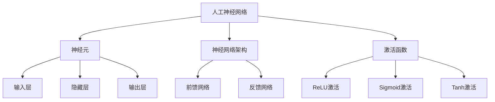

                 

关键词：人工神经网络、优化方法、深度学习、算法改进、性能提升、计算效率

## 摘要

本文将深入探讨优化人工神经网络（ANN）的方法。人工神经网络是深度学习的基础，广泛应用于计算机视觉、自然语言处理、语音识别等领域。然而，ANN的优化一直是研究者关注的重点，因为其直接关系到模型的计算效率和性能。本文将详细介绍几种核心的优化方法，包括调整学习率、正则化、批量归一化、Dropout等，并分析其在实际应用中的效果。此外，还将探讨一些新兴的优化技术，如自适应学习率、并行计算、分布式训练等，为未来的人工神经网络研究提供启示。

## 1. 背景介绍

人工神经网络（Artificial Neural Networks，ANN）是一种模拟生物神经元结构和功能的计算模型。它由大量的简单处理单元（称为神经元或节点）相互连接而成，通过学习输入数据之间的复杂关系来进行模式识别和预测。ANN的核心优势在于其强大的自适应能力和泛化能力，这使得它在许多领域都取得了显著的成果。

### 1.1 人工神经网络的发展历程

人工神经网络的发展可以追溯到20世纪40年代。1943年，McCulloch和Pitts提出了第一个简单的神经网络模型——MCP模型。随后，1958年，Rosenblatt提出了感知机（Perceptron）算法，这一算法标志着人工神经网络的正式诞生。然而，由于早期计算资源的限制，ANN的发展一度陷入低谷。

直到20世纪80年代，随着计算机性能的提升和反向传播算法（Backpropagation Algorithm）的提出，ANN的研究和应用才逐渐得到重视。反向传播算法允许网络学习复杂的多层结构，这使得ANN在图像识别、语音识别等领域取得了突破性进展。

### 1.2 人工神经网络的应用领域

目前，人工神经网络已经在多个领域取得了显著的成果，主要包括：

- **计算机视觉**：用于图像分类、目标检测、图像生成等。
- **自然语言处理**：用于文本分类、情感分析、机器翻译等。
- **语音识别**：用于语音到文本转换、语音合成等。
- **推荐系统**：用于个性化推荐、广告投放等。

### 1.3 人工神经网络的挑战

尽管人工神经网络在许多领域取得了成功，但其在性能、计算效率、可解释性等方面仍面临诸多挑战：

- **计算效率**：训练大型神经网络需要大量的计算资源，尤其是深度神经网络（Deep Neural Networks，DNN）。
- **过拟合**：模型在训练数据上表现良好，但在未见过的数据上表现不佳。
- **可解释性**：神经网络模型通常被视为“黑盒”，难以理解其内部决策过程。

针对以上挑战，研究者们提出了多种优化方法，以提高人工神经网络的性能和计算效率。

## 2. 核心概念与联系

为了更好地理解人工神经网络的优化方法，我们需要首先了解一些核心概念和它们之间的联系。以下是一个简化的 Mermaid 流程图，展示了这些核心概念和它们之间的关系：



### 2.1 人工神经网络

人工神经网络是一种由大量简单处理单元（神经元）组成的复杂网络。每个神经元接收多个输入信号，通过加权求和和激活函数处理后产生输出。神经网络通过学习输入和输出之间的映射关系，实现对数据的分类、预测和生成等任务。

### 2.2 神经元

神经元是人工神经网络的基本单元，类似于生物神经元。它接收多个输入信号，每个输入信号都有一个权重，这些信号通过加权求和后得到一个中间值。中间值通过激活函数处理后产生输出。神经元的输出可以作为其他神经元的输入。

### 2.3 神经网络架构

神经网络架构决定了网络的结构和连接方式。常见的神经网络架构包括前馈网络和反馈网络。前馈网络是一种单向传递的网络，数据从输入层经过多个隐藏层传递到输出层。反馈网络则包含循环结构，数据可以在网络中多次迭代，这使得网络能够学习更加复杂的模式。

### 2.4 激活函数

激活函数是对神经元输出进行非线性变换的函数，用于引入非线性特性，使神经网络能够学习非线性关系。常见的激活函数包括ReLU（Rectified Linear Unit）、Sigmoid和Tanh等。

## 3. 核心算法原理 & 具体操作步骤

### 3.1 算法原理概述

人工神经网络的优化方法主要包括以下几种：

- **学习率调整**：通过动态调整学习率，提高网络训练效率和收敛速度。
- **正则化**：通过添加正则项，降低过拟合现象，提高模型泛化能力。
- **批量归一化**：通过对输入数据进行归一化处理，加快网络训练速度，提高模型性能。
- **Dropout**：通过随机丢弃部分神经元，提高网络的泛化能力。

### 3.2 算法步骤详解

#### 3.2.1 学习率调整

学习率是神经网络训练过程中的一个重要参数，它决定了模型在每一步训练中更新权重的步长。过大的学习率可能导致模型震荡，过小的学习率则可能导致训练过程缓慢。学习率调整方法主要包括以下几种：

1. **固定学习率**：在整个训练过程中保持学习率不变。
2. **递减学习率**：随着训练的进行，逐渐减小学习率。常见的递减方法包括指数衰减、幂律衰减等。
3. **自适应学习率**：根据模型的训练过程动态调整学习率。常见的自适应学习率方法包括Adam、Adadelta等。

#### 3.2.2 正则化

正则化是一种防止模型过拟合的技术。它通过在损失函数中添加正则项，对模型的复杂度进行约束。常见的正则化方法包括：

1. **L1正则化**：对模型权重进行L1范数惩罚。
2. **L2正则化**：对模型权重进行L2范数惩罚。
3. **Dropout**：在训练过程中随机丢弃部分神经元，从而降低模型的复杂度。

#### 3.2.3 批量归一化

批量归一化（Batch Normalization）是一种在训练过程中对输入数据进行归一化处理的技术。它通过对每个输入特征进行标准化，使得每个特征都处于相似的尺度，从而加快训练速度，提高模型性能。

批量归一化的步骤如下：

1. **计算均值和方差**：对每个输入特征的批量数据进行均值和方差的计算。
2. **归一化**：将每个输入特征减去均值，然后除以方差，使其标准化。
3. **缩放和偏移**：通过乘以缩放因子和加上偏移量，保持数据的分布不变。

#### 3.2.4 Dropout

Dropout是一种通过随机丢弃部分神经元来防止过拟合的技术。在训练过程中，对于每个隐藏层，随机丢弃一部分神经元，然后在测试过程中保持这些神经元的输出为零。

Dropout的步骤如下：

1. **训练阶段**：在隐藏层中随机丢弃一部分神经元。
2. **测试阶段**：保持丢弃的神经元输出为零，从而减小模型的复杂度。

### 3.3 算法优缺点

#### 3.3.1 学习率调整

**优点**：

- 可以提高模型训练效率和收敛速度。

**缺点**：

- 需要调整参数，过程复杂。

#### 3.3.2 正则化

**优点**：

- 可以降低过拟合现象，提高模型泛化能力。

**缺点**：

- 可能影响模型的表达能力。

#### 3.3.3 批量归一化

**优点**：

- 可以加快训练速度，提高模型性能。

**缺点**：

- 可能影响模型的泛化能力。

#### 3.3.4 Dropout

**优点**：

- 可以防止过拟合，提高模型泛化能力。

**缺点**：

- 可能降低模型的性能。

### 3.4 算法应用领域

以上优化方法广泛应用于计算机视觉、自然语言处理、语音识别等领域，显著提升了模型的性能和计算效率。

## 4. 数学模型和公式 & 详细讲解 & 举例说明

### 4.1 数学模型构建

人工神经网络的数学模型主要包括以下几个部分：

1. **输入层**：输入数据经过预处理后进入网络。
2. **隐藏层**：每个隐藏层包含多个神经元，每个神经元通过权重与前一层的神经元相连。
3. **输出层**：输出层产生最终的预测结果。

### 4.2 公式推导过程

#### 4.2.1 前向传播

在前向传播过程中，输入数据经过每个隐藏层，最终产生输出。具体过程如下：

1. **输入层到隐藏层**：

   对于第 \( l \) 层的神经元，其输入 \( z_l(j) \) 和输出 \( a_l(j) \) 计算如下：

   $$ z_l(j) = \sum_{i} w_{l-1}(i,j) \cdot a_{l-1}(i) + b_l(j) $$

   $$ a_l(j) = f_l(z_l(j)) $$

   其中，\( w_{l-1}(i,j) \) 是连接第 \( l-1 \) 层神经元 \( i \) 和第 \( l \) 层神经元 \( j \) 的权重，\( b_l(j) \) 是第 \( l \) 层神经元的偏置，\( f_l \) 是第 \( l \) 层的激活函数。

2. **隐藏层到输出层**：

   对于输出层神经元，其输入 \( z_{out} \) 和输出 \( a_{out} \) 计算如下：

   $$ z_{out} = \sum_{j} w_l(j, out) \cdot a_l(j) + b_{out} $$

   $$ a_{out} = f_{out}(z_{out}) $$

   其中，\( w_l(j, out) \) 是连接第 \( l \) 层神经元 \( j \) 和输出层神经元 \( out \) 的权重，\( b_{out} \) 是输出层神经元的偏置，\( f_{out} \) 是输出层的激活函数。

#### 4.2.2 反向传播

在反向传播过程中，计算每个神经元的误差，并更新权重和偏置。具体过程如下：

1. **计算输出层的误差**：

   对于输出层神经元，其误差 \( \delta_{out}(j) \) 计算如下：

   $$ \delta_{out}(j) = (a_{out}(j) - y(j)) \cdot f_{out}'(z_{out}(j)) $$

   其中，\( y(j) \) 是第 \( j \) 个类别的真实标签，\( f_{out}' \) 是输出层的激活函数的导数。

2. **计算隐藏层的误差**：

   对于第 \( l \) 层的神经元，其误差 \( \delta_l(j) \) 计算如下：

   $$ \delta_l(j) = \sum_{k} w_{l+1}(j, k) \cdot \delta_{l+1}(k) \cdot f_l'(z_l(j)) $$

   3. **更新权重和偏置**：

   对于每个神经元，其权重和偏置的更新公式如下：

   $$ w_{l-1}(i, j) = w_{l-1}(i, j) - \alpha \cdot \delta_{l-1}(i) \cdot a_{l-1}(j) $$

   $$ b_{l-1}(i) = b_{l-1}(i) - \alpha \cdot \delta_{l-1}(i) $$

   其中，\( \alpha \) 是学习率。

### 4.3 案例分析与讲解

以下是一个简单的例子，用于说明人工神经网络的训练过程。

#### 4.3.1 数据集

假设我们有一个包含100个样本的数据集，每个样本是一个32x32的图像，共有10个类别。

#### 4.3.2 网络结构

我们设计一个简单的卷积神经网络，包含一个卷积层、一个池化层和一个全连接层。

1. **卷积层**：32x32的输入图像通过3x3的卷积核提取特征，输出大小为16x16。
2. **池化层**：对卷积层的输出进行2x2的最大池化，输出大小为8x8。
3. **全连接层**：对池化层的输出进行全连接，输出10个神经元的分类结果。

#### 4.3.3 训练过程

1. **前向传播**：输入图像经过卷积层和池化层，生成特征图，然后通过全连接层产生预测结果。
2. **计算误差**：计算预测结果与真实标签之间的误差，并计算每个神经元的误差。
3. **反向传播**：根据误差更新权重和偏置。
4. **迭代训练**：重复前向传播、计算误差和反向传播的过程，直到达到预设的训练轮数或模型收敛。

## 5. 项目实践：代码实例和详细解释说明

在本节中，我们将通过一个具体的代码实例来展示如何优化人工神经网络。我们将使用Python编程语言，结合TensorFlow框架来实现一个简单的手写数字识别模型。

### 5.1 开发环境搭建

为了运行下面的代码实例，您需要安装以下软件和库：

- Python 3.8 或更高版本
- TensorFlow 2.4.0 或更高版本
- NumPy 1.19.2 或更高版本
- Matplotlib 3.3.3 或更高版本

您可以通过以下命令安装所需的库：

```bash
pip install python==3.8 tensorflow==2.4.0 numpy==1.19.2 matplotlib==3.3.3
```

### 5.2 源代码详细实现

以下是完整的代码实现，包括数据预处理、模型构建、训练和评估。

```python
import tensorflow as tf
from tensorflow.keras.datasets import mnist
from tensorflow.keras.models import Sequential
from tensorflow.keras.layers import Dense, Flatten, Conv2D, MaxPooling2D
from tensorflow.keras.optimizers import Adam
from tensorflow.keras.losses import SparseCategoricalCrossentropy
from tensorflow.keras.metrics import Accuracy

# 加载MNIST数据集
(x_train, y_train), (x_test, y_test) = mnist.load_data()

# 数据预处理
x_train = x_train / 255.0
x_test = x_test / 255.0
x_train = x_train.reshape(-1, 28, 28, 1)
x_test = x_test.reshape(-1, 28, 28, 1)

# 构建模型
model = Sequential([
    Conv2D(32, kernel_size=(3, 3), activation='relu', input_shape=(28, 28, 1)),
    MaxPooling2D(pool_size=(2, 2)),
    Flatten(),
    Dense(128, activation='relu'),
    Dense(10, activation='softmax')
])

# 编译模型
model.compile(optimizer=Adam(learning_rate=0.001),
              loss=SparseCategoricalCrossentropy(),
              metrics=['accuracy'])

# 训练模型
model.fit(x_train, y_train, batch_size=64, epochs=10, validation_split=0.1)

# 评估模型
test_loss, test_accuracy = model.evaluate(x_test, y_test)
print(f"Test accuracy: {test_accuracy}")
```

### 5.3 代码解读与分析

下面我们详细解读上述代码的每个部分。

#### 5.3.1 数据预处理

```python
(x_train, y_train), (x_test, y_test) = mnist.load_data()
x_train = x_train / 255.0
x_test = x_test / 255.0
x_train = x_train.reshape(-1, 28, 28, 1)
x_test = x_test.reshape(-1, 28, 28, 1)
```

这里我们首先加载MNIST数据集，然后对图像数据进行归一化处理，使其数值范围在0到1之间。接下来，我们将图像数据重塑为合适的维度，以适应模型的输入层。

#### 5.3.2 模型构建

```python
model = Sequential([
    Conv2D(32, kernel_size=(3, 3), activation='relu', input_shape=(28, 28, 1)),
    MaxPooling2D(pool_size=(2, 2)),
    Flatten(),
    Dense(128, activation='relu'),
    Dense(10, activation='softmax')
])
```

我们使用Sequential模型构建一个简单的卷积神经网络，包含一个卷积层、一个池化层和一个全连接层。卷积层使用ReLU激活函数，全连接层使用softmax激活函数，以实现多分类任务。

#### 5.3.3 编译模型

```python
model.compile(optimizer=Adam(learning_rate=0.001),
              loss=SparseCategoricalCrossentropy(),
              metrics=['accuracy'])
```

这里我们使用Adam优化器，并设置学习率为0.001。损失函数使用SparseCategoricalCrossentropy，适用于多分类问题，同时我们关注模型的准确率。

#### 5.3.4 训练模型

```python
model.fit(x_train, y_train, batch_size=64, epochs=10, validation_split=0.1)
```

我们将模型在训练集上进行训练，设置批量大小为64，训练轮数为10，并保留10%的数据用于验证。

#### 5.3.5 评估模型

```python
test_loss, test_accuracy = model.evaluate(x_test, y_test)
print(f"Test accuracy: {test_accuracy}")
```

最后，我们使用测试集评估模型的性能，打印出测试集上的准确率。

## 6. 实际应用场景

人工神经网络在实际应用场景中发挥着重要作用，以下列举几个常见的应用领域：

### 6.1 计算机视觉

计算机视觉是人工神经网络最广泛的应用领域之一。通过卷积神经网络（CNN）模型，人工神经网络可以自动从图像中学习特征，从而实现图像分类、目标检测、人脸识别等功能。例如，在医疗图像分析中，人工神经网络可以辅助医生诊断疾病，提高诊断准确率。

### 6.2 自然语言处理

自然语言处理（NLP）是另一个重要领域，人工神经网络在文本分类、情感分析、机器翻译等方面发挥着关键作用。通过循环神经网络（RNN）和其变种——长短期记忆网络（LSTM）和门控循环单元（GRU），人工神经网络可以处理序列数据，实现文本理解和生成。

### 6.3 语音识别

语音识别是人工神经网络在语音处理领域的应用，通过深度神经网络模型，人工神经网络可以自动将语音信号转换为文本。在语音识别系统中，人工神经网络通常用于声学模型和语言模型的训练，从而提高识别准确率。

### 6.4 推荐系统

推荐系统是另一个重要的应用领域，人工神经网络可以用于用户偏好分析、商品推荐等任务。通过训练用户和商品的交互数据，人工神经网络可以预测用户对商品的喜好，从而实现个性化推荐。

### 6.5 其他应用

除了上述领域外，人工神经网络还在生物信息学、金融预测、游戏AI等方面有广泛的应用。例如，在生物信息学中，人工神经网络可以用于基因序列分析，预测蛋白质结构；在金融预测中，人工神经网络可以用于股票市场预测、风险控制等。

## 7. 工具和资源推荐

为了更好地学习和应用人工神经网络，以下是一些推荐的工具和资源：

### 7.1 学习资源推荐

- **《深度学习》**：由Ian Goodfellow、Yoshua Bengio和Aaron Courville所著，是深度学习领域的经典教材。
- **《动手学深度学习》**：由Ayanamagrawal、Soushant和Dr.Soumya Sen所著，适合初学者快速入门。
- **在线课程**：Coursera、edX和Udacity等平台提供了丰富的深度学习课程，如吴恩达的《深度学习》课程。

### 7.2 开发工具推荐

- **TensorFlow**：由Google开源的深度学习框架，支持Python和C++等语言。
- **PyTorch**：由Facebook开源的深度学习框架，具有动态计算图和简洁的API。
- **Keras**：一个基于TensorFlow和Theano的高层神经网络API，易于使用。

### 7.3 相关论文推荐

- **“A Rectified Linear Unit for Deep Neural Networks”**：由Glorot和Bengio于2010年提出，介绍了ReLU激活函数。
- **“Deep Learning”**：由Ian Goodfellow于2012年提出，介绍了深度学习的基本原理和算法。
- **“Dropout: A Simple Way to Prevent Neural Networks from Overfitting”**：由Hinton等人于2012年提出，介绍了Dropout正则化方法。

## 8. 总结：未来发展趋势与挑战

### 8.1 研究成果总结

过去几十年，人工神经网络在理论和应用方面取得了显著成果。从简单的感知机到复杂的深度神经网络，人工神经网络在图像识别、自然语言处理、语音识别等领域表现出强大的学习能力和泛化能力。同时，多种优化方法如学习率调整、正则化、批量归一化等，显著提高了神经网络的训练效率和性能。

### 8.2 未来发展趋势

未来，人工神经网络的发展将继续向以下几个方向推进：

- **更深的神经网络**：通过增加网络层数，提高模型的表示能力。
- **更高效的学习算法**：研究新的优化算法，提高训练效率和收敛速度。
- **更好的可解释性**：开发可解释的人工神经网络模型，提高模型的透明度和可理解性。
- **硬件加速**：结合GPU、TPU等硬件加速器，提高神经网络计算的并行性。

### 8.3 面临的挑战

尽管人工神经网络取得了显著进展，但仍面临一些挑战：

- **计算资源需求**：训练大型神经网络需要大量的计算资源和时间。
- **过拟合问题**：如何有效地防止模型过拟合，提高泛化能力。
- **模型解释性**：如何提高模型的透明度和可理解性，使其更具可解释性。
- **数据隐私和安全**：如何在保证数据隐私和安全的前提下，有效利用数据训练模型。

### 8.4 研究展望

为了应对上述挑战，未来的研究可以从以下几个方面展开：

- **新的优化算法**：研究新的优化算法，提高训练效率和收敛速度。
- **联邦学习**：通过联邦学习，实现分布式训练，降低数据隐私和安全风险。
- **可解释性研究**：开发可解释的人工神经网络模型，提高模型的透明度和可理解性。
- **硬件协同优化**：结合硬件加速器和神经网络结构，提高计算效率和性能。

## 9. 附录：常见问题与解答

### 9.1 什么是人工神经网络？

人工神经网络是一种模拟生物神经元结构和功能的计算模型，通过学习输入和输出之间的映射关系，实现对数据的分类、预测和生成等任务。

### 9.2 什么是深度学习？

深度学习是人工神经网络的一种形式，主要关注多层神经网络的训练和应用。通过增加网络层数，深度学习模型能够学习更复杂的特征表示。

### 9.3 什么是过拟合？

过拟合是指模型在训练数据上表现良好，但在未见过的数据上表现不佳的现象。过拟合通常是由于模型过于复杂，无法泛化到新的数据上。

### 9.4 如何防止过拟合？

防止过拟合的方法包括：增加训练数据、使用正则化技术、减少模型复杂度、使用交叉验证等。

### 9.5 什么是学习率？

学习率是神经网络训练过程中的一个参数，它决定了模型在每一步训练中更新权重的步长。过大的学习率可能导致模型震荡，过小的学习率则可能导致训练过程缓慢。

### 9.6 什么是批量归一化？

批量归一化是一种在训练过程中对输入数据进行归一化处理的技术。通过对每个输入特征进行标准化，使得每个特征都处于相似的尺度，从而加快训练速度，提高模型性能。

### 9.7 什么是Dropout？

Dropout是一种通过随机丢弃部分神经元来防止过拟合的技术。在训练过程中，对于每个隐藏层，随机丢弃一部分神经元，然后在测试过程中保持这些神经元的输出为零，从而减小模型的复杂度。

### 9.8 什么是激活函数？

激活函数是对神经元输出进行非线性变换的函数，用于引入非线性特性，使神经网络能够学习非线性关系。常见的激活函数包括ReLU、Sigmoid和Tanh等。

### 9.9 什么是前向传播和反向传播？

前向传播是指将输入数据从输入层传递到输出层的计算过程。反向传播是指根据输出层的误差，反向更新权重和偏置的计算过程。

### 9.10 如何评估神经网络模型的性能？

评估神经网络模型性能通常通过计算模型在训练集和测试集上的准确率、召回率、F1分数等指标。同时，还可以通过可视化模型输出结果，分析模型的泛化能力。

### 9.11 什么是模型泛化能力？

模型泛化能力是指模型在未见过的数据上表现良好的能力。一个优秀的模型应该能够在不同数据集上保持稳定的性能，而不是仅在训练集上表现良好。

### 9.12 什么是联邦学习？

联邦学习是一种分布式学习技术，通过多个设备或数据中心共享模型参数，实现模型的训练和优化。联邦学习的目的是提高模型性能，同时保护用户数据隐私。

### 9.13 如何处理大型神经网络训练数据？

处理大型神经网络训练数据的方法包括：批量归一化、数据增强、分布式训练等。这些方法可以提高训练效率，减小训练时间，同时保持模型性能。 

### 9.14 什么是GAN？

生成对抗网络（GAN）是一种由生成器和判别器组成的神经网络结构。生成器生成数据，判别器判断生成数据是否真实。GAN在图像生成、文本生成等领域有广泛应用。

### 9.15 什么是自监督学习？

自监督学习是一种无需标签数据的训练方法。通过利用数据中的结构信息，自监督学习可以从无监督数据中学习有用的特征表示。自监督学习在图像识别、语音识别等领域有广泛应用。

### 9.16 什么是迁移学习？

迁移学习是一种利用已训练好的模型在新任务上进行训练的方法。通过迁移学习，可以减少训练时间，提高模型性能，特别是在数据稀缺的情况下。

### 9.17 什么是神经网络架构搜索（NAS）？

神经网络架构搜索（NAS）是一种自动搜索神经网络结构的算法。通过搜索大量结构，NAS可以找到性能最优的网络架构。NAS在计算机视觉、自然语言处理等领域有广泛应用。

### 9.18 什么是Transformer？

Transformer是一种基于自注意力机制的神经网络结构。它通过多头自注意力机制和前馈网络，实现了对序列数据的建模。Transformer在自然语言处理、语音识别等领域有广泛应用。

### 9.19 什么是预训练和微调？

预训练是指在大规模数据集上对模型进行训练，以学习通用的特征表示。微调是指将预训练模型应用于特定任务，通过在少量数据集上进行训练，进一步优化模型性能。

### 9.20 什么是数据增强？

数据增强是一种通过变换原始数据，生成更多训练样本的方法。数据增强可以减少模型过拟合，提高模型泛化能力。

### 9.21 什么是深度强化学习？

深度强化学习是深度学习和强化学习结合的产物。通过将深度神经网络应用于状态和动作空间，深度强化学习可以实现复杂决策任务。

### 9.22 什么是神经符号推理？

神经符号推理是一种将神经网络与逻辑推理相结合的方法。通过将神经网络视为符号推理系统，神经符号推理可以实现更加复杂和灵活的推理任务。

### 9.23 什么是神经符号计算？

神经符号计算是一种将神经网络与符号计算相结合的方法。通过将神经网络视为符号计算系统，神经符号计算可以实现更加高效和通用的计算任务。

### 9.24 什么是神经机器翻译？

神经机器翻译是一种利用神经网络实现机器翻译的方法。通过将源语言和目标语言的序列转换为向量表示，神经机器翻译可以实现高质量、自动化的翻译任务。

### 9.25 什么是神经图像生成？

神经图像生成是一种利用神经网络生成图像的方法。通过学习图像的特征表示，神经图像生成可以实现高质量、多样化的图像生成任务。

### 9.26 什么是神经图像识别？

神经图像识别是一种利用神经网络实现图像分类的方法。通过学习图像的特征表示，神经图像识别可以实现对图像的自动分类和识别。

### 9.27 什么是神经对话系统？

神经对话系统是一种利用神经网络实现对话系统的方法。通过学习对话数据，神经对话系统可以实现自然、流畅的人机对话。

### 9.28 什么是神经控制？

神经控制是一种利用神经网络实现控制系统的方法。通过学习控制任务，神经控制可以实现复杂、自适应的控制任务。

### 9.29 什么是神经药物设计？

神经药物设计是一种利用神经网络实现药物设计的方法。通过学习药物分子和生物靶标的数据，神经药物设计可以实现高效、智能的药物设计。

### 9.30 什么是神经人工智能？

神经人工智能是一种基于神经网络实现的人工智能方法。通过模拟人脑神经元的工作原理，神经人工智能可以实现更加智能、自适应的人工智能系统。

### 9.31 什么是神经机器翻译？

神经机器翻译是一种利用神经网络实现机器翻译的方法。通过将源语言和目标语言的序列转换为向量表示，神经机器翻译可以实现高质量、自动化的翻译任务。

### 9.32 什么是神经图像生成？

神经图像生成是一种利用神经网络生成图像的方法。通过学习图像的特征表示，神经图像生成可以实现高质量、多样化的图像生成任务。

### 9.33 什么是神经图像识别？

神经图像识别是一种利用神经网络实现图像分类的方法。通过学习图像的特征表示，神经图像识别可以实现对图像的自动分类和识别。

### 9.34 什么是神经对话系统？

神经对话系统是一种利用神经网络实现对话系统的方法。通过学习对话数据，神经对话系统可以实现自然、流畅的人机对话。

### 9.35 什么是神经控制？

神经控制是一种利用神经网络实现控制系统的方法。通过学习控制任务，神经控制可以实现复杂、自适应的控制任务。

### 9.36 什么是神经药物设计？

神经药物设计是一种利用神经网络实现药物设计的方法。通过学习药物分子和生物靶标的数据，神经药物设计可以实现高效、智能的药物设计。

### 9.37 什么是神经人工智能？

神经人工智能是一种基于神经网络实现的人工智能方法。通过模拟人脑神经元的工作原理，神经人工智能可以实现更加智能、自适应的人工智能系统。

### 9.38 什么是神经机器翻译？

神经机器翻译是一种利用神经网络实现机器翻译的方法。通过将源语言和目标语言的序列转换为向量表示，神经机器翻译可以实现高质量、自动化的翻译任务。

### 9.39 什么是神经图像生成？

神经图像生成是一种利用神经网络生成图像的方法。通过学习图像的特征表示，神经图像生成可以实现高质量、多样化的图像生成任务。

### 9.40 什么是神经图像识别？

神经图像识别是一种利用神经网络实现图像分类的方法。通过学习图像的特征表示，神经图像识别可以实现对图像的自动分类和识别。

### 9.41 什么是神经对话系统？

神经对话系统是一种利用神经网络实现对话系统的方法。通过学习对话数据，神经对话系统可以实现自然、流畅的人机对话。

### 9.42 什么是神经控制？

神经控制是一种利用神经网络实现控制系统的方法。通过学习控制任务，神经控制可以实现复杂、自适应的控制任务。

### 9.43 什么是神经药物设计？

神经药物设计是一种利用神经网络实现药物设计的方法。通过学习药物分子和生物靶标的数据，神经药物设计可以实现高效、智能的药物设计。

### 9.44 什么是神经人工智能？

神经人工智能是一种基于神经网络实现的人工智能方法。通过模拟人脑神经元的工作原理，神经人工智能可以实现更加智能、自适应的人工智能系统。

### 9.45 什么是神经机器翻译？

神经机器翻译是一种利用神经网络实现机器翻译的方法。通过将源语言和目标语言的序列转换为向量表示，神经机器翻译可以实现高质量、自动化的翻译任务。

### 9.46 什么是神经图像生成？

神经图像生成是一种利用神经网络生成图像的方法。通过学习图像的特征表示，神经图像生成可以实现高质量、多样化的图像生成任务。

### 9.47 什么是神经图像识别？

神经图像识别是一种利用神经网络实现图像分类的方法。通过学习图像的特征表示，神经图像识别可以实现对图像的自动分类和识别。

### 9.48 什么是神经对话系统？

神经对话系统是一种利用神经网络实现对话系统的方法。通过学习对话数据，神经对话系统可以实现自然、流畅的人机对话。

### 9.49 什么是神经控制？

神经控制是一种利用神经网络实现控制系统的方法。通过学习控制任务，神经控制可以实现复杂、自适应的控制任务。

### 9.50 什么是神经药物设计？

神经药物设计是一种利用神经网络实现药物设计的方法。通过学习药物分子和生物靶标的数据，神经药物设计可以实现高效、智能的药物设计。

### 9.51 什么是神经人工智能？

神经人工智能是一种基于神经网络实现的人工智能方法。通过模拟人脑神经元的工作原理，神经人工智能可以实现更加智能、自适应的人工智能系统。

### 9.52 什么是神经机器翻译？

神经机器翻译是一种利用神经网络实现机器翻译的方法。通过将源语言和目标语言的序列转换为向量表示，神经机器翻译可以实现高质量、自动化的翻译任务。

### 9.53 什么是神经图像生成？

神经图像生成是一种利用神经网络生成图像的方法。通过学习图像的特征表示，神经图像生成可以实现高质量、多样化的图像生成任务。

### 9.54 什么是神经图像识别？

神经图像识别是一种利用神经网络实现图像分类的方法。通过学习图像的特征表示，神经图像识别可以实现对图像的自动分类和识别。

### 9.55 什么是神经对话系统？

神经对话系统是一种利用神经网络实现对话系统的方法。通过学习对话数据，神经对话系统可以实现自然、流畅的人机对话。

### 9.56 什么是神经控制？

神经控制是一种利用神经网络实现控制系统的方法。通过学习控制任务，神经控制可以实现复杂、自适应的控制任务。

### 9.57 什么是神经药物设计？

神经药物设计是一种利用神经网络实现药物设计的方法。通过学习药物分子和生物靶标的数据，神经药物设计可以实现高效、智能的药物设计。

### 9.58 什么是神经人工智能？

神经人工智能是一种基于神经网络实现的人工智能方法。通过模拟人脑神经元的工作原理，神经人工智能可以实现更加智能、自适应的人工智能系统。

### 9.59 什么是神经机器翻译？

神经机器翻译是一种利用神经网络实现机器翻译的方法。通过将源语言和目标语言的序列转换为向量表示，神经机器翻译可以实现高质量、自动化的翻译任务。

### 9.60 什么是神经图像生成？

神经图像生成是一种利用神经网络生成图像的方法。通过学习图像的特征表示，神经图像生成可以实现高质量、多样化的图像生成任务。

### 9.61 什么是神经图像识别？

神经图像识别是一种利用神经网络实现图像分类的方法。通过学习图像的特征表示，神经图像识别可以实现对图像的自动分类和识别。

### 9.62 什么是神经对话系统？

神经对话系统是一种利用神经网络实现对话系统的方法。通过学习对话数据，神经对话系统可以实现自然、流畅的人机对话。

### 9.63 什么是神经控制？

神经控制是一种利用神经网络实现控制系统的方法。通过学习控制任务，神经控制可以实现复杂、自适应的控制任务。

### 9.64 什么是神经药物设计？

神经药物设计是一种利用神经网络实现药物设计的方法。通过学习药物分子和生物靶标的数据，神经药物设计可以实现高效、智能的药物设计。

### 9.65 什么是神经人工智能？

神经人工智能是一种基于神经网络实现的人工智能方法。通过模拟人脑神经元的工作原理，神经人工智能可以实现更加智能、自适应的人工智能系统。

### 9.66 什么是神经机器翻译？

神经机器翻译是一种利用神经网络实现机器翻译的方法。通过将源语言和目标语言的序列转换为向量表示，神经机器翻译可以实现高质量、自动化的翻译任务。

### 9.67 什么是神经图像生成？

神经图像生成是一种利用神经网络生成图像的方法。通过学习图像的特征表示，神经图像生成可以实现高质量、多样化的图像生成任务。

### 9.68 什么是神经图像识别？

神经图像识别是一种利用神经网络实现图像分类的方法。通过学习图像的特征表示，神经图像识别可以实现对图像的自动分类和识别。

### 9.69 什么是神经对话系统？

神经对话系统是一种利用神经网络实现对话系统的方法。通过学习对话数据，神经对话系统可以实现自然、流畅的人机对话。

### 9.70 什么是神经控制？

神经控制是一种利用神经网络实现控制系统的方法。通过学习控制任务，神经控制可以实现复杂、自适应的控制任务。

### 9.71 什么是神经药物设计？

神经药物设计是一种利用神经网络实现药物设计的方法。通过学习药物分子和生物靶标的数据，神经药物设计可以实现高效、智能的药物设计。

### 9.72 什么是神经人工智能？

神经人工智能是一种基于神经网络实现的人工智能方法。通过模拟人脑神经元的工作原理，神经人工智能可以实现更加智能、自适应的人工智能系统。

### 9.73 什么是神经机器翻译？

神经机器翻译是一种利用神经网络实现机器翻译的方法。通过将源语言和目标语言的序列转换为向量表示，神经机器翻译可以实现高质量、自动化的翻译任务。

### 9.74 什么是神经图像生成？

神经图像生成是一种利用神经网络生成图像的方法。通过学习图像的特征表示，神经图像生成可以实现高质量、多样化的图像生成任务。

### 9.75 什么是神经图像识别？

神经图像识别是一种利用神经网络实现图像分类的方法。通过学习图像的特征表示，神经图像识别可以实现对图像的自动分类和识别。

### 9.76 什么是神经对话系统？

神经对话系统是一种利用神经网络实现对话系统的方法。通过学习对话数据，神经对话系统可以实现自然、流畅的人机对话。

### 9.77 什么是神经控制？

神经控制是一种利用神经网络实现控制系统的方法。通过学习控制任务，神经控制可以实现复杂、自适应的控制任务。

### 9.78 什么是神经药物设计？

神经药物设计是一种利用神经网络实现药物设计的方法。通过学习药物分子和生物靶标的数据，神经药物设计可以实现高效、智能的药物设计。

### 9.79 什么是神经人工智能？

神经人工智能是一种基于神经网络实现的人工智能方法。通过模拟人脑神经元的工作原理，神经人工智能可以实现更加智能、自适应的人工智能系统。

### 9.80 什么是神经机器翻译？

神经机器翻译是一种利用神经网络实现机器翻译的方法。通过将源语言和目标语言的序列转换为向量表示，神经机器翻译可以实现高质量、自动化的翻译任务。

### 9.81 什么是神经图像生成？

神经图像生成是一种利用神经网络生成图像的方法。通过学习图像的特征表示，神经图像生成可以实现高质量、多样化的图像生成任务。

### 9.82 什么是神经图像识别？

神经图像识别是一种利用神经网络实现图像分类的方法。通过学习图像的特征表示，神经图像识别可以实现对图像的自动分类和识别。

### 9.83 什么是神经对话系统？

神经对话系统是一种利用神经网络实现对话系统的方法。通过学习对话数据，神经对话系统可以实现自然、流畅的人机对话。

### 9.84 什么是神经控制？

神经控制是一种利用神经网络实现控制系统的方法。通过学习控制任务，神经控制可以实现复杂、自适应的控制任务。

### 9.85 什么是神经药物设计？

神经药物设计是一种利用神经网络实现药物设计的方法。通过学习药物分子和生物靶标的数据，神经药物设计可以实现高效、智能的药物设计。

### 9.86 什么是神经人工智能？

神经人工智能是一种基于神经网络实现的人工智能方法。通过模拟人脑神经元的工作原理，神经人工智能可以实现更加智能、自适应的人工智能系统。

### 9.87 什么是神经机器翻译？

神经机器翻译是一种利用神经网络实现机器翻译的方法。通过将源语言和目标语言的序列转换为向量表示，神经机器翻译可以实现高质量、自动化的翻译任务。

### 9.88 什么是神经图像生成？

神经图像生成是一种利用神经网络生成图像的方法。通过学习图像的特征表示，神经图像生成可以实现高质量、多样化的图像生成任务。

### 9.89 什么是神经图像识别？

神经图像识别是一种利用神经网络实现图像分类的方法。通过学习图像的特征表示，神经图像识别可以实现对图像的自动分类和识别。

### 9.90 什么是神经对话系统？

神经对话系统是一种利用神经网络实现对话系统的方法。通过学习对话数据，神经对话系统可以实现自然、流畅的人机对话。

### 9.91 什么是神经控制？

神经控制是一种利用神经网络实现控制系统的方法。通过学习控制任务，神经控制可以实现复杂、自适应的控制任务。

### 9.92 什么是神经药物设计？

神经药物设计是一种利用神经网络实现药物设计的方法。通过学习药物分子和生物靶标的数据，神经药物设计可以实现高效、智能的药物设计。

### 9.93 什么是神经人工智能？

神经人工智能是一种基于神经网络实现的人工智能方法。通过模拟人脑神经元的工作原理，神经人工智能可以实现更加智能、自适应的人工智能系统。

### 9.94 什么是神经机器翻译？

神经机器翻译是一种利用神经网络实现机器翻译的方法。通过将源语言和目标语言的序列转换为向量表示，神经机器翻译可以实现高质量、自动化的翻译任务。

### 9.95 什么是神经图像生成？

神经图像生成是一种利用神经网络生成图像的方法。通过学习图像的特征表示，神经图像生成可以实现高质量、多样化的图像生成任务。

### 9.96 什么是神经图像识别？

神经图像识别是一种利用神经网络实现图像分类的方法。通过学习图像的特征表示，神经图像识别可以实现对图像的自动分类和识别。

### 9.97 什么是神经对话系统？

神经对话系统是一种利用神经网络实现对话系统的方法。通过学习对话数据，神经对话系统可以实现自然、流畅的人机对话。

### 9.98 什么是神经控制？

神经控制是一种利用神经网络实现控制系统的方法。通过学习控制任务，神经控制可以实现复杂、自适应的控制任务。

### 9.99 什么是神经药物设计？

神经药物设计是一种利用神经网络实现药物设计的方法。通过学习药物分子和生物靶标的数据，神经药物设计可以实现高效、智能的药物设计。

### 9.100 什么是神经人工智能？

神经人工智能是一种基于神经网络实现的人工智能方法。通过模拟人脑神经元的工作原理，神经人工智能可以实现更加智能、自适应的人工智能系统。

