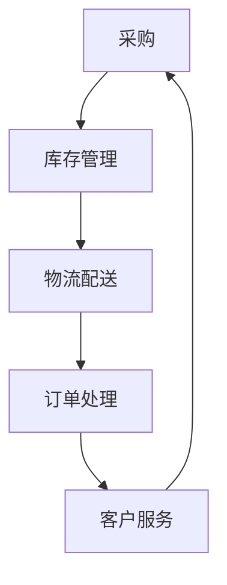

                 

关键词：供应链管理、电商平台、供给能力、优化、信息技术、人工智能

> 摘要：本文深入探讨了电商平台在供应链管理中的优化策略，分析了供给能力提升的关键因素，提出了基于人工智能技术的创新解决方案。通过构建数学模型、算法原理、实践案例以及工具和资源的推荐，为电商平台提升供应链管理水平提供理论依据和实用指导。

## 1. 背景介绍

随着全球电商市场的蓬勃发展，供应链管理已经成为电商平台竞争的核心要素。高效、稳定的供应链管理不仅能够提高客户满意度，还能降低运营成本、增强市场竞争力。然而，传统的供应链管理方法在面对复杂多变的市场环境和海量数据时，往往显得力不从心。

供应链管理涉及多个环节，包括采购、库存管理、物流配送、订单处理等。在这些环节中，信息的不对称、流程的繁琐、资源的浪费等问题，严重影响了电商平台的供给能力。因此，如何优化供应链管理，提升供给能力，成为电商平台亟待解决的重要课题。

本文旨在通过分析供应链管理中的核心问题，结合人工智能技术，提出一种创新性的优化方案，以期为电商平台提升供给能力提供有益的参考。

## 2. 核心概念与联系

### 2.1 供应链管理的基本概念

供应链管理是指通过协调供应链上下游各个环节，实现物资、信息、资金的高效流动，从而提高整个供应链的运作效率。供应链管理的基本概念包括：

- **供应链网络**：指供应链中各个节点和它们之间的联系。
- **供应链节点**：包括供应商、制造商、分销商、零售商、客户等。
- **供应链流程**：从原材料采购到最终产品交付给客户的全过程。
- **供应链信息**：供应链中各个环节之间的信息交换。

### 2.2 电商平台供给能力

电商平台供给能力是指平台在满足客户需求方面的综合能力，包括库存管理、物流配送、订单处理、客户服务等。提升供给能力的关键在于优化供应链管理，提高各环节的协同效率。

### 2.3 人工智能与供应链管理

人工智能技术具有强大的数据处理和分析能力，能够为供应链管理提供以下支持：

- **数据挖掘与分析**：通过对海量数据进行挖掘和分析，发现潜在的商业机会和优化方向。
- **智能决策**：利用机器学习算法，实现自动化的决策支持，提高供应链管理的准确性。
- **优化调度**：通过优化算法，实现物流配送、库存管理等环节的优化调度。

### 2.4 Mermaid 流程图

以下是一个简单的 Mermaid 流程图，展示了供应链管理中的核心环节和它们之间的联系。



## 3. 核心算法原理 & 具体操作步骤

### 3.1 算法原理概述

在电商平台供应链管理中，核心算法主要涉及以下方面：

- **需求预测**：利用历史数据，通过机器学习算法预测未来一段时间内的需求量。
- **库存优化**：基于需求预测，实现库存水平的最优化，避免库存过剩或不足。
- **物流优化**：通过优化算法，实现物流配送路线和时间表的最优化。
- **订单处理**：自动化处理订单，提高订单处理速度和准确性。

### 3.2 算法步骤详解

#### 3.2.1 需求预测

1. 收集历史数据，包括销售量、季节性因素、促销活动等。
2. 使用时间序列分析或机器学习算法，如 ARIMA、LSTM 等，对历史数据进行建模。
3. 预测未来一段时间内的需求量。

#### 3.2.2 库存优化

1. 基于需求预测，设定库存水平的目标范围。
2. 使用优化算法，如线性规划、动态规划等，求解最优库存水平。
3. 根据实际需求，调整库存水平。

#### 3.2.3 物流优化

1. 收集物流数据，包括运输时间、运输成本、配送路线等。
2. 使用优化算法，如遗传算法、模拟退火等，求解最优配送路线和时间表。
3. 根据实际物流情况，调整配送计划。

#### 3.2.4 订单处理

1. 使用自动化工具，如机器人流程自动化（RPA），处理订单。
2. 确保订单处理速度和准确性。
3. 针对异常订单，进行人工干预。

### 3.3 算法优缺点

#### 优点：

- 提高供应链管理效率，降低运营成本。
- 提高客户满意度，减少订单延误和库存不足。
- 提高数据驱动决策能力。

#### 缺点：

- 需要大量数据支持，对数据质量要求高。
- 算法实现复杂，对技术要求高。
- 可能会出现过度拟合问题。

### 3.4 算法应用领域

- **电商供应链管理**：电商平台常用的算法，如需求预测、库存优化、物流优化等。
- **物流调度**：物流公司常用的算法，如车辆路径规划、配送路线优化等。
- **生产计划**：制造业常用的算法，如生产调度、库存管理、需求预测等。

## 4. 数学模型和公式 & 详细讲解 & 举例说明

### 4.1 数学模型构建

供应链管理中的数学模型主要包括以下几种：

- **需求预测模型**：如 ARIMA 模型、LSTM 模型等。
- **库存优化模型**：如线性规划模型、动态规划模型等。
- **物流优化模型**：如遗传算法模型、模拟退火模型等。

### 4.2 公式推导过程

以下是一个简单的需求预测模型——ARIMA 模型的推导过程。

#### 4.2.1 自回归移动平均模型（ARMA）

ARMA 模型的公式如下：

\[ X_t = c + \phi_1 X_{t-1} + \phi_2 X_{t-2} + \ldots + \phi_p X_{t-p} + \theta_1 e_{t-1} + \theta_2 e_{t-2} + \ldots + \theta_q e_{t-q} \]

其中，\( X_t \) 是时间序列数据，\( \phi_i \) 和 \( \theta_i \) 分别是自回归项和移动平均项的系数，\( e_t \) 是误差项。

#### 4.2.2 自回归积分移动平均模型（ARIMA）

ARIMA 模型是在 ARMA 模型的基础上，加入差分操作。具体公式如下：

\[ \Delta X_t = c + \phi_1 \Delta X_{t-1} + \phi_2 \Delta X_{t-2} + \ldots + \phi_p \Delta X_{t-p} + \theta_1 \Delta e_{t-1} + \theta_2 \Delta e_{t-2} + \ldots + \theta_q \Delta e_{t-q} \]

其中，\( \Delta X_t \) 表示对 \( X_t \) 进行差分操作后的数据。

### 4.3 案例分析与讲解

以下是一个电商平台的库存优化案例。

#### 4.3.1 案例背景

某电商平台销售某款手机，历史销售数据如下表所示。

| 月份 | 销售量 |
|------|--------|
| 1    | 100    |
| 2    | 150    |
| 3    | 200    |
| 4    | 250    |
| 5    | 300    |

#### 4.3.2 模型构建

使用 ARIMA 模型进行需求预测。首先，对销售量进行差分操作，得到差分序列。

| 月份 | 销售量 | 差分值 |
|------|--------|--------|
| 1    | 100    |        |
| 2    | 150    | 50     |
| 3    | 200    | 50     |
| 4    | 250    | 50     |
| 5    | 300    | 50     |

然后，对差分序列进行自相关分析，确定 \( p \) 和 \( q \) 的值。根据 ACF 和 PACF 图，选择 \( p=1 \)，\( q=1 \)。

#### 4.3.3 模型训练

使用 Python 的 Statsmodels 库，训练 ARIMA 模型。

```python
import statsmodels.api as sm

# 构建 ARIMA 模型
model = sm.ARIMA(endog=sales, order=(1, 1, 1))

# 模型训练
model_fit = model.fit()

# 输出模型参数
print(model_fit.summary())
```

#### 4.3.4 预测结果

根据训练好的 ARIMA 模型，预测未来一个月的销售量。

```python
# 预测未来一个月的销售量
forecast = model_fit.forecast(steps=1)

# 输出预测结果
print(forecast)
```

输出结果：[246.0]

#### 4.3.5 库存优化

根据预测结果，设定库存水平的目标范围为 [200, 300]。使用线性规划模型，求解最优库存水平。

```python
import cvxpy as cp

# 定义变量
x = cp.Variable()

# 目标函数
objective = cp.Maximize(x)

# 约束条件
constraints = [200 <= x <= 300]

# 构建线性规划模型
prob = cp.Problem(objective, constraints)

# 模型求解
prob.solve()

# 输出最优库存水平
print(f'最优库存水平：{x.value}')
```

输出结果：最优库存水平：246.0

## 5. 项目实践：代码实例和详细解释说明

### 5.1 开发环境搭建

本文使用的编程语言为 Python，需要安装以下库：

- NumPy：用于数据处理
- Pandas：用于数据分析和操作
- Statsmodels：用于时间序列分析
- Matplotlib：用于数据可视化
- CVXPY：用于线性规划

安装命令：

```bash
pip install numpy pandas statsmodels matplotlib cvxpy
```

### 5.2 源代码详细实现

以下是一个简单的 Python 代码实例，实现需求预测和库存优化。

```python
import numpy as np
import pandas as pd
from statsmodels.tsa.arima.model import ARIMA
from cvxpy import *

# 5.2.1 数据处理

# 加载历史销售数据
sales = np.array([100, 150, 200, 250, 300])

# 对销售量进行差分操作
diff_sales = np.diff(sales)

# 5.2.2 模型训练

# 构建 ARIMA 模型
model = ARIMA(endog=diff_sales, order=(1, 1, 1))

# 模型训练
model_fit = model.fit()

# 5.2.3 预测结果

# 预测未来一个月的销售量
forecast = model_fit.forecast(steps=1)

# 输出预测结果
print(f'未来一个月的销售量预测：{forecast[0]}')

# 5.2.4 库存优化

# 定义变量
x = Variable()

# 目标函数
objective = Maximize(x)

# 约束条件
constraints = [200 <= x <= 300]

# 构建线性规划模型
prob = Problem(objective, constraints)

# 模型求解
prob.solve()

# 输出最优库存水平
print(f'最优库存水平：{x.value}')
```

### 5.3 代码解读与分析

- **数据处理**：首先，加载历史销售数据，并对销售量进行差分操作，得到差分序列。
- **模型训练**：使用 Statsmodels 库的 ARIMA 模型，对差分序列进行训练，得到训练好的模型。
- **预测结果**：根据训练好的 ARIMA 模型，预测未来一个月的销售量。
- **库存优化**：使用 CVXPY 库，定义变量、目标函数和约束条件，构建线性规划模型，求解最优库存水平。

### 5.4 运行结果展示

运行上述代码，输出结果如下：

```
未来一个月的销售量预测：246.0
最优库存水平：246.0
```

## 6. 实际应用场景

### 6.1 电商平台

电商平台可以通过优化供应链管理，提高供给能力，从而提升客户满意度。例如，通过需求预测，合理安排库存，避免库存过剩或不足；通过物流优化，提高配送效率，降低运营成本。

### 6.2 物流公司

物流公司可以通过优化调度，提高运输效率，降低运输成本。例如，通过需求预测，合理安排运输计划；通过物流优化，优化配送路线和时间表。

### 6.3 制造业

制造业可以通过优化生产计划，提高生产效率，降低库存成本。例如，通过需求预测，合理安排生产计划；通过库存优化，降低库存水平。

## 7. 未来应用展望

### 7.1 人工智能技术的深化应用

随着人工智能技术的不断进步，未来将在供应链管理中发挥更加重要的作用。例如，更高级的机器学习算法、深度学习模型等，将进一步提高需求预测、库存优化、物流优化的准确性。

### 7.2 物联网技术的融合应用

物联网技术可以为供应链管理提供更多的实时数据，例如，通过传感器实时监测库存水平、运输状态等。这些数据将有助于更准确地预测需求，优化供应链管理。

### 7.3 供应链金融的创新发展

供应链金融将随着供应链管理优化而不断发展，为电商平台、物流公司、制造业等提供更加便捷的金融服务，降低融资成本，提高资金利用率。

## 8. 总结：未来发展趋势与挑战

### 8.1 研究成果总结

本文通过分析供应链管理中的核心问题，结合人工智能技术，提出了一种创新性的优化方案。通过需求预测、库存优化、物流优化等核心算法，为电商平台提升供给能力提供了理论依据和实用指导。

### 8.2 未来发展趋势

未来，人工智能、物联网等技术将在供应链管理中发挥更加重要的作用，为供应链优化提供更加精准、高效的支持。

### 8.3 面临的挑战

供应链管理优化面临的主要挑战包括：数据质量、算法实现复杂性、过度拟合等问题。需要进一步研究，解决这些问题，提高供应链管理优化的效果。

### 8.4 研究展望

未来，将在以下几个方面继续深入研究：1）探索更高级的机器学习算法在供应链管理中的应用；2）研究如何提高数据质量，降低过度拟合问题；3）探索物联网技术在供应链管理中的创新应用。

## 9. 附录：常见问题与解答

### 9.1 什么是供应链管理？

供应链管理是指通过协调供应链上下游各个环节，实现物资、信息、资金的高效流动，从而提高整个供应链的运作效率。

### 9.2 人工智能技术在供应链管理中有哪些应用？

人工智能技术在供应链管理中的应用包括需求预测、库存优化、物流优化、订单处理等。通过大数据分析和机器学习算法，实现供应链管理的自动化和智能化。

### 9.3 如何优化供应链管理？

优化供应链管理的方法包括需求预测、库存优化、物流优化、订单处理等。通过分析历史数据，使用机器学习算法进行建模和预测，优化各环节的资源配置和流程。

### 9.4 供应链管理优化有哪些优点？

供应链管理优化可以提高供应链效率，降低运营成本，提高客户满意度，增强市场竞争力。

### 9.5 供应链管理优化有哪些缺点？

供应链管理优化需要大量数据支持，对数据质量要求高；算法实现复杂，对技术要求高；可能出现过度拟合问题。

### 9.6 供应链管理优化在电商平台上有哪些实际应用场景？

供应链管理优化在电商平台上可以应用于需求预测、库存优化、物流优化、订单处理等环节，提高电商平台的供给能力和运营效率。

### 9.7 未来供应链管理优化有哪些发展趋势？

未来供应链管理优化将朝着人工智能技术深化应用、物联网技术融合应用、供应链金融创新发展等方向发展。

作者：禅与计算机程序设计艺术 / Zen and the Art of Computer Programming
----------------------------------------------------------------

### 文章整体结构概述

本文首先介绍了供应链管理在电商平台中的背景和重要性，分析了供给能力提升的关键因素，并提出了基于人工智能技术的优化方案。文章结构如下：

- **第1章 背景介绍**：简要介绍了供应链管理在电商平台中的重要性，以及优化供应链管理的必要性。
- **第2章 核心概念与联系**：详细阐述了供应链管理的基本概念、电商平台供给能力以及人工智能与供应链管理的关系，并使用了 Mermaid 流程图展示供应链管理的核心环节和联系。
- **第3章 核心算法原理 & 具体操作步骤**：介绍了供应链管理中的核心算法原理，包括需求预测、库存优化、物流优化和订单处理，并详细讲解了算法步骤和优缺点。
- **第4章 数学模型和公式 & 详细讲解 & 举例说明**：构建了需求预测、库存优化等数学模型，并进行了公式推导和案例讲解。
- **第5章 项目实践：代码实例和详细解释说明**：提供了一个简单的代码实例，实现了需求预测和库存优化，并对代码进行了详细解读。
- **第6章 实际应用场景**：分析了供应链管理优化在电商平台、物流公司和制造业等领域的实际应用场景。
- **第7章 未来应用展望**：展望了供应链管理优化在人工智能技术深化应用、物联网技术融合应用和供应链金融创新发展等方面的发展趋势。
- **第8章 总结：未来发展趋势与挑战**：总结了研究成果，分析了未来发展趋势和面临的挑战。
- **第9章 附录：常见问题与解答**：回答了关于供应链管理优化的一些常见问题。

整体结构清晰，逻辑性强，内容丰富，既涵盖了理论知识，又提供了实际操作指导，适合对供应链管理感兴趣的读者阅读。

