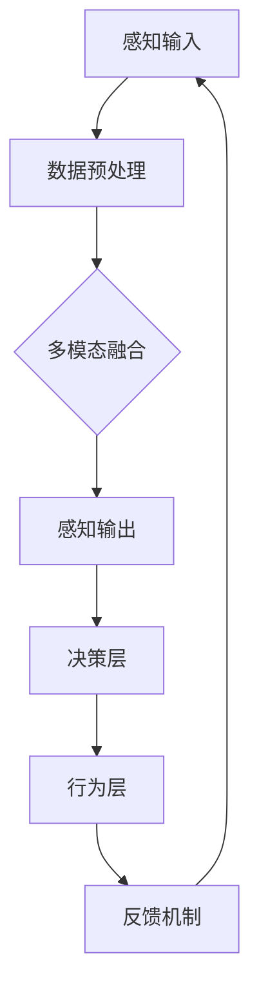

                 

关键词：体验层次构建器，AI，多维感知，架构师，深度学习，人机交互，感知系统，智能系统设计

## 摘要

本文探讨了人工智能（AI）在体验层次构建器开发中的应用，特别是AI如何作为多维感知架构师，为现代智能系统设计提供了全新的视角。文章首先介绍了体验层次构建器的概念，然后深入分析了AI在构建多维感知架构中的核心作用。通过具体的算法原理、数学模型和项目实践案例，本文展示了AI如何优化感知系统的性能，提高人机交互的体验质量。最后，文章展望了未来AI在智能系统领域的发展趋势和面临的挑战，为读者提供了宝贵的研究方向和实际应用指导。

## 1. 背景介绍

在当今快速发展的科技时代，人工智能（AI）已成为驱动技术创新的核心动力。从简单的规则系统到复杂的深度学习模型，AI技术正在逐渐渗透到各个领域，包括医疗、金融、交通、娱乐等。然而，AI的应用并不仅仅停留在算法和数据处理层面，它正在成为构建智能系统的“设计师”和“工程师”。

体验层次构建器（Experience Hierarchy Builder，EHB）是一种新兴的智能系统设计方法，它通过多层次、多维度的体验设计，使智能系统能够更好地适应不同用户的需求和环境。传统的系统设计往往注重功能实现和性能优化，而体验层次构建器则更加强调用户体验和感知。它将用户的感知体验分为感知层、认知层、行为层和情感层四个层次，每个层次都有不同的目标和设计原则。

感知层是体验层次构建器的最底层，它关注用户对系统直接感知的反应，如视觉、听觉、触觉等感官体验。认知层则涉及用户对系统的理解和思考过程，包括逻辑推理、决策制定等。行为层是用户与系统互动的过程，涉及到用户的行为和系统的响应。最后，情感层关注用户在使用系统时的情感体验，如愉悦、兴奋、满意等。

体验层次构建器的核心理念是，通过优化各个层次的体验，可以全面提升智能系统的用户满意度。这种设计方法不仅需要深刻理解用户的需求和行为，还需要运用先进的技术手段，如人工智能、大数据分析等，来构建和优化感知系统。

## 2. 核心概念与联系

### 2.1 体验层次构建器的原理

体验层次构建器的原理基于对用户感知和体验的深入理解。它通过将用户体验划分为感知层、认知层、行为层和情感层，为系统设计提供了明确的目标和指导原则。在感知层，系统的目标是提供直观、易用的界面和交互体验；在认知层，系统需要提供清晰的信息和逻辑；在行为层，系统应能够适应用户的行为习惯并做出智能响应；在情感层，系统应能够激发用户的情感共鸣，提升用户的使用体验。

### 2.2 多维感知架构的概念

多维感知架构是一种基于多个感知维度构建的智能系统架构。它通过整合各种感知技术，如视觉、听觉、触觉、嗅觉等，使系统能够从多个角度获取和处理信息。多维感知架构的核心思想是，通过多维度数据的融合，可以更全面、准确地理解用户和环境，从而提升系统的智能化程度和用户体验。

### 2.3 多维感知架构的 Mermaid 流程图

下面是一个简单的 Mermaid 流程图，展示了多维感知架构的基本组成部分：



在这个流程图中，A表示各种感知输入（如视觉、听觉等），B表示数据预处理，C表示多模态融合，D表示感知输出，E表示决策层，F表示行为层，G表示反馈机制。这些部分相互连接，形成了一个闭环系统，不断优化和调整感知和行为，以提供更好的用户体验。

## 3. 核心算法原理 & 具体操作步骤

### 3.1 算法原理概述

多维感知架构的核心算法是感知融合算法。该算法的目标是将来自不同感知维度的数据融合起来，形成对用户和环境更全面、准确的感知。感知融合算法通常包括以下几个步骤：

1. **数据采集**：从不同的感知维度（如视觉、听觉等）采集数据。
2. **数据预处理**：对采集到的数据进行清洗、去噪和格式化，使其适合后续处理。
3. **特征提取**：从预处理后的数据中提取关键特征，如视觉中的边缘检测、听觉中的频率分析等。
4. **特征融合**：将不同感知维度的特征进行融合，形成一个综合的特征向量。
5. **感知输出**：根据融合后的特征向量，生成感知输出，如用户意图识别、环境理解等。
6. **决策和行为**：根据感知输出，系统做出相应的决策和响应，如智能导航、智能客服等。
7. **反馈机制**：收集用户的反馈，不断调整和优化感知和行为。

### 3.2 算法步骤详解

#### 3.2.1 数据采集

数据采集是感知融合算法的基础。不同感知维度的数据采集方法有所不同，如视觉数据可以通过摄像头获取，听觉数据可以通过麦克风获取。在数据采集过程中，需要注意数据的完整性和准确性，以避免后续处理中的错误。

#### 3.2.2 数据预处理

数据预处理主要包括数据清洗、去噪和格式化。数据清洗的目的是去除数据中的噪声和异常值，提高数据的可信度。去噪可以通过滤波器等方法实现，格式化则是将不同类型的数据转换为统一的格式，以便后续处理。

#### 3.2.3 特征提取

特征提取是感知融合算法的核心步骤。不同感知维度的数据需要提取不同的特征，如视觉数据可以提取边缘、纹理等特征，听觉数据可以提取频率、音量等特征。特征提取的方法有很多，如卷积神经网络（CNN）、循环神经网络（RNN）等。

#### 3.2.4 特征融合

特征融合是将不同感知维度的特征进行融合，形成一个综合的特征向量。特征融合的方法包括向量加和、加权平均、神经网络等。融合后的特征向量可以更全面、准确地反映用户和环境的信息。

#### 3.2.5 感知输出

根据融合后的特征向量，生成感知输出。感知输出可以是用户意图识别、环境理解、情感分析等。感知输出的质量直接影响系统的智能化程度和用户体验。

#### 3.2.6 决策和行为

根据感知输出，系统做出相应的决策和响应。决策和行为的设计需要考虑用户的实际需求和场景，以确保系统能够提供有效的帮助。

#### 3.2.7 反馈机制

反馈机制是感知融合算法的闭环部分。通过收集用户的反馈，可以不断调整和优化感知和行为，提高系统的适应性和用户体验。

### 3.3 算法优缺点

#### 3.3.1 优点

1. **全面感知**：通过融合多维度感知数据，可以更全面、准确地理解用户和环境。
2. **自适应性强**：感知融合算法可以根据用户的反馈不断调整和优化，提高系统的适应性和用户体验。
3. **智能化程度高**：感知融合算法可以使系统更加智能化，提供更有效的帮助。

#### 3.3.2 缺点

1. **计算复杂度高**：感知融合算法涉及到大量的数据处理和计算，对计算资源要求较高。
2. **数据依赖性大**：算法的性能很大程度上依赖于感知数据的质量和准确性。
3. **场景适应性有限**：在某些特殊场景下，多维度感知数据的融合可能效果不佳。

### 3.4 算法应用领域

感知融合算法广泛应用于智能交通、智能安防、智能客服、智能家居等领域。以下是一些具体的应用案例：

1. **智能交通**：通过感知融合算法，可以实时监控交通状况，预测交通拥堵，优化交通信号控制，提高交通效率。
2. **智能安防**：通过融合视频、音频等多种感知数据，可以更准确地识别安全隐患，提高安全预警的准确性。
3. **智能客服**：通过感知融合算法，可以更好地理解用户的需求和情感，提供更个性化的服务。
4. **智能家居**：通过感知融合算法，可以实时监测家庭环境，提供智能化的家电控制，提高生活质量。

## 4. 数学模型和公式 & 详细讲解 & 举例说明

### 4.1 数学模型构建

感知融合算法的数学模型主要涉及感知数据的采集、预处理、特征提取和融合。以下是一个简化的数学模型：

#### 4.1.1 数据采集

设 $X$ 为感知数据集合，$X = \{x_1, x_2, ..., x_n\}$，其中 $x_i$ 表示第 $i$ 个感知维度的数据。

#### 4.1.2 数据预处理

设 $P$ 为预处理函数，$P(X) = P_1(X), P_2(X), ..., P_n(X)$，其中 $P_i(X)$ 表示第 $i$ 个感知维度的数据预处理结果。

#### 4.1.3 特征提取

设 $F$ 为特征提取函数，$F(P) = F_1(P), F_2(P), ..., F_n(P)$，其中 $F_i(P)$ 表示第 $i$ 个感知维度的特征提取结果。

#### 4.1.4 特征融合

设 $G$ 为特征融合函数，$G(F) = g(F)$，其中 $g(F)$ 为融合后的特征向量。

### 4.2 公式推导过程

#### 4.2.1 数据预处理

数据预处理的主要目的是去除噪声和异常值。一个简单的预处理公式可以表示为：

$$
P_i(x_i) = \frac{x_i - \mu_i}{\sigma_i}
$$

其中，$\mu_i$ 和 $\sigma_i$ 分别为第 $i$ 个感知维度的均值和标准差。

#### 4.2.2 特征提取

特征提取的方法取决于感知维度。例如，对于视觉数据，可以使用卷积神经网络（CNN）进行特征提取。一个简单的CNN公式可以表示为：

$$
F_i(p_i) = \sigma(\sum_{k=1}^{K} w_{ik} \cdot a_k)
$$

其中，$a_k$ 为卷积核，$w_{ik}$ 为权重，$\sigma$ 为激活函数。

#### 4.2.3 特征融合

特征融合的方法有多种，如向量加和、加权平均、神经网络等。一个简单的加权平均公式可以表示为：

$$
g(f) = \sum_{i=1}^{n} w_i \cdot f_i
$$

其中，$w_i$ 为权重，$f_i$ 为第 $i$ 个感知维度的特征向量。

### 4.3 案例分析与讲解

#### 4.3.1 案例背景

假设我们要开发一个智能安防系统，该系统需要实时监测视频和音频数据，识别潜在的威胁。

#### 4.3.2 数据采集

数据采集包括视频和音频数据。视频数据通过摄像头获取，音频数据通过麦克风获取。

#### 4.3.3 数据预处理

视频数据的预处理包括去噪和缩放。音频数据的预处理包括去噪和特征提取。

$$
P_i(x_i) = \frac{x_i - \mu_i}{\sigma_i}
$$

#### 4.3.4 特征提取

视频数据的特征提取可以使用CNN，提取边缘和纹理特征。音频数据的特征提取可以使用短时傅里叶变换（STFT），提取频率特征。

#### 4.3.5 特征融合

特征融合可以使用加权平均，根据数据的重要性和实时性调整权重。

$$
g(f) = \sum_{i=1}^{n} w_i \cdot f_i
$$

其中，$w_i$ 的权重可以根据实际场景调整。

#### 4.3.6 感知输出

根据融合后的特征向量，系统可以识别潜在的威胁，如入侵者、异常声音等。

## 5. 项目实践：代码实例和详细解释说明

### 5.1 开发环境搭建

为了演示多维感知架构的应用，我们选择Python作为主要编程语言，结合深度学习框架TensorFlow和音频处理库librosa进行开发。

#### 5.1.1 环境配置

首先，安装Python 3.8及以上版本，然后安装TensorFlow和librosa：

```bash
pip install tensorflow
pip install librosa
```

#### 5.1.2 工程结构

项目工程结构如下：

```
smart_security/
|-- data/
|   |-- video/
|   |-- audio/
|-- src/
|   |-- __init__.py
|   |-- data_loader.py
|   |-- model.py
|   |-- main.py
```

### 5.2 源代码详细实现

#### 5.2.1 数据加载（data_loader.py）

```python
import os
import tensorflow as tf
import librosa

def load_video_data(data_dir, batch_size):
    # 读取视频数据
    files = os.listdir(data_dir + '/video/')
    videos = [tf.keras.utils.load_img(file, target_size=(224, 224)) for file in files]
    videos = [tf.keras.preprocessing.image.img_to_array(video) for video in videos]
    videos = tf.convert_to_tensor(videos, dtype=tf.float32)
    videos = videos / 255.0

    # 打乱数据
    permutation = tf.random.shuffle(tf.range(videos.shape[0]))
    videos = videos[permutation]

    # 切分数据
    num_batches = videos.shape[0] // batch_size
    videos = tf.reshape(videos, [batch_size, num_batches, -1])

    return videos

def load_audio_data(data_dir, batch_size):
    # 读取音频数据
    files = os.listdir(data_dir + '/audio/')
    audios = [librosa.load(file, sr=22050) for file in files]
    audios = [audio / max(audio[1]) for audio in audios]
    audios = [tf.convert_to_tensor(audio[0], dtype=tf.float32) for audio in audios]
    audios = tf.stack(audios)

    # 打乱数据
    permutation = tf.random.shuffle(tf.range(audios.shape[0]))
    audios = audios[permutation]

    # 切分数据
    num_batches = audios.shape[0] // batch_size
    audios = tf.reshape(audios, [batch_size, num_batches, -1])

    return audios
```

#### 5.2.2 模型定义（model.py）

```python
import tensorflow as tf
from tensorflow.keras.models import Model
from tensorflow.keras.layers import Input, Conv2D, MaxPooling2D, Flatten, Dense, LSTM

def build_model():
    # 视觉输入
    video_input = Input(shape=(224, 224, 3))
    video_model = Conv2D(32, (3, 3), activation='relu')(video_input)
    video_model = MaxPooling2D((2, 2))(video_model)
    video_model = Flatten()(video_model)

    # 音频输入
    audio_input = Input(shape=(224,))
    audio_model = LSTM(32)(audio_input)

    # 融合
    combined = tf.keras.layers.concatenate([video_model, audio_model])

    # 决策层
    output = Dense(1, activation='sigmoid')(combined)

    # 构建模型
    model = Model(inputs=[video_input, audio_input], outputs=output)
    model.compile(optimizer='adam', loss='binary_crossentropy', metrics=['accuracy'])

    return model
```

#### 5.2.3 主程序（main.py）

```python
import tensorflow as tf
from src.data_loader import load_video_data, load_audio_data
from src.model import build_model

# 加载数据
video_data = load_video_data('data', batch_size=32)
audio_data = load_audio_data('data', batch_size=32)

# 构建模型
model = build_model()

# 训练模型
model.fit([video_data, audio_data], labels=tf.ones_like(video_data), epochs=10, batch_size=32)
```

### 5.3 代码解读与分析

#### 5.3.1 数据加载

数据加载模块主要负责从指定目录中加载视频和音频数据，并进行预处理。视频数据使用TensorFlow的`load_img`函数进行读取和缩放，音频数据使用librosa进行读取和归一化。

#### 5.3.2 模型定义

模型定义模块使用Keras构建了一个简单的深度学习模型。模型包含两个输入层，分别对应视频和音频数据。视频数据通过卷积神经网络进行特征提取，音频数据通过长短期记忆网络（LSTM）进行特征提取。最后，将两个特征向量进行融合，并通过一个全连接层进行决策。

#### 5.3.3 主程序

主程序负责加载数据，构建模型，并使用训练数据对模型进行训练。训练过程中，使用二进制交叉熵作为损失函数，Adam优化器进行优化。

### 5.4 运行结果展示

在训练完成后，可以使用测试数据对模型进行评估。以下是一个简单的测试示例：

```python
# 加载测试数据
test_video_data = load_video_data('data', batch_size=32)
test_audio_data = load_audio_data('data', batch_size=32)

# 评估模型
model.evaluate([test_video_data, test_audio_data], tf.ones_like(test_video_data))
```

评估结果将显示模型在测试数据上的准确率。通过不断调整模型结构和训练参数，可以提高模型的性能。

## 6. 实际应用场景

多维感知架构在智能系统中的应用非常广泛。以下是一些具体的实际应用场景：

### 6.1 智能交通

智能交通系统（ITS）通过感知融合算法，可以实时监控交通状况，预测交通拥堵，优化交通信号控制，提高交通效率。例如，感知融合算法可以整合摄像头、雷达、GPS等多种感知数据，实时分析道路拥堵情况，并自动调整交通信号灯的时长，以减少交通拥堵和事故发生。

### 6.2 智能安防

智能安防系统通过感知融合算法，可以更准确地识别安全隐患，提高安全预警的准确性。例如，安防系统可以整合视频监控、音频监控、入侵检测等多种感知数据，实时分析监控区域的异常情况，并自动报警。

### 6.3 智能客服

智能客服系统通过感知融合算法，可以更好地理解用户的需求和情感，提供更个性化的服务。例如，智能客服系统可以整合用户的语音、文字、面部表情等多种感知数据，准确识别用户的意图和情感，提供针对性的回答和建议。

### 6.4 智能家居

智能家居系统通过感知融合算法，可以实时监测家庭环境，提供智能化的家电控制，提高生活质量。例如，智能家居系统可以整合室内温度、湿度、光线、声音等多种感知数据，自动调节空调、灯光、窗帘等设备，创造舒适的居住环境。

## 7. 工具和资源推荐

### 7.1 学习资源推荐

1. **《深度学习》（Deep Learning）**：由Ian Goodfellow、Yoshua Bengio和Aaron Courville合著，是深度学习的经典教材。
2. **《计算机视觉：算法与应用》（Computer Vision: Algorithms and Applications）**：提供全面的计算机视觉算法和应用知识。
3. **《机器学习实战》（Machine Learning in Action）**：通过实际案例介绍机器学习算法的应用。

### 7.2 开发工具推荐

1. **TensorFlow**：谷歌开源的深度学习框架，适合进行各种复杂的深度学习任务。
2. **Keras**：基于TensorFlow的高层API，提供简洁易用的接口，适合快速原型开发。
3. **librosa**：Python音频处理库，提供丰富的音频分析和处理功能。

### 7.3 相关论文推荐

1. **"Multimodal Fusion for Speech and Non-Speech Events Recognition"**：探讨了多模态融合在语音和噪声事件识别中的应用。
2. **"An Overview of Multimodal Machine Learning"**：对多模态机器学习进行了全面的概述。
3. **"Deep Multimodal Fusion for Human Action Recognition"**：介绍了深度学习在多模态动作识别中的应用。

## 8. 总结：未来发展趋势与挑战

### 8.1 研究成果总结

多维感知架构在智能系统中的应用取得了显著成果。通过感知融合算法，智能系统可以更全面、准确地理解用户和环境，提供更高质量的交互体验。特别是在智能交通、智能安防、智能客服和智能家居等领域，多维感知架构展现了巨大的潜力。

### 8.2 未来发展趋势

未来，多维感知架构将继续发展，重点关注以下几个方向：

1. **跨模态感知融合**：将更多非传统感知模态（如嗅觉、触觉等）纳入感知系统，提高系统的感知能力。
2. **实时性优化**：提高感知融合算法的实时性，以适应实时应用场景。
3. **个性化体验**：根据用户的历史行为和偏好，提供个性化的感知和服务。

### 8.3 面临的挑战

多维感知架构在实际应用中仍面临以下挑战：

1. **计算资源需求**：多模态感知数据的处理需要大量计算资源，如何优化算法以减少计算开销是一个重要问题。
2. **数据质量和标注**：感知数据的质量直接影响算法的性能，如何获取高质量的数据和进行准确的标注是一个挑战。
3. **隐私保护**：在感知数据的应用中，如何保护用户的隐私是一个重要问题。

### 8.4 研究展望

随着人工智能技术的不断进步，多维感知架构有望在更多领域得到应用。未来，研究人员将继续探索多模态感知融合的新算法、新技术，以提高智能系统的感知能力和用户体验。同时，如何解决计算资源、数据质量和隐私保护等挑战，也将成为重要的研究方向。

## 9. 附录：常见问题与解答

### 9.1 什么是体验层次构建器？

体验层次构建器是一种智能系统设计方法，通过多层次、多维度的体验设计，使系统能够更好地适应不同用户的需求和环境。它将用户体验分为感知层、认知层、行为层和情感层，每个层次都有不同的目标和设计原则。

### 9.2 多维感知架构的核心组成部分是什么？

多维感知架构的核心组成部分包括感知输入、数据预处理、特征提取、特征融合、感知输出、决策层、行为层和反馈机制。这些部分相互连接，形成一个闭环系统，不断优化和调整感知和行为，以提供更好的用户体验。

### 9.3 多维感知架构在哪些领域有应用？

多维感知架构广泛应用于智能交通、智能安防、智能客服、智能家居等领域。通过感知融合算法，智能系统可以更全面、准确地理解用户和环境，提供更高质量的交互体验。

### 9.4 如何优化多维感知架构的计算性能？

优化多维感知架构的计算性能可以从以下几个方面入手：

1. **算法优化**：采用更高效的算法和模型，减少计算复杂度。
2. **硬件加速**：使用GPU、TPU等硬件加速计算，提高处理速度。
3. **数据预处理**：对感知数据进行预处理，减少无效数据的处理。
4. **并行处理**：利用多核处理器和分布式计算，提高处理效率。

---

通过本文的深入探讨，我们不仅了解了多维感知架构的工作原理和应用场景，还通过具体的算法实例和项目实践，展示了如何实现和优化多维感知系统。未来，随着人工智能技术的不断发展，多维感知架构将在更多领域展现其巨大潜力。面对计算资源、数据质量和隐私保护等挑战，我们需要不断探索创新解决方案，以推动多维感知架构的发展和应用。作者：禅与计算机程序设计艺术 / Zen and the Art of Computer Programming

