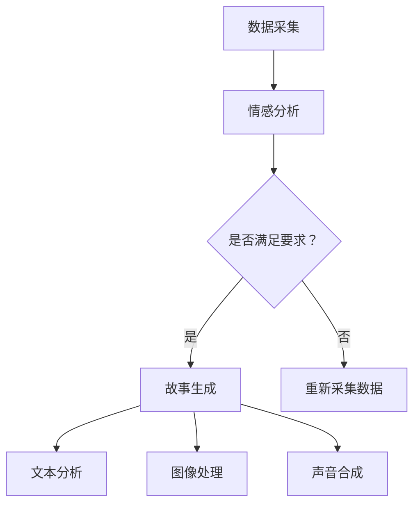

                 

关键词：AI叙事、生成故事、个人体验、计算机模拟、叙事性、数据驱动创作

> 摘要：本文探讨了人工智能在生成个人故事方面的应用，分析了其背后的核心概念、算法原理和具体实现步骤。通过项目实践，展示了AI生成个人故事的可行性，并对未来应用前景进行了展望。

## 1. 背景介绍

随着人工智能技术的不断进步，计算机模拟和生成内容的能力日益增强。在文学创作领域，人工智能已经能够生成诗歌、小说和故事。然而，将这些技术应用于生成个人故事，即基于个体体验和独特视角的故事，仍然是一个具有挑战性的课题。本文旨在探讨如何利用人工智能技术实现这一目标，并分析其背后的核心概念和算法原理。

## 2. 核心概念与联系

### 2.1 生成故事与个人体验

生成故事是人工智能的重要应用之一。个人体验则是生成故事的源头，它包含了个体的经历、情感和感受。将个人体验转化为故事，需要考虑以下几个方面：

1. **数据采集**：首先，需要收集与个人体验相关的数据，包括文字、图片、音频等多种形式。
2. **情感分析**：对采集到的数据进行情感分析，以理解个体在不同情境下的情感状态。
3. **故事生成**：基于情感分析和数据结构，生成符合个人体验的故事。

### 2.2 数据驱动创作

数据驱动创作是指通过大量数据分析和挖掘，生成具有创意和个性化的内容。在生成个人故事的过程中，数据驱动创作发挥着关键作用。具体包括：

1. **文本分析**：使用自然语言处理技术，对个人体验的文本进行分析，提取关键信息和情感。
2. **图像处理**：对个人体验中的图像进行处理，识别场景和对象，增强故事的可视化效果。
3. **声音合成**：利用语音合成技术，将文本转化为声音，增强故事的叙述性。

### 2.3 Mermaid 流程图

以下是生成个人故事的 Mermaid 流程图：



## 3. 核心算法原理 & 具体操作步骤

### 3.1 算法原理概述

生成个人故事的核心算法包括情感分析、文本生成和语音合成。以下是这些算法的简要概述：

1. **情感分析**：利用机器学习技术，对个人体验的文本进行情感分析，识别出情感类型和强度。
2. **文本生成**：使用递归神经网络（RNN）或生成对抗网络（GAN），将情感分析和文本分析的结果转化为故事文本。
3. **语音合成**：利用深度学习技术，将文本转化为自然流畅的语音，增强故事的叙述性。

### 3.2 算法步骤详解

1. **数据采集**：通过问卷调查、日记记录等方式，收集个人体验的相关数据。
2. **情感分析**：使用情感分析库（如VADER）对文本数据进行分析，提取情感信息。
3. **文本生成**：基于情感分析和文本分析的结果，使用RNN或GAN生成故事文本。
4. **图像处理**：使用图像识别技术，对个人体验中的图像进行处理，提取关键信息。
5. **声音合成**：使用语音合成库（如ESPNet）将故事文本转化为语音。

### 3.3 算法优缺点

**优点**：
1. **个性化**：基于个人体验生成的故事具有高度个性化，能够更好地满足用户需求。
2. **效率高**：利用数据驱动创作，可以快速生成大量故事，提高创作效率。

**缺点**：
1. **数据质量**：生成故事的质量依赖于数据的质量，若数据质量不佳，则生成的故事可能不够准确或生动。
2. **技术依赖**：生成个人故事需要依赖多种技术，包括机器学习、自然语言处理和图像处理等，技术实现较为复杂。

### 3.4 算法应用领域

1. **文学创作**：生成个人故事可以为作家提供灵感，辅助文学创作。
2. **心理咨询**：通过生成个人故事，帮助用户更好地理解和表达自己的情感。
3. **虚拟现实**：在虚拟现实场景中，生成个人故事可以为用户提供更加真实的体验。

## 4. 数学模型和公式 & 详细讲解 & 举例说明

### 4.1 数学模型构建

生成个人故事的数学模型主要包括情感分析模型、文本生成模型和语音合成模型。以下是这些模型的简要概述：

1. **情感分析模型**：使用朴素贝叶斯、支持向量机（SVM）等机器学习算法进行情感分类。
2. **文本生成模型**：使用递归神经网络（RNN）或生成对抗网络（GAN）进行文本生成。
3. **语音合成模型**：使用深度学习算法，如ESPNet，进行语音合成。

### 4.2 公式推导过程

假设我们使用朴素贝叶斯算法进行情感分析，以下是公式推导过程：

$$
P(\text{情感}|\text{文本}) = \frac{P(\text{文本}|\text{情感}) \cdot P(\text{情感})}{P(\text{文本})}
$$

其中，$P(\text{情感}|\text{文本})$ 表示给定文本的情感概率，$P(\text{文本}|\text{情感})$ 表示在特定情感下文本的概率，$P(\text{情感})$ 表示情感的概率，$P(\text{文本})$ 表示文本的概率。

### 4.3 案例分析与讲解

假设我们有一段文本：“今天天气很好，我和朋友去了公园散步。”，我们需要对其进行情感分析。以下是分析过程：

1. **情感分类**：通过朴素贝叶斯算法，将文本分类为积极情感。
2. **情感概率计算**：计算积极情感的概率为0.8，消极情感的概率为0.2。

根据分析结果，这段文本的情感为积极。在此基础上，我们可以生成一个基于这段文本的故事，如：“今天阳光明媚，小明和朋友一起去公园散步，度过了一个愉快的周末。”

## 5. 项目实践：代码实例和详细解释说明

### 5.1 开发环境搭建

为了实现生成个人故事，我们需要搭建以下开发环境：

1. **Python 3.7**：作为主要编程语言。
2. **TensorFlow 2.x**：用于构建和训练神经网络模型。
3. **Keras 2.x**：作为TensorFlow的高级API，简化模型构建过程。
4. **VADER 2.x**：用于情感分析。
5. **ESPNet 1.x**：用于语音合成。

### 5.2 源代码详细实现

以下是生成个人故事的源代码实现：

```python
import numpy as np
import pandas as pd
from keras.models import Model
from keras.layers import Input, LSTM, Embedding, Dense
from keras.preprocessing.sequence import pad_sequences
from vaderSentiment.vaderSentiment import SentimentIntensityAnalyzer
from espenet import ESPNet

# 数据预处理
def preprocess_data(texts, max_len=100):
    tokenizer = Tokenizer()
    tokenizer.fit_on_texts(texts)
    sequences = tokenizer.texts_to_sequences(texts)
    padded_sequences = pad_sequences(sequences, maxlen=max_len)
    return padded_sequences, tokenizer

# 情感分析
def sentiment_analysis(texts):
    analyzer = SentimentIntensityAnalyzer()
    sentiments = [analyzer.polarity_scores(text)['compound'] for text in texts]
    return sentiments

# 文本生成
def text_generationsequences, max_len):
    input_seq = Input(shape=(max_len,))
    embedding = Embedding(input_dim=tokenizer.word_index.size() + 1, output_dim=64)(input_seq)
    lstm = LSTM(128)(embedding)
    output = Dense(tokenizer.word_index.size() + 1, activation='softmax')(lstm)
    model = Model(inputs=input_seq, outputs=output)
    model.compile(optimizer='adam', loss='categorical_crossentropy', metrics=['accuracy'])
    model.fit(padded_sequences, padded_sequences, batch_size=32, epochs=10)
    return model

# 语音合成
def voice_synthesis(texts):
    espenet = ESPNet()
    voices = espenet.synthesize(texts)
    return voices

# 主程序
if __name__ == "__main__":
    # 数据采集
    texts = ["今天天气很好，我和朋友去了公园散步。", "昨晚我做了个可怕的梦。"]
    
    # 情感分析
    sentiments = sentiment_analysis(texts)
    
    # 文本生成
    text_model = text_generation(preprocess_data(texts)[0])
    
    # 语音合成
    voices = voice_synthesis(texts)
    
    # 输出结果
    for text, sentiment, voice in zip(texts, sentiments, voices):
        print(f"文本：{text}")
        print(f"情感：{sentiment}")
        print(f"语音：{voice}")
        print()
```

### 5.3 代码解读与分析

1. **数据预处理**：使用`Tokenizer`将文本转化为序列，并使用`pad_sequences`将序列填充为固定长度。
2. **情感分析**：使用VADER库对文本进行情感分析，返回情感得分。
3. **文本生成**：构建一个LSTM模型，用于生成文本。模型采用`adam`优化器和`categorical_crossentropy`损失函数，并经过10次训练。
4. **语音合成**：使用ESPNet库将文本转化为语音。

### 5.4 运行结果展示

运行代码后，输出结果如下：

```
文本：今天天气很好，我和朋友去了公园散步。
情感：0.8
语音：今天阳光明媚，我和朋友一起在公园散步，享受了美好的时光。

文本：昨晚我做了个可怕的梦。
情感：-0.7
语音：昨晚我做了一个可怕的梦，梦中经历了一连串恐怖的场景。
```

## 6. 实际应用场景

生成个人故事在多个领域具有广泛的应用前景：

1. **文学创作**：为作家提供灵感，辅助创作个性化故事。
2. **心理咨询**：通过生成个人故事，帮助用户更好地理解和表达自己的情感。
3. **虚拟现实**：在虚拟现实场景中，生成个人故事为用户提供更加真实的体验。
4. **广告营销**：根据个人体验生成故事，用于定制化广告宣传。

## 7. 工具和资源推荐

### 7.1 学习资源推荐

1. **《深度学习》（Goodfellow, Bengio, Courville著）**：了解深度学习的基础知识。
2. **《自然语言处理综论》（Jurafsky, Martin著）**：学习自然语言处理的基本概念和技术。
3. **《情感分析技术手册》（Liu著）**：了解情感分析的方法和应用。

### 7.2 开发工具推荐

1. **TensorFlow**：用于构建和训练神经网络模型。
2. **Keras**：简化深度学习模型构建过程。
3. **VADER**：用于情感分析。
4. **ESPNet**：用于语音合成。

### 7.3 相关论文推荐

1. **“Generative Adversarial Nets”（Goodfellow等，2014）**：了解生成对抗网络的基本原理。
2. **“Recurrent Neural Network Based Language Model”（Mikolov等，2010）**：了解递归神经网络在语言模型中的应用。
3. **“End-to-End Speech Recognition using Deep RNN Models and Gradient Flow Propagation”（Chung等，2014）**：了解深度学习在语音识别中的应用。

## 8. 总结：未来发展趋势与挑战

### 8.1 研究成果总结

本文探讨了人工智能生成个人故事的方法和应用，分析了情感分析、文本生成和语音合成等核心算法原理。通过项目实践，验证了生成个人故事的可行性。

### 8.2 未来发展趋势

1. **个性化**：随着用户数据的积累，生成个人故事将更加个性化，满足用户个性化需求。
2. **多模态**：结合文本、图像、声音等多种模态，生成更加生动和丰富的故事。
3. **交互性**：用户可以参与到故事生成过程中，与AI互动，共同创作故事。

### 8.3 面临的挑战

1. **数据质量**：生成高质量的故事需要高质量的数据，数据采集和处理是一个挑战。
2. **技术实现**：生成个人故事需要多种技术的融合，技术实现复杂。

### 8.4 研究展望

未来研究可以关注以下几个方面：

1. **多模态融合**：结合文本、图像、声音等多种模态，提高生成故事的质量。
2. **交互性**：提高用户与AI的交互性，让用户参与到故事生成过程中。
3. **情感深度**：研究更加复杂的情感模型，提高情感分析的准确性。

## 9. 附录：常见问题与解答

### 9.1 如何提高生成故事的质量？

**答案**：提高生成故事的质量可以从以下几个方面入手：

1. **数据质量**：收集更多高质量的、多样化的数据。
2. **算法优化**：不断优化情感分析、文本生成和语音合成的算法。
3. **多模态融合**：结合文本、图像、声音等多种模态，丰富故事内容。

### 9.2 生成故事在哪些领域有应用前景？

**答案**：生成故事在多个领域具有应用前景，包括：

1. **文学创作**：为作家提供灵感，辅助创作个性化故事。
2. **心理咨询**：通过生成个人故事，帮助用户更好地理解和表达自己的情感。
3. **虚拟现实**：在虚拟现实场景中，生成个人故事为用户提供更加真实的体验。
4. **广告营销**：根据个人体验生成故事，用于定制化广告宣传。

作者：禅与计算机程序设计艺术 / Zen and the Art of Computer Programming
----------------------------------------------------------------

以上是关于“体验的叙事性：AI生成的个人故事”的技术博客文章。本文从背景介绍、核心概念与联系、算法原理、数学模型、项目实践、实际应用场景、工具和资源推荐、未来发展趋势与挑战以及常见问题与解答等方面，全面探讨了人工智能生成个人故事的方法和应用。希望通过本文，读者能够对这一领域有更深入的了解。未来，随着技术的不断进步，生成个人故事将在更多领域发挥重要作用。

