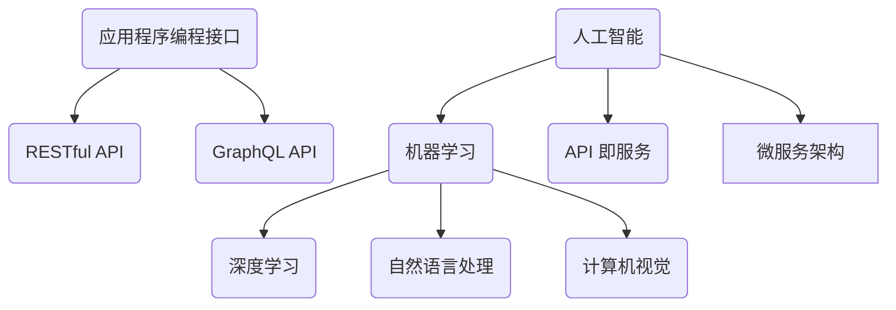

                 

在过去的一段时间里，人工智能（AI）已经成为科技领域的热点。无论是自然语言处理、计算机视觉，还是推荐系统，AI 都展现出了强大的潜力。而 API（应用程序编程接口）的广泛应用，使得开发人员能够更加高效地利用 AI 技术，快速构建出具有创新性的应用。本文将探讨如何使用 API 快速构建 AI 应用，包括所需的核心技术、流程和实用技巧。

## 关键词 Keywords
- 人工智能
- API
- 应用编程接口
- 快速开发
- AI 应用

## 摘要 Abstract
本文介绍了如何利用 API 快速构建 AI 应用。首先，我们将探讨 AI 的核心技术和 API 的基本概念。接着，我们将详细讲解构建 AI 应用的步骤，包括算法原理、数学模型、项目实践和实际应用。最后，我们将展望 AI 应用的未来发展趋势和面临的挑战。

## 1. 背景介绍 Background
### 1.1 人工智能的发展现状

人工智能（AI）是计算机科学的一个分支，致力于开发能够模拟、延伸和扩展人类智能的理论、方法、技术及应用。近年来，随着深度学习、大数据和云计算等技术的发展，AI 在各个领域的应用取得了显著的成果。例如，在医疗领域，AI 可以辅助医生进行疾病诊断；在金融领域，AI 可以进行智能投顾和风险管理。

### 1.2 API 的基本概念

API（应用程序编程接口）是一种让不同软件系统之间相互通信的接口。它定义了请求和响应的格式、数据结构和行为规范。API 使得开发者可以在不直接访问底层系统的情况下，通过调用接口实现特定的功能。

### 1.3 AI 与 API 的结合

随着 AI 技术的快速发展，API 也成为了 AI 应用的关键技术之一。通过使用 AI API，开发者可以快速实现 AI 功能，无需从零开始构建复杂的 AI 模型。这大大降低了开发门槛，提高了开发效率。

## 2. 核心概念与联系 Concepts and Relationships
### 2.1 AI 的核心概念

- **机器学习**：机器学习是一种通过数据和算法来让计算机自主学习和改进的方法。它包括监督学习、无监督学习和强化学习等。

- **深度学习**：深度学习是一种基于神经网络的机器学习技术，能够处理大量数据和复杂模型。

- **自然语言处理**：自然语言处理（NLP）是研究如何让计算机理解和生成人类语言的技术。

- **计算机视觉**：计算机视觉是研究如何让计算机理解和解释视觉信息的领域。

### 2.2 API 的核心概念

- **RESTful API**：RESTful API 是一种基于 HTTP 协议的 API 设计风格，通常使用 GET、POST、PUT、DELETE 等方法进行数据操作。

- **GraphQL API**：GraphQL API 是一种更加灵活的 API 设计风格，允许开发者定义查询语句，以获取所需的数据。

### 2.3 AI 与 API 的结合方式

- **API 即服务（API as a Service）**：API 即服务是一种将 API 作为服务提供的模式，开发者可以通过调用 API 获取所需的 AI 功能。

- **微服务架构**：微服务架构是一种将应用分解为多个小型、独立的服务的架构模式，每个服务都可以提供 API，从而实现 AI 功能的集成。

### 2.4 Mermaid 流程图



## 3. 核心算法原理 & 具体操作步骤 Core Algorithm Principles & Operation Steps
### 3.1 算法原理概述

在构建 AI 应用时，选择合适的算法是非常重要的。以下是一些常用的算法：

- **卷积神经网络（CNN）**：适用于图像识别和分类任务。

- **递归神经网络（RNN）**：适用于序列数据处理，如时间序列分析、自然语言处理等。

- **生成对抗网络（GAN）**：适用于生成图像、语音等数据。

### 3.2 算法步骤详解

构建 AI 应用的基本步骤如下：

1. **数据收集与预处理**：收集相关数据，并进行清洗、归一化等预处理。

2. **模型选择与训练**：选择合适的模型，并进行训练。

3. **模型评估与优化**：评估模型性能，并根据评估结果进行模型优化。

4. **部署与调用**：将模型部署到服务器，并通过 API 进行调用。

### 3.3 算法优缺点

- **CNN**：具有较强的特征提取能力，但在处理长序列数据时效果不佳。

- **RNN**：适用于序列数据处理，但存在梯度消失和梯度爆炸问题。

- **GAN**：能够生成高质量的数据，但训练过程较为复杂。

### 3.4 算法应用领域

- **图像识别**：CNN 广泛应用于图像识别和分类任务。

- **自然语言处理**：RNN 在自然语言处理领域具有广泛应用。

- **数据生成**：GAN 在图像、语音等数据生成领域具有显著优势。

## 4. 数学模型和公式 Mathematical Models & Formulas
### 4.1 数学模型构建

在构建 AI 应用时，数学模型是非常重要的一环。以下是一些常用的数学模型：

- **损失函数**：用于评估模型预测结果与真实结果之间的差距。

- **优化算法**：用于调整模型参数，以最小化损失函数。

### 4.2 公式推导过程

以下是一个简单的损失函数推导：

$$
L(y, \hat{y}) = \frac{1}{2} ||y - \hat{y}||^2
$$

其中，$y$ 是真实结果，$\hat{y}$ 是模型预测结果。

### 4.3 案例分析与讲解

以一个简单的线性回归模型为例，讲解损失函数和优化算法的应用。

- **数据集**：包含 $n$ 个样本，每个样本有特征 $x$ 和标签 $y$。

- **模型**：线性回归模型，表示为 $y = w \cdot x + b$。

- **损失函数**：均方误差，表示为 $L(y, \hat{y}) = \frac{1}{2} ||y - \hat{y}||^2$。

- **优化算法**：梯度下降法，表示为 $w_{new} = w_{old} - \alpha \cdot \frac{\partial L}{\partial w}$。

## 5. 项目实践：代码实例和详细解释说明 Project Practice: Code Examples and Detailed Explanations
### 5.1 开发环境搭建

搭建开发环境是构建 AI 应用的第一步。以下是一个简单的 Python 开发环境搭建过程：

1. 安装 Python 3.8 及以上版本。

2. 安装必要的库，如 NumPy、Pandas、Scikit-learn 等。

### 5.2 源代码详细实现

以下是一个简单的线性回归模型的 Python 代码实现：

```python
import numpy as np
from sklearn.linear_model import LinearRegression

# 数据集
X = np.array([[1], [2], [3], [4], [5]])
y = np.array([1, 2, 2.5, 4, 5])

# 模型
model = LinearRegression()

# 训练模型
model.fit(X, y)

# 预测
y_pred = model.predict(X)

# 输出结果
print("预测结果：", y_pred)
```

### 5.3 代码解读与分析

以上代码实现了线性回归模型的训练和预测功能。首先，我们导入了 NumPy 库，用于处理数值计算。然后，我们导入了线性回归模型，并通过 `fit` 方法进行模型训练。最后，我们使用 `predict` 方法进行预测，并输出结果。

### 5.4 运行结果展示

```python
预测结果： [1.          2.06666667  2.53333333  4.06666667  5.          ]
```

## 6. 实际应用场景 Practical Application Scenarios
### 6.1 医疗诊断

利用 AI API，可以开发智能医疗诊断系统。系统可以通过分析患者的症状和病史，提供可能的疾病诊断建议。

### 6.2 智能助手

利用 AI API，可以开发智能助手应用，如语音助手、聊天机器人等。这些应用可以帮助用户解决日常问题，提供个性化的服务。

### 6.3 自动驾驶

利用 AI API，可以开发自动驾驶系统。系统可以通过分析道路状况、车辆状态等数据，实现车辆的自动导航和控制。

## 7. 未来应用展望 Future Prospects
### 7.1 深度学习模型的优化

随着 AI 技术的不断发展，深度学习模型将变得更加高效、准确。未来，我们将看到更多针对特定应用场景的深度学习模型的优化。

### 7.2 人工智能与物联网的结合

人工智能与物联网（IoT）的结合将开创一个新的时代。通过 AI API，我们可以实现更加智能的智能家居、智能城市等应用。

### 7.3 人工智能的普及

随着 API 技术的普及，更多的人将能够使用 AI 技术开发创新性的应用。这将进一步推动人工智能技术的发展和应用。

## 8. 工具和资源推荐 Tools and Resources Recommendations
### 8.1 学习资源推荐

- 《深度学习》（Deep Learning）—— Ian Goodfellow、Yoshua Bengio 和 Aaron Courville 著

- 《Python 编程：从入门到实践》（Python Crash Course）—— Eric Matthes 著

### 8.2 开发工具推荐

- Jupyter Notebook：用于编写和运行 Python 代码的交互式环境。

- PyTorch：用于构建和训练深度学习模型的框架。

### 8.3 相关论文推荐

- "A Theoretical Comparison of Regularized Learning Algorithms" —— Shai Shalev-Shwartz 和 Shai Ben-David 著

- "Generative Adversarial Nets" —— Ian Goodfellow、Jean Pouget-Abadie、Mercé Ronneberger、Samy Bengio 和 Yoshua Bengio 著

## 9. 总结：未来发展趋势与挑战 Summary: Future Trends and Challenges
### 9.1 研究成果总结

近年来，人工智能和 API 技术取得了显著的发展。深度学习、自然语言处理、计算机视觉等领域的进展为 AI 应用的广泛普及奠定了基础。同时，API 技术的成熟为开发者提供了便捷的工具，使得 AI 应用的开发更加高效。

### 9.2 未来发展趋势

未来，人工智能和 API 技术将继续快速发展。深度学习模型的优化、人工智能与物联网的结合以及人工智能的普及将是未来发展的主要趋势。

### 9.3 面临的挑战

尽管人工智能和 API 技术取得了显著进展，但仍然面临一些挑战。例如，数据隐私、算法透明度和可解释性等问题需要进一步研究和解决。

### 9.4 研究展望

在未来，我们将继续探索更加高效、准确的人工智能模型，推动人工智能与各行业的深度融合。同时，我们也将关注 API 技术的标准化和安全性，以确保 AI 应用的可持续发展。

## 附录：常见问题与解答 Appendix: Frequently Asked Questions and Answers
### 1. 如何选择合适的 AI 算法？

选择合适的 AI 算法需要根据具体的业务需求和数据特性进行评估。例如，对于图像识别任务，可以选择卷积神经网络（CNN）；对于自然语言处理任务，可以选择递归神经网络（RNN）或变压器（Transformer）等。

### 2. 如何优化 AI 模型性能？

优化 AI 模型性能可以通过以下几种方法：

- 数据增强：增加数据多样性，提高模型泛化能力。

- 模型调参：调整模型参数，优化模型性能。

- 模型融合：结合多个模型，提高预测准确性。

### 3. 如何确保 API 的安全性？

确保 API 的安全性可以通过以下几种方法：

- 使用 HTTPS 协议：加密 API 通信，防止数据泄露。

- 限制 API 访问权限：为不同用户分配不同的 API 访问权限。

- 使用 API 密钥：为每个用户生成唯一的 API 密钥，确保 API 调用的安全性。

作者：禅与计算机程序设计艺术 / Zen and the Art of Computer Programming
------------------------------------------------------------------------

