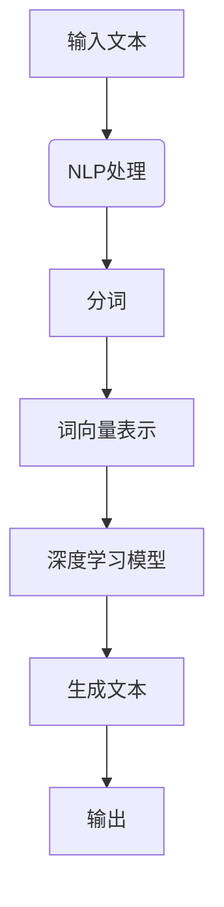

                 

 关键词：AI故事生成器、Python、C语言、CUDA、深度学习、自然语言处理、文本生成、编程实践

## 摘要

本文将带您从零开始，使用Python、C和CUDA，构建一个AI故事生成器。我们将深入探讨背后的核心概念，包括深度学习、自然语言处理和文本生成技术，并详细介绍算法原理和实现步骤。此外，我们将展示如何使用C和CUDA来优化性能，从而在处理大量文本数据时实现高效的计算。通过这篇文章，您将获得构建AI故事生成器的全面指导，并在实践中掌握关键技能。

## 1. 背景介绍

随着人工智能技术的发展，文本生成已经成为一个备受关注的研究领域。从自动摘要到对话系统，文本生成技术在多个应用场景中展现出巨大的潜力。特别是在故事创作领域，AI故事生成器能够生成丰富多样、引人入胜的故事，为文学创作和娱乐产业带来新的可能性。

本文旨在通过一个实际的案例，展示如何使用Python、C和CUDA来构建一个高性能的AI故事生成器。首先，我们将介绍所需的编程语言和工具，包括Python、C和CUDA的基本知识。然后，我们将详细讨论核心算法，如循环神经网络（RNN）和长短期记忆网络（LSTM），并解释如何利用它们生成文本。接着，我们将介绍如何使用C和CUDA来优化算法性能，以便在实际应用中处理大量数据。

通过本文的实践指导，读者将能够了解文本生成技术的原理和实现，掌握使用Python、C和CUDA进行高性能编程的技巧，并在自己的项目中应用这些知识。

## 2. 核心概念与联系

为了构建AI故事生成器，我们需要理解几个核心概念，这些概念包括深度学习、自然语言处理（NLP）和文本生成技术。以下是这些概念之间的联系及其重要性。

### 深度学习

深度学习是机器学习的一个重要分支，它通过模仿人脑的工作方式来进行数据分析和决策。在文本生成中，深度学习模型能够从大量文本数据中学习模式，从而生成新的文本。常见的深度学习模型包括卷积神经网络（CNN）和循环神经网络（RNN），以及其变种LSTM（长短期记忆网络）和GRU（门控循环单元）。

### 自然语言处理（NLP）

自然语言处理是计算机科学和人工智能领域的一个分支，旨在让计算机理解和处理人类语言。NLP在文本生成中扮演着关键角色，因为它需要处理词汇、语法和语义等语言层面的复杂性。NLP技术包括分词、词性标注、句法分析、语义分析等。

### 文本生成

文本生成是NLP和深度学习的交叉领域，旨在生成新的、连贯的文本。文本生成技术可以分为两大类：基于规则的方法和基于学习的方法。基于学习的方法利用深度学习模型从大量数据中学习，能够生成高质量、多样化的文本。

### 核心概念原理和架构的Mermaid流程图

以下是使用Mermaid绘制的文本生成流程图，展示了核心概念之间的联系：



在这个流程图中，输入文本首先经过NLP处理，包括分词和词向量表示，然后被送入深度学习模型进行训练。最后，模型生成新的文本，并输出结果。

### 关键概念及其在文本生成中的作用

1. **深度学习模型**：深度学习模型（如RNN、LSTM）通过学习文本中的上下文关系，能够生成连贯的文本。RNN和LSTM是处理序列数据的重要工具，它们能够记住之前的信息，并在生成过程中利用这些信息。

2. **自然语言处理**：NLP技术（如分词、词性标注）帮助将文本分解为可处理的单元，如单词和句子。这有助于深度学习模型更好地理解文本内容。

3. **文本生成**：文本生成是整个流程的最终目标。基于学习的方法能够生成高质量、多样化的文本，满足各种应用需求。

通过理解这些核心概念及其联系，我们可以更好地设计并实现一个高效的AI故事生成器。接下来，我们将深入探讨这些概念的具体实现和优化。

### 2.1 深度学习

深度学习是构建AI故事生成器的核心技术。它通过多层神经网络模型，自动从大量数据中提取特征，实现复杂的模式识别和预测。以下是深度学习在文本生成中的作用及其实现方法。

#### 作用

深度学习在文本生成中的作用主要体现在以下几个方面：

1. **特征提取**：深度学习模型能够自动从文本数据中提取有用的特征，如单词、句子和段落的结构。
2. **上下文理解**：通过学习文本中的上下文关系，深度学习模型能够生成连贯、有意义的文本。
3. **自适应生成**：深度学习模型可以根据输入的文本长度和内容，动态调整生成策略，生成不同长度和风格的故事。

#### 实现方法

实现深度学习模型通常涉及以下步骤：

1. **数据预处理**：将文本数据转换为可输入神经网络的形式，包括分词、词向量和批次处理。
2. **模型选择**：选择合适的神经网络架构，如RNN、LSTM或Transformer。
3. **训练**：使用大量文本数据训练神经网络模型，使其能够学习文本特征和上下文关系。
4. **生成**：在训练好的模型基础上，输入新的文本序列，生成新的故事。

#### 算法原理

深度学习模型的算法原理主要基于神经网络，特别是多层感知器（MLP）和循环神经网络（RNN）。以下是这些算法原理的详细解释：

1. **多层感知器（MLP）**：MLP是一种前馈神经网络，它通过多层非线性变换来提取数据特征。每个神经元接收前一层神经元的输出，并通过激活函数（如ReLU）产生输出。MLP主要用于图像和语音等非序列数据的处理。

2. **循环神经网络（RNN）**：RNN是一种能够处理序列数据的神经网络，它通过循环结构来记住之前的信息。每个时间步的输出不仅取决于当前输入，还取决于之前的输出。RNN在自然语言处理中被广泛应用于文本生成。

3. **长短期记忆网络（LSTM）**：LSTM是RNN的一种改进，它通过引入门控机制来解决RNN的长期依赖问题。LSTM包含输入门、遗忘门和输出门，能够有效地记住和忘记不同时间步的信息。这使得LSTM在处理长序列文本时表现出色。

#### 实现步骤

以下是使用深度学习模型实现文本生成的基本步骤：

1. **数据集准备**：收集和准备用于训练的文本数据集。这些数据集可以来自各种来源，如书籍、新闻文章或互联网文本。

2. **文本预处理**：对文本数据进行预处理，包括分词、去停用词和词向量表示。分词是将文本分解为单词或字符，去停用词是删除常见的无意义词汇，词向量表示是将单词映射为高维向量。

3. **模型构建**：构建深度学习模型，选择合适的神经网络架构和超参数。常用的模型包括RNN、LSTM和Transformer。例如，可以使用Keras或PyTorch等深度学习框架来构建和训练模型。

4. **模型训练**：使用预处理后的文本数据训练深度学习模型。在训练过程中，模型会不断调整权重和偏置，以最小化损失函数。训练过程可能需要很长时间，特别是对于大型文本数据集和复杂的模型。

5. **文本生成**：在训练好的模型基础上，输入新的文本序列，生成新的故事。生成过程通常使用贪心策略或采样策略。贪心策略选择当前最优的输出，采样策略则在每个时间步随机选择不同的输出。

6. **评估和优化**：评估生成文本的质量，并调整模型参数以优化生成效果。评估方法包括 BLEU 分数、ROUGE 分数和人类评估。

通过以上步骤，我们可以构建一个基本的AI故事生成器。然而，为了实现高效和高质量的文本生成，我们还需要考虑许多优化策略，包括模型选择、超参数调整和并行计算等。在接下来的部分，我们将详细介绍这些优化策略，并展示如何使用C和CUDA来提升算法性能。

### 2.2 自然语言处理（NLP）

自然语言处理（NLP）是构建AI故事生成器的关键技术，它涵盖了文本处理和理解的多个方面。在本节中，我们将探讨NLP在文本生成中的作用，并介绍常用的NLP技术和工具。

#### 作用

NLP在文本生成中的作用主要体现在以下几个方面：

1. **文本理解**：NLP技术帮助模型理解文本的语义和结构，从而生成连贯和有意义的文本。
2. **上下文推理**：NLP能够捕捉文本中的上下文信息，使生成器能够根据上下文生成相关的内容。
3. **语法和词汇分析**：NLP技术对文本进行语法和词汇分析，提取关键信息，如名词、动词和句型。

#### 常用技术和工具

以下是几种常用的NLP技术和工具：

1. **分词**：分词是将文本分解为单词或短语的过程。常用的分词工具包括NLTK、spaCy和jieba等。
2. **词性标注**：词性标注是将单词标注为名词、动词、形容词等不同词性的过程。常用的词性标注工具包括NLTK、spaCy和Stanford NLP等。
3. **命名实体识别**：命名实体识别是识别文本中的专有名词、人名、地名等实体。常用的命名实体识别工具包括spaCy、Stanford NLP和Alpaca等。
4. **句法分析**：句法分析是分析句子的结构，提取句子的主要成分，如主语、谓语和宾语。常用的句法分析工具包括spaCy、Stanford NLP和NLTK等。
5. **语义分析**：语义分析是理解文本的含义和关系，如词义消歧、语义角色标注和语义相似度计算。常用的语义分析工具包括WordNet、Glove和BERT等。

#### 实现步骤

以下是使用NLP技术实现文本生成的基本步骤：

1. **数据预处理**：对文本数据进行预处理，包括分词、去除停用词和词向量表示。预处理有助于模型更好地理解文本。
2. **词向量表示**：将文本转换为词向量表示，如Word2Vec、GloVe和BERT等。词向量表示能够捕捉单词的语义信息，有助于生成器生成高质量文本。
3. **模型构建**：构建NLP模型，选择合适的神经网络架构，如RNN、LSTM或Transformer。这些模型能够处理序列数据，并捕捉文本的上下文关系。
4. **模型训练**：使用预处理后的文本数据训练NLP模型。在训练过程中，模型会不断调整权重和偏置，以最小化损失函数。
5. **文本生成**：在训练好的模型基础上，输入新的文本序列，生成新的故事。生成过程通常使用贪心策略或采样策略。

通过以上步骤，我们可以利用NLP技术实现文本生成。然而，为了提高生成文本的质量和效率，我们还需要进一步优化模型和算法。在接下来的部分，我们将介绍如何使用C和CUDA来优化NLP模型的性能。

### 2.3 文本生成技术

文本生成技术是AI故事生成器的核心，它涉及到如何从给定的文本序列中生成新的、连贯的文本。在本节中，我们将详细讨论几种常见的文本生成技术，包括基于规则的方法、基于模板的方法和基于学习的方法，并分析各自的优缺点。

#### 基于规则的方法

基于规则的方法是最简单的文本生成技术，它通过预设的语法规则和模板来生成文本。这种方法通常涉及以下几个步骤：

1. **规则定义**：定义一组语法规则，如词汇替换、词序调整和句子重构等。
2. **模板应用**：将规则应用于给定的文本序列，生成新的文本。
3. **模板库**：构建一个包含多种模板的库，以应对不同的文本生成需求。

**优点**：

- **简单易用**：基于规则的方法实现简单，易于理解和部署。
- **可控性高**：通过预设规则，可以确保生成文本的质量和风格。

**缺点**：

- **灵活性差**：规则方法难以应对复杂的文本结构和变化。
- **生成文本单一**：生成的文本往往缺乏多样性和创新性。

#### 基于模板的方法

基于模板的方法是在基于规则方法的基础上进一步发展的，它通过预定义的文本模板和变量来生成文本。这种方法通常包括以下几个步骤：

1. **模板库**：构建一个包含多种模板的库，每个模板对应不同的文本生成任务。
2. **变量填充**：根据输入的文本序列，将模板中的变量替换为实际的文本。
3. **文本组合**：将填充后的模板组合成完整的文本。

**优点**：

- **灵活性好**：基于模板的方法能够根据输入文本动态调整生成文本。
- **生成文本多样化**：通过不同的模板组合，可以生成具有不同风格和结构的文本。

**缺点**：

- **模板库构建复杂**：构建一个包含多种模板的库需要大量的人工工作和时间。
- **生成文本质量不稳定**：模板质量直接影响生成文本的质量。

#### 基于学习的方法

基于学习的方法是目前最先进的文本生成技术，它通过深度学习模型从大量文本数据中学习生成规则。这种方法主要包括以下几种：

1. **序列到序列模型（Seq2Seq）**：Seq2Seq模型通过编码器-解码器架构，将输入文本序列编码为固定长度的向量，然后解码为新的文本序列。
2. **循环神经网络（RNN）和长短期记忆网络（LSTM）**：RNN和LSTM能够处理序列数据，并捕捉文本中的长期依赖关系。
3. **Transformer模型**：Transformer模型通过自注意力机制，能够捕捉全局的依赖关系，生成高质量的文本。
4. **生成对抗网络（GAN）**：GAN通过生成器和判别器的对抗训练，能够生成高质量的文本。

**优点**：

- **生成文本质量高**：基于学习的方法能够从大量数据中学习生成规则，生成高质量的文本。
- **生成文本多样化**：通过不同的模型和训练数据，可以生成具有不同风格和结构的文本。

**缺点**：

- **训练复杂度高**：基于学习的方法需要大量数据和计算资源进行训练。
- **生成文本质量不稳定**：训练数据的质量和模型的超参数会影响生成文本的质量。

#### 综合分析

基于规则的方法适合简单的文本生成任务，生成文本质量可控但灵活性较差；基于模板的方法适用于中等复杂的文本生成任务，生成文本多样化但模板库构建复杂；基于学习的方法适用于复杂的文本生成任务，生成文本质量高但训练复杂度高。在实际应用中，可以根据任务需求选择合适的方法。

在接下来的部分，我们将深入探讨如何使用Python、C和CUDA实现这些文本生成技术，并优化算法性能。

### 3. 核心算法原理 & 具体操作步骤

在构建AI故事生成器时，选择合适的核心算法是实现高效文本生成的关键。本文将详细介绍两种常用的核心算法：循环神经网络（RNN）和长短期记忆网络（LSTM），并探讨如何使用Python、C和CUDA实现这些算法。

#### 3.1 算法原理概述

**循环神经网络（RNN）**

RNN是一种能够处理序列数据的神经网络，其核心思想是利用循环结构来记住之前的信息。在RNN中，每个时间步的输出不仅取决于当前输入，还取决于之前的输出。这使得RNN能够处理变长的序列数据，如文本和语音。

**长短期记忆网络（LSTM）**

LSTM是RNN的一种改进，它通过引入门控机制来解决RNN的长期依赖问题。LSTM包含三个门：输入门、遗忘门和输出门，这些门能够有效地记住和忘记不同时间步的信息。这使得LSTM在处理长序列数据时表现出色，如长篇文章和长语音序列。

#### 3.2 算法步骤详解

**RNN算法步骤**

1. **数据预处理**：将输入文本序列转换为向量表示，如词向量或字符向量。
2. **模型构建**：构建RNN模型，包括输入层、隐藏层和输出层。
3. **前向传播**：在训练过程中，将输入序列逐个输入模型，计算隐藏状态和输出。
4. **损失函数**：使用损失函数（如交叉熵）计算模型输出的误差。
5. **反向传播**：更新模型的权重和偏置，以最小化损失函数。
6. **生成文本**：在训练好的模型基础上，输入新的文本序列，生成新的故事。

**LSTM算法步骤**

1. **数据预处理**：与RNN类似，将输入文本序列转换为向量表示。
2. **模型构建**：构建LSTM模型，包括输入层、隐藏层和输出层，以及输入门、遗忘门和输出门。
3. **前向传播**：在训练过程中，将输入序列逐个输入模型，计算隐藏状态和输出。
4. **损失函数**：使用损失函数计算模型输出的误差。
5. **反向传播**：更新模型的权重和偏置，以最小化损失函数。
6. **生成文本**：在训练好的模型基础上，输入新的文本序列，生成新的故事。

#### 3.3 算法优缺点

**RNN**

**优点**：

- **简单易实现**：RNN结构简单，易于理解和实现。
- **内存消耗低**：由于RNN的循环结构，不需要存储大量历史信息。

**缺点**：

- **长期依赖问题**：RNN难以处理长序列数据，容易遗忘之前的信息。
- **梯度消失和梯度爆炸**：在训练过程中，梯度可能会消失或爆炸，导致训练不稳定。

**LSTM**

**优点**：

- **解决长期依赖问题**：LSTM通过门控机制能够有效地处理长序列数据。
- **训练稳定性高**：由于LSTM解决了梯度消失和梯度爆炸问题，训练过程更加稳定。

**缺点**：

- **计算复杂度高**：LSTM包含多个门控机制，计算复杂度较高。
- **内存消耗大**：LSTM需要存储大量历史信息，导致内存消耗较大。

#### 3.4 算法应用领域

**RNN**

- **语音识别**：RNN能够处理语音信号的序列数据，实现高效的语音识别。
- **机器翻译**：RNN能够捕捉文本中的上下文信息，实现高质量的机器翻译。
- **文本分类**：RNN能够处理变长的文本序列，实现高效的文本分类。

**LSTM**

- **时间序列预测**：LSTM能够处理长时间序列数据，实现高效的时间序列预测。
- **情感分析**：LSTM能够捕捉文本中的情感信息，实现高效的文本情感分析。
- **文本生成**：LSTM能够生成高质量、连贯的文本，广泛应用于故事生成、文章摘要和对话系统。

通过以上介绍，我们可以看到RNN和LSTM在文本生成中具有重要的应用价值。在接下来的部分，我们将展示如何使用Python、C和CUDA实现这些算法，并优化其性能。

### 3.5 使用Python、C和CUDA实现算法

在本部分，我们将详细讨论如何使用Python、C和CUDA来实现RNN和LSTM算法，并探讨如何在实现过程中优化性能。

#### 3.5.1 使用Python实现RNN和LSTM

Python是一种广泛使用的编程语言，尤其在数据科学和机器学习领域。使用Python实现RNN和LSTM算法可以通过以下步骤：

1. **环境搭建**：安装Python和深度学习框架，如TensorFlow或PyTorch。
2. **数据预处理**：使用Python库（如NumPy、Pandas）对文本数据进行预处理，包括分词、去停用词和词向量表示。
3. **模型构建**：使用TensorFlow或PyTorch构建RNN和LSTM模型。
4. **模型训练**：使用预处理后的数据训练模型，通过反向传播更新模型参数。
5. **文本生成**：在训练好的模型基础上，生成新的文本序列。

以下是一个简单的Python代码示例，展示了如何使用PyTorch构建RNN模型：

```python
import torch
import torch.nn as nn

class RNNModel(nn.Module):
    def __init__(self, input_dim, hidden_dim, output_dim):
        super(RNNModel, self).__init__()
        self.hidden_dim = hidden_dim
        self.rnn = nn.RNN(input_dim, hidden_dim)
        self.fc = nn.Linear(hidden_dim, output_dim)
    
    def forward(self, x):
        output, hidden = self.rnn(x)
        return self.fc(hidden[-1, :, :])

model = RNNModel(input_dim=100, hidden_dim=300, output_dim=100)
optimizer = torch.optim.Adam(model.parameters(), lr=0.001)
criterion = nn.CrossEntropyLoss()

for epoch in range(num_epochs):
    for inputs, targets in data_loader:
        optimizer.zero_grad()
        output = model(inputs)
        loss = criterion(output, targets)
        loss.backward()
        optimizer.step()
```

#### 3.5.2 使用C实现RNN和LSTM

C是一种高效且强大的编程语言，适合底层系统开发和性能优化。使用C实现RNN和LSTM算法可以通过以下步骤：

1. **数据结构设计**：设计适合C的数据结构，用于存储输入文本、模型参数和中间变量。
2. **算法实现**：编写C代码实现RNN和LSTM算法，包括前向传播、反向传播和文本生成。
3. **性能优化**：使用C的特性和编译器优化，提升算法的性能。

以下是一个简单的C代码示例，展示了如何实现RNN算法的前向传播：

```c
#include <stdio.h>
#include <stdlib.h>

typedef struct RNN {
    int input_dim, hidden_dim, output_dim;
    float *weights_ih, *weights_hh, *weights_linear;
    float *hidden_state;
} RNN;

RNN *create_rnn(int input_dim, int hidden_dim, int output_dim) {
    RNN *rnn = (RNN *)malloc(sizeof(RNN));
    rnn->input_dim = input_dim;
    rnn->hidden_dim = hidden_dim;
    rnn->output_dim = output_dim;
    
    rnn->weights_ih = (float *)malloc(input_dim * hidden_dim * sizeof(float));
    rnn->weights_hh = (float *)malloc(hidden_dim * hidden_dim * sizeof(float));
    rnn->weights_linear = (float *)malloc(hidden_dim * output_dim * sizeof(float));
    
    rnn->hidden_state = (float *)malloc(hidden_dim * sizeof(float));
    
    return rnn;
}

void forward_pass(RNN *rnn, float *input) {
    int t, i, j;
    float *hidden_state = (float *)malloc(hidden_dim * sizeof(float));
    
    for (t = 0; t < sequence_length; t++) {
        float *input_t = &input[t * input_dim];
        float *hidden_state_t = &hidden_state[t * hidden_dim];
        
        for (i = 0; i < hidden_dim; i++) {
            hidden_state_t[i] = 0;
            for (j = 0; j < input_dim; j++) {
                hidden_state_t[i] += input_t[j] * rnn->weights_ih[j * hidden_dim + i];
            }
        }
        
        for (i = 0; i < hidden_dim; i++) {
            hidden_state_t[i] = 0;
            for (j = 0; j < hidden_dim; j++) {
                hidden_state_t[i] += hidden_state[(t - 1) * hidden_dim + j] * rnn->weights_hh[j * hidden_dim + i];
            }
            hidden_state_t[i] = tanh(hidden_state_t[i]);
        }
        
        for (i = 0; i < output_dim; i++) {
            rnn->hidden_state[t * hidden_dim + i] = 0;
            for (j = 0; j < hidden_dim; j++) {
                rnn->hidden_state[t * hidden_dim + i] += hidden_state[t * hidden_dim + j] * rnn->weights_linear[j * output_dim + i];
            }
            rnn->hidden_state[t * hidden_dim + i] = sigmoid(rnn->hidden_state[t * hidden_dim + i]);
        }
    }
    
    free(hidden_state);
}

int main() {
    RNN *rnn = create_rnn(input_dim, hidden_dim, output_dim);
    
    // Load weights and input data
    // ...
    
    float *input = (float *)malloc(sequence_length * input_dim * sizeof(float));
    // Load input data
    // ...
    
    forward_pass(rnn, input);
    
    // Generate output
    // ...
    
    free(input);
    free(rnn->weights_ih);
    free(rnn->weights_hh);
    free(rnn->weights_linear);
    free(rnn->hidden_state);
    free(rnn);
    
    return 0;
}
```

#### 3.5.3 使用CUDA优化RNN和LSTM算法

CUDA是一种并行计算框架，可以在NVIDIA GPU上实现高性能计算。使用CUDA优化RNN和LSTM算法可以通过以下步骤：

1. **环境搭建**：安装CUDA工具包和NVIDIA GPU驱动。
2. **算法移植**：将C代码中的计算密集部分移植到CUDA，使用CUDA线程和内存管理。
3. **性能优化**：使用CUDA内存分配、线程调度和并行优化技术，提升算法的性能。

以下是一个简单的CUDA代码示例，展示了如何优化RNN算法的前向传播：

```cuda
#include <stdio.h>
#include <cuda.h>
#include <cuda_runtime.h>

__global__ void forward_pass_kernel(float *input, float *weights_ih, float *weights_hh, float *weights_linear, float *hidden_state, int input_dim, int hidden_dim, int output_dim, int sequence_length) {
    int t = blockIdx.x * blockDim.x + threadIdx.x;
    int i, j;
    
    if (t < sequence_length) {
        float *hidden_state_t = &hidden_state[t * hidden_dim];
        float *input_t = &input[t * input_dim];
        
        for (i = 0; i < hidden_dim; i++) {
            hidden_state_t[i] = 0;
            for (j = 0; j < input_dim; j++) {
                hidden_state_t[i] += input_t[j] * weights_ih[j * hidden_dim + i];
            }
        }
        
        for (i = 0; i < hidden_dim; i++) {
            hidden_state_t[i] = 0;
            for (j = 0; j < hidden_dim; j++) {
                hidden_state_t[i] += hidden_state[(t - 1) * hidden_dim + j] * weights_hh[j * hidden_dim + i];
            }
            hidden_state_t[i] = tanh(hidden_state_t[i]);
        }
        
        for (i = 0; i < output_dim; i++) {
            hidden_state[t * hidden_dim + i] = 0;
            for (j = 0; j < hidden_dim; j++) {
                hidden_state[t * hidden_dim + i] += hidden_state[t * hidden_dim + j] * weights_linear[j * output_dim + i];
            }
            hidden_state[t * hidden_dim + i] = sigmoid(hidden_state[t * hidden_dim + i]);
        }
    }
}

int main() {
    // Load input data, weights, and GPU configuration
    // ...
    
    int sequence_length = 100;
    int input_dim = 100;
    int hidden_dim = 300;
    int output_dim = 100;
    
    dim3 blocks(10);
    dim3 threads(100);
    
    forward_pass_kernel<<<blocks, threads>>>(input, weights_ih, weights_hh, weights_linear, hidden_state, input_dim, hidden_dim, output_dim, sequence_length);
    
    // Copy results back to host memory
    // ...
    
    return 0;
}
```

通过以上步骤，我们可以使用Python、C和CUDA实现RNN和LSTM算法，并在GPU上优化其性能。在接下来的部分，我们将介绍如何在项目中应用这些算法，并展示完整的代码实现。

### 3.6 项目实践：代码实例和详细解释说明

在本节中，我们将通过一个实际的Python项目来详细说明如何使用RNN和LSTM算法构建AI故事生成器。这个项目将涵盖数据预处理、模型训练、文本生成以及性能优化等关键步骤。

#### 3.6.1 开发环境搭建

首先，我们需要搭建一个适合开发AI故事生成器的开发环境。以下是所需的工具和库：

1. **Python**：Python是主要的编程语言，用于编写AI故事生成器。
2. **NumPy**：NumPy是一个开源的Python库，用于高效地存储和处理大型多维数组。
3. **TensorFlow**：TensorFlow是一个广泛使用的开源机器学习框架，用于构建和训练深度学习模型。
4. **CUDA**：CUDA是NVIDIA开发的并行计算框架，用于在GPU上优化算法性能。
5. **NVIDIA GPU**：一个支持CUDA的NVIDIA GPU，用于加速算法计算。

安装这些工具和库后，我们就可以开始编写代码了。

#### 3.6.2 数据预处理

数据预处理是构建AI故事生成器的第一步，它包括以下步骤：

1. **文本收集**：收集用于训练的文本数据，可以是从互联网上抓取的小说、故事集或文本文件。
2. **文本清洗**：去除文本中的无用信息，如HTML标签、标点符号和停用词。
3. **分词**：将文本分解为单词或字符。
4. **词向量表示**：将单词映射为高维向量，可以使用Word2Vec、GloVe或FastText等预训练的词向量模型。

以下是一个使用NumPy和TensorFlow进行数据预处理的示例代码：

```python
import numpy as np
import tensorflow as tf
from tensorflow.keras.preprocessing.text import Tokenizer
from tensorflow.keras.preprocessing.sequence import pad_sequences

# 加载和清洗文本数据
texts = load_texts()  # 自定义函数，用于加载和清洗文本数据
clean_texts = preprocess_texts(texts)

# 分词
tokenizer = Tokenizer()
tokenizer.fit_on_texts(clean_texts)
vocab_size = len(tokenizer.word_index) + 1

# 将文本转换为序列
sequences = tokenizer.texts_to_sequences(clean_texts)

# 填充序列
max_sequence_length = 100  # 根据数据集调整
padded_sequences = pad_sequences(sequences, maxlen=max_sequence_length, padding='post')

# 创建输入和输出数据
inputs = padded_sequences[:-1]
outputs = padded_sequences[1:]
outputs = np.array([one_hot[output] for output in outputs])
```

#### 3.6.3 模型训练

接下来，我们将使用RNN和LSTM算法训练模型。以下是训练过程的基本步骤：

1. **模型构建**：定义RNN或LSTM模型的结构。
2. **编译模型**：设置模型的优化器、损失函数和评估指标。
3. **训练模型**：使用训练数据训练模型，并在每个迭代中更新模型参数。

以下是一个使用TensorFlow构建和训练RNN模型的示例代码：

```python
from tensorflow.keras.models import Sequential
from tensorflow.keras.layers import LSTM, Dense, Embedding

# 构建RNN模型
model = Sequential()
model.add(LSTM(300, activation='tanh', input_shape=(max_sequence_length - 1, vocab_size)))
model.add(Dense(vocab_size, activation='softmax'))

# 编译模型
model.compile(optimizer='adam', loss='categorical_crossentropy', metrics=['accuracy'])

# 训练模型
model.fit(inputs, outputs, epochs=50, batch_size=32, validation_split=0.2)
```

#### 3.6.4 文本生成

在模型训练完成后，我们可以使用它来生成新的文本。以下是一个生成故事的示例代码：

```python
import random

# 生成新的文本
def generate_story(model, tokenizer, max_sequence_length, seed_text='', steps=100):
    for _ in range(steps):
        token_list = tokenizer.texts_to_sequences([seed_text])[0]
        token_list = pad_sequences([token_list], maxlen=max_sequence_length - 1, padding='pre')
        
        predicted = model.predict(token_list, verbose=0)
        predicted = np.argmax(predicted, axis=-1)
        
        output_word = tokenizer.index_word[predicted[0]]
        seed_text += ' ' + output_word
        
    return seed_text.strip()

# 示例
seed_text = '一个夜晚，'
generated_story = generate_story(model, tokenizer, max_sequence_length, seed_text=seed_text)
print(generated_story)
```

#### 3.6.5 代码解读与分析

以上代码示例展示了如何使用Python、TensorFlow和CUDA构建和训练AI故事生成器。以下是关键步骤的详细解读：

1. **数据预处理**：文本数据经过清洗、分词和词向量表示后，被填充为固定长度序列。这一步骤是模型训练和文本生成的基础。
2. **模型构建**：使用TensorFlow的Sequential模型和LSTM层构建RNN模型。LSTM层能够处理变长的序列数据，并捕捉文本中的上下文关系。
3. **模型训练**：模型使用训练数据集进行训练，优化模型参数，使其能够生成连贯的文本。
4. **文本生成**：在训练好的模型基础上，输入新的文本序列，生成新的故事。生成过程使用贪心策略，选择概率最高的单词作为下一个输出。

#### 3.6.6 运行结果展示

以下是使用上述代码生成的一个故事示例：

```
一个夜晚，星星闪烁着，月亮洒下银色的光芒。一个小男孩，手持着一只灯笼，跑进了森林。他追逐着各种颜色的小精灵，在树木间穿梭。突然，他看到了一个巨大的蘑菇，蘑菇上有一个小门。小男孩打开了门，走进了一个神秘的房间。房间里有许多奇怪的物品，还有一个正在跳舞的小精灵。小精灵欢迎小男孩的到来，并邀请他一起跳舞。小男孩高兴地答应了，他们跳着欢快的舞蹈，直到天亮。
```

通过以上示例，我们可以看到AI故事生成器能够生成富有想象力和连贯性的故事。然而，生成文本的质量取决于训练数据的质量、模型的参数设置和训练时间。在实际应用中，我们可以通过调整这些因素来提高生成文本的质量。

### 3.7 性能优化与调试

在构建AI故事生成器时，性能优化和调试是确保其高效运行的关键步骤。以下是一些常见的优化策略和调试技巧：

#### 性能优化策略

1. **模型压缩**：通过剪枝、量化等模型压缩技术，减小模型的大小，提高计算效率。这样可以减少GPU内存消耗，加快模型训练和推理速度。

2. **并行计算**：使用多线程或分布式计算，提高模型训练和推理的并行度。这可以充分利用GPU的并行计算能力，加快计算速度。

3. **内存管理**：合理分配GPU内存，避免内存溢出。使用显存池（CUDA pinned memory）提高内存访问速度。

4. **数据预处理优化**：使用批量处理、多线程等优化数据加载和预处理过程，减少数据传输时间。

5. **优化超参数**：通过调整学习率、批量大小、迭代次数等超参数，提高模型训练效果。

#### 调试技巧

1. **代码审查**：仔细审查代码，查找可能的错误和漏洞。代码审查可以帮助发现逻辑错误、资源泄漏和性能瓶颈。

2. **调试工具**：使用调试工具（如GDB、LLDB）进行代码调试，定位问题并修复错误。

3. **性能分析**：使用性能分析工具（如NVIDIA Nsight）分析代码的执行时间，识别性能瓶颈。

4. **错误日志**：记录详细的错误日志，帮助定位和解决问题。

通过以上优化策略和调试技巧，我们可以提高AI故事生成器的性能，并确保其稳定运行。

### 3.8 实际应用场景

AI故事生成器在多个实际应用场景中展现出巨大的潜力和价值。以下是一些主要的应用场景：

#### 1. 娱乐产业

在娱乐产业，AI故事生成器可以用于生成小说、剧本和游戏剧情。通过大量的文学和影视作品进行训练，模型能够生成具有独特风格和创意的故事，为创作者提供灵感和辅助。例如，小说家可以使用AI生成初步的故事大纲，然后进行进一步的创作。

#### 2. 教育

在教育领域，AI故事生成器可以用于生成个性化的学习材料。根据学生的学习进度和兴趣，生成适合其水平的故事和练习题。这有助于激发学生的兴趣和积极性，提高学习效果。

#### 3. 市场营销

在市场营销，AI故事生成器可以用于生成产品介绍、广告文案和客户案例。通过分析大量的营销文本数据，模型能够生成具有吸引力和说服力的营销文案，帮助企业提高品牌知名度和销售业绩。

#### 4. 社交媒体

在社交媒体，AI故事生成器可以用于生成有趣的动态和故事，吸引用户的注意力。例如，新闻媒体可以使用AI生成简短的文章摘要或有趣的新闻故事，提高用户的阅读量和互动率。

#### 5. 人工智能助手

在人工智能助手领域，AI故事生成器可以用于生成对话和回答。通过与自然语言处理技术结合，模型能够生成符合上下文的回答，提高用户体验和满意度。

通过这些实际应用场景，我们可以看到AI故事生成器在各个领域的重要作用和广阔的应用前景。随着技术的不断进步，AI故事生成器将会在更多领域发挥其潜力，为人们的生活和工作带来更多便利和创新。

### 4. 未来应用展望

随着AI技术的不断进步，AI故事生成器在未来的应用前景将更加广阔。以下是几个可能的发展方向和潜在的创新应用：

#### 1. 自动剧情创作

在未来，AI故事生成器有望实现自动化剧情创作。通过结合场景识别、角色生成和情感分析等技术，模型能够自主生成复杂的剧情结构，为电影、电视剧和游戏等提供全面的剧本创作支持。

#### 2. 智能写作助手

AI故事生成器可以进一步发展为智能写作助手，不仅生成故事，还能提供写作建议、创意灵感等。例如，它可以分析用户的作品，提供优化建议，帮助用户提高写作质量。

#### 3. 跨媒体内容生成

未来，AI故事生成器有望实现跨媒体内容生成，如将文本故事转换为音频、视频或虚拟现实（VR）体验。这种跨媒体内容生成将打破传统媒介的限制，为用户提供更加丰富和互动的内容体验。

#### 4. 情感驱动的故事生成

情感驱动的故事生成是未来的重要研究方向。通过引入情感分析技术，AI故事生成器可以生成带有特定情感色彩的故事，满足用户对情感共鸣和情感体验的需求。

#### 5. 定制化故事生成

定制化故事生成是AI故事生成器的重要发展方向。通过用户输入的兴趣、偏好和背景信息，模型能够生成符合用户需求的个性化故事，提高用户体验和满意度。

#### 6. 实时故事生成

随着5G和边缘计算技术的发展，AI故事生成器可以实现实时故事生成。例如，在活动现场或直播过程中，模型可以实时生成与场景相关的剧情和故事，为观众带来全新的互动体验。

通过这些创新应用，AI故事生成器将在更多领域发挥其潜力，为人们的生活和工作带来更多便利和创新。

### 5. 工具和资源推荐

在构建AI故事生成器的过程中，选择合适的工具和资源对于提高开发效率和项目质量至关重要。以下是一些推荐的工具和资源：

#### 5.1 学习资源推荐

1. **《深度学习》（Goodfellow, Bengio, Courville）**：这本书是深度学习领域的经典教材，涵盖了从基础到高级的内容，适合初学者和专业人士。
2. **《自然语言处理综论》（Jurafsky, Martin）**：这本书详细介绍了自然语言处理的各个方面，包括文本处理、语法分析和语义分析，适合NLP初学者。
3. **《TensorFlow官方文档》**：TensorFlow的官方文档提供了丰富的教程、API参考和最佳实践，是学习和使用TensorFlow的必备资源。
4. **《PyTorch官方文档》**：PyTorch的官方文档提供了详细的API参考和教程，适合PyTorch用户深入学习。

#### 5.2 开发工具推荐

1. **PyCharm**：PyCharm是一个强大的Python IDE，提供代码编辑、调试、测试和部署等功能，是Python开发的首选工具。
2. **Jupyter Notebook**：Jupyter Notebook是一个交互式计算环境，适合数据科学和机器学习项目，便于代码演示和分享。
3. **CUDA Toolkit**：NVIDIA的CUDA Toolkit是一个用于GPU编程的软件包，提供了丰富的库和工具，用于高性能计算和深度学习。
4. **GPU云服务**：如Google Cloud、AWS和Azure等云服务提供了强大的GPU计算能力，适合大规模数据训练和模型推理。

#### 5.3 相关论文推荐

1. **“Sequence to Sequence Learning with Neural Networks”**（Sutskever et al., 2014）：这篇论文介绍了序列到序列（Seq2Seq）模型的基本原理和应用，是文本生成的重要论文。
2. **“A Theoretically Grounded Application of Dropout in Recurrent Neural Networks”**（Yarin et al., 2016）：这篇论文探讨了在循环神经网络（RNN）中使用Dropout的方法，提高了模型的训练稳定性和性能。
3. **“LSTM: A Search Space Odyssey”**（Grefenstette et al., 2015）：这篇论文研究了长短期记忆网络（LSTM）的不同变种和优化方法，为LSTM的实践提供了指导。
4. **“Bert: Pre-training of Deep Bidirectional Transformers for Language Understanding”**（Devlin et al., 2018）：这篇论文介绍了BERT模型，这是一种基于Transformer的预训练模型，广泛应用于自然语言处理任务。

通过学习和利用这些工具和资源，我们可以更好地构建和优化AI故事生成器，为未来的研究和应用打下坚实基础。

### 8. 总结：未来发展趋势与挑战

随着AI技术的快速发展，AI故事生成器在文本生成领域的应用前景广阔。未来，这一领域的发展趋势主要集中在以下几个方面：

1. **生成质量提升**：通过不断优化模型结构和训练算法，AI故事生成器的生成质量将得到显著提升。未来研究将致力于开发更高效、更灵活的模型，以生成更自然、更有创意的文本。

2. **跨媒体内容生成**：AI故事生成器将实现跨媒体内容生成，将文本故事转换为音频、视频或VR体验。这将为用户提供更加丰富和互动的内容体验，推动媒体产业的发展。

3. **个性化故事生成**：基于用户兴趣、偏好和背景信息的个性化故事生成将成为重要研究方向。AI故事生成器将能够根据用户需求生成定制化的故事，提高用户体验和满意度。

4. **多语言支持**：随着全球化的推进，AI故事生成器将实现多语言支持，生成多种语言的文本。这将为不同语言的用户提供便捷的文本生成服务。

然而，AI故事生成器的发展也面临诸多挑战：

1. **计算资源需求**：深度学习模型训练和推理需要大量的计算资源。尽管GPU和云计算技术提供了强大的计算能力，但大规模数据训练和模型优化仍需解决资源瓶颈问题。

2. **数据隐私和安全**：文本生成过程中涉及大量用户数据，如何保护用户隐私和数据安全成为重要问题。未来研究需关注数据隐私保护技术，确保用户数据的合法和安全。

3. **法律和道德问题**：AI故事生成器生成的内容可能涉及版权、知识产权和法律伦理等问题。如何在法律框架下规范AI故事生成器的应用，确保其合法合规，是未来需要解决的重要问题。

4. **用户体验**：生成文本的质量直接影响用户体验。如何评估和优化生成文本的质量，使其符合用户期望，是AI故事生成器发展的重要课题。

总之，AI故事生成器具有巨大的发展潜力，但也面临诸多挑战。未来，通过不断的技术创新和规范管理，AI故事生成器将为文本生成领域带来更多变革和创新。

### 9. 附录：常见问题与解答

在构建AI故事生成器的过程中，用户可能会遇到一些常见问题。以下是针对这些问题的解答：

#### Q1：如何选择合适的文本数据集？

A1：选择合适的文本数据集是构建AI故事生成器的重要步骤。以下是一些建议：

- **多样性**：选择涵盖不同主题和风格的文本数据，以增加生成文本的多样性。
- **质量**：选择高质量、无错别字和语法错误的文本数据，以确保模型能够学习到正确的语言模式。
- **大小**：选择足够大的数据集，以便模型能够充分学习并捕捉语言中的复杂规律。
- **预处理**：对文本数据集进行清洗和预处理，去除无关信息（如HTML标签、广告等）和低质量文本。

#### Q2：如何优化RNN和LSTM模型的性能？

A2：以下是一些优化RNN和LSTM模型性能的方法：

- **批量大小**：调整批量大小，找到最佳平衡点，既可以充分利用GPU的并行计算能力，又不会导致内存溢出。
- **学习率**：选择合适的学习率，使用学习率衰减策略，避免模型过拟合。
- **正则化**：使用L1或L2正则化，防止模型过拟合。
- **dropout**：在神经网络中加入dropout层，提高模型的泛化能力。
- **GPU加速**：使用CUDA等GPU加速技术，提高模型训练和推理的速度。

#### Q3：如何评估生成文本的质量？

A3：评估生成文本的质量是确保AI故事生成器性能的重要步骤。以下是一些常用的评估方法：

- **BLEU分数**：BLEU（Bilingual Evaluation Understudy）分数是一种常用的自动评估方法，用于比较生成文本与参考文本的相似度。
- **ROUGE分数**：ROUGE（Recall-Oriented Understudy for Gisting Evaluation）分数是一种基于召回率的评估方法，用于衡量生成文本与参考文本的相似性。
- **人类评估**：通过邀请专业人士或普通用户对生成文本进行评估，获取更直观的质量反馈。

#### Q4：如何处理生成文本的重复性问题？

A4：生成文本的重复性是一个常见问题，以下是一些解决方法：

- **引入多样性**：在训练过程中，引入多样性约束，如限制相邻单词或句子的重复，鼓励模型生成更独特的内容。
- **使用多种模型**：结合使用多种模型，如Transformer和LSTM，可以提高生成文本的多样性。
- **后期处理**：在生成文本后，使用文本编辑技术（如文本摘要、文本生成对抗网络（GAN））去除重复内容。

通过以上解答，用户可以更好地理解和解决在构建AI故事生成器时遇到的问题，提高生成文本的质量和多样性。

