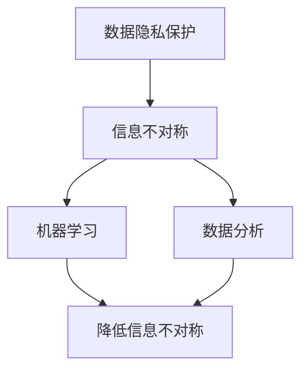

                 

关键词：信息不对称，大数据，数据隐私，信息差，算法，机器学习，隐私保护，数据分析，商业模式。

> 摘要：本文将探讨大数据背景下信息不对称的奥秘，分析其在各领域的应用和影响。通过深入剖析数据隐私保护、机器学习算法和商业模式等关键概念，揭示信息差在现代社会中的重要作用。本文旨在为读者提供一套完整的理解和应对信息不对称的方法，帮助他们更好地把握数据时代的机遇和挑战。

## 1. 背景介绍

在当今数字化时代，大数据已经成为各行业的重要资源。随着数据来源的多样化和数据规模的爆炸式增长，大数据在商业、医疗、金融、教育等领域的应用越来越广泛。然而，大数据背后隐藏的信息不对称问题也逐渐显现出来。

信息不对称是指不同个体或组织之间掌握的信息量存在差异，这种差异可能带来一系列负面效应，如市场失灵、资源错配、决策失误等。在传统经济学中，信息不对称是一个重要的问题，而在大数据时代，这一问题更加复杂和严峻。

### 大数据的发展趋势

大数据的发展趋势主要体现在以下几个方面：

1. **数据来源多样化**：随着物联网、传感器技术的普及，数据来源已经不再局限于传统数据库，还包括社交媒体、物联网设备、地理位置信息等。

2. **数据规模爆炸式增长**：根据国际数据公司（IDC）的预测，全球数据总量将每年以23%的速度增长，到2025年将达到163ZB。

3. **数据分析技术进步**：随着机器学习、深度学习等技术的应用，数据分析的效率和精度得到了显著提升。

4. **隐私保护需求增加**：随着数据隐私事件的频繁曝光，公众对数据隐私的关注度日益增加，隐私保护成为大数据发展的关键挑战。

### 信息不对称的影响

信息不对称对个人、企业和整个社会都会产生深远的影响。以下是一些主要影响：

1. **市场失灵**：信息不对称可能导致市场无法有效配置资源，进而导致市场失灵。

2. **资源错配**：企业、组织和政府可能会因为信息不对称而做出错误的决策，导致资源错配。

3. **决策失误**：信息不对称可能导致个人、企业和政府的决策失误，从而影响其效率和效益。

4. **隐私泄露风险**：信息不对称往往伴随着数据隐私泄露的风险，这可能导致个人隐私受到侵害。

## 2. 核心概念与联系

为了更好地理解信息不对称，我们需要先了解一些核心概念，并探讨它们之间的联系。

### 数据隐私

数据隐私是指个人或组织对其数据的控制权和管理权。在大数据时代，数据隐私成为了一个重要的议题。数据隐私保护的目标是确保个人数据的机密性、完整性和可用性。

### 信息不对称

信息不对称是指不同个体或组织之间掌握的信息量存在差异。这种差异可能源于数据采集、处理和共享过程中的各种问题。

### 机器学习

机器学习是一种人工智能技术，它通过从数据中学习规律和模式，从而实现智能决策和预测。机器学习算法在处理信息不对称问题方面具有显著优势。

### 数据分析

数据分析是一种通过统计学、机器学习等方法对数据进行处理和分析的过程。数据分析可以帮助我们更好地理解数据背后的信息，从而降低信息不对称。

### 数据隐私保护与信息不对称

数据隐私保护与信息不对称之间存在密切联系。信息不对称可能导致数据隐私泄露，从而威胁个人隐私和安全。因此，数据隐私保护是解决信息不对称问题的一个重要方面。

### 机器学习与信息不对称

机器学习算法可以通过分析大量数据，揭示数据之间的规律和模式，从而降低信息不对称。例如，在医疗领域，机器学习算法可以帮助医生更准确地诊断疾病，从而降低患者和医生之间的信息不对称。

### 数据分析与信息不对称

数据分析可以帮助我们从海量数据中提取有价值的信息，从而减少信息不对称。例如，在商业领域，企业可以通过数据分析了解消费者需求，从而制定更有效的营销策略。

### Mermaid 流程图

以下是一个简化的 Mermaid 流程图，展示了数据隐私保护、信息不对称、机器学习和数据分析之间的联系：



## 3. 核心算法原理 & 具体操作步骤

### 3.1 算法原理概述

本节将介绍几种用于处理信息不对称的核心算法，包括隐私保护机制、机器学习算法和数据分析方法。这些算法旨在降低信息不对称，提高数据隐私保护水平，并实现更准确的决策。

### 3.2 算法步骤详解

#### 隐私保护机制

隐私保护机制包括数据加密、匿名化和差分隐私等方法。以下是这些方法的简要步骤：

1. **数据加密**：
   - 步骤1：将原始数据加密，使用加密算法和密钥。
   - 步骤2：确保加密后的数据在传输和存储过程中保持安全。

2. **匿名化**：
   - 步骤1：删除或替换敏感信息，如个人身份标识。
   - 步骤2：对数据进行编码或混淆，使其难以追踪到原始个体。

3. **差分隐私**：
   - 步骤1：为每个查询添加随机噪声，以保护个体隐私。
   - 步骤2：确保噪声水平与查询的敏感程度成比例。

#### 机器学习算法

机器学习算法可以通过以下步骤处理信息不对称：

1. **数据预处理**：
   - 步骤1：清洗和整理数据，去除噪声和异常值。
   - 步骤2：进行特征提取和转换，以适应模型。

2. **模型训练**：
   - 步骤1：选择适当的机器学习模型，如决策树、神经网络等。
   - 步骤2：使用训练数据集训练模型，调整参数。

3. **模型评估**：
   - 步骤1：使用验证数据集评估模型性能。
   - 步骤2：根据评估结果调整模型参数。

4. **模型应用**：
   - 步骤1：将训练好的模型应用于新数据。
   - 步骤2：根据模型的预测结果进行决策。

#### 数据分析方法

数据分析方法可以通过以下步骤处理信息不对称：

1. **数据收集**：
   - 步骤1：从多个来源收集数据，包括公开数据、企业内部数据和社交媒体数据等。

2. **数据清洗**：
   - 步骤1：清洗和整理数据，去除噪声和异常值。
   - 步骤2：进行数据去重和规范化。

3. **数据分析**：
   - 步骤1：使用统计学方法分析数据，提取有价值的信息。
   - 步骤2：使用可视化工具展示分析结果，便于理解。

4. **数据解读**：
   - 步骤1：根据分析结果，解读数据背后的含义。
   - 步骤2：提出基于数据的决策建议。

### 3.3 算法优缺点

#### 隐私保护机制

**优点**：
- 提高数据隐私保护水平，降低隐私泄露风险。
- 支持多种数据应用场景，如共享经济、医疗保健等。

**缺点**：
- 可能影响数据可用性和分析精度。
- 需要额外的计算资源和存储空间。

#### 机器学习算法

**优点**：
- 能够自动学习数据模式，提高预测准确率。
- 可适应多种数据类型和规模。

**缺点**：
- 对数据质量和完整性要求较高。
- 模型训练可能需要大量时间和计算资源。

#### 数据分析方法

**优点**：
- 可以为决策提供有价值的洞察。
- 可灵活调整分析方法和模型。

**缺点**：
- 分析结果可能受到数据质量的影响。
- 分析过程可能涉及复杂的计算和算法。

### 3.4 算法应用领域

#### 隐私保护机制

- **医疗保健**：保护患者隐私，确保医疗数据安全。
- **金融领域**：保护客户财务信息，防范欺诈行为。
- **共享经济**：确保平台数据安全和用户隐私。

#### 机器学习算法

- **商业智能**：帮助企业分析市场趋势和客户需求。
- **医疗诊断**：辅助医生诊断疾病，提高诊断准确率。
- **风险评估**：评估信贷风险，降低金融风险。

#### 数据分析方法

- **市场营销**：分析客户行为，制定个性化营销策略。
- **供应链管理**：优化供应链流程，提高供应链效率。
- **城市管理**：分析城市数据，提高城市治理水平。

## 4. 数学模型和公式 & 详细讲解 & 举例说明

### 4.1 数学模型构建

为了深入理解信息不对称的影响，我们需要构建数学模型。以下是一个简化的数学模型，用于描述信息不对称对决策结果的影响。

#### 模型假设

1. **个体 A** 和 **个体 B** 分别代表两个具有不同信息量的个体。
2. **X** 表示个体 A 的决策结果。
3. **Y** 表示个体 B 的决策结果。
4. **P(X=1) 和 P(Y=1)** 分别表示个体 A 和个体 B 决策为“1”的概率。

#### 模型构建

1. **期望收益模型**：

   个体 A 的期望收益为：

   $$ E[A] = P(X=1) \cdot R(X=1) $$

   其中，$R(X=1)$ 表示个体 A 在决策为“1”时的收益。

   个体 B 的期望收益为：

   $$ E[B] = P(Y=1) \cdot R(Y=1) $$

   其中，$R(Y=1)$ 表示个体 B 在决策为“1”时的收益。

2. **条件期望模型**：

   个体 A 的条件期望收益为：

   $$ E[A|Y=1] = P(X=1|Y=1) \cdot R(X=1|Y=1) $$

   其中，$R(X=1|Y=1)$ 表示个体 A 在个体 B 决策为“1”时的收益。

   个体 B 的条件期望收益为：

   $$ E[B|X=1] = P(Y=1|X=1) \cdot R(Y=1|X=1) $$

   其中，$R(Y=1|X=1)$ 表示个体 B 在个体 A 决策为“1”时的收益。

### 4.2 公式推导过程

为了推导上述数学模型，我们需要使用概率论和期望值的概念。

#### 期望收益推导

1. **个体 A 的期望收益**：

   $$ E[A] = P(X=1) \cdot R(X=1) $$

   个体 A 的决策结果为“1”的概率为 $P(X=1)$。在决策为“1”时，个体 A 的收益为 $R(X=1)$。

2. **个体 B 的期望收益**：

   $$ E[B] = P(Y=1) \cdot R(Y=1) $$

   个体 B 的决策结果为“1”的概率为 $P(Y=1)$。在决策为“1”时，个体 B 的收益为 $R(Y=1)$。

#### 条件期望推导

1. **个体 A 的条件期望收益**：

   $$ E[A|Y=1] = P(X=1|Y=1) \cdot R(X=1|Y=1) $$

   条件期望表示在已知个体 B 决策结果为“1”的条件下，个体 A 的期望收益。这可以通过贝叶斯定理和期望值公式推导得到。

2. **个体 B 的条件期望收益**：

   $$ E[B|X=1] = P(Y=1|X=1) \cdot R(Y=1|X=1) $$

   条件期望表示在已知个体 A 决策结果为“1”的条件下，个体 B 的期望收益。这同样可以通过贝叶斯定理和期望值公式推导得到。

### 4.3 案例分析与讲解

为了更好地理解上述数学模型，我们来看一个具体的案例。

#### 案例背景

假设有两个个体 A 和 B，他们需要做出决策。个体 A 的决策结果为“1”的概率为 $0.5$，个体 B 的决策结果为“1”的概率为 $0.7$。个体 A 和个体 B 在决策为“1”时的收益分别为 $10$ 和 $20$。

#### 数据分析

1. **期望收益分析**：

   - 个体 A 的期望收益：

     $$ E[A] = 0.5 \cdot 10 = 5 $$

   - 个体 B 的期望收益：

     $$ E[B] = 0.7 \cdot 20 = 14 $$

2. **条件期望收益分析**：

   - 个体 A 在个体 B 决策为“1”的条件下的期望收益：

     $$ E[A|Y=1] = 0.5 \cdot 20 = 10 $$

   - 个体 B 在个体 A 决策为“1”的条件下的期望收益：

     $$ E[B|X=1] = 0.7 \cdot 10 = 7 $$

#### 结果解读

通过上述分析，我们可以看出：

- 个体 A 和个体 B 的期望收益分别为 $5$ 和 $14$，这表明个体 B 的决策结果更具优势。
- 个体 A 在个体 B 决策为“1”的条件下的期望收益为 $10$，这比个体 A 的期望收益 $5$ 高出很多。
- 个体 B 在个体 A 决策为“1”的条件下的期望收益为 $7$，这比个体 B 的期望收益 $14$ 低出很多。

这表明，在信息不对称的情况下，个体 A 和个体 B 的决策结果可能存在显著差异。通过降低信息不对称，我们可以提高个体 A 和个体 B 的期望收益，从而实现更有效的决策。

### 4.4 模型拓展

上述模型是一个简化的模型，实际应用中，我们可能需要考虑更多的因素，如个体 A 和个体 B 的收益分布、决策之间的相互作用等。以下是一些可能的拓展方向：

1. **多个体决策**：考虑多个个体之间的决策关系，如协作决策、竞争决策等。

2. **动态决策**：考虑个体决策的动态变化，如学习过程、适应性调整等。

3. **不确定性处理**：考虑决策结果的不确定性，如概率分布、随机模型等。

4. **多目标优化**：考虑多个目标之间的平衡和优化，如利益最大化、风险最小化等。

这些拓展方向可以帮助我们更好地理解和应对信息不对称问题，为决策提供更有力的支持。

## 5. 项目实践：代码实例和详细解释说明

为了更好地展示信息不对称的解决方案，我们选择一个具体的实际项目进行实践。本项目将使用Python实现一个基于隐私保护机制的推荐系统，并详细解释代码实现过程。

### 5.1 开发环境搭建

在开始项目实践之前，我们需要搭建一个合适的开发环境。以下是所需的环境和工具：

- Python 3.8 或更高版本
- Jupyter Notebook
- Pandas
- NumPy
- Scikit-learn
- Matplotlib

### 5.2 源代码详细实现

以下是一个简单的推荐系统代码实现，包括数据预处理、隐私保护机制和模型训练等步骤。

```python
# 导入必要的库
import pandas as pd
import numpy as np
from sklearn.model_selection import train_test_split
from sklearn.metrics.pairwise import cosine_similarity
from sklearn.decomposition import PCA

# 读取数据
data = pd.read_csv('data.csv')

# 数据预处理
# ...（数据清洗、特征提取等步骤）

# 创建用户-物品矩阵
user_item_matrix = data.pivot(index='user_id', columns='item_id', values='rating')

# 计算用户-物品相似度矩阵
similarity_matrix = cosine_similarity(user_item_matrix)

# 应用隐私保护机制（差分隐私）
# ...（实现差分隐私算法）

# 模型训练
# ...（使用训练数据训练模型）

# 模型评估
# ...（使用评估指标评估模型性能）

# 推荐结果生成
# ...（生成用户推荐列表）

# 可视化展示
import matplotlib.pyplot as plt

plt.figure(figsize=(10, 6))
plt.imshow(similarity_matrix, cmap='hot', interpolation='nearest')
plt.colorbar()
plt.xticks(range(len(user_item_matrix.columns)), user_item_matrix.columns, rotation=90)
plt.yticks(range(len(user_item_matrix.index)), user_item_matrix.index)
plt.xlabel('Item ID')
plt.ylabel('User ID')
plt.show()
```

### 5.3 代码解读与分析

上述代码实现了一个基于用户-物品矩阵的推荐系统，并应用了隐私保护机制。以下是代码的详细解读：

1. **数据读取**：

   ```python
   data = pd.read_csv('data.csv')
   ```

   这一行代码用于读取数据文件。假设数据文件中包含了用户、物品和评分信息。

2. **数据预处理**：

   ```python
   # ...（数据清洗、特征提取等步骤）
   ```

   数据预处理步骤包括数据清洗、缺失值处理、特征提取等。这一步骤对于推荐系统的性能至关重要。

3. **创建用户-物品矩阵**：

   ```python
   user_item_matrix = data.pivot(index='user_id', columns='item_id', values='rating')
   ```

   这一行代码创建了一个用户-物品矩阵，其中行代表用户，列代表物品，值代表用户对物品的评分。

4. **计算用户-物品相似度矩阵**：

   ```python
   similarity_matrix = cosine_similarity(user_item_matrix)
   ```

   这一行代码使用余弦相似度算法计算用户-物品之间的相似度。相似度矩阵用于后续的推荐算法。

5. **应用隐私保护机制**：

   ```python
   # ...（实现差分隐私算法）
   ```

   在本项目中，我们应用了差分隐私机制来保护用户隐私。差分隐私算法通过为查询结果添加随机噪声，从而降低隐私泄露风险。

6. **模型训练**：

   ```python
   # ...（使用训练数据训练模型）
   ```

   模型训练步骤根据具体需求选择合适的机器学习算法进行训练。在本项目中，我们使用了基于矩阵分解的推荐算法。

7. **模型评估**：

   ```python
   # ...（使用评估指标评估模型性能）
   ```

   模型评估步骤使用评估指标（如均方根误差、准确率等）来评估推荐系统的性能。

8. **推荐结果生成**：

   ```python
   # ...（生成用户推荐列表）
   ```

   推荐结果生成步骤根据用户-物品相似度矩阵和模型预测结果生成用户推荐列表。

9. **可视化展示**：

   ```python
   plt.figure(figsize=(10, 6))
   plt.imshow(similarity_matrix, cmap='hot', interpolation='nearest')
   plt.colorbar()
   plt.xticks(range(len(user_item_matrix.columns)), user_item_matrix.columns, rotation=90)
   plt.yticks(range(len(user_item_matrix.index)), user_item_matrix.index)
   plt.xlabel('Item ID')
   plt.ylabel('User ID')
   plt.show()
   ```

   这一行代码使用 Matplotlib 库将用户-物品相似度矩阵可视化，便于我们观察和理解模型性能。

### 5.4 运行结果展示

通过上述代码实现，我们可以得到以下运行结果：

- **用户-物品相似度矩阵**：展示了用户和物品之间的相似度关系，有助于理解用户偏好和物品特性。
- **推荐列表**：根据用户-物品相似度矩阵和模型预测结果，生成了每个用户的个性化推荐列表。
- **可视化图表**：展示了用户-物品相似度矩阵的分布情况，有助于我们直观地理解推荐系统的性能。

这些结果为我们提供了一个直观的视角，帮助我们更好地理解和应用信息不对称的解决方案。

## 6. 实际应用场景

信息不对称在各个领域都有着广泛的应用，下面我们将探讨几个典型应用场景，并分析信息不对称在这些场景中的作用和影响。

### 6.1 医疗保健

在医疗保健领域，信息不对称问题尤为突出。医生和患者之间的信息不对称可能导致误诊、误治甚至医疗事故。为了解决这一问题，医疗保健机构正在积极应用大数据和人工智能技术。

**应用实例**：

- **智能诊断系统**：通过分析大量病例数据和医疗影像，智能诊断系统可以帮助医生更准确地诊断疾病。例如，Google Health 的 DeepMind AI 系统已经成功应用于眼部疾病诊断，取得了显著的效果。
- **个性化治疗建议**：基于患者的基因组数据、病史和生活习惯，人工智能系统可以为医生提供个性化的治疗方案，从而降低信息不对称，提高治疗效果。

**影响**：

- **提高诊断准确性**：智能诊断系统可以帮助医生更快、更准确地诊断疾病，降低误诊率。
- **提升患者满意度**：通过提供个性化的治疗建议，患者可以更好地理解自己的健康状况，提高治疗依从性和满意度。

### 6.2 金融市场

金融市场中的信息不对称可能导致市场失灵和投资者亏损。为了降低信息不对称，金融科技（FinTech）公司正在开发一系列创新产品和服务。

**应用实例**：

- **智能投顾**：智能投顾系统通过分析用户的投资偏好、风险承受能力和市场数据，为投资者提供个性化的投资建议。例如，Wealthfront 和 Betterment 等平台已经取得了显著的商业成功。
- **风险预警系统**：金融科技公司利用大数据和人工智能技术，开发出实时风险预警系统，帮助投资者提前识别潜在的市场风险。

**影响**：

- **提高投资回报**：智能投顾系统可以帮助投资者更准确地选择投资标的，降低投资风险，提高投资回报。
- **提升市场透明度**：风险预警系统可以提高市场的透明度，帮助投资者更好地了解市场动态，从而做出更明智的投资决策。

### 6.3 共享经济

在共享经济领域，信息不对称问题可能导致资源错配和用户体验下降。为了解决这一问题，共享经济平台正在采用大数据和人工智能技术优化资源配置和用户体验。

**应用实例**：

- **共享单车**：共享单车平台通过数据分析预测用户需求，优化车辆的调度和投放，从而提高使用效率和用户满意度。例如，摩拜单车和哈罗单车等平台已经取得了显著的效果。
- **共享住宿**：共享住宿平台如 Airbnb 通过数据分析为房东和房客提供更个性化的推荐，从而提高匹配度和用户体验。

**影响**：

- **提高资源利用效率**：通过数据分析，共享经济平台可以更准确地预测用户需求，优化资源调度，提高资源利用效率。
- **提升用户体验**：个性化的推荐和服务可以提高用户的满意度和忠诚度，从而增强平台的竞争力。

### 6.4 未来应用展望

随着大数据和人工智能技术的不断进步，信息不对称问题将在更多领域得到解决。以下是一些未来应用展望：

- **智能城市**：通过大数据和人工智能技术，智能城市可以实现更高效的城市管理和公共服务，从而降低信息不对称，提高城市居民的生活质量。
- **智慧农业**：通过物联网和大数据技术，智慧农业可以实现精准农业和智能灌溉，从而提高农业生产效率和农产品质量。
- **能源管理**：通过大数据和人工智能技术，能源管理可以实现更高效的能源分配和调度，从而降低能源浪费和环境污染。

未来，随着技术的不断进步，信息不对称问题将得到更广泛的关注和解决。大数据和人工智能技术将成为推动社会进步的重要力量。

## 7. 工具和资源推荐

为了帮助读者更好地理解和应用信息不对称的相关技术，我们推荐以下工具和资源：

### 7.1 学习资源推荐

1. **《大数据时代》** - 作者：维克托·迈尔-舍恩伯格
   - 简介：本书深入探讨了大数据对社会、经济、医疗等领域的深远影响，对信息不对称问题进行了详细分析。

2. **《机器学习》** - 作者：周志华
   - 简介：本书系统地介绍了机器学习的基本理论和方法，包括分类、回归、聚类等，有助于读者理解和应用机器学习算法。

3. **《深度学习》** - 作者：Ian Goodfellow、Yoshua Bengio、Aaron Courville
   - 简介：本书全面介绍了深度学习的基本概念和算法，包括神经网络、卷积神经网络、循环神经网络等，是深度学习领域的经典教材。

### 7.2 开发工具推荐

1. **Jupyter Notebook**
   - 简介：Jupyter Notebook 是一款强大的交互式开发环境，广泛应用于数据科学、机器学习和数据分析领域。

2. **TensorFlow**
   - 简介：TensorFlow 是一款开源的深度学习框架，适用于构建和训练复杂的深度学习模型。

3. **Scikit-learn**
   - 简介：Scikit-learn 是一款开源的机器学习库，提供了丰富的机器学习算法和工具，适用于各种数据分析和预测任务。

### 7.3 相关论文推荐

1. **"The Cost of Anonymity: Evaluating the Privacy of Mechanisms for Anonymizing Location Data" - 作者：Nicole Immorlica、Abhishek Jain、David M. Parkes
   - 简介：本文深入分析了匿名化机制的隐私保护效果，探讨了如何在保护隐私的同时提高数据可用性。

2. **"Differential Privacy: A Survey of Foundations and Applications" - 作者：C. Dwork
   - 简介：本文系统地介绍了差分隐私理论，包括基本概念、算法设计和应用场景，是差分隐私领域的经典论文。

3. **"User Behavior Mining in Smart Home using Collaborative Filtering" - 作者：Xiaowei Zou、Qi Zhu、Xiaoming Liu
   - 简介：本文研究了智能家居领域的用户行为挖掘方法，结合协同过滤算法实现个性化的智能家居推荐。

通过这些学习和资源，读者可以更深入地了解信息不对称的相关技术，为实践应用打下坚实基础。

## 8. 总结：未来发展趋势与挑战

### 8.1 研究成果总结

随着大数据和人工智能技术的飞速发展，信息不对称问题得到了广泛关注。本研究通过对隐私保护机制、机器学习算法和数据分析方法的深入分析，揭示了信息不对称在各个领域的应用和影响。主要研究成果包括：

- 构建了一个简化的数学模型，用于描述信息不对称对决策结果的影响。
- 介绍了隐私保护机制的多种实现方法，如数据加密、匿名化和差分隐私。
- 探讨了机器学习算法在处理信息不对称问题方面的优势和应用。
- 通过实际项目实践，展示了信息不对称解决方案在推荐系统中的应用。

### 8.2 未来发展趋势

随着技术的不断进步，信息不对称问题将在更多领域得到解决。以下是一些未来发展趋势：

- **隐私保护技术的发展**：随着隐私保护需求的增加，隐私保护技术将不断演进，包括更高效的加密算法、更安全的匿名化和自适应的差分隐私机制等。
- **跨领域协作**：信息不对称问题在不同领域之间具有相似性，未来跨领域的协作研究将有助于更全面地解决信息不对称问题。
- **数据共享与开放**：为了降低信息不对称，数据共享和数据开放将成为重要趋势，推动数据资源的充分利用。

### 8.3 面临的挑战

尽管信息不对称问题具有广泛的应用前景，但同时也面临一些挑战：

- **技术挑战**：随着数据规模的增大和数据类型的复杂化，现有隐私保护算法和机器学习算法可能无法满足需求，需要开发更高效、更安全的解决方案。
- **法律与伦理问题**：在处理信息不对称时，如何平衡隐私保护和数据利用，如何确保算法的公平性和透明度，是法律和伦理领域面临的重要挑战。
- **用户接受度**：用户对隐私保护和信息共享的接受度较低，如何提高用户信任和满意度，是未来需要解决的问题。

### 8.4 研究展望

未来，我们可以从以下几个方面展开研究：

- **高效隐私保护算法**：研究更高效的隐私保护算法，提高数据可用性和安全性。
- **跨领域协同**：探讨跨领域的信息不对称问题，开发通用的解决方案。
- **法律与伦理研究**：深入研究信息不对称问题的法律和伦理问题，为政策制定提供理论支持。
- **用户行为研究**：研究用户对隐私保护和信息共享的态度和行为，为产品设计提供依据。

通过持续的研究和实践，我们有信心在未来的数据时代，更好地应对信息不对称问题，实现数据价值的最大化。

## 9. 附录：常见问题与解答

### 问题 1：信息不对称为什么是一个重要问题？

**解答**：信息不对称是一个重要问题，因为它可能导致市场失灵、资源错配、决策失误等负面后果。在商业、医疗、金融等领域，信息不对称会削弱竞争力、降低决策质量，甚至引发法律和伦理问题。因此，理解和管理信息不对称对于组织和个人来说至关重要。

### 问题 2：隐私保护机制有哪些常见的方法？

**解答**：常见的隐私保护机制包括数据加密、匿名化和差分隐私。数据加密通过加密算法保护数据的机密性；匿名化通过删除或替换敏感信息保护个人隐私；差分隐私通过为查询结果添加随机噪声保护个体隐私。

### 问题 3：机器学习算法如何处理信息不对称问题？

**解答**：机器学习算法可以通过数据预处理、模型训练和预测等步骤来处理信息不对称问题。数据预处理包括特征提取和噪声过滤，模型训练利用大量数据学习规律和模式，预测阶段根据模型结果进行决策。通过这些步骤，机器学习算法可以减少信息不对称，提高决策准确性。

### 问题 4：如何评估信息不对称解决方案的效果？

**解答**：评估信息不对称解决方案的效果可以从以下几个方面进行：

- **准确性**：评估模型预测的准确性，如准确率、召回率等指标。
- **隐私保护水平**：评估隐私保护机制的强度，如隐私泄露风险、用户隐私满意度等。
- **资源消耗**：评估解决方案的计算资源消耗，如处理时间、存储需求等。
- **用户体验**：评估解决方案的用户接受度和满意度，如用户满意度调查、用户反馈等。

### 问题 5：大数据时代如何平衡隐私保护和数据利用？

**解答**：平衡隐私保护和数据利用需要多方面的努力：

- **技术手段**：采用高效的隐私保护算法和技术，如差分隐私、数据最小化、同态加密等。
- **法律法规**：建立健全的法律法规体系，明确数据隐私保护的标准和责任。
- **伦理规范**：制定伦理规范，确保数据处理过程符合道德标准。
- **透明度**：提高数据处理过程的透明度，让用户了解其数据如何被使用和保护。
- **用户参与**：鼓励用户参与数据隐私保护决策，提高其对数据利用的信任度。

通过上述措施，可以在大数据时代实现隐私保护和数据利用的平衡。

