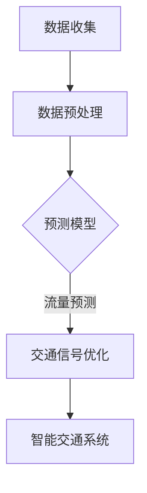

                 

关键词：大数据，交通管理，交通优化，交通预测，智能交通系统

> 摘要：本文探讨了大数据在交通管理中的应用，通过信息差的视角，分析了大数据如何助力交通系统的优化、预测和智能化。文章首先介绍了大数据在交通管理中的背景，随后详细阐述了核心概念、算法原理、数学模型、项目实践以及实际应用场景。最后，文章总结了大数据在交通管理领域的未来发展趋势与挑战，并给出了相关的工具和资源推荐。

## 1. 背景介绍

随着城市化进程的加快，交通拥堵问题日益严重，这不仅影响了居民的日常生活质量，也加剧了能源消耗和环境污染。为了解决这一问题，现代交通管理开始依赖大数据技术，通过分析海量交通数据，以实现交通系统的优化和智能化。大数据技术在交通管理中的应用，可以概括为以下几个方面：

### 1.1 交通流量预测

通过分析历史交通数据，预测未来的交通流量，有助于交通部门提前采取措施，避免交通拥堵。例如，通过对历史车流量数据的分析，可以预测未来某一时间段内的车流量，从而提前调整交通信号灯的配时。

### 1.2 交通优化调度

利用大数据技术，可以对交通路线、交通信号等进行优化调度，提高交通效率。例如，通过实时监测交通状况，动态调整交通信号灯的配时，以减少交通拥堵。

### 1.3 交通事故预防

通过对交通事故数据的分析，可以预测交通事故发生的概率，从而提前采取预防措施。例如，通过对交通事故历史数据的分析，可以识别出交通事故多发路段，并在此类路段上加强监控和警示。

### 1.4 智能交通系统

智能交通系统（Intelligent Transportation Systems，ITS）是利用大数据、人工智能等技术，实现交通信息的收集、处理、分析和应用，从而提升交通系统的智能化水平。例如，智能交通系统可以通过实时监控车辆位置，提供最优行驶路线。

## 2. 核心概念与联系

### 2.1 大数据

大数据是指数据规模巨大、类型多样、生成速度快的数据集。在交通管理中，大数据主要包括交通流量数据、交通事件数据、车辆运行数据、道路信息数据等。

### 2.2 交通流量预测

交通流量预测是指通过分析历史交通数据，预测未来某一时间段内的交通流量。交通流量预测是交通管理的重要环节，可以提高交通效率，减少交通拥堵。

### 2.3 智能交通系统

智能交通系统是利用大数据、人工智能等技术，实现交通信息的收集、处理、分析和应用，从而提升交通系统的智能化水平。

### 2.4 交通信号优化

交通信号优化是指通过分析交通数据，调整交通信号灯的配时，以提高交通效率。交通信号优化是缓解交通拥堵的重要手段。

## 2.5 Mermaid 流程图



## 3. 核心算法原理 & 具体操作步骤

### 3.1 算法原理概述

交通流量预测的核心算法是时间序列分析，主要包括ARIMA模型、LSTM神经网络等。这些算法通过对历史交通数据的分析，提取出时间序列的特征，从而预测未来的交通流量。

### 3.2 算法步骤详解

#### 3.2.1 数据收集

数据收集是交通流量预测的第一步，主要包括以下数据：

- **交通流量数据**：通过交通监控设备，收集不同路段、不同时间点的交通流量数据。
- **交通事件数据**：包括交通事故、道路施工等影响交通的事件数据。
- **车辆运行数据**：通过GPS等设备，收集车辆的运行轨迹数据。

#### 3.2.2 数据预处理

数据预处理是算法模型训练的重要环节，主要包括以下步骤：

- **数据清洗**：去除数据中的噪声和异常值。
- **数据归一化**：将数据缩放到相同的范围，以便于算法模型的训练。
- **特征提取**：从原始数据中提取有用的特征，如交通流量、车辆速度、道路状况等。

#### 3.2.3 预测模型

选择合适的预测模型，如ARIMA模型、LSTM神经网络等，对预处理后的数据进行模型训练。预测模型的选择取决于数据的特点和预测目标。

#### 3.2.4 交通流量预测

利用训练好的预测模型，对未来的交通流量进行预测。预测结果可以用于交通信号优化、交通事故预防等应用。

#### 3.2.5 交通信号优化

根据预测结果，动态调整交通信号灯的配时，以减少交通拥堵。交通信号优化的方法主要包括基于规则的优化和基于学习的优化。

### 3.3 算法优缺点

#### 3.3.1 优点

- **高精度**：基于大数据的预测模型可以准确预测未来的交通流量。
- **实时性**：通过实时数据更新，可以实现交通信号灯的实时优化。
- **智能化**：利用人工智能技术，可以实现交通系统的智能化管理。

#### 3.3.2 缺点

- **计算复杂度高**：大数据处理需要大量计算资源，且预测模型训练时间较长。
- **数据依赖性强**：预测结果的准确性依赖于数据的完整性和准确性。

### 3.4 算法应用领域

交通流量预测算法主要应用于以下领域：

- **城市交通管理**：通过预测交通流量，实现交通信号优化，减少交通拥堵。
- **高速公路管理**：通过预测交通流量，实现高速公路的实时调控，提高通行效率。
- **公共交通调度**：通过预测交通流量，优化公共交通的调度，提高运营效率。

## 4. 数学模型和公式 & 详细讲解 & 举例说明

### 4.1 数学模型构建

交通流量预测的数学模型主要包括时间序列模型和机器学习模型。

#### 4.1.1 时间序列模型

时间序列模型主要包括ARIMA模型、AR模型、MA模型等。其中，ARIMA模型是最常用的时间序列模型。

$$
X_t = c + \phi_1 X_{t-1} + \phi_2 X_{t-2} + ... + \phi_p X_{t-p} + \theta_1 e_{t-1} + \theta_2 e_{t-2} + ... + \theta_q e_{t-q}
$$

其中，$X_t$表示时间序列的当前值，$c$表示常数项，$\phi_1, \phi_2, ..., \phi_p$表示自回归系数，$\theta_1, \theta_2, ..., \theta_q$表示移动平均系数，$e_t$表示误差项。

#### 4.1.2 机器学习模型

机器学习模型主要包括线性回归、决策树、神经网络等。其中，神经网络模型在交通流量预测中具有较好的效果。

$$
y = \sum_{i=1}^{n} w_i x_i + b
$$

其中，$y$表示预测结果，$w_i$表示权重，$x_i$表示特征值，$b$表示偏置。

### 4.2 公式推导过程

以ARIMA模型为例，介绍时间序列模型的公式推导过程。

#### 4.2.1 自回归（AR）模型

自回归模型表示当前值与之前值的线性组合。

$$
X_t = c + \phi_1 X_{t-1} + \phi_2 X_{t-2} + ... + \phi_p X_{t-p}
$$

#### 4.2.2 移动平均（MA）模型

移动平均模型表示当前值与之前值的线性组合。

$$
X_t = \theta_1 e_{t-1} + \theta_2 e_{t-2} + ... + \theta_q e_{t-q}
$$

#### 4.2.3 自回归移动平均（ARMA）模型

自回归移动平均模型结合了自回归模型和移动平均模型。

$$
X_t = c + \phi_1 X_{t-1} + \phi_2 X_{t-2} + ... + \phi_p X_{t-p} + \theta_1 e_{t-1} + \theta_2 e_{t-2} + ... + \theta_q e_{t-q}
$$

#### 4.2.4 自回归积分移动平均（ARIMA）模型

自回归积分移动平均模型是ARMA模型的一般形式，考虑了差分操作。

$$
X_t = c + \phi_1 X_{t-1} + \phi_2 X_{t-2} + ... + \phi_p X_{t-p} + (\theta_1 D(X_{t-1}) + \theta_2 D(X_{t-2}) + ... + \theta_q D(X_{t-q}))
$$

其中，$D(X_t)$表示对时间序列进行一次差分。

### 4.3 案例分析与讲解

以北京市某主干道路段的交通流量预测为例，介绍交通流量预测的案例分析。

#### 4.3.1 数据收集

收集北京市某主干道路段的历史交通流量数据，包括小时交通流量和路段长度等。

#### 4.3.2 数据预处理

对历史交通流量数据进行清洗、归一化和特征提取。

#### 4.3.3 模型选择

选择ARIMA模型进行模型训练，并调整模型参数。

#### 4.3.4 模型训练

利用预处理后的数据，对ARIMA模型进行训练，得到最优参数。

#### 4.3.5 交通流量预测

利用训练好的模型，对未来的交通流量进行预测，并分析预测结果。

#### 4.3.6 交通信号优化

根据预测结果，动态调整交通信号灯的配时，以减少交通拥堵。

## 5. 项目实践：代码实例和详细解释说明

### 5.1 开发环境搭建

搭建Python开发环境，包括安装必要的库和依赖。

```python
pip install numpy pandas matplotlib scikit-learn
```

### 5.2 源代码详细实现

以下是一个基于ARIMA模型的交通流量预测的Python代码示例：

```python
import numpy as np
import pandas as pd
from statsmodels.tsa.arima.model import ARIMA
import matplotlib.pyplot as plt

# 5.2.1 数据收集
# 这里假设已经收集好了历史交通流量数据，存储为CSV文件
data = pd.read_csv('traffic_data.csv')

# 5.2.2 数据预处理
# 数据清洗、归一化等操作略

# 5.2.3 模型选择
model = ARIMA(data['traffic'], order=(5, 1, 2))

# 5.2.4 模型训练
model_fit = model.fit()

# 5.2.5 交通流量预测
forecast = model_fit.forecast(steps=24)[0]

# 5.2.6 运行结果展示
plt.plot(data['timestamp'], data['traffic'], label='实际流量')
plt.plot(pd.date_range(data['timestamp'].max(), periods=24, freq='H'), forecast, label='预测流量')
plt.legend()
plt.show()
```

### 5.3 代码解读与分析

这段代码首先导入必要的库和依赖，然后通过读取CSV文件收集历史交通流量数据。接下来，对数据进行预处理，包括数据清洗、归一化等操作。在模型选择部分，我们使用ARIMA模型，并指定模型参数。随后，利用预处理后的数据对模型进行训练，得到最优参数。最后，利用训练好的模型进行交通流量预测，并将预测结果与实际流量进行比较，以展示预测效果。

## 6. 实际应用场景

### 6.1 城市交通管理

在城市交通管理中，大数据技术可以用于交通流量预测、交通信号优化和交通事故预防等方面。例如，通过预测交通流量，可以实现交通信号灯的实时优化，从而减少交通拥堵。同时，通过对交通事故数据的分析，可以识别出交通事故多发路段，并在此类路段上加强监控和警示，以预防交通事故的发生。

### 6.2 高速公路管理

在高速公路管理中，大数据技术可以用于交通流量预测、交通事故预防和交通信号优化等方面。例如，通过预测交通流量，可以实现高速公路的实时调控，提高通行效率。同时，通过对交通事故数据的分析，可以识别出交通事故多发路段，并在此类路段上加强监控和警示，以预防交通事故的发生。

### 6.3 公共交通调度

在公共交通调度中，大数据技术可以用于交通流量预测、线路优化和车辆调度等方面。例如，通过预测交通流量，可以优化公共交通的调度，提高运营效率。同时，通过对交通数据的分析，可以识别出公共交通线路的瓶颈环节，从而实现线路优化。

## 7. 未来应用展望

### 7.1 自动驾驶

随着自动驾驶技术的发展，大数据在交通管理中的应用前景将更加广阔。通过分析海量交通数据，可以实现自动驾驶车辆的智能调度和实时导航，提高交通安全和效率。

### 7.2 智慧城市

智慧城市的建设离不开大数据技术的支持。大数据在交通管理中的应用，可以帮助实现智慧城市的交通系统，提高城市管理水平和居民生活质量。

### 7.3 低碳交通

大数据技术在交通管理中的应用，有助于实现低碳交通。通过优化交通流量、减少交通拥堵，可以降低能源消耗和环境污染。

## 8. 工具和资源推荐

### 8.1 学习资源推荐

- 《大数据技术导论》：详细介绍了大数据技术的概念、技术和应用。
- 《Python数据分析》：介绍了Python在数据分析领域的应用，包括数据处理、统计分析、机器学习等。

### 8.2 开发工具推荐

- Jupyter Notebook：适合进行数据分析和机器学习的开发环境。
- PyCharm：功能强大的Python集成开发环境。

### 8.3 相关论文推荐

- "Big Data Applications in Intelligent Transportation Systems"：介绍了大数据在智能交通系统中的应用。
- "Real-Time Traffic Prediction Using Big Data Analytics"：探讨了大数据技术在实时交通预测中的应用。

## 9. 总结：未来发展趋势与挑战

### 9.1 研究成果总结

大数据技术在交通管理中的应用已经取得显著成果，如交通流量预测、交通信号优化、交通事故预防等。未来，大数据技术在交通管理中的应用将更加深入和广泛。

### 9.2 未来发展趋势

- **智能化**：随着人工智能技术的发展，大数据在交通管理中的应用将更加智能化。
- **实时性**：未来交通管理将更加依赖实时数据，实现实时预测和实时调控。
- **协同性**：交通管理将与其他领域（如城市规划、环境保护等）实现协同发展。

### 9.3 面临的挑战

- **数据隐私**：大数据技术在交通管理中的应用，需要处理大量敏感数据，如何保护数据隐私是一个重要挑战。
- **计算资源**：大数据处理需要大量计算资源，如何高效利用计算资源是一个挑战。

### 9.4 研究展望

未来，大数据在交通管理中的应用将更加深入，包括交通流量的精细化预测、交通信号的全局优化、交通事故的智能预防等方面。同时，如何应对数据隐私和计算资源等挑战，将是未来研究的重点方向。

## 10. 附录：常见问题与解答

### 10.1 大数据在交通管理中的应用有哪些？

大数据在交通管理中的应用包括交通流量预测、交通信号优化、交通事故预防、智能交通系统等方面。

### 10.2 交通流量预测的算法有哪些？

交通流量预测的算法包括ARIMA模型、LSTM神经网络、时间序列模型等。

### 10.3 如何保护大数据在交通管理中的应用中的数据隐私？

为了保护数据隐私，可以采用数据加密、匿名化处理、数据访问控制等技术手段。

### 10.4 大数据在交通管理中的计算资源如何高效利用？

为了高效利用计算资源，可以采用分布式计算、云计算等技术，实现大数据处理的并行化和高效化。

----------------------------------------------------------------

作者：禅与计算机程序设计艺术 / Zen and the Art of Computer Programming

