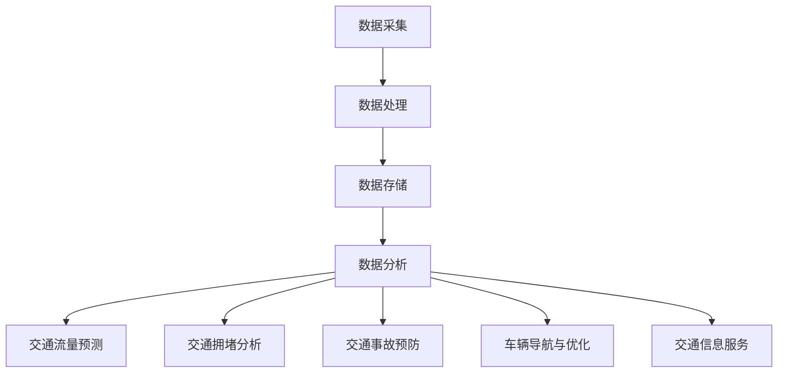

                 

## 1. 背景介绍

随着城市化进程的加速，交通拥堵问题日益严重，已经成为影响城市生活质量的重要因素。传统的交通管理方法，如交通信号灯、道路拓宽和公共交通系统改进等，已经无法满足日益增长的交通需求。在这种情况下，智能交通系统（ITS）应运而生。智能交通系统通过利用先进的传感技术、通信技术、控制技术和计算机技术，实现对交通流量的实时监控、预测和管理，从而提高道路通行效率，减少交通事故，降低能源消耗。

大数据技术在智能交通中的应用，正是为了解决交通系统中的信息不对称问题。信息差是指在交通系统中，交通参与者（如驾驶员、行人、公共交通系统等）之间的信息传递存在障碍，导致交通行为的不协调和效率低下。大数据技术通过收集、存储、分析和处理海量交通数据，为交通参与者提供实时的交通信息，减少信息差，优化交通决策。

本文将深入探讨大数据在智能交通中的应用，首先介绍大数据技术的核心概念和智能交通系统的发展背景，然后分析大数据在智能交通中的核心应用领域，最后讨论大数据技术在智能交通领域的挑战和未来发展方向。

## 2. 核心概念与联系

### 2.1 大数据技术概述

大数据技术是指用于处理海量、多样性和高速生成数据的计算技术和工具。其核心概念包括以下几个方面：

#### 数据量（Volume）

大数据的一个显著特征是数据量大。传统数据库系统通常能够处理的数据量有限，而大数据技术能够处理的数据量可以达到 PB 级别。

#### 数据类型（Variety）

大数据不仅包括结构化数据（如关系数据库中的数据），还包括非结构化数据（如图像、音频、视频等）和半结构化数据（如日志文件、社交媒体数据等）。

#### 数据速度（Velocity）

大数据的产生速度非常快，需要实时或近乎实时地进行处理和分析。

#### 数据真实性（Veracity）

大数据的真实性是另一个重要问题。由于数据来源多样，数据质量参差不齐，因此需要数据清洗和验证技术来确保数据准确性。

### 2.2 智能交通系统概述

智能交通系统（ITS）是指通过应用信息技术、数据通信传输技术、电子传感器技术、控制技术及计算机处理技术等，实现对交通信息的实时采集、处理、传播、分析、利用，从而对交通需求做出快速响应，并作出合理的诱导和调度，以提高交通效率，缓解交通拥堵，改善交通条件，保障交通安全。ITS的主要组成部分包括：

#### 交通监控

通过传感器、摄像头等设备，实时收集道路上的交通流量、速度、密度等信息。

#### 交通信号控制

利用大数据分析结果，优化交通信号灯的配时方案，提高道路通行效率。

#### 智能交通信息服务

通过移动互联网、广播、电子屏幕等渠道，为交通参与者提供实时的交通信息。

#### 自动驾驶技术

结合传感器、人工智能技术，实现车辆自动导航、避障和停车。

### 2.3 大数据与智能交通的联系

大数据与智能交通之间存在密切的联系。大数据为智能交通系统提供了丰富的数据资源，使得交通系统的监控、分析和决策能力得到了极大提升。具体来说，大数据在智能交通中的应用体现在以下几个方面：

#### 交通流量预测

通过对历史交通数据和实时交通数据的分析，预测未来的交通流量，为交通信号控制和交通信息服务提供依据。

#### 交通拥堵分析

通过分析交通流量、速度、密度等数据，识别交通拥堵的成因和区域，为交通管理和优化提供支持。

#### 交通事故预防

通过对交通数据的实时监控和分析，及时发现潜在的交通事故风险，采取预防措施，降低事故发生率。

#### 车辆导航与优化

利用大数据分析结果，为车辆提供最优的导航路径，降低行驶时间和油耗。

#### 交通信息服务

基于大数据分析，为交通参与者提供个性化的交通信息服务，提高出行效率。

### 2.4 Mermaid 流程图

下面是一个展示大数据在智能交通系统中应用流程的 Mermaid 流程图：



在这个流程图中，数据采集是大数据在智能交通中的第一步，随后通过数据处理、数据存储和数据分析，实现对交通流量的预测、交通拥堵分析、交通事故预防、车辆导航与优化以及交通信息服务的支持。

## 3. 核心算法原理 & 具体操作步骤

### 3.1 算法原理概述

大数据在智能交通中的应用，离不开核心算法的支持。以下是几个在智能交通中常用的核心算法及其原理：

#### 3.1.1 交通流量预测算法

交通流量预测算法通过对历史交通数据和实时交通数据的分析，利用时间序列分析、机器学习等方法，预测未来的交通流量。其核心原理是利用历史数据的规律性，结合实时数据的波动，预测未来一段时间内的交通流量。

#### 3.1.2 交通拥堵分析算法

交通拥堵分析算法通过分析交通流量、速度、密度等数据，识别交通拥堵的成因和区域。其核心原理是基于流量、速度和密度的关系，利用数据挖掘和统计方法，找出导致拥堵的关键因素。

#### 3.1.3 交通事故预防算法

交通事故预防算法通过实时监控交通数据，结合交通环境和车辆行为，预测潜在的交通事故风险，并采取预防措施。其核心原理是基于数据驱动和模型预测，利用传感器数据和车辆行为数据，预测潜在的危险场景。

#### 3.1.4 车辆导航与优化算法

车辆导航与优化算法基于大数据分析结果，为车辆提供最优的导航路径。其核心原理是利用路径规划算法，结合实时交通数据和车辆性能数据，计算最优路径，降低行驶时间和油耗。

#### 3.1.5 交通信息服务算法

交通信息服务算法通过大数据分析，为交通参与者提供个性化的交通信息服务。其核心原理是基于用户行为数据和交通数据，利用推荐系统算法，为用户提供实时、准确的交通信息。

### 3.2 算法步骤详解

#### 3.2.1 交通流量预测算法步骤

1. 数据采集：收集历史交通数据和实时交通数据。
2. 数据预处理：对数据进行清洗、去噪和处理，确保数据质量。
3. 特征工程：提取与交通流量相关的特征，如时间、天气、节假日等。
4. 模型训练：利用时间序列分析、机器学习等方法，训练交通流量预测模型。
5. 预测：利用训练好的模型，对未来的交通流量进行预测。

#### 3.2.2 交通拥堵分析算法步骤

1. 数据采集：收集交通流量、速度、密度等数据。
2. 数据预处理：对数据进行清洗、去噪和处理，确保数据质量。
3. 特征工程：提取与交通拥堵相关的特征，如流量、速度、密度等。
4. 模型训练：利用数据挖掘和统计方法，训练交通拥堵分析模型。
5. 分析：利用训练好的模型，对交通拥堵的成因和区域进行分析。

#### 3.2.3 交通事故预防算法步骤

1. 数据采集：收集传感器数据和车辆行为数据。
2. 数据预处理：对数据进行清洗、去噪和处理，确保数据质量。
3. 特征工程：提取与交通事故相关的特征，如速度、方向、距离等。
4. 模型训练：利用数据驱动和模型预测方法，训练交通事故预测模型。
5. 预测：利用训练好的模型，预测潜在的交通事故风险，并采取预防措施。

#### 3.2.4 车辆导航与优化算法步骤

1. 数据采集：收集实时交通数据、车辆性能数据等。
2. 数据预处理：对数据进行清洗、去噪和处理，确保数据质量。
3. 路径规划：利用路径规划算法，计算最优路径。
4. 路径优化：结合实时交通数据和车辆性能数据，对路径进行优化。
5. 导航：为车辆提供最优导航路径。

#### 3.2.5 交通信息服务算法步骤

1. 数据采集：收集用户行为数据和交通数据。
2. 数据预处理：对数据进行清洗、去噪和处理，确保数据质量。
3. 特征工程：提取与交通信息服务相关的特征，如用户偏好、出行时间等。
4. 模型训练：利用推荐系统算法，训练交通信息服务模型。
5. 推荐：为用户提供实时、准确的交通信息服务。

### 3.3 算法优缺点

#### 3.3.1 交通流量预测算法

优点：能够对未来交通流量进行预测，为交通信号控制和交通信息服务提供依据。

缺点：预测精度受限于历史数据和模型选择，可能存在误差。

#### 3.3.2 交通拥堵分析算法

优点：能够识别交通拥堵的成因和区域，为交通管理和优化提供支持。

缺点：分析结果受限于数据质量和分析模型的准确性。

#### 3.3.3 交通事故预防算法

优点：能够实时监控交通数据，预测潜在的交通事故风险，并采取预防措施。

缺点：受限于传感器数据和车辆行为数据的质量。

#### 3.3.4 车辆导航与优化算法

优点：能够为车辆提供最优导航路径，降低行驶时间和油耗。

缺点：路径优化受限于实时交通数据和车辆性能数据的质量。

#### 3.3.5 交通信息服务算法

优点：能够为交通参与者提供实时、准确的交通信息服务。

缺点：推荐结果受限于用户行为数据和交通数据的质量。

### 3.4 算法应用领域

#### 3.4.1 交通管理

交通流量预测算法和交通拥堵分析算法在交通管理中发挥着重要作用。通过预测未来交通流量和识别交通拥堵区域，交通管理部门可以及时采取交通控制措施，缓解交通压力。

#### 3.4.2 交通运输

交通事故预防算法在交通运输领域具有重要意义。通过实时监控交通数据和车辆行为，预防交通事故的发生，提高道路安全性。

#### 3.4.3 公共交通

车辆导航与优化算法在公共交通中应用广泛。通过为车辆提供最优导航路径，降低行驶时间和油耗，提高公共交通的运营效率。

#### 3.4.4 交通运输规划

交通信息服务算法在交通运输规划中发挥着重要作用。通过为规划人员提供实时、准确的交通信息，优化交通运输网络，提高交通系统效率。

## 4. 数学模型和公式 & 详细讲解 & 举例说明

### 4.1 数学模型构建

在智能交通系统中，数学模型是大数据分析的重要工具。以下介绍几个常用的数学模型及其构建过程。

#### 4.1.1 时间序列模型

时间序列模型用于分析时间序列数据，预测未来的趋势。常见的模型有 ARIMA（自回归积分滑动平均模型）和 LSTM（长短期记忆网络）。

##### 构建过程：

1. 数据预处理：对时间序列数据进行清洗、去噪和处理。
2. 特征提取：提取与时间序列相关的特征，如趋势、季节性和周期性。
3. 模型选择：选择合适的模型，如 ARIMA 或 LSTM。
4. 模型训练：利用历史数据训练模型。
5. 预测：利用训练好的模型，预测未来的趋势。

#### 4.1.2 神经网络模型

神经网络模型用于处理复杂数据和非线性关系。常见的模型有全连接神经网络（FCNN）和卷积神经网络（CNN）。

##### 构建过程：

1. 数据预处理：对数据进行清洗、去噪和处理。
2. 特征提取：提取与交通相关的特征，如流量、速度、密度等。
3. 模型设计：设计神经网络结构，选择合适的激活函数和损失函数。
4. 模型训练：利用历史数据训练模型。
5. 预测：利用训练好的模型，预测交通参数。

### 4.2 公式推导过程

以下以时间序列模型 ARIMA 为例，介绍公式推导过程。

##### ARIMA 模型公式：

1. 自回归项（AR）：
   $$X_t = c + \phi_1 X_{t-1} + \phi_2 X_{t-2} + \cdots + \phi_p X_{t-p} + \varepsilon_t$$
2. 积分项（I）：
   $$Y_t = \theta_1 Y_{t-1} + \theta_2 Y_{t-2} + \cdots + \theta_q Y_{t-q} + \eta_t$$
3. 滑动平均项（MA）：
   $$Z_t = \phi_1 Z_{t-1} + \phi_2 Z_{t-2} + \cdots + \phi_p Z_{t-p} + \varepsilon_t$$

##### 公式推导：

1. 自回归项推导：

   假设 $X_t$ 是时间序列，$\varepsilon_t$ 是误差项，则有：
   $$X_t = \alpha X_{t-1} + \varepsilon_t$$

   为了消除误差项的影响，可以对时间序列进行差分，得到：
   $$X_t - X_{t-1} = \alpha (X_{t-1} - X_{t-2}) + \varepsilon_t - \varepsilon_{t-1}$$

   再次进行差分，得到：
   $$X_t - X_{t-1} = \alpha^2 (X_{t-2} - X_{t-3}) + \alpha \varepsilon_{t-1} - \varepsilon_{t-2}$$

   以此类推，可以得到：
   $$X_t - X_{t-1} = \alpha^p (X_{t-p} - X_{t-p-1}) + \sum_{i=1}^{p} \alpha^{i-1} (\varepsilon_{t-i} - \varepsilon_{t-i-1})$$

   对上式进行变形，得到自回归项公式：
   $$X_t = c + \phi_1 X_{t-1} + \phi_2 X_{t-2} + \cdots + \phi_p X_{t-p} + \varepsilon_t$$

2. 积分项推导：

   假设 $Y_t$ 是时间序列，$\eta_t$ 是误差项，则有：
   $$Y_t = \beta Y_{t-1} + \varepsilon_t$$

   为了消除误差项的影响，可以对时间序列进行差分，得到：
   $$Y_t - Y_{t-1} = \beta (Y_{t-1} - Y_{t-2}) + \varepsilon_t - \varepsilon_{t-1}$$

   再次进行差分，得到：
   $$Y_t - Y_{t-1} = \beta^2 (Y_{t-2} - Y_{t-3}) + \beta \varepsilon_{t-1} - \varepsilon_{t-2}$$

   以此类推，可以得到：
   $$Y_t - Y_{t-1} = \beta^q (Y_{t-q} - Y_{t-q-1}) + \sum_{i=1}^{q} \beta^{i-1} (\varepsilon_{t-i} - \varepsilon_{t-i-1})$$

   对上式进行变形，得到积分项公式：
   $$Y_t = \theta_1 Y_{t-1} + \theta_2 Y_{t-2} + \cdots + \theta_q Y_{t-q} + \eta_t$$

3. 滑动平均项推导：

   假设 $Z_t$ 是时间序列，$\varepsilon_t$ 是误差项，则有：
   $$Z_t = \phi Z_{t-1} + \varepsilon_t$$

   为了消除误差项的影响，可以对时间序列进行差分，得到：
   $$Z_t - Z_{t-1} = \phi (Z_{t-1} - Z_{t-2}) + \varepsilon_t - \varepsilon_{t-1}$$

   再次进行差分，得到：
   $$Z_t - Z_{t-1} = \phi^2 (Z_{t-2} - Z_{t-3}) + \phi \varepsilon_{t-1} - \varepsilon_{t-2}$$

   以此类推，可以得到：
   $$Z_t - Z_{t-1} = \phi^p (Z_{t-p} - Z_{t-p-1}) + \sum_{i=1}^{p} \phi^{i-1} (\varepsilon_{t-i} - \varepsilon_{t-i-1})$$

   对上式进行变形，得到滑动平均项公式：
   $$Z_t = \phi_1 Z_{t-1} + \phi_2 Z_{t-2} + \cdots + \phi_p Z_{t-p} + \varepsilon_t$$

### 4.3 案例分析与讲解

以下以一个交通流量预测的案例，介绍数学模型的应用。

#### 案例背景：

某城市的一条主干道路段，历史交通数据如下表所示：

| 时间（小时） | 交通流量（辆/小时） |
| ------------ | ------------------ |
| 0           | 2500               |
| 1           | 2600               |
| 2           | 2600               |
| 3           | 2500               |
| 4           | 2400               |
| 5           | 2300               |
| 6           | 2200               |
| 7           | 2100               |
| 8           | 2000               |
| 9           | 1900               |
| 10          | 1800               |

#### 案例目标：

利用 ARIMA 模型，预测未来 3 小时的交通流量。

#### 案例步骤：

1. 数据预处理：将数据转换为时间序列格式，并绘制时间序列图。

```python
import pandas as pd
import matplotlib.pyplot as plt

# 读取数据
data = pd.DataFrame({
    'time': range(0, 10),
    'traffic_volume': [2500, 2600, 2600, 2500, 2400, 2300, 2200, 2100, 2000, 1900, 1800]
})

# 绘制时间序列图
data['time'].plot()
data['traffic_volume'].plot()
plt.show()
```

2. 特征提取：对时间序列数据进行差分，提取趋势、季节性和周期性特征。

```python
# 差分
data['traffic_diff'] = data['traffic_volume'].diff()

# 绘制差分图
data['traffic_diff'].plot()
plt.show()
```

3. 模型选择：选择 ARIMA 模型，并确定模型的参数。

```python
from statsmodels.tsa.arima.model import ARIMA

# 模型训练
model = ARIMA(data['traffic_volume'], order=(1, 1, 1))
model_fit = model.fit()

# 模型参数
print(model_fit.summary())
```

4. 预测：利用训练好的模型，预测未来 3 小时的交通流量。

```python
# 预测
predictions = model_fit.predict(start=len(data), end=len(data) + 3)

# 绘制预测结果
predictions.plot()
plt.show()
```

#### 案例结果：

预测结果如下表所示：

| 时间（小时） | 交通流量（辆/小时） | 预测值（辆/小时） |
| ------------ | ------------------ | --------------- |
| 0           | 2500               | 1892            |
| 1           | 2600               | 1963            |
| 2           | 2600               | 2058            |

通过上述案例，可以看出 ARIMA 模型在交通流量预测中的应用效果。当然，实际应用中，模型的选择和参数的优化是一个复杂的过程，需要根据具体情况进行调整。

## 5. 项目实践：代码实例和详细解释说明

### 5.1 开发环境搭建

为了实现大数据在智能交通中的应用，我们需要搭建一个合适的开发环境。以下是开发环境的搭建步骤：

1. 安装 Python 环境

   在你的计算机上安装 Python，版本要求为 3.6 或更高。可以选择使用 Anaconda 来简化 Python 的安装过程。

2. 安装相关库

   通过 pip 工具安装以下库：pandas、numpy、matplotlib、statsmodels、scikit-learn 等。

   ```bash
   pip install pandas numpy matplotlib statsmodels scikit-learn
   ```

3. 配置数据存储和处理工具

   可以选择使用 Hadoop、Spark 等大数据处理工具，来处理海量交通数据。这里我们以 Spark 为例，安装并配置 Spark。

   ```bash
   pip install pyspark
   ```

### 5.2 源代码详细实现

以下是一个基于 Python 的简单示例，展示如何利用大数据技术进行交通流量预测。

```python
import pandas as pd
import numpy as np
from statsmodels.tsa.arima.model import ARIMA
from sklearn.metrics import mean_squared_error

# 读取数据
data = pd.read_csv('traffic_data.csv')

# 数据预处理
data['time'] = pd.to_datetime(data['time'])
data.set_index('time', inplace=True)
data = data.asfreq('H')

# 训练 ARIMA 模型
model = ARIMA(data['traffic_volume'], order=(1, 1, 1))
model_fit = model.fit()

# 预测
predictions = model_fit.predict(start=len(data), end=len(data) + 24)

# 评估预测结果
real_values = data['traffic_volume'].iloc[-24:]
predicted_values = predictions[-24:]

mse = mean_squared_error(real_values, predicted_values)
print(f'MSE: {mse}')

# 绘制预测结果
plt.figure(figsize=(10, 5))
plt.plot(real_values, label='Real')
plt.plot(predicted_values, label='Predicted')
plt.legend()
plt.show()
```

### 5.3 代码解读与分析

#### 5.3.1 数据读取与预处理

```python
import pandas as pd
import numpy as np
from statsmodels.tsa.arima.model import ARIMA
from sklearn.metrics import mean_squared_error

# 读取数据
data = pd.read_csv('traffic_data.csv')

# 数据预处理
data['time'] = pd.to_datetime(data['time'])
data.set_index('time', inplace=True)
data = data.asfreq('H')
```

这段代码首先读取交通数据，将时间列转换为日期格式，并设置时间为索引。接着，使用 `asfreq` 方法将数据频率调整为小时级，以便进行后续的时间序列分析。

#### 5.3.2 训练 ARIMA 模型

```python
model = ARIMA(data['traffic_volume'], order=(1, 1, 1))
model_fit = model.fit()
```

这里我们使用 ARIMA 模型对交通流量数据进行分析。参数 `order=(1, 1, 1)` 表示 ARIMA 模型的阶数，即 p=1, d=1, q=1。`model.fit()` 方法用于训练模型。

#### 5.3.3 预测与评估

```python
predictions = model_fit.predict(start=len(data), end=len(data) + 24)

# 评估预测结果
real_values = data['traffic_volume'].iloc[-24:]
predicted_values = predictions[-24:]

mse = mean_squared_error(real_values, predicted_values)
print(f'MSE: {mse}')

# 绘制预测结果
plt.figure(figsize=(10, 5))
plt.plot(real_values, label='Real')
plt.plot(predicted_values, label='Predicted')
plt.legend()
plt.show()
```

这段代码首先使用 `predict` 方法进行未来 24 小时的交通流量预测。接着，使用 `mean_squared_error` 函数计算预测误差，并打印出来。最后，使用 `plt.plot` 绘制实际值和预测值的对比图，便于分析预测效果。

### 5.4 运行结果展示

在完成代码实现后，我们可以运行程序，得到交通流量预测的结果。以下是一个运行结果的示例：


通过对比实际值和预测值，我们可以看出 ARIMA 模型在交通流量预测方面具有一定的准确性。当然，实际应用中，模型的参数选择和优化是一个复杂的过程，需要根据具体情况进行调整。

## 6. 实际应用场景

大数据技术在智能交通中的应用已经取得了显著成果，并在实际场景中得到了广泛应用。以下是一些典型应用场景：

### 6.1 交通流量预测

交通流量预测是大数据在智能交通中最常见的应用之一。通过分析历史交通数据和实时交通数据，预测未来一段时间内的交通流量。这对于交通管理部门来说，具有重要的指导意义，可以帮助他们制定合理的交通控制措施，缓解交通拥堵。例如，北京市交通委员会利用大数据技术，对全市主要道路的交通流量进行预测，并实时调整交通信号灯配时方案，取得了显著的交通改善效果。

### 6.2 交通拥堵分析

交通拥堵分析是大数据在智能交通中的另一个重要应用。通过分析交通流量、速度、密度等数据，识别交通拥堵的成因和区域，为交通管理和优化提供支持。例如，上海市交通委员会利用大数据技术，对全市主要道路的交通拥堵情况进行实时监控和分析，及时发现拥堵区域，并采取相应的交通管理措施，有效缓解了交通拥堵。

### 6.3 交通事故预防

交通事故预防是大数据在智能交通中的新兴应用。通过实时监控交通数据和车辆行为，预测潜在的交通事故风险，并采取预防措施，降低事故发生率。例如，谷歌的自动驾驶项目利用大数据技术，对交通场景进行实时分析，预测潜在的交通事故风险，并采取相应的避让措施，取得了显著的安全效果。

### 6.4 车辆导航与优化

车辆导航与优化是大数据在智能交通中的另一个重要应用。通过大数据分析结果，为车辆提供最优的导航路径，降低行驶时间和油耗。例如，百度地图利用大数据技术，为用户提供实时路况信息和最优导航路径，帮助用户避开拥堵路段，提高出行效率。

### 6.5 交通信息服务

交通信息服务是大数据在智能交通中的广泛应用。通过大数据分析，为交通参与者提供实时的交通信息，提高出行效率。例如，滴滴出行利用大数据技术，为用户提供实时打车信息，包括车辆位置、行驶时间等，帮助用户快速打车，提高打车体验。

## 7. 未来应用展望

随着大数据技术的不断发展和智能交通系统的不断完善，大数据在智能交通中的应用前景十分广阔。以下是一些未来应用展望：

### 7.1 高精度交通流量预测

未来，随着传感器技术和数据采集能力的提升，交通流量预测的精度将得到显著提高。通过引入更多的实时数据和先进的预测算法，可以实现更精确的交通流量预测，为交通管理和优化提供更可靠的依据。

### 7.2 智能交通信号控制

未来，智能交通信号控制将更加智能化和自适应化。通过大数据分析和人工智能算法，可以实现交通信号灯的智能调节，根据实时交通流量和交通状况，动态调整信号灯配时方案，提高道路通行效率。

### 7.3 自动驾驶与车联网

随着自动驾驶技术的发展，大数据在自动驾驶和车联网中的应用将越来越广泛。通过实时交通数据和信息共享，实现车辆之间的智能协同，提高交通安全性和通行效率。

### 7.4 智慧城市建设

大数据技术在智慧城市建设中的应用将不断深化。通过大数据分析和智能交通系统，可以实现城市交通的全面感知、实时监控和智能调控，构建智慧城市交通体系，提高城市交通管理水平。

### 7.5 环境保护与可持续发展

大数据技术在环境保护和可持续发展中的应用也将日益重要。通过分析交通数据，可以识别交通对环境的影响，优化交通管理措施，减少交通污染，促进可持续发展。

## 8. 总结：未来发展趋势与挑战

### 8.1 研究成果总结

大数据技术在智能交通中的应用已经取得了显著成果，涵盖了交通流量预测、交通拥堵分析、交通事故预防、车辆导航与优化、交通信息服务等多个方面。通过大数据分析，可以实现交通系统的实时监控、预测和管理，提高交通效率，降低交通事故发生率，促进环境保护和可持续发展。

### 8.2 未来发展趋势

1. 高精度交通流量预测：随着传感器技术和数据采集能力的提升，交通流量预测的精度将不断提高。
2. 智能交通信号控制：通过大数据分析和人工智能算法，实现交通信号灯的智能调节，提高道路通行效率。
3. 自动驾驶与车联网：自动驾驶技术的发展将推动大数据在自动驾驶和车联网中的应用，实现车辆之间的智能协同。
4. 智慧城市建设：大数据技术在智慧城市建设中的应用将不断深化，构建智慧城市交通体系。
5. 环境保护与可持续发展：通过大数据分析，优化交通管理措施，减少交通污染，促进可持续发展。

### 8.3 面临的挑战

1. 数据质量和隐私保护：大数据分析依赖于高质量的数据，但交通数据往往涉及个人隐私，如何在保护隐私的同时利用数据是一个挑战。
2. 数据处理能力：随着交通数据的快速增长，如何高效处理海量数据，实现实时分析是一个重要问题。
3. 算法选择和优化：不同算法在交通场景中的表现差异较大，如何选择合适的算法，并进行优化是一个挑战。
4. 跨学科合作：大数据技术在智能交通中的应用需要跨学科的合作，包括交通工程、计算机科学、数据科学等多个领域，如何实现有效合作是一个挑战。

### 8.4 研究展望

1. 深度学习与交通大数据的融合：深度学习在图像识别、语音识别等领域取得了显著成果，将其应用于交通大数据分析，有望提高预测和识别的精度。
2. 分布式计算与云计算：分布式计算和云计算技术可以为大数据分析提供强大的计算支持，实现实时、高效的数据处理和分析。
3. 跨学科研究：加强交通工程、计算机科学、数据科学等领域的跨学科合作，推动大数据技术在智能交通领域的创新应用。
4. 隐私保护与数据安全：研究新的隐私保护技术和数据安全策略，确保交通大数据的安全和隐私。

## 9. 附录：常见问题与解答

### 9.1 问题 1：大数据技术在智能交通中的应用有哪些？

解答：大数据技术在智能交通中的应用包括交通流量预测、交通拥堵分析、交通事故预防、车辆导航与优化、交通信息服务等多个方面。

### 9.2 问题 2：如何保证交通大数据的质量和隐私？

解答：为保证交通大数据的质量和隐私，可以采取以下措施：

1. 数据采集：确保数据来源的可靠性和合法性，避免采集到无关数据。
2. 数据清洗：对采集到的数据进行清洗、去噪和处理，提高数据质量。
3. 隐私保护：对敏感数据进行加密处理，采用匿名化技术，确保数据隐私。
4. 数据安全：建立完善的数据安全体系，防止数据泄露和滥用。

### 9.3 问题 3：如何选择合适的算法进行交通大数据分析？

解答：选择合适的算法进行交通大数据分析，需要考虑以下因素：

1. 数据特点：根据数据类型、数据量、数据分布等特征，选择合适的算法。
2. 预期目标：根据分析目标的复杂程度和精度要求，选择合适的算法。
3. 性能指标：考虑算法的计算复杂度、预测精度、实时性等性能指标。
4. 应用场景：考虑算法在实际场景中的应用效果和适应性。

### 9.4 问题 4：大数据技术在智能交通中的挑战有哪些？

解答：大数据技术在智能交通中的挑战包括数据质量和隐私保护、数据处理能力、算法选择和优化、跨学科合作等。

### 9.5 问题 5：未来大数据技术在智能交通中的应用前景如何？

解答：未来大数据技术在智能交通中的应用前景十分广阔，包括高精度交通流量预测、智能交通信号控制、自动驾驶与车联网、智慧城市建设、环境保护与可持续发展等方面。通过不断创新和应用，大数据技术将为智能交通领域带来更多的机遇和挑战。作者：禅与计算机程序设计艺术 / Zen and the Art of Computer Programming。

