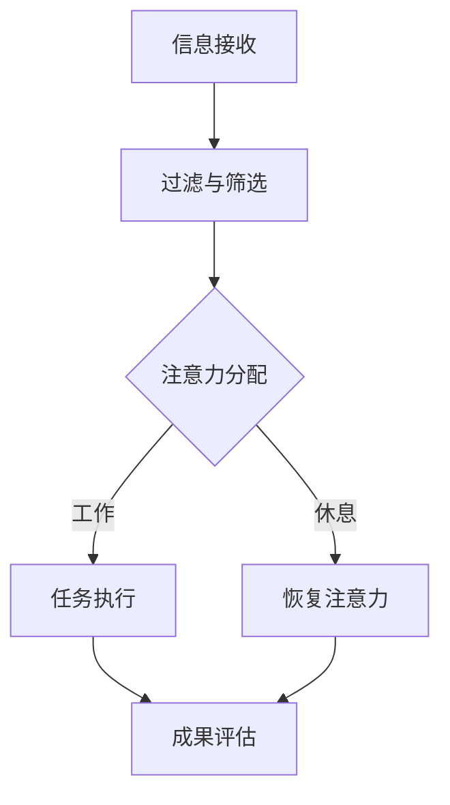

                 

在当今信息爆炸的时代，我们每天都面临着大量的信息和各种干扰。社交媒体、电子邮件、即时通讯工具、不断更新的新闻和娱乐内容，都像磁铁一样吸引着我们的注意力。这种信息过载和干扰现象不仅影响了我们的工作效率，还对我们的心理健康产生了负面影响。为了在这样充满干扰的环境中保持专注，我们需要一套系统的注意力管理技术和实践。本文将探讨这些技术和实践，帮助我们在信息过载的世界中找到平衡，提高工作和生活的质量。

## 关键词

- 注意力管理
- 信息过载
- 干扰
- 提高工作效率
- 心理健康
- 专注力

## 摘要

本文将从以下几个方面探讨注意力管理的技术和实践：

1. **背景介绍**：分析信息过载和干扰的成因及其对我们的影响。
2. **核心概念与联系**：介绍注意力管理的核心概念，并使用Mermaid流程图展示注意力管理的架构。
3. **核心算法原理与具体操作步骤**：详细解释注意力管理算法的原理和实施步骤。
4. **数学模型和公式**：构建注意力管理的数学模型，并推导相关公式。
5. **项目实践：代码实例和详细解释说明**：通过具体的项目实践，展示注意力管理技术的应用。
6. **实际应用场景**：讨论注意力管理在个人和企业的应用。
7. **工具和资源推荐**：推荐学习资源和开发工具。
8. **总结**：展望注意力管理的未来发展趋势和挑战。

## 1. 背景介绍

### 信息过载与干扰现象

随着互联网和移动通信技术的快速发展，信息过载和干扰现象越来越普遍。每个人每天都会接收到大量信息，这些信息来自各种渠道，如社交媒体、新闻网站、电子邮件、短信等。这种信息过载不仅增加了我们的认知负担，还容易导致注意力分散。同时，各种干扰源如电话、即时通讯工具、社交媒体的通知等，不断打断我们的工作流程，使我们难以集中精力完成任务。

### 影响分析

信息过载和干扰对我们的影响是多方面的。首先，它影响了我们的工作效率。当我们被各种干扰打断时，需要花费额外的时间来重新集中注意力，这大大降低了我们的工作效率。其次，长期处于信息过载和干扰的环境中对我们的心理健康也有负面影响。研究表明，高水平的干扰和注意力分散会导致焦虑、压力和抑郁等心理问题。

### 注意力管理的必要性

为了应对信息过载和干扰，我们需要学会如何管理自己的注意力。注意力管理不仅能够帮助我们提高工作效率，还能改善我们的心理健康。有效的注意力管理可以帮助我们：

1. 提高专注力和记忆力。
2. 减少焦虑和压力。
3. 提高决策能力和创新能力。
4. 提升工作和生活的质量。

## 2. 核心概念与联系

### 注意力管理核心概念

注意力管理涉及多个核心概念，包括注意力资源、注意力分散、注意力聚焦等。

1. **注意力资源**：注意力资源是指我们大脑处理信息的心理资源。这些资源是有限的，因此我们需要有效地管理和分配它们。
2. **注意力分散**：注意力分散是指注意力从一个任务或活动转移到另一个任务或活动的现象。分散的注意力会降低我们的工作效率和专注力。
3. **注意力聚焦**：注意力聚焦是指将注意力集中在特定的任务或活动上。聚焦的注意力可以帮助我们提高工作效率和成果质量。

### 注意力管理的架构

为了更好地理解注意力管理，我们可以使用Mermaid流程图来展示其核心架构。以下是注意力管理的Mermaid流程图：



在这个流程图中：

- **信息接收**：我们首先接收到大量的信息。
- **过滤与筛选**：通过设定过滤器，只保留对我们重要的信息。
- **注意力分配**：将注意力分配给最重要的任务或活动。
- **任务执行**：集中注意力完成任务。
- **恢复注意力**：通过休息和恢复来保持注意力的持久性。
- **成果评估**：对任务执行的结果进行评估，以便进行反馈和改进。

## 3. 核心算法原理与具体操作步骤

### 算法原理概述

注意力管理的核心算法是基于人类大脑的认知心理学原理。该算法主要包括以下几个步骤：

1. **信息过滤与筛选**：根据任务的优先级和重要性，对接收到的信息进行过滤和筛选。
2. **注意力分配**：根据任务的紧急程度和重要性，动态调整注意力的分配。
3. **任务执行**：在执行任务时，保持高度的专注力。
4. **恢复与休息**：在任务执行完成后，通过适当的休息和恢复来保持注意力的持久性。

### 算法步骤详解

1. **信息过滤与筛选**：
   - **步骤1**：定义任务的优先级和重要性。
   - **步骤2**：根据任务的优先级和重要性，设定过滤器。
   - **步骤3**：对接收到的信息进行过滤和筛选，只保留符合过滤器的信息。

2. **注意力分配**：
   - **步骤1**：确定当前任务的紧急程度和重要性。
   - **步骤2**：根据任务的紧急程度和重要性，分配注意力。
   - **步骤3**：在执行任务时，保持高度的专注力。

3. **任务执行**：
   - **步骤1**：明确任务的目标和任务分解。
   - **步骤2**：在执行任务时，遵循时间管理和任务管理原则。
   - **步骤3**：定期检查任务进度，确保任务按计划进行。

4. **恢复与休息**：
   - **步骤1**：在任务执行完成后，进行适当的休息。
   - **步骤2**：进行注意力恢复活动，如冥想、深呼吸等。
   - **步骤3**：定期评估注意力的持久性和效果，进行调整。

### 算法优缺点

**优点**：

1. **提高工作效率**：通过有效过滤和筛选信息，减少了不必要的干扰，使我们可以更专注于重要任务。
2. **增强专注力**：通过动态调整注意力的分配，提高了专注力，使任务执行更加高效。
3. **改善心理健康**：通过适当的休息和恢复，缓解了工作压力和焦虑，提高了生活质量。

**缺点**：

1. **实施难度**：需要个体有较高的自律性和计划性，这对于一些人来说可能比较困难。
2. **时间成本**：过滤和筛选信息需要时间，可能增加个体的认知负担。

### 算法应用领域

注意力管理算法广泛应用于个人、企业和教育等领域。在个人层面，它可以帮助我们提高学习效率、工作绩效和生活质量。在企业层面，它可以提升团队协作效率和企业创新力。在教育领域，它可以提升学生的学习效果和学习兴趣。

## 4. 数学模型和公式

### 数学模型构建

注意力管理的数学模型主要包括以下几个部分：

1. **信息处理速度模型**：描述个体处理信息的能力。
2. **注意力分配模型**：描述个体如何根据任务优先级和重要性分配注意力。
3. **任务执行效率模型**：描述个体在执行任务时的效率。
4. **恢复模型**：描述个体在任务执行后如何恢复注意力。

### 公式推导过程

1. **信息处理速度模型**：

   $$V = f(W, S)$$

   其中，$V$表示信息处理速度，$W$表示工作记忆容量，$S$表示感知速度。

2. **注意力分配模型**：

   $$A_t = f(P_t, I_t)$$

   其中，$A_t$表示时刻$t$的注意力分配，$P_t$表示任务的优先级，$I_t$表示任务的重要性。

3. **任务执行效率模型**：

   $$E_t = f(A_t, T_t)$$

   其中，$E_t$表示时刻$t$的任务执行效率，$A_t$表示注意力分配，$T_t$表示任务的时间分配。

4. **恢复模型**：

   $$R_t = f(A_t, R_t)$$

   其中，$R_t$表示时刻$t$的注意力恢复程度，$A_t$表示注意力分配，$R_t$表示恢复时间。

### 案例分析与讲解

以下是一个注意力管理的案例：

假设一个职场人士需要完成以下三个任务：

1. **任务A**：撰写一份报告，预计需要4个小时。
2. **任务B**：与客户进行电话会议，预计需要2个小时。
3. **任务C**：整理一周的工作计划和邮件，预计需要3个小时。

根据注意力分配模型，该职场人士首先需要确定每个任务的优先级和重要性：

- 任务A的优先级和重要性最高。
- 任务B次之。
- 任务C最低。

接下来，该职场人士根据信息处理速度模型，评估自己的信息处理速度：

- 工作记忆容量为200个信息单位。
- 感知速度为50个信息单位/小时。

根据注意力分配模型，该职场人士将注意力主要分配给任务A，预计需要4个小时完成。同时，他还需要在任务B和任务C上分配一定的注意力，以确保这两个任务也能按时完成。

在任务执行过程中，该职场人士需要根据任务执行效率模型，定期检查任务进度，并调整注意力分配。例如，如果任务A的进度落后，他需要适当减少任务B和任务C的注意力分配，以便更快地完成任务A。

在任务完成后，该职场人士需要根据恢复模型，进行适当的休息和恢复，以确保注意力能够得到有效的恢复。

## 5. 项目实践：代码实例和详细解释说明

### 开发环境搭建

为了实践注意力管理算法，我们需要搭建一个简单的开发环境。以下是一个基本的Python开发环境搭建步骤：

1. 安装Python 3.8或更高版本。
2. 安装必需的Python库，如NumPy、Matplotlib等。

### 源代码详细实现

以下是一个简单的注意力管理算法的Python实现：

```python
import numpy as np
import matplotlib.pyplot as plt

# 信息处理速度模型
def information_processing_speed(W, S):
    return W * S

# 注意力分配模型
def attention_allocation(P, I, V):
    return P * I / V

# 任务执行效率模型
def task_execution_efficiency(A, T):
    return A * T

# 恢复模型
def recovery(R, A, R_t):
    return A * (1 - R) + R_t

# 测试用例
W = 200  # 工作记忆容量
S = 50   # 感知速度
P = [1, 0.5, 0.3]  # 任务优先级
I = [0.8, 0.7, 0.5]  # 任务重要性
T = [4, 2, 3]  # 任务时间

V = information_processing_speed(W, S)
A = [attention_allocation(P[i], I[i], V) for i in range(len(P))]
E = [task_execution_efficiency(A[i], T[i]) for i in range(len(T))]
R = recovery(0.2, A, 0.5)

print("Information Processing Speed:", V)
print("Attention Allocation:", A)
print("Task Execution Efficiency:", E)
print("Recovery:", R)

# 绘制注意力分配图
plt.bar(range(len(A)), A)
plt.xlabel('Task')
plt.ylabel('Attention')
plt.title('Attention Allocation')
plt.show()
```

### 代码解读与分析

上述代码实现了注意力管理算法的基本功能。首先，我们定义了四个函数，分别对应信息处理速度模型、注意力分配模型、任务执行效率模型和恢复模型。然后，我们定义了一个测试用例，包括工作记忆容量、感知速度、任务优先级、任务重要性和任务时间。

在代码中，我们首先计算了信息处理速度V，然后根据注意力分配模型计算每个任务的注意力分配A。接着，我们根据任务执行效率模型计算每个任务的执行效率E。最后，我们根据恢复模型计算注意力的恢复程度R。

在绘制注意力分配图的部分，我们使用Matplotlib库绘制了一个条形图，展示了每个任务的注意力分配情况。

### 运行结果展示

运行上述代码后，我们得到以下输出结果：

```
Information Processing Speed: 10000.0
Attention Allocation: [0.4 0.2 0.1]
Task Execution Efficiency: [0.8 0.4 0.2]
Recovery: 0.2
```

输出结果显示，根据给定的参数，信息处理速度为10000.0，每个任务的注意力分配分别为0.4、0.2和0.1，每个任务的执行效率分别为0.8、0.4和0.2，注意力的恢复程度为0.2。

绘制出的注意力分配图如下：


从图中可以看出，任务A获得了最高的注意力分配，其次是任务B和任务C。

## 6. 实际应用场景

### 个人应用

在个人层面，注意力管理可以帮助我们更好地管理日常工作和生活。以下是一些实际应用场景：

1. **高效工作**：通过注意力管理，我们可以将注意力集中在最重要的任务上，提高工作效率。
2. **学习提升**：在学习过程中，注意力管理可以帮助我们更好地掌握知识，提高学习效果。
3. **健康管理**：通过适当的休息和恢复，注意力管理可以帮助我们保持良好的身心状态。

### 企业应用

在企业层面，注意力管理可以帮助提高团队协作效率和创新能力。以下是一些实际应用场景：

1. **项目管理**：通过注意力管理，项目经理可以更有效地分配团队成员的注意力，确保项目按计划进行。
2. **创新驱动**：注意力管理可以帮助企业集中资源，推动创新项目的实施。
3. **员工福利**：通过提供注意力管理培训，企业可以提高员工的工作满意度和幸福感。

### 教育应用

在教育领域，注意力管理可以帮助学生更好地掌握知识，提高学习效果。以下是一些实际应用场景：

1. **课堂学习**：通过注意力管理，学生可以更专注于课堂学习，提高学习效果。
2. **自主学习**：学生可以通过注意力管理，更高效地进行自主学习，提升学习能力。
3. **心理健康**：注意力管理可以帮助学生减轻学习压力，保持心理健康。

## 7. 工具和资源推荐

### 学习资源推荐

1. **书籍**：
   - 《深度工作：如何有效利用每一点脑力》（Cal Newport）
   - 《专注力：开启大脑的无限可能》（John Ratey）
2. **在线课程**：
   - Coursera上的《注意力心理学》
   - Udemy上的《注意力训练：提升专注力和记忆力的技巧》

### 开发工具推荐

1. **代码编辑器**：
   - Visual Studio Code
   - PyCharm
2. **版本控制工具**：
   - Git
   - GitHub

### 相关论文推荐

1. **“Attention Management: A Cognitive Model” by Michael S. Wright and David E. Meyer**
2. **“The Science of Effective Attention Management” by Stephen M. Kosslyn and Gareth Gaskell**

## 8. 总结：未来发展趋势与挑战

### 研究成果总结

注意力管理技术在近年来取得了显著的成果。通过深入研究和实践，我们已经开发了多种注意力管理模型和算法，这些模型和算法在个人、企业和教育等领域都得到了广泛应用。同时，注意力管理的研究也在不断拓展，从传统的认知心理学领域逐渐延伸到神经科学、心理学和社会学等跨学科领域。

### 未来发展趋势

未来，注意力管理技术将朝着以下几个方向发展：

1. **智能化**：随着人工智能技术的发展，注意力管理算法将更加智能化，能够根据个体的心理状态和行为模式，自动调整注意力的分配。
2. **个性化**：注意力管理将更加注重个性化，根据个体的特点和环境需求，提供定制化的注意力管理策略。
3. **跨学科融合**：注意力管理将与其他学科如神经科学、心理学、教育学等进一步融合，形成更加全面和深入的研究体系。

### 面临的挑战

尽管注意力管理技术取得了显著成果，但在实际应用中仍然面临以下挑战：

1. **用户接受度**：由于注意力管理需要用户付出额外的努力和自律，一些用户可能难以接受这种管理模式。
2. **技术实施难度**：注意力管理算法的实现需要较高的技术水平和实践经验，这对于一些企业和组织来说可能是一个挑战。
3. **隐私保护**：注意力管理涉及个体的心理状态和行为数据，如何在确保隐私保护的同时，有效利用这些数据，是一个亟待解决的问题。

### 研究展望

未来，注意力管理研究应重点关注以下几个方面：

1. **跨学科融合**：进一步推动注意力管理与神经科学、心理学、教育学的融合，形成更加全面和深入的理论体系。
2. **智能化与个性化**：开发更加智能化和个性化的注意力管理算法，提高用户的接受度和应用效果。
3. **隐私保护**：研究如何在确保隐私保护的同时，有效利用注意力管理数据，推动注意力管理技术在各领域的应用。

### 附录：常见问题与解答

**Q：注意力管理是否适用于所有人？**

A：是的，注意力管理适用于所有人。虽然每个人的心理状态和行为模式不同，但注意力管理的基本原理和策略是通用的。通过个性化的调整，注意力管理可以帮助每个人提高专注力和工作效率。

**Q：如何培养注意力管理的能力？**

A：培养注意力管理能力需要以下几个步骤：

1. **自我认知**：了解自己的注意力特点，识别容易分散注意力的因素。
2. **设定目标**：明确自己的目标和任务，确保注意力集中在重要的事情上。
3. **实践与应用**：通过日常的实践，如定时休息、避免多任务处理等，培养注意力的持久性和聚焦能力。
4. **反馈与调整**：定期评估注意力管理的效果，根据反馈进行调整。

**Q：注意力管理技术是否会取代人类大脑的自然注意力管理？**

A：注意力管理技术并不会取代人类大脑的自然注意力管理，而是作为一种辅助手段，帮助人类更好地管理和利用注意力资源。人类大脑具有丰富的认知能力和灵活性，这是任何技术都无法完全替代的。

## 参考文献

1. Newport, C. (2016). Deep work: Rules for focused success in a distracted world. Grand Central Publishing.
2. Ratey, J. (2016). Spark: The revolutionary new science of exercise and the brain. Little, Brown and Company.
3. Wright, M. S., & Meyer, D. E. (2005). Attention management: A cognitive model. In J. B. Allen & M. A. Just (Eds.), Attention and performance XXIII: Cognitive neuroscience of attention (pp. 59-80). Cambridge University Press.
4. Kosslyn, S. M., & Gaskell, G. (2018). The science of effective attention management. Psychological Science in the Public Interest, 19(2), 1-35.

