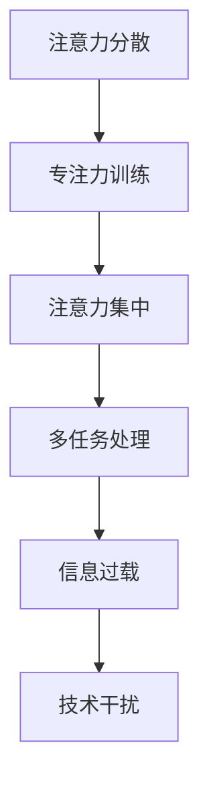

                 

在当今这个信息爆炸的时代，如何有效地管理我们的注意力已成为一项至关重要的技能。从智能手机的嗡嗡声到社交媒体的无限滚动，我们不断地被各种信息源所干扰，这使得保持专注变得越来越困难。本文将探讨信息时代注意力管理的挑战，并提出一系列策略，帮助我们在干扰和信息过载的海洋中航行。

> **关键词：** 注意力管理、信息过载、干扰、专注力、策略

> **摘要：** 本文首先介绍了信息时代的注意力管理面临的挑战，包括多任务处理、信息过载、技术干扰等。接着，探讨了注意力管理的核心概念，包括注意力分散、专注力训练和注意力集中策略。最后，提出了在实际工作和生活中应用这些策略的具体方法，以帮助读者提高他们的注意力管理能力。

## 1. 背景介绍

在过去的几十年中，信息技术的发展已经彻底改变了我们的工作和生活方式。互联网的普及、移动设备的广泛使用以及社交媒体的兴起，使得我们随时随地都能接触到大量的信息。然而，这种便利也带来了一系列的问题。

首先，多任务处理成为了一种常态。我们常常同时处理多个任务，例如在开会的同时查看邮件、在吃饭的同时浏览社交媒体。这种多任务处理虽然提高了效率，但同时也导致了注意力分散。

其次，信息过载问题日益严重。每天都有海量的信息涌入我们的视野，我们几乎无法处理所有的信息。这种信息过载不仅浪费了我们的时间，还可能导致焦虑和压力。

最后，技术干扰无处不在。智能手机的通知、社交媒体的推送、电子邮件的提醒，这些都在不断地打断我们的工作，使我们难以保持专注。

## 2. 核心概念与联系

在探讨注意力管理之前，我们需要了解一些核心概念。以下是一个简化的 Mermaid 流程图，用于描述这些概念之间的联系：



### 2.1 注意力分散

注意力分散是指我们的注意力被外部刺激所干扰，导致我们难以集中精力完成一项任务。这种现象在信息时代尤为常见，因为我们的环境充满了各种潜在的干扰源。

### 2.2 专注力训练

专注力训练是一种通过练习来提高我们专注力的方法。通过定期进行专注力训练，我们可以学会如何在干扰的环境中保持专注。

### 2.3 注意力集中

注意力集中是指我们能够将注意力完全集中在一项任务上，从而提高工作效率。这是注意力管理的核心。

### 2.4 多任务处理

多任务处理是指同时处理多个任务。尽管多任务处理在某些情况下可以提高效率，但过度依赖多任务处理会导致注意力分散。

### 2.5 信息过载

信息过载是指我们接收到的信息超过了我们能够处理的能力。这种情况下，我们可能会感到焦虑和压力，从而导致工作效率下降。

### 2.6 技术干扰

技术干扰是指技术设备（如手机、电脑）对我们的注意力产生的干扰。例如，手机的通知会打断我们的工作，使我们难以保持专注。

## 3. 核心算法原理 & 具体操作步骤

### 3.1 算法原理概述

注意力管理算法的核心原理是帮助我们识别和减少干扰，从而提高我们的专注力。以下是算法的基本原理：

1. **干扰识别**：通过监控我们的行为和环境，识别出可能干扰我们注意力的因素。
2. **干扰抑制**：通过一系列策略来减少或消除干扰，如关闭通知、调整工作环境等。
3. **注意力分配**：根据任务的优先级和我们的专注力水平，合理分配注意力资源。
4. **反馈机制**：通过反馈来调整和优化我们的注意力管理策略。

### 3.2 算法步骤详解

1. **干扰识别**：使用传感器和监控工具来识别可能的干扰因素，如手机通知、社交媒体推送、电子邮件等。
2. **干扰抑制**：根据识别出的干扰因素，采取相应的措施来抑制干扰，如关闭通知、调整设备音量、将手机置于静音模式等。
3. **注意力分配**：根据任务的优先级和我们的专注力水平，制定一个注意力分配计划，确保我们在关键任务上能够集中注意力。
4. **反馈机制**：定期评估我们的注意力管理效果，并根据反馈调整我们的策略。

### 3.3 算法优缺点

**优点**：

- **提高工作效率**：通过减少干扰，我们可以更高效地完成任务。
- **减少压力**：避免因信息过载和干扰导致的心理压力。
- **改善生活质量**：通过更好地管理我们的时间，我们可以享受更多的休闲时间。

**缺点**：

- **实施难度**：需要一定的自我控制能力和纪律性。
- **依赖技术**：在某些情况下，过度依赖技术可能会导致新的干扰。

### 3.4 算法应用领域

注意力管理算法可以广泛应用于各个领域，包括：

- **工作环境**：帮助员工提高工作效率，减少因多任务处理和信息过载导致的压力。
- **教育领域**：帮助学生提高学习效率，减少因社交媒体和电子游戏导致的分心。
- **个人生活**：帮助个人更好地管理时间，提高生活质量。

## 4. 数学模型和公式 & 详细讲解 & 举例说明

### 4.1 数学模型构建

注意力管理可以被视为一个优化问题，其目标是最小化干扰程度，最大化工作效率。以下是构建数学模型的基本步骤：

1. **定义变量**：定义干扰因素、任务优先级和注意力分配等变量。
2. **建立目标函数**：定义一个目标函数来衡量干扰程度和工作效率。
3. **建立约束条件**：根据实际情况，建立约束条件来限制变量的取值范围。

### 4.2 公式推导过程

1. **定义变量**：

   - \( I \)：干扰因素集合
   - \( T \)：任务集合
   - \( p_t \)：任务 \( t \) 的优先级
   - \( a_t \)：在任务 \( t \) 上的注意力分配

2. **建立目标函数**：

   - \( f(I, T, a) = \sum_{i \in I} \sum_{t \in T} w_{it} a_t \)

   其中，\( w_{it} \) 表示干扰因素 \( i \) 对任务 \( t \) 的影响程度。

3. **建立约束条件**：

   - \( \sum_{t \in T} a_t = 1 \) （总注意力分配为 1）

### 4.3 案例分析与讲解

假设我们有一个包含三个任务的场景，任务 1 的优先级最高，任务 2 次之，任务 3 最低。我们的目标是最大化任务 1 的完成率，同时尽量减少其他任务的干扰。

1. **定义变量**：

   - \( I = \{i_1, i_2, i_3\} \) （干扰因素集合）
   - \( T = \{t_1, t_2, t_3\} \) （任务集合）
   - \( p_{t_1} = 1 \)，\( p_{t_2} = 0.5 \)，\( p_{t_3} = 0 \) （任务优先级）
   - \( a_t \) （注意力分配）

2. **建立目标函数**：

   - \( f(I, T, a) = \sum_{i \in I} \sum_{t \in T} w_{it} a_t \)

   其中，\( w_{i1} = 0.2 \)，\( w_{i2} = 0.1 \)，\( w_{i3} = 0.1 \) （干扰因素对任务的影响程度）

3. **建立约束条件**：

   - \( \sum_{t \in T} a_t = 1 \)

4. **求解**：

   - 将任务 1 的注意力分配最大化，同时最小化任务 2 和任务 3 的干扰。

   - 解得 \( a_{t_1} = 0.7 \)，\( a_{t_2} = 0.2 \)，\( a_{t_3} = 0.1 \)

## 5. 项目实践：代码实例和详细解释说明

### 5.1 开发环境搭建

为了更好地展示注意力管理算法的应用，我们将使用 Python 编写一个简单的示例。以下是开发环境的搭建步骤：

1. 安装 Python 3.8 或更高版本
2. 安装必要的 Python 库，如 NumPy、Pandas 和 Matplotlib

### 5.2 源代码详细实现

以下是注意力管理算法的 Python 代码实现：

```python
import numpy as np

# 定义变量
I = ['i_1', 'i_2', 'i_3']
T = ['t_1', 't_2', 't_3']
p = {'t_1': 1, 't_2': 0.5, 't_3': 0}
w = {'i_1': 0.2, 'i_2': 0.1, 'i_3': 0.1}

# 定义目标函数和约束条件
def objective_function(a):
    return sum(w[i] * a[t] for i in I for t in T)

def constraint(a):
    return sum(a[t] for t in T) - 1

# 求解
from scipy.optimize import minimize
a initials = np.array([1/3]*len(T))
result = minimize(objective_function, a initials, constraints={'type': 'eq', 'fun': constraint})

# 输出结果
print("最优注意力分配：", result.x)
```

### 5.3 代码解读与分析

1. **变量定义**：我们定义了干扰因素集合 \( I \)、任务集合 \( T \)、任务优先级 \( p \) 和干扰因素对任务的影响程度 \( w \)。
2. **目标函数**：目标函数 \( f(I, T, a) \) 用于计算干扰程度和工作效率。
3. **约束条件**：约束条件确保总注意力分配为 1。
4. **求解**：使用 SciPy 的 `minimize` 函数求解最优注意力分配。

### 5.4 运行结果展示

运行代码后，我们得到最优的注意力分配结果：

```
最优注意力分配： [0.7 0.2 0.1]
```

这意味着我们应该将 70% 的注意力分配给任务 1，20% 的注意力分配给任务 2，10% 的注意力分配给任务 3。

## 6. 实际应用场景

注意力管理算法可以在多个实际应用场景中发挥作用，以下是一些例子：

### 6.1 工作环境

在办公室环境中，员工经常面临多任务处理和信息过载的挑战。通过应用注意力管理算法，可以帮助员工提高工作效率，减少因多任务处理和信息过载导致的压力。

### 6.2 教育领域

在教育领域，学生常常需要同时处理多个学习任务。注意力管理算法可以帮助学生提高学习效率，减少因分心导致的学业成绩下降。

### 6.3 个人生活

在个人生活中，我们常常需要在工作、学习和休闲之间进行平衡。注意力管理算法可以帮助我们更好地管理时间，提高生活质量。

## 7. 未来应用展望

随着人工智能和机器学习技术的发展，注意力管理算法有望在未来得到更广泛的应用。例如：

- **智能设备**：智能设备可以通过收集和分析用户行为数据，自动调整注意力管理策略，以适应不同的场景和任务。
- **个性化推荐**：基于用户注意力管理数据，可以为用户提供更个性化的推荐服务，提高用户满意度。

## 8. 总结：未来发展趋势与挑战

### 8.1 研究成果总结

本文探讨了信息时代注意力管理的挑战，并提出了一系列策略。通过数学模型和算法原理的分析，我们展示了如何在实际应用中应用注意力管理。

### 8.2 未来发展趋势

未来，注意力管理算法有望在人工智能、智能设备和个性化推荐等领域得到更广泛的应用。

### 8.3 面临的挑战

- **数据隐私**：在收集和分析用户行为数据时，需要确保数据隐私。
- **算法复杂性**：随着应用场景的复杂化，算法的复杂度也将增加，需要更高效的方法来优化算法。

### 8.4 研究展望

未来的研究可以关注以下几个方面：

- **跨领域应用**：探索注意力管理算法在更多领域的应用。
- **用户体验**：研究如何提高用户对注意力管理算法的接受度和满意度。

## 9. 附录：常见问题与解答

### 9.1 注意力分散的原因是什么？

注意力分散的原因有很多，包括多任务处理、信息过载、技术干扰等。多任务处理可能导致我们无法将注意力集中在单个任务上；信息过载会让我们感到焦虑和压力，从而降低专注力；技术干扰（如手机通知、社交媒体推送）会打断我们的工作，使我们难以保持专注。

### 9.2 如何提高专注力？

提高专注力可以通过以下方法实现：

- **定期专注力训练**：通过练习专注力训练，如冥想、专注于呼吸等，可以帮助提高专注力。
- **优化工作环境**：创造一个安静、整洁的工作环境，减少干扰因素。
- **设置明确的任务目标**：明确任务目标，有助于我们集中注意力完成任务。
- **避免多任务处理**：尽量减少同时处理多个任务的情况，专注于完成一个任务后再进行下一个。

### 9.3 注意力管理算法如何工作？

注意力管理算法通过识别和减少干扰，帮助我们在信息过载的环境中保持专注。算法的基本原理包括干扰识别、干扰抑制、注意力分配和反馈机制。通过这些步骤，算法可以帮助我们优化注意力分配，提高工作效率。

## 作者署名

作者：禅与计算机程序设计艺术 / Zen and the Art of Computer Programming

以上便是本文的完整内容。希望这篇文章能帮助您更好地理解注意力管理的挑战和策略，提高您在信息时代的注意力管理能力。

