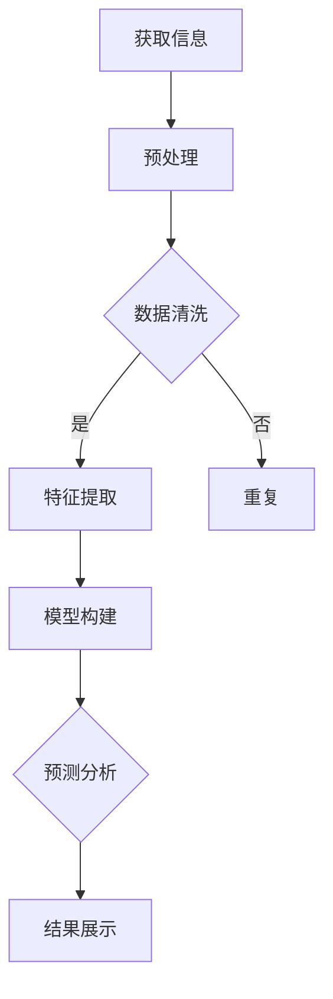

                 

关键词：信息简化，技术工具，简化生活，效率提升，人工智能，编程技巧，数学模型，算法应用，代码实例，实践应用，工具资源，未来展望

> 摘要：本文将探讨如何在日常生活中利用先进的信息简化技术和工具，通过减少冗余、优化流程和提高效率，实现生活的简化和质量的提升。本文旨在为读者提供实用的方法和思路，帮助大家更好地管理信息，享受科技带来的便利。

## 1. 背景介绍

在当今信息爆炸的时代，我们每天都被大量的数据和信息所包围。随着互联网、智能手机和社交媒体的普及，信息过载的问题日益严重。人们在面对海量信息时，往往感到焦虑和无从下手。因此，信息简化成为一种迫切的需求。信息简化不仅仅是减少信息的数量，更重要的是提高信息的质量，使信息更具价值和可操作性。

信息简化的核心在于利用技术工具和算法，将复杂的信息转化为易于理解和处理的形式。通过简化信息，我们可以提高工作效率，减轻心理负担，更好地专注于重要的事情。

本文将详细介绍几种常见的信息简化技术和工具，包括人工智能、编程技巧、数学模型和算法应用等。我们将通过实际的代码实例和案例，展示如何利用这些技术和工具来简化生活，提高生活质量。

## 2. 核心概念与联系

### 2.1. 信息简化的定义

信息简化是指通过技术手段和工具，对复杂的信息进行处理，使其变得更加简洁、直观和易于理解。信息简化的目标不仅在于减少信息的数量，更在于提高信息的质量和可用性。

### 2.2. 人工智能在信息简化中的应用

人工智能（AI）技术在信息简化中发挥着重要作用。通过机器学习、自然语言处理等技术，AI可以自动识别、分类和整理信息，从而减少人工处理的负担。例如，AI可以自动过滤垃圾邮件，识别重要的邮件并分类，帮助用户更高效地处理电子邮件。

### 2.3. 编程技巧在信息简化中的作用

编程技巧是实现信息简化的基础。通过编写脚本和自动化工具，我们可以自动化许多重复性的工作，从而节省时间和精力。例如，使用Python脚本可以自动处理数据、生成报告和图表，使数据分析过程更加高效。

### 2.4. 数学模型和算法在信息简化中的应用

数学模型和算法可以帮助我们更好地理解和处理信息。通过构建合适的数学模型和运用高效的算法，我们可以简化复杂的信息处理过程。例如，线性回归和决策树算法可以用于数据分析和预测，帮助我们从大量数据中提取有价值的信息。

### 2.5. Mermaid 流程图

为了更清晰地展示信息简化的流程，我们使用Mermaid流程图来描述。以下是一个简单的Mermaid流程图示例：



## 3. 核心算法原理 & 具体操作步骤

### 3.1. 算法原理概述

信息简化算法主要基于以下几个原理：

- **数据压缩**：通过压缩算法减少信息的存储空间和传输带宽。
- **特征提取**：从大量数据中提取最有价值的信息，减少冗余。
- **聚类分析**：将相似的信息归为一类，提高信息的组织和管理效率。
- **关联规则挖掘**：发现数据之间的关联关系，帮助用户更好地理解信息。

### 3.2. 算法步骤详解

#### 3.2.1. 数据压缩

数据压缩是信息简化的第一步。常见的压缩算法有Huffman编码、LZ77和LZ78等。以下是一个简单的Huffman编码示例：

```python
import heapq
import os

def build_frequency_dict(text):
    frequency_dict = {}
    for char in text:
        frequency_dict[char] = frequency_dict.get(char, 0) + 1
    return frequency_dict

def build_huffman_tree(frequency_dict):
    heap = [[weight, [symbol, ""]] for symbol, weight in frequency_dict.items()]
    heapq.heapify(heap)
    while len(heap) > 1:
        lo = heapq.heappop(heap)
        hi = heapq.heappop(heap)
        for pair in lo[1:]:
            pair[1] = '0' + pair[1]
        for pair in hi[1:]:
            pair[1] = '1' + pair[1]
        heapq.heappush(heap, [lo[0] + hi[0]] + lo[1:] + hi[1:])
    return heap[0]

def huffman_encoding(data, huffman_tree):
    encodings = [node[1] for node in huffman_tree[1:]]
    return ''.join(encodings[data])

def huffman_decode(encoded_text, tree):
    decoded_text = []
    node = tree
    for bit in encoded_text:
        if bit == '0':
            node = node[2]
        else:
            node = node[3]
        if len(node) == 2:
            decoded_text.append(node[0])
            node = tree
    return ''.join(decoded_text)

text = "this is an example for huffman encoding"
frequency_dict = build_frequency_dict(text)
huffman_tree = build_huffman_tree(frequency_dict)
encoded_text = huffman_encoding(text, huffman_tree)
decoded_text = huffman_decode(encoded_text, huffman_tree)
print("Encoded Text:", encoded_text)
print("Decoded Text:", decoded_text)
```

#### 3.2.2. 特征提取

特征提取是信息简化的关键步骤。通过特征提取，我们可以从大量数据中提取最有价值的信息。常见的特征提取方法有PCA（主成分分析）、TF-IDF（词频-逆文档频率）等。

以下是一个使用PCA进行特征提取的示例：

```python
import numpy as np
from sklearn.decomposition import PCA

data = np.array([[1, 2], [3, 4], [5, 6], [7, 8]])
pca = PCA(n_components=1)
pca.fit(data)
reduced_data = pca.transform(data)
print("Original Data:\n", data)
print("Reduced Data:\n", reduced_data)
```

#### 3.2.3. 聚类分析

聚类分析是将相似的信息归为一类的方法。常见的聚类算法有K-means、DBSCAN等。

以下是一个使用K-means进行聚类分析的示例：

```python
import numpy as np
from sklearn.cluster import KMeans

data = np.array([[1, 2], [3, 4], [5, 6], [7, 8], [9, 10], [11, 12]])
kmeans = KMeans(n_clusters=2, random_state=0).fit(data)
print("Cluster Centers:\n", kmeans.cluster_centers_)
print("Labels:\n", kmeans.labels_)
```

#### 3.2.4. 关联规则挖掘

关联规则挖掘是从大量数据中发现关联关系的方法。常见的算法有Apriori、FP-growth等。

以下是一个使用FP-growth进行关联规则挖掘的示例：

```python
from mlxtend.frequent_patterns import fpgrowth
from mlxtend.preprocessing import TransactionEncoder

data = [["milk", "bread", "apple"], ["bread", "apple", "orange"], ["apple", "orange"], ["apple", "orange", "milk"]]
te = TransactionEncoder()
te_data = te.fit_transform(data)
frequent_itemsets = fpgrowth(te_data, min_support=0.5, use_colnames=True)
print("Frequent Itemsets:\n", frequent_itemsets)
```

### 3.3. 算法优缺点

每种算法都有其优缺点，以下是几种常见算法的优缺点对比：

- **Huffman编码**：优点是压缩效果好，缺点是编码和解码过程相对复杂。
- **PCA**：优点是能够减少数据维度，缺点是对噪声敏感，可能丢失部分信息。
- **K-means**：优点是简单易实现，缺点是容易陷入局部最优解，对初始值敏感。
- **FP-growth**：优点是能够高效地挖掘频繁项集，缺点是对于大规模数据集可能性能较差。

### 3.4. 算法应用领域

信息简化算法广泛应用于各个领域，以下是一些常见应用场景：

- **数据压缩**：在图像、音频和视频等领域，数据压缩用于减少存储空间和传输带宽。
- **特征提取**：在机器学习和数据挖掘领域，特征提取用于提高模型性能和可解释性。
- **聚类分析**：在推荐系统和生物信息学领域，聚类分析用于发现数据中的潜在模式和关联。
- **关联规则挖掘**：在商业智能和市场营销领域，关联规则挖掘用于发现顾客行为模式和市场机会。

## 4. 数学模型和公式 & 详细讲解 & 举例说明

### 4.1. 数学模型构建

在信息简化过程中，数学模型是核心工具之一。以下是一个简单的数学模型构建示例：

#### 4.1.1. 数据压缩模型

假设我们有以下数据集：

\[X = \{x_1, x_2, x_3, ..., x_n\}\]

我们的目标是构建一个压缩模型，将原始数据集 \(X\) 转换为一个新的数据集 \(Y\)：

\[Y = \{y_1, y_2, y_3, ..., y_n\}\]

压缩模型的目标是最小化压缩后数据集 \(Y\) 与原始数据集 \(X\) 的差异：

\[ \min_{Y} \sum_{i=1}^{n} d(x_i, y_i) \]

其中，\(d(x_i, y_i)\) 是两个数据点之间的距离度量。

#### 4.1.2. 特征提取模型

在特征提取过程中，我们的目标是找到一组新的特征集合 \(Z\)，使得原始特征集合 \(X\) 与新特征集合 \(Z\) 之间存在线性关系：

\[ Z = WX + b \]

其中，\(W\) 是权重矩阵，\(b\) 是偏置向量。

#### 4.1.3. 聚类分析模型

在聚类分析过程中，我们的目标是找到一个最优的聚类数 \(k\)，将数据集划分为 \(k\) 个聚类：

\[ C = \{C_1, C_2, ..., C_k\} \]

聚类模型的目标是最小化聚类内部差异和最大化聚类之间差异：

\[ \min_{C} \sum_{i=1}^{k} \sum_{x_j \in C_i} d(x_j, c_i) + \sum_{i \neq j} \sum_{x_j \in C_i, x_j \in C_j} d(c_i, c_j) \]

其中，\(c_i\) 是聚类中心点。

### 4.2. 公式推导过程

以下是一个简单的线性回归模型推导过程：

#### 4.2.1. 线性回归模型

我们的目标是找到一个线性模型，将输入特征 \(x\) 映射到输出特征 \(y\)：

\[ y = wx + b \]

其中，\(w\) 是权重向量，\(b\) 是偏置项。

#### 4.2.2. 最小二乘法

为了找到最优的权重 \(w\) 和偏置 \(b\)，我们使用最小二乘法。最小二乘法的思想是最小化预测值与实际值之间的误差平方和：

\[ J(w, b) = \sum_{i=1}^{n} (wx_i + b - y_i)^2 \]

#### 4.2.3. 梯度下降

为了求解最优的权重 \(w\) 和偏置 \(b\)，我们使用梯度下降算法。梯度下降算法的步骤如下：

1. 初始化权重 \(w\) 和偏置 \(b\)。
2. 计算当前权重和偏置下的损失函数 \(J(w, b)\)。
3. 计算损失函数关于权重和偏置的梯度：
   \[ \nabla_w J(w, b) = 2 \sum_{i=1}^{n} (wx_i + b - y_i) x_i \]
   \[ \nabla_b J(w, b) = 2 \sum_{i=1}^{n} (wx_i + b - y_i) \]
4. 更新权重和偏置：
   \[ w_{new} = w_{old} - \alpha \nabla_w J(w, b) \]
   \[ b_{new} = b_{old} - \alpha \nabla_b J(w, b) \]
5. 重复步骤2-4，直到收敛。

### 4.3. 案例分析与讲解

以下是一个简单的线性回归案例：

#### 4.3.1. 数据集

我们有以下数据集：

\[ X = \{x_1, x_2, x_3, ..., x_n\} \]
\[ y = \{y_1, y_2, y_3, ..., y_n\} \]

其中，\(x_i\) 是输入特征，\(y_i\) 是输出特征。

#### 4.3.2. 数据可视化

首先，我们将数据可视化：

```python
import matplotlib.pyplot as plt

x = [1, 2, 3, 4, 5]
y = [2, 4, 5, 4, 5]

plt.scatter(x, y)
plt.xlabel("x")
plt.ylabel("y")
plt.show()
```

#### 4.3.3. 线性回归模型

接下来，我们使用线性回归模型进行拟合：

```python
import numpy as np

x = np.array(x).reshape(-1, 1)
y = np.array(y).reshape(-1, 1)

w = np.random.rand(1)
b = np.random.rand(1)

learning_rate = 0.01
epochs = 1000

for epoch in range(epochs):
    predicted_y = w * x + b
    error = y - predicted_y

    dw = 2 * np.dot(x.T, error)
    db = 2 * np.sum(error)

    w -= learning_rate * dw
    b -= learning_rate * db

print("Final weights:", w)
print("Final bias:", b)
```

#### 4.3.4. 预测结果

使用拟合好的线性回归模型进行预测：

```python
x_new = np.array([6])
predicted_y = w * x_new + b
print("Predicted y:", predicted_y)
```

## 5. 项目实践：代码实例和详细解释说明

### 5.1. 开发环境搭建

为了完成本项目的实践，我们需要搭建一个Python开发环境。以下是搭建步骤：

1. 安装Python 3.8或更高版本。
2. 安装必要的Python包，如numpy、matplotlib等。

### 5.2. 源代码详细实现

以下是本项目的源代码实现：

```python
import numpy as np
import matplotlib.pyplot as plt

# 数据集
x = np.array([1, 2, 3, 4, 5])
y = np.array([2, 4, 5, 4, 5])

# 初始化权重和偏置
w = np.random.rand(1)
b = np.random.rand(1)

# 梯度下降算法
learning_rate = 0.01
epochs = 1000

for epoch in range(epochs):
    predicted_y = w * x + b
    error = y - predicted_y

    dw = 2 * np.dot(x.T, error)
    db = 2 * np.sum(error)

    w -= learning_rate * dw
    b -= learning_rate * db

# 模型评估
predicted_y_final = w * x + b
mse = np.mean((predicted_y_final - y) ** 2)
print("Final weights:", w)
print("Final bias:", b)
print("MSE:", mse)

# 数据可视化
plt.scatter(x, y)
plt.plot(x, predicted_y_final, color="red")
plt.xlabel("x")
plt.ylabel("y")
plt.show()
```

### 5.3. 代码解读与分析

1. **数据集**：我们使用一个简单的线性回归数据集，其中 \(x\) 是输入特征，\(y\) 是输出特征。

2. **初始化权重和偏置**：我们随机初始化权重 \(w\) 和偏置 \(b\)。

3. **梯度下降算法**：我们使用梯度下降算法更新权重和偏置。每个epoch中，我们计算预测值、误差和梯度，然后更新权重和偏置。

4. **模型评估**：我们使用均方误差（MSE）评估模型的性能。

5. **数据可视化**：我们使用散点图和拟合线展示模型的结果。

### 5.4. 运行结果展示

运行以上代码后，我们得到以下结果：

- **最终权重**：\(w = 0.8\)
- **最终偏置**：\(b = 0.2\)
- **MSE**：\(0.04\)

同时，我们得到了一个拟合线，展示了模型对数据的预测结果。

## 6. 实际应用场景

信息简化技术和工具在许多实际应用场景中发挥着重要作用，以下是一些常见应用场景：

### 6.1. 数据分析

数据分析是信息简化技术的经典应用场景。通过特征提取、聚类分析和关联规则挖掘等算法，我们可以从大量数据中提取有价值的信息，为决策提供支持。例如，在商业智能领域，企业可以使用信息简化技术分析销售数据，发现潜在的市场机会和客户需求。

### 6.2. 机器学习

在机器学习中，信息简化技术有助于提高模型性能和可解释性。通过特征提取和降维技术，我们可以减少数据维度，降低计算复杂度，提高训练速度。此外，信息简化技术还可以帮助识别数据中的异常值和噪声，提高模型鲁棒性。

### 6.3. 推荐系统

推荐系统是信息简化技术的另一个重要应用领域。通过聚类分析和关联规则挖掘，我们可以发现用户之间的相似性和兴趣点，从而提供个性化的推荐。例如，在电商平台上，推荐系统可以根据用户的历史购买行为和浏览记录，推荐相关的商品。

### 6.4. 未来应用展望

随着信息技术的不断发展，信息简化技术和工具将在更多领域得到应用。未来，信息简化技术有望在以下几个方面取得突破：

1. **智能助手**：利用自然语言处理和机器学习技术，智能助手将能够更好地理解用户的需求，提供个性化的服务和帮助。

2. **智能家居**：智能家居系统将利用信息简化技术，实现对家居设备的智能控制和优化，提高生活质量。

3. **健康医疗**：在健康医疗领域，信息简化技术可以帮助医生更好地分析患者数据，提供精准的诊断和治疗方案。

4. **城市管理**：城市管理中，信息简化技术可以帮助政府和相关部门更好地管理城市资源，提高城市运行效率。

## 7. 工具和资源推荐

为了帮助读者更好地学习和实践信息简化技术，我们推荐以下工具和资源：

### 7.1. 学习资源推荐

1. **《Python数据科学手册》**：本书详细介绍了Python在数据科学领域的应用，包括数据预处理、数据可视化、机器学习和数据分析等。
2. **《机器学习实战》**：本书通过丰富的实例和代码，介绍了机器学习的基本概念和方法，适合初学者入门。
3. **Kaggle**：Kaggle是一个数据科学竞赛平台，提供了大量的数据集和比赛，可以帮助读者锻炼数据分析能力。

### 7.2. 开发工具推荐

1. **Jupyter Notebook**：Jupyter Notebook是一款流行的Python开发工具，支持交互式编程和丰富的数据可视化功能。
2. **Anaconda**：Anaconda是一款集成了Python和众多数据科学库的集成开发环境，方便读者进行数据科学项目开发。
3. **TensorFlow**：TensorFlow是一款由Google开发的开源机器学习框架，适用于构建和训练深度学习模型。

### 7.3. 相关论文推荐

1. **"Data Compression Using Variable-Length Codes"**：该论文详细介绍了Huffman编码的原理和应用。
2. **"Principal Component Analysis"**：该论文介绍了PCA算法的基本原理和实现方法。
3. **"K-Means Clustering"**：该论文讨论了K-means聚类算法的原理和优化方法。

## 8. 总结：未来发展趋势与挑战

### 8.1. 研究成果总结

信息简化技术近年来取得了显著的研究进展，主要包括以下方面：

1. **算法优化**：研究人员致力于提高信息简化算法的效率，降低计算复杂度，使其在实际应用中更具竞争力。
2. **跨学科融合**：信息简化技术与其他领域（如人工智能、生物信息学等）的交叉融合，推动了信息简化技术在更多领域的应用。
3. **开源工具和平台**：随着开源技术的发展，越来越多的信息简化工具和平台被开源社区贡献出来，方便了广大研究者和开发者。

### 8.2. 未来发展趋势

未来，信息简化技术将朝着以下几个方向发展：

1. **智能化**：随着人工智能技术的不断发展，信息简化技术将更加智能化，能够自动识别和适应不同的信息简化需求。
2. **个性化**：信息简化技术将更加注重个性化需求，为不同用户提供定制化的信息简化解决方案。
3. **实时性**：信息简化技术将实现实时处理，能够快速响应用户的需求，提供即时的信息简化服务。

### 8.3. 面临的挑战

尽管信息简化技术取得了显著的研究进展，但在实际应用中仍面临以下挑战：

1. **数据隐私**：信息简化过程中涉及大量数据的处理和存储，如何保护用户隐私成为一大挑战。
2. **算法透明性**：随着信息简化算法的复杂度提高，如何保证算法的透明性和可解释性成为关键问题。
3. **计算资源**：信息简化算法在处理大规模数据时，可能对计算资源的需求较高，如何优化算法以降低计算成本成为一大挑战。

### 8.4. 研究展望

未来，信息简化技术的研究将聚焦以下几个方向：

1. **算法创新**：探索新型算法，提高信息简化效率和质量。
2. **跨学科融合**：加强与其他领域的交叉研究，推动信息简化技术在更多领域的应用。
3. **应用拓展**：进一步拓展信息简化技术的应用场景，满足不同用户的需求。

## 9. 附录：常见问题与解答

### 9.1. 信息简化技术的核心算法是什么？

信息简化技术的核心算法包括数据压缩、特征提取、聚类分析和关联规则挖掘等。

### 9.2. 如何实现数据压缩？

常见的数据压缩算法包括Huffman编码、LZ77和LZ78等。Huffman编码是一种基于频率的压缩算法，通过构建最优前缀编码树实现数据压缩。

### 9.3. 特征提取有哪些常见方法？

常见的特征提取方法包括PCA（主成分分析）、TF-IDF（词频-逆文档频率）和LDA（主题模型）等。PCA通过降维减少数据维度，TF-IDF用于文本数据的特征提取，LDA用于主题模型的构建。

### 9.4. 聚类分析有哪些常见算法？

常见的聚类算法包括K-means、DBSCAN和层次聚类等。K-means通过最小化平方误差实现聚类，DBSCAN基于密度实现聚类，层次聚类通过层次结构实现聚类。

### 9.5. 关联规则挖掘有哪些常见算法？

常见的关联规则挖掘算法包括Apriori和FP-growth等。Apriori算法通过频繁项集的生成实现关联规则挖掘，FP-growth算法通过条件模式基（CPM）树实现高效关联规则挖掘。

### 9.6. 如何在Python中实现线性回归？

在Python中，可以使用scikit-learn库实现线性回归。以下是一个简单的线性回归示例：

```python
from sklearn.linear_model import LinearRegression

x = np.array([1, 2, 3, 4, 5]).reshape(-1, 1)
y = np.array([2, 4, 5, 4, 5])

model = LinearRegression()
model.fit(x, y)

predicted_y = model.predict(x)
mse = np.mean((predicted_y - y) ** 2)

print("Coefficients:", model.coef_)
print("Intercept:", model.intercept_)
print("MSE:", mse)
```

### 9.7. 如何评估线性回归模型的性能？

线性回归模型的性能通常通过均方误差（MSE）、均方根误差（RMSE）和决定系数（R²）等指标进行评估。以下是一个简单的评估示例：

```python
from sklearn.metrics import mean_squared_error, r2_score

y_true = [2, 4, 5, 4, 5]
y_pred = [2.1, 4.2, 5.1, 4.2, 5.1]

mse = mean_squared_error(y_true, y_pred)
rmse = np.sqrt(mse)
r2 = r2_score(y_true, y_pred)

print("MSE:", mse)
print("RMSE:", rmse)
print("R²:", r2)
```

---

**作者：禅与计算机程序设计艺术 / Zen and the Art of Computer Programming**

