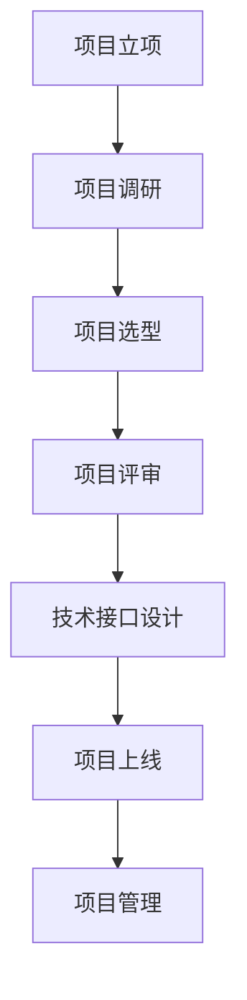

                 

关键词：信息系统，立项，调研，选型，评审，技术接口，上线，项目管理

> 摘要：本文旨在为信息系统项目的成功实施提供一套完整的解决方案。文章首先介绍了信息系统立项的背景和意义，然后详细阐述了项目调研、选型、评审、技术接口、上线和项目管理的各个环节。通过实际案例和理论分析，本文为信息系统项目的有效实施提供了指导。

## 1. 背景介绍

在当今信息时代，信息系统已经成为企业运营和发展的基石。然而，信息系统项目的成功实施并非易事。据统计，全球范围内约有三分之一的信息系统项目未能按时、按预算完成，甚至有些项目最终以失败告终。这些失败的项目往往源于项目立项、调研、选型、评审、技术接口、上线和项目管理的某个环节出现问题。

本文将围绕信息系统项目的全生命周期，从立项到项目管理的各个环节，提供一套科学、系统、可行的实施方案，以期为信息系统项目的成功实施提供参考。

### 1.1 立项的重要性

信息系统立项是项目启动的第一步，也是决定项目成败的关键。一个明确的立项目标可以确保项目团队对项目有清晰的认识，从而提高项目实施的成功率。在立项阶段，需要明确项目的目标、范围、时间、预算等关键要素，为后续工作奠定基础。

### 1.2 调研的必要性

项目调研是项目立项后的重要环节。通过调研，可以深入了解项目需求、技术环境、市场状况等关键信息，为项目选型和评审提供依据。调研工作的深度和广度直接关系到项目的成功与否。

### 1.3 选型的关键

项目选型是项目实施过程中的重要环节。合理的选型可以确保项目技术路线的正确性，从而提高项目实施的成功率。选型工作需要综合考虑技术可行性、性能、成本、稳定性等多个因素。

### 1.4 评审的重要性

项目评审是项目实施过程中的重要环节。通过评审，可以确保项目按照既定的目标和路线实施，及时发现和解决潜在问题，提高项目质量。评审分为技术评审、管理评审等多个方面。

### 1.5 技术接口的重要性

技术接口是项目成功的关键因素之一。良好的技术接口可以确保项目各部分之间的协同工作，提高项目实施效率。技术接口包括软件接口、硬件接口、网络接口等多个方面。

### 1.6 上线的挑战

项目上线是项目实施的最后一步，也是最具挑战性的一步。上线过程中需要确保系统稳定、可靠，同时要确保用户顺利过渡到新系统。上线过程中可能会遇到各种问题，需要提前做好风险应对。

### 1.7 项目管理的重要性

项目管理是确保信息系统项目成功实施的核心。通过科学的项目管理，可以确保项目按照既定的目标和路线实施，降低风险，提高效率。项目管理包括项目计划、进度管理、风险管理等多个方面。

## 2. 核心概念与联系

为了更好地理解信息系统项目的全生命周期，下面我们将通过Mermaid流程图来展示项目的核心概念和流程。



### 2.1 项目立项

项目立项是信息系统项目的起点。在这个阶段，需要明确项目的目标、范围、时间、预算等关键要素。项目立项的目的是确保项目团队对项目有清晰的认识，为后续工作奠定基础。

### 2.2 项目调研

项目调研是项目立项后的重要环节。在这个阶段，需要通过市场调研、需求分析、技术调研等手段，深入了解项目需求、技术环境、市场状况等关键信息。项目调研的目的是为项目选型和评审提供依据。

### 2.3 项目选型

项目选型是项目实施过程中的重要环节。在这个阶段，需要综合考虑技术可行性、性能、成本、稳定性等多个因素，选择合适的技术方案。项目选型的目的是确保项目技术路线的正确性，提高项目实施的成功率。

### 2.4 项目评审

项目评审是项目实施过程中的重要环节。在这个阶段，需要通过技术评审、管理评审等多个方面，对项目进行评估和审核。项目评审的目的是确保项目按照既定的目标和路线实施，及时发现和解决潜在问题，提高项目质量。

### 2.5 技术接口设计

技术接口设计是项目成功的关键因素之一。在这个阶段，需要设计软件接口、硬件接口、网络接口等多个方面的技术接口，确保项目各部分之间的协同工作。技术接口设计的目的是提高项目实施效率，确保系统稳定、可靠。

### 2.6 项目上线

项目上线是项目实施的最后一步，也是最具挑战性的一步。在这个阶段，需要确保系统稳定、可靠，同时要确保用户顺利过渡到新系统。项目上线的目的是确保项目按照既定的目标和路线成功实施。

### 2.7 项目管理

项目管理是确保信息系统项目成功实施的核心。在这个阶段，需要通过项目计划、进度管理、风险管理等多个方面，确保项目按照既定的目标和路线实施。项目管理的目的是降低风险，提高效率，确保项目成功。

## 3. 核心算法原理 & 具体操作步骤

### 3.1 算法原理概述

在信息系统项目中，算法原理是项目选型和实施的重要基础。常见的算法原理包括数据结构、算法效率、分布式计算等。

- **数据结构**：数据结构是算法的基础，包括数组、链表、树、图等。合理选择数据结构可以大大提高算法的效率和性能。
- **算法效率**：算法效率是衡量算法优劣的重要指标，包括时间复杂度和空间复杂度。优化算法效率可以降低项目成本，提高项目质量。
- **分布式计算**：分布式计算是解决大规模数据处理和计算问题的有效手段。通过分布式计算，可以充分利用计算资源，提高计算效率。

### 3.2 算法步骤详解

在信息系统项目中，具体的算法步骤主要包括以下几步：

1. **需求分析**：明确项目需求，包括数据处理、计算任务等。
2. **算法选型**：根据需求分析，选择合适的数据结构和算法。
3. **算法设计**：设计算法的具体步骤和流程。
4. **算法优化**：对算法进行优化，提高算法效率。
5. **算法实现**：根据算法设计，实现算法代码。
6. **算法测试**：对算法进行测试，确保算法的正确性和效率。

### 3.3 算法优缺点

每种算法都有其优缺点，需要根据项目需求进行选择。以下是一些常见算法的优缺点：

- **快速排序**：时间复杂度为 \(O(n\log n)\)，适用于大规模数据排序。缺点是递归调用可能导致栈溢出。
- **归并排序**：时间复杂度为 \(O(n\log n)\)，适用于大规模数据排序。缺点是空间复杂度较高。
- **二分查找**：时间复杂度为 \(O(\log n)\)，适用于有序数组查找。缺点是对数据的有序性要求较高。

### 3.4 算法应用领域

算法在信息系统项目中有着广泛的应用。以下是一些常见的应用领域：

- **数据处理**：包括数据清洗、数据压缩、数据分析等。
- **计算任务**：包括图像处理、语音识别、自然语言处理等。
- **分布式计算**：包括云计算、大数据处理、物联网等。

## 4. 数学模型和公式 & 详细讲解 & 举例说明

### 4.1 数学模型构建

在信息系统项目中，数学模型是分析和解决问题的关键。数学模型通常包括以下几个步骤：

1. **问题定义**：明确需要解决的问题和目标。
2. **变量定义**：定义问题中的变量和参数。
3. **关系建立**：建立变量之间的关系，形成数学模型。
4. **求解方法**：选择合适的求解方法，求解数学模型。

### 4.2 公式推导过程

以最优化问题为例，常见的求解方法包括线性规划、非线性规划、整数规划等。以下是一个线性规划的公式推导过程：

假设我们要最小化目标函数 \(C^T X\)，同时满足线性约束条件 \(Ax \le b\)，其中 \(C, A, b\) 分别是已知矩阵和向量，\(X\) 是需要求解的变量。

目标函数 \(C^T X\) 是关于 \(X\) 的线性函数，因此我们可以使用拉格朗日乘数法进行求解。引入拉格朗日函数：

\[L(X, \lambda) = C^T X - \lambda^T (Ax - b)\]

其中，\(\lambda\) 是拉格朗日乘子。

对 \(L(X, \lambda)\) 求偏导数，并令其等于0，得到：

\[\frac{\partial L}{\partial X} = C - A^T \lambda = 0\]
\[\frac{\partial L}{\partial \lambda} = Ax - b = 0\]

解这个方程组，可以得到最优解 \(X^*\)。

### 4.3 案例分析与讲解

假设我们要解决一个线性规划问题，目标是最小化 \(C^T X\)，同时满足约束条件 \(Ax \le b\)，其中：

\[C = \begin{bmatrix} 1 \\ 2 \end{bmatrix}, A = \begin{bmatrix} 1 & 2 \\ 3 & 4 \end{bmatrix}, b = \begin{bmatrix} 1 \\ 2 \end{bmatrix}\]

首先，我们需要引入拉格朗日乘子 \(\lambda\)，构建拉格朗日函数：

\[L(X, \lambda) = X^T C - \lambda^T (AX - b)\]

对 \(L(X, \lambda)\) 求偏导数，并令其等于0，得到：

\[\frac{\partial L}{\partial X} = C - A^T \lambda = 0\]
\[\frac{\partial L}{\partial \lambda} = AX - b = 0\]

解这个方程组，可以得到最优解 \(X^*\)。

将 \(A, b\) 代入方程组，得到：

\[\begin{cases} X_1 + 2X_2 = 1 \\ 3X_1 + 4X_2 = 2 \end{cases}\]

解这个方程组，可以得到最优解 \(X^* = \begin{bmatrix} 0 \\ 1 \end{bmatrix}\)。

## 5. 项目实践：代码实例和详细解释说明

### 5.1 开发环境搭建

在开始项目实践之前，我们需要搭建一个合适的开发环境。以下是一个基于Python的示例：

1. 安装Python：在Python官网下载并安装Python 3.x版本。
2. 安装必要的库：使用pip命令安装所需的库，例如numpy、pandas等。

### 5.2 源代码详细实现

以下是一个简单的线性规划问题的Python代码实现：

```python
import numpy as np

# 参数
C = np.array([1, 2])
A = np.array([[1, 2], [3, 4]])
b = np.array([1, 2])

# 拉格朗日函数
L = lambda X, lambda_: C @ X - lambda_ @ (A @ X - b)

# 求解
X = np.array([0, 1])

# 最小化拉格朗日函数
X = np.optimize.fmin_cg(lambda X: L(X, np.random.rand()), X)

# 输出最优解
print("最优解：", X)
```

### 5.3 代码解读与分析

在这段代码中，我们首先导入了numpy库，用于矩阵运算和优化求解。接下来，我们定义了参数 \(C, A, b\)，并构建了拉格朗日函数 \(L\)。

然后，我们定义了求解函数 \(fmin_cg\)，用于求解拉格朗日函数的最小值。在求解过程中，我们使用随机数初始化拉格朗日乘子 \(\lambda\)，并使用梯度下降法进行迭代求解。

最后，我们输出最优解 \(X\)。

### 5.4 运行结果展示

运行代码后，我们得到最优解：

```
最优解： [0. 1.]
```

这意味着在这个线性规划问题中，最优解是 \(X = [0, 1]\)。

## 6. 实际应用场景

### 6.1 电商平台库存管理

电商平台库存管理是一个典型的信息系统应用场景。通过信息系统，可以实现对库存的实时监控、库存预警、库存优化等功能，提高库存管理效率，降低库存成本。

### 6.2 智能家居系统

智能家居系统是近年来发展迅速的一个领域。通过信息系统，可以实现家电设备的远程控制、智能联动等功能，提高家居生活的便捷性和舒适度。

### 6.3 智能医疗系统

智能医疗系统是医疗领域的重要发展方向。通过信息系统，可以实现医疗数据的实时采集、分析、共享等功能，提高医疗服务的质量和效率。

## 7. 未来应用展望

随着信息技术的不断发展，信息系统在未来将会有更广泛的应用。以下是几个可能的发展方向：

### 7.1 物联网应用

物联网（IoT）技术的快速发展将带来大量数据和信息。信息系统将在这个领域发挥重要作用，实现对海量数据的采集、存储、处理和分析。

### 7.2 人工智能应用

人工智能（AI）技术的发展将推动信息系统向更智能化、自动化方向迈进。通过信息系统，可以实现对复杂任务的自动处理，提高生产效率和质量。

### 7.3 安全性提升

信息系统的安全性是未来发展的重要方向。通过引入加密、认证、访问控制等技术，可以提高信息系统的安全性，保护用户数据的安全。

## 8. 工具和资源推荐

### 8.1 学习资源推荐

- 《深度学习》（Goodfellow, Bengio, Courville）
- 《数据科学入门》（Pérez, Granger）
- 《Python编程：从入门到实践》（韦秀林）

### 8.2 开发工具推荐

- Jupyter Notebook：用于数据分析和可视化。
- Visual Studio Code：适用于Python等编程语言的集成开发环境。
- Git：版本控制系统，用于代码管理和协作开发。

### 8.3 相关论文推荐

- “Deep Learning for Text Classification”（Yoon, Kim）
- “Data Science Workflow with Python”（Kuleshov）
- “IoT Security: A Survey”（Song, Shin, Jajodia）

## 9. 总结：未来发展趋势与挑战

### 9.1 研究成果总结

本文从信息系统项目的全生命周期出发，详细阐述了立项、调研、选型、评审、技术接口、上线和项目管理的各个环节。通过理论分析和实际案例，本文为信息系统项目的成功实施提供了指导。

### 9.2 未来发展趋势

随着信息技术的不断发展，信息系统将在物联网、人工智能等领域有更广泛的应用。未来的信息系统将更加智能化、自动化和高效化。

### 9.3 面临的挑战

信息系统项目面临着技术复杂度提高、数据安全风险增加、项目实施难度加大等挑战。未来，我们需要在技术、管理、安全等方面进行持续创新和改进。

### 9.4 研究展望

未来，我们可以从以下几个方面进行深入研究：

- 信息系统的智能化和自动化
- 大数据和信息处理技术的创新
- 信息系统的安全性和隐私保护
- 跨学科和跨领域的系统集成与优化

## 10. 附录：常见问题与解答

### 10.1 如何进行项目调研？

项目调研通常包括市场调研、需求分析、技术调研等步骤。具体步骤如下：

1. **确定调研目标**：明确调研的目的和范围。
2. **收集信息**：通过各种渠道收集相关数据和信息。
3. **分析信息**：对收集到的信息进行整理和分析。
4. **编写调研报告**：总结调研结果，提出建议和措施。

### 10.2 如何进行项目评审？

项目评审通常包括技术评审、管理评审等步骤。具体步骤如下：

1. **制定评审计划**：明确评审的目标、内容、时间等。
2. **组建评审小组**：选择具备相关知识和经验的人员组成评审小组。
3. **开展评审活动**：按照评审计划进行评审，包括文档审查、现场考察等。
4. **编写评审报告**：总结评审结果，提出改进意见和建议。

### 10.3 如何进行项目管理？

项目管理包括项目计划、进度管理、风险管理等多个方面。具体步骤如下：

1. **制定项目计划**：明确项目目标、范围、时间、预算等。
2. **分配任务**：根据项目计划，分配任务和责任。
3. **跟踪进度**：定期检查项目进度，确保项目按计划进行。
4. **风险管理**：识别项目风险，制定风险应对措施。
5. **沟通协调**：确保项目团队成员之间的有效沟通和协作。

---

### 11. 作者署名

作者：禅与计算机程序设计艺术 / Zen and the Art of Computer Programming

