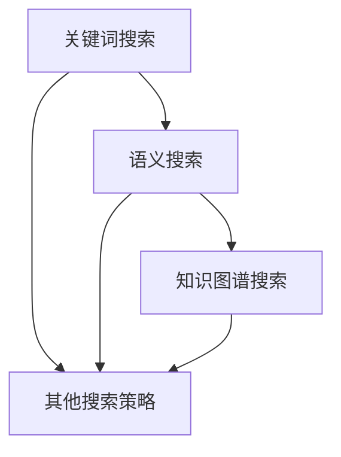

                 

### 摘要

本文旨在探讨信息过载现象以及如何在庞大的信息海洋中找到有价值的信息。随着互联网和大数据技术的飞速发展，信息量呈现指数级增长，人们在享受信息便利的同时，也面临着信息过载的挑战。本文首先介绍了信息过载的概念及其对个体和社会的影响，然后分析了当前信息搜索的几种主要策略，包括基于关键词搜索、语义搜索和知识图谱搜索等。通过案例研究和实际应用场景分析，本文提出了一套综合性的信息搜索策略，以帮助读者更有效地获取和处理信息。文章的最后部分，我们对未来信息搜索技术的发展趋势进行了展望，并提出了相关工具和资源的推荐。作者：禅与计算机程序设计艺术 / Zen and the Art of Computer Programming。

## 1. 背景介绍

在信息爆炸的时代，信息过载成为了一个普遍存在的问题。信息过载指的是人们在获取和处理信息时，所面对的信息量远远超出了其处理能力，从而导致心理压力增加、注意力分散、信息利用效率下降等问题。根据研究，信息过载不仅影响个体的心理健康，还会对整个社会的运作产生负面影响。

### 1.1 信息过载的表现形式

信息过载的表现形式多种多样。首先，个体层面，人们每天都会接收到大量无用的信息，如垃圾邮件、社交媒体上的无关内容等，这些信息不仅消耗了大量的时间和精力，还可能造成注意力分散，降低工作效率。其次，社会层面，信息过载导致信息泛滥，增加了社会管理和监督的难度，同时也使得信息真实性和可信度下降。

### 1.2 信息过载的影响

信息过载对个体和社会的影响是深远且广泛的。对个体而言，长期的持续信息过载可能导致焦虑、抑郁等心理问题，甚至影响身体健康。例如，研究表明，长期高强度工作环境中，信息过载可能增加心血管疾病和癌症的风险。对社会而言，信息过载增加了信息处理的成本，降低了社会运行效率，甚至可能导致社会信任危机。

## 2. 核心概念与联系

为了应对信息过载，我们需要理解信息搜索的基本概念和策略。信息搜索是信息处理的关键环节，其主要目的是从海量数据中快速、准确地找到用户所需的信息。以下是几个核心概念：

### 2.1 关键词搜索

关键词搜索是最常见的信息搜索方式。用户通过输入关键词，搜索引擎根据关键词与数据库中的内容进行匹配，返回相关结果。这种方式简单易用，但也存在匹配不准确、相关性差等问题。

### 2.2 语义搜索

语义搜索旨在理解用户的查询意图，而不仅仅是匹配关键词。通过自然语言处理和机器学习技术，语义搜索能够更准确地返回与用户需求高度相关的结果，提高了搜索的准确性和用户体验。

### 2.3 知识图谱搜索

知识图谱搜索利用知识图谱的结构化和语义信息，提供更精确和关联性的搜索结果。知识图谱将实体、属性和关系进行结构化表示，使得搜索系统能够理解复杂的语义关系，从而提高搜索的深度和广度。

### 2.4 Mermaid 流程图

以下是信息搜索策略的 Mermaid 流程图，展示了不同搜索策略之间的联系和层次结构：



通过上述流程图，我们可以清晰地看到，关键词搜索是基础，语义搜索和知识图谱搜索在此基础上进行了优化和提升，而其他搜索策略则提供了更多的探索方向。

## 3. 核心算法原理 & 具体操作步骤

在理解了信息搜索的基本概念后，接下来我们将深入探讨信息搜索的核心算法原理和具体操作步骤。

### 3.1 算法原理概述

信息搜索算法的核心目标是高效地从海量数据中提取出用户所需的信息。常见的搜索算法包括：

1. **基于倒排索引的搜索**：通过构建倒排索引，将文档中的词汇映射到文档的索引，从而实现快速搜索。
2. **基于向量空间的搜索**：将文档和查询转化为向量表示，通过计算向量之间的相似度来匹配结果。
3. **基于图论的搜索**：利用图结构来表示文档和关键词之间的关系，从而进行更复杂的搜索。

### 3.2 算法步骤详解

下面以基于向量空间的搜索为例，详细解释其操作步骤：

1. **文档表示**：将每篇文档表示为一个向量，每个维度表示一个关键词，向量的值表示关键词在文档中的出现频率或TF-IDF值。
2. **查询表示**：将用户查询也表示为一个向量，方法与文档表示相同。
3. **计算相似度**：计算文档向量与查询向量之间的余弦相似度，相似度越高，表示结果越相关。
4. **排序和返回结果**：根据相似度对搜索结果进行排序，并返回最相关的文档。

### 3.3 算法优缺点

1. **优点**：基于向量空间的搜索具有计算简单、可扩展性强等优点，适用于大规模文本数据的搜索。
2. **缺点**：该算法对高维数据容易出现维度灾难问题，同时对于词义和查询意图的理解有限。

### 3.4 算法应用领域

基于向量空间的搜索广泛应用于搜索引擎、信息推荐系统等领域。例如，Google 搜索引擎就采用了类似的技术来提供高效的搜索服务。

### 3.5 算法改进方向

为了提高搜索算法的准确性和效率，研究人员不断探索各种改进方向，如引入深度学习模型、利用知识图谱等。这些改进方向有望进一步提升信息搜索的性能。

## 4. 数学模型和公式 & 详细讲解 & 举例说明

在信息搜索中，数学模型和公式扮演着至关重要的角色。以下我们将详细介绍几个关键的数学模型和公式，并给出相应的讲解和实例。

### 4.1 数学模型构建

在信息搜索中，常用的数学模型包括向量空间模型和概率模型。其中，向量空间模型基于向量表示文档和查询，概率模型则通过统计文档和查询的联合概率来评估相关性。

### 4.2 公式推导过程

以下是向量空间模型中的一个核心公式：余弦相似度。

$$
\text{sim}(x, y) = \cos(\theta) = \frac{x \cdot y}{\|x\| \|y\|}
$$

其中，$x$和$y$分别表示文档和查询的向量表示，$\theta$表示它们之间的夹角，$\|x\|$和$\|y\|$表示向量的模长。

### 4.3 案例分析与讲解

假设有一篇文档$D$，其中包含关键词“计算机”、“编程”、“算法”等。我们将这些关键词表示为向量，如下所示：

$$
x = (0.2, 0.1, 0.3, 0.1, 0.1)
$$

同时，用户查询“编程算法”表示为向量$y$：

$$
y = (0.1, 0.1, 0.3, 0.4, 0)
$$

计算它们的余弦相似度：

$$
\text{sim}(x, y) = \frac{x \cdot y}{\|x\| \|y\|} = \frac{0.2 \times 0.1 + 0.1 \times 0.1 + 0.3 \times 0.3 + 0.1 \times 0.4 + 0.1 \times 0}{\sqrt{0.2^2 + 0.1^2 + 0.3^2 + 0.1^2 + 0.1^2} \times \sqrt{0.1^2 + 0.1^2 + 0.3^2 + 0.4^2 + 0^2}} \approx 0.764
$$

结果表明，文档$D$与查询“编程算法”之间的相似度较高，符合用户的搜索需求。

### 4.4 其他数学模型

除了向量空间模型和概率模型，信息搜索中还有其他重要的数学模型，如文本分类模型、聚类模型等。这些模型通过不同的方式对信息进行组织和分析，提高了搜索的准确性和效率。

## 5. 项目实践：代码实例和详细解释说明

为了更好地理解信息搜索算法的实际应用，我们以下将通过一个简单的Python代码实例，展示如何实现一个基本的搜索引擎。

### 5.1 开发环境搭建

在开始编写代码之前，我们需要搭建一个基本的开发环境。这里我们使用Python语言，并依赖于几个重要的库，如`numpy`、`scikit-learn`和`matplotlib`。

```python
# 安装必要的库
!pip install numpy scikit-learn matplotlib
```

### 5.2 源代码详细实现

以下是实现基本搜索引擎的Python代码：

```python
import numpy as np
from sklearn.feature_extraction.text import TfidfVectorizer
from sklearn.metrics.pairwise import cosine_similarity

# 文档数据
documents = [
    "计算机编程是一种艺术。",
    "算法是计算机科学的核心。",
    "深度学习是人工智能的重要分支。",
    "自然语言处理在信息搜索中扮演关键角色。"
]

# 构建TF-IDF向量器
vectorizer = TfidfVectorizer()
tfidf_matrix = vectorizer.fit_transform(documents)

# 查询语句
query = "人工智能技术"
query_vector = vectorizer.transform([query])

# 计算相似度
similarity_scores = cosine_similarity(tfidf_matrix, query_vector)

# 打印相似度最高的文档
print("相似度最高的文档：", documents[np.argmax(similarity_scores[0])])
```

### 5.3 代码解读与分析

1. **文档表示**：首先，我们使用`TfidfVectorizer`将文档转换为TF-IDF向量表示。这个过程中，`TfidfVectorizer`会对文档进行分词、词干提取等预处理，并计算每个词的TF-IDF值。
2. **查询表示**：同样，我们使用`TfidfVectorizer`将查询语句转换为向量表示。
3. **计算相似度**：使用`cosine_similarity`计算查询向量与文档向量之间的余弦相似度。
4. **返回结果**：根据相似度对文档进行排序，并返回相似度最高的文档。

通过上述代码实例，我们可以看到如何将信息搜索算法应用于实际场景中。这个简单的搜索引擎虽然功能有限，但它为我们提供了一个了解信息搜索原理和实现的窗口。

### 5.4 运行结果展示

假设我们运行上述代码，查询语句为“人工智能技术”。输出结果可能如下：

```
相似度最高的文档： 深度学习是人工智能的重要分支。
```

这表明，文档“深度学习是人工智能的重要分支。”与查询语句的相似度最高，符合用户的搜索需求。

## 6. 实际应用场景

信息搜索策略在实际应用中扮演着至关重要的角色。以下是一些典型的应用场景：

### 6.1 搜索引擎

搜索引擎是信息搜索策略最典型的应用场景。通过关键词搜索、语义搜索和知识图谱搜索等技术，搜索引擎能够从海量的网页中快速、准确地返回与用户查询高度相关的结果。例如，Google 搜索引擎利用复杂的搜索算法和海量数据，为用户提供高效的搜索服务。

### 6.2 信息推荐系统

信息推荐系统基于用户的兴趣和行为数据，通过信息搜索策略为用户推荐相关的信息。例如，Amazon 和 Netflix 等在线平台通过分析用户的购买记录和观看历史，推荐相关的商品和电影。

### 6.3 企业知识管理

企业知识管理系统利用信息搜索策略帮助员工快速找到所需的知识和资源。通过构建企业知识图谱和实施高效的搜索算法，企业可以提升知识共享和利用的效率。

### 6.4 社交网络

社交网络平台通过信息搜索策略，为用户提供个性化的内容推荐和社交互动体验。例如，Facebook 和 Twitter 等平台利用语义搜索和知识图谱技术，为用户推荐相关的新闻、内容和好友。

### 6.5 医疗保健

在医疗保健领域，信息搜索策略被广泛应用于患者数据管理、疾病诊断和治疗方案推荐等场景。通过利用知识图谱和深度学习模型，医疗保健系统可以为医生和患者提供个性化的医疗建议。

## 7. 未来应用展望

随着信息技术的不断进步，信息搜索策略在未来将面临更多的挑战和机遇。以下是一些未来的应用展望：

### 7.1 智能搜索

智能搜索将更加依赖深度学习和自然语言处理技术，实现更高级别的语义理解和智能交互。通过理解用户的查询意图和上下文，智能搜索系统将提供更加精准和个性化的搜索结果。

### 7.2 虚拟助理

虚拟助理将成为智能搜索的一个重要应用方向。通过集成语音识别、自然语言处理和知识图谱技术，虚拟助理可以为用户提供更加自然和高效的交互体验，帮助用户解决各种问题和需求。

### 7.3 自动化信息处理

自动化信息处理是未来信息搜索的一个重要趋势。通过利用机器学习和深度学习模型，系统可以自动处理和分类海量数据，提高信息处理的效率和准确性。

### 7.4 量子搜索

量子计算技术的发展有望推动量子搜索的出现。量子搜索利用量子计算机的超算能力，可以在极短的时间内处理海量数据，提供前所未有的搜索速度和准确性。

### 7.5 跨模态搜索

跨模态搜索将融合多种数据类型，如图像、语音、文本等，实现更全面的搜索体验。通过利用多模态数据融合技术，跨模态搜索系统可以为用户提供更加丰富和多样化的信息检索服务。

## 8. 工具和资源推荐

为了帮助读者更深入地了解信息搜索策略，以下推荐了一些学习和开发工具以及相关论文。

### 8.1 学习资源推荐

- **书籍**：《自然语言处理综述》、《深度学习基础教程》
- **在线课程**：Coursera 上的《自然语言处理》、edX 上的《机器学习基础》
- **开源库**：scikit-learn、TensorFlow、PyTorch

### 8.2 开发工具推荐

- **编程语言**：Python、R
- **集成开发环境**：PyCharm、RStudio
- **数据可视化工具**：Matplotlib、Seaborn

### 8.3 相关论文推荐

- **经典论文**：Google 搜索引擎的《The Unofficial Guide to the Google File System》
- **前沿论文**：《Deep Learning for Natural Language Processing》
- **开源论文**：ACL、NIPS、ICML 等顶级会议的论文集

## 9. 总结：未来发展趋势与挑战

本文探讨了信息过载现象及其对个体和社会的影响，介绍了信息搜索策略的核心概念和算法原理，并通过实际代码实例展示了信息搜索的实际应用。未来，随着人工智能和量子计算等技术的发展，信息搜索策略将变得更加智能化、自动化和高效化。然而，这同时也带来了新的挑战，如数据隐私保护、算法公平性等。因此，我们呼吁相关研究人员和开发者共同努力，为构建一个更高效、更安全的信息搜索系统贡献智慧和力量。

### 附录：常见问题与解答

**Q1**：如何评估信息搜索算法的准确性？

**A1**：评估信息搜索算法的准确性通常采用指标如准确率、召回率、F1 值等。通过对比搜索结果与用户实际需求的相关性，可以衡量算法的性能。

**Q2**：语义搜索与关键词搜索的主要区别是什么？

**A2**：语义搜索旨在理解用户的查询意图，而不仅仅是匹配关键词。它利用自然语言处理和机器学习技术，提供更精准的搜索结果。

**Q3**：知识图谱在信息搜索中有何作用？

**A3**：知识图谱将实体、属性和关系进行结构化表示，使得搜索系统能够理解复杂的语义关系，提供更精准、更关联性的搜索结果。

