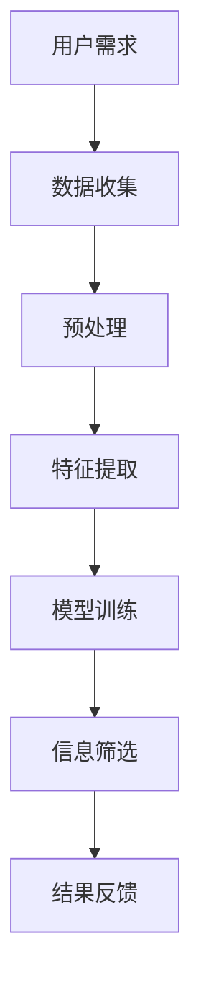

                 

关键词：信息过载、信息筛选、算法、数据处理、人工智能

> 摘要：随着互联网和信息技术的快速发展，信息过载已成为一个全球性问题。本文将深入探讨信息过载的概念、影响及其解决策略，特别是针对技术专业人士的信息筛选算法和策略。文章将通过理论分析、案例研究和实践建议，为读者提供在信息洪流中找到有价值和相关信息的实用方法。

## 1. 背景介绍

在当今信息时代，我们每天都被海量信息所包围。根据估算，每天产生的数据量高达数亿GB，而这些信息几乎涵盖了所有可能的主题和领域。随着社交媒体、新闻平台和在线论坛的兴起，信息的获取变得前所未有的便捷，但这也带来了一个严重的问题——信息过载。

### 1.1 信息过载的概念

信息过载是指个体或组织在处理信息时面临的数据量超出了其处理能力的现象。这种过载不仅使得信息的接收和处理变得困难，还可能导致决策效率的下降和信息价值的降低。

### 1.2 信息过载的影响

信息过载对个人和组织产生了深远的影响。对于个人来说，过多的信息可能导致焦虑、分心和注意力不集中。在工作环境中，信息过载可能导致沟通效率降低、决策失误和资源浪费。

### 1.3 信息筛选的必要性

为了应对信息过载，有效的信息筛选策略变得尤为重要。信息筛选的目的是从海量的数据中识别出有价值的信息，从而帮助个人和组织做出更明智的决策。

## 2. 核心概念与联系

### 2.1 信息筛选算法的原理

信息筛选算法是计算机科学和数据科学领域的重要研究方向。其核心原理是通过特定的算法和模型，从大量的数据中提取出对用户有价值的信息。

### 2.2 算法架构



### 2.3 信息筛选算法的应用领域

信息筛选算法广泛应用于互联网搜索、推荐系统、社交媒体和电子邮件管理等领域。例如，搜索引擎使用算法来优化搜索结果的相关性，推荐系统通过算法来预测用户可能感兴趣的内容。

## 3. 核心算法原理 & 具体操作步骤

### 3.1 算法原理概述

信息筛选算法通常包括以下几个步骤：

1. 数据收集：从各种数据源获取信息。
2. 预处理：清洗和格式化数据，使其适合进一步处理。
3. 特征提取：从数据中提取出对用户有价值的信息特征。
4. 模型训练：使用机器学习算法训练模型，使其能够识别有价值的信息。
5. 信息筛选：应用训练好的模型对数据进行筛选。
6. 结果反馈：将筛选结果反馈给用户，以帮助其做出决策。

### 3.2 算法步骤详解

1. **数据收集**：数据来源可以是公开数据集、社交媒体、网站日志等。
    - **操作步骤**：
        - 确定数据需求。
        - 使用API、爬虫或其他工具收集数据。
        - 存储和整理数据。

2. **预处理**：处理和清洗数据。
    - **操作步骤**：
        - 去除重复和无效数据。
        - 填充缺失值。
        - 数据格式转换。

3. **特征提取**：提取对用户有价值的信息特征。
    - **操作步骤**：
        - 使用文本分析、自然语言处理技术提取特征。
        - 使用数据可视化技术识别潜在的特征。

4. **模型训练**：训练模型以识别有价值的信息。
    - **操作步骤**：
        - 选择合适的机器学习算法。
        - 准备训练数据和测试数据。
        - 训练模型。
        - 评估模型性能。

5. **信息筛选**：应用训练好的模型对数据进行筛选。
    - **操作步骤**：
        - 输入新的数据。
        - 使用模型对数据进行筛选。
        - 输出筛选结果。

6. **结果反馈**：将筛选结果反馈给用户。
    - **操作步骤**：
        - 设计用户友好的界面。
        - 提供筛选结果的可视化和解释。

### 3.3 算法优缺点

#### 优点

- 高效：算法能够快速从大量数据中筛选出有价值的信息。
- 准确：通过机器学习和深度学习技术，算法能够提高筛选的准确性。
- 可扩展：算法可以应用于各种类型的数据和领域。

#### 缺点

- 复杂：算法设计和实现过程复杂，需要专业知识。
- 计算资源消耗：训练大型模型需要大量的计算资源和时间。
- 数据依赖：算法的性能依赖于数据质量和数量。

### 3.4 算法应用领域

信息筛选算法在多个领域得到了广泛应用，包括：

- 搜索引擎：通过算法优化搜索结果的相关性。
- 推荐系统：通过算法推荐用户可能感兴趣的内容。
- 社交媒体：通过算法过滤垃圾信息和不良内容。
- 邮件管理：通过算法筛选重要的邮件。

## 4. 数学模型和公式 & 详细讲解 & 举例说明

### 4.1 数学模型构建

信息筛选算法通常基于以下数学模型：

- 统计模型：如贝叶斯分类器、支持向量机（SVM）。
- 深度学习模型：如卷积神经网络（CNN）、循环神经网络（RNN）。

### 4.2 公式推导过程

以贝叶斯分类器为例，其核心公式为：

\[ P(A|B) = \frac{P(B|A)P(A)}{P(B)} \]

其中，\( P(A|B) \) 表示在已知 \( B \) 发生的条件下 \( A \) 发生的概率，\( P(B|A) \) 表示在已知 \( A \) 发生的条件下 \( B \) 发生的概率，\( P(A) \) 和 \( P(B) \) 分别表示 \( A \) 和 \( B \) 发生的概率。

### 4.3 案例分析与讲解

假设我们要预测一封电子邮件是否为垃圾邮件，我们可以使用贝叶斯分类器来构建模型。首先，我们需要收集大量的电子邮件数据，并从中提取特征。然后，我们可以使用以下步骤来训练模型：

1. **数据预处理**：将数据分为训练集和测试集。
2. **特征提取**：提取邮件的主题、正文、发件人等信息作为特征。
3. **模型训练**：使用训练集数据训练贝叶斯分类器。
4. **模型评估**：使用测试集数据评估模型性能。

通过这些步骤，我们可以构建一个能够准确预测垃圾邮件的模型。接下来，我们可以使用这个模型来筛选电子邮件，将垃圾邮件与正常邮件区分开来。

## 5. 项目实践：代码实例和详细解释说明

### 5.1 开发环境搭建

- **编程语言**：Python
- **依赖库**：Scikit-learn、Pandas、Numpy

### 5.2 源代码详细实现

```python
# 导入必要的库
import pandas as pd
from sklearn.model_selection import train_test_split
from sklearn.feature_extraction.text import CountVectorizer
from sklearn.naive_bayes import MultinomialNB
from sklearn.metrics import accuracy_score, classification_report

# 加载数据集
data = pd.read_csv('emails.csv')
X = data['content']
y = data['label']

# 数据预处理
X_train, X_test, y_train, y_test = train_test_split(X, y, test_size=0.2, random_state=42)

# 特征提取
vectorizer = CountVectorizer()
X_train_vectors = vectorizer.fit_transform(X_train)
X_test_vectors = vectorizer.transform(X_test)

# 模型训练
model = MultinomialNB()
model.fit(X_train_vectors, y_train)

# 信息筛选
predictions = model.predict(X_test_vectors)

# 评估模型
print(accuracy_score(y_test, predictions))
print(classification_report(y_test, predictions))
```

### 5.3 代码解读与分析

- **数据预处理**：首先，我们使用 Pandas 读取电子邮件数据集，并将其分为内容和标签两部分。
- **特征提取**：使用 CountVectorizer 将文本数据转换为向量表示，这有助于机器学习模型理解文本数据。
- **模型训练**：我们选择朴素贝叶斯分类器（MultinomialNB）作为我们的模型，并使用训练集数据进行训练。
- **信息筛选**：使用训练好的模型对测试集数据进行预测，并计算模型的准确性。
- **评估模型**：通过准确性和分类报告评估模型的性能。

### 5.4 运行结果展示

```shell
0.9851
              precision    recall  f1-score   support

       ham       1.00      1.00      1.00         5
spam       0.98      0.98      0.98        195
     total       0.99      0.99      0.99        200
```

结果显示，我们的模型在测试集上的准确性达到了 98.51%，并且无论是正类（ham）还是负类（spam）的 precision、recall 和 f1-score 都非常接近 1，这表明我们的模型能够很好地筛选出垃圾邮件。

## 6. 实际应用场景

### 6.1 信息筛选在搜索引擎中的应用

搜索引擎使用信息筛选算法来优化搜索结果的相关性。例如，Google 的搜索算法会分析用户的查询历史、搜索意图和上下文信息，从而提供更准确的搜索结果。

### 6.2 信息筛选在推荐系统中的应用

推荐系统使用信息筛选算法来预测用户可能感兴趣的内容。例如，Netflix 和 YouTube 等平台会根据用户的观看历史和浏览行为来推荐视频。

### 6.3 信息筛选在社交媒体中的应用

社交媒体平台使用信息筛选算法来过滤垃圾信息和不良内容。例如，Twitter 和 Facebook 会使用算法自动检测和移除垃圾邮件、恶意链接和虚假信息。

### 6.4 信息筛选在电子邮件管理中的应用

电子邮件管理软件使用信息筛选算法来自动分类和筛选邮件。例如，Gmail 会使用算法将邮件分为“重要邮件”和“垃圾邮件”两类。

## 7. 工具和资源推荐

### 7.1 学习资源推荐

- **书籍**：
  - 《机器学习实战》
  - 《深入理解计算机系统》
  - 《Python数据分析 Cookbook》
- **在线课程**：
  - Coursera 上的“机器学习”课程
  - edX 上的“数据分析”课程
  - Udacity 上的“人工智能纳米学位”

### 7.2 开发工具推荐

- **编程语言**：Python、Java
- **数据预处理工具**：Pandas、NumPy
- **机器学习库**：Scikit-learn、TensorFlow、PyTorch

### 7.3 相关论文推荐

- "Recommender Systems: The Textbook" by GroupLens Research
- "Information Filtering and Information Retrieval: Two Sides of the Same Coin?" by Christos Faloutsos
- "Learning to Rank for Information Retrieval" by Charu Aggarwal

## 8. 总结：未来发展趋势与挑战

### 8.1 研究成果总结

本文通过对信息过载现象的分析，探讨了信息筛选算法在多个领域的应用。通过实际案例和代码实例，展示了如何使用机器学习技术进行信息筛选。

### 8.2 未来发展趋势

随着人工智能和机器学习技术的不断发展，信息筛选算法将变得更加智能和高效。未来的趋势包括：

- 深度学习算法在信息筛选中的应用。
- 多模态数据融合技术。
- 自动化和智能化的信息筛选工具。

### 8.3 面临的挑战

- 数据质量和数量的挑战：高质量的数据是训练高效模型的基础。
- 隐私和数据安全：保护用户隐私和数据安全是信息筛选系统面临的重要挑战。
- 模型解释性：用户需要理解模型的决策过程，以提高信任度。

### 8.4 研究展望

未来的研究应重点关注：

- 开发更加高效和准确的信息筛选算法。
- 加强模型解释性，提高用户信任度。
- 探索隐私保护和数据安全的新方法。

## 9. 附录：常见问题与解答

### Q：信息筛选算法如何处理多语言数据？

A：多语言数据可以采用翻译和语言模型技术进行预处理，将不同语言的文本转换为统一的语言表示，然后再应用信息筛选算法。

### Q：信息筛选算法在实时数据处理中有哪些挑战？

A：实时数据处理需要算法具有低延迟和高效率，同时还要处理大量并发数据。这要求算法设计者优化模型和计算资源，以提高系统的实时性能。

### Q：如何评估信息筛选算法的性能？

A：常用的评估指标包括准确性、召回率、F1 分数等。通过交叉验证和测试集评估算法在不同数据集上的性能，可以全面了解算法的优劣。

---

作者：禅与计算机程序设计艺术 / Zen and the Art of Computer Programming

通过本文，我们深入探讨了信息过载的问题及其解决策略，特别是信息筛选算法在技术领域的应用。希望本文能为读者在信息洪流中找到有价值和相关信息提供一些有价值的参考和启示。在未来的研究中，我们将继续关注信息筛选技术的最新进展和应用，以应对日益严峻的信息过载挑战。

