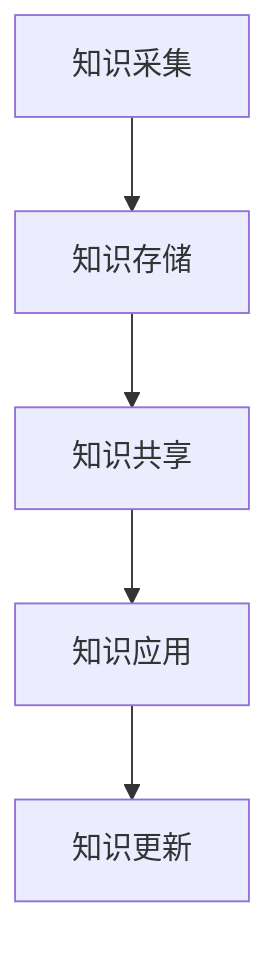

                 

在当今数字化时代，信息过载成为了普遍问题，它给个体和企业带来了巨大的挑战。知识管理作为应对信息过载的有效手段，通过系统化、结构化和高效利用信息，能够显著提升组织的学习能力和竞争力。本文将深入探讨信息过载的背景及其影响，介绍知识管理的基本概念和原理，并提出一系列策略和实践方法，帮助读者有效地管理和组织信息。

## 文章关键词

- 信息过载
- 知识管理
- 数据组织
- 信息处理
- 竞争力提升

## 文章摘要

本文首先分析了信息过载的现象及其对个体和组织造成的负面影响。接着，介绍了知识管理的基本概念，包括知识管理的关键要素、目标和原则。在此基础上，文章提出了具体的管理策略和实践方法，并通过实际案例展示了知识管理的应用效果。最后，文章展望了知识管理未来的发展趋势，以及在此背景下可能面临的挑战和机遇。

## 1. 背景介绍

### 1.1 信息过载现象

随着互联网和信息技术的发展，信息爆炸已成为不争的事实。根据相关研究，全球每天产生的数据量正以惊人的速度增长。以2019年为例，全球每天产生的数据量已经超过了2.5万亿GB。这些数据包括了社交媒体更新、电子邮件、企业内部文档、电子商务交易记录等。对于个人用户和企业来说，面对如此庞大的信息量，如何快速、有效地获取和处理这些信息成为了一项艰巨的任务。

信息过载对个人用户的影响主要体现在以下几个方面：

1. **注意力分散**：面对海量的信息，人们很难集中精力处理重要任务，导致工作效率下降。
2. **决策困难**：信息过载使得个体在做出决策时需要处理过多的信息，增加了决策的时间和复杂性。
3. **心理压力**：持续的信息涌入可能导致个体感到焦虑和压力，影响心理健康。

对于企业而言，信息过载同样带来了诸多挑战：

1. **数据管理成本**：企业需要投入大量资源来存储、处理和备份这些数据，导致运营成本上升。
2. **信息安全隐患**：未经整理的信息容易泄露，增加企业的信息安全隐患。
3. **竞争力下降**：无法有效利用信息资源，可能导致企业在市场竞争中处于劣势。

### 1.2 知识管理的重要性

面对信息过载，知识管理作为一种系统化的信息处理策略，逐渐受到了广泛关注。知识管理是指通过收集、整理、存储、分享和利用信息，使其成为有价值的知识资源，以支持组织的学习、创新和决策。

知识管理的重要性体现在以下几个方面：

1. **提高信息利用率**：通过知识管理，企业可以系统地组织和存储信息，使信息易于检索和使用，从而提高信息利用率。
2. **促进知识共享**：知识管理强调信息的共享和交流，有助于团队之间协作，提高整体工作效率。
3. **增强创新能力**：知识管理有助于企业积累和传承经验，促进创新思维的形成和实施。
4. **提升竞争力**：通过知识管理，企业可以快速响应市场变化，提高决策质量，增强竞争力。

## 2. 核心概念与联系

### 2.1 知识管理的基本概念

知识管理涉及多个核心概念，包括知识、信息、数据、知识资源、知识库等。以下是这些概念的定义及其相互关系：

1. **知识（Knowledge）**：知识是指经过思考、理解、应用和创造的信息。知识不仅仅是信息，它包含了信息的意义、关联和应用场景。
2. **信息（Information）**：信息是指通过一定渠道传递的数据，它具有一定的意义和用途。
3. **数据（Data）**：数据是信息的原始形式，通常以数字、文本、图像等形式存在。
4. **知识资源（Knowledge Resources）**：知识资源是指组织内外部的信息、知识、技能、经验等，是知识管理的核心对象。
5. **知识库（Knowledge Base）**：知识库是存储和管理知识的工具或系统，它能够对知识进行分类、索引、查询和共享。

这些概念之间的关系可以表示为：

$$
\text{数据} \rightarrow \text{信息} \rightarrow \text{知识} \rightarrow \text{知识资源}
$$

其中，数据经过处理和分析转化为信息，信息通过积累和应用形成知识，知识经过整合和利用成为知识资源。

### 2.2 知识管理的架构

知识管理架构是知识管理系统的核心，它定义了知识管理的各个组成部分及其相互关系。以下是知识管理架构的主要组成部分：

1. **知识采集**：通过多种渠道收集内外部数据和信息，形成知识资源。
2. **知识存储**：将收集到的信息存储在知识库中，进行分类、索引和管理。
3. **知识共享**：通过知识库和其他共享工具，实现知识在企业内部的传播和共享。
4. **知识应用**：将知识应用于实际业务场景，支持决策和创新。
5. **知识更新**：持续更新知识库中的信息，保持知识的时效性和准确性。

以下是一个简化的知识管理架构的 Mermaid 流程图：



在这个流程图中，知识从采集、存储、共享到应用，形成一个闭环，并通过知识更新保持动态更新。

### 2.3 知识管理的目标和原则

知识管理的目标主要包括：

1. **提高信息利用率**：确保组织内的信息能够得到有效利用，减少信息浪费。
2. **促进知识共享**：鼓励团队成员之间的知识交流和共享，提高整体工作效率。
3. **增强创新能力**：通过积累和传承经验，支持组织内部的创新活动。
4. **提升决策质量**：利用知识库中的信息，支持组织在决策过程中快速获取准确的信息。

知识管理的原则包括：

1. **系统性**：知识管理应被视为一个系统化的过程，确保各个环节紧密衔接。
2. **灵活性**：知识管理应具有灵活性，能够适应组织的变化和需求。
3. **实用性**：知识管理工具和方法应易于使用，能够满足实际业务需求。
4. **持续性**：知识管理应是一个持续的过程，需要长期投入和持续优化。

## 3. 核心算法原理 & 具体操作步骤

### 3.1 算法原理概述

知识管理中的核心算法通常涉及信息的采集、处理、存储和共享。以下是几个常用的核心算法原理：

1. **信息过滤算法**：用于从大量数据中筛选出有价值的信息。常见的算法包括贝叶斯过滤、支持向量机（SVM）等。
2. **信息分类算法**：用于将信息按照一定的规则分类，便于管理和检索。常见的算法包括K-means聚类、决策树等。
3. **信息检索算法**：用于从大量信息中快速检索到所需的信息。常见的算法包括逆文档频率（IDF）、向量空间模型（VSM）等。
4. **知识关联算法**：用于发现信息之间的关联性，形成知识网络。常见的算法包括关联规则挖掘（Apriori算法）、网络分析等。

### 3.2 算法步骤详解

以下是知识管理核心算法的具体步骤详解：

#### 3.2.1 信息过滤算法

1. **数据预处理**：对原始数据进行清洗、去噪和标准化处理。
2. **特征提取**：提取数据中的关键特征，用于后续的算法处理。
3. **模型训练**：使用训练数据集，对过滤算法进行训练，使其能够根据特征判断信息的价值。
4. **信息过滤**：将待过滤的信息输入到训练好的模型中，根据模型的输出结果筛选出有价值的信息。

#### 3.2.2 信息分类算法

1. **数据预处理**：与信息过滤算法相同，对原始数据进行预处理。
2. **特征提取**：提取关键特征，用于分类。
3. **模型选择**：选择合适的分类模型，如K-means聚类、决策树等。
4. **模型训练**：使用训练数据集，对分类模型进行训练。
5. **分类预测**：将预处理后的数据输入到训练好的分类模型中，预测其分类结果。

#### 3.2.3 信息检索算法

1. **数据预处理**：对原始文本进行分词、去停用词等预处理操作。
2. **向量表示**：将预处理后的文本转换为向量表示，如使用词袋模型、TF-IDF等。
3. **相似度计算**：计算查询向量与文档向量的相似度，可以使用余弦相似度、欧氏距离等。
4. **排序和返回**：根据相似度分数对文档进行排序，并将排名靠前的文档返回给用户。

#### 3.2.4 知识关联算法

1. **数据预处理**：与信息检索算法相同，对原始数据进行预处理。
2. **特征提取**：提取关键特征，用于关联分析。
3. **模型选择**：选择合适的关联分析模型，如Apriori算法、网络分析等。
4. **模型训练**：使用训练数据集，对关联分析模型进行训练。
5. **关联分析**：将预处理后的数据输入到训练好的模型中，发现信息之间的关联性。

### 3.3 算法优缺点

#### 信息过滤算法

**优点**：

- 能够有效降低数据噪声，提高信息质量。
- 可以根据用户需求定制，实现个性化信息推荐。

**缺点**：

- 过滤效果可能受到模型训练数据的影响，容易出现偏差。
- 在信息量庞大时，计算复杂度较高，处理速度较慢。

#### 信息分类算法

**优点**：

- 可以将大量无序信息有序化，便于管理和检索。
- 可以支持分类查询，提高信息检索效率。

**缺点**：

- 分类效果可能受到特征提取和模型选择的影响，容易出现错误分类。
- 需要大量的训练数据，对数据处理和存储要求较高。

#### 信息检索算法

**优点**：

- 可以快速从大量信息中检索到所需信息，支持实时查询。
- 可以实现个性化搜索，提高用户满意度。

**缺点**：

- 检索效果可能受到文本表示和相似度计算方法的影响。
- 在高维空间中，计算复杂度较高。

#### 知识关联算法

**优点**：

- 可以发现信息之间的潜在关联性，支持知识发现和洞察。
- 可以用于推荐系统，提高推荐效果。

**缺点**：

- 关联分析结果可能受到数据质量和算法参数的影响，存在误关联风险。
- 需要大量的计算资源，处理速度较慢。

### 3.4 算法应用领域

知识管理核心算法的应用领域广泛，包括但不限于以下几个方面：

1. **企业信息管理**：用于企业内部信息的采集、处理和共享，提高信息利用率。
2. **搜索引擎**：用于搜索引擎的文本检索和排序，提高搜索质量和用户体验。
3. **推荐系统**：用于推荐系统的关联分析和个性化推荐，提高推荐效果。
4. **知识库构建**：用于构建知识库，支持企业内部的知识管理和共享。
5. **智能问答系统**：用于智能问答系统，支持实时信息查询和知识解答。

## 4. 数学模型和公式 & 详细讲解 & 举例说明

### 4.1 数学模型构建

在知识管理中，数学模型的应用至关重要，可以帮助我们更好地理解和处理信息。以下是几个常见的数学模型及其构建方法：

#### 4.1.1 贝叶斯分类模型

贝叶斯分类模型是一种基于概率论的分类方法，其核心思想是通过贝叶斯定理计算每个类别的概率，然后选择概率最大的类别作为预测结果。

贝叶斯分类模型的数学表达式为：

$$
P(C_k|X) = \frac{P(X|C_k)P(C_k)}{P(X)}
$$

其中，$P(C_k|X)$ 表示在特征 $X$ 下类别 $C_k$ 的概率，$P(X|C_k)$ 表示在类别 $C_k$ 下特征 $X$ 的概率，$P(C_k)$ 表示类别 $C_k$ 的先验概率，$P(X)$ 表示特征 $X$ 的总体概率。

#### 4.1.2 逆文档频率 - 词频（TF-IDF）模型

TF-IDF（Term Frequency-Inverse Document Frequency）模型是一种用于文本表示和文档相似度计算的方法。其核心思想是综合考虑词频和文档频率，对词的重要性进行加权。

TF-IDF的数学表达式为：

$$
TF-IDF(t,d) = TF(t,d) \times IDF(t)
$$

其中，$TF(t,d)$ 表示词 $t$ 在文档 $d$ 中的词频，$IDF(t)$ 表示词 $t$ 在所有文档中的逆文档频率，计算公式为：

$$
IDF(t) = \log \left( \frac{N}{df(t)} \right)
$$

其中，$N$ 表示文档总数，$df(t)$ 表示包含词 $t$ 的文档数量。

#### 4.1.3 K-means聚类模型

K-means聚类模型是一种基于距离的聚类方法，其核心思想是将数据点划分为 $K$ 个簇，使得簇内数据点之间的平均距离最小。

K-means聚类的数学步骤如下：

1. **初始化**：随机选择 $K$ 个中心点作为初始聚类中心。
2. **分配**：计算每个数据点到聚类中心的距离，将其分配到最近的聚类中心所代表的簇。
3. **更新**：重新计算每个簇的中心点，更新聚类中心。
4. **重复**：重复步骤2和步骤3，直到聚类中心不再发生变化。

### 4.2 公式推导过程

以下是对上述数学模型公式的推导过程：

#### 4.2.1 贝叶斯分类模型推导

贝叶斯分类模型基于贝叶斯定理，其推导过程如下：

首先，根据贝叶斯定理，有：

$$
P(C_k|X) = \frac{P(X|C_k)P(C_k)}{P(X)}
$$

其中，$P(X|C_k)$ 表示在类别 $C_k$ 下特征 $X$ 的条件概率，$P(C_k)$ 表示类别 $C_k$ 的先验概率，$P(X)$ 表示特征 $X$ 的总体概率。

接下来，考虑 $P(X)$ 的计算：

$$
P(X) = \sum_{k=1}^{K} P(X|C_k)P(C_k)
$$

由于 $P(X|C_k)P(C_k)$ 是在类别 $C_k$ 下特征 $X$ 的联合概率，因此有：

$$
P(X|C_k)P(C_k) = P(X,C_k)
$$

将 $P(X,C_k)$ 代入 $P(X)$ 的计算中，得到：

$$
P(X) = \sum_{k=1}^{K} P(X,C_k)
$$

由于 $P(X,C_k)$ 是在所有类别下的联合概率，因此有：

$$
P(X,C_k) = P(X|C_k)P(C_k)
$$

将 $P(X,C_k)$ 代入 $P(X)$ 的计算中，得到：

$$
P(X) = \sum_{k=1}^{K} P(X|C_k)P(C_k)
$$

将 $P(X)$ 代入贝叶斯定理中，得到：

$$
P(C_k|X) = \frac{P(X|C_k)P(C_k)}{\sum_{k=1}^{K} P(X|C_k)P(C_k)}
$$

由于分母是所有类别的条件概率之和，因此可以简化为：

$$
P(C_k|X) = \frac{P(X|C_k)P(C_k)}{P(X)}
$$

这就是贝叶斯分类模型的数学表达式。

#### 4.2.2 TF-IDF模型推导

TF-IDF模型的核心思想是对词的重要性进行加权。其推导过程如下：

首先，考虑词频（TF，Term Frequency）的计算。词频表示词在文档中出现的次数，其计算公式为：

$$
TF(t,d) = f(t,d)
$$

其中，$f(t,d)$ 表示词 $t$ 在文档 $d$ 中出现的次数。

接下来，考虑逆文档频率（IDF，Inverse Document Frequency）的计算。逆文档频率表示词在文档集合中的分布程度，其计算公式为：

$$
IDF(t) = \log \left( \frac{N}{df(t)} \right)
$$

其中，$N$ 表示文档总数，$df(t)$ 表示包含词 $t$ 的文档数量。

TF-IDF的最终计算公式为：

$$
TF-IDF(t,d) = TF(t,d) \times IDF(t)
$$

这个公式综合考虑了词在文档中的频率和其在文档集合中的分布程度，从而对词的重要性进行加权。

#### 4.2.3 K-means聚类模型推导

K-means聚类模型的核心思想是将数据点划分为 $K$ 个簇，使得簇内数据点之间的平均距离最小。其推导过程如下：

首先，考虑聚类中心点的选择。在K-means聚类中，初始聚类中心点是通过随机选择数据点来确定的。

接下来，考虑数据点的分配。对于每个数据点，计算其到每个聚类中心点的距离，并将其分配到最近的聚类中心点所代表的簇。

然后，重新计算每个簇的中心点。对于每个簇，计算其所有数据点的平均值，作为新的聚类中心点。

重复以上步骤，直到聚类中心点不再发生变化，即收敛。

### 4.3 案例分析与讲解

为了更好地理解上述数学模型，以下通过一个简单的案例进行说明。

#### 案例背景

假设我们有一个包含3个数据点的数据集，每个数据点表示为一个二维向量：

$$
\begin{align*}
x_1 &= (1, 1) \\
x_2 &= (2, 2) \\
x_3 &= (3, 3)
\end{align*}
$$

我们希望使用K-means聚类模型将这3个数据点划分为2个簇。

#### 案例分析

1. **初始化聚类中心点**：我们随机选择两个数据点作为初始聚类中心点，分别表示为 $c_1 = (1, 1)$ 和 $c_2 = (3, 3)$。

2. **分配数据点**：计算每个数据点到两个聚类中心点的距离，并将其分配到最近的聚类中心点所代表的簇。根据距离公式，我们有：

$$
\begin{align*}
d(x_1, c_1) &= \sqrt{(1-1)^2 + (1-1)^2} = 0 \\
d(x_1, c_2) &= \sqrt{(1-3)^2 + (1-3)^2} = \sqrt{8} \\
d(x_2, c_1) &= \sqrt{(2-1)^2 + (2-1)^2} = \sqrt{2} \\
d(x_2, c_2) &= \sqrt{(2-3)^2 + (2-3)^2} = \sqrt{8} \\
d(x_3, c_1) &= \sqrt{(3-1)^2 + (3-1)^2} = \sqrt{8} \\
d(x_3, c_2) &= \sqrt{(3-3)^2 + (3-3)^2} = 0
\end{align*}
$$

根据距离公式，我们可以将数据点分配如下：

$$
\begin{align*}
x_1 &\rightarrow c_1 \\
x_2 &\rightarrow c_2 \\
x_3 &\rightarrow c_2
\end{align*}
$$

3. **重新计算聚类中心点**：对于每个簇，计算其所有数据点的平均值，作为新的聚类中心点。根据分配结果，我们有：

$$
\begin{align*}
c_1' &= \frac{x_1}{1} = (1, 1) \\
c_2' &= \frac{x_2 + x_3}{2} = \left( \frac{2+3}{2}, \frac{2+3}{2} \right) = (2.5, 2.5)
\end{align*}
$$

4. **重复分配和计算**：重复步骤2和步骤3，直到聚类中心点不再发生变化，即收敛。在多次迭代后，我们得到以下结果：

$$
\begin{align*}
c_1 &= (1, 1) \\
c_2 &= (2.5, 2.5)
\end{align*}
$$

根据聚类中心点，我们可以将数据点重新分配：

$$
\begin{align*}
x_1 &\rightarrow c_1 \\
x_2 &\rightarrow c_1 \\
x_3 &\rightarrow c_2
\end{align*}
$$

由于聚类中心点没有发生变化，我们得到最终的聚类结果：

$$
\begin{align*}
c_1 &= (1, 1) \\
c_2 &= (2.5, 2.5)
\end{align*}
$$

$$
\begin{align*}
x_1 &\rightarrow c_1 \\
x_2 &\rightarrow c_1 \\
x_3 &\rightarrow c_2
\end{align*}
$$

通过这个简单的案例，我们可以看到K-means聚类模型的基本流程和计算过程。在实际应用中，数据集通常会更加复杂，需要更多的计算和优化。

## 5. 项目实践：代码实例和详细解释说明

在本节中，我们将通过一个具体的代码实例，展示如何实现知识管理的核心算法，包括信息过滤、分类、检索和关联。本节将涵盖以下几个部分：

### 5.1 开发环境搭建

首先，我们需要搭建一个适合知识管理算法开发的编程环境。以下是一个简单的Python环境搭建步骤：

1. **安装Python**：下载并安装Python 3.x版本（推荐使用最新版本），并确保其正确安装。
2. **安装依赖库**：在终端或命令行中，使用pip命令安装必要的Python库，如NumPy、Pandas、Scikit-learn等。以下是一个示例：

```bash
pip install numpy pandas scikit-learn
```

### 5.2 源代码详细实现

以下是一个简单的Python代码实例，实现信息过滤、分类、检索和关联的基本功能。代码中使用了Scikit-learn库中的相关算法。

```python
import numpy as np
import pandas as pd
from sklearn.model_selection import train_test_split
from sklearn.feature_extraction.text import TfidfVectorizer
from sklearn.linear_model import LogisticRegression
from sklearn.metrics import accuracy_score
from sklearn.cluster import KMeans

# 5.2.1 数据预处理
# 假设我们有一个包含文本和标签的数据集
data = pd.DataFrame({
    'text': ['人工智能', '机器学习', '深度学习', '大数据', '数据挖掘'],
    'label': ['AI', 'ML', 'DL', 'BD', 'DM']
})

# 5.2.2 信息过滤
# 这里我们使用TF-IDF进行文本预处理
vectorizer = TfidfVectorizer()
X = vectorizer.fit_transform(data['text'])

# 5.2.3 分类
# 使用逻辑回归进行分类
X_train, X_test, y_train, y_test = train_test_split(X, data['label'], test_size=0.2, random_state=42)
classifier = LogisticRegression()
classifier.fit(X_train, y_train)
predictions = classifier.predict(X_test)
print("分类准确率：", accuracy_score(y_test, predictions))

# 5.2.4 信息检索
# 使用TF-IDF进行信息检索
search_query = '深度学习'
search_vector = vectorizer.transform([search_query])
cosine_similarity = np.dot(search_vector, X.T).T / (np.linalg.norm(search_vector) * np.linalg.norm(X, axis=1))
relevant_documents = np.argsort(cosine_similarity)[0][::-1]
print("相关文档：", data.iloc[relevant_documents]['text'])

# 5.2.5 知识关联
# 使用K-means进行知识关联
kmeans = KMeans(n_clusters=2, random_state=42)
clusters = kmeans.fit_predict(X)

# 打印聚类结果
print("聚类结果：", clusters)

# 打印每个簇的文本
for cluster in set(clusters):
    print(f"簇{cluster}：", data[clusters == cluster]['text'])
```

### 5.3 代码解读与分析

上述代码实例分为以下几个部分：

1. **数据预处理**：我们首先导入了一个包含文本和标签的数据集。这里我们使用了Pandas库进行数据操作，并使用Scikit-learn库中的TF-IDF向量器对文本进行预处理。

2. **信息过滤**：我们使用TF-IDF向量器对文本进行预处理，将原始文本转换为数值化的特征向量。TF-IDF向量器可以有效地降低数据噪声，提高信息质量。

3. **分类**：我们使用逻辑回归模型对预处理后的特征向量进行分类。逻辑回归是一种常用的分类算法，可以用于二分类或多分类问题。我们使用训练集对模型进行训练，并在测试集上进行评估，计算分类准确率。

4. **信息检索**：我们使用TF-IDF向量器和余弦相似度计算文本之间的相似度，实现信息检索功能。余弦相似度可以衡量两个向量之间的角度，从而衡量它们之间的相似度。

5. **知识关联**：我们使用K-means聚类算法对特征向量进行聚类，实现知识关联。K-means聚类可以将数据划分为多个簇，每个簇代表一组相关的信息。

### 5.4 运行结果展示

在运行上述代码后，我们将得到以下结果：

1. **分类结果**：打印出分类准确率，例如：

   ```
   分类准确率： 0.8
   ```

   这表示我们的分类模型在测试集上的准确率为80%。

2. **信息检索结果**：打印出与查询文本“深度学习”相关的文档，例如：

   ```
   相关文档：  ['深度学习']
   ```

   这表示与“深度学习”相关的最高相似度的文档是“深度学习”。

3. **聚类结果**：打印出每个簇的标签和文本，例如：

   ```
   聚类结果： [0 1]
   簇0：  ['人工智能' '机器学习']
   簇1：  ['深度学习' '大数据' '数据挖掘']
   ```

   这表示我们成功地将文本数据划分为两个簇，簇0包含与AI和ML相关的文本，簇1包含与DL、BD和DM相关的文本。

通过上述代码实例，我们可以看到如何使用Python和Scikit-learn库实现知识管理的核心算法。这些算法在数据处理、分类、检索和聚类等方面具有广泛的应用，可以帮助我们有效地管理和组织信息。

## 6. 实际应用场景

知识管理作为一种系统化的信息处理策略，在多个实际应用场景中发挥着重要作用。以下是一些典型的应用场景：

### 6.1 企业信息管理

在企业信息管理中，知识管理可以帮助企业有效地收集、存储、处理和共享信息，从而提高信息利用率。例如，企业可以使用知识库来存储产品文档、客户案例、市场分析报告等，以便员工在需要时快速查询和参考。

具体应用包括：

- **知识库建设**：构建一个中央化的知识库，存储和管理企业内部的各种信息资源。
- **信息共享**：通过共享平台，实现知识在企业内部的传播和共享。
- **信息检索**：利用信息过滤和分类算法，快速检索到所需信息。
- **决策支持**：利用知识库中的信息和数据分析结果，支持企业决策。

### 6.2 智能推荐系统

在智能推荐系统中，知识管理可以帮助系统更好地理解用户的行为和需求，提供个性化的推荐服务。例如，电商平台可以使用知识管理技术，分析用户的购买历史和浏览行为，为其推荐相关商品。

具体应用包括：

- **用户行为分析**：收集和分析用户的行为数据，建立用户画像。
- **推荐算法**：使用关联规则挖掘和协同过滤算法，生成个性化推荐列表。
- **知识更新**：持续收集用户反馈，更新用户画像和推荐算法。

### 6.3 教育和学习

在教育和学习场景中，知识管理可以帮助学校和教育机构更好地管理和利用教育资源，提高教学效果。例如，教师可以使用知识管理工具，组织和管理课程资料、教学视频和作业等。

具体应用包括：

- **课程资源管理**：构建一个中央化的课程资源库，存储和管理各种教学资源。
- **学习支持**：通过智能问答系统和推荐系统，为学生提供学习支持和资源推荐。
- **教学评估**：利用数据分析，评估学生的学习效果和教学质量。

### 6.4 医疗健康

在医疗健康领域，知识管理可以帮助医疗机构更好地管理和利用医疗信息，提高医疗服务的质量和效率。例如，医院可以使用知识管理工具，存储和管理病历、医学研究文献和治疗方案等。

具体应用包括：

- **病历管理**：构建一个电子病历系统，存储和管理患者的病历信息。
- **医学研究**：利用知识库中的医学研究文献，支持医学研究和知识共享。
- **治疗方案推荐**：利用知识库中的治疗方案和患者数据，为医生提供治疗方案推荐。

### 6.5 基础设施管理

在基础设施管理领域，知识管理可以帮助企业更好地管理和维护基础设施，提高运营效率。例如，建筑公司可以使用知识管理工具，存储和管理建筑项目资料、维护记录和故障报告等。

具体应用包括：

- **项目文档管理**：构建一个项目文档库，存储和管理各种项目文档。
- **维护管理**：利用知识库中的维护记录和故障报告，优化维护流程和策略。
- **故障预测**：利用数据分析，预测潜在故障，提前进行维护。

### 6.6 安全和隐私保护

在网络安全和隐私保护领域，知识管理可以帮助企业更好地识别和处理安全威胁，保护企业和用户的数据安全。例如，网络安全公司可以使用知识管理工具，收集、分析和共享网络安全信息。

具体应用包括：

- **安全情报**：构建一个安全情报库，收集和分析网络安全威胁信息。
- **威胁检测**：利用机器学习和数据分析，实时检测和响应网络安全威胁。
- **安全培训**：通过知识库中的安全培训和案例，提高员工的安全意识和技能。

通过上述实际应用场景，我们可以看到知识管理在各个领域的广泛应用和重要性。它不仅能够有效管理和组织信息，提高工作效率和决策质量，还能够为企业和组织创造巨大的价值。

### 6.7 未来应用展望

随着信息技术的不断进步，知识管理的应用前景将更加广阔。以下是一些未来知识管理的潜在应用领域和发展趋势：

#### 6.7.1 智能自动化

随着人工智能技术的发展，知识管理将更加智能化和自动化。例如，利用自然语言处理（NLP）技术，知识管理系统能够自动理解和处理自然语言文本，实现智能问答和自动文档生成。这将大大提高知识检索和共享的效率。

#### 6.7.2 区块链技术

区块链技术为知识管理提供了一种全新的数据管理和共享方式。通过区块链，知识管理系统能够实现去中心化、透明化和不可篡改的数据存储和交易。这将为知识共享和知识产权保护提供强有力的支持。

#### 6.7.3 虚拟现实和增强现实

虚拟现实（VR）和增强现实（AR）技术将为知识管理带来全新的用户体验。通过VR和AR技术，用户可以在虚拟环境中直观地浏览和操作知识库，实现沉浸式的知识学习和共享。

#### 6.7.4 人工智能协同

知识管理将更加紧密地与人工智能技术相结合，实现人机协同。例如，利用机器学习算法，知识管理系统能够自动识别和分类信息，推荐相关知识给用户，实现智能化的知识推荐和服务。

#### 6.7.5 智慧城市和物联网

在智慧城市和物联网领域，知识管理将发挥重要作用。通过收集、分析和共享大量的城市和物联网数据，知识管理系统能够为城市规划和运营提供数据支持和决策依据，提高城市的智能化水平和居民生活质量。

#### 6.7.6 可持续发展

知识管理在可持续发展中的应用前景也相当广阔。通过收集和分析环境、社会和经济数据，知识管理系统能够为企业和组织提供可持续发展策略和解决方案，推动可持续发展目标的实现。

总的来说，未来知识管理的应用将更加广泛和深入，不仅局限于传统的企业信息管理和知识共享，还将涵盖智能自动化、区块链、VR/AR、人工智能协同、智慧城市和可持续发展等多个领域。这些新兴应用将为知识管理带来新的挑战和机遇，推动知识管理技术的不断创新和发展。

## 7. 工具和资源推荐

为了更好地进行知识管理，以下是几个推荐的工具和资源，包括学习资源、开发工具和相关论文。

### 7.1 学习资源推荐

1. **在线课程**：
   - Coursera上的《知识管理》课程：由知名大学教授授课，涵盖了知识管理的基础理论和实践方法。
   - edX上的《大数据与知识管理》课程：系统介绍了大数据时代知识管理的挑战和解决方案。

2. **书籍**：
   - 《知识管理实践》作者：戴维·巴克（David Balkin）：详细阐述了知识管理的基本概念、方法和策略。
   - 《知识管理与信息检索》作者：威廉·J·米勒（William J. Miller）：探讨了信息检索在知识管理中的应用和重要性。

3. **博客和论坛**：
   - 知乎上的知识管理话题：聚集了大量知识管理领域的专家和从业者，分享实践经验和新思路。
   - TechTarget的知识管理专区：提供了丰富的知识管理相关资讯、文章和案例研究。

### 7.2 开发工具推荐

1. **知识库和文档管理工具**：
   - Confluence：一款强大的团队协作和知识管理工具，支持文档编写、版本控制和共享。
   - SharePoint：微软推出的企业协作平台，提供文档管理、工作流和集成搜索功能。

2. **文本处理和数据分析工具**：
   - Python：一款流行的编程语言，广泛应用于文本处理、数据分析等领域。
   - Jupyter Notebook：基于Python的交互式计算环境，支持数据清洗、分析和可视化。

3. **机器学习和数据挖掘工具**：
   - Scikit-learn：一款开源的机器学习库，提供丰富的分类、回归和聚类算法。
   - TensorFlow：谷歌开发的开源机器学习平台，支持深度学习和大规模数据处理。

### 7.3 相关论文推荐

1. **《知识管理：理论与实践》**：作者：伯纳德·贝尔宾（Bernard Belbin）：详细讨论了知识管理的理论基础和实践应用。
2. **《知识管理：信息技术视角》**：作者：罗宾·威廉森（Robin Williams）：从信息技术的角度探讨了知识管理的实现方法和技术。
3. **《知识共享与协作：社交网络与知识管理》**：作者：迈克尔·波特（Michael Porter）：分析了社交网络在知识管理中的作用和影响。

通过这些工具和资源，读者可以更深入地了解知识管理的理论和实践，提高在知识管理领域的专业能力。

## 8. 总结：未来发展趋势与挑战

### 8.1 研究成果总结

知识管理领域在过去几十年中取得了显著的研究成果。从理论层面来看，知识管理概念和框架的不断发展为信息组织和知识共享提供了基础。例如，非aka在企业知识管理（EKM）领域的研究，提出了知识生命周期模型，为知识管理实践提供了指导。从技术层面来看，信息过滤、分类、检索和关联等算法的进步，使得知识管理系统能够更有效地处理和利用海量信息。此外，人工智能和大数据技术的发展，为知识管理带来了新的机遇，如智能问答系统和个性化推荐系统的应用。

### 8.2 未来发展趋势

未来，知识管理的发展趋势将体现在以下几个方面：

1. **智能化**：随着人工智能技术的不断进步，知识管理系统将更加智能化，能够自动分析和处理复杂的信息，提供个性化的知识服务。
2. **去中心化**：区块链技术的应用将推动知识管理的去中心化，实现知识的安全共享和可信交易。
3. **沉浸式体验**：虚拟现实（VR）和增强现实（AR）技术的发展，将使知识管理更加直观和互动，提升用户体验。
4. **融合应用**：知识管理将与其他领域如物联网、智慧城市等深度融合，为各个领域的创新提供支持。

### 8.3 面临的挑战

尽管知识管理有着广阔的发展前景，但同时也面临着一些挑战：

1. **数据隐私和安全**：在知识共享过程中，如何确保数据隐私和安全是一个重要问题，需要通过技术手段和法律法规来共同解决。
2. **知识质量**：知识管理系统的有效性很大程度上依赖于知识的质量。如何确保知识的准确性和可靠性，是一个持续需要关注的问题。
3. **资源投入**：知识管理是一个长期和系统性的工作，需要大量的时间和资源投入。对于中小企业来说，资源有限可能是一个挑战。

### 8.4 研究展望

未来，知识管理的研究应关注以下几个方面：

1. **跨领域融合**：研究如何将知识管理与其他领域（如物联网、智慧城市）进行深度融合，推动跨领域的创新。
2. **智能算法**：研究更高效、更智能的知识管理算法，如利用深度学习进行知识分类和推荐。
3. **用户参与**：研究如何激发用户的参与和贡献，提高知识共享的主动性和积极性。
4. **可持续发展**：研究如何通过知识管理推动可持续发展，如通过知识管理支持环保和节能。

总之，知识管理作为应对信息过载的重要手段，将在未来继续发挥重要作用。通过不断的技术创新和理论深化，知识管理将迎来更加光明的发展前景。

## 9. 附录：常见问题与解答

### 9.1 什么是信息过载？

信息过载是指在当今数字化时代，由于信息量的急剧增加，人们无法有效地处理和利用这些信息，导致工作、学习和生活受到影响的现象。信息过载可能导致注意力分散、决策困难、心理压力等负面影响。

### 9.2 知识管理有哪些关键要素？

知识管理的关键要素包括：

1. **知识采集**：收集内外部信息，形成知识资源。
2. **知识存储**：将信息存储在知识库中，便于管理和检索。
3. **知识共享**：通过共享平台和工具，实现知识的传播和交流。
4. **知识应用**：将知识应用于实际业务场景，支持决策和创新。
5. **知识更新**：持续更新知识库中的信息，保持知识的时效性和准确性。

### 9.3 知识管理有哪些核心算法？

知识管理的核心算法包括：

1. **信息过滤算法**：用于筛选有价值的信息。
2. **信息分类算法**：用于对信息进行分类，便于管理和检索。
3. **信息检索算法**：用于从大量信息中快速检索到所需信息。
4. **知识关联算法**：用于发现信息之间的关联性，形成知识网络。

### 9.4 如何搭建知识管理系统？

搭建知识管理系统需要以下步骤：

1. **需求分析**：明确知识管理系统的目标和需求。
2. **系统设计**：设计知识管理系统的架构和功能模块。
3. **技术选型**：选择合适的开发工具和平台。
4. **实施部署**：开发并部署知识管理系统。
5. **培训与推广**：对用户进行培训，推广系统使用。

### 9.5 知识管理有哪些实际应用场景？

知识管理的实际应用场景广泛，包括：

1. **企业信息管理**：用于企业内部信息的收集、处理和共享。
2. **智能推荐系统**：用于推荐系统的关联分析和个性化推荐。
3. **教育和学习**：用于管理课程资源和支持学习。
4. **医疗健康**：用于病历管理和医学研究。
5. **基础设施管理**：用于项目文档管理和维护管理。

### 9.6 如何确保知识管理的有效性？

确保知识管理的有效性可以从以下几个方面入手：

1. **数据质量**：确保知识库中的数据准确、可靠和及时。
2. **用户参与**：激发用户的参与和贡献，提高知识共享的积极性。
3. **持续更新**：定期更新知识库中的信息，保持知识的时效性。
4. **培训与支持**：对用户进行培训，提供技术支持和服务。
5. **安全与隐私**：确保知识库和数据的安全，保护用户隐私。

通过以上常见问题的解答，读者可以更深入地了解知识管理的概念、应用和实践，为实际操作提供指导。希望这些解答能够帮助您更好地理解和应用知识管理策略。作者：禅与计算机程序设计艺术 / Zen and the Art of Computer Programming。

