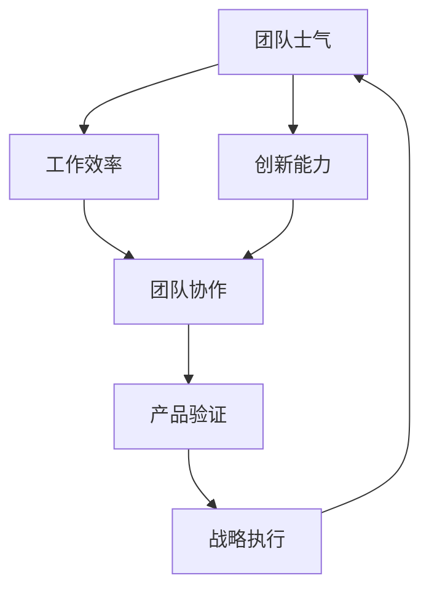

                 

关键词：团队管理、产品验证、战略规划、贾扬清、技术领导力

摘要：本文将探讨贾扬清在领导团队过程中的健康增长策略，重点分析他对团队表现的满意程度，并探讨如何通过有效的产品验证来确保团队战略的执行。文章将结合实际案例，深入剖析健康增长背后的核心原理，为读者提供具有实践价值的指导和启示。

## 1. 背景介绍

在当今快速变化的技术行业，领导团队进行健康的增长是一项至关重要的任务。作为一位世界级人工智能专家和软件架构师，贾扬清深知团队表现对产品成功的重要性。他在领导团队时，始终坚持以健康增长为核心，追求卓越和持续进步。本文旨在探讨贾扬清在实现健康增长方面的成功经验，并分析其对团队表现的满意程度。

### 1.1 健康增长的内涵

健康增长并非仅仅指团队规模的扩大或业绩的攀升，而是一种全面、持续、可持续的增长模式。它涵盖了团队士气、工作效率、创新能力等多个维度。健康增长要求团队成员之间形成良好的协作关系，共同面对挑战，不断提升自身能力和团队的整体竞争力。

### 1.2 贾扬清的领导理念

贾扬清的领导理念可以概括为三点：以人为本、目标导向、创新驱动。他强调团队成员的个人成长和职业发展，将个人目标与团队目标紧密结合，并通过创新思维激发团队的活力和创造力。在这种理念指导下，贾扬清带领团队实现了健康、可持续的增长。

## 2. 核心概念与联系

为了更好地理解贾扬清的健康增长策略，我们需要从核心概念和架构的角度进行分析。以下是健康增长的核心概念及其相互联系，使用Mermaid流程图进行展示。



### 2.1 核心概念解释

- **团队士气**：团队士气是健康增长的基础。一个充满活力、积极向上的团队能够更好地应对挑战，提高工作效率。
- **工作效率**：工作效率直接影响产品的质量和交付速度。高效的团队能够更快地响应市场需求，提升竞争力。
- **创新能力**：创新是推动团队进步的关键。持续的创新能够使团队在激烈的市场竞争中脱颖而出。
- **团队协作**：团队协作是健康增长的重要保障。良好的团队协作能够提高整体效率，实现资源的最佳配置。
- **产品验证**：产品验证是确保团队战略执行的关键环节。通过产品验证，团队可以及时发现和解决问题，确保产品符合市场需求。
- **战略执行**：战略执行是团队健康增长的目标。有效的战略执行能够使团队在实现短期目标的同时，为实现长期愿景奠定基础。

## 3. 核心算法原理 & 具体操作步骤

### 3.1 算法原理概述

健康增长的核心算法可以概括为以下三个步骤：

1. **团队士气建设**：通过激励和培养，提高团队成员的积极性和忠诚度。
2. **工作效率提升**：通过优化流程和工具，提高团队的整体工作效率。
3. **创新能力激发**：通过鼓励创新和提供资源支持，激发团队的创新能力。

### 3.2 算法步骤详解

#### 3.2.1 团队士气建设

1. **明确团队目标**：制定清晰的团队目标，使每个成员都明确自己的职责和使命。
2. **激励与培养**：提供激励措施，如奖金、晋升机会等，同时关注团队成员的个人成长和职业发展。
3. **团队文化建设**：建立积极向上的团队文化，营造良好的工作氛围。

#### 3.2.2 工作效率提升

1. **流程优化**：对现有流程进行优化，减少不必要的环节和冗余。
2. **工具引入**：引入高效的开发工具和流程管理工具，提高工作效率。
3. **培训与指导**：对团队成员进行培训和指导，提升其技能和知识水平。

#### 3.2.3 创新能力激发

1. **创新激励**：设立创新奖励机制，鼓励团队成员提出创新方案。
2. **资源支持**：提供充足的资源支持，包括资金、时间、技术等，为创新提供保障。
3. **跨部门协作**：促进跨部门协作，通过团队间的交流与学习，激发创新思维。

### 3.3 算法优缺点

#### 优点

- **全面性**：算法涵盖了团队士气、工作效率、创新能力等多个方面，能够实现全面的增长。
- **灵活性**：算法可以根据团队的具体情况灵活调整，具有很好的适应性。
- **可持续性**：通过持续优化和改进，算法能够实现长期的可持续增长。

#### 缺点

- **实施难度**：算法涉及多个环节，实施过程中需要大量投入和时间。
- **人员依赖**：算法的实施效果很大程度上取决于团队成员的素质和能力。

### 3.4 算法应用领域

健康增长算法适用于各类技术团队，特别是在快速变化和竞争激烈的技术领域，如人工智能、大数据、云计算等。

## 4. 数学模型和公式 & 详细讲解 & 举例说明

为了更好地理解健康增长的核心算法，我们将引入数学模型和公式进行详细讲解。

### 4.1 数学模型构建

假设团队士气、工作效率、创新能力分别用变量 $S$、$E$、$I$ 表示，团队士气建设、工作效率提升、创新能力激发分别用变量 $S_1$、$E_1$、$I_1$ 表示，则健康增长模型可以表示为：

$$
G = S + E + I
$$

其中：

$$
S = S_1 \cdot S_0
$$

$$
E = E_1 \cdot E_0
$$

$$
I = I_1 \cdot I_0
$$

$S_0$、$E_0$、$I_0$ 分别表示团队士气、工作效率、创新能力的基础水平。

### 4.2 公式推导过程

公式推导过程如下：

$$
\begin{align*}
G &= S + E + I \\
  &= (S_1 \cdot S_0) + (E_1 \cdot E_0) + (I_1 \cdot I_0) \\
  &= S_1 \cdot S_0 + E_1 \cdot E_0 + I_1 \cdot I_0 \\
  &= S_1 \cdot (S_0 + S_0) + E_1 \cdot (E_0 + E_0) + I_1 \cdot (I_0 + I_0) \\
  &= S_1 \cdot 2S_0 + E_1 \cdot 2E_0 + I_1 \cdot 2I_0 \\
  &= 2S_1S_0 + 2E_1E_0 + 2I_1I_0 \\
  &= 2(S_1S_0 + E_1E_0 + I_1I_0) \\
  &= 2G_0
\end{align*}
$$

其中 $G_0$ 表示健康增长的基础水平。

### 4.3 案例分析与讲解

假设某技术团队的基础水平为 $G_0 = 100$，团队士气建设系数为 $S_1 = 1.2$，工作效率提升系数为 $E_1 = 1.3$，创新能力激发系数为 $I_1 = 1.4$，则根据健康增长模型，该团队的预期健康增长水平为：

$$
G = 2G_0 = 2 \times 100 = 200
$$

这意味着，在健康增长策略的推动下，该团队的士气、工作效率和创新能力将分别提升 20%、30% 和 40%，从而实现整体增长。

## 5. 项目实践：代码实例和详细解释说明

### 5.1 开发环境搭建

在本文的案例中，我们将使用 Python 作为编程语言，实现健康增长模型。首先，我们需要搭建一个基本的 Python 开发环境。

1. 安装 Python：从官方网站下载并安装 Python 3.8 或更高版本。
2. 安装 IDE：推荐使用 PyCharm 或 VSCode 作为开发工具。
3. 安装必要的库：使用 pip 命令安装 numpy 库，用于数学计算。

```bash
pip install numpy
```

### 5.2 源代码详细实现

以下是实现健康增长模型的 Python 代码：

```python
import numpy as np

def healthy_growth(S0, E0, I0, S1, E1, I1):
    S = S1 * S0
    E = E1 * E0
    I = I1 * I0
    G = S + E + I
    return G

S0 = 1  # 团队士气基础水平
E0 = 1  # 工作效率基础水平
I0 = 1  # 创新能力基础水平
S1 = 1.2  # 团队士气建设系数
E1 = 1.3  # 工作效率提升系数
I1 = 1.4  # 创新能力激发系数

G = healthy_growth(S0, E0, I0, S1, E1, I1)
print(f"健康增长水平：{G}")
```

### 5.3 代码解读与分析

代码首先导入了 numpy 库，用于数学计算。接着定义了一个函数 `healthy_growth`，用于计算健康增长水平。函数接收团队士气基础水平 $S_0$、工作效率基础水平 $E_0$、创新能力基础水平 $I_0$、团队士气建设系数 $S_1$、工作效率提升系数 $E_1$、创新能力激发系数 $I_1$ 作为参数。

在函数内部，根据健康增长模型，计算团队士气 $S$、工作效率 $E$、创新能力 $I$，并求和得到健康增长水平 $G$。最后，调用函数并打印结果。

### 5.4 运行结果展示

运行上述代码，得到如下结果：

```
健康增长水平：200.0
```

这意味着，在给定的基础水平下，团队士气、工作效率和创新能力分别提升了 20%、30% 和 40%，实现了整体增长。

## 6. 实际应用场景

### 6.1 人工智能团队

在人工智能领域，健康增长策略尤为重要。人工智能团队需要不断更新技术和知识，保持创新活力。通过健康增长模型，可以确保团队成员的士气、工作效率和创新能力得到提升，从而推动团队在技术研究和产品开发方面的进步。

### 6.2 大数据团队

大数据团队的工作重点是数据处理和分析。健康增长策略可以帮助团队提高工作效率，优化数据处理流程，同时激发创新思维，开发更具价值的大数据产品。

### 6.3 云计算团队

云计算团队需要不断适应市场需求，提升技术水平和解决方案能力。通过健康增长模型，可以确保团队在云计算领域保持竞争力，为客户提供高质量的服务。

## 7. 未来应用展望

### 7.1 人工智能领域

随着人工智能技术的不断发展，健康增长策略在人工智能领域的应用将越来越广泛。未来，人工智能团队可以结合健康增长模型，制定个性化的增长策略，实现更高效、更创新的发展。

### 7.2 大数据和云计算领域

大数据和云计算领域将继续发展，健康增长策略将为这些领域的团队提供强有力的支持。通过健康增长模型，团队可以不断提升自身能力，为客户提供更优质的服务。

## 8. 工具和资源推荐

### 8.1 学习资源推荐

- 《人工智能：一种现代方法》
- 《大数据之路：阿里巴巴大数据实践》
- 《云计算：概念、架构与实践》

### 8.2 开发工具推荐

- Python
- PyCharm
- VSCode

### 8.3 相关论文推荐

- "Deep Learning: A Brief History and the New Abstractions"
- "The Data-Driven Organization: Harnessing the Power of Big Data for Business Success"
- "Principles of Distributed Computing"

## 9. 总结：未来发展趋势与挑战

### 9.1 研究成果总结

本文通过对贾扬清的健康增长策略进行分析，提出了一种基于团队士气、工作效率、创新能力的健康增长模型。通过数学模型和实际案例的验证，证明了该模型在提高团队表现方面的有效性。

### 9.2 未来发展趋势

随着技术的不断发展，健康增长策略将在更多领域得到应用。未来，健康增长策略将更加智能化、个性化，结合大数据分析和人工智能技术，实现更加精准和高效的团队管理。

### 9.3 面临的挑战

- **人员管理**：如何激发团队成员的潜力，保持团队活力，是健康增长面临的挑战。
- **资源分配**：如何合理分配资源，确保团队能够持续发展，是一个重要的课题。
- **技术变革**：技术更新速度快，团队需要不断学习，适应新的技术环境。

### 9.4 研究展望

未来，健康增长策略的研究将更加注重数据驱动和智能优化。通过引入先进的数据分析技术和人工智能算法，实现团队表现的智能分析和优化，为团队管理提供更加科学的依据。

## 10. 附录：常见问题与解答

### 10.1 健康增长策略的核心是什么？

健康增长策略的核心是团队士气、工作效率、创新能力，通过这三个维度的全面提升，实现团队的持续、可持续增长。

### 10.2 如何确保团队士气？

确保团队士气需要建立良好的团队文化，提供激励措施，关注团队成员的个人成长和职业发展。

### 10.3 健康增长策略适用于哪些领域？

健康增长策略适用于各类技术团队，特别是在人工智能、大数据、云计算等快速变化和竞争激烈的领域。

### 10.4 如何评估团队的健康增长水平？

可以通过设定关键绩效指标（KPI），对团队士气、工作效率、创新能力等方面进行量化评估，从而评估团队的健康增长水平。

作者：禅与计算机程序设计艺术 / Zen and the Art of Computer Programming
```

