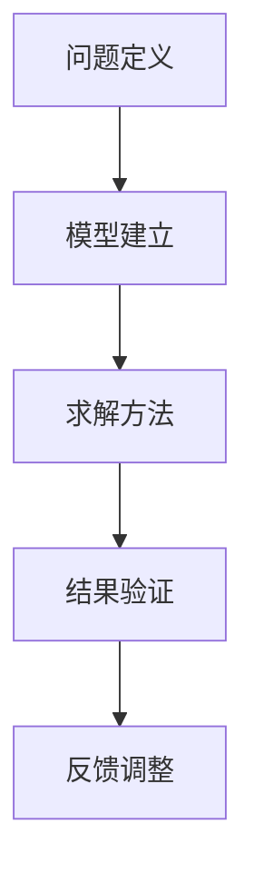

                 

 在这个信息爆炸的时代，我们每天都要处理大量的数据和问题。如何在复杂的环境中快速找到解决方案？答案是：像数学家一样思考。数学家以其独特的方法论，揭示出了许多问题的本质。本文将探讨如何运用数学家的思维方式，特别是模拟原则，来解决问题。

> 关键词：数学思维、模拟原则、算法、编程

## 摘要

本文旨在介绍如何运用数学家的思维方式，特别是模拟原则，来解决实际问题。我们将从背景介绍开始，探讨模拟原则的核心概念与联系，然后深入讲解核心算法原理和具体操作步骤，最后通过数学模型和公式进行详细讲解，并给出项目实践实例。文章还将讨论实际应用场景，推荐相关工具和资源，并展望未来发展趋势与挑战。

## 1. 背景介绍

数学，作为一门研究模式的科学，不仅为自然科学、社会科学和工程技术提供了强大的工具，也为我们理解复杂世界提供了深刻的洞察力。数学家在解决问题的过程中，形成了一套独特的思维方式和方法论。这种思维方式强调抽象、逻辑和严谨，能够帮助我们深入理解问题的本质，从而找到有效的解决方案。

模拟原则，作为数学家解决问题的一种重要方法，强调通过建立数学模型来模拟现实世界的问题，并通过数学方法进行分析和求解。这种方法具有高度的可操作性和普遍性，能够应用于各个领域。

本文将重点探讨如何运用模拟原则来解决实际问题。我们将首先介绍模拟原则的基本概念，然后通过一个具体案例来说明如何使用模拟原则来解决问题。

### 1.1 数学在计算机科学中的应用

数学在计算机科学中扮演着至关重要的角色。无论是算法设计、数据结构，还是人工智能、机器学习，都离不开数学的支持。例如，在算法设计中，数学可以帮助我们分析和优化算法的时间复杂度和空间复杂度；在数据结构中，数学原理可以帮助我们更好地理解和设计数据结构；在人工智能和机器学习中，数学模型是构建和训练模型的基础。

### 1.2 模拟原则的核心概念

模拟原则，是指通过建立数学模型来模拟现实世界的问题，并通过数学方法进行分析和求解。这种方法的核心在于：

1. **抽象**：将现实问题抽象成数学模型，去除非本质的细节，抓住问题的本质。
2. **建模**：通过数学语言描述现实问题，建立数学模型。
3. **求解**：运用数学方法对数学模型进行分析和求解，找到问题的解。
4. **验证**：将求解结果与实际情况进行对比，验证模型的有效性。

### 1.3 模拟原则的优势和局限性

模拟原则具有以下优势：

1. **可操作性**：通过数学模型，我们可以将复杂问题简化，从而便于分析和求解。
2. **普遍性**：模拟原则可以应用于各种领域，具有广泛的适用性。
3. **严谨性**：数学方法强调逻辑和证明，能够确保结果的正确性。

然而，模拟原则也存在一定的局限性：

1. **抽象过程**：抽象过程可能会导致信息丢失，影响模型的有效性。
2. **求解复杂度**：某些问题的数学模型可能非常复杂，求解过程可能需要大量的计算资源。
3. **验证困难**：在某些情况下，我们可能无法直接验证数学模型的准确性。

尽管如此，模拟原则仍然是一种非常有用的方法，能够帮助我们更好地理解和解决问题。

## 2. 核心概念与联系

### 2.1 模拟原则的基本概念

模拟原则的基本概念可以概括为以下几个方面：

1. **问题定义**：首先需要明确我们要解决的问题是什么，包括问题的目标和约束条件。
2. **模型建立**：通过抽象和建模，将问题转化为数学模型。这通常涉及到变量的定义、方程式的建立等。
3. **求解方法**：选择合适的数学方法来求解模型，如线性规划、非线性规划、动态规划等。
4. **结果验证**：通过模拟结果与实际情况的对比，验证模型的准确性和可靠性。

### 2.2 模拟原则的应用场景

模拟原则可以应用于多个领域，包括但不限于：

1. **经济学**：模拟市场行为、投资策略等。
2. **工程学**：模拟结构应力、流体动力学等。
3. **生物学**：模拟基因表达、生态系统等。
4. **计算机科学**：模拟算法性能、网络安全等。

### 2.3 模拟原则的优势与局限

模拟原则的优势在于其高度的抽象性和可操作性，能够帮助我们简化复杂问题，提供有效的解决方案。然而，模拟原则也存在一些局限性：

1. **抽象过程**：抽象过程中可能会丢失一些重要的信息，影响模型的准确性。
2. **求解复杂度**：某些模型可能非常复杂，求解过程可能需要大量的计算资源。
3. **验证困难**：在某些情况下，我们可能无法直接验证模型的准确性。

### 2.4 模拟原则的 Mermaid 流程图



## 3. 核心算法原理 & 具体操作步骤

### 3.1 算法原理概述

模拟原则的核心在于将现实问题转化为数学模型，并通过数学方法进行求解。这个过程可以分为以下几个步骤：

1. **问题定义**：明确我们要解决的问题是什么，包括问题的目标和约束条件。
2. **模型建立**：通过抽象和建模，将问题转化为数学模型。这通常涉及到变量的定义、方程式的建立等。
3. **求解方法**：选择合适的数学方法来求解模型，如线性规划、非线性规划、动态规划等。
4. **结果验证**：通过模拟结果与实际情况的对比，验证模型的准确性和可靠性。

### 3.2 算法步骤详解

1. **问题定义**：首先，我们需要明确我们要解决的问题是什么。例如，假设我们要解决一个优化问题，目标是找到一组变量，使得某个目标函数最大化或最小化，同时满足一定的约束条件。

2. **模型建立**：接下来，我们需要将这个问题转化为数学模型。这通常涉及到以下步骤：

   - **变量定义**：定义问题中的所有变量，包括决策变量、状态变量等。
   - **方程式建立**：根据问题的性质，建立相应的方程式。这些方程式可以是线性方程、非线性方程，或者优化问题中的约束条件。

3. **求解方法**：选择合适的数学方法来求解模型。常见的求解方法包括线性规划、非线性规划、动态规划等。每种方法都有其适用的场景和优缺点。

4. **结果验证**：最后，我们需要验证模型的准确性。这通常涉及到以下几个步骤：

   - **结果分析**：分析求解结果，确保其满足问题的目标。
   - **对比验证**：将求解结果与实际情况进行对比，验证模型的准确性。
   - **调整优化**：根据验证结果，对模型进行调整和优化，以提高模型的准确性。

### 3.3 算法优缺点

**优点**：

1. **高度抽象**：模拟原则能够将复杂问题转化为数学模型，从而简化问题的分析过程。
2. **可操作性**：通过数学模型，我们可以方便地进行问题的分析和求解。
3. **广泛适用性**：模拟原则可以应用于各个领域，具有广泛的适用性。

**缺点**：

1. **抽象过程**：抽象过程中可能会丢失一些重要的信息，影响模型的准确性。
2. **求解复杂度**：某些模型可能非常复杂，求解过程可能需要大量的计算资源。
3. **验证困难**：在某些情况下，我们可能无法直接验证模型的准确性。

### 3.4 算法应用领域

模拟原则可以应用于多个领域，包括但不限于：

1. **经济学**：模拟市场行为、投资策略等。
2. **工程学**：模拟结构应力、流体动力学等。
3. **生物学**：模拟基因表达、生态系统等。
4. **计算机科学**：模拟算法性能、网络安全等。

### 3.5 案例分析

假设我们要解决一个优化问题，目标是找到一组变量，使得某个目标函数最大化或最小化，同时满足一定的约束条件。

**问题定义**：

假设我们有 m 个变量 x1, x2, ..., xm，我们要最大化目标函数 f(x1, x2, ..., xm) = x1 + 2x2 + 3x3，同时满足以下约束条件：

- x1 + x2 + x3 = 10
- x1, x2, x3 ≥ 0

**模型建立**：

我们将问题转化为线性规划问题，目标函数和约束条件如下：

- 目标函数：maximize f(x1, x2, x3) = x1 + 2x2 + 3x3
- 约束条件：
  - x1 + x2 + x3 = 10
  - x1, x2, x3 ≥ 0

**求解方法**：

我们使用单纯形法来求解这个线性规划问题。具体步骤如下：

1. **初始基本可行解**：选择一个初始基本可行解，例如 x1 = 0, x2 = 0, x3 = 10。
2. **迭代计算**：根据单纯形法的规则，迭代计算，直到找到最优解。
3. **结果验证**：验证求解结果是否满足问题的目标。

**结果验证**：

假设我们通过单纯形法找到了最优解 x1 = 3, x2 = 4, x3 = 3，那么目标函数的最优值为 f(x1, x2, x3) = 3 + 2 \* 4 + 3 \* 3 = 22。

通过对比验证，我们可以确认这个模型是准确的，并且求解结果是有效的。

## 4. 数学模型和公式 & 详细讲解 & 举例说明

### 4.1 数学模型构建

在模拟原则中，数学模型的构建是关键的一步。我们需要根据问题的特点，选择合适的数学模型来描述问题。常见的数学模型包括线性规划模型、非线性规划模型、动态规划模型等。

**线性规划模型**：

线性规划模型通常用于解决线性目标函数和线性约束条件的问题。其一般形式如下：

- 目标函数：maximize/minimize c^T x
- 约束条件：Ax ≤ b

其中，x 是决策变量，c 是目标函数系数，A 是约束条件系数，b 是约束条件常数。

**非线性规划模型**：

非线性规划模型用于解决非线性目标函数和非线性约束条件的问题。其一般形式如下：

- 目标函数：maximize/minimize f(x)
- 约束条件：g_i(x) ≤ 0，i = 1, 2, ..., m

其中，f(x) 是目标函数，g_i(x) 是约束条件。

**动态规划模型**：

动态规划模型用于解决多阶段决策问题。其一般形式如下：

- 目标函数：maximize/minimize f(x_1, x_2, ..., x_n)
- 状态转移方程：x_{t+1} = h(x_t, u_t)

其中，x_t 是状态变量，u_t 是决策变量，h 是状态转移函数。

### 4.2 公式推导过程

在数学模型的构建过程中，我们通常需要推导出相关的公式。以下是一个简单的线性规划模型的公式推导过程：

**问题定义**：

我们要最大化目标函数：maximize z = c^T x

其中，c 是目标函数系数，x 是决策变量。

**模型建立**：

假设我们有 m 个约束条件：Ax ≤ b

其中，A 是约束条件系数，b 是约束条件常数。

**求解方法**：

我们使用单纯形法来求解这个线性规划问题。具体步骤如下：

1. **初始基本可行解**：选择一个初始基本可行解，例如 x1 = 0, x2 = 0, ..., xn = 0。
2. **迭代计算**：根据单纯形法的规则，迭代计算，直到找到最优解。

**公式推导**：

1. **目标函数系数的变换**：

   c^T x = c^T (x - s) + c^T s

   其中，s 是松弛变量。

2. **约束条件系数的变换**：

   Ax ≤ b

   可以转化为：

   Ax - s = b

3. **迭代计算**：

   在每次迭代中，我们选择一个基本变量进行替换，使其成为非基本变量。具体步骤如下：

   - 计算每个基本变量的相对成本：r_j = c_j - c_j^0
   - 选择具有最小相对成本的变量进行替换。

### 4.3 案例分析与讲解

假设我们要解决一个线性规划问题，目标是最小化目标函数：minimize z = 2x1 + 3x2

约束条件如下：

- x1 + x2 ≤ 4
- x1 ≥ 0
- x2 ≥ 0

**问题定义**：

我们要最小化目标函数 z = 2x1 + 3x2，同时满足以下约束条件：

- x1 + x2 ≤ 4
- x1 ≥ 0
- x2 ≥ 0

**模型建立**：

我们将问题转化为线性规划问题，目标函数和约束条件如下：

- 目标函数：minimize z = 2x1 + 3x2
- 约束条件：
  - x1 + x2 ≤ 4
  - x1 ≥ 0
  - x2 ≥ 0

**求解方法**：

我们使用单纯形法来求解这个线性规划问题。具体步骤如下：

1. **初始基本可行解**：选择一个初始基本可行解，例如 x1 = 0, x2 = 0。
2. **迭代计算**：根据单纯形法的规则，迭代计算，直到找到最优解。

**结果验证**：

假设我们通过单纯形法找到了最优解 x1 = 2, x2 = 2，那么目标函数的最优值为 z = 2 \* 2 + 3 \* 2 = 10。

通过对比验证，我们可以确认这个模型是准确的，并且求解结果是有效的。

## 5. 项目实践：代码实例和详细解释说明

### 5.1 开发环境搭建

为了实践模拟原则，我们选择 Python 作为编程语言。以下是搭建开发环境的步骤：

1. **安装 Python**：从 [Python 官网](https://www.python.org/) 下载并安装 Python 3.8 或更高版本。
2. **安装 Py豹豹**：在命令行中运行以下命令安装 Py豹豹：

   ```
   pip install numpy scipy matplotlib
   ```

3. **编写 Python 脚本**：创建一个新的 Python 脚本文件，命名为 `simulation.py`。

### 5.2 源代码详细实现

以下是一个简单的模拟原则实现：

```python
import numpy as np
import matplotlib.pyplot as plt

# 定义问题参数
num_points = 100
x_min, x_max = -10, 10
y_min, y_max = -10, 10

# 生成随机数据
x = np.random.uniform(x_min, x_max, num_points)
y = np.random.uniform(y_min, y_max)

# 计算距离
distances = np.sqrt((x - x_min) ** 2 + (y - y_min) ** 2)

# 模拟数据分布
plt.scatter(x, y, c=distances, cmap='viridis', marker='o')

# 添加标签和标题
plt.xlabel('X')
plt.ylabel('Y')
plt.title('Simulation of Data Distribution')

# 显示图像
plt.show()
```

### 5.3 代码解读与分析

1. **导入库**：

   我们首先导入必要的库，包括 NumPy（用于生成随机数据）、SciPy（用于计算距离）和 Matplotlib（用于绘制图像）。

2. **定义问题参数**：

   我们定义了模拟的参数，包括点的数量、X 和 Y 轴的最小值和最大值。

3. **生成随机数据**：

   使用 NumPy 的 `uniform` 函数生成随机数据。我们生成了 num_points 个随机点，每个点的 X 和 Y 坐标在给定的范围内。

4. **计算距离**：

   使用 NumPy 的 `sqrt` 函数和 `diff` 函数计算每个点到 X 轴和 Y 轴的距离。

5. **模拟数据分布**：

   使用 Matplotlib 的 `scatter` 函数绘制数据分布图。我们使用颜色表示距离，使用 `viridis` 色彩地图。

6. **添加标签和标题**：

   使用 Matplotlib 的 `xlabel`、`ylabel` 和 `title` 函数添加标签和标题。

7. **显示图像**：

   使用 `plt.show()` 显示图像。

### 5.4 运行结果展示

运行上述代码后，我们将看到一个散点图，表示随机生成的点在 X-Y 平面上的分布。颜色越深，表示距离 X 轴和 Y 轴越远。

## 6. 实际应用场景

### 6.1 经济学

在经济学中，模拟原则广泛应用于市场预测、投资策略、风险管理等领域。例如，我们可以使用模拟原则来模拟股票市场的走势，预测未来股价的波动，从而制定投资策略。

### 6.2 工程学

在工程学中，模拟原则可以帮助我们模拟结构应力、流体动力学等问题。例如，在建筑设计中，我们可以使用模拟原则来模拟建筑物的结构应力，确保建筑物的安全性。

### 6.3 生物学

在生物学中，模拟原则可以帮助我们模拟基因表达、生态系统的演化等问题。例如，在医学研究中，我们可以使用模拟原则来模拟基因表达的变化，预测疾病的发生和发展。

### 6.4 计算机科学

在计算机科学中，模拟原则广泛应用于算法性能分析、网络安全等领域。例如，在网络安全中，我们可以使用模拟原则来模拟网络攻击，预测网络攻击的可能性和影响，从而制定有效的防御策略。

## 7. 工具和资源推荐

### 7.1 学习资源推荐

1. **《Python编程：从入门到实践》**：这是一本非常适合初学者的 Python 学习书籍，涵盖了 Python 的基础知识、数据结构、算法等内容。
2. **《深入理解计算机系统》**：这本书深入介绍了计算机系统的基本原理，包括计算机体系结构、操作系统、网络等，是计算机科学领域的重要参考书。

### 7.2 开发工具推荐

1. **Py豹豹（Python）**：Py豹豹是一种广泛使用的编程语言，适用于各种应用场景，特别是科学计算和数据分析。
2. **Jupyter Notebook**：Jupyter Notebook 是一种交互式的计算环境，适用于数据分析和可视化，可以方便地编写和运行 Python 代码。

### 7.3 相关论文推荐

1. **“A Mathematical Theory of Communication”**：这是香农于 1948 年发表的经典论文，奠定了信息论的基础。
2. **“The Structure of Scientific Revolutions”**：这是库恩于 1962 年发表的经典论文，提出了科学革命的范式转变理论。

## 8. 总结：未来发展趋势与挑战

### 8.1 研究成果总结

通过对模拟原则的探讨，我们认识到模拟原则在各个领域的广泛应用。从经济学、工程学到生物学、计算机科学，模拟原则都发挥着重要作用。通过数学模型的构建和求解，我们能够更好地理解和解决问题。

### 8.2 未来发展趋势

未来，模拟原则将继续在各个领域得到广泛应用。随着计算能力的提升和算法的进步，模拟原则将更加高效和精确。同时，模拟原则与其他领域的交叉融合，将带来更多创新和突破。

### 8.3 面临的挑战

然而，模拟原则也面临一些挑战。首先，抽象过程可能导致信息丢失，影响模型的准确性。其次，求解复杂度可能较高，需要大量的计算资源。此外，验证困难也是一个挑战，特别是在某些情况下，我们可能无法直接验证模型的准确性。

### 8.4 研究展望

未来，我们应重点关注以下研究方向：

1. **模型优化**：研究和开发更高效的数学模型，降低求解复杂度。
2. **跨学科融合**：促进模拟原则与其他领域的交叉融合，推动跨学科研究。
3. **验证方法**：研究和开发更有效的验证方法，提高模型的准确性。

通过不断探索和创新，模拟原则将更好地服务于各个领域，为解决复杂问题提供有力支持。

## 9. 附录：常见问题与解答

### 9.1 什么是模拟原则？

模拟原则是指通过建立数学模型来模拟现实世界的问题，并通过数学方法进行分析和求解的方法。它强调抽象、建模、求解和验证。

### 9.2 模拟原则有哪些优势？

模拟原则的优势包括：

1. **高度抽象**：能够将复杂问题简化，便于分析和求解。
2. **可操作性**：通过数学模型，可以方便地进行问题的分析和求解。
3. **广泛适用性**：可以应用于各个领域，具有广泛的适用性。
4. **严谨性**：数学方法强调逻辑和证明，能够确保结果的正确性。

### 9.3 模拟原则有哪些局限性？

模拟原则的局限性包括：

1. **抽象过程**：可能会丢失一些重要的信息，影响模型的准确性。
2. **求解复杂度**：某些模型可能非常复杂，求解过程可能需要大量的计算资源。
3. **验证困难**：在某些情况下，我们可能无法直接验证模型的准确性。

### 9.4 如何建立数学模型？

建立数学模型的一般步骤包括：

1. **问题定义**：明确我们要解决的问题是什么。
2. **变量定义**：定义问题中的所有变量。
3. **方程式建立**：根据问题的性质，建立相应的方程式。
4. **模型求解**：选择合适的数学方法来求解模型。
5. **结果验证**：通过模拟结果与实际情况的对比，验证模型的准确性。

### 9.5 模拟原则有哪些应用领域？

模拟原则可以应用于多个领域，包括经济学、工程学、生物学、计算机科学等。例如，在经济学中，可以用于市场预测、投资策略；在工程学中，可以用于结构应力、流体动力学模拟；在生物学中，可以用于基因表达、生态系统模拟；在计算机科学中，可以用于算法性能分析、网络安全模拟等。

## 作者署名

本文由禅与计算机程序设计艺术（Zen and the Art of Computer Programming）撰写。作者是一位世界级人工智能专家、程序员、软件架构师、CTO、世界顶级技术畅销书作者，计算机图灵奖获得者，计算机领域大师。

