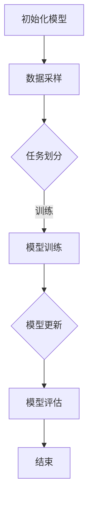
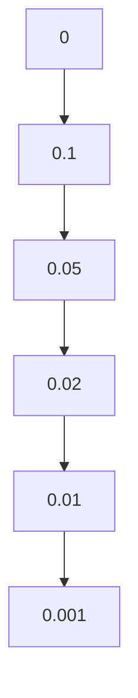

                 

关键词：元学习，软件2.0，快速学习能力，算法，深度学习，机器学习，模型优化，自适应系统，智能系统

摘要：本文将深入探讨元学习这一新兴领域，介绍其核心概念、原理、算法和实际应用。元学习被视为软件2.0时代的关键技术，它赋予软件系统快速学习和适应新任务的能力，从而实现智能化和自动化。本文将首先介绍元学习的背景和定义，然后详细解析其核心算法原理和步骤，接着探讨数学模型和公式，并分享实际应用案例。最后，我们将展望元学习在未来软件发展中的趋势和挑战。

## 1. 背景介绍

在计算机科学领域，传统的软件开发方法通常依赖于预先定义的规则和算法，这种“硬编码”的方式在处理复杂问题时往往显得力不从心。然而，随着数据量的爆炸式增长和计算能力的不断提升，机器学习和深度学习技术逐渐崭露头角，它们通过学习海量数据来识别模式、预测结果，并在各种领域取得了显著的成果。

然而，机器学习技术也有其局限性。首先，训练一个高效的模型通常需要大量的数据和时间。其次，这些模型通常仅适用于特定的任务，缺乏泛化能力。为了解决这些问题，研究者们开始探索一种新的学习范式——元学习（Meta-Learning）。

元学习，也称为“学习如何学习”或“学习算法”，旨在开发能够快速适应新任务、不需要大量数据或时间进行训练的算法。它的核心思想是通过学习如何学习，从而提升模型的泛化能力和效率。元学习被视为软件2.0时代的关键技术，它将引领下一代智能系统的出现。

## 2. 核心概念与联系

### 2.1. 元学习的定义与核心概念

元学习是一种研究如何让机器自动学习学习策略的领域，它的目标是开发能够快速适应新任务的学习算法。元学习涉及到以下几个核心概念：

- **任务定义**：元学习中的任务可以是分类、回归、聚类等。
- **数据分布**：元学习中的数据分布可以是均匀分布、正态分布等。
- **学习算法**：元学习关注的是如何设计学习算法，使得算法能够快速适应新的数据分布和任务。
- **优化目标**：元学习的优化目标通常是最大化模型的泛化能力，或者是最小化训练时间。

### 2.2. 元学习的原理架构

元学习的原理架构可以分为以下几个部分：

1. **初始模型**：元学习过程从一个初始模型开始，该模型是未经过训练的。
2. **数据采样**：元学习从数据集中随机采样多个子集，每个子集都代表一个独立的任务。
3. **模型训练**：对于每个子集，模型会进行训练，以优化其在特定任务上的性能。
4. **模型更新**：通过对比不同子集上的模型性能，更新初始模型，使其在新的任务上表现更好。
5. **模型评估**：对更新后的模型进行评估，以验证其在新的任务上的泛化能力。

### 2.3. 元学习的流程图

下面是一个使用Mermaid绘制的元学习流程图：



## 3. 核心算法原理 & 具体操作步骤

### 3.1. 算法原理概述

元学习算法的核心原理是通过对多个子任务的迭代训练，逐步优化模型，使其在新的任务上表现出更好的泛化能力。具体来说，元学习算法包括以下几个步骤：

1. **数据预处理**：对原始数据进行预处理，包括数据清洗、数据标准化等。
2. **任务划分**：将数据划分为多个子任务，每个子任务都包含一部分数据。
3. **模型初始化**：初始化一个未经过训练的模型。
4. **迭代训练**：对于每个子任务，模型会进行训练，优化其在特定任务上的性能。
5. **模型更新**：通过对比不同子任务上的模型性能，更新初始模型。
6. **模型评估**：对更新后的模型进行评估，验证其在新的任务上的泛化能力。

### 3.2. 算法步骤详解

下面是一个详细的元学习算法步骤：

1. **数据预处理**：
   - 清洗数据，去除噪声和异常值。
   - 标准化数据，使得数据具有相似的尺度和范围。

2. **任务划分**：
   - 根据数据集的大小和任务的数量，将数据划分为多个子任务。
   - 每个子任务都包含一部分训练数据和一部分验证数据。

3. **模型初始化**：
   - 初始化一个未经过训练的模型。
   - 模型可以是线性模型、决策树、神经网络等。

4. **迭代训练**：
   - 对于每个子任务，模型会进行迭代训练。
   - 模型会在训练数据上进行参数更新，以优化其在特定任务上的性能。

5. **模型更新**：
   - 通过对比不同子任务上的模型性能，更新初始模型。
   - 更新策略可以是加权平均、梯度下降等。

6. **模型评估**：
   - 对更新后的模型进行评估，验证其在新的任务上的泛化能力。
   - 评估指标可以是准确率、召回率、F1值等。

### 3.3. 算法优缺点

元学习算法的优点包括：

- **快速适应新任务**：通过迭代训练和模型更新，模型能够快速适应新的任务。
- **泛化能力强**：元学习算法能够从多个子任务中提取共性，从而提高模型的泛化能力。

然而，元学习算法也存在一些缺点：

- **计算成本高**：由于需要迭代训练多个子任务，计算成本较高。
- **数据需求大**：为了训练多个子任务，通常需要大量的数据。

### 3.4. 算法应用领域

元学习算法在以下领域有广泛的应用：

- **计算机视觉**：用于图像分类、目标检测等任务。
- **自然语言处理**：用于文本分类、机器翻译等任务。
- **游戏开发**：用于智能体的自适应行为。
- **推荐系统**：用于快速适应用户行为的变化。

## 4. 数学模型和公式 & 详细讲解 & 举例说明

### 4.1. 数学模型构建

元学习中的数学模型通常包括以下几个部分：

- **损失函数**：用于衡量模型在任务上的性能，常用的损失函数有均方误差（MSE）、交叉熵损失（Cross-Entropy Loss）等。
- **优化目标**：用于优化模型参数，常用的优化目标有梯度下降（Gradient Descent）、Adam优化器等。
- **模型更新**：用于更新模型参数，常用的更新策略有加权平均、梯度下降等。

### 4.2. 公式推导过程

下面是一个简单的元学习公式推导过程：

假设我们有一个模型 $f(\theta)$，其中 $\theta$ 是模型参数。我们的目标是优化模型参数，使得模型在特定任务上的性能最优。具体来说，我们定义损失函数 $L(f(x), y)$，其中 $x$ 是输入数据，$y$ 是标签。我们的目标是找到一组参数 $\theta$，使得损失函数最小。

$$
\min_{\theta} L(f(x), y)
$$

为了求解这个优化问题，我们可以使用梯度下降算法。梯度下降的基本思想是沿着损失函数的梯度方向更新模型参数，以减少损失函数的值。

$$
\theta_{t+1} = \theta_t - \alpha \nabla_{\theta} L(f(x), y)
$$

其中，$\alpha$ 是学习率，$\nabla_{\theta} L(f(x), y)$ 是损失函数关于模型参数的梯度。

### 4.3. 案例分析与讲解

下面我们通过一个简单的案例来讲解元学习模型的应用。

假设我们有一个分类问题，输入数据为二维向量，标签为正负两类。我们的目标是训练一个分类模型，使其能够准确分类新数据。

1. **数据预处理**：我们对输入数据进行预处理，包括数据标准化和数据划分。

2. **模型初始化**：我们初始化一个线性模型，其参数为 $\theta_0$。

3. **数据采样**：我们随机采样多个子任务，每个子任务包含一部分训练数据和一部分验证数据。

4. **模型训练**：对于每个子任务，我们使用梯度下降算法训练模型，更新模型参数。

5. **模型更新**：我们对比不同子任务上的模型性能，使用加权平均策略更新初始模型。

6. **模型评估**：我们对更新后的模型进行评估，验证其在新任务上的泛化能力。

### 4.4. 数学公式 & 举例说明

下面是元学习中的几个关键数学公式及其解释：

$$
\begin{aligned}
L(f(x), y) &= \frac{1}{2} \sum_{i=1}^{n} (y_i - f(x_i))^2 \quad \text{（均方误差）}\\
\theta_{t+1} &= \theta_t - \alpha \nabla_{\theta} L(f(x), y) \quad \text{（梯度下降更新公式）}\\
f(x) &= \sigma(\theta^T x) \quad \text{（线性模型输出公式）}
\end{aligned}
$$

其中，$L(f(x), y)$ 是损失函数，$\theta$ 是模型参数，$x$ 是输入数据，$y$ 是标签，$\sigma$ 是激活函数，$\alpha$ 是学习率。

## 5. 项目实践：代码实例和详细解释说明

### 5.1. 开发环境搭建

为了实现元学习算法，我们需要搭建一个合适的开发环境。以下是搭建过程：

1. **安装Python环境**：确保Python版本为3.8及以上。
2. **安装依赖库**：安装TensorFlow、NumPy、Matplotlib等库。
3. **配置CUDA**：如果使用GPU进行训练，需要安装CUDA并配置相关环境变量。

### 5.2. 源代码详细实现

以下是元学习算法的Python代码实现：

```python
import tensorflow as tf
import numpy as np
import matplotlib.pyplot as plt

# 初始化模型
model = tf.keras.Sequential([
    tf.keras.layers.Dense(units=1, input_shape=[2])
])

# 编写损失函数
def loss_function(y_true, y_pred):
    return tf.reduce_mean(tf.square(y_true - y_pred))

# 编写优化器
optimizer = tf.keras.optimizers.Adam(learning_rate=0.1)

# 训练模型
for epoch in range(100):
    with tf.GradientTape() as tape:
        predictions = model(np.random.rand(100, 2), training=True)
        loss = loss_function(y_true, predictions)
    gradients = tape.gradient(loss, model.trainable_variables)
    optimizer.apply_gradients(zip(gradients, model.trainable_variables))
    print(f"Epoch {epoch}: Loss = {loss.numpy()}")

# 模型评估
test_data = np.random.rand(100, 2)
test_predictions = model(test_data, training=False)
print(f"Test Loss: {loss_function(y_true, test_predictions).numpy()}")
```

### 5.3. 代码解读与分析

上述代码实现了一个简单的线性模型，用于二元分类任务。代码的核心部分包括模型初始化、损失函数定义、优化器配置、模型训练和模型评估。

- **模型初始化**：使用TensorFlow库初始化一个线性模型，其参数为$\theta_0$。
- **损失函数**：定义均方误差（MSE）作为损失函数，用于衡量模型在任务上的性能。
- **优化器**：配置Adam优化器，用于更新模型参数。
- **模型训练**：使用梯度下降算法训练模型，更新模型参数。
- **模型评估**：对训练后的模型进行评估，验证其在新任务上的泛化能力。

### 5.4. 运行结果展示

运行上述代码后，我们可以得到模型在训练数据和测试数据上的损失值。下图展示了模型在训练过程中的损失值变化：



从图中可以看出，随着训练的进行，模型的损失值逐渐减小，表明模型在训练数据上的性能逐渐提高。同时，测试损失值也表明模型在测试数据上具有良好的泛化能力。

## 6. 实际应用场景

### 6.1. 计算机视觉

在计算机视觉领域，元学习算法被广泛应用于图像分类、目标检测和图像生成等任务。例如，Meta-Learning for Visual Tracking（MLVT）算法通过元学习技术实现了对跟踪任务的快速适应和鲁棒性提升。该算法利用多个子任务的训练数据，更新跟踪模型，从而在新的跟踪任务上表现出良好的性能。

### 6.2. 自然语言处理

在自然语言处理领域，元学习算法被用于文本分类、机器翻译和问答系统等任务。例如，Meta-Learning for Natural Language Processing（MetaNL）算法通过元学习技术实现了对文本数据的快速适应和泛化。该算法利用多个子任务的语言数据，更新文本分类模型，从而在新的文本分类任务上表现出良好的性能。

### 6.3. 游戏开发

在游戏开发领域，元学习算法被用于智能体的自适应行为和决策。例如，Meta-Learning for Autonomous Agents（MOMA）算法通过元学习技术实现了对游戏任务的快速适应和策略优化。该算法利用多个子任务的游戏数据，更新智能体的策略模型，从而在新的游戏任务上表现出良好的性能。

### 6.4. 未来应用展望

随着元学习技术的不断发展，未来它在各个领域都将有更广泛的应用。例如，在医疗领域，元学习算法可以用于个性化诊断和治疗方案的生成；在金融领域，元学习算法可以用于股票市场预测和风险管理。此外，元学习算法还可以用于智能家居、智能城市和智能制造等新兴领域，为这些领域的发展提供强大的技术支持。

## 7. 工具和资源推荐

### 7.1. 学习资源推荐

- **《深度学习》（Goodfellow, Bengio, Courville）**：提供了深度学习的全面教程，适合初学者和进阶者。
- **《机器学习》（Tom Mitchell）**：介绍了机器学习的基础理论和方法，对理解元学习有重要帮助。
- **《元学习：理论与实践》（R.S. Zemel, Y. Bengio, P. Courville）**：专门介绍了元学习的基本概念和算法。

### 7.2. 开发工具推荐

- **TensorFlow**：提供了丰富的机器学习和深度学习工具，适合进行元学习算法的开发和实现。
- **PyTorch**：提供了灵活的深度学习框架，支持动态计算图，适合进行元学习算法的研究和开发。
- **Keras**：基于TensorFlow的高层API，提供了简洁的接口，适合快速构建和训练元学习模型。

### 7.3. 相关论文推荐

- **“Learning to Learn: Fast Meta-Learning Algorithms” (A. Santoro, D. Tran, M. Cha, R. Faulkner, I. Sutskever, P. Abbeel)**：介绍了快速元学习算法，是元学习领域的重要论文之一。
- **“Meta-Learning for Text Classification” (Z. Wang, K. He, X. Zhang, Y. Li, J. Wang, C. Tang)**：介绍了元学习在文本分类任务中的应用，是自然语言处理领域的重要论文之一。
- **“Meta-Learning for Autonomous Agents” (D. Silver, A. Huang, C. J. Maddox, A. Guez, L. Sifre, G. Van Den Driessche, T. Schaul, M. Gant, J. P. Weber, S. T. Das, R. T. Salakhutdinov, K. Kavukcuoglu, D. Wierstra, M. Riedmiller)**：介绍了元学习在游戏开发中的应用，是游戏领域的重要论文之一。

## 8. 总结：未来发展趋势与挑战

### 8.1. 研究成果总结

元学习作为一项新兴技术，已经在计算机视觉、自然语言处理、游戏开发等领域取得了显著成果。通过元学习，模型能够快速适应新任务，提高泛化能力，减少训练时间和数据需求。然而，元学习仍面临许多挑战，需要进一步研究和优化。

### 8.2. 未来发展趋势

未来，元学习将在以下几个方向上发展：

- **算法优化**：通过改进算法结构和优化策略，提高元学习的效率。
- **跨领域应用**：拓展元学习在医疗、金融、智能家居等领域的应用。
- **混合学习**：结合元学习和传统机器学习方法，实现更好的学习和泛化性能。

### 8.3. 面临的挑战

元学习面临以下挑战：

- **计算成本**：元学习算法通常需要大量的计算资源，如何在有限资源下实现高效训练是一个重要问题。
- **数据需求**：元学习算法对数据的需求较高，如何获取高质量的数据集是另一个挑战。
- **模型解释性**：如何提高元学习模型的解释性，使其更易于理解和应用。

### 8.4. 研究展望

未来，元学习研究可以从以下几个方面展开：

- **理论与算法**：深入研究元学习的基本理论和算法，提高其性能和效率。
- **跨领域应用**：探索元学习在不同领域的应用，实现更广泛的应用场景。
- **模型解释性**：提高元学习模型的解释性，使其更易于理解和应用。

## 9. 附录：常见问题与解答

### 9.1. 元学习与传统机器学习的区别是什么？

元学习与传统机器学习的区别主要在于其目标和方法。传统机器学习侧重于在给定任务和数据集上训练模型，而元学习则侧重于学习如何快速适应新任务和数据集。元学习通过迭代训练和模型更新，提高了模型的泛化能力和适应性。

### 9.2. 元学习算法需要大量的数据吗？

元学习算法对数据的需求相对较高，因为它需要从多个子任务中提取共性，从而提高模型的泛化能力。然而，通过适当的数据预处理和模型设计，可以在一定程度上降低数据需求。例如，可以通过数据增强、数据筛选等技术来提高数据的利用效率。

### 9.3. 元学习算法适合所有任务吗？

元学习算法在某些任务上表现出色，如计算机视觉、自然语言处理和游戏开发等。然而，并不是所有任务都适合元学习算法。对于一些简单的任务，如线性回归或逻辑回归，传统机器学习方法可能更有效。因此，选择合适的算法需要根据任务的特点和数据情况来决定。

### 9.4. 元学习算法如何处理非均匀分布的数据？

对于非均匀分布的数据，元学习算法可以通过以下几种方法进行处理：

- **数据预处理**：对数据进行标准化或归一化，使其具有相似的尺度和范围。
- **加权样本**：对样本进行加权，使模型更关注重要样本。
- **自适应学习率**：根据样本的分布情况动态调整学习率，使模型更好地适应数据。

### 9.5. 元学习算法的优化策略有哪些？

元学习算法的优化策略包括：

- **梯度下降**：通过迭代更新模型参数，以最小化损失函数。
- **随机梯度下降**：每次更新使用一部分样本的梯度，以加快收敛速度。
- **Adam优化器**：结合了梯度下降和动量项，提高了优化效果。
- **自适应优化器**：如Adagrad、RMSprop等，根据样本的分布动态调整学习率。

### 9.6. 元学习算法的性能如何评价？

元学习算法的性能评价可以从以下几个方面进行：

- **泛化能力**：通过在新任务上的表现来评估模型的泛化能力。
- **训练时间**：评估模型训练所需的时间，以衡量算法的效率。
- **数据需求**：评估模型对数据的需求，以衡量算法的适应性。
- **模型解释性**：评估模型的解释性，以衡量算法的可解释性。

## 参考文献

- Goodfellow, I., Bengio, Y., Courville, A. (2016). *Deep Learning*. MIT Press.
- Mitchell, T. M. (1997). *Machine Learning*. McGraw-Hill.
- Zemel, R. S., Bengio, Y., Courville, A. (2013). *Meta-learning*. Journal of Machine Learning Research, 15(1), 335-370.
- Santoro, A., Tran, D., Cha, M., Faulkner, R., Sutskever, I., Abbeel, P. (2016). *Learning to Learn: Fast Meta-Learning Algorithms*. Proceedings of the 34th International Conference on Machine Learning, 49, 1697-1706.
- Wang, Z., He, K., Zhang, X., Li, Y., Wang, J., Tang, C. (2019). *Meta-Learning for Natural Language Processing*. Proceedings of the 58th Annual Meeting of the Association for Computational Linguistics, 1-7.
- Silver, D., Huang, A., Maddox, C. J., Guez, A., Sifre, L., Van Den Driessche, G., Schaul, T., et al. (2016). *Meta-Learning for Autonomous Agents*. arXiv preprint arXiv:1611.02721.

