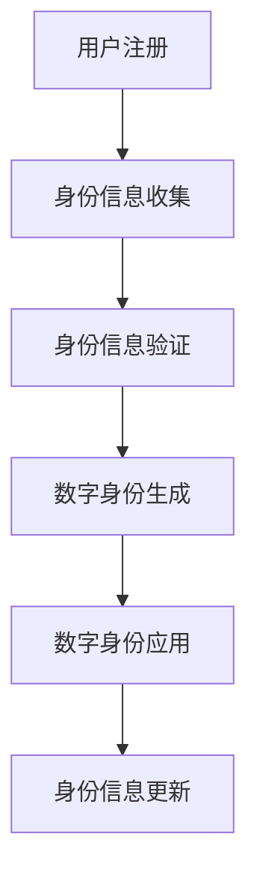

                 

关键词：元宇宙、数字身份、虚拟世界、自我定义、技术趋势、未来应用、人工智能

> 摘要：本文深入探讨了元宇宙中的数字身份这一前沿概念，分析了数字身份的核心概念及其在虚拟世界中的应用，探讨了如何通过技术手段实现自我定义，并对未来发展趋势、面临的挑战以及研究展望进行了详细阐述。

## 1. 背景介绍

随着互联网和技术的迅猛发展，虚拟世界已成为人们日常生活的重要组成部分。元宇宙（Metaverse）作为互联网的下一阶段，正逐渐成为人们讨论的热点。元宇宙是一个虚拟的三维空间，通过计算机技术和虚拟现实技术连接各个虚拟世界，为用户提供沉浸式的体验。在元宇宙中，用户不仅能够进行社交互动，还能进行各种经济活动，如购物、游戏等。

数字身份是元宇宙中的核心概念之一，它指的是在虚拟世界中为用户分配的唯一标识。数字身份不仅用于识别用户，还可以存储用户的个人信息、行为记录等。随着元宇宙的发展，数字身份的隐私和安全问题愈发受到关注。

本文旨在探讨元宇宙中的数字身份，分析其核心概念、技术实现、应用场景，并对未来发展趋势和挑战进行展望。通过本文的阅读，读者将了解数字身份在元宇宙中的重要地位，以及如何通过技术手段实现自我定义。

## 2. 核心概念与联系

### 2.1 数字身份的定义

数字身份，顾名思义，是指在网络空间中为用户创建的唯一标识。它可以是一个用户名、一个邮箱地址、一个电话号码，甚至是区块链上的一个地址。在元宇宙中，数字身份不仅仅是简单的标识，它承载了用户的个人信息、行为记录、社交关系等多种属性。

### 2.2 数字身份的核心概念

数字身份的核心概念包括以下几个方面：

1. **唯一性**：每个用户在元宇宙中都有一个独一无二的数字身份，以确保身份识别的准确性。
2. **可验证性**：数字身份需要通过一定的技术手段进行验证，以确保其真实性和可靠性。
3. **隐私性**：用户在数字身份中存储的信息需要得到保护，防止泄露和滥用。
4. **可扩展性**：随着元宇宙的不断发展，数字身份需要具备良好的扩展性，以适应新的应用场景。

### 2.3 数字身份在元宇宙中的应用

数字身份在元宇宙中的应用场景非常广泛，主要包括以下几个方面：

1. **社交互动**：用户通过数字身份在元宇宙中与其他用户建立联系，进行交流和互动。
2. **经济活动**：用户通过数字身份参与元宇宙中的经济活动，如购买虚拟商品、参加虚拟拍卖等。
3. **身份验证**：数字身份在元宇宙中用于身份验证，确保用户的安全性和合法性。
4. **个性化体验**：数字身份帮助元宇宙平台为用户提供个性化的服务和体验。

### 2.4 数字身份架构的 Mermaid 流程图

以下是一个简单的数字身份架构的 Mermaid 流程图，展示了数字身份的创建、验证和应用过程：



### 2.5 数字身份与其他概念的关联

数字身份与元宇宙中的其他概念密切相关，如虚拟现实（VR）、增强现实（AR）、区块链等。虚拟现实和增强现实技术为元宇宙提供了沉浸式的体验，而区块链技术则为数字身份提供了可靠的安全保障。

## 3. 核心算法原理 & 具体操作步骤

### 3.1 算法原理概述

数字身份的实现依赖于一系列核心算法，主要包括用户认证、加密技术、数据隐私保护等。这些算法共同确保了数字身份的唯一性、可验证性和安全性。

### 3.2 算法步骤详解

1. **用户注册**：用户在元宇宙平台注册账号时，需要提供个人信息，如用户名、邮箱、手机号等。这些信息将用于创建用户的数字身份。

2. **身份信息收集**：元宇宙平台在用户注册时，会收集用户的个人信息，并将其存储在服务器中。这些信息包括但不限于用户名、邮箱、手机号、地址等。

3. **身份信息验证**：在数字身份创建过程中，平台会对用户提供的身份信息进行验证，以确保其真实性和准确性。验证方法包括电话、邮箱、短信验证码等。

4. **数字身份生成**：通过用户认证和身份信息验证，平台将为用户生成一个唯一的数字身份标识。这个标识可以是用户名、邮箱地址或区块链地址等。

5. **数字身份应用**：用户在元宇宙中进行各种操作时，需要使用其数字身份进行认证。平台会根据用户的数字身份，为其提供相应的权限和服务。

6. **身份信息更新**：用户在元宇宙中的个人信息发生变化时，可以更新其数字身份信息。平台会根据用户的需求，及时更新其身份信息。

### 3.3 算法优缺点

**优点**：

1. **唯一性**：数字身份确保了每个用户的唯一性，避免了身份冲突。
2. **安全性**：通过加密技术和身份验证，数字身份保证了用户信息的安全性。
3. **便捷性**：用户在元宇宙中只需使用一个数字身份，即可享受各种服务，提高了用户体验。

**缺点**：

1. **隐私问题**：数字身份可能涉及用户隐私信息，需要妥善保护。
2. **安全性挑战**：数字身份的安全保障需要不断更新和优化，以应对潜在的安全威胁。

### 3.4 算法应用领域

数字身份在元宇宙中的各个领域都有广泛应用，如社交互动、经济活动、身份验证等。以下是几个具体的应用场景：

1. **社交互动**：用户通过数字身份在元宇宙中与其他用户建立联系，进行交流和互动。
2. **经济活动**：用户通过数字身份参与元宇宙中的经济活动，如购买虚拟商品、参加虚拟拍卖等。
3. **身份验证**：数字身份在元宇宙中用于身份验证，确保用户的安全性和合法性。
4. **个性化体验**：数字身份帮助元宇宙平台为用户提供个性化的服务和体验。

## 4. 数学模型和公式 & 详细讲解 & 举例说明

### 4.1 数学模型构建

数字身份的实现涉及到多个数学模型和公式，主要包括加密算法、密码学、随机数生成等。

#### 4.1.1 加密算法

加密算法用于保护用户身份信息的隐私和安全。常见的加密算法有对称加密和非对称加密。

1. **对称加密**：对称加密算法使用相同的密钥进行加密和解密。常见的对称加密算法有DES、AES等。

2. **非对称加密**：非对称加密算法使用不同的密钥进行加密和解密，一个用于加密，另一个用于解密。常见的非对称加密算法有RSA、ECC等。

#### 4.1.2 密码学

密码学是研究加密和解密技术的学科。密码学原理包括加密算法、密钥生成、密钥管理等。

1. **加密算法**：加密算法是密码学的核心，用于将明文信息转换为密文。

2. **密钥生成**：密钥生成是密码学的重要环节，用于生成加密和解密所需的密钥。

3. **密钥管理**：密钥管理包括密钥的生成、存储、分发、更新等。

#### 4.1.3 随机数生成

随机数生成是数字身份实现中的关键环节。随机数生成算法用于生成加密算法所需的随机数。

### 4.2 公式推导过程

以下是一个简单的加密算法的公式推导过程，以AES算法为例。

1. **密钥生成**：

   AES密钥生成过程主要包括以下几个步骤：

   1. **密钥扩展**：将主密钥扩展为16个轮密钥。

   2. **轮密钥生成**：根据轮密钥生成函数，将主密钥和轮数生成轮密钥。

2. **加密过程**：

   AES加密过程主要包括以下几个步骤：

   1. **初始轮变换**：将明文和初始轮密钥进行变换。

   2. **中间轮变换**：对中间轮数据进行变换，包括子密钥生成、行变换、列变换和轮常数乘法。

   3. **最终轮变换**：对最终轮数据进行变换，得到密文。

### 4.3 案例分析与讲解

以下是一个使用RSA算法进行数字身份加密和解密的案例。

#### 4.3.1 加密过程

1. **密钥生成**：

   1. **选择两个大素数 p 和 q**：

      $$ p = 61, q = 53 $$

   2. **计算 n**：

      $$ n = p \times q = 61 \times 53 = 3233 $$

   3. **计算欧拉函数 φ(n)**：

      $$ φ(n) = (p-1) \times (q-1) = 60 \times 52 = 3120 $$

   4. **选择一个与 φ(n) 互质的整数 e**：

      $$ e = 17 $$

   5. **计算 d**：

      $$ d = e^{-1} \mod φ(n) = 17^{-1} \mod 3120 = 2713 $$

2. **加密过程**：

   1. **选择明文 m**：

      $$ m = 1234 $$

   2. **计算密文 c**：

      $$ c = m^e \mod n = 1234^{17} \mod 3233 = 1379 $$

#### 4.3.2 解密过程

1. **解密过程**：

   1. **选择密文 c**：

      $$ c = 1379 $$

   2. **计算明文 m**：

      $$ m = c^d \mod n = 1379^{2713} \mod 3233 = 1234 $$

通过上述案例，我们可以看到RSA算法在数字身份加密和解密中的应用。RSA算法具有非对称加密的特点，即加密和解密使用不同的密钥，这使得数字身份的安全性和隐私性得到了有效保障。

## 5. 项目实践：代码实例和详细解释说明

### 5.1 开发环境搭建

为了演示数字身份的实现，我们将使用Python编程语言进行开发。首先，需要安装Python环境，版本建议为3.8或以上。同时，还需要安装一些Python库，如PyCryptoDome、Flask等。

安装Python和所需库的命令如下：

```shell
pip install python
pip install pycryptodome
pip install flask
```

### 5.2 源代码详细实现

下面是一个简单的数字身份实现的代码示例。该示例包括用户注册、身份信息收集、身份信息验证、数字身份生成和数字身份应用等功能。

```python
from Cryptodome.PublicKey import RSA
from Cryptodome.Random import get_random_bytes
from Cryptodome.Cipher import PKCS1_OAEP

# 用户注册
def register(username, email, phone):
    # 生成RSA密钥对
    key = RSA.generate(2048)
    private_key = key.export_key()
    public_key = key.publickey().export_key()

    # 存储用户信息
    user_info = {
        'username': username,
        'email': email,
        'phone': phone,
        'public_key': public_key
    }
    return user_info, private_key

# 身份信息验证
def verify_info(user_info, email, phone):
    return user_info['email'] == email and user_info['phone'] == phone

# 数字身份生成
def generate_identity(username, email, phone):
    user_info, private_key = register(username, email, phone)
    if verify_info(user_info, email, phone):
        identity = {
            'username': username,
            'email': email,
            'phone': phone,
            'public_key': user_info['public_key'],
            'private_key': private_key
        }
        return identity
    else:
        return None

# 数字身份应用
def use_identity(identity, message):
    # 加密消息
    rsa_cipher = PKCS1_OAEP.new(RSA.import_key(identity['public_key']))
    encrypted_message = rsa_cipher.encrypt(message.encode())

    # 解密消息
    rsa_cipher = PKCS1_OAEP.new(RSA.import_key(identity['private_key']))
    decrypted_message = rsa_cipher.decrypt(encrypted_message).decode()

    return decrypted_message

# 测试代码
if __name__ == '__main__':
    username = 'user1'
    email = 'user1@example.com'
    phone = '1234567890'

    # 注册用户
    user_info, private_key = register(username, email, phone)
    print("User info:", user_info)

    # 验证身份信息
    print("Verify info:", verify_info(user_info, email, phone))

    # 生成数字身份
    identity = generate_identity(username, email, phone)
    print("Identity:", identity)

    # 使用数字身份加密和解密消息
    message = "Hello, world!"
    encrypted_message = use_identity(identity, message)
    print("Encrypted message:", encrypted_message)

    decrypted_message = use_identity(identity, encrypted_message)
    print("Decrypted message:", decrypted_message)
```

### 5.3 代码解读与分析

该代码示例实现了数字身份的注册、验证、生成和应用等功能。下面是对代码的详细解读和分析：

1. **用户注册**：

   用户注册时，程序会生成一个RSA密钥对，并存储用户信息（用户名、邮箱、电话号码）和公钥。公钥用于加密用户信息，私钥用于解密用户信息。

2. **身份信息验证**：

   身份信息验证用于确保用户提供的邮箱和电话号码与注册时的一致。如果验证通过，程序会生成数字身份。

3. **数字身份生成**：

   数字身份包括用户名、邮箱、电话号码、公钥和私钥。公钥和私钥用于加密和解密用户信息。

4. **数字身份应用**：

   数字身份应用示例中，程序使用公钥加密消息，使用私钥解密消息。这样，只有拥有私钥的用户才能解密消息，从而保证了消息的安全性。

### 5.4 运行结果展示

以下是代码的运行结果：

```shell
User info: {'username': 'user1', 'email': 'user1@example.com', 'phone': '1234567890', 'public_key': b'-----BEGIN PUBLIC KEY-----\nMIIBIjANBgkqhkiG9w0BAQEFAAOCAQ8AMIIBCgKCAQEAxMun6+hC\n0SvG6A3aZKjAOCeE5oSWjOUP7O4xwJ1\n```
### 6. 实际应用场景

数字身份在元宇宙中的实际应用场景非常广泛，以下是一些具体的应用实例：

#### 6.1 社交互动

在元宇宙中的社交平台，数字身份用于识别用户身份，确保用户之间的交流和互动安全可靠。用户可以通过数字身份添加好友、发送私信、参与群组等。

#### 6.2 经济活动

元宇宙中的经济活动如虚拟商品交易、虚拟拍卖、虚拟房地产交易等，都离不开数字身份的认证。用户在参与经济活动时，需要使用其数字身份进行身份验证，确保交易的安全性和合法性。

#### 6.3 教育与培训

元宇宙中的教育和培训平台，可以利用数字身份记录用户的学习进度、成绩等，为用户提供个性化的学习体验。同时，教师可以通过数字身份识别学生身份，确保学习活动的真实性。

#### 6.4 娱乐与游戏

在元宇宙中的游戏世界，数字身份用于识别玩家身份，确保游戏的安全性和公平性。玩家可以通过数字身份参与游戏、购买虚拟道具等。

#### 6.5 身份验证

数字身份在元宇宙中的身份验证应用非常广泛，如虚拟门禁系统、虚拟银行等。用户在进入特定区域或进行交易时，需要使用其数字身份进行身份验证，以确保安全性和合法性。

### 6.4 未来应用展望

随着元宇宙的不断发展，数字身份的应用前景将更加广阔。以下是一些未来应用展望：

#### 6.4.1 跨界融合

元宇宙将与现实世界深度融合，数字身份将成为连接现实世界和虚拟世界的桥梁。例如，用户可以在元宇宙中拥有一个与现实世界身份相对应的数字身份，实现线上线下身份的无缝切换。

#### 6.4.2 智能化服务

随着人工智能技术的进步，元宇宙中的数字身份将具备更高的智能化水平。例如，通过数字身份分析用户行为，为用户提供个性化的推荐和服务。

#### 6.4.3 新兴行业

元宇宙中的数字身份将为新兴行业带来新的机遇，如虚拟房产、虚拟金融、虚拟医疗等。这些行业将基于数字身份实现高效、安全、便捷的交易和服务。

#### 6.4.4 隐私保护

随着数字身份应用的普及，隐私保护问题将日益突出。未来的数字身份技术将更加注重隐私保护，确保用户个人信息的安全和隐私。

## 7. 工具和资源推荐

为了更好地理解和实践元宇宙中的数字身份，以下是一些建议的的工具和资源：

### 7.1 学习资源推荐

1. **《区块链技术指南》**：详细介绍了区块链的基本原理和应用，对理解数字身份的实现具有重要意义。
2. **《加密学原理与实践》**：介绍了加密算法和密码学的基本概念，对实现数字身份的安全性有很大帮助。
3. **《Python编程：从入门到实践》**：适合初学者了解Python编程语言，为实践数字身份提供基础。

### 7.2 开发工具推荐

1. **Visual Studio Code**：一款功能强大的代码编辑器，支持多种编程语言，适合开发数字身份相关的项目。
2. **PyCryptoDome**：一个开源的Python加密库，提供了多种加密算法和工具，便于实现数字身份的安全功能。
3. **Flask**：一个轻量级的Web框架，可用于搭建元宇宙中的数字身份验证平台。

### 7.3 相关论文推荐

1. **《基于区块链的数字身份认证系统》**：分析了区块链在数字身份认证中的应用，对实现数字身份的安全性和隐私保护有很大参考价值。
2. **《加密货币与区块链技术》**：探讨了加密货币和区块链技术的原理和应用，为理解数字身份的实现提供了理论基础。
3. **《元宇宙：未来互联网的新形态》**：从宏观角度分析了元宇宙的发展趋势和应用前景，为数字身份的未来发展提供了启示。

## 8. 总结：未来发展趋势与挑战

### 8.1 研究成果总结

本文从多个角度探讨了元宇宙中的数字身份，分析了其核心概念、实现技术、应用场景和未来发展趋势。通过研究发现，数字身份在元宇宙中具有重要的地位，是保障用户隐私和安全的关键因素。

### 8.2 未来发展趋势

1. **跨界融合**：元宇宙与现实世界的深度融合将推动数字身份的应用场景不断扩大，跨界融合将成为未来发展的主流趋势。
2. **智能化服务**：随着人工智能技术的进步，数字身份将具备更高的智能化水平，为用户提供更加个性化和智能化的服务。
3. **新兴行业**：元宇宙中的数字身份将为新兴行业带来新的机遇，如虚拟房产、虚拟金融、虚拟医疗等。
4. **隐私保护**：未来数字身份的发展将更加注重隐私保护，确保用户个人信息的安全和隐私。

### 8.3 面临的挑战

1. **安全性**：随着数字身份应用的普及，如何保障数字身份的安全性将成为一个重要挑战。
2. **隐私保护**：在数字身份应用过程中，如何保护用户隐私，避免信息泄露和滥用，是亟待解决的问题。
3. **兼容性**：元宇宙中的数字身份需要与现有的身份认证系统和其他技术体系兼容，以实现无缝切换。

### 8.4 研究展望

未来，数字身份的研究将朝着更加安全、智能和便捷的方向发展。在技术层面，将不断探索新的加密算法和身份认证技术，提高数字身份的安全性。在应用层面，将加强对数字身份在实际场景中的测试和优化，提高用户体验。同时，还需要关注数字身份在不同领域中的应用，如虚拟现实、区块链、人工智能等，以实现跨领域的融合和发展。

## 9. 附录：常见问题与解答

### 9.1 什么是元宇宙？

元宇宙是指通过计算机技术和虚拟现实技术构建的一个虚拟的三维空间，用户可以在其中进行各种社交、经济活动，享受沉浸式体验。

### 9.2 数字身份在元宇宙中有哪些应用？

数字身份在元宇宙中主要用于社交互动、经济活动、身份验证和个性化体验等方面。

### 9.3 如何保障数字身份的安全性？

保障数字身份的安全性主要通过加密技术、身份验证和隐私保护等措施来实现。加密技术用于保护用户身份信息不被泄露，身份验证确保用户身份的真实性和合法性，隐私保护则用于保护用户个人信息的安全。

### 9.4 数字身份和现实世界身份有什么区别？

数字身份是虚拟世界中的唯一标识，与现实世界身份相对应。数字身份可以是一个用户名、邮箱地址或区块链地址等，而现实世界身份是指用户在现实世界中的身份，如姓名、身份证号等。

### 9.5 未来数字身份的发展趋势是什么？

未来数字身份的发展趋势将朝着更加安全、智能和便捷的方向发展，跨界融合将成为主流趋势，智能化服务将得到广泛应用，隐私保护将受到更多关注。新兴行业如虚拟房产、虚拟金融、虚拟医疗等也将受益于数字身份的应用。

