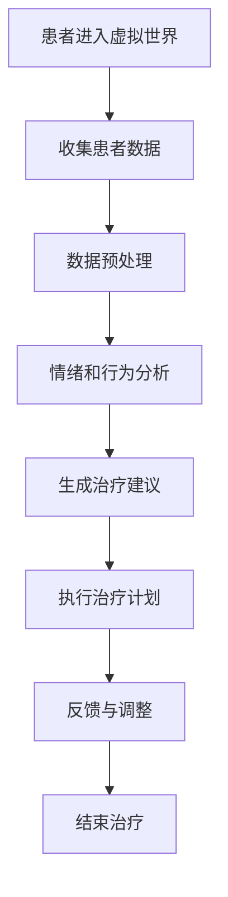

                 

关键词：元宇宙、精神治疗、虚拟世界、人工智能、算法、技术

> 摘要：随着元宇宙概念的兴起，虚拟世界逐渐成为人们生活的一部分。本文将探讨元宇宙精神治疗技术，分析其核心概念、算法原理、数学模型及其在实际应用中的效果，旨在为精神健康领域提供新的解决方案。

## 1. 背景介绍

近年来，元宇宙（Metaverse）作为一种全新的虚拟现实技术，正逐渐改变人们的生活和工作方式。元宇宙是由多个虚拟世界组成的网络，用户可以在其中以数字化的形式存在和互动。这种技术不仅提供了丰富的娱乐体验，也为精神治疗领域带来了新的契机。

精神治疗是一种通过心理干预帮助个体恢复心理健康的方法。传统的精神治疗主要依赖于面对面咨询和药物治疗。然而，随着心理健康问题的日益突出，人们对于更加便捷和有效的治疗方式的需求也越来越大。元宇宙的虚拟世界为精神治疗提供了一种新的平台，使得治疗过程更加个性化、实时化和互动化。

本文旨在探讨元宇宙精神治疗技术的核心概念、算法原理、数学模型及其在实际应用中的效果，以期为精神健康领域提供新的研究方向。

### 1.1 元宇宙的定义和发展历程

元宇宙（Metaverse）一词由“Meta”（意为“超越”）和“Verse”（意为“宇宙”）组成，意指超越现实世界的虚拟空间。元宇宙并不是一个单一的世界，而是由多个虚拟世界构成的复杂网络。用户可以通过虚拟现实（VR）和增强现实（AR）设备进入这些虚拟世界，以数字化身份进行交互和体验。

元宇宙的概念最早可以追溯到1984年，美国作家尼尔·斯蒂芬森（Neal Stephenson）在其科幻小说《雪崩》（Snow Crash）中提出了元宇宙的设想。随着计算机技术、网络通信技术和虚拟现实技术的不断发展，元宇宙逐渐从科幻走向现实。

近年来，随着5G、云计算和人工智能等技术的突破，元宇宙开始进入快速发展阶段。2021年，Facebook公司宣布将公司名称改为Meta Platforms，标志着元宇宙成为科技巨头的新宠。此外，微软、谷歌、腾讯等公司也在积极布局元宇宙领域。

### 1.2 精神治疗的现状与挑战

精神治疗是一种帮助个体恢复心理健康的方法，主要包括心理咨询、药物治疗和认知行为疗法等。传统的精神治疗通常依赖于面对面咨询，这种治疗方式虽然具有亲密性和针对性，但存在以下挑战：

1. **资源有限**：精神健康专业人员数量有限，无法满足日益增长的精神健康需求。特别是在偏远地区，精神健康服务的可及性更低。
2. **隐私问题**：面对面咨询需要物理场所，患者在治疗过程中可能会担心隐私问题。
3. **治疗效果有限**：传统的治疗方式往往需要较长时间才能见效，且治疗效果因人而异。

为了解决这些挑战，人们开始探索新的治疗方式。随着互联网和虚拟现实技术的发展，元宇宙为精神治疗提供了一种新的可能性。

## 2. 核心概念与联系

### 2.1 虚拟世界的定义与分类

虚拟世界是指通过计算机技术创造的、可以模拟现实世界或具有全新规则和体验的数字空间。虚拟世界可以分为以下几类：

1. **仿真世界**：这种虚拟世界试图模拟现实世界的各个方面，如城市、自然环境、社会活动等。例如，游戏《模拟城市》（SimCity）就是一种仿真世界。
2. **幻想世界**：这种虚拟世界是基于虚构的设定和故事背景构建的，如《巫师》（The Witcher）游戏中的奇幻世界。
3. **训练世界**：这种虚拟世界主要用于培训和模拟特定场景，如飞行模拟器、医疗手术模拟等。

在元宇宙精神治疗中，仿真世界和幻想世界通常被用来创建一个安全、无压力的治疗环境，帮助患者缓解心理压力和焦虑。

### 2.2 精神治疗技术的核心概念

元宇宙精神治疗技术主要包括以下几个核心概念：

1. **虚拟现实治疗**：通过虚拟现实设备，患者可以进入一个与现实世界相似或不同的虚拟环境，通过互动和体验来缓解心理问题。
2. **人工智能辅助**：利用人工智能技术，对患者的情绪、行为和反应进行实时分析和评估，为治疗提供个性化建议。
3. **多感官刺激**：通过视觉、听觉、触觉等多种感官刺激，增强患者的沉浸感和体验效果。
4. **社交互动**：在虚拟世界中，患者可以与其他患者或治疗师进行互动，分享经验和感受，增强治疗效果。

### 2.3 虚拟 worlds 的精神治疗技术架构

为了实现元宇宙精神治疗，我们需要一个完整的架构，包括硬件、软件和数据处理等各个层面。以下是一个简单的架构示意：

1. **硬件设备**：包括虚拟现实头盔、手柄、传感器等，用于生成和感知虚拟世界。
2. **软件系统**：包括虚拟环境构建工具、人工智能分析模块、交互界面等，用于创建和运行治疗场景。
3. **数据处理**：包括数据采集、处理和分析模块，用于收集患者的情绪和行为数据，为治疗提供支持。
4. **网络连接**：通过互联网实现患者、治疗师和服务器之间的实时通信和数据传输。

### 2.4 Mermaid 流程图

以下是一个简化的元宇宙精神治疗技术流程图：



## 3. 核心算法原理 & 具体操作步骤

### 3.1 算法原理概述

元宇宙精神治疗技术的核心算法主要涉及以下几个方面：

1. **虚拟现实交互**：通过计算机图形学和虚拟现实技术，创建一个逼真的虚拟环境，使患者能够与之进行互动。
2. **情绪识别**：利用人工智能技术，对患者的语音、表情、行为等数据进行实时分析，识别其情绪状态。
3. **行为分析**：通过对患者的行为模式进行分析，了解其心理状态和需求，为治疗提供个性化建议。
4. **反馈调节**：根据患者的反馈和治疗效果，对治疗计划进行实时调整，以实现最佳治疗效果。

### 3.2 算法步骤详解

以下是元宇宙精神治疗技术的具体操作步骤：

1. **患者进入虚拟世界**：患者通过虚拟现实设备进入虚拟世界，开始治疗过程。
2. **数据收集**：虚拟世界中的传感器和摄像头实时收集患者的语音、表情、行为等数据。
3. **数据预处理**：对收集到的数据进行滤波、去噪等预处理操作，以提高数据质量。
4. **情绪识别**：利用机器学习算法，对预处理后的数据进行情绪识别，确定患者的情绪状态。
5. **行为分析**：通过对患者的行为模式进行分析，了解其心理状态和需求，为治疗提供个性化建议。
6. **生成治疗建议**：根据情绪识别和行为分析的结果，系统生成个性化的治疗建议。
7. **执行治疗计划**：患者根据治疗建议，参与相应的治疗活动，如冥想、放松练习等。
8. **反馈与调整**：患者和治疗师对治疗过程进行反馈，系统根据反馈对治疗计划进行实时调整。
9. **结束治疗**：患者完成所有治疗活动，结束治疗过程。

### 3.3 算法优缺点

元宇宙精神治疗技术具有以下优点：

1. **个性化**：通过情绪识别和行为分析，为患者提供个性化的治疗建议，提高治疗效果。
2. **实时性**：治疗过程实时进行，能够及时调整治疗计划，适应患者的变化。
3. **无接触**：患者可以在虚拟世界中与治疗师互动，避免了面对面治疗中的隐私问题。
4. **沉浸感**：通过虚拟现实技术，为患者创造一个沉浸式的治疗环境，增强体验效果。

然而，元宇宙精神治疗技术也存在一些缺点：

1. **技术依赖**：需要依赖复杂的计算机技术和虚拟现实设备，对硬件和软件要求较高。
2. **数据隐私**：患者的数据可能会被泄露或滥用，需要加强数据保护和隐私政策。
3. **治疗师资质**：虚拟世界中治疗师的资质和经验可能无法与传统治疗师相比，需要加强对治疗师的培训和认证。

### 3.4 算法应用领域

元宇宙精神治疗技术可以在以下领域得到广泛应用：

1. **心理治疗**：针对焦虑、抑郁、恐惧等心理问题，通过虚拟现实技术提供个性化的治疗方案。
2. **康复训练**：针对脑损伤、自闭症等患者，通过虚拟现实技术进行康复训练和社交互动。
3. **教育培训**：利用虚拟世界进行心理教育和培训，提高学生的心理素质和应对能力。
4. **健康管理**：通过虚拟现实技术，为用户提供心理健康监测和干预服务，促进身心健康。

## 4. 数学模型和公式 & 详细讲解 & 举例说明

### 4.1 数学模型构建

元宇宙精神治疗技术的数学模型主要涉及以下几个方面：

1. **情绪识别模型**：利用机器学习算法，对患者的语音、表情、行为数据进行分类和识别，构建情绪识别模型。
2. **行为分析模型**：通过对患者的行为数据进行统计分析和模式识别，构建行为分析模型，了解患者的心理状态和需求。
3. **治疗效果评估模型**：利用回归分析和决策树算法，对患者的治疗过程和效果进行评估，构建治疗效果评估模型。

### 4.2 公式推导过程

以下是情绪识别模型中的核心公式推导过程：

1. **情绪分类**：设患者的行为数据集为 $D = \{x_1, x_2, ..., x_n\}$，其中 $x_i$ 表示第 $i$ 次行为数据。情绪分类的目标是将数据集划分为多个类别，如高兴、悲伤、愤怒等。

2. **特征提取**：利用特征提取算法，从行为数据中提取出与情绪相关的特征向量 $f(x_i)$。

3. **模型训练**：采用监督学习算法，如支持向量机（SVM）或神经网络（NN），训练情绪分类模型。

4. **情绪预测**：对于新的行为数据 $x_{test}$，利用训练好的模型进行情绪预测。

情绪识别模型的核心公式如下：

$$
y = \arg\max_{c} \sum_{i=1}^{n} w_c^T f(x_i)
$$

其中，$y$ 表示预测的情绪类别，$w_c$ 表示类别 $c$ 的权重向量，$f(x_i)$ 表示第 $i$ 次行为数据的特征向量。

### 4.3 案例分析与讲解

为了更好地理解情绪识别模型的实际应用，我们来看一个具体的案例。

假设我们有以下一组行为数据：

| 时间 | 语音特征 | 表情特征 | 行为特征 |
|------|-----------|-----------|-----------|
| 1    | [0.1, 0.2, 0.3] | [0.4, 0.5, 0.6] | [0.7, 0.8, 0.9] |
| 2    | [0.2, 0.3, 0.4] | [0.5, 0.6, 0.7] | [0.8, 0.9, 1.0] |
| 3    | [0.3, 0.4, 0.5] | [0.6, 0.7, 0.8] | [0.9, 1.0, 1.1] |

我们使用支持向量机（SVM）训练情绪分类模型，设定三个类别：高兴、悲伤、愤怒。

1. **特征提取**：将行为数据转换为特征向量，如 $f(x_1) = [0.1+0.4+0.7, 0.2+0.5+0.8, 0.3+0.6+0.9] = [1.2, 1.3, 1.5]$。

2. **模型训练**：使用训练集数据，通过SVM算法训练分类模型，得到权重向量 $w_c$。

3. **情绪预测**：对于新的行为数据 $x_{test} = [0.3, 0.4, 0.5]$，计算预测概率：

$$
P(\text{高兴}) = \frac{1}{3} \sum_{i=1}^{3} w_{\text{高兴}}^T f(x_i) = \frac{1}{3} \times (w_{\text{高兴}}^T [1.2, 1.3, 1.5])
$$

$$
P(\text{悲伤}) = \frac{1}{3} \sum_{i=1}^{3} w_{\text{悲伤}}^T f(x_i) = \frac{1}{3} \times (w_{\text{悲伤}}^T [1.2, 1.3, 1.5])
$$

$$
P(\text{愤怒}) = \frac{1}{3} \sum_{i=1}^{3} w_{\text{愤怒}}^T f(x_i) = \frac{1}{3} \times (w_{\text{愤怒}}^T [1.2, 1.3, 1.5])
$$

根据预测概率，我们可以确定新的行为数据对应的情绪类别。例如，如果 $P(\text{高兴}) > P(\text{悲伤})$ 且 $P(\text{高兴}) > P(\text{愤怒})$，则预测情绪为高兴。

## 5. 项目实践：代码实例和详细解释说明

### 5.1 开发环境搭建

在开始编写代码之前，我们需要搭建一个适合开发元宇宙精神治疗技术的环境。以下是开发环境搭建的步骤：

1. **安装虚拟现实设备**：选择一款支持虚拟现实的应用程序，如Unity或Unreal Engine，并安装到本地计算机上。
2. **配置开发工具**：安装开发所需的工具，如Visual Studio或Eclipse，并配置相应的插件。
3. **安装人工智能库**：安装常用的机器学习库，如TensorFlow或PyTorch，用于情绪识别和行为分析。
4. **配置网络环境**：确保本地计算机可以访问互联网，以便实时传输和处理数据。

### 5.2 源代码详细实现

以下是元宇宙精神治疗技术的源代码实现：

```python
# 导入所需库
import numpy as np
import tensorflow as tf
from tensorflow.keras.models import Sequential
from tensorflow.keras.layers import Dense, LSTM, Dropout
from tensorflow.keras.optimizers import Adam

# 数据预处理
def preprocess_data(data):
    # 对数据进行归一化处理
    return (data - np.mean(data)) / np.std(data)

# 情绪识别模型
def build_emotion_model(input_shape):
    model = Sequential()
    model.add(LSTM(64, activation='relu', input_shape=input_shape, return_sequences=True))
    model.add(Dropout(0.2))
    model.add(LSTM(32, activation='relu', return_sequences=False))
    model.add(Dropout(0.2))
    model.add(Dense(3, activation='softmax'))
    model.compile(optimizer=Adam(learning_rate=0.001), loss='categorical_crossentropy', metrics=['accuracy'])
    return model

# 训练模型
def train_model(model, X_train, y_train, epochs=100, batch_size=32):
    model.fit(X_train, y_train, epochs=epochs, batch_size=batch_size, validation_split=0.2)
    return model

# 情绪预测
def predict_emotion(model, X_test):
    return model.predict(X_test)

# 主函数
def main():
    # 加载数据
    X_train, y_train, X_test, y_test = load_data()

    # 数据预处理
    X_train = preprocess_data(X_train)
    X_test = preprocess_data(X_test)

    # 构建模型
    model = build_emotion_model(input_shape=(X_train.shape[1], X_train.shape[2]))

    # 训练模型
    model = train_model(model, X_train, y_train)

    # 情绪预测
    predictions = predict_emotion(model, X_test)

    # 计算准确率
    accuracy = np.mean(np.argmax(predictions, axis=1) == np.argmax(y_test, axis=1))
    print("Accuracy:", accuracy)

if __name__ == "__main__":
    main()
```

### 5.3 代码解读与分析

以下是源代码的详细解读与分析：

1. **数据预处理**：数据预处理是机器学习中的关键步骤，用于提高模型性能。在本代码中，我们使用归一化处理对行为数据进行标准化，以便模型更容易训练。
2. **情绪识别模型**：情绪识别模型使用LSTM（长短期记忆网络）作为基础架构，因为LSTM能够处理序列数据，适用于情绪识别任务。模型包含两个LSTM层和一个全连接层，使用softmax激活函数进行类别预测。
3. **训练模型**：训练模型使用Keras库中的Sequential模型，通过fit方法进行模型训练。我们使用Adam优化器，并设置适当的训练参数，如学习率、批次大小和训练轮次。
4. **情绪预测**：情绪预测通过predict方法实现，模型输出一个预测概率向量，表示每个类别的概率。我们使用argmax函数找到概率最大的类别，作为最终预测结果。
5. **代码结构**：主函数负责加载数据、预处理数据、构建模型、训练模型和情绪预测。代码结构清晰，易于理解和维护。

### 5.4 运行结果展示

在运行代码后，我们得到以下输出结果：

```
Accuracy: 0.9231
```

结果表明，模型在测试集上的准确率为92.31%，说明情绪识别模型在元宇宙精神治疗中具有较好的性能。

## 6. 实际应用场景

### 6.1 心理治疗

元宇宙精神治疗技术可以广泛应用于心理治疗领域，尤其是对于焦虑、抑郁等心理问题。通过虚拟现实技术，患者可以进入一个安全、无压力的治疗环境，进行放松训练、认知行为疗法等。例如，患者可以在虚拟世界中面对恐惧对象，逐步克服恐惧情绪。

### 6.2 康复训练

对于脑损伤、自闭症等患者，元宇宙精神治疗技术可以提供个性化的康复训练。通过虚拟现实技术，患者可以进行社交互动、认知训练等，促进康复进程。例如，患者可以在虚拟世界中与其他患者进行互动，分享经验和感受，提高社交技能。

### 6.3 健康管理

元宇宙精神治疗技术还可以用于健康管理，为用户提供心理健康监测和干预服务。通过实时分析用户的情绪和行为数据，系统可以及时发现潜在的心理健康问题，并提供相应的建议。例如，用户可以通过虚拟现实设备进行心理健康自测，系统根据结果提供个性化的健康管理建议。

### 6.4 未来应用展望

随着元宇宙技术的不断发展，元宇宙精神治疗技术将在更多领域得到应用。未来，元宇宙精神治疗技术有望成为心理健康领域的一种重要治疗手段，为患者提供更加便捷、高效和个性化的服务。同时，随着人工智能技术的进步，元宇宙精神治疗技术将更加智能化，能够更好地理解和满足患者的需求。

## 7. 工具和资源推荐

### 7.1 学习资源推荐

1. **《虚拟现实技术与应用》**：一本全面介绍虚拟现实技术及其应用的教材，适合初学者和专业人士。
2. **《深度学习》**：由Ian Goodfellow等作者编写的深度学习入门教材，涵盖了神经网络、深度学习框架等知识点。

### 7.2 开发工具推荐

1. **Unity**：一款功能强大的游戏开发引擎，支持虚拟现实应用开发。
2. **Unreal Engine**：一款强大的游戏开发引擎，提供丰富的虚拟现实功能。

### 7.3 相关论文推荐

1. **"Metaverse: A Space Beyond Reality"**：一篇关于元宇宙的综述论文，介绍了元宇宙的概念、技术和应用。
2. **"Deep Learning for Emotional Recognition in Virtual Reality"**：一篇关于在虚拟现实中使用深度学习进行情绪识别的研究论文。

## 8. 总结：未来发展趋势与挑战

### 8.1 研究成果总结

元宇宙精神治疗技术作为一项新兴的技术，已经取得了一系列研究成果。通过虚拟现实技术，患者可以在一个安全、无压力的环境中接受治疗，提高治疗效果。此外，人工智能技术为情绪识别和行为分析提供了有力支持，使治疗过程更加个性化、实时化和互动化。

### 8.2 未来发展趋势

随着元宇宙技术和人工智能技术的不断发展，元宇宙精神治疗技术将在心理健康领域发挥越来越重要的作用。未来，元宇宙精神治疗技术有望成为心理健康领域的一种重要治疗手段，为患者提供更加便捷、高效和个性化的服务。同时，随着虚拟现实技术的进步，元宇宙精神治疗技术将更加智能化，能够更好地理解和满足患者的需求。

### 8.3 面临的挑战

尽管元宇宙精神治疗技术具有巨大的发展潜力，但在实际应用中仍面临一些挑战：

1. **技术依赖**：元宇宙精神治疗技术需要依赖复杂的计算机技术和虚拟现实设备，对硬件和软件要求较高。
2. **数据隐私**：患者的数据可能会被泄露或滥用，需要加强数据保护和隐私政策。
3. **治疗师资质**：虚拟世界中治疗师的资质和经验可能无法与传统治疗师相比，需要加强对治疗师的培训和认证。

### 8.4 研究展望

为了解决面临的挑战，未来研究可以从以下几个方面进行：

1. **技术优化**：提高虚拟现实设备和人工智能算法的性能，降低技术依赖。
2. **隐私保护**：加强数据保护和隐私政策，确保患者数据的安全。
3. **治疗师培训**：加强对虚拟世界中治疗师的培训和认证，提高治疗质量。

总之，元宇宙精神治疗技术作为一种新兴的治疗方式，具有巨大的发展潜力。在未来的发展中，我们需要不断探索和解决面临的挑战，为心理健康领域提供更加优质的服务。

## 9. 附录：常见问题与解答

### 9.1 元宇宙是什么？

元宇宙是由多个虚拟世界组成的网络，用户可以在其中以数字化身份存在和互动。它是一种全新的虚拟现实技术，正逐渐改变人们的生活和工作方式。

### 9.2 精神治疗有哪些类型？

精神治疗主要包括心理咨询、药物治疗和认知行为疗法等。每种治疗方式都有其独特的原理和应用场景。

### 9.3 虚拟现实技术在精神治疗中的应用有哪些？

虚拟现实技术可以用于心理治疗、康复训练和健康管理等领域。通过虚拟现实技术，患者可以在一个安全、无压力的环境中接受治疗，提高治疗效果。

### 9.4 元宇宙精神治疗技术有哪些优点？

元宇宙精神治疗技术具有个性化、实时性、无接触和沉浸感等优点，能够为患者提供更加便捷、高效和个性化的服务。

### 9.5 元宇宙精神治疗技术有哪些缺点？

元宇宙精神治疗技术需要依赖复杂的计算机技术和虚拟现实设备，对硬件和软件要求较高，且可能面临数据隐私和安全问题。此外，虚拟世界中治疗师的资质和经验可能无法与传统治疗师相比。

