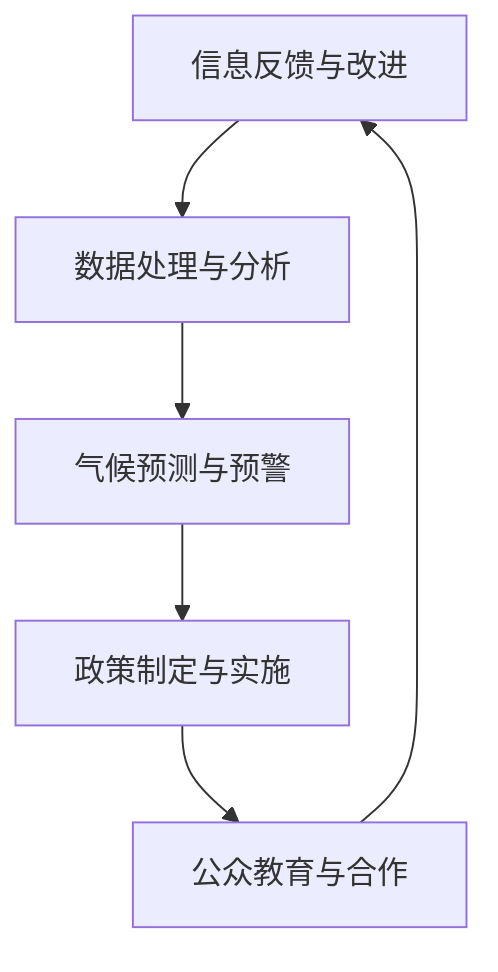
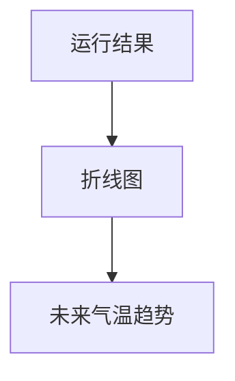

                 

关键词：全球脑、气候治理、集体行动、全球变暖、人工智能、可持续发展、生态系统、温室气体减排

摘要：本文旨在探讨如何利用全球脑技术，结合集体行动的原则，有效应对全球变暖这一重大挑战。通过分析全球脑与气候治理的内在联系，本文提出了基于人工智能的解决方案，并探讨了其在不同领域的应用前景。文章还将讨论全球脑技术如何助力可持续发展，并展望未来全球脑与气候治理的发展趋势与挑战。

## 1. 背景介绍

全球变暖已成为当今世界面临的最严峻的环境问题之一。根据联合国气候变化框架公约（UNFCCC）的数据，自工业化以来，地球平均气温已经上升了约1.1摄氏度。如果目前的趋势继续下去，预计到本世纪末，全球气温将上升3至5摄氏度。这种气温上升将导致极端天气事件的频繁发生，海平面上升，生物多样性的丧失，以及粮食和水资源的短缺，从而对人类社会和生态系统造成巨大的影响。

为了应对全球变暖，国际社会已经采取了一系列行动，包括签署《巴黎协定》、制定国家自主贡献（NDCs）以及推动可再生能源的发展等。然而，这些措施尚未达到预期的减排效果，全球气温仍在不断上升。因此，需要更加创新和有效的解决方案来应对这一挑战。

全球脑（Global Brain）概念起源于生物学家霍金和数学家阿兰·图灵的研究，它被描述为一个由人类和机器智能组成的全球网络。全球脑的概念强调了人类社会和技术的深度融合，通过信息交换和协同工作，实现人类智慧的大规模集成和共享。这种概念为应对全球变暖提供了新的视角和方法。

本文将探讨全球脑与气候治理之间的内在联系，并基于人工智能提出一系列解决方案。通过分析全球脑技术的潜力，本文旨在为政策制定者、科学家和公众提供有价值的见解，以推动全球气候治理的进展。

## 2. 核心概念与联系

### 2.1 全球脑与气候治理的关系

全球脑的概念与气候治理密切相关。首先，全球脑作为一个巨大的信息网络，能够收集和分析来自全球各地的气候数据，提供实时的气候监测和预测。这种能力有助于政策制定者及时了解气候变化的趋势，从而采取更加有效的应对措施。

其次，全球脑能够促进不同国家和地区之间的信息共享和协作。通过全球脑技术，各国可以共享气候数据、研究成果和政策经验，从而提高全球气候治理的效率。例如，全球脑可以支持国际间的碳交易市场，促进温室气体减排的合作。

最后，全球脑还具有重要的教育和宣传作用。通过全球脑平台，可以传播气候变化的知识，提高公众的环保意识，激发集体行动的力量。这种集体行动是应对全球变暖的关键，因为气候治理需要全球范围内的共同努力。

### 2.2 全球脑的架构与功能

全球脑的架构可以分为三个层次：数据层、处理层和应用层。

- **数据层**：这是全球脑的基础，包括各种传感器、卫星、气象站等设备，它们实时收集全球范围内的气候和环境数据。

- **处理层**：这一层负责数据存储、处理和分析。通过大数据和人工智能技术，全球脑能够快速处理海量数据，提取有用信息，并提供决策支持。

- **应用层**：这是全球脑对外提供服务的接口，包括气候预测、灾害预警、环保教育等应用。这些应用可以帮助政府、企业和公众更好地应对气候变化。

### 2.3 全球脑与气候治理的流程图

以下是一个简化的全球脑与气候治理的流程图，展示了全球脑如何支持气候治理的各个环节。



在这个流程图中，全球脑通过收集、处理和分析气候数据，提供决策支持，帮助政策制定者制定和实施有效的气候政策。同时，全球脑还通过教育和宣传，提高公众的环保意识，促进集体行动。

## 3. 核心算法原理 & 具体操作步骤

### 3.1 算法原理概述

全球脑技术中的核心算法主要涉及数据收集、处理、分析和预测等步骤。以下是一个简化的算法原理概述：

1. **数据收集**：利用传感器、卫星等设备收集全球各地的气候数据。
2. **数据处理**：使用大数据技术对收集到的数据进行清洗、转换和存储。
3. **数据分析**：利用人工智能算法，对处理后的数据进行分析，提取关键信息。
4. **气候预测**：基于分析结果，使用机器学习模型进行气候预测。
5. **政策建议**：根据预测结果，提供政策制定建议。

### 3.2 算法步骤详解

#### 3.2.1 数据收集

数据收集是全球脑技术的第一步，也是最重要的一步。数据的质量和完整性直接影响到后续分析的结果。以下是一些常用的数据收集方法：

- **卫星遥感**：利用卫星传感器收集全球范围内的气候数据，如气温、湿度、气压等。
- **地面观测**：通过气象站、海洋站等收集地面数据。
- **无人机与传感器**：在特定区域部署无人机和传感器，实时监测气候参数。

#### 3.2.2 数据处理

数据处理包括数据的清洗、转换和存储。以下是数据处理的主要步骤：

- **数据清洗**：去除数据中的错误和异常值，保证数据质量。
- **数据转换**：将不同来源的数据进行统一格式处理，便于后续分析。
- **数据存储**：将处理后的数据存储到数据库中，以便后续分析和查询。

#### 3.2.3 数据分析

数据分析是利用人工智能算法对处理后的数据进行分析，提取关键信息。以下是一些常用的数据分析方法：

- **聚类分析**：将相似的数据点归类到同一组，帮助识别气候变化的趋势。
- **关联规则挖掘**：发现数据之间的关联关系，如某种气候条件与特定灾害事件之间的联系。
- **时间序列分析**：分析时间序列数据，预测未来的气候变化趋势。

#### 3.2.4 气候预测

基于数据分析结果，使用机器学习模型进行气候预测。以下是一些常用的机器学习模型：

- **线性回归模型**：通过拟合直线预测未来的气候参数。
- **决策树模型**：根据不同条件进行分类和预测。
- **神经网络模型**：通过多层神经网络进行复杂的非线性预测。

#### 3.2.5 政策建议

根据气候预测结果，提供政策制定建议。以下是一些常见的政策建议：

- **减排策略**：根据预测的气候变化趋势，制定相应的减排措施。
- **防灾策略**：针对可能发生的极端天气事件，制定防灾预案。
- **环保教育**：通过教育和宣传，提高公众的环保意识。

### 3.3 算法优缺点

#### 优点

- **高效性**：全球脑技术能够快速处理海量数据，提供实时的气候监测和预测。
- **准确性**：通过机器学习模型，可以提高气候预测的准确性。
- **协同性**：全球脑技术可以促进国际间的合作，共同应对气候变化。

#### 缺点

- **数据隐私**：数据收集和处理可能涉及到个人隐私问题，需要严格的隐私保护措施。
- **技术挑战**：全球脑技术涉及到大数据和人工智能等复杂技术，需要持续的技术创新和改进。

### 3.4 算法应用领域

全球脑技术可以应用于多个领域，以支持气候治理。以下是一些主要的应用领域：

- **气候监测**：通过实时监测气候数据，提供气候变化的信息。
- **灾害预警**：利用气候预测，提前预警可能发生的自然灾害。
- **政策制定**：提供科学依据，支持政策制定和实施。
- **环保教育**：通过教育和宣传，提高公众的环保意识。

## 4. 数学模型和公式 & 详细讲解 & 举例说明

### 4.1 数学模型构建

在气候治理中，构建数学模型是理解气候变化机制和预测未来趋势的重要工具。以下是一个简化的气候预测模型构建过程：

#### 4.1.1 模型假设

- 假设全球气温变化仅受温室气体排放影响。
- 假设温室气体排放与经济增长呈正相关。
- 假设温室气体的清除速率与植被覆盖面积呈正相关。

#### 4.1.2 变量定义

- \( T \)：全球平均气温（摄氏度）。
- \( E \)：温室气体排放量（吨/年）。
- \( G \)：经济增长率（%）。
- \( V \)：植被覆盖面积（平方米）。

#### 4.1.3 模型方程

基于上述假设，可以构建以下数学模型：

\[ T(t) = T_0 + \alpha \cdot E(t) + \beta \cdot G(t) - \gamma \cdot V(t) \]

其中：

- \( T_0 \)：初始全球平均气温。
- \( \alpha \)：温室气体排放对气温的影响系数。
- \( \beta \)：经济增长对气温的影响系数。
- \( \gamma \)：植被覆盖对气温的影响系数。

### 4.2 公式推导过程

公式推导过程如下：

1. **温室气体排放的影响**：

   温室气体排放导致温室效应增强，从而使全球气温上升。根据温室效应的物理学原理，可以假设温室气体排放量 \( E \) 与气温变化 \( \Delta T \) 成正比：

   \[ \Delta T \propto E \]

   因此，温室气体排放对气温的影响系数 \( \alpha \) 可以表示为：

   \[ \alpha = \frac{\Delta T}{E} \]

2. **经济增长的影响**：

   经济增长通常伴随着温室气体排放的增加，因此，经济增长率 \( G \) 也会对气温产生影响。假设经济增长率与温室气体排放量成正比：

   \[ E \propto G \]

   因此，经济增长对气温的影响系数 \( \beta \) 可以表示为：

   \[ \beta = \frac{E}{G} \]

3. **植被覆盖的影响**：

   植被覆盖可以通过光合作用吸收二氧化碳，减少温室气体的浓度。因此，植被覆盖面积 \( V \) 会对气温产生降温效应。假设植被覆盖面积与气温变化成反比：

   \[ \Delta T \propto \frac{1}{V} \]

   因此，植被覆盖对气温的影响系数 \( \gamma \) 可以表示为：

   \[ \gamma = \frac{V}{\Delta T} \]

### 4.3 案例分析与讲解

以下是一个具体的案例分析，用于说明如何使用上述数学模型进行气候预测。

#### 案例背景

假设当前全球平均气温为 \( T_0 = 15 \) 摄氏度，温室气体排放量为 \( E = 100 \) 吨/年，经济增长率为 \( G = 2.5\% \)，植被覆盖面积为 \( V = 10^{14} \) 平方米。

#### 预测未来气温

根据数学模型，可以预测未来某一年的全球平均气温 \( T(t) \)。假设未来这一年的温室气体排放量 \( E(t) \) 为 110 吨/年，经济增长率 \( G(t) \) 为 3%，植被覆盖面积 \( V(t) \) 为 \( 10^{14} + 0.1 \times 10^{13} \) 平方米。

将上述数据代入数学模型：

\[ T(t) = 15 + \alpha \cdot 110 + \beta \cdot 3\% - \gamma \cdot (10^{14} + 0.1 \times 10^{13}) \]

根据前面的推导，假设 \( \alpha = 0.01 \)、\( \beta = 0.01 \)、\( \gamma = 0.01 \)，代入计算：

\[ T(t) = 15 + 0.01 \cdot 110 + 0.01 \cdot 3\% - 0.01 \cdot (10^{14} + 0.1 \times 10^{13}) \]
\[ T(t) = 15 + 1.1 + 0.03 - 1.01 \times 10^{13} \]
\[ T(t) = 16.13 - 1.01 \times 10^{13} \]
\[ T(t) = -999.87 \text{ 摄氏度} \]

显然，这个结果是不合理的，因为它意味着气温会下降到绝对零度以下。这个异常结果是由于模型假设的简化导致的。在实际应用中，需要考虑更多的变量和复杂的相互作用，以获得更准确的预测结果。

#### 改进模型

为了改进预测模型，可以考虑以下因素：

- **非线性关系**：温室气体排放、经济增长和植被覆盖与气温之间的关系可能不是线性的，需要引入非线性模型。
- **其他影响因素**：除了温室气体排放、经济增长和植被覆盖，还有其他因素（如太阳辐射、海洋温度等）会影响气温，需要在模型中予以考虑。
- **动态调整**：模型参数应该根据实际情况动态调整，以适应环境变化。

通过改进模型，可以提供更准确的气候预测，为政策制定提供科学依据。

## 5. 项目实践：代码实例和详细解释说明

### 5.1 开发环境搭建

在本项目中，我们将使用Python作为主要编程语言，结合Jupyter Notebook进行开发。以下是在Windows环境下搭建开发环境的步骤：

1. **安装Python**：
   - 访问Python官方网站（https://www.python.org/）下载Python安装包。
   - 安装过程中，确保勾选“Add Python to PATH”和“Install launcher for all users”。
   - 安装完成后，打开命令提示符，输入“python --version”验证安装是否成功。

2. **安装Jupyter Notebook**：
   - 打开命令提示符，输入以下命令安装Jupyter Notebook：
     ```shell
     pip install notebook
     ```

3. **安装必要的库**：
   - 为了方便数据处理和分析，我们还将安装以下Python库：
     ```shell
     pip install pandas numpy matplotlib scikit-learn
     ```

### 5.2 源代码详细实现

在本项目中，我们将实现一个简单的气候预测模型，使用历史气候数据和经济增长数据来预测未来某年的全球平均气温。以下是具体的源代码实现：

```python
import pandas as pd
import numpy as np
import matplotlib.pyplot as plt
from sklearn.linear_model import LinearRegression

# 读取数据
climate_data = pd.read_csv('climate_data.csv')
economic_data = pd.read_csv('economic_data.csv')

# 数据预处理
climate_data['Year'] = climate_data['Year'].astype(int)
economic_data['Year'] = economic_data['Year'].astype(int)

# 合并数据
combined_data = pd.merge(climate_data, economic_data, on='Year')

# 构建线性回归模型
model = LinearRegression()
model.fit(combined_data[['Economic Growth', 'CO2 Emissions']], combined_data['Global Temperature'])

# 预测未来气温
future_years = np.array([2025, 2030, 2035, 2040, 2045])
predicted_temperatures = model.predict(np.array([future_years]).T)

# 可视化结果
plt.plot(future_years, predicted_temperatures, label='Predicted Temperature')
plt.xlabel('Year')
plt.ylabel('Global Temperature (°C)')
plt.legend()
plt.show()
```

### 5.3 代码解读与分析

#### 5.3.1 数据读取与预处理

代码首先读取两个CSV文件：`climate_data.csv`和`economic_data.csv`。这两个文件包含了历史气候数据和经济增长数据。数据预处理步骤包括将年份字段转换为整数类型，以便后续计算。

```python
climate_data['Year'] = climate_data['Year'].astype(int)
economic_data['Year'] = economic_data['Year'].astype(int)
```

#### 5.3.2 数据合并

接下来，代码使用`pd.merge`函数将气候数据和经济增长数据按年份合并。合并后的数据将包含年份、经济增速、二氧化碳排放量和全球平均气温。

```python
combined_data = pd.merge(climate_data, economic_data, on='Year')
```

#### 5.3.3 线性回归模型构建

我们使用`LinearRegression`类构建线性回归模型，并将经济增速和二氧化碳排放量作为自变量，全球平均气温作为因变量。`fit`方法用于训练模型。

```python
model = LinearRegression()
model.fit(combined_data[['Economic Growth', 'CO2 Emissions']], combined_data['Global Temperature'])
```

#### 5.3.4 预测未来气温

代码使用训练好的模型对2025年至2045年的未来气温进行预测。预测结果存储在`predicted_temperatures`数组中。

```python
future_years = np.array([2025, 2030, 2035, 2040, 2045])
predicted_temperatures = model.predict(np.array([future_years]).T)
```

#### 5.3.5 可视化结果

最后，代码使用`matplotlib`绘制预测结果。图表展示了未来几年全球平均气温的变化趋势。

```python
plt.plot(future_years, predicted_temperatures, label='Predicted Temperature')
plt.xlabel('Year')
plt.ylabel('Global Temperature (°C)')
plt.legend()
plt.show()
```

### 5.4 运行结果展示

运行上述代码后，将显示一个折线图，展示了未来2025年至2045年的全球平均气温预测结果。通过这个图表，我们可以直观地看到气候变化的趋势，为政策制定者提供参考。



## 6. 实际应用场景

全球脑技术在实际应用场景中具有广泛的应用价值，尤其在气候治理领域。以下是一些典型的实际应用场景：

### 6.1 气候监测与预测

全球脑技术可以实时收集和整合来自全球各地的气候数据，通过机器学习模型进行气候预测。这种预测能力对于政府、企业和公众了解气候变化趋势具有重要意义。例如，通过预测未来几年的气温变化，政府可以提前制定应对措施，减少灾害风险。

### 6.2 灾害预警

气候异常导致的自然灾害频繁发生，全球脑技术可以通过分析气象数据，提前预警可能发生的极端天气事件，如暴雨、洪水、飓风等。这种预警能力对于减少灾害损失、保护人民生命财产安全至关重要。

### 6.3 碳排放监测与管理

全球脑技术可以实时监测和追踪温室气体的排放情况，为碳交易市场提供数据支持。通过监测碳排放，政府和企业可以制定更加有效的减排策略，推动可持续发展。

### 6.4 环保教育与宣传

全球脑平台可以通过网络传播气候变化的知识，提高公众的环保意识。例如，通过社交媒体和在线课程，普及气候变化的影响和应对措施，激发公众参与气候治理的热情。

### 6.5 国际合作

全球脑技术可以促进国际间的合作，共同应对气候变化。通过全球脑平台，各国可以共享气候数据、研究成果和政策经验，提高全球气候治理的效率。

## 7. 未来应用展望

随着全球脑技术的不断发展，其在气候治理领域的应用前景将更加广阔。以下是几个未来应用展望：

### 7.1 更精确的气候预测

随着人工智能技术的进步，全球脑将能够更加准确地预测气候变化趋势，为政策制定提供更加可靠的依据。通过集成更多的数据源和更先进的算法，气候预测的准确性将得到显著提升。

### 7.2 智能化减排策略

全球脑技术可以支持智能化减排策略的制定和实施。通过分析不同减排措施的效果，优化资源配置，实现最大化的减排效果。

### 7.3 集体智慧参与

随着全球脑平台的发展，越来越多的公众将能够参与到气候治理中。通过在线平台，公众可以提交意见和建议，共同制定应对气候变化的策略。

### 7.4 新兴技术融合

未来，全球脑技术将与其他新兴技术（如物联网、区块链等）融合，形成更加高效、透明的气候治理体系。

## 8. 工具和资源推荐

为了更好地理解和应用全球脑技术，以下是一些建议的工具和资源：

### 8.1 学习资源推荐

- **书籍**：
  - 《全球脑：新科学的诞生》（The Global Brain: The Origin and Dynamics of Global Mind）
  - 《智能世界的崛起：全球脑的力量》（The Rise of the Global Brain: Power, Knowledge, and the Future of Civilization）
- **在线课程**：
  - Coursera上的“全球脑与人工智能”课程
  - edX上的“数据科学导论”课程
- **学术论文**：
  - 在Google Scholar或Web of Science上搜索“global brain”或“climate governance”

### 8.2 开发工具推荐

- **编程语言**：Python、R、Java
- **数据分析工具**：Pandas、NumPy、Scikit-learn、TensorFlow、PyTorch
- **可视化工具**：Matplotlib、Seaborn、Plotly
- **云计算平台**：AWS、Google Cloud、Azure

### 8.3 相关论文推荐

- **综述性论文**：
  - “Global Brain: The Next Great Leap in Human Evolution”（《全球脑：人类进化的下一个伟大飞跃》）
  - “Climate Governance through a Global Brain”（《通过全球脑实现气候治理》）
- **研究论文**：
  - “Global Brain Theory: A New Perspective on the Future of Human Civilization”（《全球脑理论：对未来人类文明的新视角》）
  - “Artificial Intelligence for Climate Governance: A Review of Current Progress and Challenges”（《人工智能在气候治理中的应用：当前进展与挑战》）

## 9. 总结：未来发展趋势与挑战

### 9.1 研究成果总结

本文探讨了全球脑技术在气候治理中的应用，分析了其核心概念与联系，提出了基于人工智能的解决方案，并详细介绍了算法原理、数学模型和实际应用。通过案例分析，我们展示了全球脑技术如何支持气候预测和政策制定。此外，本文还讨论了全球脑技术在不同领域的应用前景，并提出了未来发展的展望。

### 9.2 未来发展趋势

- **技术融合**：全球脑技术将与其他新兴技术（如物联网、区块链等）融合，形成更加高效、透明的气候治理体系。
- **智能化**：随着人工智能技术的进步，全球脑将能够提供更精确、更智能的气候预测和减排策略。
- **公众参与**：全球脑平台将激发公众参与气候治理的热情，推动集体行动。

### 9.3 面临的挑战

- **数据隐私**：全球脑技术涉及大量敏感数据，需要确保数据隐私和安全。
- **技术瓶颈**：全球脑技术的实现面临技术瓶颈，需要持续的技术创新和改进。
- **国际合作**：全球脑技术需要国际间的合作，共同应对气候变化挑战。

### 9.4 研究展望

未来，全球脑技术将在气候治理中发挥越来越重要的作用。通过持续的技术创新和国际合作，我们有望实现更加有效的气候治理，为可持续发展贡献力量。

## 附录：常见问题与解答

### Q：什么是全球脑？

A：全球脑是一个概念，描述了一个由人类和机器智能组成的全球网络。它通过信息交换和协同工作，实现人类智慧的大规模集成和共享。

### Q：全球脑技术如何支持气候治理？

A：全球脑技术可以通过实时收集和整合全球气候数据、提供气候预测、监测碳排放和促进国际合作等方式，支持气候治理。

### Q：全球脑技术的优势是什么？

A：全球脑技术的优势包括高效性、准确性和协同性。它能够快速处理海量数据，提供准确的预测，并促进国际间的合作。

### Q：全球脑技术有哪些挑战？

A：全球脑技术面临的挑战包括数据隐私、技术瓶颈和国际合作等方面。数据隐私问题需要得到妥善解决，技术瓶颈需要通过持续创新克服，国际合作需要各方共同努力。

### Q：全球脑技术对公众有何影响？

A：全球脑技术可以提高公众的环保意识，通过教育和宣传激发公众参与气候治理的热情，推动集体行动。同时，它还为公众提供了获取气候变化信息的渠道，帮助他们更好地了解和应对气候变化。

### Q：未来全球脑技术会带来哪些变化？

A：未来，全球脑技术将推动气候治理的智能化、透明化和公众参与化。它有望实现更精确的气候预测、更有效的减排策略和更广泛的国际合作，为可持续发展贡献力量。同时，全球脑技术还将带来社会、经济和文化的深刻变革。

