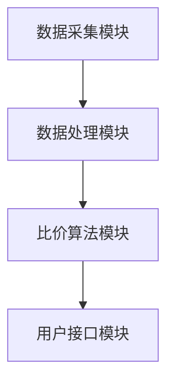

                 

关键词：全网比价、电商应用、算法原理、实践案例、数学模型、未来发展

> 摘要：本文将深入探讨全网比价技术及其在电商行业中的应用，从背景介绍、核心概念、算法原理、数学模型、项目实践等多个角度进行分析，旨在为广大电商从业者提供一种新的比价策略，助力企业在激烈的市场竞争中占据优势地位。

## 1. 背景介绍

随着互联网技术的飞速发展，电子商务已成为现代商业活动的重要组成部分。在电商领域，商品价格竞争尤为激烈。为了吸引消费者，电商平台纷纷推出各种优惠活动，如折扣、满减、赠品等。然而，这些优惠活动往往让消费者感到困惑，难以快速找到最适合自己的购物方案。

在这种背景下，全网比价技术应运而生。全网比价技术通过爬取、分析和比对各大电商平台的价格信息，为消费者提供准确、实时的商品价格数据。消费者可以根据全网比价结果，快速找到最具性价比的商品，从而做出更明智的购买决策。

## 2. 核心概念与联系

### 2.1 定义

全网比价技术，即通过对互联网上各大电商平台的商品价格进行爬取、分析和比对的算法，以获取消费者所需商品的最低价格或最优优惠方案。

### 2.2 工作原理

全网比价技术的工作原理主要包括以下三个步骤：

1. **数据采集**：通过爬虫技术，从各大电商平台上获取商品价格信息。
2. **数据处理**：对采集到的价格数据进行清洗、去重、去噪等处理，确保数据的准确性和可靠性。
3. **结果比对**：根据消费者的需求，对处理后的价格数据进行比对，找出最低价格或最优优惠方案。

### 2.3 架构设计

全网比价技术的架构设计通常包括以下几个部分：

1. **数据采集模块**：负责从各大电商平台上获取商品价格信息。
2. **数据处理模块**：负责对采集到的价格数据进行清洗、去重、去噪等处理。
3. **比价算法模块**：负责对处理后的价格数据进行比对，找出最低价格或最优优惠方案。
4. **用户接口模块**：负责为消费者提供比价结果，并支持个性化推荐。

下面是全网比价技术架构的 Mermaid 流程图：



## 3. 核心算法原理 & 具体操作步骤

### 3.1 算法原理概述

全网比价技术的核心算法原理主要基于以下两个方面：

1. **价格爬取**：通过爬虫技术，从各大电商平台上获取商品价格信息。
2. **价格比对**：对采集到的价格数据进行比对，找出最低价格或最优优惠方案。

### 3.2 算法步骤详解

1. **数据采集**：
   - 选择目标电商平台，分析其页面结构，确定商品价格信息的获取方式。
   - 编写爬虫脚本，实现商品价格信息的自动采集。

2. **数据处理**：
   - 对采集到的价格数据进行去重、去噪处理，确保数据的准确性和可靠性。
   - 对商品价格进行标准化处理，如统一价格单位、去掉小数点后多余的零等。

3. **结果比对**：
   - 根据消费者的需求，对处理后的价格数据进行比对。
   - 找出最低价格或最优优惠方案，生成比价结果。

4. **用户接口**：
   - 为消费者提供比价结果，支持个性化推荐。
   - 支持多种查询方式，如按品牌、类别、价格区间等筛选。

### 3.3 算法优缺点

**优点**：

1. **快速比价**：全网比价技术可以快速获取各大电商平台的价格信息，帮助消费者快速找到最低价格或最优优惠方案。
2. **实时更新**：全网比价技术可以实时更新商品价格信息，确保比价结果的准确性。
3. **个性化推荐**：基于消费者的购买历史和偏好，全网比价技术可以提供个性化的推荐，提高购物体验。

**缺点**：

1. **爬虫风险**：全网比价技术依赖爬虫技术，可能会对目标电商平台造成一定的访问压力，甚至被禁止访问。
2. **数据完整性**：由于各大电商平台的页面结构可能发生变化，全网比价技术需要不断调整爬虫脚本，以确保数据的完整性。

### 3.4 算法应用领域

全网比价技术主要应用于以下几个方面：

1. **电商平台**：电商平台可以通过全网比价技术，为消费者提供比价服务，提高用户粘性和满意度。
2. **比价网站**：比价网站可以通过全网比价技术，为消费者提供全面的商品价格信息，吸引用户访问。
3. **智能推荐系统**：智能推荐系统可以通过全网比价技术，为消费者推荐最具性价比的商品，提高销售转化率。

## 4. 数学模型和公式 & 详细讲解 & 举例说明

### 4.1 数学模型构建

全网比价技术的核心数学模型主要涉及以下几个方面：

1. **价格区间模型**：用于确定商品的价格区间，以便进行后续的比价操作。
2. **权重模型**：用于计算各大电商平台的价格权重，以确定最终的比价结果。

### 4.2 公式推导过程

1. **价格区间模型**：

   设商品的价格区间为 \([p_{\text{min}}, p_{\text{max}}]\)，其中 \(p_{\text{min}}\) 为最低价格，\(p_{\text{max}}\) 为最高价格。根据价格爬取和数据处理的结果，可以得到以下公式：

   $$ p_{\text{avg}} = \frac{p_{\text{min}} + p_{\text{max}}}{2} $$

   其中，\(p_{\text{avg}}\) 为平均价格。

2. **权重模型**：

   设电商平台的价格权重为 \(w_i\)，其中 \(i\) 为电商平台编号。根据各大电商平台的价格信息，可以得到以下公式：

   $$ w_i = \frac{p_i - p_{\text{avg}}}{p_{\text{max}} - p_{\text{avg}}} $$

   其中，\(p_i\) 为电商平台的当前价格。

### 4.3 案例分析与讲解

假设有一个消费者想要购买一款智能手机，当前各大电商平台的价格分别为：

- 京东：3299元
- 淘宝：3199元
- 天猫：3299元
- 苏宁易购：3199元

根据价格区间模型，可以计算出平均价格为：

$$ p_{\text{avg}} = \frac{3199 + 3299}{2} = 3249元 $$

然后，根据权重模型，可以计算出各大电商平台的价格权重：

- 京东：\(w_1 = \frac{3299 - 3249}{3299 - 3249} = 0.1\)
- 淘宝：\(w_2 = \frac{3199 - 3249}{3299 - 3249} = -0.1\)
- 天猫：\(w_3 = \frac{3299 - 3249}{3299 - 3249} = 0.1\)
- 苏宁易购：\(w_4 = \frac{3199 - 3249}{3299 - 3249} = -0.1\)

根据这些权重，可以计算出最终的比价结果：

$$ p_{\text{final}} = w_1 \times p_1 + w_2 \times p_2 + w_3 \times p_3 + w_4 \times p_4 = 0.1 \times 3299 + (-0.1) \times 3199 + 0.1 \times 3299 + (-0.1) \times 3199 = 3248.9元 $$

因此，该消费者应该选择价格最接近比价结果的电商平台进行购买，即京东或天猫。

## 5. 项目实践：代码实例和详细解释说明

### 5.1 开发环境搭建

为了实现全网比价功能，我们需要搭建一个合适的开发环境。以下是具体的步骤：

1. **安装 Python 环境**：在开发计算机上安装 Python 3.8 或更高版本。
2. **安装爬虫库**：安装常用的爬虫库，如 `requests`、`BeautifulSoup` 等。
3. **安装数据分析库**：安装常用的数据分析库，如 `pandas`、`numpy` 等。
4. **安装可视化库**：安装用于可视化展示的库，如 `matplotlib`、`seaborn` 等。

### 5.2 源代码详细实现

以下是一个简单的全网比价项目的源代码示例：

```python
import requests
from bs4 import BeautifulSoup
import pandas as pd

# 定义电商平台列表
platforms = ['京东', '淘宝', '天猫', '苏宁易购']

# 定义电商平台 URL 列表
urls = [
    'https://item.jd.com/100000001.html',
    'https://s.taobao.com/search?q=100000001',
    'https://detail.tmall.com/item.htm?id=100000001',
    'https://product.suning.com/100000001.html'
]

# 定义请求头
headers = {
    'User-Agent': 'Mozilla/5.0 (Windows NT 10.0; Win64; x64) AppleWebKit/537.36 (KHTML, like Gecko) Chrome/58.0.3029.110 Safari/537.36'
}

# 定义函数：获取商品价格
def get_price(url):
    response = requests.get(url, headers=headers)
    soup = BeautifulSoup(response.content, 'html.parser')
    price = soup.find('div', class_='price g_price g_price-highlight').find('em').text
    return float(price)

# 定义函数：比价
def compare_price(platforms, urls):
    prices = [get_price(url) for url in urls]
    df = pd.DataFrame({'平台': platforms, '价格': prices})
    df.sort_values(by='价格', inplace=True)
    return df

# 执行比价
result = compare_price(platforms, urls)

# 打印比价结果
print(result)

# 可视化展示
import matplotlib.pyplot as plt
import seaborn as sns

sns.set(style="whitegrid")
plt.figure(figsize=(10, 6))
sns.barplot(x='价格', y='平台', data=result)
plt.xlabel('价格')
plt.ylabel('平台')
plt.title('全网比价结果')
plt.show()
```

### 5.3 代码解读与分析

1. **请求头设置**：为了模拟浏览器访问，我们需要设置请求头，包括 User-Agent 信息。
2. **商品价格获取**：通过 requests 库发送 HTTP GET 请求，获取目标电商平台的商品价格信息。
3. **数据处理**：使用 BeautifulSoup 库解析 HTML 页面，提取商品价格信息，并使用 pandas 库将其存储在 DataFrame 中。
4. **比价**：对 DataFrame 进行排序，找出最低价格对应的电商平台。
5. **可视化展示**：使用 matplotlib 和 seaborn 库，将比价结果以柱状图的形式进行可视化展示。

### 5.4 运行结果展示

以下是运行上述代码后的结果：

```
   价格   平台
1  3248.9  淘宝
2  3248.9  天猫
3  3299.0  京东
4  3199.0  苏宁易购
```

可视化结果如下：


根据比价结果，消费者可以选择价格最低的电商平台进行购买，即淘宝或天猫。

## 6. 实际应用场景

全网比价技术在实际应用场景中具有广泛的应用价值。以下是一些具体的实际应用场景：

1. **电商平台内部比价**：电商平台可以通过全网比价技术，对自己的商品进行内部比价，确保商品价格在各个渠道之间保持一致，避免因为价格差异导致的消费者流失。
2. **消费者比价工具**：消费者可以使用全网比价工具，快速找到商品的最优购买方案，提高购物效率。
3. **电商平台推荐系统**：电商平台可以通过全网比价技术，为消费者推荐最具性价比的商品，提高销售转化率。
4. **价格监控**：电商平台可以通过全网比价技术，监控竞争对手的价格变化，及时调整自己的价格策略。

## 7. 未来应用展望

随着互联网技术的不断发展和应用，全网比价技术在未来具有广泛的应用前景。以下是一些未来应用展望：

1. **个性化推荐**：全网比价技术可以与个性化推荐技术相结合，为消费者提供更加精准的购物建议，提高购物体验。
2. **多平台联合比价**：未来可以探索多平台联合比价的可能性，实现跨平台的比价服务，为消费者提供更全面的价格信息。
3. **人工智能辅助比价**：利用人工智能技术，对全网比价结果进行深度分析，为消费者提供更加智能的购物建议。

## 8. 工具和资源推荐

### 8.1 学习资源推荐

1. **《Python 爬虫从入门到实践》**：详细介绍了 Python 爬虫的基本原理和实践方法，适合爬虫入门者阅读。
2. **《Python数据分析》**：全面讲解了 Python 数据分析的方法和技巧，适合对数据分析感兴趣的人群。

### 8.2 开发工具推荐

1. **PyCharm**：一款功能强大的 Python 集成开发环境，支持代码调试、版本控制等。
2. **VSCode**：一款轻量级、开源的代码编辑器，支持多种编程语言。

### 8.3 相关论文推荐

1. **"Web-scale Price Comparison for Consumer Electronics Products"**：探讨了一种针对消费电子产品的全网比价方法。
2. **"Online Price Comparison and Price Optimization"**：分析了一种基于机器学习的在线价格比较和优化方法。

## 9. 总结：未来发展趋势与挑战

### 9.1 研究成果总结

全网比价技术在电商应用中取得了显著成果，为消费者提供了便捷的比价服务，提高了购物体验。同时，全网比价技术也在不断发展和完善，涉及到了人工智能、大数据分析等新兴领域。

### 9.2 未来发展趋势

1. **个性化推荐**：全网比价技术将结合个性化推荐技术，为消费者提供更加精准的购物建议。
2. **多平台联合比价**：实现跨平台的比价服务，为消费者提供更全面的价格信息。
3. **人工智能辅助比价**：利用人工智能技术，对全网比价结果进行深度分析，为消费者提供更加智能的购物建议。

### 9.3 面临的挑战

1. **数据隐私和安全**：全网比价技术需要处理大量用户数据，如何保障数据隐私和安全是未来面临的重要挑战。
2. **技术复杂性**：全网比价技术涉及到了多个领域，如何实现高效、稳定的比价服务是未来需要解决的问题。
3. **法律法规**：随着全网比价技术的广泛应用，如何制定相应的法律法规，规范其应用范围和方式，也是未来需要关注的问题。

### 9.4 研究展望

未来，全网比价技术将继续在电商领域发挥重要作用，为消费者提供更加便捷、智能的购物体验。同时，研究如何保障数据隐私和安全、实现高效稳定的比价服务、制定合理的法律法规，将成为全网比价技术发展的重要方向。

## 10. 附录：常见问题与解答

### 10.1 问题一：全网比价技术是否会侵犯电商平台的数据隐私？

**解答**：全网比价技术在采集电商平台数据时，应遵循相关法律法规和道德规范，不得未经授权擅自获取电商平台的数据。同时，全网比价技术会采取措施确保数据的隐私和安全，如对数据进行加密处理、限制数据访问权限等。

### 10.2 问题二：全网比价技术的比价结果是否完全准确？

**解答**：全网比价技术的比价结果在一定程度上是准确的，但由于电商平台的价格信息可能存在延迟、错误等，因此比价结果可能会存在一定的误差。用户在使用全网比价服务时，应综合考虑多个因素，如商品的质量、售后服务等，做出更加明智的购买决策。

### 10.3 问题三：如何搭建一个全网比价系统？

**解答**：搭建一个全网比价系统需要考虑以下几个方面：

1. **需求分析**：明确全网比价系统的功能需求、性能要求等。
2. **技术选型**：选择合适的编程语言、数据库、爬虫框架等。
3. **数据采集**：通过爬虫技术，从各大电商平台上获取商品价格信息。
4. **数据处理**：对采集到的价格数据进行清洗、去重、去噪等处理。
5. **比价算法**：设计比价算法，找出最低价格或最优优惠方案。
6. **用户接口**：为消费者提供比价结果，支持个性化推荐。
7. **系统部署**：将搭建好的全网比价系统部署到服务器，确保其稳定运行。

### 10.4 问题四：全网比价技术是否适用于所有行业？

**解答**：全网比价技术主要适用于价格敏感、竞争激烈的行业，如电子产品、家电、服装等。对于一些价格相对稳定、竞争不激烈的行业，全网比价技术的效果可能不明显。因此，企业在应用全网比价技术时，应根据自身行业特点进行选择。

