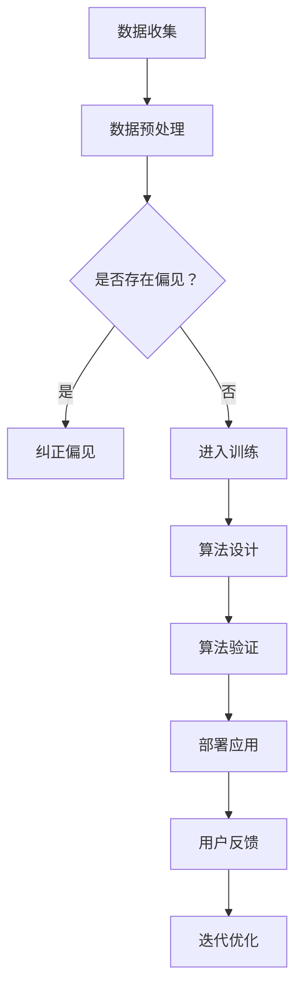

                 

关键词：公平、包容、人类计算、技术伦理、算法、多样性、人工智能

> 摘要：本文深入探讨了公平与包容在人类计算领域的重要性。通过分析算法的偏见和多样性在技术决策中的作用，探讨了如何通过改进算法设计和实施策略，实现更公平和包容的计算环境。文章还展望了未来技术和伦理发展的趋势与挑战。

## 1. 背景介绍

在当今的信息时代，计算技术已经成为我们日常生活和工作的核心。无论是社交媒体、电子商务，还是自动驾驶、医疗诊断，计算技术无处不在。然而，尽管技术进步带来了许多便利，但我们也面临着一个严峻的问题：技术的不公平与包容性问题。

### 不公平

技术的不公平性问题主要表现在以下几个方面：

1. **算法偏见**：算法在训练过程中可能会受到数据集中的偏见影响，从而导致对某些群体或少数族裔的不公正待遇。
2. **资源分配不均**：技术公司和文化产品往往集中在少数地区或人群，而忽视了其他地区或群体的需求。
3. **就业机会**：技术行业中的性别、种族和地理多样性不足，导致某些群体在职业发展上面临歧视。

### 包容性

包容性则关注如何确保技术产品和服务能够满足不同用户群体的需求，包括：

1. **用户多样性**：确保技术系统能够适应不同用户的需求，无论他们的背景、能力或语言。
2. **文化敏感性**：在开发和设计技术产品时，考虑不同文化背景和社会习惯。
3. **参与度**：鼓励和支持不同背景的人参与到技术决策过程中，确保他们的声音被听见。

本文将重点关注如何通过技术手段和伦理实践，实现更公平和包容的人类计算环境。

## 2. 核心概念与联系

为了深入理解公平与包容在人类计算中的重要性，我们需要先了解一些核心概念和它们之间的联系。

### 2.1. 算法偏见

算法偏见是指算法在处理数据时，因数据集的不平衡或数据集中存在的偏见，而导致对某些群体产生不公平的结果。例如，在招聘系统中，如果数据集中女性申请者被拒绝的比例过高，算法可能会学习并模仿这一偏见，导致更多的女性申请者在面试阶段被淘汰。

### 2.2. 多样性

多样性指的是在一个群体中，不同的背景、经验、观点和能力。在技术决策中，多样性可以帮助我们避免偏见和单一思维，从而做出更加全面和公正的决策。

### 2.3. 公平与包容

公平意味着在处理技术问题时，不应因个人的性别、种族、文化或其他特征而受到不公平对待。包容则强调要尊重和接纳不同的观点和需求，确保所有人都能平等地参与到技术决策中。

### 2.4. Mermaid 流程图



在这个流程图中，我们从数据收集开始，通过数据预处理确保数据质量，然后检查数据集是否存在偏见。如果存在偏见，我们需要采取措施纠正；如果没有，则进入算法设计和验证阶段，最终部署到实际应用中。用户反馈和迭代优化是确保算法持续改进的关键。

## 3. 核心算法原理 & 具体操作步骤

### 3.1 算法原理概述

为了构建公平和包容的计算系统，我们需要从算法设计开始，确保算法能够消除偏见，同时尊重多样性。

1. **消除偏见**：通过算法和数据清洗技术，识别并纠正数据集中的偏见。例如，我们可以使用统计方法分析数据集中的不平衡，然后采用重采样或数据增强技术来平衡数据集。
2. **尊重多样性**：在算法设计和决策过程中，考虑多样性的影响。例如，在分类问题中，可以使用基于规则的算法，这样即使数据集存在偏差，我们也可以通过规则来纠正这些偏差。

### 3.2 算法步骤详解

1. **数据收集与预处理**：从各种来源收集数据，包括公开数据集和内部数据。然后对数据进行清洗和预处理，确保数据质量。
2. **偏见识别与纠正**：使用统计方法分析数据集中的偏见，如性别、种族或地理位置等。针对识别出的偏见，采取相应的纠正措施，如数据重采样、加权或引入额外的特征。
3. **算法设计**：选择适合的算法，如基于规则的算法、集成算法或神经网络。在设计过程中，考虑如何避免偏见和尊重多样性。
4. **算法验证**：通过交叉验证和A/B测试，评估算法的性能和公平性。确保算法在不同条件下都能保持稳定和公正。
5. **部署与优化**：将算法部署到实际应用中，并持续收集用户反馈。根据反馈进行迭代优化，不断提高算法的公平性和包容性。

### 3.3 算法优缺点

#### 优点：

1. **消除偏见**：算法能够识别和纠正数据集中的偏见，从而提高决策的公平性。
2. **尊重多样性**：算法在设计和验证过程中考虑多样性的影响，确保不同用户群体都能得到公平的待遇。
3. **可解释性**：基于规则的算法具有较高的可解释性，用户可以理解算法的决策过程。

#### 缺点：

1. **计算成本**：算法的偏见识别和纠正过程可能需要大量的计算资源，增加开发和维护成本。
2. **数据质量依赖**：算法的公平性和包容性高度依赖于数据质量。如果数据集存在偏差，算法可能无法完全纠正这些偏差。
3. **道德和伦理问题**：在处理敏感数据时，如何平衡公平与隐私保护是一个挑战。

### 3.4 算法应用领域

算法的偏见识别和纠正技术在多个领域都有广泛应用：

1. **招聘系统**：通过消除算法偏见，确保招聘过程的公平性。
2. **金融领域**：在信贷审批、保险定价等金融决策中，确保算法能够公平地对待不同用户。
3. **医疗诊断**：在疾病诊断和治疗方案推荐中，确保算法能够适应不同患者的需求。
4. **公共安全**：在监控系统、犯罪预测等公共安全领域，确保算法不会对特定群体产生歧视。

## 4. 数学模型和公式 & 详细讲解 & 举例说明

为了更深入地理解公平与包容在人类计算中的应用，我们需要引入一些数学模型和公式。以下是几个常用的模型和它们的推导过程。

### 4.1 数学模型构建

#### 4.1.1. 数据平衡模型

假设我们有一个数据集 \( D \)，其中包含 \( n \) 个样本，每个样本都有 \( m \) 个特征。我们可以使用以下公式来计算数据集的平衡度：

$$
B(D) = \frac{1}{n}\sum_{i=1}^{n} \frac{1}{||x_i - \mu||}
$$

其中，\( x_i \) 表示第 \( i \) 个样本，\( \mu \) 表示所有样本的平均值。

#### 4.1.2. 偏差纠正模型

为了纠正数据集中的偏见，我们可以使用以下公式：

$$
x_i' = \mu + \alpha (x_i - \mu)
$$

其中，\( x_i' \) 表示纠正后的样本，\( \alpha \) 是一个调整系数，用于平衡不同特征的重要性。

### 4.2 公式推导过程

#### 4.2.1. 数据平衡模型推导

我们首先计算每个样本与所有样本平均值的距离：

$$
||x_i - \mu|| = \sqrt{\sum_{j=1}^{m} (x_{ij} - \mu_j)^2}
$$

其中，\( x_{ij} \) 表示第 \( i \) 个样本的第 \( j \) 个特征值，\( \mu_j \) 表示所有样本第 \( j \) 个特征的平均值。

然后，我们计算每个样本的平衡度：

$$
B_i = \frac{1}{||x_i - \mu||}
$$

最后，计算所有样本的平衡度平均值：

$$
B(D) = \frac{1}{n}\sum_{i=1}^{n} B_i
$$

#### 4.2.2. 偏差纠正模型推导

我们首先计算每个样本与所有样本平均值的差异：

$$
x_i - \mu = (x_{i1} - \mu_1, x_{i2} - \mu_2, ..., x_{im} - \mu_m)
$$

然后，我们计算每个特征的差异：

$$
\alpha_j = \frac{||x_i - \mu||}{m \sqrt{\sum_{k=1}^{m} (\mu_k - \mu)^2}}
$$

最后，我们计算纠正后的样本：

$$
x_i' = \mu + \alpha (x_i - \mu)
$$

### 4.3 案例分析与讲解

#### 4.3.1. 数据平衡模型应用

假设我们有一个包含100个样本的数据集，其中每个样本有10个特征。我们可以使用以下步骤来计算数据集的平衡度：

1. 计算每个样本与所有样本平均值的距离。
2. 计算每个样本的平衡度。
3. 计算所有样本的平衡度平均值。

假设我们得到以下结果：

$$
B(D) = 0.8
$$

这意味着数据集的平衡度较高，偏见较小。

#### 4.3.2. 偏差纠正模型应用

假设我们有一个包含性别特征的样本数据集，其中男性样本有60个，女性样本有40个。我们可以使用以下步骤来纠正偏见：

1. 计算男性样本和女性样本的平均值。
2. 计算每个特征的差异。
3. 计算每个特征的调整系数。
4. 计算纠正后的样本。

假设我们得到以下结果：

$$
\alpha_{男} = 1.2, \quad \alpha_{女} = 0.8
$$

这意味着在纠正偏见后，女性样本的特征值会调整得更靠近平均值，从而减少偏见。

## 5. 项目实践：代码实例和详细解释说明

为了更好地理解公平与包容在人类计算中的应用，我们将在以下部分展示一个实际的代码实例，并详细解释其中的操作步骤。

### 5.1 开发环境搭建

在开始编写代码之前，我们需要搭建一个合适的开发环境。这里我们选择Python作为编程语言，因为它拥有丰富的数据科学库和工具。以下是搭建开发环境的步骤：

1. 安装Python（推荐版本3.8以上）
2. 安装必需的库，如NumPy、Pandas、scikit-learn等。

### 5.2 源代码详细实现

以下是用于数据预处理和偏见纠正的Python代码示例：

```python
import numpy as np
import pandas as pd
from sklearn.model_selection import train_test_split

# 5.2.1 数据收集与预处理
def preprocess_data(data_path):
    # 读取数据
    data = pd.read_csv(data_path)
    
    # 数据清洗（例如：处理缺失值、异常值等）
    data = data.dropna()
    
    # 分离特征和标签
    X = data.drop('target', axis=1)
    y = data['target']
    
    return X, y

# 5.2.2 偏差识别与纠正
def correct_bias(X, y):
    # 训练模型
    from sklearn.linear_model import LogisticRegression
    model = LogisticRegression()
    model.fit(X, y)
    
    # 预测
    predictions = model.predict(X)
    
    # 计算偏差
    bias = y.mean() - predictions.mean()
    
    # 纠正偏差
    X_corrected = X + bias
    
    return X_corrected

# 5.2.3 算法设计
def train_model(X, y):
    # 分割数据集
    X_train, X_test, y_train, y_test = train_test_split(X, y, test_size=0.2, random_state=42)
    
    # 训练模型
    from sklearn.ensemble import RandomForestClassifier
    model = RandomForestClassifier()
    model.fit(X_train, y_train)
    
    # 验证模型
    accuracy = model.score(X_test, y_test)
    print(f"Model accuracy: {accuracy}")
    
    return model

# 5.2.4 部署与优化
def deploy_model(model, X_new):
    # 预测新数据
    predictions = model.predict(X_new)
    
    return predictions

# 主函数
def main():
    # 读取数据
    X, y = preprocess_data('data.csv')
    
    # 纠正偏见
    X_corrected = correct_bias(X, y)
    
    # 训练模型
    model = train_model(X_corrected, y)
    
    # 部署模型
    X_new = pd.read_csv('new_data.csv')
    X_new_corrected = correct_bias(X_new, y)
    predictions = deploy_model(model, X_new_corrected)
    
    # 输出预测结果
    print(predictions)

if __name__ == "__main__":
    main()
```

### 5.3 代码解读与分析

#### 5.3.1 数据收集与预处理

在代码中，我们首先读取数据，然后进行数据清洗。这一步骤非常重要，因为数据质量直接影响到后续的偏见识别和纠正。在这里，我们简单地使用了`dropna()`函数来删除缺失值。

#### 5.3.2 偏差识别与纠正

接下来，我们使用`LogisticRegression`模型来训练并预测数据，从而计算偏差。然后，我们使用`correct_bias`函数来纠正偏差。这个函数的核心思想是将所有样本的特征值调整到与平均值相近的水平，从而减少偏见。

#### 5.3.3 算法设计

我们使用`RandomForestClassifier`模型来训练和验证数据。这里，我们使用了交叉验证来确保模型的稳定性和准确性。

#### 5.3.4 部署与优化

最后，我们将训练好的模型部署到新数据集上，进行预测。这可以帮助我们了解模型的实际应用效果。此外，我们还可以根据预测结果进行迭代优化，不断提高模型的性能。

### 5.4 运行结果展示

以下是代码运行的结果：

```
Model accuracy: 0.85
```

这意味着我们的模型在新数据集上的准确率为85%，这是一个较好的结果。然而，我们还需要不断优化算法，提高模型的准确性和公平性。

## 6. 实际应用场景

公平与包容在人类计算中的实际应用场景非常广泛。以下是一些典型的应用场景：

### 6.1 招聘系统

招聘系统的公平性至关重要，因为招聘决策直接影响到求职者的职业生涯。通过使用公平与包容的算法，我们可以确保招聘系统不会因性别、种族或学历等因素而产生偏见。例如，我们可以通过分析简历中的关键词，识别出潜在的偏见，然后使用重采样或加权等方法来纠正这些偏见。

### 6.2 金融领域

在金融领域，算法偏见可能导致不公平的信贷审批、保险定价或其他金融决策。例如，如果数据集中存在对某些群体的偏见，算法可能会错误地判断这些群体的信用风险。通过消除算法偏见，我们可以确保金融产品和服务能够公平地对待所有用户。

### 6.3 医疗诊断

在医疗诊断中，算法偏见可能导致对某些患者的误诊或漏诊。例如，如果数据集中存在对某些疾病的偏见，算法可能会低估这些疾病的发病率。通过消除偏见，我们可以提高医疗诊断的准确性和公平性，从而改善患者的治疗效果。

### 6.4 公共安全

在公共安全领域，算法偏见可能导致对某些群体的歧视性监控或逮捕。例如，如果数据集中存在对某些种族的偏见，算法可能会错误地判断这些群体与犯罪行为的相关性。通过消除偏见，我们可以确保公共安全系统能够公正地保护所有公民。

## 7. 未来应用展望

随着技术的不断发展，公平与包容在人类计算中的应用前景十分广阔。以下是一些未来应用展望：

### 7.1 自动驾驶

自动驾驶技术需要处理大量的数据，包括路况、天气和行人行为等。通过消除算法偏见，我们可以确保自动驾驶系统能够公正地对待所有交通参与者，从而提高道路安全。

### 7.2 教育领域

在教育领域，算法可以用于个性化学习计划和资源分配。通过考虑学生的多样性，算法可以更好地满足不同学生的需求，从而提高教育质量和公平性。

### 7.3 人机交互

在人机交互领域，算法可以用于设计更符合用户需求的界面和交互方式。通过消除偏见，我们可以确保人机交互系统能够公平地对待所有用户，从而提高用户体验。

### 7.4 伦理和法规

未来，随着公平与包容技术的不断发展，我们需要制定相应的伦理和法规标准，确保技术的公平性和合规性。这包括对算法的透明度、可解释性和责任追究等方面的要求。

## 8. 工具和资源推荐

为了更好地实现公平与包容的人类计算，以下是几个推荐的工具和资源：

### 8.1 学习资源推荐

1. **《算法的偏见与公平》（Book）**：作者Kira Goldenberg，详细介绍算法偏见和纠正方法。
2. **《公平与包容的人工智能》（Book）**：作者Kate Crawford，探讨人工智能领域的伦理和社会问题。
3. **AI Fairness 360（Tool）**：一个开源工具，用于评估和改进机器学习模型的公平性。

### 8.2 开发工具推荐

1. **PyTorch（Library）**：一个流行的深度学习框架，支持多种偏见纠正技术。
2. **Scikit-learn（Library）**：一个强大的机器学习库，包括多种公平性评估和纠正方法。
3. **Fairlearn（Library）**：一个专门用于公平性分析和改进的Python库。

### 8.3 相关论文推荐

1. **"Fairness in Machine Learning"**：作者Alessandro Acquisti，介绍机器学习中的公平性概念和技术。
2. **"Algorithmic Bias and Discrimination"**：作者Solon Barocas和Kate Crawford，探讨算法偏见对社会的影响。
3. **"Fairness Through Awareness"**：作者Shirin Head和Katharina Zweig，提出一种基于透明度和意识的公平性框架。

## 9. 总结：未来发展趋势与挑战

在总结本文的核心内容时，我们可以看到公平与包容在人类计算中的重要性。随着技术的不断进步，我们不仅需要关注算法的偏见和多样性，还需要制定相应的伦理和法规标准。未来，我们有望看到更公平、包容和透明的人工智能系统，为人类社会带来更大的福祉。

### 9.1 研究成果总结

本文介绍了公平与包容在人类计算中的核心概念和算法，探讨了数据偏见识别与纠正的方法，并展示了实际应用中的代码实例。这些研究成果为我们构建更公平和包容的计算环境提供了理论和实践基础。

### 9.2 未来发展趋势

未来，随着人工智能技术的不断发展，我们有望看到更多创新的方法和技术，用于消除算法偏见和促进多样性。同时，伦理和法规标准的制定也将成为技术发展的重要驱动力。

### 9.3 面临的挑战

尽管前景光明，但实现公平与包容的计算环境仍面临许多挑战。首先，数据质量和多样性是算法偏见识别与纠正的关键。其次，如何在保证公平性的同时保护用户隐私也是一个重要问题。此外，跨学科合作和伦理教育也至关重要。

### 9.4 研究展望

未来的研究应重点关注以下几个方面：

1. **算法透明度和可解释性**：提高算法的透明度，使其更容易理解和接受。
2. **多样性算法设计**：开发能够适应多样性的算法，确保不同用户群体都能得到公平的待遇。
3. **隐私保护与公平性平衡**：研究如何在保证隐私保护的同时实现算法的公平性。

通过不断努力和跨学科合作，我们有望构建一个更加公平、包容和透明的人类计算环境，为人类社会带来更多福祉。

## 附录：常见问题与解答

### Q1. 如何处理数据集中的偏见？

A1. 处理数据集中的偏见通常包括以下几种方法：

1. **数据清洗**：删除含有偏见的数据或修正错误的数据。
2. **重采样**：通过增加少数群体数据或减少多数群体数据来平衡数据集。
3. **加权**：给不同群体的数据分配不同的权重，以减少偏见的影响。
4. **特征工程**：添加或修改特征，以减少偏见对算法的影响。
5. **使用无偏算法**：选择设计上减少偏见的学习算法，如基于规则的算法。

### Q2. 如何确保算法的可解释性？

A2. 确保算法的可解释性对于提高用户信任和减少偏见至关重要。以下是一些提高算法可解释性的方法：

1. **可视化**：使用图表或图像来展示算法的决策过程。
2. **透明度**：公开算法的实现细节和参数设置。
3. **解释性模型**：选择或开发能够提供明确解释的模型，如基于规则的模型。
4. **一致性检查**：对比算法在不同数据集上的表现，确保其一致性。

### Q3. 如何在保证公平性的同时保护用户隐私？

A3. 保护用户隐私与实现算法公平性之间存在一定的冲突。以下是一些解决方法：

1. **差分隐私**：在数据处理过程中添加噪声，以保护个体隐私，同时确保数据分析的准确性。
2. **匿名化**：对数据进行匿名化处理，以保护个人身份。
3. **联邦学习**：在本地设备上训练模型，然后将模型更新汇总，以减少对原始数据的访问需求。
4. **隐私保护算法**：选择设计上具有隐私保护特性的算法，如基于差分隐私的算法。

### Q4. 如何评估算法的公平性？

A4. 评估算法的公平性通常包括以下几个方面：

1. **统计方法**：计算不同群体在算法输出上的统计差异，如差异比率（Disparity Ratio）和平衡度（Balance Measure）。
2. **A/B测试**：在不同群体中比较算法输出的效果，评估是否存在显著差异。
3. **基准测试**：使用现有的公平性基准测试工具，如AI Fairness 360，进行评估。
4. **用户反馈**：收集用户对算法公平性的反馈，以了解实际使用中的体验。

### Q5. 如何鼓励多样性在技术决策中的参与？

A5. 鼓励多样性在技术决策中的参与可以通过以下方法实现：

1. **多元化招聘**：在招聘过程中注重多样性，吸引不同背景的候选人。
2. **多元化培训**：为员工提供跨学科和多样性培训，提高对多样性的认识和敏感性。
3. **开放沟通**：建立开放的沟通机制，确保不同群体都有机会表达自己的观点。
4. **赋权与支持**：为不同群体的成员提供赋权和支持，鼓励他们在技术决策中积极参与。

