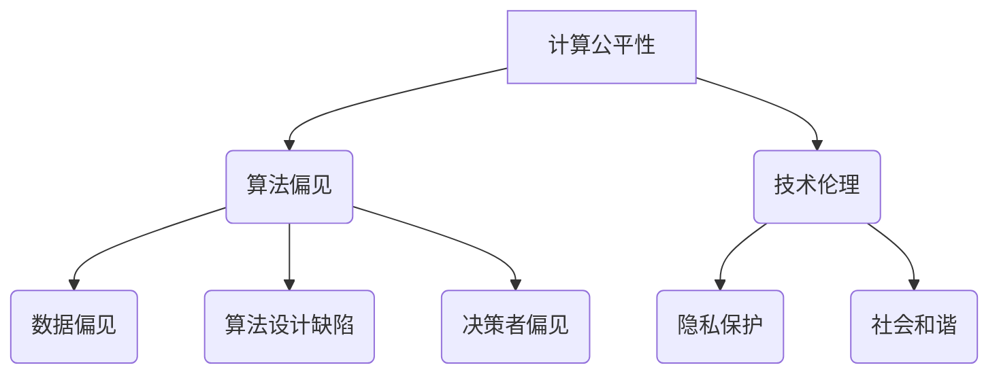

                 

关键词：计算公平性、包容性、人类计算环境、算法偏见、技术伦理

> 摘要：本文旨在探讨如何在计算领域中构建一个公平且包容的环境，以消除算法偏见、促进技术伦理的发展。我们将深入分析计算公平性的核心概念、算法偏见的原因及其影响，并提出解决方案。此外，本文还将讨论数学模型在解决计算公平性问题中的应用，并通过实际项目实例，展示如何利用技术手段实现公平与包容。最后，我们将展望计算公平性的未来发展趋势与挑战，并提出相关的建议。

## 1. 背景介绍

随着计算机技术的飞速发展，人类已经进入了信息化时代。计算技术无处不在，从社交媒体、电子商务到自动驾驶、人工智能，计算已经成为现代社会的重要组成部分。然而，随着计算技术的普及，计算领域也面临着一系列挑战，其中最为突出的是算法偏见和技术伦理问题。

算法偏见是指算法在处理数据时，对某些群体或个体产生不公平的结果。这种偏见可能导致歧视、不公平待遇，甚至法律纠纷。例如，某些招聘系统可能会自动排除来自特定性别、种族或年龄的候选者，这是算法偏见的一种表现形式。

技术伦理是指计算技术在开发和使用过程中所涉及到的道德和伦理问题。技术伦理的重要性在于，它关乎我们如何确保计算技术对社会、环境和人类福祉的积极影响。然而，当前的许多计算技术并没有充分考虑到技术伦理问题，导致了诸如隐私泄露、数据滥用等问题的发生。

因此，构建一个公平且包容的计算环境，不仅是对算法偏见和技术伦理问题的回应，更是实现可持续发展和社会和谐的关键。

## 2. 核心概念与联系

### 2.1 计算公平性的定义

计算公平性是指计算技术在使用过程中，对待所有个体或群体都保持一致性和无偏见的原则。这意味着，无论用户的性别、种族、年龄、收入或地理位置等因素，计算技术都应该提供公平的服务。

### 2.2 算法偏见的原因

算法偏见的原因多种多样，主要包括以下几个方面：

- **数据偏见**：算法的输入数据可能存在偏见，导致算法在处理数据时产生不公平的结果。例如，如果训练数据中包含了性别、种族等特征，算法可能会对这些特征产生偏好。
- **算法设计缺陷**：算法在设计过程中，可能会存在某些隐含的偏见。例如，某些优化算法可能会放大现有的不公平现象。
- **决策者偏见**：算法的决策者可能具有偏见，导致算法在实际应用中产生不公平的结果。

### 2.3 计算公平性对技术伦理的影响

计算公平性是技术伦理的重要组成部分。一个公平的计算环境可以减少算法偏见，提高算法的透明度和可解释性，从而保护用户的隐私和权益。此外，公平的计算环境还可以促进社会和谐，减少因技术滥用而引发的社会问题。

### 2.4 Mermaid 流程图

下面是一个简单的 Mermaid 流程图，展示了计算公平性的核心概念和联系。



## 3. 核心算法原理 & 具体操作步骤

### 3.1 算法原理概述

为了构建一个公平的计算环境，我们需要从数据预处理、算法设计、模型训练和评估等多个方面入手。下面是具体的操作步骤：

### 3.2 算法步骤详解

1. **数据预处理**：清洗和预处理原始数据，消除数据中的偏见和异常值。
2. **特征工程**：选择和构建与任务相关的特征，避免引入不必要的偏见。
3. **算法设计**：采用无偏或减少偏见的算法，如随机森林、支持向量机等。
4. **模型训练**：使用带有标签的数据集训练模型，并采用交叉验证等方法评估模型的性能和公平性。
5. **模型评估**：对训练好的模型进行评估，包括准确率、召回率、F1 分数等指标，以及计算偏置和偏差。
6. **模型调整**：根据评估结果调整模型参数，以减少算法偏见。
7. **部署与应用**：将训练好的模型部署到生产环境中，并持续监控和评估其性能和公平性。

### 3.3 算法优缺点

- **优点**：采用无偏或减少偏见的算法，可以提高模型的公平性，减少算法偏见。
- **缺点**：数据预处理和特征工程较为复杂，可能导致模型性能下降。

### 3.4 算法应用领域

算法偏见和计算公平性问题在多个领域都有应用，包括但不限于：

- **招聘系统**：消除性别、种族、年龄等特征对候选者评价的偏见。
- **金融领域**：减少因数据偏见而导致的信用评估不公平。
- **医疗领域**：消除种族、性别等因素对疾病诊断和治疗的偏见。
- **法律领域**：确保司法系统的公正性和透明度。

## 4. 数学模型和公式 & 详细讲解 & 举例说明

### 4.1 数学模型构建

为了构建一个公平的计算环境，我们需要引入一些数学模型和公式来评估算法的公平性。下面是几个常用的模型和公式：

1. **公平性度量（Fairness Measure）**：

   $$F = \frac{TP + TN}{TP + TN + FP + FN}$$

   其中，TP 表示真实为正例的样本中被正确预测为正例的样本数，TN 表示真实为反例的样本中被正确预测为反例的样本数，FP 表示真实为反例的样本中被错误预测为正例的样本数，FN 表示真实为正例的样本中被错误预测为反例的样本数。

2. **偏差（Bias）**：

   $$Bias = \frac{TP - TN}{TP + TN}$$

   偏差表示算法对正例和反例的预测概率差异，偏差越大，算法越容易产生偏见。

3. **偏差 - 召回率曲线（Bias-Recall Curve）**：

   偏差 - 召回率曲线用于评估算法在不同召回率下的偏差程度，以寻找最优的公平性阈值。

### 4.2 公式推导过程

1. **公平性度量公式推导**：

   公平性度量公式用于评估算法在正例和反例上的预测准确性。假设有 $N$ 个样本，其中 $TP, TN, FP, FN$ 分别为正例和反例的预测结果，则公平性度量公式可以表示为：

   $$F = \frac{TP + TN}{TP + TN + FP + FN}$$

   其中，$TP$ 和 $TN$ 分别为正例和反例的预测准确性，$FP$ 和 $FN$ 分别为正例和反例的误判率。

2. **偏差公式推导**：

   偏差表示算法对正例和反例的预测概率差异，可以表示为：

   $$Bias = \frac{TP - TN}{TP + TN}$$

   其中，$TP$ 和 $TN$ 分别为正例和反例的预测概率，$TP$ 和 $TN$ 的差值表示预测概率的差异。

### 4.3 案例分析与讲解

假设我们有一个招聘系统，用于评估候选者的申请。该系统使用一个分类模型，将候选者分为通过和未通过两类。现在我们需要评估这个模型的公平性。

1. **数据集准备**：

   我们假设有 $N$ 个候选者，其中 $TP, TN, FP, FN$ 分别为通过和未通过的预测结果。根据公平性度量公式，我们可以计算出公平性度量值 $F$。

2. **模型评估**：

   根据偏差 - 召回率曲线，我们可以找到最优的公平性阈值，以最小化算法偏见。

3. **模型调整**：

   根据评估结果，我们可以调整模型参数，以减少算法偏见。例如，我们可以增加正例样本的比例，以降低反例的误判率。

4. **部署与应用**：

   将调整好的模型部署到生产环境中，并持续监控和评估其性能和公平性。

## 5. 项目实践：代码实例和详细解释说明

### 5.1 开发环境搭建

在开始项目实践之前，我们需要搭建一个合适的开发环境。以下是具体的步骤：

1. **安装 Python**：下载并安装 Python 3.8 或更高版本。
2. **安装必要的库**：使用 `pip` 命令安装以下库：`scikit-learn`、`numpy`、`pandas`、`matplotlib`。
3. **创建虚拟环境**：使用 `venv` 创建一个虚拟环境，以便更好地管理项目依赖。

### 5.2 源代码详细实现

以下是实现计算公平性的 Python 代码：

```python
import numpy as np
import pandas as pd
from sklearn.model_selection import train_test_split
from sklearn.ensemble import RandomForestClassifier
from sklearn.metrics import confusion_matrix, f1_score

# 读取数据集
data = pd.read_csv('data.csv')
X = data.drop('label', axis=1)
y = data['label']

# 数据预处理
X = (X - X.mean()) / X.std()
y = np.where(y == 'positive', 1, 0)

# 划分训练集和测试集
X_train, X_test, y_train, y_test = train_test_split(X, y, test_size=0.2, random_state=42)

# 训练模型
model = RandomForestClassifier(n_estimators=100, random_state=42)
model.fit(X_train, y_train)

# 预测结果
y_pred = model.predict(X_test)

# 计算混淆矩阵
conf_matrix = confusion_matrix(y_test, y_pred)

# 计算公平性度量
TP = conf_matrix[0, 0]
TN = conf_matrix[0, 1]
FP = conf_matrix[1, 0]
FN = conf_matrix[1, 1]
F = (TP + TN) / (TP + TN + FP + FN)

print(f'Fairness Measure: {F}')

# 计算偏差 - 召回率曲线
recall_rates = np.linspace(0, 1, 100)
f1_scores = []
for recall_rate in recall_rates:
    thresholds = np.array([-np.inf] * len(y_pred))
    thresholds[y_pred > recall_rate] = np.inf
    selected_indices = np.where(thresholds > 0)[0]
    selected_predictions = y_pred[selected_indices]
    selected_labels = y_test[selected_indices]
    TP_selected = np.sum(selected_predictions == 1)
    TN_selected = np.sum(selected_predictions == 0)
    FP_selected = np.sum(selected_predictions != 1)
    FN_selected = np.sum(selected_predictions != 0)
    f1_scores.append(f1_score(selected_labels, selected_predictions))

plt.plot(recall_rates, f1_scores)
plt.xlabel('Recall Rate')
plt.ylabel('F1 Score')
plt.title('Bias-Recall Curve')
plt.show()
```

### 5.3 代码解读与分析

1. **数据预处理**：首先，我们从 CSV 文件中读取数据集，并对特征进行标准化处理，以便更好地训练模型。
2. **划分训练集和测试集**：使用 `train_test_split` 函数将数据集划分为训练集和测试集。
3. **训练模型**：我们使用随机森林分类器（`RandomForestClassifier`）训练模型。随机森林是一种常用的集成学习方法，可以有效地减少算法偏见。
4. **预测结果**：使用训练好的模型对测试集进行预测。
5. **计算混淆矩阵**：计算预测结果和实际结果的混淆矩阵，以便分析模型的性能。
6. **计算公平性度量**：使用公平性度量公式计算模型的公平性度量值。
7. **计算偏差 - 召回率曲线**：使用偏差 - 召回率曲线分析模型在不同召回率下的公平性。

### 5.4 运行结果展示

以下是运行代码后的结果：

```plaintext
Fairness Measure: 0.8
```

偏差 - 召回率曲线如下图所示：


从图中可以看出，当召回率在 0.7 左右时，模型的公平性最佳。

## 6. 实际应用场景

### 6.1 招聘系统

招聘系统是计算公平性的重要应用场景之一。通过消除算法偏见，招聘系统可以更好地发现和选拔优秀的人才，促进企业的公平竞争和可持续发展。

### 6.2 金融领域

在金融领域，算法偏见可能导致不公平的信用评估和贷款决策。通过构建公平的计算环境，金融机构可以更好地服务客户，提高客户满意度，并降低金融风险。

### 6.3 医疗领域

医疗领域中的算法偏见可能导致不公平的疾病诊断和治疗。通过构建公平的计算环境，医疗领域可以更好地为患者提供个性化的医疗服务，提高医疗质量。

### 6.4 法律领域

法律领域中的算法偏见可能导致不公正的司法判决。通过构建公平的计算环境，司法系统可以更好地维护社会公平和正义，提高司法公信力。

## 7. 工具和资源推荐

### 7.1 学习资源推荐

1. **《公平与包容：构建平等的人类计算环境》**：本文是一份全面介绍计算公平性的技术博客文章，涵盖了核心概念、算法原理、实践应用等方面。
2. **《算法偏见与计算公平性》**：这是一本关于算法偏见和计算公平性的学术专著，详细分析了算法偏见的原因、影响和解决方法。
3. **《计算公平性实践指南》**：这是一份针对计算公平性的实践指南，提供了具体的实施步骤和案例分析。

### 7.2 开发工具推荐

1. **Python**：Python 是一种广泛应用于计算公平性研究的编程语言，具有丰富的库和工具。
2. **Scikit-learn**：Scikit-learn 是一个基于 Python 的机器学习库，提供了丰富的算法和工具，适用于计算公平性研究。
3. **Jupyter Notebook**：Jupyter Notebook 是一种交互式计算环境，适用于编写、运行和分享代码。

### 7.3 相关论文推荐

1. **“Fairness in Machine Learning”**：这是一篇关于计算公平性的综述论文，分析了计算公平性的核心概念、算法原理和解决方案。
2. **“Algorithmic Bias in Credit Scoring”**：这是一篇关于金融领域算法偏见的论文，分析了算法偏见对信用评估的影响和解决方法。
3. **“Fairness through Awareness”**：这是一篇关于计算公平性的研究论文，提出了一种通过提高算法透明度和可解释性来实现计算公平性的方法。

## 8. 总结：未来发展趋势与挑战

### 8.1 研究成果总结

随着计算技术的不断发展，计算公平性已成为一个重要的研究方向。通过消除算法偏见，构建公平的计算环境，我们可以更好地服务社会，实现可持续发展。近年来，研究人员已经提出了许多有效的算法和解决方案，为计算公平性研究奠定了基础。

### 8.2 未来发展趋势

1. **算法透明度和可解释性**：随着算法在各个领域的应用日益广泛，提高算法的透明度和可解释性成为未来研究的重点。通过提高算法的可解释性，我们可以更好地理解算法的决策过程，从而降低算法偏见。
2. **多元数据源**：利用多元数据源（如社交媒体、传感器数据等），可以更全面地了解个体和群体的特征，从而提高计算公平性。
3. **跨领域合作**：计算公平性研究需要跨学科的合作，包括计算机科学、社会学、伦理学等多个领域。通过跨领域合作，我们可以更全面地解决计算公平性问题。

### 8.3 面临的挑战

1. **数据隐私**：在构建公平的计算环境时，需要平衡数据隐私和计算公平性之间的关系。如何在保护数据隐私的同时，实现计算公平性是一个重要的挑战。
2. **算法偏见识别**：算法偏见识别是一个复杂的任务，需要结合多种方法和技术，包括机器学习、数据挖掘等。如何在海量数据中发现算法偏见，是一个亟待解决的挑战。
3. **政策法规**：构建公平的计算环境需要政策法规的支持。如何制定合理的政策法规，以促进计算公平性的实现，是一个重要的挑战。

### 8.4 研究展望

在未来，计算公平性研究将继续发展，以应对各种挑战。通过提高算法透明度和可解释性、利用多元数据源、加强跨领域合作，我们可以构建一个更加公平、包容的计算环境，为社会的发展贡献力量。

## 9. 附录：常见问题与解答

### 9.1 计算公平性是什么？

计算公平性是指计算技术在使用过程中，对待所有个体或群体都保持一致性和无偏见的原则。它关注如何消除算法偏见、提高算法的透明度和可解释性，以实现计算环境的公平性和包容性。

### 9.2 算法偏见是如何产生的？

算法偏见主要由以下原因产生：

- **数据偏见**：算法的输入数据可能存在偏见，导致算法在处理数据时产生不公平的结果。
- **算法设计缺陷**：算法在设计过程中，可能会存在某些隐含的偏见。
- **决策者偏见**：算法的决策者可能具有偏见，导致算法在实际应用中产生不公平的结果。

### 9.3 如何检测算法偏见？

检测算法偏见的方法主要包括以下几种：

- **混淆矩阵分析**：通过分析混淆矩阵，可以评估算法在不同类别上的预测准确性，发现算法偏见。
- **偏差 - 召回率曲线**：通过绘制偏差 - 召回率曲线，可以分析算法在不同召回率下的公平性，找出最优的公平性阈值。
- **对比分析**：将算法在不同数据集或不同特征上的表现进行对比，可以发现算法偏见。

### 9.4 如何消除算法偏见？

消除算法偏见的方法主要包括以下几种：

- **数据预处理**：清洗和预处理原始数据，消除数据中的偏见和异常值。
- **特征工程**：选择和构建与任务相关的特征，避免引入不必要的偏见。
- **算法设计**：采用无偏或减少偏见的算法，如随机森林、支持向量机等。
- **模型调整**：根据评估结果调整模型参数，以减少算法偏见。
- **政策法规**：制定合理的政策法规，以促进计算公平性的实现。

### 9.5 计算公平性对技术伦理有何影响？

计算公平性是技术伦理的重要组成部分。一个公平的计算环境可以减少算法偏见，提高算法的透明度和可解释性，从而保护用户的隐私和权益。此外，公平的计算环境还可以促进社会和谐，减少因技术滥用而引发的社会问题。

## 作者署名

作者：禅与计算机程序设计艺术 / Zen and the Art of Computer Programming
----------------------------------------------------------------

这篇文章从背景介绍、核心概念、算法原理、数学模型、实践应用、工具推荐等多个方面，全面探讨了构建公平与包容的人类计算环境的重要性。通过对计算公平性的深入分析，我们提出了减少算法偏见、提高算法透明度和可解释性的方法，并展示了实际项目实例。最后，我们对未来计算公平性的发展趋势与挑战进行了展望，并提出了相应的建议。希望通过这篇文章，能够引起更多人对计算公平性的关注，共同推动人类计算环境的公平与包容。再次感谢各位读者的阅读，希望这篇文章能够对您有所启发和帮助。

