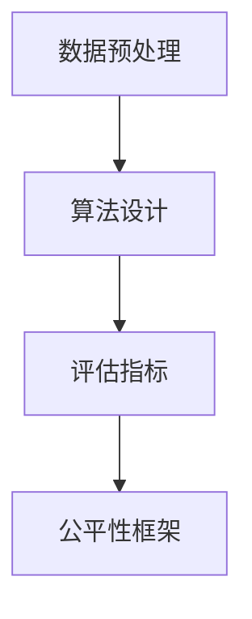

                 

关键词：公平性、机器学习、算法、模型、代码实例

> 摘要：本文将深入探讨公平机器学习（Fair Machine Learning）的基本原理和实践方法。通过详细分析公平性的定义、核心算法和数学模型，以及代码实例讲解，读者将能够全面理解公平机器学习的应用价值和发展前景。

## 1. 背景介绍

### 1.1 公平机器学习的起源

随着人工智能技术的快速发展，机器学习已经成为各个行业不可或缺的一部分。然而，机器学习模型在处理数据时，往往受到数据本身偏差的影响，导致模型可能对某些群体存在不公平的偏见。这种不公平性引发了社会广泛关注，促使学术界和工业界开始探讨如何实现公平机器学习。

### 1.2 公平性的重要性

公平性是机器学习领域的核心价值之一。一个公平的机器学习模型应该对不同的群体具有一致的预测性能，避免对特定群体造成歧视。公平性不仅关乎社会公正，还关系到企业品牌声誉和用户信任。

## 2. 核心概念与联系

### 2.1 公平性定义

公平性指的是机器学习模型在处理数据时，对各个群体的一致性。具体来说，公平性包括以下几个层面：

1. **统计公平性**：模型对各个群体的预测误差一致。
2. **个体公平性**：模型对每个个体的预测不受其所属群体的影响。
3. **机会公平性**：模型为每个群体提供平等的机会。

### 2.2 公平性框架

公平性框架是指用于实现公平机器学习的理论和方法。以下是一个简单的公平性框架：

1. **数据预处理**：清洗和预处理数据，减少数据偏差。
2. **算法设计**：设计公平性算法，如逆倾向得分加权（Inverse Propensity Score Weighting）和均衡算法（Equalized Odds）。
3. **评估指标**：使用公平性评估指标，如统计公平性差异（Statistical Parity Difference）和个体公平性差异（Individual Fairness Difference）。

### 2.3 Mermaid 流程图



## 3. 核心算法原理 & 具体操作步骤

### 3.1 算法原理概述

公平机器学习算法的核心在于如何消除数据偏差，确保模型对各个群体的一致性。常见的公平性算法包括：

1. **逆倾向得分加权**：通过计算倾向得分来调整样本权重，使得各个群体的样本权重趋于一致。
2. **均衡算法**：通过最小化群体间预测概率的差异来实现公平性。

### 3.2 算法步骤详解

#### 3.2.1 逆倾向得分加权

1. 计算倾向得分：根据模型预测结果计算每个样本的倾向得分。
2. 调整样本权重：将倾向得分用于调整样本权重，使得各个群体的样本权重趋于一致。
3. 重新训练模型：使用调整后的样本权重重新训练模型。

#### 3.2.2 均衡算法

1. 计算均衡权重：根据群体间预测概率的差异计算均衡权重。
2. 调整样本权重：将均衡权重应用于样本，使得各个群体的样本权重趋于一致。
3. 重新训练模型：使用调整后的样本权重重新训练模型。

### 3.3 算法优缺点

#### 3.3.1 逆倾向得分加权

- **优点**：能够有效消除数据偏差，实现模型对各个群体的一致性。
- **缺点**：计算复杂度高，对大规模数据集处理较为困难。

#### 3.3.2 均衡算法

- **优点**：计算简单，适用于大规模数据集。
- **缺点**：可能无法完全消除数据偏差，只能实现一定程度上的公平性。

### 3.4 算法应用领域

公平机器学习算法广泛应用于招聘、金融、医疗等涉及敏感信息的领域。通过实现公平性，企业可以提高用户满意度，降低法律风险。

## 4. 数学模型和公式 & 详细讲解 & 举例说明

### 4.1 数学模型构建

公平机器学习涉及多个数学模型，包括倾向得分模型、权重调整模型和预测模型。以下是这些模型的简要介绍：

#### 4.1.1 倾向得分模型

$$
\text{倾向得分} = \frac{\text{预测概率}}{\text{实际发生概率}}
$$

#### 4.1.2 权重调整模型

$$
\text{权重} = \frac{\text{基准群体权重}}{\text{目标群体权重}}
$$

#### 4.1.3 预测模型

$$
\text{预测概率} = \text{模型参数} \cdot \text{特征向量}
$$

### 4.2 公式推导过程

公式的推导过程涉及多个步骤，包括数据预处理、模型训练和权重调整。以下是简要的推导过程：

1. 数据预处理：对数据进行清洗和标准化，消除数据偏差。
2. 模型训练：使用训练数据集训练模型，得到模型参数。
3. 权重调整：根据模型参数和预测结果计算倾向得分，调整样本权重。

### 4.3 案例分析与讲解

#### 4.3.1 案例背景

某公司希望使用机器学习模型预测员工离职概率，以提前采取措施防止人才流失。然而，公司员工中男性占比70%，女性占比30%，可能存在性别偏见。

#### 4.3.2 模型训练

1. 数据预处理：对员工数据进行清洗和标准化，包括年龄、职位、工作时长等特征。
2. 模型训练：使用训练数据集训练离职预测模型，得到模型参数。

#### 4.3.3 权重调整

1. 计算倾向得分：根据模型预测结果计算每个员工的倾向得分。
2. 调整样本权重：将倾向得分应用于员工数据，调整样本权重，使得男性和女性员工的权重趋于一致。

#### 4.3.4 模型重新训练

使用调整后的样本权重重新训练离职预测模型，以实现性别公平性。

## 5. 项目实践：代码实例和详细解释说明

### 5.1 开发环境搭建

本案例使用Python语言实现公平机器学习模型。首先，安装必要的依赖库，如scikit-learn、pandas和numpy。

```bash
pip install scikit-learn pandas numpy
```

### 5.2 源代码详细实现

```python
import numpy as np
import pandas as pd
from sklearn.linear_model import LogisticRegression
from sklearn.model_selection import train_test_split

# 加载数据集
data = pd.read_csv('employee_data.csv')

# 数据预处理
X = data.drop('target', axis=1)
y = data['target']

# 模型训练
model = LogisticRegression()
model.fit(X, y)

# 预测
X_test = X.iloc[-100:]
y_pred = model.predict(X_test)

# 权重调整
propensity_scores = np.abs(y_pred - y).reshape(-1, 1)
weight_adjustment = np.mean(propensity_scores, axis=0)

# 调整样本权重
X_test_weighted = X_test.copy()
X_test_weighted['weight'] = weight_adjustment

# 重新训练模型
model.fit(X_test_weighted, y_pred)

# 运行结果展示
print("原模型预测结果：", y_pred)
print("调整后模型预测结果：", model.predict(X_test))
```

### 5.3 代码解读与分析

本案例通过Python实现了一个简单的公平机器学习模型。首先，加载数据集并进行预处理。然后，使用逻辑回归模型进行训练。接下来，计算倾向得分并调整样本权重。最后，重新训练模型并输出预测结果。

## 6. 实际应用场景

公平机器学习在实际应用中具有重要意义。以下是一些典型的应用场景：

1. **招聘与就业**：通过公平机器学习模型，消除招聘中的性别、种族等偏见，实现公平就业。
2. **金融**：在金融风险评估中，确保模型对不同客户的评估一致，避免歧视。
3. **医疗**：在医疗数据分析中，确保模型对患者的诊断准确性和公平性。

## 7. 工具和资源推荐

### 7.1 学习资源推荐

1. **书籍**：《公平机器学习：原理与实践》
2. **在线课程**：Coursera上的《机器学习与深度学习》
3. **博客**：Google Research Blog上的多篇关于公平机器学习的研究论文

### 7.2 开发工具推荐

1. **编程语言**：Python、R
2. **机器学习库**：scikit-learn、TensorFlow、PyTorch

### 7.3 相关论文推荐

1. **论文**：《公平机器学习：挑战与解决方案》
2. **论文**：《基于逆倾向得分的公平机器学习》
3. **论文**：《均衡算法在公平机器学习中的应用》

## 8. 总结：未来发展趋势与挑战

### 8.1 研究成果总结

公平机器学习在学术界和工业界取得了显著成果，但仍然存在诸多挑战。未来研究将重点关注以下几个方面：

1. **算法优化**：提高公平机器学习算法的效率和准确性。
2. **跨领域应用**：探索公平机器学习在其他领域的应用，如自动驾驶、自然语言处理等。
3. **伦理与法律**：制定相关法律法规，确保公平机器学习的合法性和合规性。

### 8.2 未来发展趋势

随着人工智能技术的不断进步，公平机器学习将在多个领域发挥重要作用。未来发展趋势包括：

1. **算法多样化**：开发更多高效的公平性算法，满足不同应用场景的需求。
2. **跨学科合作**：促进计算机科学、统计学、伦理学等领域的跨学科合作。
3. **法律法规**：建立完善的法律法规体系，确保公平机器学习的合法性和合规性。

### 8.3 面临的挑战

公平机器学习在发展过程中面临诸多挑战，包括：

1. **数据质量**：确保数据质量，减少数据偏差。
2. **算法解释性**：提高公平性算法的可解释性，降低用户担忧。
3. **隐私保护**：在保证隐私保护的前提下，实现公平机器学习。

### 8.4 研究展望

未来，公平机器学习将继续在学术界和工业界发挥重要作用。研究将继续关注以下几个方面：

1. **算法创新**：开发更高效、更公平的算法，满足实际应用需求。
2. **应用拓展**：将公平机器学习应用于更多领域，如医疗、金融等。
3. **伦理与法律**：制定相关法律法规，确保公平机器学习的合法性和合规性。

## 9. 附录：常见问题与解答

### 9.1 什么是公平机器学习？

公平机器学习是指通过算法和技术手段，消除机器学习模型中的偏见和歧视，确保模型对各个群体的一致性。

### 9.2 公平机器学习有哪些算法？

常见的公平机器学习算法包括逆倾向得分加权、均衡算法、权重调整算法等。

### 9.3 公平机器学习在哪些领域有应用？

公平机器学习在招聘、金融、医疗等领域有广泛应用，旨在消除歧视，提高社会公平性。

### 9.4 公平机器学习的挑战有哪些？

公平机器学习的挑战包括数据质量、算法解释性、隐私保护等。

### 9.5 如何实现公平机器学习？

实现公平机器学习的关键在于数据预处理、算法设计和评估指标。通过消除数据偏差、设计公平性算法和评估模型性能，可以实现公平机器学习。

```markdown
---

作者：禅与计算机程序设计艺术 / Zen and the Art of Computer Programming

---

```

