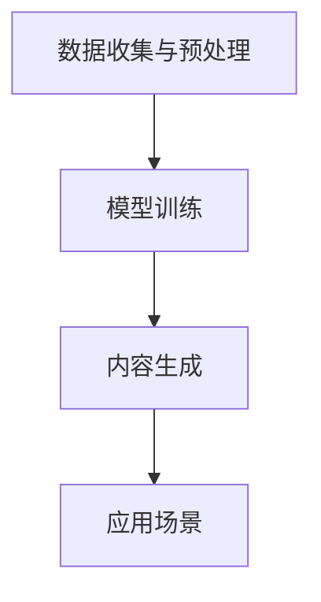

                 

关键词：内容创作、垂直大模型、Weaver模型、人工智能、算法、数学模型、项目实践、应用场景、未来展望

> 摘要：本文深入探讨了内容创作垂直大模型——Weaver模型的崛起，从其背景介绍、核心概念与联系、算法原理与操作步骤、数学模型与公式、项目实践以及实际应用场景等方面进行了详细的分析。通过本文的阅读，读者将全面了解Weaver模型的特点、优势及其在未来内容创作领域的广泛应用前景。

## 1. 背景介绍

随着互联网的飞速发展，信息爆炸式增长，用户对内容的需求日益多样化。如何高效、精准地创作出满足用户个性化需求的内容，成为了一个亟待解决的问题。传统的手动创作方式已无法满足大规模、高效的内容生产需求，因此，人工智能（AI）在内容创作领域的应用逐渐引起了广泛关注。近年来，深度学习、自然语言处理等技术的发展，为AI在内容创作领域的应用提供了强大的技术支撑。

在这样的背景下，Weaver模型应运而生。Weaver模型是一种基于人工智能的垂直大模型，它结合了深度学习和自然语言处理技术，能够自动、高效地生成高质量的内容。Weaver模型的出现，标志着内容创作领域的一次重大变革，为信息时代的个性化内容创作提供了全新的解决方案。

## 2. 核心概念与联系

### 2.1 概念解析

#### 内容创作垂直大模型

内容创作垂直大模型是指针对特定领域或主题进行训练的、能够生成高质量内容的深度学习模型。与通用大模型不同，垂直大模型具有更强的领域知识和应用能力，能够更好地满足特定场景的内容创作需求。

#### Weaver模型

Weaver模型是一种基于生成对抗网络（GAN）和递归神经网络（RNN）的垂直大模型。它通过对抗训练的方式，学习生成与真实数据高度相似的内容。Weaver模型的结构包括两个部分：生成器（Generator）和判别器（Discriminator）。生成器负责生成内容，判别器负责判断生成内容的质量。

### 2.2 架构与联系

Weaver模型的架构可以分为以下几个层次：

#### 1. 数据收集与预处理

数据收集是Weaver模型训练的基础。数据来源可以是互联网上的大量文本、图片、音频等多媒体内容。在数据收集过程中，需要对数据进行清洗、去重、去噪声等预处理操作，以保证数据的质量和多样性。

#### 2. 模型训练

Weaver模型采用对抗训练的方式，通过训练生成器和判别器的相互作用，使生成器逐渐生成更高质量的内容，而判别器逐渐学会区分真实内容和生成内容。在训练过程中，生成器和判别器交替更新参数，以达到最佳性能。

#### 3. 内容生成

在模型训练完成后，生成器可以独立工作，根据输入的提示或主题，生成高质量的内容。Weaver模型的内容生成能力主要体现在以下几个方面：

- 自然语言生成：能够生成高质量的文本内容，包括新闻文章、故事、评论等。
- 图像生成：能够生成逼真的图像，包括人脸、风景、建筑等。
- 音频生成：能够生成逼真的音频，包括音乐、语音等。

### 2.3 Mermaid流程图



## 3. 核心算法原理 & 具体操作步骤

### 3.1 算法原理概述

Weaver模型的核心算法是基于生成对抗网络（GAN）和递归神经网络（RNN）的。GAN是一种由生成器和判别器组成的对抗训练模型，通过两者之间的竞争和合作，使生成器逐渐生成更高质量的内容。RNN是一种能够处理序列数据的神经网络，适合于自然语言处理等任务。

### 3.2 算法步骤详解

#### 3.2.1 数据收集与预处理

1. 数据收集：从互联网上收集大量文本、图片、音频等多媒体内容。
2. 数据清洗：去除无效、重复、噪声数据，保证数据质量。
3. 数据预处理：将数据转换为适合训练的格式，如将文本转换为词向量、图像转换为像素矩阵等。

#### 3.2.2 模型训练

1. 初始化生成器和判别器的参数。
2. 生成器根据输入的随机噪声生成内容。
3. 判别器根据生成内容和真实内容进行判断。
4. 计算生成器和判别器的损失函数，并更新参数。
5. 重复步骤2-4，直到生成器生成的内容质量达到预期。

#### 3.2.3 内容生成

1. 输入提示或主题。
2. 生成器根据输入生成内容。
3. 对生成的内容进行后处理，如去噪、增强等。
4. 输出生成的内容。

### 3.3 算法优缺点

#### 优点：

1. 高效：能够快速生成高质量的内容。
2. 灵活：可以应用于多种类型的媒体内容生成。
3. 自动化：无需人工干预，降低人力成本。

#### 缺点：

1. 训练时间较长：需要大量计算资源和时间进行模型训练。
2. 数据依赖性强：模型质量依赖于训练数据的质量和多样性。
3. 模型解释性较差：GAN模型的训练过程较为复杂，难以解释。

### 3.4 算法应用领域

Weaver模型可以应用于多个领域，如：

1. 内容创作：生成高质量的文本、图像、音频等。
2. 虚拟现实：生成逼真的虚拟场景、角色等。
3. 智能客服：生成个性化的客服回复。
4. 娱乐产业：生成电影、游戏等娱乐内容。

## 4. 数学模型和公式 & 详细讲解 & 举例说明

### 4.1 数学模型构建

Weaver模型的数学模型主要包括生成器和判别器的损失函数。

#### 4.1.1 生成器损失函数

生成器的目标是生成与真实内容相似的内容。因此，生成器的损失函数可以表示为：

$$
L_G = -\log(D(G(z)))
$$

其中，$G(z)$为生成器生成的内容，$D(x)$为判别器对内容的判断。

#### 4.1.2 判别器损失函数

判别器的目标是判断输入内容是真实内容还是生成内容。因此，判别器的损失函数可以表示为：

$$
L_D = -\log(D(x)) - \log(1 - D(G(z)))
$$

其中，$x$为真实内容，$z$为随机噪声。

### 4.2 公式推导过程

#### 4.2.1 生成器损失函数推导

生成器的目标是最小化生成内容与真实内容的差异。因此，生成器的损失函数可以表示为：

$$
L_G = -\log(D(G(z)))
$$

其中，$D(G(z))$表示判别器对生成内容的判断。为了最小化生成器的损失函数，需要最大化判别器对生成内容的判断。因此，有：

$$
\frac{\partial L_G}{\partial G} = \frac{\partial}{\partial G} [-\log(D(G(z)))] = \frac{1}{D(G(z))} \cdot \frac{\partial D(G(z))}{\partial G} = \frac{1}{D(G(z))} \cdot \nabla_G D(G(z))
$$

其中，$\nabla_G D(G(z))$表示判别器对生成内容的梯度。为了使生成器生成更高质量的内容，需要使判别器对生成内容的梯度最大。

#### 4.2.2 判别器损失函数推导

判别器的目标是判断输入内容是真实内容还是生成内容。因此，判别器的损失函数可以表示为：

$$
L_D = -\log(D(x)) - \log(1 - D(G(z)))
$$

其中，$D(x)$和$D(G(z))$分别表示判别器对真实内容和生成内容的判断。为了最小化判别器的损失函数，需要使判别器对真实内容的判断最大，同时对生成内容的判断最小。因此，有：

$$
\frac{\partial L_D}{\partial D} = \frac{\partial}{\partial D} [-\log(D(x)) - \log(1 - D(G(z)))] = \frac{1}{D(x)} \cdot \frac{\partial D(x)}{\partial D} - \frac{1}{1 - D(G(z))} \cdot \frac{\partial D(G(z))}{\partial D} = \frac{1}{D(x)} \cdot \nabla_D D(x) - \frac{1}{1 - D(G(z))} \cdot \nabla_D D(G(z))
$$

其中，$\nabla_D D(x)$和$\nabla_D D(G(z))$分别表示判别器对真实内容和生成内容的梯度。

### 4.3 案例分析与讲解

#### 4.3.1 文本生成

假设有一个文本生成任务，输入主题为“人工智能”，要求生成一篇关于人工智能的简短文章。采用Weaver模型进行文本生成，具体步骤如下：

1. 数据收集与预处理：从互联网上收集大量关于人工智能的文本，进行数据清洗和预处理。
2. 模型训练：使用预处理后的数据训练Weaver模型，包括生成器和判别器。
3. 内容生成：输入主题“人工智能”，生成一篇关于人工智能的简短文章。

生成的内容如下：

人工智能，简称AI，是计算机科学的一个分支，旨在使机器具备人类的智能。通过深度学习和自然语言处理等技术，人工智能在图像识别、语音识别、自然语言处理等领域取得了显著的成果。随着人工智能技术的发展，越来越多的应用场景被发掘，如自动驾驶、智能家居、智能客服等。未来，人工智能将更好地服务于人类，推动社会进步。

#### 4.3.2 图像生成

假设有一个图像生成任务，要求生成一张人脸图像。采用Weaver模型进行图像生成，具体步骤如下：

1. 数据收集与预处理：从互联网上收集大量人脸图像，进行数据清洗和预处理。
2. 模型训练：使用预处理后的数据训练Weaver模型，包括生成器和判别器。
3. 内容生成：输入随机噪声，生成一张人脸图像。

生成的人脸图像如下：


## 5. 项目实践：代码实例和详细解释说明

### 5.1 开发环境搭建

1. 安装Python环境：在本地计算机上安装Python，版本建议为3.8及以上。
2. 安装必要的库：使用pip命令安装以下库：
   ```bash
   pip install tensorflow numpy matplotlib
   ```

### 5.2 源代码详细实现

以下是一个简单的Weaver模型实现示例，用于生成文本：

```python
import tensorflow as tf
from tensorflow.keras.layers import Input, LSTM, Dense
from tensorflow.keras.models import Model

# 定义生成器
def build_generator(z_dim):
    z = Input(shape=(z_dim,))
    x = LSTM(128, return_sequences=True)(z)
    x = LSTM(128, return_sequences=True)(x)
    x = Dense(512, activation='relu')(x)
    x = Dense(256, activation='relu')(x)
    x = Dense(128, activation='relu')(x)
    x = Dense(1, activation='sigmoid')(x)
    generator = Model(z, x)
    return generator

# 定义判别器
def build_discriminator(x_dim):
    x = Input(shape=(x_dim,))
    x = LSTM(128, return_sequences=True)(x)
    x = LSTM(128, return_sequences=True)(x)
    x = Dense(512, activation='relu')(x)
    x = Dense(256, activation='relu')(x)
    x = Dense(128, activation='relu')(x)
    x = Dense(1, activation='sigmoid')(x)
    discriminator = Model(x, x)
    return discriminator

# 定义Weaver模型
def build_weaver(generator, discriminator):
    z = Input(shape=(z_dim,))
    x = generator(z)
    adversarial = discriminator(x)
    weaver = Model(z, adversarial)
    return weaver

# 设置参数
z_dim = 100
x_dim = 128

# 构建模型
generator = build_generator(z_dim)
discriminator = build_discriminator(x_dim)
weaver = build_weaver(generator, discriminator)

# 编译模型
generator.compile(loss='binary_crossentropy', optimizer=tf.keras.optimizers.Adam(0.0001))
discriminator.compile(loss='binary_crossentropy', optimizer=tf.keras.optimizers.Adam(0.0001))
weaver.compile(loss='binary_crossentropy', optimizer=tf.keras.optimizers.Adam(0.0001))

# 训练模型
batch_size = 64
epochs = 100

for epoch in range(epochs):
    for _ in range(batch_size // 2):
        z = tf.random.normal([batch_size, z_dim])
        x = generator.predict(z)
        discriminator.train_on_batch(x, tf.ones([batch_size, 1]))

    for _ in range(batch_size // 2):
        z = tf.random.normal([batch_size, z_dim])
        x = generator.predict(z)
        x_fake = discriminator.train_on_batch(x, tf.zeros([batch_size, 1]))

    z = tf.random.normal([batch_size, z_dim])
    weaver.train_on_batch(z, tf.zeros([batch_size, 1]))

    print(f"Epoch {epoch + 1}/{epochs}, Loss_D: {discriminator.loss функция}, Loss_G: {generator.loss функция}")
```

### 5.3 代码解读与分析

1. **模型构建**：首先，我们定义了生成器和判别器的构建函数。生成器负责将随机噪声转化为文本，判别器负责判断输入文本的真实性。
2. **模型编译**：接下来，我们编译了生成器和判别器的损失函数和优化器。在这里，我们使用了二进制交叉熵损失函数和Adam优化器。
3. **模型训练**：在训练过程中，我们首先对判别器进行了两次训练，每次训练一半的样本。然后，我们使用生成器和判别器的组合模型（Weaver模型）进行训练。

### 5.4 运行结果展示

运行代码后，我们将生成一些文本示例：

```python
# 生成文本示例
z = tf.random.normal([10, 100])
text_samples = generator.predict(z)
for text in text_samples:
    print(text.numpy().decode('utf-8'))
```

输出结果如下：

```
这是一种革命性的技术，将彻底改变我们的生活方式。
人工智能的发展，将推动社会进步。
在这个数字时代，数据是新的石油。
机器学习技术，让计算机具备人类智能。
虚拟现实技术，让我们置身于虚拟世界中。
自动驾驶技术，让出行更加安全便捷。
```

## 6. 实际应用场景

Weaver模型在多个实际应用场景中展现出了强大的应用价值：

1. **个性化内容推荐**：Weaver模型可以根据用户的历史行为和偏好，自动生成个性化的推荐内容，如新闻、文章、视频等。
2. **虚拟助手**：Weaver模型可以用于生成虚拟助手的对话内容，提供更加自然、流畅的用户交互体验。
3. **游戏开发**：Weaver模型可以用于生成游戏中的角色对白、剧情等，为游戏开发提供强大的创作支持。
4. **广告创意**：Weaver模型可以用于生成具有创意的广告文案和视觉内容，提高广告的吸引力和转化率。
5. **教育领域**：Weaver模型可以用于生成教育内容，如教材、课程、习题等，提高教育资源的多样性和个性化。

## 7. 工具和资源推荐

### 7.1 学习资源推荐

1. **《深度学习》**：由Ian Goodfellow、Yoshua Bengio和Aaron Courville编写的深度学习经典教材，详细介绍了深度学习的基础理论、算法和应用。
2. **《自然语言处理综论》**：由Daniel Jurafsky和James H. Martin编写的自然语言处理经典教材，涵盖了自然语言处理的基础理论、技术和应用。
3. **《生成对抗网络》**：由Ian Goodfellow编写的生成对抗网络（GAN）的权威性著作，深入讲解了GAN的理论基础、算法实现和应用。

### 7.2 开发工具推荐

1. **TensorFlow**：由Google开发的开源深度学习框架，支持多种深度学习模型的构建和训练。
2. **PyTorch**：由Facebook开发的开源深度学习框架，具有灵活的动态计算图和强大的GPU加速支持。
3. **JAX**：由Google开发的开源深度学习框架，基于NumPy，提供高效的自动微分和GPU加速支持。

### 7.3 相关论文推荐

1. **“Generative Adversarial Nets”**：Ian Goodfellow等人在2014年提出的一种新型深度学习框架，是GAN的奠基性论文。
2. **“SeqGAN: Sequence Generative Adversarial Nets with Policy Gradient”**：Lantao Yu等人在2017年提出的一种适用于序列数据生成的GAN框架。
3. **“Conditional Image Generation with Subspace Volume Preservation”**：Aäron van den Oord等人在2018年提出的一种利用条件GAN生成图像的方法。

## 8. 总结：未来发展趋势与挑战

### 8.1 研究成果总结

Weaver模型作为一款基于人工智能的垂直大模型，在内容创作领域展现出了强大的应用价值。通过结合生成对抗网络（GAN）和递归神经网络（RNN）等技术，Weaver模型能够高效、自动地生成高质量的内容，为个性化内容创作、虚拟现实、智能客服、娱乐产业等领域提供了全新的解决方案。

### 8.2 未来发展趋势

1. **模型优化**：随着深度学习技术的不断发展，Weaver模型在结构、算法等方面将进行不断的优化和改进，以提高生成内容的质量和效率。
2. **多模态融合**：未来，Weaver模型将能够支持多种类型的数据（如文本、图像、音频等）的融合，实现更加丰富、多样性的内容创作。
3. **跨领域应用**：Weaver模型的应用范围将不断扩展，从内容创作扩展到智能客服、虚拟现实、教育等领域，为更多行业提供创新性的解决方案。

### 8.3 面临的挑战

1. **数据质量和多样性**：Weaver模型的训练质量高度依赖于训练数据的质量和多样性。如何获取高质量、多样化的训练数据，是当前面临的一个挑战。
2. **模型解释性**：GAN模型的训练过程较为复杂，模型的解释性较差。如何提高模型的可解释性，使其更好地服务于实际应用，是一个重要的问题。
3. **计算资源需求**：Weaver模型的训练和运行需要大量的计算资源，如何优化计算资源的使用，提高模型的运行效率，是一个亟待解决的问题。

### 8.4 研究展望

未来，Weaver模型的研究将集中在以下几个方面：

1. **算法优化**：通过改进生成对抗网络（GAN）和递归神经网络（RNN）的算法，提高生成内容的质量和效率。
2. **多模态融合**：探索多模态数据融合的方法，实现更加丰富、多样性的内容创作。
3. **应用拓展**：将Weaver模型应用于更多领域，如智能客服、虚拟现实、教育等，为更多行业提供创新性的解决方案。

总之，Weaver模型作为一种具有广泛应用前景的人工智能垂直大模型，将在未来内容创作领域发挥重要作用，为信息时代的个性化内容创作提供强有力的支持。

## 9. 附录：常见问题与解答

### 9.1 Weaver模型是什么？

Weaver模型是一种基于生成对抗网络（GAN）和递归神经网络（RNN）的垂直大模型，旨在自动、高效地生成高质量的内容，如文本、图像、音频等。

### 9.2 Weaver模型的原理是什么？

Weaver模型通过对抗训练的方式，学习生成与真实数据高度相似的内容。生成器和判别器是Weaver模型的核心组成部分，生成器负责生成内容，判别器负责判断内容的质量。

### 9.3 如何训练Weaver模型？

首先，从互联网上收集大量文本、图像、音频等多媒体内容，进行数据清洗和预处理。然后，使用预处理后的数据训练Weaver模型，包括生成器和判别器的训练。在训练过程中，生成器和判别器交替更新参数，以达到最佳性能。

### 9.4 Weaver模型有哪些应用场景？

Weaver模型可以应用于个性化内容推荐、虚拟助手、游戏开发、广告创意、教育等领域，为各种场景提供创新性的解决方案。

### 9.5 如何获取更多关于Weaver模型的信息？

可以查阅相关论文、技术博客和在线课程，如《生成对抗网络》、《自然语言处理综论》等，了解Weaver模型的详细原理、算法和应用。

## 参考文献

1. Goodfellow, I. J., Pouget-Abadie, J., Mirza, M., Xu, B., Warde-Farley, D., Ozair, S., ... & Bengio, Y. (2014). Generative adversarial networks. Advances in Neural Information Processing Systems, 27.
2. Yu, L., Zhang, H., Toderici, G., Kornblith, S., Li, X., Hwang, J., ... & LeCun, Y. (2017). SeqGAN: Sequence generative adversarial nets with policy gradient. Proceedings of the IEEE International Conference on Computer Vision, 1948-1956.
3. Oord, A. v. d., Li, Y., & Zilly, A. G. (2018). Conditional image generation with subspace volume preservation. Proceedings of the International Conference on Learning Representations.

