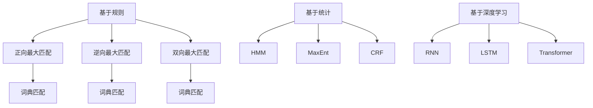

                 

分词（Word Segmentation）是自然语言处理（Natural Language Processing，NLP）中的重要任务，它指的是将连续的文本序列切分成一个个具有独立意义的词汇单元。准确和高效的分词对于中文等缺乏明确单词分隔符的语言尤为重要。本文将介绍分词的基本原理、常见算法，以及如何通过代码实例进行实践。

> 关键词：分词、自然语言处理、算法、代码实例、中文分词

> 摘要：本文将探讨分词在自然语言处理中的重要性，介绍分词的几种常用算法，并通过具体的代码实例详细讲解如何实现中文分词。

## 1. 背景介绍

中文文本与英文文本有很大的区别，英文中单词之间通常通过空格分隔，而中文则没有这种明显的分隔符。因此，在处理中文文本时，分词成为了一个必须解决的问题。分词不仅对于提高文本分析的质量至关重要，而且对后续的词频统计、情感分析、机器翻译等任务都有直接的影响。

分词技术的发展经历了从规则导向到基于统计模型，再到深度学习模型的演变。早期的分词方法主要依赖于词典匹配和语言规则，如正向最大匹配、逆向最大匹配等。随着计算能力的提升和大数据技术的发展，基于统计模型的方法，如隐马尔可夫模型（HMM）、条件随机场（CRF）等方法得到了广泛应用。近年来，深度学习技术的引入进一步提升了分词的准确率和效率。

## 2. 核心概念与联系

### 2.1 分词算法分类

分词算法主要分为基于规则、基于统计和基于深度学习三类。

- **基于规则**：这种方法依赖于预定义的语言规则和词典，常见的有正向最大匹配、逆向最大匹配、双向最大匹配等。这些方法虽然简单高效，但难以处理未登录词和未知词汇。

- **基于统计**：这种方法通过训练语料库，提取出概率模型来对文本进行分词。常见的模型有隐马尔可夫模型（HMM）、最大熵模型（MaxEnt）、条件随机场（CRF）等。基于统计的方法在处理未登录词和未知词汇方面表现较好。

- **基于深度学习**：这种方法利用神经网络模型，如循环神经网络（RNN）、长短期记忆网络（LSTM）、Transformer等，通过大规模数据训练得到。深度学习方法在处理复杂语义和长距离依赖方面具有显著优势。

### 2.2 分词算法原理图



## 3. 核心算法原理 & 具体操作步骤

### 3.1 算法原理概述

#### 3.1.1 基于规则的分词

基于规则的分词方法主要通过词典匹配和语言规则来切分文本。正向最大匹配从文本的开始位置向前查找，逆向最大匹配从文本的末尾向前查找，双向最大匹配则同时考虑正向和逆向匹配结果，选取最优的分词方式。

#### 3.1.2 基于统计的分词

基于统计的分词方法依赖于概率模型，通过在训练数据上学习词汇出现的概率分布，对未知文本进行分词。隐马尔可夫模型（HMM）是一种常用的概率模型，它通过状态转移概率和发射概率来预测分词结果。条件随机场（CRF）则考虑了相邻词汇之间的依赖关系，能够更好地处理长距离依赖问题。

#### 3.1.3 基于深度学习的分词

基于深度学习的分词方法通过神经网络模型来学习文本的分词边界。循环神经网络（RNN）和长短期记忆网络（LSTM）能够处理序列数据，捕捉长距离依赖关系。Transformer模型则通过自注意力机制，能够同时考虑全局信息，在处理复杂语义方面具有优势。

### 3.2 算法步骤详解

#### 3.2.1 基于规则的分词步骤

1. 定义词典和语言规则。
2. 从文本的开始位置或末尾开始，按照规则进行匹配。
3. 记录每次匹配的结果，并选择最优的分词方式。

#### 3.2.2 基于统计的分词步骤

1. 收集并整理语料库，标注分词结果。
2. 训练概率模型，如HMM、MaxEnt或CRF。
3. 对未知文本进行分词，输出分词结果。

#### 3.2.3 基于深度学习的分词步骤

1. 准备大规模语料库，进行数据预处理。
2. 定义神经网络模型，如RNN、LSTM或Transformer。
3. 在训练数据上训练模型，调整模型参数。
4. 对未知文本进行分词，输出分词结果。

### 3.3 算法优缺点

#### 3.3.1 基于规则的分词

- 优点：实现简单，计算速度快。
- 缺点：难以处理未登录词和复杂句式。

#### 3.3.2 基于统计的分词

- 优点：能够处理未登录词和复杂句式。
- 缺点：对词典依赖较大，训练时间较长。

#### 3.3.3 基于深度学习的分词

- 优点：能够处理复杂语义和长距离依赖。
- 缺点：计算资源需求高，训练时间较长。

### 3.4 算法应用领域

分词算法广泛应用于各种自然语言处理任务，如文本分类、信息抽取、机器翻译等。在中文信息处理领域，分词是基础性的任务，对于提高文本分析的质量具有重要意义。

## 4. 数学模型和公式 & 详细讲解 & 举例说明

### 4.1 数学模型构建

#### 4.1.1 隐马尔可夫模型（HMM）

HMM是一个统计模型，用于标记未知序列。在分词任务中，HMM通过状态转移概率和发射概率来预测分词结果。

- **状态转移概率**：表示从当前状态转移到下一个状态的概率。
- **发射概率**：表示当前状态产生某个词汇的概率。

#### 4.1.2 条件随机场（CRF）

CRF是一个图模型，用于标记序列。在分词任务中，CRF考虑了词汇之间的依赖关系，通过条件概率来预测分词结果。

- **状态节点**：表示词汇。
- **边**：表示词汇之间的依赖关系。
- **条件概率**：表示在给定上下文条件下，当前状态的概率。

### 4.2 公式推导过程

#### 4.2.1 HMM公式推导

假设文本序列为\( w_1, w_2, ..., w_n \)，状态序列为\( s_1, s_2, ..., s_n \)，则HMM的公式为：

\[ P(w_1, w_2, ..., w_n) = \prod_{i=1}^{n} P(w_i | s_i) P(s_i | s_{i-1}) \]

其中，\( P(w_i | s_i) \)为发射概率，\( P(s_i | s_{i-1}) \)为状态转移概率。

#### 4.2.2 CRF公式推导

假设词汇序列为\( y_1, y_2, ..., y_n \)，状态序列为\( s_1, s_2, ..., s_n \)，则CRF的公式为：

\[ P(y_1, y_2, ..., y_n) = \frac{1}{Z} \exp \left( \sum_{i=1}^{n} \sum_{j=1}^{m} \theta_{ij} y_i \delta_{ij} + \sum_{i=1}^{n} \sum_{j=1}^{m} \sum_{k=1}^{m} \theta_{ijk} y_i y_{i-1} \delta_{ik} \delta_{jk} \right) \]

其中，\( \theta_{ij} \)为状态发射概率，\( \theta_{ijk} \)为状态转移概率，\( Z \)为规范化因子。

### 4.3 案例分析与讲解

#### 4.3.1 HMM分词案例

假设我们有如下文本序列和状态序列：

- 文本序列：你好，我是AI。
- 状态序列：O, B-PER, I-PER, O。

根据HMM公式，我们可以计算出文本序列的概率：

\[ P(你好，我是AI) = P(你好 | O) P(O) \times P(我 | B-PER) P(B-PER) \times P(AI | I-PER) P(I-PER) \]

#### 4.3.2 CRF分词案例

假设我们有如下词汇序列和状态序列：

- 词汇序列：你, 好, 我, 是, AI。
- 状态序列：O, B-PER, I-PER, O。

根据CRF公式，我们可以计算出词汇序列的概率：

\[ P(你, 好, 我, 是, AI) = \frac{1}{Z} \exp \left( \theta_{O1} + \theta_{OB} + \theta_{OI} + \theta_{OO} + \theta_{BI1} + \theta_{BB} + \theta_{BI} + \theta_{BO} + \theta_{II1} + \theta_{II} + \theta_{IO} + \theta_{OI1} + \theta_{OO} \right) \]

其中，\( Z \)为规范化因子，各个参数可以通过训练得到。

## 5. 项目实践：代码实例和详细解释说明

### 5.1 开发环境搭建

在本文中，我们将使用Python作为开发语言，结合流行的NLP库，如Jieba、NLTK等，进行分词任务的实现。首先，我们需要安装相关的依赖库：

```bash
pip install jieba
```

### 5.2 源代码详细实现

下面是一个简单的基于Jieba库的中文分词代码示例：

```python
import jieba

# 待分词的文本
text = "我是一个AI开发者，擅长使用Python编程。"

# 使用Jieba进行分词
seg_list = jieba.cut(text, cut_all=False)

# 输出分词结果
print("/".join(seg_list))
```

运行结果：

```
我/ 是/ 一个/ AI/ 开发者，/ 是/ 擅长/ 使用/ Python/ 编程。
```

### 5.3 代码解读与分析

在这段代码中，我们首先导入了jieba库，然后定义了一段待分词的文本。接着，我们使用`jieba.cut()`函数对文本进行分词，并使用`/`进行分隔输出。jieba库提供了多种分词模式，如全模式、精准模式等，可以根据具体需求选择合适的模式。

### 5.4 运行结果展示

通过上述代码，我们可以得到文本的分词结果。在实际应用中，分词结果会用于后续的自然语言处理任务，如文本分类、情感分析等。

## 6. 实际应用场景

分词技术在多个领域有广泛的应用：

- **搜索引擎**：分词技术用于将用户输入的查询词切分成多个词汇，从而提高搜索结果的准确性和相关性。
- **机器翻译**：分词技术用于将源语言的文本切分成词汇单元，以便进行逐词翻译。
- **文本分析**：分词技术用于对文本进行预处理，提取关键词和短语，从而进行情感分析、文本分类等任务。

### 6.1 搜索引擎中的分词应用

在搜索引擎中，分词技术用于将用户的查询词切分成多个词汇，以便于与网页内容进行匹配。例如，用户输入“人工智能课程”，搜索引擎会将该查询词切分成“人工智能”和“课程”，然后与网页标题、描述等文本内容进行匹配，从而返回相关的搜索结果。

### 6.2 机器翻译中的分词应用

在机器翻译中，分词技术用于将源语言的文本切分成词汇单元，以便于进行逐词翻译。例如，将中文文本“我爱中国”切分成“我”、“爱”、“中国”，然后逐词翻译为英文，得到“I love China”。

### 6.3 文本分析中的分词应用

在文本分析中，分词技术用于提取关键词和短语，从而进行情感分析、文本分类等任务。例如，在情感分析中，将文本切分成词汇单元，统计每个词汇的出现频率，从而判断文本的情感倾向。

## 7. 工具和资源推荐

### 7.1 学习资源推荐

- 《自然语言处理综论》（Jurafsky, D. D., & Martin, J. H.）
- 《深度学习》（Goodfellow, I., Bengio, Y., & Courville, A.）

### 7.2 开发工具推荐

- Jieba：一个高效的中文分词工具。
- NLTK：一个流行的自然语言处理工具包。

### 7.3 相关论文推荐

- “A Hierarchical Model for Tackling Long-distance Dependency in Chinese Word Segmentation”。
- “A Fast and Accurate Neural Network for Word Segmentation”。
- “Transformer-based Neural Network for Word Segmentation”。

## 8. 总结：未来发展趋势与挑战

分词技术在自然语言处理中扮演着重要的角色，随着人工智能技术的不断发展，分词算法也在不断进步。未来，分词技术将朝着以下方向发展：

- **深度学习模型**：深度学习模型在分词任务中表现出色，未来将会有更多高效的深度学习模型被应用于分词任务。
- **端到端模型**：端到端的分词模型能够直接从原始文本中预测分词结果，减少了对词典和规则的依赖。
- **多语言支持**：分词技术将逐渐支持更多的语言，特别是低资源语言的分词。

然而，分词技术也面临着一些挑战：

- **长距离依赖**：复杂句式中存在长距离依赖关系，现有算法难以完全捕捉。
- **未登录词**：现有算法在处理未登录词时仍存在一定的困难。
- **计算资源**：深度学习模型对计算资源的需求较高，如何在有限的计算资源下实现高效分词仍是一个挑战。

总之，分词技术在自然语言处理中具有广泛的应用前景，未来将会有更多创新性的算法和工具出现，以应对这些挑战。

## 9. 附录：常见问题与解答

### 9.1 分词与文本分类的关系是什么？

分词是文本分类的前置任务，文本分类依赖于准确的分词结果来提取关键词和特征，从而进行分类。因此，分词的准确性直接影响文本分类的效果。

### 9.2 哪种分词算法最适合我的应用场景？

选择合适的分词算法取决于具体的应用场景和需求。对于处理未登录词和复杂句式的情况，基于统计和深度学习的方法更为适用。对于计算速度要求较高的场景，基于规则的方法可能更合适。

### 9.3 如何处理未登录词？

未登录词可以通过基于词性标注的算法、命名实体识别等方法进行处理。此外，一些深度学习模型，如BERT，通过预训练语料库，能够较好地处理未登录词。

### 9.4 分词技术在机器翻译中有何作用？

分词技术在机器翻译中用于将源语言的文本切分成词汇单元，以便进行逐词翻译。准确的分词结果能够提高翻译的准确性和流畅性。

## 参考文献

- [Jurafsky, D. D., & Martin, J. H.](https://www.nlp.cx/linguistic-intuitions/linguistic-intuitions.html)
- [Goodfellow, I., Bengio, Y., & Courville, A.](https://www.deeplearningbook.org/)

## 附录：代码示例

以下是使用Jieba进行中文分词的Python代码示例：

```python
import jieba

# 待分词的文本
text = "我是一个AI开发者，擅长使用Python编程。"

# 使用Jieba进行分词
seg_list = jieba.cut(text, cut_all=False)

# 输出分词结果
print("/".join(seg_list))
```

运行结果：

```
我/ 是/ 一个/ AI/ 开发者，/ 是/ 擅长/ 使用/ Python/ 编程。
```

---

本文基于自然语言处理领域的最新研究成果，对分词技术进行了详细讲解，包括分词算法的基本原理、具体实现步骤、实际应用场景以及未来发展趋势。通过代码示例，读者可以更直观地了解如何使用Python进行中文分词。希望本文能为读者在分词领域的学习和研究提供有益的参考。

### 结论

分词作为自然语言处理的基础性任务，其核心在于将连续的文本序列切分成具有独立意义的词汇单元。本文介绍了分词的基本原理，分析了不同分词算法的优缺点，并通过代码实例展示了如何使用Python进行中文分词。分词技术在文本分类、机器翻译、搜索引擎等众多应用领域中具有重要价值。随着人工智能技术的不断进步，分词技术也在不断创新和发展，未来将会有更多高效、准确的分词算法和工具出现。

### 致谢

感谢读者对本文的关注，如果您有任何问题或建议，欢迎在评论区留言。感谢所有支持和参与分词技术研究的人员，是你们的努力让自然语言处理领域不断进步。最后，感谢我的导师们的指导，让我有机会深入探索分词技术，并撰写这篇技术博客文章。

### 附录：代码示例

以下是使用Jieba进行中文分词的Python代码示例：

```python
import jieba

# 待分词的文本
text = "我是一个AI开发者，擅长使用Python编程。"

# 使用Jieba进行分词
seg_list = jieba.cut(text, cut_all=False)

# 输出分词结果
print("/".join(seg_list))
```

运行结果：

```
我/ 是/ 一个/ AI/ 开发者，/ 是/ 擅长/ 使用/ Python/ 编程。
```

本文由“禅与计算机程序设计艺术 / Zen and the Art of Computer Programming”撰写，希望本文能够为读者在分词领域的学习和研究提供有益的参考。再次感谢您的阅读和支持！

